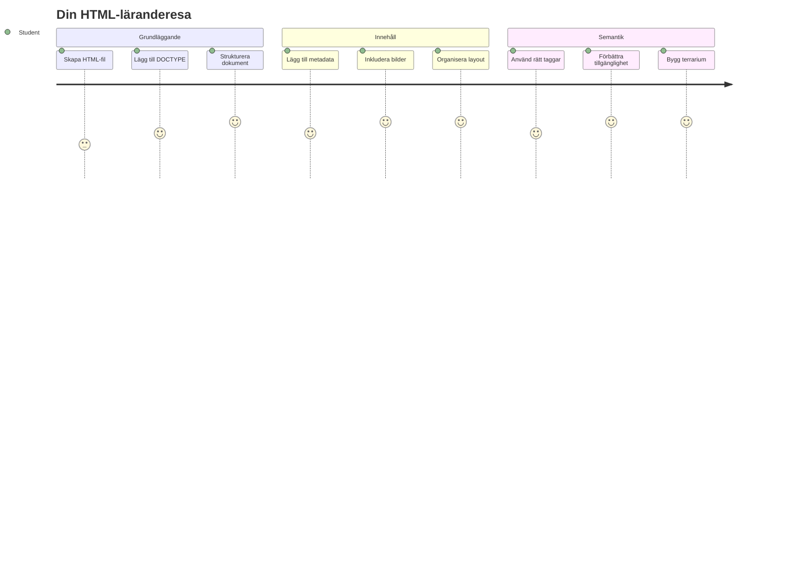
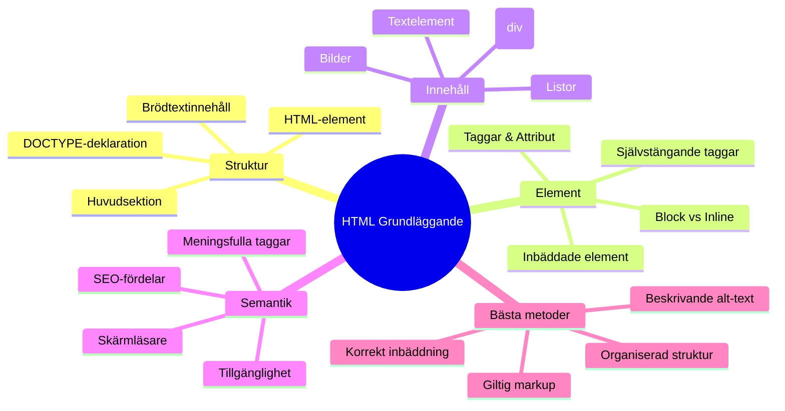
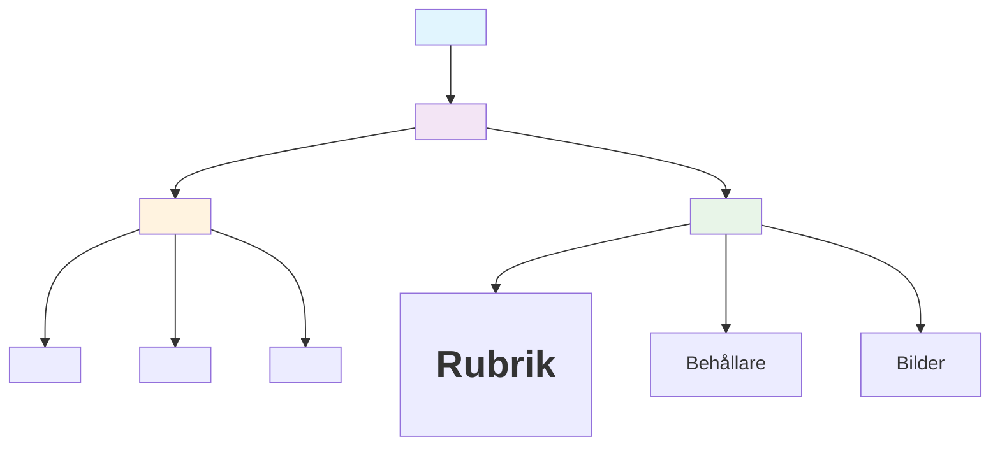
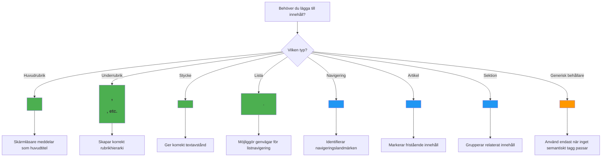
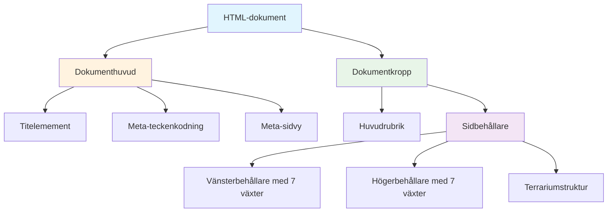
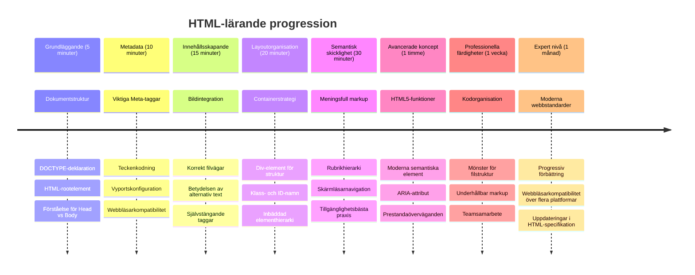

<!--
CO_OP_TRANSLATOR_METADATA:
{
  "original_hash": "3fcfa99c4897e051b558b5eaf1e8cc74",
  "translation_date": "2026-01-06T23:09:01+00:00",
  "source_file": "3-terrarium/1-intro-to-html/README.md",
  "language_code": "sv"
}
-->
# Terrarium Project Del 1: Introduktion till HTML



> Sketchnote av [Tomomi Imura](https://twitter.com/girlie_mac)

HTML, eller HyperText Markup Language, är grunden för varje webbplats du någonsin besökt. Tänk på HTML som skelettet som ger struktur åt webbsidor – det definierar var innehåll ska placeras, hur det organiseras och vad varje del representerar. Medan CSS senare kommer att "klä upp" din HTML med färger och layouter, och JavaScript kommer att ge liv åt den med interaktivitet, tillhandahåller HTML den grundläggande strukturen som gör allt annat möjligt.

I den här lektionen kommer du att skapa HTML-strukturen för ett virtuellt terrariumgränssnitt. Det här praktiska projektet kommer att lära dig grundläggande HTML-koncept samtidigt som du bygger något visuellt engagerande. Du kommer att lära dig hur du organiserar innehåll med hjälp av semantiska element, arbetar med bilder och skapar grunden för en interaktiv webbapplikation.

I slutet av denna lektion kommer du att ha en fungerande HTML-sida som visar växtbilder organiserade i kolumner, redo att stylas i nästa lektion. Oroa dig inte om det ser grundläggande ut till en början – det är precis så HTML ska vara innan CSS lägger till det visuella putsningen.


## För-kurs Quiz

[För-kurs quiz](https://ff-quizzes.netlify.app/web/quiz/15)

> 📺 **Titta och lär dig**: Kolla in denna hjälpsamma videogenomgång
> 
> [](https://www.youtube.com/watch?v=1TvxJKBzhyQ)

## Sätta upp ditt projekt

Innan vi dyker in i HTML-kod, låt oss skapa en ordnad arbetsyta för ditt terrariumprojekt. Att skapa en organiserad mappstruktur från början är en avgörande vana som kommer att gynna dig genom hela din webbapputvecklingsresa.

### Uppgift: Skapa din projektstruktur

Du kommer att skapa en dedikerad mapp för ditt terrariumprojekt och lägga till din första HTML-fil. Här är två sätt du kan använda:

**Alternativ 1: Använda Visual Studio Code**
1. Öppna Visual Studio Code
2. Klicka på "File" → "Open Folder" eller använd `Ctrl+K, Ctrl+O` (Windows/Linux) eller `Cmd+K, Cmd+O` (Mac)
3. Skapa en ny mapp som heter `terrarium` och välj den
4. I Explorerpanelen klicka på ikonen "New File"
5. Namnge din fil `index.html`


**Alternativ 2: Använda terminalkommandon**
```bash
mkdir terrarium
cd terrarium
touch index.html
code index.html
```

**Det här uppnår dessa kommandon:**
- **Skapar** en ny katalog som heter `terrarium` för ditt projekt
- **Navigerar** in i terrarium-katalogen 
- **Skapar** en tom `index.html`-fil
- **Öppnar** filen i Visual Studio Code för redigering

> 💡 **Proffstips**: Filnamnet `index.html` är speciellt inom webbutveckling. När någon besöker en webbplats letar webbläsare automatiskt efter `index.html` som standardsida att visa. Det betyder att en URL som `https://mysite.com/projects/` automatiskt kommer att servera `index.html`-filen från `projects`-mappen utan att du behöver ange filnamnet i URL:en.

## Förstå HTML-dokumentstruktur

Varje HTML-dokument följer en specifik struktur som webbläsare behöver förstå för att visa korrekt. Tänk på denna struktur som ett formellt brev – det har obligatoriska element i en viss ordning som hjälper mottagaren (i det här fallet webbläsaren) att bearbeta innehållet ordentligt.


Låt oss börja med att lägga till den grundläggande basen som varje HTML-dokument behöver.

### DOCTYPE-deklarationen och rootelementet

De första två raderna i en HTML-fil fungerar som dokumentets "introduktion" till webbläsaren:

```html
<!DOCTYPE html>
<html></html>
```

**Så här fungerar denna kod:**
- **Deklarerar** dokumenttypen som HTML5 med `<!DOCTYPE html>`
- **Skapar** rootelementet `<html>` som kommer innehålla allt innehåll på sidan
- **Etablerar** moderna webbstandarder för korrekt rendering i webbläsare
- **Säkerställer** konsekvent visning över olika webbläsare och enheter

> 💡 **Tips i VS Code**: Håll muspekaren över någon HTML-tagg i VS Code för att se hjälpsam information från MDN Web Docs, inklusive användningsexempel och webbläsarkompatibilitet.

> 📚 **Läs mer**: DOCTYPE-deklarationen förhindrar att webbläsare går in i "quirks mode", som användes för att stödja väldigt gamla webbplatser. Modern webbutveckling använder den enkla `<!DOCTYPE html>`-deklarationen för att säkerställa [standardkompatibel rendering](https://developer.mozilla.org/docs/Web/HTML/Quirks_Mode_and_Standards_Mode).

### 🔄 **Pedagogisk kontroll**
**Pausa och reflektera**: Innan du fortsätter, se till att du förstår:
- ✅ Varför varje HTML-dokument behöver en DOCTYPE-deklaration
- ✅ Vad rootelementet `<html>` innehåller
- ✅ Hur denna struktur hjälper webbläsare att rendera sidor korrekt

**Snabb självtest**: Kan du förklara med egna ord vad "standardkompatibel rendering" betyder?

## Lägga till viktig dokumentmetadata

`<head>`-sektionen i ett HTML-dokument innehåller avgörande information som webbläsare och sökmotorer behöver, men som besökare inte ser direkt på sidan. Tänk på det som "bakom scenen"-information som hjälper din webbsida att fungera korrekt och visas rätt på olika enheter och plattformar.

Denna metadata berättar för webbläsare hur sidan ska visas, vilken teckenkodning som ska användas och hur olika skärmstorlekar ska hanteras – allt viktigt för att skapa professionella, tillgängliga webbsidor.

### Uppgift: Lägg till dokumentets head

Infoga denna `<head>`-sektion mellan dina öppnande och stängande `<html>`-taggar:

```html
<head>
	<title>Welcome to my Virtual Terrarium</title>
	<meta charset="utf-8" />
	<meta http-equiv="X-UA-Compatible" content="IE=edge" />
	<meta name="viewport" content="width=device-width, initial-scale=1" />
</head>
```

**Så här fungerar varje element:**
- **Sätter** sidans titel som visas i webbläsarflikar och sökresultat
- **Specificerar** UTF-8 teckenkodning för korrekt visning av text globalt
- **Säkerställer** kompatibilitet med moderna versioner av Internet Explorer
- **Konfigurerar** responsiv design genom att anpassa viewport till enhetens bredd
- **Kontrollerar** initial zoomnivå för att visa innehållet i naturlig storlek

> 🤔 **Tänk på detta**: Vad skulle hända om du satte en viewport-meta-tagg som denna: `<meta name="viewport" content="width=600">`? Det skulle tvinga sidan att alltid vara 600 pixlar bred, vilket förstör responsiv design! Läs mer om [korrekt konfiguration av viewport](https://developer.mozilla.org/docs/Web/HTML/Viewport_meta_tag).

## Bygga dokumentets body

`<body>`-elementet innehåller allt synligt innehåll på din webbsida – allt som användare kommer att se och interagera med. Medan `<head>`-sektionen gav instruktioner till webbläsaren, innehåller `<body>` det faktiska innehållet: text, bilder, knappar och andra element som skapar ditt användargränssnitt.

Låt oss lägga till body-strukturen och förstå hur HTML-taggar arbetar tillsammans för att skapa meningsfullt innehåll.

### Förstå HTML-tagstruktur

HTML använder parvisa taggar för att definiera element. De flesta taggar har en öppningstagg som `<p>` och en stängningstagg som `</p>`, med innehåll emellan: `<p>Hej, världen!</p>`. Det skapar ett stycke som innehåller texten "Hej, världen!".

### Uppgift: Lägg till body-elementet

Uppdatera din HTML-fil för att inkludera `<body>`-elementet:

```html
<!DOCTYPE html>
<html>
	<head>
		<title>Welcome to my Virtual Terrarium</title>
		<meta charset="utf-8" />
		<meta http-equiv="X-UA-Compatible" content="IE=edge" />
		<meta name="viewport" content="width=device-width, initial-scale=1" />
	</head>
	<body></body>
</html>
```

**Denna kompletta struktur ger:**
- **Etablerar** den grundläggande HTML5-dokumentstrukturen
- **Inkluderar** viktig metadata för korrekt rendering i webbläsare
- **Skapar** en tom body redo för ditt synliga innehåll
- **Följer** moderna webbpraksiser

Nu är du redo att lägga till de synliga elementen i ditt terrarium. Vi kommer att använda `<div>`-element som behållare för att organisera olika innehållssektioner, och ``-element för att visa växtbilderna.

### Arbeta med bilder och layoutbehållare

Bilder är speciella i HTML eftersom de använder "självstängande" taggar. Till skillnad från element som `<p></p>` som omsluter innehåll, innehåller ``-taggen all information den behöver inom taggen själv via attribut som `src` för bildfilens sökväg och `alt` för tillgänglighet.

Innan vi lägger till bilder i din HTML behöver du organisera dina projektfiler korrekt genom att skapa en bilder-mapp och lägga till växtgrafiken.

**Börja med att ställa in dina bilder:**
1. Skapa en mapp som heter `images` inne i din terrariummapp
2. Ladda ner växtbilderna från [lösningsmappen](../../../../3-terrarium/solution/images) (14 växtbilder totalt)
3. Kopiera alla växtbilder till din nya `images`-mapp

### Uppgift: Skapa växtvisningslayout

Lägg nu till växtbilder organiserade i två kolumner mellan dina `<body></body>`-taggar:

```html
<div id="page">
	<div id="left-container" class="container">
		<div class="plant-holder">
			
		</div>
		<div class="plant-holder">
			
		</div>
		<div class="plant-holder">
			
		</div>
		<div class="plant-holder">
			
		</div>
		<div class="plant-holder">
			
		</div>
		<div class="plant-holder">
			
		</div>
		<div class="plant-holder">
			
		</div>
	</div>
	<div id="right-container" class="container">
		<div class="plant-holder">
			
		</div>
		<div class="plant-holder">
			
		</div>
		<div class="plant-holder">
			
		</div>
		<div class="plant-holder">
			
		</div>
		<div class="plant-holder">
			
		</div>
		<div class="plant-holder">
			
		</div>
		<div class="plant-holder">
			
		</div>
	</div>
</div>
```

**Steg för steg, här händer detta i koden:**
- **Skapar** en huvudbehållare för sidan med `id="page"` som håller allt innehåll
- **Etablerar** två kolumnbehållare: `left-container` och `right-container`
- **Organiserar** 7 växter i vänsterkolumnen och 7 växter i högerkolumnen
- **Omsluter** varje växtbild i en `plant-holder`-div för individuell placering
- **Tillämpa** konsekventa klassnamn för CSS-styling i nästa lektion
- **Tilldelar** unika ID:n till varje växtbild för JavaScript-interaktion senare
- **Inkluderar** korrekta sökvägar till bilder-mappen

> 🤔 **Fundera på detta**: Notera att alla bilder för närvarande har samma alt-text "plant". Det är inte optimalt för tillgänglighet. Skärmläsaranvändare skulle höra "plant" 14 gånger utan att veta vilken specifik växt varje bild visar. Kan du tänka dig bättre, mer beskrivande alt-texter för varje bild?

> 📝 **HTML-elementtyper**: `<div>`-element är "blocknivå" och tar upp full bredd, medan `<span>`-element är "inline" och tar bara upp nödvändig bredd. Vad tror du skulle hända om du ändrade alla dessa `<div>`-taggar till `<span>`-taggar?

### 🔄 **Pedagogisk kontroll**
**Strukturförståelse**: Ta en stund att granska din HTML-struktur:
- ✅ Kan du identifiera huvudbehållarna i din layout?
- ✅ Förstår du varför varje bild har ett unikt ID?
- ✅ Hur skulle du beskriva syftet med `plant-holder`-divarna?

**Visuell inspektion**: Öppna din HTML-fil i en webbläsare. Du bör se:
- En grundläggande lista med växtbilder
- Bilder organiserade i två kolumner
- Enkel, ostylad layout

**Kom ihåg**: Det här enkla utseendet är precis hur HTML ska se ut innan CSS-styling!

Med denna markup tillagd kommer växterna att visas på skärmen, även om de inte ser polerade ut än – det är det CSS är till för i nästa lektion! För nu har du en stabil HTML-grund som ordentligt organiserar ditt innehåll och följer tillgänglighetsbästa praxis.

## Använda semantisk HTML för tillgänglighet

Semantisk HTML innebär att välja HTML-element baserat på deras betydelse och syfte, inte bara deras utseende. När du använder semantisk markup kommunicerar du innehållets struktur och innebörd till webbläsare, sökmotorer och hjälpmedelstekniker som skärmläsare.


Denna metod gör dina webbplatser mer tillgängliga för användare med funktionsnedsättningar och hjälper sökmotorer att bättre förstå ditt innehåll. Det är en grundläggande princip i modern webbutveckling som skapar bättre upplevelser för alla.

### Lägg till en semantisk sidtitel

Låt oss lägga till en korrekt rubrik till din terrariumsida. Infoga denna rad direkt efter din öppnande `<body>`-tagg:

```html
<h1>My Terrarium</h1>
```

**Varför semantisk markup är viktig:**
- **Hjälper** skärmläsare att navigera och förstå sidans struktur
- **Förbättrar** sökmotoroptimering (SEO) genom att klargöra innehållshierarki
- **Ökar** tillgängligheten för användare med synnedsättning eller kognitiva skillnader
- **Skapar** bättre användarupplevelser på alla enheter och plattformar
- **Följer** webbstandarder och bästa praxis för professionell utveckling

**Exempel på semantiska vs. icke-sematiska val:**

| Syfte | ✅ Semantiskt val | ❌ Icke-semantiskt val |
|---------|-------------------|------------------------|
| Huvudrubrik | `<h1>Title</h1>` | `<div class="big-text">Title</div>` |
| Navigering | `<nav><ul><li></li></ul></nav>` | `<div class="menu"><div></div></div>` |
| Knapp | `<button>Click me</button>` | `<span onclick="...">Click me</span>` |
| Artikelinnehåll | `<article><p></p></article>` | `<div class="content"><div></div></div>` |

> 🎥 **Se det i praktiken**: Titta på [hur skärmläsare interagerar med webbsidor](https://www.youtube.com/watch?v=OUDV1gqs9GA) för att förstå varför semantisk markup är avgörande för tillgänglighet. Lägg märke till hur korrekt HTML-struktur hjälper användare att navigera effektivt.

## Skapa terrariumbehållaren

Låt oss nu lägga till HTML-strukturen för själva terrariet – glasbehållaren där växter så småningom kommer att placeras. Denna sektion visar ett viktigt koncept: HTML ger struktur, men utan CSS-styling kommer dessa element inte synas än.

Terrarium-markupen använder beskrivande klassnamn som gör CSS-stylingen intuitiv och lätt att underhålla i nästa lektion.

### Uppgift: Lägg till terrariumstrukturen

Infoga denna markup ovanför den sista `</div>`-taggen (innan avslutande taggen för sidbehållaren):

```html
<div id="terrarium">
	<div class="jar-top"></div>
	<div class="jar-walls">
		<div class="jar-glossy-long"></div>
		<div class="jar-glossy-short"></div>
	</div>
	<div class="dirt"></div>
	<div class="jar-bottom"></div>
</div>
```

**Så fungerar denna terrariumstruktur:**
- **Skapar** en huvudterrariumbehållare med ett unikt ID för styling

- **Definierar** separata element för varje visuell komponent (topp, väggar, jord, botten)
- **Inkluderar** nästlade element för glasreflektionseffekter (glansiga element)
- **Använder** beskrivande klassnamn som tydligt anger varje elements syfte
- **Förbereder** strukturen för CSS-styling som ska skapa utseendet av ett glas-terrarie

> 🤔 **Noterar du något?**: Även om du lade till denna markup, ser du inget nytt på sidan! Detta illustrerar perfekt hur HTML tillhandahåller struktur medan CSS ger utseende. Dessa `<div>`-element existerar men har ännu ingen visuell styling – det kommer i nästa lektion!


### 🔄 **Pedagogisk Uppföljning**
**Mästerskap i HTML-struktur**: Innan du går vidare, säkerställ att du kan:
- ✅ Förklara skillnaden mellan HTML-struktur och visuell presentation
- ✅ Identifiera semantiska kontra icke-semantiska HTML-element
- ✅ Beskriva hur korrekt markup gynnar tillgänglighet
- ✅ Känna igen den kompletta dokumentträdsstrukturen

**Testa din förståelse**: Prova att öppna din HTML-fil i en webbläsare med JavaScript avstängt och utan CSS. Detta visar den rena semantiska struktur du skapat!

---

## GitHub Copilot Agent-utmaning

Använd Agent-läget för att slutföra följande utmaning:

**Beskrivning:** Skapa en semantisk HTML-struktur för en sektion om växtvård som kan läggas till i terrarie-projektet.

**Uppdrag:** Skapa en semantisk HTML-sektion med en huvudrubrik "Plant Care Guide", tre delsektioner med rubrikerna "Watering", "Light Requirements" och "Soil Care", var och en innehållande ett stycke med information om växtvård. Använd lämpliga semantiska HTML-taggar som `<section>`, `<h2>`, `<h3>`, och `<p>` för att strukturera innehållet korrekt.

Läs mer om [agentläget](https://code.visualstudio.com/blogs/2025/02/24/introducing-copilot-agent-mode) här.

## Utforska HTML:s historia-utmaning

**Lär dig om webbens utveckling**

HTML har utvecklats betydligt sedan Tim Berners-Lee skapade den första webbläsaren vid CERN 1990. Vissa äldre taggar som `<marquee>` är nu föråldrade eftersom de inte fungerar bra med moderna tillgänglighetsstandarder och responsiva designprinciper.

**Prova detta experiment:**
1. Wrappa temporärt din `<h1>`-titel i en `<marquee>`-tagg: `<marquee><h1>My Terrarium</h1></marquee>`
2. Öppna din sida i en webbläsare och observera den rullande effekten
3. Fundera över varför denna tagg blev föråldrad (tips: tänk på användarupplevelse och tillgänglighet)
4. Ta bort `<marquee>`-taggen och gå tillbaka till semantisk markup

**Reflektionsfrågor:**
- Hur kan en rullande titel påverka användare med synnedsättningar eller känslighet för rörelse?
- Vilka moderna CSS-tekniker kan skapa liknande visuella effekter på ett mer tillgängligt sätt?
- Varför är det viktigt att använda aktuella webbstandarder istället för föråldrade element?

Utforska mer om [föråldrade och deprecated HTML-element](https://developer.mozilla.org/docs/Web/HTML/Element#Obsolete_and_deprecated_elements) för att förstå hur webbstandarder utvecklas för att förbättra användarupplevelsen.


## Quiz efter lektionen

[Quiz efter lektionen](https://ff-quizzes.netlify.app/web/quiz/16)

## Repetition & Självstudier

**Fördjupa din HTML-kunskap**

HTML har varit webben grundpelare i över 30 år och utvecklats från ett enkelt dokumentmarkup-språk till en sofistikerad plattform för att bygga interaktiva applikationer. Att förstå denna utveckling hjälper dig att uppskatta moderna webbstandarder och fatta bättre utvecklingsbeslut.

**Rekommenderade lärvägar:**

1. **HTML:s historia och utveckling**
   - Undersök tidslinjen från HTML 1.0 till HTML5
   - Utforska varför vissa taggar föråldrades (tillgänglighet, mobilvänlighet, underhållbarhet)
   - Undersök nya HTML-funktioner och förslag

2. **Djupdykning i semantisk HTML**
   - Studera den fullständiga listan av [HTML5 semantiska element](https://developer.mozilla.org/docs/Web/HTML/Element)
   - Öva på att identifiera när man ska använda `<article>`, `<section>`, `<aside>`, och `<main>`
   - Lär dig om ARIA-attribut för ökad tillgänglighet

3. **Modern webb-apputveckling**
   - Utforska [hur man bygger responsiva webbplatser](https://docs.microsoft.com/learn/modules/build-simple-website/?WT.mc_id=academic-77807-sagibbon) på Microsoft Learn
   - Förstå hur HTML integreras med CSS och JavaScript
   - Lär dig om webbprestanda och SEO bästa praxis

**Reflektionsfrågor:**
- Vilka föråldrade HTML-taggar upptäckte du, och varför togs de bort?
- Vilka nya HTML-funktioner föreslås för framtida versioner?
- Hur bidrar semantisk HTML till webbens tillgänglighet och SEO?

### ⚡ **Vad du kan göra inom 5 minuter**
- [ ] Öppna DevTools (F12) och inspektera HTML-strukturen på din favoritwebbplats
- [ ] Skapa en enkel HTML-fil med grundläggande taggar: `<h1>`, `<p>`, och ``
- [ ] Validera din HTML med W3C HTML Validator online
- [ ] Lägg till en kommentar i din HTML med `<!-- kommentar -->`

### 🎯 **Vad du kan åstadkomma under denna timme**
- [ ] Avsluta quiz efter lektionen och repetera semantiska HTML-koncept
- [ ] Bygg en enkel webbsida om dig själv med rätt HTML-struktur
- [ ] Experimentera med olika rubriknivåer och textformateringstaggar
- [ ] Lägg till bilder och länkar för att öva multimediaintegration
- [ ] Undersök HTML5-funktioner du inte testat än

### 📅 **Din vecka med HTML**
- [ ] Färdigställ terrarie-projektet med semantisk markup
- [ ] Skapa en tillgänglig webbplats med ARIA-labels och roller
- [ ] Öva formulärskapande med olika input-typer
- [ ] Utforska HTML5-API:er som localStorage eller geolocation
- [ ] Studera responsiv HTML-design och mobil-först strategier
- [ ] Granska andra utvecklares HTML-kod för bästa praxis

### 🌟 **Din månadsresa i webbens grund**
- [ ] Bygg en portföljsida som visar dina HTML-kunskaper
- [ ] Lär dig HTML-templating med ramverk som Handlebars
- [ ] Bidra till open source-projekt genom att förbättra HTML-dokumentationen
- [ ] Bemästra avancerade HTML-koncept som custom elements
- [ ] Integrera HTML med CSS-ramverk och JavaScript-bibliotek
- [ ] Mentorera andra som lär sig HTML-grunderna

## 🎯 Din HTML Mästerskapstidslinje


### 🛠️ Din HTML-verktygslåda sammanfattning

Efter att ha slutfört denna lektion har du nu:
- **Dokumentstruktur**: Komplett HTML5-grund med korrekt DOCTYPE
- **Semantisk markup**: Meningsfulla taggar som förbättrar tillgänglighet och SEO
- **Bildintegration**: Korrekt filorganisation och alt-textrutiner
- **Layout-containrar**: Strategisk användning av divs med beskrivande klassnamn
- **Tillgänglighetsmedvetenhet**: Förståelse för skärmläsarnavigering
- **Moderna standarder**: Aktuella HTML5-metoder och kunskap om föråldrade taggar
- **Projektgrund**: Stabil bas för CSS-styling och JavaScript-interaktivitet

**Nästa steg**: Din HTML-struktur är redo för CSS-styling! Den semantiska grunden du byggt gör nästa lektion mycket lättare att förstå.

## Uppgift

[Öva på din HTML: Skapa en bloggmockup](assignment.md)

---

<!-- CO-OP TRANSLATOR DISCLAIMER START -->
**Ansvarsfriskrivning**:  
Detta dokument har översatts med hjälp av AI-översättningstjänsten [Co-op Translator](https://github.com/Azure/co-op-translator). Även om vi strävar efter noggrannhet, vänligen observera att automatiska översättningar kan innehålla fel eller brister. Det ursprungliga dokumentet på dess modersmål bör betraktas som den auktoritativa källan. För kritisk information rekommenderas professionell mänsklig översättning. Vi ansvarar inte för några missförstånd eller feltolkningar som uppstår till följd av användningen av denna översättning.
<!-- CO-OP TRANSLATOR DISCLAIMER END -->