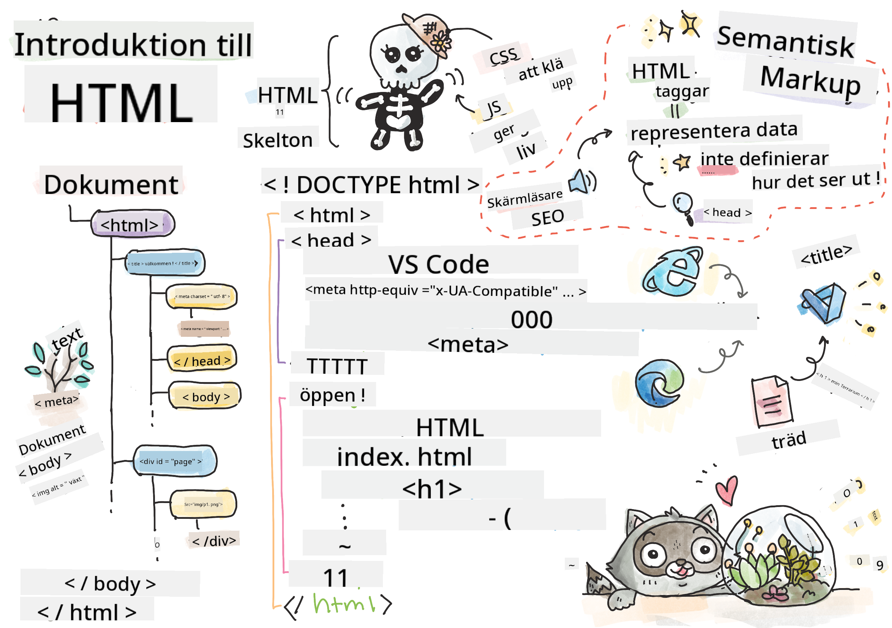
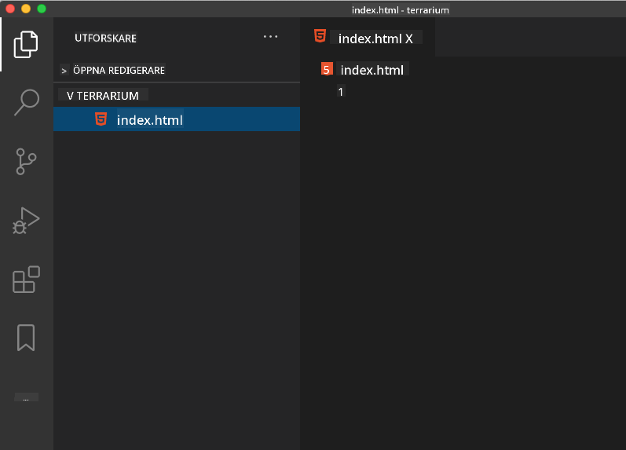

<!--
CO_OP_TRANSLATOR_METADATA:
{
  "original_hash": "89f7f9f800ce7c9f149e98baaae8491a",
  "translation_date": "2025-08-29T07:58:05+00:00",
  "source_file": "3-terrarium/1-intro-to-html/README.md",
  "language_code": "sv"
}
-->
# Terrariumprojekt Del 1: Introduktion till HTML


> Sketchnote av [Tomomi Imura](https://twitter.com/girlie_mac)

## Quiz före föreläsning

[Quiz före föreläsning](https://ff-quizzes.netlify.app/web/quiz/15)

> Titta på videon

> 
> [](https://www.youtube.com/watch?v=1TvxJKBzhyQ)

### Introduktion

HTML, eller HyperText Markup Language, är webben's 'skelett'. Om CSS 'klär upp' din HTML och JavaScript ger den liv, så är HTML kroppen i din webbapplikation. HTML:s syntax speglar till och med den idén, eftersom den innehåller taggar som "head", "body" och "footer".

I denna lektion ska vi använda HTML för att skapa 'skelettet' av vårt virtuella terrariums gränssnitt. Det kommer att ha en titel och tre kolumner: en höger- och en vänsterkolumn där de flyttbara växterna finns, och ett centralt område som kommer att vara det faktiska glasliknande terrariet. I slutet av denna lektion kommer du att kunna se växterna i kolumnerna, men gränssnittet kommer att se lite konstigt ut; oroa dig inte, i nästa avsnitt kommer du att lägga till CSS-stilar för att förbättra utseendet.

### Uppgift

På din dator, skapa en mapp som heter 'terrarium' och inuti den, en fil som heter 'index.html'. Du kan göra detta i Visual Studio Code efter att du har skapat din terrarium-mapp genom att öppna ett nytt VS Code-fönster, klicka på 'öppna mapp' och navigera till din nya mapp. Klicka på den lilla 'fil'-knappen i Explorer-panelen och skapa den nya filen:



Eller

Använd dessa kommandon i din git bash:
* `mkdir terrarium`
* `cd terrarium`
* `touch index.html`
* `code index.html` eller `nano index.html`

> index.html-filer indikerar för en webbläsare att det är standardfilen i en mapp; URL:er som `https://anysite.com/test` kan byggas med en mappstruktur som inkluderar en mapp som heter `test` med `index.html` inuti; `index.html` behöver inte visas i en URL.

---

## DocType och html-taggar

Den första raden i en HTML-fil är dess doctype. Det är lite förvånande att du måste ha denna rad längst upp i filen, men den berättar för äldre webbläsare att sidan ska renderas i standardläge, enligt den aktuella HTML-specifikationen.

> Tips: i VS Code kan du hovra över en tagg och få information om dess användning från MDN Reference-guiderna.

Den andra raden bör vara `<html>`-taggens öppningstag, följt direkt av dess stängningstag `</html>`. Dessa taggar är rot-elementen i ditt gränssnitt.

### Uppgift

Lägg till dessa rader längst upp i din `index.html`-fil:

```HTML
<!DOCTYPE html>
<html></html>
```

✅ Det finns några olika lägen som kan bestämmas genom att ställa in DocType med en frågesträng: [Quirks Mode och Standards Mode](https://developer.mozilla.org/docs/Web/HTML/Quirks_Mode_and_Standards_Mode). Dessa lägen användes för att stödja riktigt gamla webbläsare som inte används så mycket idag (Netscape Navigator 4 och Internet Explorer 5). Du kan hålla dig till standard doctype-deklarationen.

---

## Dokumentets 'head'

Området 'head' i HTML-dokumentet innehåller viktig information om din webbsida, även kallad [metadata](https://developer.mozilla.org/docs/Web/HTML/Element/meta). I vårt fall berättar vi för webbservern som denna sida kommer att skickas till för att renderas, dessa fyra saker:

-   sidans titel
-   sidmetadata inklusive:
    -   'teckenuppsättning', som berättar vilken teckenkodning som används på sidan
    -   webbläsarinformation, inklusive `x-ua-compatible` som indikerar att IE=edge-webbläsaren stöds
    -   information om hur viewporten ska bete sig när den laddas. Att ställa in viewporten till att ha en initial skala på 1 kontrollerar zoomnivån när sidan först laddas.

### Uppgift

Lägg till ett 'head'-block i ditt dokument mellan öppningstaggen och stängningstaggen `<html>`.

```html
<head>
	<title>Welcome to my Virtual Terrarium</title>
	<meta charset="utf-8" />
	<meta http-equiv="X-UA-Compatible" content="IE=edge" />
	<meta name="viewport" content="width=device-width, initial-scale=1" />
</head>
```

✅ Vad skulle hända om du ställde in en viewport meta-tagg som denna: `<meta name="viewport" content="width=600">`? Läs mer om [viewport](https://developer.mozilla.org/docs/Web/HTML/Viewport_meta_tag).

---

## Dokumentets `body`

### HTML-taggar

I HTML lägger du till taggar i din .html-fil för att skapa element på en webbsida. Varje tagg har vanligtvis en öppning och en stängningstag, som detta: `<p>hej</p>` för att indikera ett stycke. Skapa kroppsdelen av ditt gränssnitt genom att lägga till ett par `<body>`-taggar inuti `<html>`-taggarna; din markup ser nu ut så här:

### Uppgift

```html
<!DOCTYPE html>
<html>
	<head>
		<title>Welcome to my Virtual Terrarium</title>
		<meta charset="utf-8" />
		<meta http-equiv="X-UA-Compatible" content="IE=edge" />
		<meta name="viewport" content="width=device-width, initial-scale=1" />
	</head>
	<body></body>
</html>
```

Nu kan du börja bygga din sida. Vanligtvis använder du `<div>`-taggar för att skapa separata element på en sida. Vi kommer att skapa en serie `<div>`-element som kommer att innehålla bilder.

### Bilder

En HTML-tagg som inte behöver en stängningstag är ``-taggen, eftersom den har ett `src`-element som innehåller all information sidan behöver för att rendera objektet.

Skapa en mapp i din app som heter `images` och lägg där alla bilder från [källkodsmappen](../../../../3-terrarium/solution/images); (det finns 14 bilder av växter).

### Uppgift

Lägg till dessa växtbilder i två kolumner mellan `<body></body>`-taggarna:

```html
<div id="page">
	<div id="left-container" class="container">
		<div class="plant-holder">
			
		</div>
		<div class="plant-holder">
			
		</div>
		<div class="plant-holder">
			
		</div>
		<div class="plant-holder">
			
		</div>
		<div class="plant-holder">
			
		</div>
		<div class="plant-holder">
			
		</div>
		<div class="plant-holder">
			
		</div>
	</div>
	<div id="right-container" class="container">
		<div class="plant-holder">
			
		</div>
		<div class="plant-holder">
			
		</div>
		<div class="plant-holder">
			
		</div>
		<div class="plant-holder">
			
		</div>
		<div class="plant-holder">
			
		</div>
		<div class="plant-holder">
			
		</div>
		<div class="plant-holder">
			
		</div>
	</div>
</div>
```

> Notera: Spans vs. Divs. Divs anses vara 'block'-element, och Spans är 'inline'. Vad skulle hända om du ändrade dessa divs till spans?

Med denna markup visas växterna nu på skärmen. Det ser ganska dåligt ut, eftersom de ännu inte är stylade med CSS, och vi kommer att göra det i nästa lektion.

Varje bild har alt-text som visas även om du inte kan se eller rendera en bild. Detta är en viktig attribut att inkludera för tillgänglighet. Lär dig mer om tillgänglighet i framtida lektioner; för nu, kom ihåg att alt-attributet ger alternativ information för en bild om en användare av någon anledning inte kan se den (på grund av långsam anslutning, ett fel i src-attributet, eller om användaren använder en skärmläsare).

✅ Märkte du att varje bild har samma alt-tagg? Är detta bra praxis? Varför eller varför inte? Kan du förbättra denna kod?

---

## Semantisk markup

Generellt är det att föredra att använda meningsfull 'semantik' när du skriver HTML. Vad betyder det? Det betyder att du använder HTML-taggar för att representera typen av data eller interaktion de är designade för. Till exempel bör huvudtiteltexten på en sida använda en `<h1>`-tagg.

Lägg till följande rad precis under din öppningstag `<body>`:

```html
<h1>My Terrarium</h1>
```

Att använda semantisk markup, som att ha rubriker som `<h1>` och oordnade listor som renderas som `<ul>`, hjälper skärmläsare att navigera genom en sida. Generellt bör knappar skrivas som `<button>` och listor som `<li>`. Även om det är _möjligt_ att använda speciellt stylade `<span>`-element med klickhanterare för att imitera knappar, är det bättre för funktionshindrade användare att använda teknologier för att avgöra var på en sida en knapp finns och interagera med den, om elementet visas som en knapp. Av denna anledning, försök att använda semantisk markup så mycket som möjligt.

✅ Ta en titt på en skärmläsare och [hur den interagerar med en webbsida](https://www.youtube.com/watch?v=OUDV1gqs9GA). Kan du se varför icke-semantisk markup kan frustrera användaren?

## Terrariet

Den sista delen av detta gränssnitt innebär att skapa markup som kommer att stylas för att skapa ett terrarium.

### Uppgift:

Lägg till denna markup ovanför den sista `</div>`-taggen:

```html
<div id="terrarium">
	<div class="jar-top"></div>
	<div class="jar-walls">
		<div class="jar-glossy-long"></div>
		<div class="jar-glossy-short"></div>
	</div>
	<div class="dirt"></div>
	<div class="jar-bottom"></div>
</div>
```

✅ Även om du har lagt till denna markup på skärmen, ser du absolut ingenting renderas. Varför?

---

## 🚀Utmaning

Det finns några roliga 'äldre' taggar i HTML som fortfarande är roliga att leka med, även om du inte bör använda föråldrade taggar som [dessa taggar](https://developer.mozilla.org/docs/Web/HTML/Element#Obsolete_and_deprecated_elements) i din markup. Kan du använda den gamla `<marquee>`-taggen för att få h1-titeln att rulla horisontellt? (om du gör det, glöm inte att ta bort den efteråt)

## Quiz efter föreläsning

[Quiz efter föreläsning](https://ff-quizzes.netlify.app/web/quiz/16)

## Granskning & Självstudier

HTML är det 'beprövade och sanna' byggblockssystemet som har hjälpt till att bygga webben till vad den är idag. Lär dig lite om dess historia genom att studera några gamla och nya taggar. Kan du lista ut varför vissa taggar blev föråldrade och andra lades till? Vilka taggar kan introduceras i framtiden?

Lär dig mer om att bygga webbplatser för webben och mobila enheter på [Microsoft Learn](https://docs.microsoft.com/learn/modules/build-simple-website/?WT.mc_id=academic-77807-sagibbon).

## Uppgift

[Öva på din HTML: Bygg en bloggmockup](assignment.md)

---

**Ansvarsfriskrivning**:  
Detta dokument har översatts med hjälp av AI-översättningstjänsten [Co-op Translator](https://github.com/Azure/co-op-translator). Även om vi strävar efter noggrannhet, vänligen notera att automatiska översättningar kan innehålla fel eller felaktigheter. Det ursprungliga dokumentet på dess originalspråk bör betraktas som den auktoritativa källan. För kritisk information rekommenderas professionell mänsklig översättning. Vi ansvarar inte för eventuella missförstånd eller feltolkningar som uppstår vid användning av denna översättning.