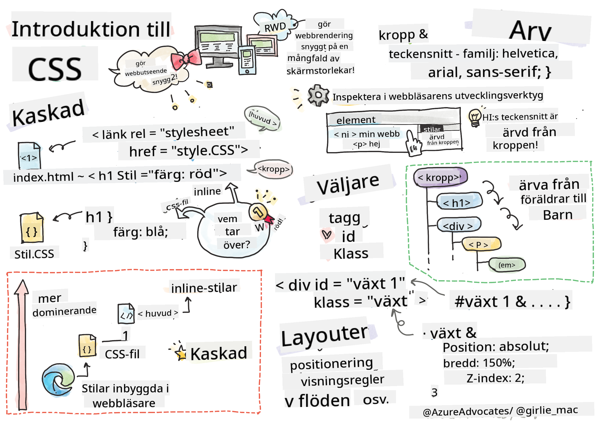
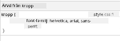

<!--
CO_OP_TRANSLATOR_METADATA:
{
  "original_hash": "e375c2aeb94e2407f2667633d39580bd",
  "translation_date": "2025-08-26T21:36:51+00:00",
  "source_file": "3-terrarium/2-intro-to-css/README.md",
  "language_code": "sv"
}
-->
# Terrariumprojekt Del 2: Introduktion till CSS


> Sketchnote av [Tomomi Imura](https://twitter.com/girlie_mac)

## Förkunskapstest

[Förkunskapstest](https://ashy-river-0debb7803.1.azurestaticapps.net/quiz/17)

### Introduktion

CSS, eller Cascading Style Sheets, löser ett viktigt problem inom webbutveckling: hur man får en webbplats att se snygg ut. Att ge dina appar en stil gör dem mer användarvänliga och visuellt tilltalande; du kan också använda CSS för att skapa Responsiv Webbdesign (RWD) - vilket gör att dina appar ser bra ut oavsett skärmstorlek. CSS handlar inte bara om att få din app att se snygg ut; dess specifikation inkluderar även animationer och transformationer som kan möjliggöra avancerade interaktioner för dina appar. CSS Working Group hjälper till att upprätthålla aktuella CSS-specifikationer; du kan följa deras arbete på [World Wide Web Consortiums webbplats](https://www.w3.org/Style/CSS/members).

> Observera att CSS är ett språk som utvecklas, precis som allt annat på webben, och att inte alla webbläsare stödjer de nyare delarna av specifikationen. Kontrollera alltid dina implementationer genom att konsultera [CanIUse.com](https://caniuse.com).

I den här lektionen ska vi lägga till stilar till vårt online-terrarium och lära oss mer om flera CSS-koncept: kaskad, arv, användning av selektorer, positionering och att använda CSS för att bygga layout. Under processen kommer vi att layouta terrariet och skapa själva terrariet.

### Förutsättningar

Du bör ha HTML för ditt terrarium färdigbyggt och redo att stylas.

> Se video

> 
> [](https://www.youtube.com/watch?v=6yIdOIV9p1I)

### Uppgift

I din terrarium-mapp, skapa en ny fil som heter `style.css`. Importera den filen i `<head>`-sektionen:

```html
<link rel="stylesheet" href="./style.css" />
```

---

## Kaskaden

Cascading Style Sheets bygger på idén att stilar "kaskaderar" så att tillämpningen av en stil styrs av dess prioritet. Stilar som sätts av en webbplatsförfattare har högre prioritet än de som sätts av en webbläsare. Stilar som sätts "inline" har högre prioritet än de som sätts i ett externt stilark.

### Uppgift

Lägg till den inline-stilen "color: red" till din `<h1>`-tagg:

```HTML
<h1 style="color: red">My Terrarium</h1>
```

Lägg sedan till följande kod i din `style.css`-fil:

```CSS
h1 {
 color: blue;
}
```

✅ Vilken färg visas i din webbapp? Varför? Kan du hitta ett sätt att åsidosätta stilar? När skulle du vilja göra detta, eller varför inte?

---

## Arv

Stilar ärvs från en förfäders stil till en efterföljande, så att inbäddade element ärver sina föräldrars stilar.

### Uppgift

Ställ in kroppens font till ett visst typsnitt och kontrollera ett inbäddat elements typsnitt:

```CSS
body {
	font-family: helvetica, arial, sans-serif;
}
```

Öppna webbläsarens konsol till fliken 'Elements' och observera H1:s typsnitt. Det ärver sitt typsnitt från kroppen, som anges inom webbläsaren:



✅ Kan du få en inbäddad stil att ärva en annan egenskap?

---

## CSS-selektorer

### Taggar

Hittills har din `style.css`-fil bara några få taggar stylade, och appen ser ganska konstig ut:

```CSS
body {
	font-family: helvetica, arial, sans-serif;
}

h1 {
	color: #3a241d;
	text-align: center;
}
```

Detta sätt att styla en tagg ger dig kontroll över unika element, men du behöver kontrollera stilarna för många växter i ditt terrarium. För att göra det behöver du använda CSS-selektorer.

### Id:n

Lägg till lite stil för att layouta de vänstra och högra behållarna. Eftersom det bara finns en vänsterbehållare och en högerbehållare, har de fått id:n i markupen. För att styla dem, använd `#`:

```CSS
#left-container {
	background-color: #eee;
	width: 15%;
	left: 0px;
	top: 0px;
	position: absolute;
	height: 100%;
	padding: 10px;
}

#right-container {
	background-color: #eee;
	width: 15%;
	right: 0px;
	top: 0px;
	position: absolute;
	height: 100%;
	padding: 10px;
}
```

Här har du placerat dessa behållare med absolut positionering längst till vänster och höger på skärmen, och använt procent för deras bredd så att de kan skalas för små mobila skärmar.

✅ Den här koden är ganska upprepande, och därmed inte "DRY" (Don't Repeat Yourself); kan du hitta ett bättre sätt att styla dessa id:n, kanske med ett id och en klass? Du skulle behöva ändra markupen och refaktorera CSS:

```html
<div id="left-container" class="container"></div>
```

### Klasser

I exemplet ovan stylade du två unika element på skärmen. Om du vill att stilar ska tillämpas på många element på skärmen kan du använda CSS-klasser. Gör detta för att layouta växterna i de vänstra och högra behållarna.

Observera att varje växt i HTML-markupen har en kombination av id:n och klasser. Id:n här används av JavaScript som du kommer att lägga till senare för att manipulera terrariumväxternas placering. Klasserna däremot ger alla växter en viss stil.

```html
<div class="plant-holder">
	
</div>
```

Lägg till följande i din `style.css`-fil:

```CSS
.plant-holder {
	position: relative;
	height: 13%;
	left: -10px;
}

.plant {
	position: absolute;
	max-width: 150%;
	max-height: 150%;
	z-index: 2;
}
```

Noterbart i detta kodavsnitt är blandningen av relativ och absolut positionering, vilket vi kommer att gå igenom i nästa avsnitt. Titta på hur höjder hanteras med procent:

Du ställer in höjden på växthållaren till 13%, ett bra värde för att säkerställa att alla växter visas i varje vertikal behållare utan att behöva scrolla.

Du ställer in växthållaren att flytta till vänster för att göra växterna mer centrerade inom sin behållare. Bilderna har en stor mängd transparent bakgrund för att göra dem mer dragbara, så de behöver skjutas till vänster för att passa bättre på skärmen.

Sedan ges själva växten en maxbredd på 150%. Detta gör att den kan skalas ner när webbläsaren skalas ner. Prova att ändra storlek på din webbläsare; växterna stannar i sina behållare men skalas ner för att passa.

Också noterbart är användningen av z-index, som styr det relativa höjdläget för ett element (så att växterna sitter ovanpå behållaren och verkar sitta inne i terrariet).

✅ Varför behöver du både en växthållare och en växt-CSS-selektor?

## CSS-positionering

Att blanda positionsegenskaper (det finns statiska, relativa, fasta, absoluta och klistriga positioner) kan vara lite knepigt, men när det görs korrekt ger det dig bra kontroll över elementen på dina sidor.

Absolut positionerade element är positionerade relativt till sina närmaste positionerade förfäder, och om det inte finns några, positioneras de enligt dokumentets kropp.

Relativt positionerade element är positionerade baserat på CSS:s instruktioner för att justera deras placering bort från deras ursprungliga position.

I vårt exempel är `plant-holder` ett relativt positionerat element som är positionerat inom en absolut positionerad behållare. Det resulterande beteendet är att sidobehållarna är fästa till vänster och höger, och växthållaren är inbäddad, justerar sig själv inom sidobehållarna och ger utrymme för växterna att placeras i en vertikal rad.

> Själva `plant` har också absolut positionering, vilket är nödvändigt för att göra den dragbar, som du kommer att upptäcka i nästa lektion.

✅ Experimentera med att byta typer av positionering för sidobehållarna och växthållaren. Vad händer?

## CSS-layout

Nu ska du använda det du har lärt dig för att bygga själva terrariet, allt med hjälp av CSS!

Först, styla `.terrarium` div-barnen som en rundad rektangel med CSS:

```CSS
.jar-walls {
	height: 80%;
	width: 60%;
	background: #d1e1df;
	border-radius: 1rem;
	position: absolute;
	bottom: 0.5%;
	left: 20%;
	opacity: 0.5;
	z-index: 1;
}

.jar-top {
	width: 50%;
	height: 5%;
	background: #d1e1df;
	position: absolute;
	bottom: 80.5%;
	left: 25%;
	opacity: 0.7;
	z-index: 1;
}

.jar-bottom {
	width: 50%;
	height: 1%;
	background: #d1e1df;
	position: absolute;
	bottom: 0%;
	left: 25%;
	opacity: 0.7;
}

.dirt {
	width: 60%;
	height: 5%;
	background: #3a241d;
	position: absolute;
	border-radius: 0 0 1rem 1rem;
	bottom: 1%;
	left: 20%;
	opacity: 0.7;
	z-index: -1;
}
```

Observera användningen av procent här. Om du skalar ner din webbläsare kan du se hur burken också skalas. Lägg också märke till bredd- och höjdprocenten för burkelementen och hur varje element är absolut positionerat i mitten, fäst till botten av visningsfönstret.

Vi använder också `rem` för border-radius, en fontrelativ längd. Läs mer om denna typ av relativ mätning i [CSS-specifikationen](https://www.w3.org/TR/css-values-3/#font-relative-lengths).

✅ Prova att ändra burkfärger och opacitet jämfört med jordens. Vad händer? Varför?

---

## 🚀Utmaning

Lägg till en 'bubbla'-glans till det vänstra nedre området av burken för att få den att se mer glaslik ut. Du kommer att styla `.jar-glossy-long` och `.jar-glossy-short` för att se ut som en reflekterad glans. Så här skulle det se ut:


För att slutföra efterföreläsningstestet, gå igenom denna Learn-modul: [Styla din HTML-app med CSS](https://docs.microsoft.com/learn/modules/build-simple-website/4-css-basics/?WT.mc_id=academic-77807-sagibbon)

## Efterföreläsningstest

[Efterföreläsningstest](https://ashy-river-0debb7803.1.azurestaticapps.net/quiz/18)

## Granskning & Självstudier

CSS verkar bedrägligt enkelt, men det finns många utmaningar när man försöker styla en app perfekt för alla webbläsare och alla skärmstorlekar. CSS-Grid och Flexbox är verktyg som har utvecklats för att göra jobbet lite mer strukturerat och mer pålitligt. Lär dig om dessa verktyg genom att spela [Flexbox Froggy](https://flexboxfroggy.com/) och [Grid Garden](https://codepip.com/games/grid-garden/).

## Uppgift

[CSS Refaktorering](assignment.md)

---

**Ansvarsfriskrivning**:  
Detta dokument har översatts med hjälp av AI-översättningstjänsten [Co-op Translator](https://github.com/Azure/co-op-translator). Även om vi strävar efter noggrannhet, bör du vara medveten om att automatiserade översättningar kan innehålla fel eller felaktigheter. Det ursprungliga dokumentet på dess ursprungliga språk bör betraktas som den auktoritativa källan. För kritisk information rekommenderas professionell mänsklig översättning. Vi ansvarar inte för eventuella missförstånd eller feltolkningar som uppstår vid användning av denna översättning.