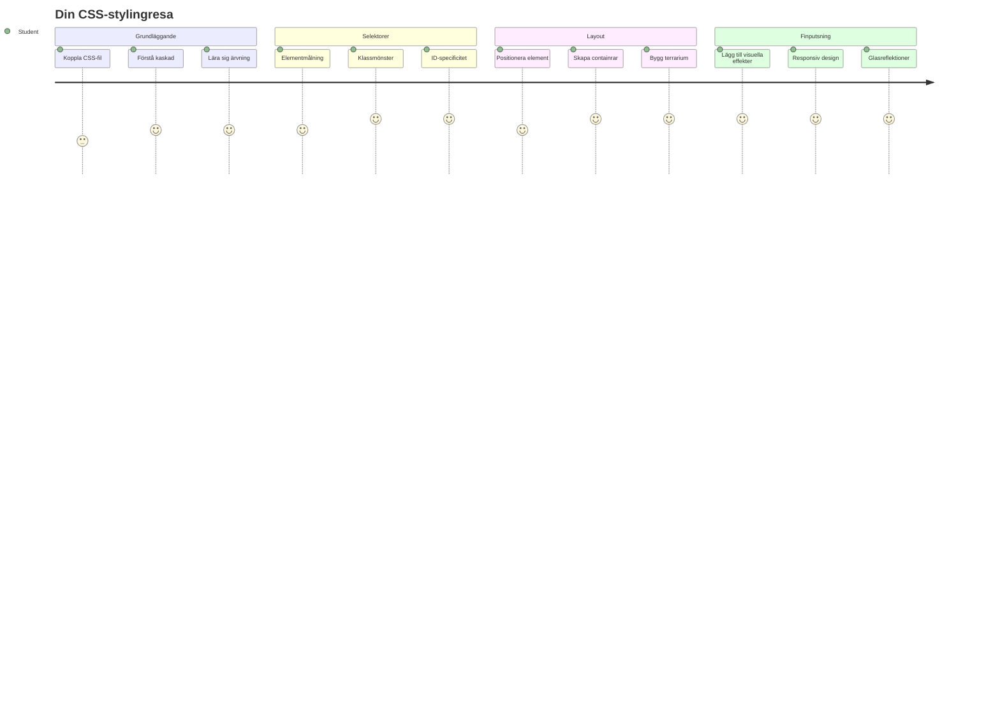
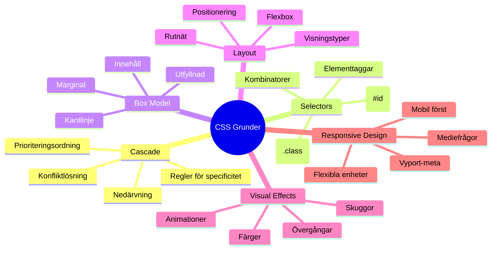
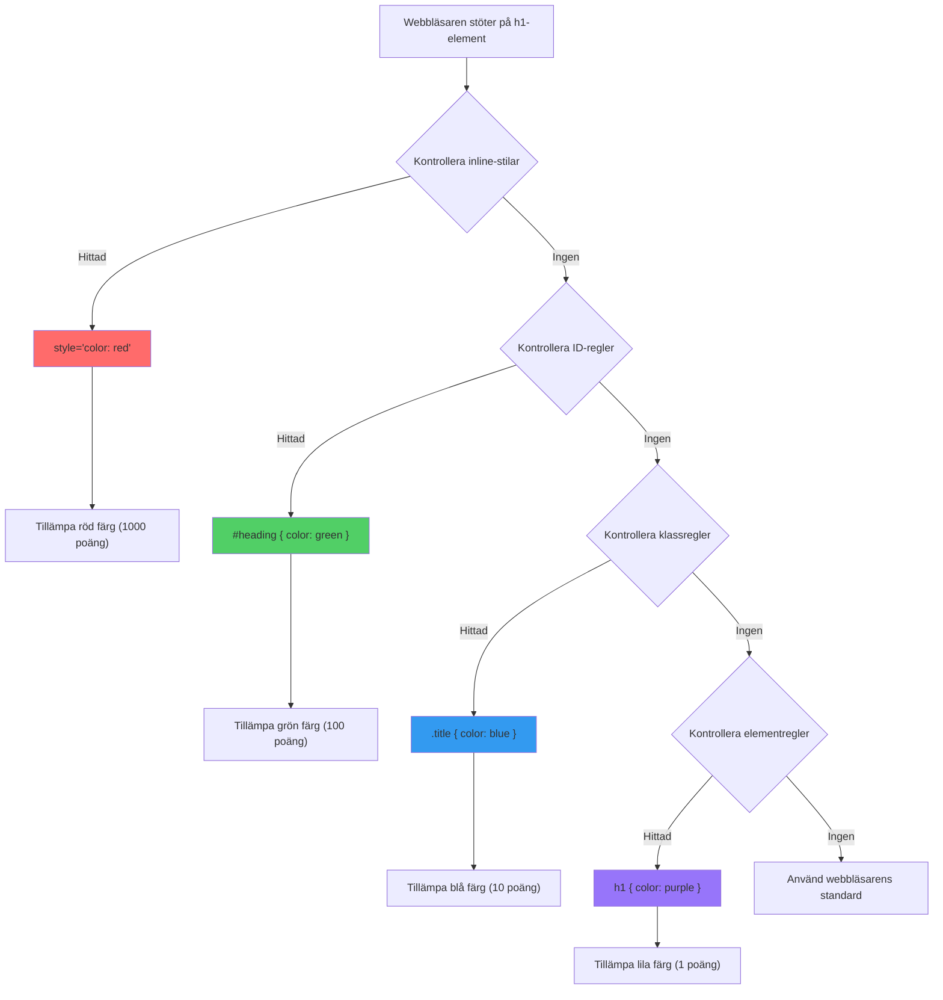
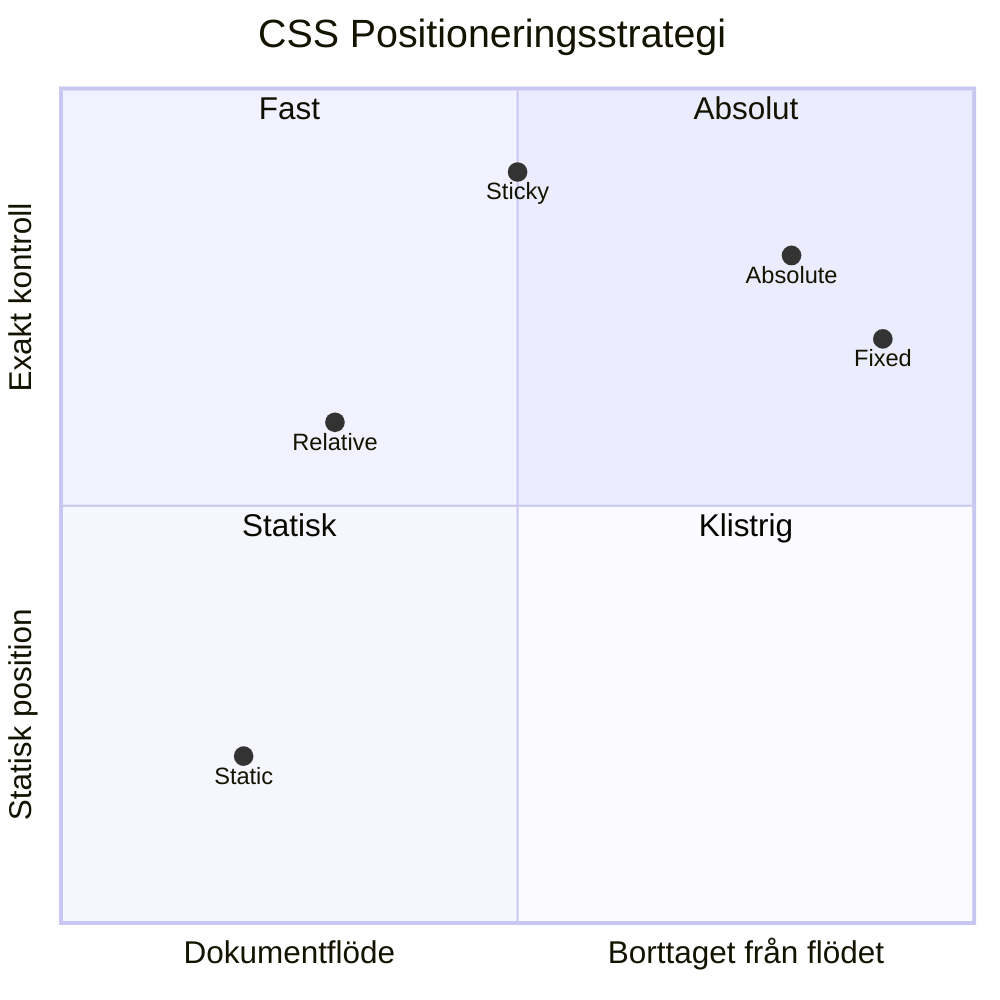
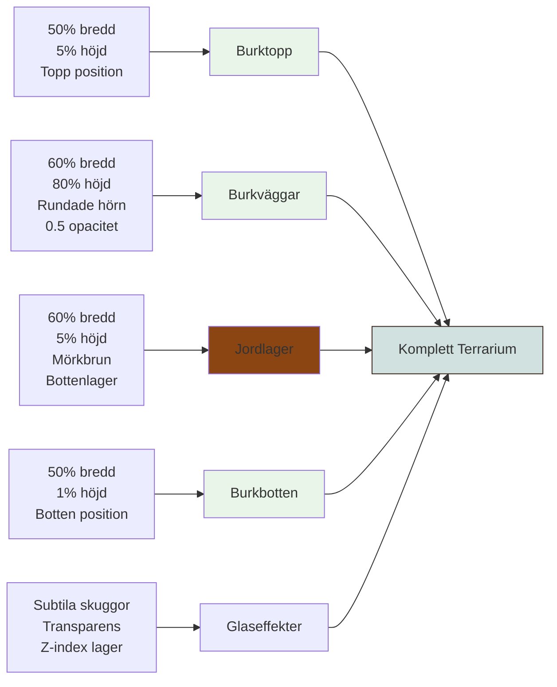
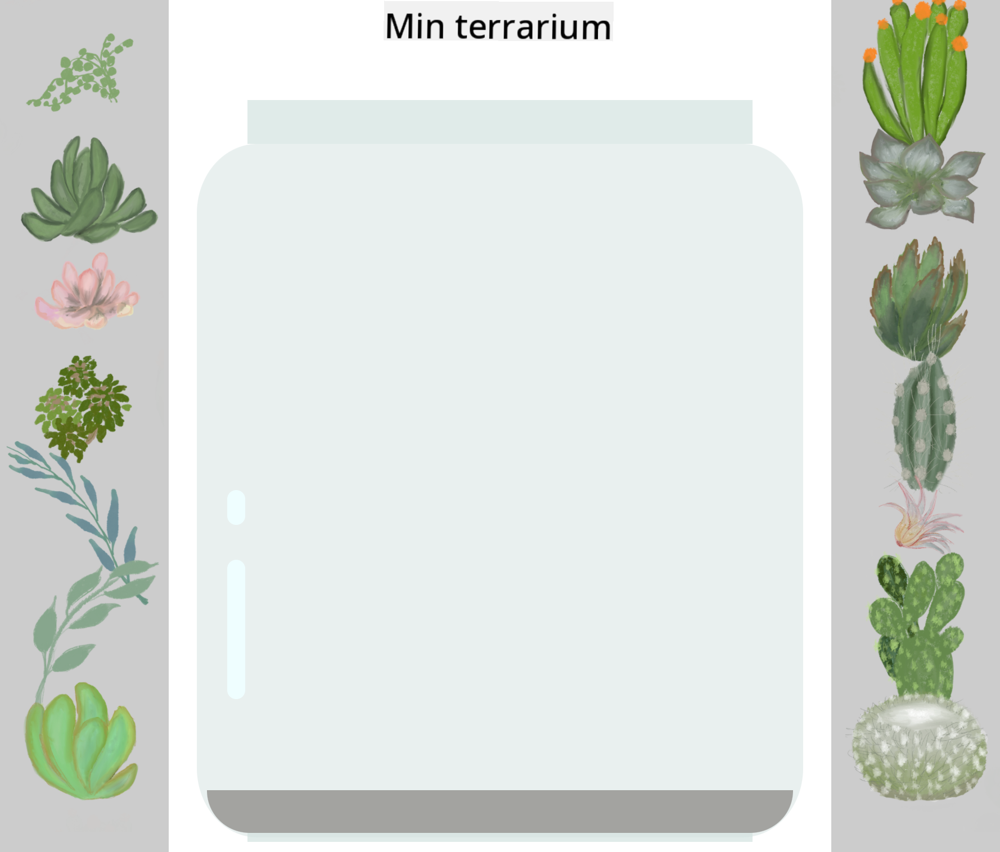
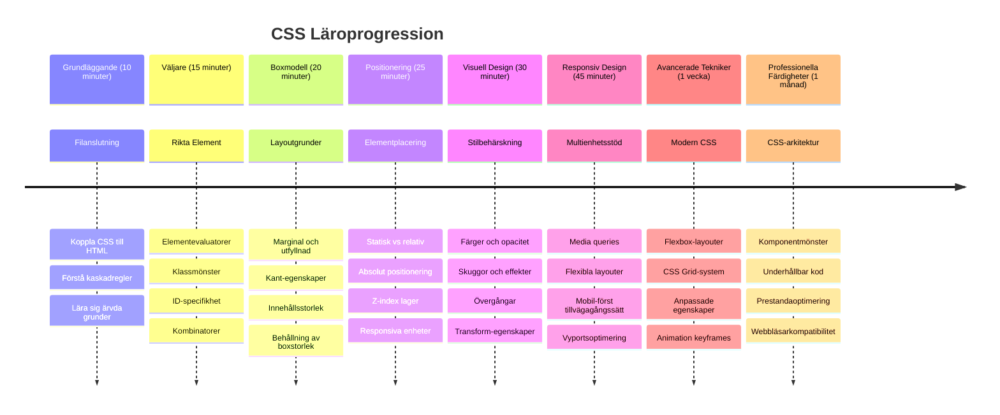

<!--
CO_OP_TRANSLATOR_METADATA:
{
  "original_hash": "e39f3a4e3bcccf94639e3af1248f8a4d",
  "translation_date": "2026-01-06T23:11:54+00:00",
  "source_file": "3-terrarium/2-intro-to-css/README.md",
  "language_code": "sv"
}
-->
# Terrariumprojekt Del 2: Introduktion till CSS



> Sketchnote av [Tomomi Imura](https://twitter.com/girlie_mac)

Kommer du ihåg hur ditt HTML-terrarium såg ganska enkelt ut? CSS är där vi förvandlar den där enkla strukturen till något visuellt tilltalande.

Om HTML är som att bygga stomme till ett hus, är CSS allt som gör att det känns som ett hem – färgval, möbelplacering, belysning och hur rummen flyter ihop. Tänk på hur Versailles-palatset började som en enkel jaktstuga, men noggrann uppmärksamhet på dekoration och layout förvandlade det till en av världens mest magnifika byggnader.

Idag ska vi förvandla ditt terrarium från funktionellt till polerat. Du kommer lära dig hur man positionerar element exakt, gör layouter som anpassar sig till olika skärmstorlekar och skapar det visuella tilltal som gör webbplatser engagerande.

I slutet av lektionen kommer du att se hur strategisk CSS-styling dramatiskt kan förbättra ditt projekt. Låt oss lägga till lite stil till ditt terrarium.


## Förföreläsningsquiz

[Förföreläsningsquiz](https://ff-quizzes.netlify.app/web/quiz/17)

## Komma igång med CSS

CSS ses ofta bara som "att göra saker fina", men det har en mycket bredare funktion. CSS är som att vara regissör för en film – du kontrollerar inte bara hur allt ser ut, utan hur det rör sig, svarar på interaktion och anpassar sig till olika situationer.

Modern CSS är otroligt kapabelt. Du kan skriva kod som automatiskt anpassar layouter för telefoner, surfplattor och datorer. Du kan skapa mjuka animationer som guidar användarens uppmärksamhet dit det behövs. Resultaten kan bli mycket imponerande när allt fungerar tillsammans.

> 💡 **Proffs-tips**: CSS utvecklas ständigt med nya funktioner och möjligheter. Kolla alltid [CanIUse.com](https://caniuse.com) för att verifiera webbläsarstöd för nyare CSS-funktioner innan du använder dem i produktionsprojekt.

**Det här ska vi uppnå i den här lektionen:**
- **Skapa** en komplett visuell design för ditt terrarium med moderna CSS-tekniker
- **Utforska** grundläggande koncept som kaskad, arv och CSS-väljare
- **Genomföra** responsiv positionering och layoutstrategier
- **Bygga** terrariumbehållaren med CSS-former och styling

### Förkunskapskrav

Du bör ha slutfört HTML-strukturen för ditt terrarium från förra lektionen och ha den redo för styling.

> 📺 **Videoresurs**: Kolla in denna hjälpsamma videogenomgång
>
> [](https://www.youtube.com/watch?v=6yIdOIV9p1I)

### Ställa in din CSS-fil

Innan vi kan börja styla måste vi koppla CSS till vår HTML. Denna koppling berättar för webbläsaren var den hittar stylinginstruktionerna för vårt terrarium.

I din terrarium-mapp, skapa en ny fil som heter `style.css` och länka den i ditt HTML-dokuments `<head>`-sektion:

```html
<link rel="stylesheet" href="./style.css" />
```

**Det här gör koden:**
- **Skapar** en koppling mellan dina HTML- och CSS-filer
- **Berättar** för webbläsaren att ladda och använda stilarna från `style.css`
- **Använder** attributet `rel="stylesheet"` för att specificera att detta är en CSS-fil
- **Refererar** till sökvägen med `href="./style.css"`

## Förstå CSS-kaskaden

Har du någonsin undrat varför CSS kallas "Cascading" Style Sheets? Stilar kaskadar ner likt ett vattenfall, och ibland krockar de med varandra.

Tänk på hur militära kommandostrukturer fungerar – en generell order kan säga "alla trupper ska bära grönt", men en särskild order till din enhet kan säga "bär uniform för ceremonin". Den mer specifika instruktionen har företräde. CSS följer samma logik, och genom att förstå denna hierarki blir felsökning mycket enklare.

### Experimentera med kaskadprioritet

Låt oss se kaskaden i praktiken genom att skapa en stilkonflikt. Börja med att lägga till en inline-style på din `<h1>`-tagg:

```html
<h1 style="color: red">My Terrarium</h1>
```

**Det här gör koden:**
- **Applicerar** röd färg direkt på `<h1>`-elementet med inline-styling
- **Använder** `style`-attributet för att bädda in CSS direkt i HTML
- **Skapar** den högst prioriterade stilregeln för detta specifika element

Nästa steg, lägg till denna regel i din `style.css`-fil:

```css
h1 {
  color: blue;
}
```

**Här har vi:**
- **Definierat** en CSS-regel som riktar sig till alla `<h1>`-element
- **Satt** textfärgen till blå via en extern stylesheet
- **Skapat** en mindre prioriterad regel jämfört med inline-stilar

✅ **Kunskapscheck**: Vilken färg visas i din webbapp? Varför vinner den färgen? Kan du tänka dig scenarier där du vill åsidosätta stilar?


> 💡 **CSS Prioriteringsordning (högst till lägst):**
> 1. **Inline-stilar** (style-attribut)
> 2. **ID:n** (#myId)
> 3. **Klassnamn** (.myClass) och attribut
> 4. **Elementväljare** (h1, div, p)
> 5. **Webbläsarstandarder**

## CSS-arv i praktiken

CSS-arv fungerar som genetik – element ärver vissa egenskaper från sina föräldraelement. Om du sätter fontfamilj på body-elementet använder all text inuti automatiskt samma font. Det liknar hur familjen Habsburgs karaktäristiska käke gick i arv genom generationer utan att specificeras för varje individ.

Men inte allt ärvs. Textstilar som typsnitt och färger ärvs, men layoutegenskaper som marginaler och ramar gör det inte. Precis som barn kan ärva fysiska drag men inte sina föräldrars modestyling.

### Observera font-arv

Låt oss se arv i praktiken genom att sätta en fontfamilj på `<body>`-elementet:

```css
body {
  font-family: 'Segoe UI', Tahoma, Geneva, Verdana, sans-serif;
}
```

**Detta händer här:**
- **Sätter** fontfamilj för hela sidan genom att rikta sig till `<body>`-elementet
- **Använder** en font-stack med fallback-alternativ för bättre webbläsarkompatibilitet
- **Applicerar** moderna systemfonter som ser bra ut på olika operativsystem
- **Säkerställer** att alla underordnade element ärver detta typsnitt om det inte specifikt åsidosätts

Öppna webbläsarens utvecklarverktyg (F12), navigera till Elements-fliken och inspektera ditt `<h1>`-element. Du kommer se att det ärver fontfamilj från body:


✅ **Experimentera**: Testa att sätta andra arvbara egenskaper på `<body>` som `color`, `line-height` eller `text-align`. Vad händer med din rubrik och andra element?

> 📝 **Arvbara egenskaper inkluderar**: `color`, `font-family`, `font-size`, `line-height`, `text-align`, `visibility`
>
> **Icke-arvbara egenskaper inkluderar**: `margin`, `padding`, `border`, `width`, `height`, `position`

### 🔄 **Pedagogisk check-in**
**CSS-grundförståelse**: Innan vi går vidare till väljare, se till att du kan:
- ✅ Förklara skillnaden mellan kaskad och arv
- ✅ Förutsäga vilken stil som vinner i en specificitetskonflikt
- ✅ Identifiera vilka egenskaper som ärvs från föräldraelement
- ✅ Korrekt koppla CSS-filer till HTML

**Snabb test**: Om du har dessa stilar, vilken färg får ett `<h1>` inuti en `<div class="special">`?
```css
div { color: blue; }
.special { color: green; }
h1 { color: red; }
```
*Svar: Röd (elementväljaren riktar direkt sig till h1)*

## Bemästra CSS-väljare

CSS-väljare är ditt sätt att rikta in dig på specifika element för styling. De fungerar som att ge exakta instruktioner – istället för att säga "huset", säger du "det blå huset med den röda dörren på Maple Street".

CSS erbjuder olika sätt att vara specifik, och att välja rätt väljare är som att välja rätt verktyg för uppgiften. Ibland vill du styla varje dörr i kvarteret, och ibland bara en specifik dörr.

### Elementväljare (taggar)

Elementväljare riktar sig till HTML-element baserat på deras taggnamn. De är perfekta för att sätta grundläggande stilar som gäller brett på din sida:

```css
body {
  font-family: 'Segoe UI', Tahoma, Geneva, Verdana, sans-serif;
  margin: 0;
  padding: 0;
}

h1 {
  color: #3a241d;
  text-align: center;
  font-size: 2.5rem;
  margin-bottom: 1rem;
}
```

**Förstå dessa stilar:**
- **Sätter** konsekvent typografi över hela sidan med `body`-väljaren
- **Tar bort** webbläsarens standardmarginaler och padding för bättre kontroll
- **Stylar** alla rubrikelement med färg, centrering och avstånd
- **Använder** `rem`-enheter för skalbar och tillgänglig typsnittsstorlek

Medan elementväljare fungerar bra för generell styling, behöver du mer specifika väljare för att styla enskilda komponenter som växterna i ditt terrarium.

### ID-väljare för unika element

ID-väljare använder `#`-symbol och riktar sig till element med specifika `id`-attribut. Eftersom ID:n måste vara unika på en sida är de perfekta för att styla individuella, speciella element som våra vänster- och högerbehållare för växterna.

Låt oss skapa stylingen för terrariets sidobehållare där växterna kommer bo:

```css
#left-container {
  background-color: #f5f5f5;
  width: 15%;
  left: 0;
  top: 0;
  position: absolute;
  height: 100vh;
  padding: 1rem;
  box-sizing: border-box;
}

#right-container {
  background-color: #f5f5f5;
  width: 15%;
  right: 0;
  top: 0;
  position: absolute;
  height: 100vh;
  padding: 1rem;
  box-sizing: border-box;
}
```

**Det här uppnår koden:**
- **Positionerar** behållare vid de yttersta vänster- och högersidorna med `absolute` positionering
- **Använder** `vh` (viewporthöjd) enheter för responsiv höjd som anpassar sig till skärmstorlek
- **Applicerar** `box-sizing: border-box` så padding ingår i total bredd
- **Tar bort** onödiga `px` från nollvärden för renare kod
- **Sätter** en subtil bakgrundsfärg som är mer behaglig än stark grå

✅ **Kodkvalitetsutmaning**: Lägg märke till att denna CSS bryter mot DRY-principen (Don't Repeat Yourself). Kan du refaktorera den med både ett ID och en klass?

**Förbättrad metod:**
```html
<div id="left-container" class="container"></div>
<div id="right-container" class="container"></div>
```

```css
.container {
  background-color: #f5f5f5;
  width: 15%;
  top: 0;
  position: absolute;
  height: 100vh;
  padding: 1rem;
  box-sizing: border-box;
}

#left-container {
  left: 0;
}

#right-container {
  right: 0;
}
```

### Klassväljare för återanvändbara stilar

Klassväljare använder `.`-symbolen och är perfekta när du vill applicera samma stil på flera element. Till skillnad från ID:n kan klasser återanvändas över hela din HTML, vilket gör dem idealiska för konsekventa stilmönster.

I vårt terrarium behöver varje växt liknande styling men även individuell positionering. Vi använder en kombination av klasser för delade stilar och ID:n för unik positionering.

**Här är HTML-strukturen för varje växt:**
```html
<div class="plant-holder">
  
</div>
```

**Viktiga element förklarade:**
- **Använder** `class="plant-holder"` för konsekvent containerstyling för alla växter
- **Applicerar** `class="plant"` för gemensam bildstil och beteende
- **Inkluderar** unikt `id="plant1"` för individuell positionering och JavaScript-interaktion
- **Ger** beskrivande alt-text för skärmläsartillgänglighet

Lägg nu till dessa stilar i din `style.css`-fil:

```css
.plant-holder {
  position: relative;
  height: 13%;
  left: -0.6rem;
}

.plant {
  position: absolute;
  max-width: 150%;
  max-height: 150%;
  z-index: 2;
  transition: transform 0.3s ease;
}

.plant:hover {
  transform: scale(1.05);
}
```

**Detta gör stilarna:**
- **Skapar** relativ positionering för plant-holder för att etablera en positioneringskontext
- **Sätter** varje plant-holder till 13% höjd, så att alla växter får plats vertikalt utan scrollning
- **Flyttar** hållarna något åt vänster för att bättre centrera växterna i sina behållare
- **Tillåter** växterna att skalas responsivt med `max-width` och `max-height`
- **Använder** `z-index` för att placera växterna ovanför andra terrariumelement
- **Lägger till** en subtil hover-effekt med CSS-transitioner för bättre användarinteraktion

✅ **Kritiskt tänkande**: Varför behöver vi både `.plant-holder` och `.plant`-väljare? Vad skulle hända om vi försökte använda bara en?

> 💡 **Designmönster**: Containern (`.plant-holder`) styr layout och positionering, medan innehållet (`.plant`) styr utseende och skalning. Detta separerar och gör koden mer underhållbar och flexibel.

## Förstå CSS-positionering

CSS-positionering är som att vara scenregissör för ett skådespel – du bestämmer var varje skådespelare står och hur de rör sig på scenen. Vissa följer standardformationen, medan andra behöver specifik positionering för dramatisk effekt.

När du förstår positionering blir många layoututmaningar hanterbara. Behöver du en navigeringsbar som stannar överst när användare scrollar? Positionering fixar det. Vill du ha en tooltip som dyker upp på en specifik plats? Det är också positionering.

### De fem positionvärdena


| Positionvärde | Beteende | Användningsfall |
|----------------|----------|----------|
| `static` | Standardflöde, ignorerar top/left/right/bottom | Normal dokumentlayout |
| `relative` | Positionerar relativt till sin normala position | Små justeringar, skapa positioneringskontext |
| `absolute` | Positionerar relativt närmaste positionerade förfader | Exakt placering, överlagringar |
| `fixed` | Positionerar relativt viewport | Navigeringsbarer, flytande element |
| `sticky` | Växlar mellan relative och fixed beroende på scroll | Headers som hänger kvar vid scrollning |

### Positionering i vårt terrarium

Vårt terrarium använder en strategisk kombination av positioneringstyper för att skapa önskad layout:

```css
/* Container positioning */
.container {
  position: absolute; /* Removes from normal flow */
  /* ... other styles ... */
}

/* Plant holder positioning */
.plant-holder {
  position: relative; /* Creates positioning context */
  /* ... other styles ... */
}

/* Plant positioning */
.plant {
  position: absolute; /* Allows precise placement within holder */
  /* ... other styles ... */
}
```

**Så fungerar positioneringsstrategin:**
- **Absoluta containers** är borttagna från normalt dokumentflöde och fästa vid skärmens kanter
- **Relativa plant-hållare** skapar en positioneringskontext men stannar i dokumentflöde
- **Absoluta plant** kan positioneras precist inom sina relativa containers
- **Denna kombination** tillåter växter att staplas vertikalt samtidigt som de kan positioneras individuellt

> 🎯 **Varför detta är viktigt**: `plant`-elementen behöver absolut positionering för att bli drag-and-drop-flyttbara i nästa lektion. Absolut positionering tar bort dem från normalt layoutflöde, vilket möjliggör drag-och-släpp-interaktioner.

✅ **Experimentera**: Testa att ändra positioneringsvärdena och observera resultaten:
- Vad händer om du ändrar `.container` från `absolute` till `relative`?
- Hur ändras layouten om `.plant-holder` använder `absolute` istället för `relative`?
- Vad händer när du byter `.plant` till `relative` positionering?

### 🔄 **Pedagogisk Check-in**
**CSS Positioneringsmästerskap**: Ta en paus för att verifiera din förståelse:
- ✅ Kan du förklara varför växter behöver absolut positionering för drag-och-släpp?
- ✅ Förstår du hur relativa behållare skapar ett positioneringssammanhang?
- ✅ Varför använder sidobehållarna absolut positionering?
- ✅ Vad skulle hända om du helt tog bort positioneringsdeklarationer?

**Verklighetskoppling**: Tänk på hur CSS-positionering speglar verklig layout:
- **Statisk**: Böcker på en hylla (naturlig ordning)
- **Relativ**: Flytta en bok lite men behålla dess plats
- **Absolut**: Placera ett bokmärke på en exakt sidnummer
- **Fast**: En klibbig lapp som syns när du bläddrar i sidor

## Bygga Terrariet med CSS

Nu ska vi bygga en glasburk med enbart CSS – inga bilder eller grafikprogram behövs.

Att skapa realistiskt glas, skuggor och djup med positionering och transparens visar CSS:s visuella möjligheter. Denna teknik speglar hur arkitekter inom Bauhaus-rörelsen använde enkla geometriska former för att skapa komplexa, vackra strukturer. När du förstår dessa principer kommer du känna igen CSS-tekniker bakom många webbdesigner.


### Skapa Glasburkens Komponenter

Låt oss bygga terrariet burk-del för del. Varje del använder absolut positionering och procentbaserade storlekar för responsiv design:

```css
.jar-walls {
  height: 80%;
  width: 60%;
  background: #d1e1df;
  border-radius: 1rem;
  position: absolute;
  bottom: 0.5%;
  left: 20%;
  opacity: 0.5;
  z-index: 1;
  box-shadow: inset 0 0 2rem rgba(0, 0, 0, 0.1);
}

.jar-top {
  width: 50%;
  height: 5%;
  background: #d1e1df;
  position: absolute;
  bottom: 80.5%;
  left: 25%;
  opacity: 0.7;
  z-index: 1;
  border-radius: 0.5rem 0.5rem 0 0;
}

.jar-bottom {
  width: 50%;
  height: 1%;
  background: #d1e1df;
  position: absolute;
  bottom: 0;
  left: 25%;
  opacity: 0.7;
  border-radius: 0 0 0.5rem 0.5rem;
}

.dirt {
  width: 60%;
  height: 5%;
  background: #3a241d;
  position: absolute;
  border-radius: 0 0 1rem 1rem;
  bottom: 1%;
  left: 20%;
  opacity: 0.7;
  z-index: -1;
}
```

**Förstå terrariets konstruktion:**
- **Använder** procentbaserade dimensioner för responsiv skalning över alla skärmstorlekar
- **Positionerar** element absolut för att stapla och justera dem exakt
- **Tillämpa** olika opacitetsvärden för att skapa glasets transparenseffekt
- **Implementerar** lager med `z-index` så att växterna visas inne i burken
- **Lägger till** subtil box-skugga och förfinade hörnradier för mer realistiskt utseende

### Responsiv Design med Procent

Lägg märke till att alla dimensioner använder procent istället för fasta pixelvärden:

**Varför detta är viktigt:**
- **Säkerställer** att terrariet skalar proportionellt på alla skärmstorlekar
- **Bibehåller** de visuella relationerna mellan burkens delar
- **Ger** en konsekvent upplevelse från mobiltelefoner till stora skrivbordsskärmar
- **Tillåter** designen att anpassa sig utan att bryta det visuella upplägget

### CSS-enheter i Praktiken

Vi använder `rem`-enheter för border-radius, vilka skalar i förhållande till rotfonstorleken. Detta skapar mer tillgängliga designer som respekterar användarens fontinställningar. Läs mer om [CSS relativa enheter](https://www.w3.org/TR/css-values-3/#font-relative-lengths) i den officiella specifikationen.

✅ **Visuell experimentering**: Prova att ändra dessa värden och observera effekterna:
- Ändra burkens opacitet från 0.5 till 0.8 – hur påverkar det glasets utseende?
- Justera jordfärgen från `#3a241d` till `#8B4513` – vilken visuell effekt ger det?
- Modifiera jordens `z-index` till 2 – vad händer med lagringen?

### 🔄 **Pedagogisk Check-in**
**Förstå CSS Visuell Design**: Bekräfta din förståelse av visuell CSS:
- ✅ Hur skapar procentbaserade dimensioner responsiv design?
- ✅ Varför skapar opacitet glasets transparenseffekt?
- ✅ Vilken roll spelar z-index i lagring av element?
- ✅ Hur skapar border-radius värden burkens form?

**Designprincip**: Lägg märke till hur vi bygger komplexa visuella element från enkla former:
1. **Rektanglar** → **Rundade rektanglar** → **Burkkomponenter**
2. **Platta färger** → **Opacitet** → **Glaseffekt**
3. **Enskilda element** → **Layerad komposition** → **3D-utseende**

---

## GitHub Copilot Agent Challenge 🚀

Använd Agent-läget för att lösa följande utmaning:

**Beskrivning:** Skapa en CSS-animation som får terrarieväxterna att mjukt svaja fram och tillbaka, vilket simulerar en naturlig bris. Detta hjälper dig att träna CSS-animationer, transformeringar och keyframes samtidigt som terrariets visuella uttryck förbättras.

**Prompt:** Lägg till CSS keyframe-animationer för att få växterna i terrariet att svaja försiktigt från sida till sida. Skapa en svängande animation som roterar varje planta lätt (2-3 grader) åt vänster och höger med en varaktighet på 3-4 sekunder, och applicera den på `.plant`-klassen. Se till att animationen körs oändligt och har en easing-funktion för naturlig rörelse.

Läs mer om [agentläge](https://code.visualstudio.com/blogs/2025/02/24/introducing-copilot-agent-mode) här.

## 🚀 Utmaning: Lägg till Glansreflektioner i Glaset

Redo att förstärka ditt terrarium med realistiska glasreflektioner? Denna teknik lägger till djup och realism i designen.

Du skapar subtila högdagrar som simulerar hur ljus reflekteras från glasytor. Detta liknar hur renässansmålare som Jan van Eyck använde ljus och reflektion för att få målat glas att se tredimensionellt ut. Så här ser målet ut:



**Din uppgift:**
- **Skapa** subtila vita eller ljusa ovala former för glasreflektioner
- **Placera** dem strategiskt på burkens vänstra sida
- **Applicera** lämplig opacitet och suddighet för realistisk ljusreflektion
- **Använd** `border-radius` för att skapa organiska, bubbel-liknande former
- **Experimentera** med gradienter eller box-skuggor för ökad realism

## Quiz efter Föreläsning

[Quiz efter föreläsning](https://ff-quizzes.netlify.app/web/quiz/18)

## Utöka Din CSS-Kunskap

CSS kan kännas komplext i början, men att förstå dessa kärnkoncept ger en solid grund för mer avancerade tekniker.

**Dina nästa CSS-lärdomsområden:**
- **Flexbox** – förenklar justering och fördelning av element
- **CSS Grid** – ger kraftfulla verktyg för att skapa komplexa layouter
- **CSS-variabler** – minskar repetition och förbättrar underhållbarhet
- **Responsiv design** – säkerställer att sajter fungerar bra på olika skärmstorlekar

### Interaktiva Inlärningsresurser

Öva dessa koncept med dessa engagerande, praktiska spel:
- 🐸 [Flexbox Froggy](https://flexboxfroggy.com/) – Bli mästare på Flexbox genom roliga utmaningar
- 🌱 [Grid Garden](https://codepip.com/games/grid-garden/) – Lär dig CSS Grid genom att odla virtuella morötter
- 🎯 [CSS Battle](https://cssbattle.dev/) – Testa dina CSS-färdigheter med kodningsutmaningar

### Ytterligare Lärande

För komplett CSS-grundkunskap, genomför denna Microsoft Learn-modul: [Style your HTML app with CSS](https://docs.microsoft.com/learn/modules/build-simple-website/4-css-basics/?WT.mc_id=academic-77807-sagibbon)

### ⚡ **Vad Du Kan Göra på Nästa 5 Minuter**
- [ ] Öppna DevTools och inspektera CSS-stilar på vilken webbplats som helst med Elements-panelen
- [ ] Skapa en enkel CSS-fil och länka den till en HTML-sida
- [ ] Prova att ändra färger med olika metoder: hex, RGB och namngivna färger
- [ ] Öva boxmodellen genom att lägga till padding och marginal till en div

### 🎯 **Vad Du Kan Uppnå den Närmaste Timmaren**
- [ ] Slutför quizet efter lektionen och repetera CSS-grunder
- [ ] Styla din HTML-sida med typsnitt, färger och avstånd
- [ ] Skapa en enkel layout med flexbox eller grid
- [ ] Experimentera med CSS-transitioner för mjuka effekter
- [ ] Öva responsiv design med media queries

### 📅 **Din Veckolånga CSS-äventyr**
- [ ] Slutför terrarium-stylinguppgiften med kreativ flair
- [ ] Bemästra CSS Grid genom att bygga en fotogalleri-layout
- [ ] Lär dig CSS-animationer för att ge liv åt dina designer
- [ ] Utforska CSS-preprocessorer som Sass eller Less
- [ ] Studera designprinciper och tillämpa dem på din CSS
- [ ] Analysera och återskapa intressanta designer du hittar online

### 🌟 **Din Månadslånga Design-Mästerskap**
- [ ] Bygg ett komplett responsivt webbdesignsystem
- [ ] Lär dig CSS-in-JS eller utility-first-ramverk som Tailwind
- [ ] Bidra till open source-projekt med CSS-förbättringar
- [ ] Bemästra avancerade CSS-koncept som CSS anpassade egenskaper och containment
- [ ] Skapa återanvändbara komponentbibliotek med modulär CSS
- [ ] Mentor andra som lär sig CSS och dela designkunskap

## 🎯 Din CSS Mästerskapstidslinje


### 🛠️ Din CSS Verktygslåda Sammanfattning

Efter denna lektion har du nu:
- **Förståelse för kaskad**: Hur stilar ärvs och åsidosätts
- **Mästerskap i selektorer**: Exakt målinriktning med element, klasser och ID:n
- **Positioneringsfärdigheter**: Strategisk placering och lagerindelning av element
- **Visuell design**: Skapa glaseffekter, skuggor och transparens
- **Responsiva tekniker**: Procentbaserad layout som anpassar sig till alla skärmar
- **Kodorganisation**: Ren, underhållbar CSS-struktur
- **Moderna metoder**: Användning av relativa enheter och tillgängliga designmönster

**Nästa steg**: Ditt terrarium har nu både struktur (HTML) och stil (CSS). Slutlektionen lägger till interaktivitet med JavaScript!

## Uppgift

[CSS Omstrukturering](assignment.md)

---

<!-- CO-OP TRANSLATOR DISCLAIMER START -->
**Ansvarsfriskrivning**:
Detta dokument har översatts med hjälp av AI-översättningstjänsten [Co-op Translator](https://github.com/Azure/co-op-translator). Även om vi strävar efter noggrannhet, var vänlig uppmärksam på att automatiska översättningar kan innehålla fel eller brister. Det ursprungliga dokumentet på dess originalspråk bör betraktas som den auktoritativa källan. För kritisk information rekommenderas professionell mänsklig översättning. Vi ansvarar inte för några missförstånd eller feltolkningar som uppstår till följd av användningen av denna översättning.
<!-- CO-OP TRANSLATOR DISCLAIMER END -->