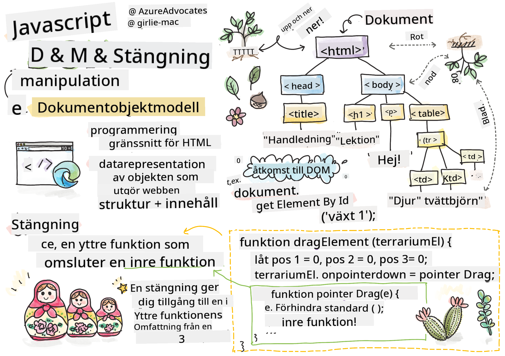
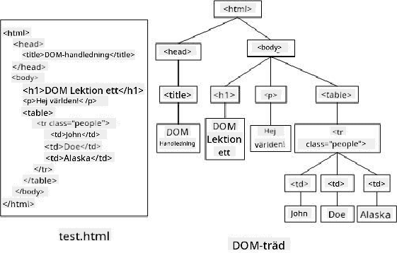
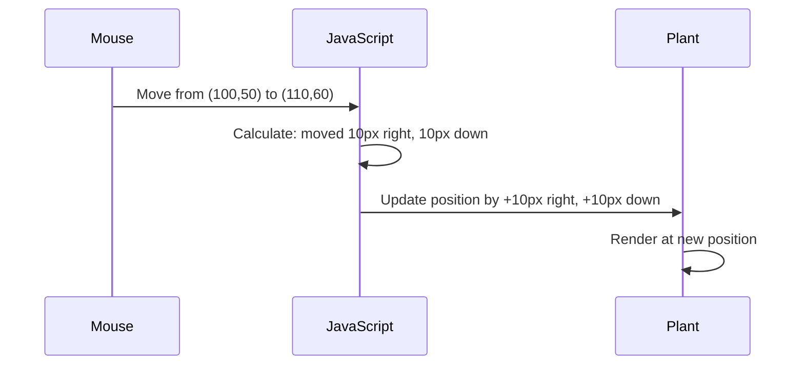

<!--
CO_OP_TRANSLATOR_METADATA:
{
  "original_hash": "bc93f6285423033ebf5b8abeb5282888",
  "translation_date": "2025-10-23T21:38:05+00:00",
  "source_file": "3-terrarium/3-intro-to-DOM-and-closures/README.md",
  "language_code": "sv"
}
-->
# Terrariumprojekt del 3: DOM-manipulation och JavaScript-closures


> Sketchnote av [Tomomi Imura](https://twitter.com/girlie_mac)

Välkommen till en av de mest engagerande aspekterna av webbutveckling - att göra saker interaktiva! Document Object Model (DOM) fungerar som en bro mellan din HTML och JavaScript, och idag ska vi använda den för att ge liv åt ditt terrarium. När Tim Berners-Lee skapade den första webbläsaren, föreställde han sig en web där dokument kunde vara dynamiska och interaktiva - DOM gör den visionen möjlig.

Vi kommer också att utforska JavaScript-closures, som kanske låter skrämmande till en början. Tänk på closures som att skapa "minnesfickor" där dina funktioner kan komma ihåg viktig information. Det är som om varje växt i ditt terrarium har sin egen databas för att hålla koll på sin position. I slutet av denna lektion kommer du att förstå hur naturliga och användbara de är.

Här är vad vi ska bygga: ett terrarium där användare kan dra och släppa växter var som helst. Du kommer att lära dig DOM-manipulationstekniker som driver allt från drag-and-drop filuppladdningar till interaktiva spel. Låt oss ge liv åt ditt terrarium.

## Quiz före föreläsningen

[Quiz före föreläsningen](https://ff-quizzes.netlify.app/web/quiz/19)

## Förstå DOM: Din väg till interaktiva webbsidor

Document Object Model (DOM) är hur JavaScript kommunicerar med dina HTML-element. När din webbläsare laddar en HTML-sida skapar den en strukturerad representation av sidan i minnet - det är DOM. Tänk på det som ett släktträd där varje HTML-element är en familjemedlem som JavaScript kan komma åt, ändra eller omorganisera.

DOM-manipulation förvandlar statiska sidor till interaktiva webbplatser. Varje gång du ser en knapp ändra färg vid hover, innehåll som uppdateras utan sidladdning eller element du kan dra runt, är det DOM-manipulation som är i arbete.



> En representation av DOM och HTML-markeringen som refererar till den. Från [Olfa Nasraoui](https://www.researchgate.net/publication/221417012_Profile-Based_Focused_Crawler_for_Social_Media-Sharing_Websites)

**Det här gör DOM kraftfullt:**
- **Ger** ett strukturerat sätt att komma åt alla element på din sida
- **Möjliggör** dynamiska innehållsuppdateringar utan sidladdningar
- **Tillåter** realtidsrespons på användarinteraktioner som klick och drag
- **Skapar** grunden för moderna interaktiva webbapplikationer

## JavaScript-closures: Skapa organiserad och kraftfull kod

En [JavaScript-closure](https://developer.mozilla.org/docs/Web/JavaScript/Closures) är som att ge en funktion sin egen privata arbetsyta med bestående minne. Tänk på hur Darwins finkar på Galápagosöarna utvecklade specialiserade näbbar baserat på sin specifika miljö - closures fungerar på liknande sätt, och skapar specialiserade funktioner som "kommer ihåg" sin specifika kontext även efter att deras överordnade funktion har avslutats.

I vårt terrarium hjälper closures varje växt att komma ihåg sin egen position oberoende av de andra. Detta mönster förekommer ofta inom professionell JavaScript-utveckling, vilket gör det till ett värdefullt koncept att förstå.

> 💡 **Förstå closures**: Closures är ett viktigt ämne inom JavaScript, och många utvecklare använder dem i flera år innan de helt förstår alla teoretiska aspekter. Idag fokuserar vi på praktisk tillämpning - du kommer att se hur closures naturligt uppstår när vi bygger våra interaktiva funktioner. Förståelsen kommer att utvecklas när du ser hur de löser verkliga problem.


> En representation av DOM och HTML-markeringen som refererar till den. Från [Olfa Nasraoui](https://www.researchgate.net/publication/221417012_Profile-Based_Focused_Crawler_for_Social_Media-Sharing_Websites)

I denna lektion kommer vi att slutföra vårt interaktiva terrariumprojekt genom att skapa JavaScript som gör det möjligt för en användare att manipulera växterna på sidan.

## Innan vi börjar: Förberedelser för framgång

Du behöver dina HTML- och CSS-filer från de tidigare terrariumlektionerna - vi är på väg att göra den statiska designen interaktiv. Om du är med för första gången, rekommenderar vi att du först slutför de tidigare lektionerna för att få viktig kontext.

Här är vad vi ska bygga:
- **Smidig drag-and-drop** för alla terrariumväxter
- **Koordinatspårning** så att växterna kommer ihåg sina positioner
- **Ett komplett interaktivt gränssnitt** med hjälp av vanilla JavaScript
- **Ren och organiserad kod** med hjälp av closure-mönster

## Skapa din JavaScript-fil

Låt oss skapa JavaScript-filen som gör ditt terrarium interaktivt.

**Steg 1: Skapa din script-fil**

I din terrarium-mapp, skapa en ny fil som heter `script.js`.

**Steg 2: Länka JavaScript till din HTML**

Lägg till denna script-tagg i `<head>`-sektionen av din `index.html`-fil:

```html
<script src="./script.js" defer></script>
```

**Varför attributet `defer` är viktigt:**
- **Säkerställer** att din JavaScript väntar tills all HTML är laddad
- **Förhindrar** fel där JavaScript letar efter element som inte är redo än
- **Garanterar** att alla dina växtelement är tillgängliga för interaktion
- **Ger** bättre prestanda än att placera skript längst ner på sidan

> ⚠️ **Viktig notering**: Attributet `defer` förhindrar vanliga timingproblem. Utan det kan JavaScript försöka komma åt HTML-element innan de är laddade, vilket orsakar fel.

---

## Koppla JavaScript till dina HTML-element

Innan vi kan göra element dragbara, måste JavaScript hitta dem i DOM. Tänk på detta som ett bibliotekskatalogsystem - när du har katalognumret kan du hitta exakt den bok du behöver och komma åt allt dess innehåll.

Vi kommer att använda metoden `document.getElementById()` för att göra dessa kopplingar. Det är som att ha ett exakt arkiveringssystem - du anger ett ID och det hittar exakt det element du behöver i din HTML.

### Aktivera dragfunktionalitet för alla växter

Lägg till denna kod i din `script.js`-fil:

```javascript
// Enable drag functionality for all 14 plants
dragElement(document.getElementById('plant1'));
dragElement(document.getElementById('plant2'));
dragElement(document.getElementById('plant3'));
dragElement(document.getElementById('plant4'));
dragElement(document.getElementById('plant5'));
dragElement(document.getElementById('plant6'));
dragElement(document.getElementById('plant7'));
dragElement(document.getElementById('plant8'));
dragElement(document.getElementById('plant9'));
dragElement(document.getElementById('plant10'));
dragElement(document.getElementById('plant11'));
dragElement(document.getElementById('plant12'));
dragElement(document.getElementById('plant13'));
dragElement(document.getElementById('plant14'));
```

**Det här gör koden:**
- **Hittar** varje växtelement i DOM med dess unika ID
- **Hämtar** en JavaScript-referens till varje HTML-element
- **Skickar** varje element till en `dragElement`-funktion (som vi ska skapa härnäst)
- **Förbereder** varje växt för drag-and-drop-interaktion
- **Kopplar** din HTML-struktur till JavaScript-funktionalitet

> 🎯 **Varför använda ID istället för klasser?** ID ger unika identifierare för specifika element, medan CSS-klasser är designade för att styla grupper av element. När JavaScript behöver manipulera enskilda element ger ID den precision och prestanda vi behöver.

> 💡 **Proffstips**: Lägg märke till hur vi anropar `dragElement()` för varje växt individuellt. Denna metod säkerställer att varje växt får sitt eget oberoende dragbeteende, vilket är avgörande för en smidig användarinteraktion.

---

## Bygga dragElement-closure

Nu ska vi skapa kärnan i vår dragfunktionalitet: en closure som hanterar dragbeteendet för varje växt. Denna closure kommer att innehålla flera inre funktioner som samarbetar för att spåra musrörelser och uppdatera elementpositioner.

Closures är perfekta för denna uppgift eftersom de låter oss skapa "privata" variabler som kvarstår mellan funktionsanrop, vilket ger varje växt sitt eget oberoende koordinatspårningssystem.

### Förstå closures med ett enkelt exempel

Låt mig demonstrera closures med ett enkelt exempel som illustrerar konceptet:

```javascript
function createCounter() {
    let count = 0; // This is like a private variable
    
    function increment() {
        count++; // The inner function remembers the outer variable
        return count;
    }
    
    return increment; // We're giving back the inner function
}

const myCounter = createCounter();
console.log(myCounter()); // 1
console.log(myCounter()); // 2
```

**Det här händer i detta closure-mönster:**
- **Skapar** en privat `count`-variabel som bara existerar inom denna closure
- **Den inre funktionen** kan komma åt och ändra den yttre variabeln (closure-mekanismen)
- **När vi returnerar** den inre funktionen, behåller den sin koppling till den privata datan
- **Även efter** att `createCounter()` har avslutats, kvarstår `count` och kommer ihåg sitt värde

### Varför closures är perfekta för dragfunktionalitet

För vårt terrarium behöver varje växt komma ihåg sina aktuella positionskoordinater. Closures ger den perfekta lösningen:

**Viktiga fördelar för vårt projekt:**
- **Behåller** privata positionsvariabler för varje växt oberoende
- **Bevarar** koordinatdata mellan draghändelser
- **Förhindrar** variabelkonflikter mellan olika dragbara element
- **Skapar** en ren och organiserad kodstruktur

> 🎯 **Lärandemål**: Du behöver inte bemästra varje aspekt av closures just nu. Fokusera på att se hur de hjälper oss att organisera kod och behålla tillstånd för vår dragfunktionalitet.

### Skapa dragElement-funktionen

Nu ska vi bygga huvudfunktionen som hanterar all draglogik. Lägg till denna funktion under dina växtelementdeklarationer:

```javascript
function dragElement(terrariumElement) {
    // Initialize position tracking variables
    let pos1 = 0,  // Previous mouse X position
        pos2 = 0,  // Previous mouse Y position  
        pos3 = 0,  // Current mouse X position
        pos4 = 0;  // Current mouse Y position
    
    // Set up the initial drag event listener
    terrariumElement.onpointerdown = pointerDrag;
}
```

**Förstå positionsspårningssystemet:**
- **`pos1` och `pos2`**: Lagrar skillnaden mellan gamla och nya muspositioner
- **`pos3` och `pos4`**: Spårar aktuella muskoordinater
- **`terrariumElement`**: Det specifika växtelementet vi gör dragbart
- **`onpointerdown`**: Händelsen som triggas när användaren börjar dra

**Så här fungerar closure-mönstret:**
- **Skapar** privata positionsvariabler för varje växtelement
- **Behåller** dessa variabler under hela draglivscykeln
- **Säkerställer** att varje växt spårar sina egna koordinater oberoende
- **Ger** ett rent gränssnitt genom funktionen `dragElement`

### Varför använda pointer-händelser?

Du kanske undrar varför vi använder `onpointerdown` istället för det mer bekanta `onclick`. Här är förklaringen:

| Händelsetyp | Bäst för | Nackdel |
|-------------|----------|---------|
| `onclick` | Enkla knapptryckningar | Kan inte hantera dragning (bara klick och släpp) |
| `onpointerdown` | Både mus och touch | Nyare, men väl stödd idag |
| `onmousedown` | Endast mus på dator | Utesluter mobilanvändare |

**Varför pointer-händelser är perfekta för det vi bygger:**
- **Fungerar utmärkt** oavsett om någon använder mus, finger eller till och med en penna
- **Känns likadant** på en laptop, surfplatta eller telefon
- **Hantera** själva dragrörelsen (inte bara klick och klart)
- **Skapar** en smidig upplevelse som användare förväntar sig från moderna webbappar

> 💡 **Framtidssäkring**: Pointer-händelser är det moderna sättet att hantera användarinteraktioner. Istället för att skriva separat kod för mus och touch får du båda gratis. Ganska smart, eller hur?

---

## Funktionen pointerDrag: Fånga början av en dragning

När en användare trycker ner på en växt (antingen med mus eller finger), aktiveras funktionen `pointerDrag`. Denna funktion fångar de initiala koordinaterna och sätter upp dragssystemet.

Lägg till denna funktion inuti din `dragElement`-closure, precis efter raden `terrariumElement.onpointerdown = pointerDrag;`:

```javascript
function pointerDrag(e) {
    // Prevent default browser behavior (like text selection)
    e.preventDefault();
    
    // Capture the initial mouse/touch position
    pos3 = e.clientX;  // X coordinate where drag started
    pos4 = e.clientY;  // Y coordinate where drag started
    
    // Set up event listeners for the dragging process
    document.onpointermove = elementDrag;
    document.onpointerup = stopElementDrag;
}
```

**Steg för steg, här är vad som händer:**
- **Förhindrar** standardbeteenden i webbläsaren som kan störa dragningen
- **Registrerar** de exakta koordinaterna där användaren startade draggesten
- **Etablerar** händelselyssnare för den pågående dragrörelsen
- **Förbereder** systemet för att spåra mus-/fingerförflyttning över hela dokumentet

### Förstå händelseförhindring

Raden `e.preventDefault()` är avgörande för en smidig dragning:

**Utan förhindring kan webbläsare:**
- **Markera** text vid dragning över sidan
- **Trigga** kontextmenyer vid högerklicksdragning
- **Störa** vårt anpassade dragbeteende
- **Skapa** visuella artefakter under dragoperationen

> 🔍 **Experiment**: Efter att ha slutfört denna lektion, prova att ta bort `e.preventDefault()` och se hur det påverkar dragupplevelsen. Du kommer snabbt att förstå varför denna rad är viktig!

### Koordinatspårningssystem

Egenskaperna `e.clientX` och `e.clientY` ger oss exakta mus-/touchkoordinater:

| Egenskap | Vad den mäter | Användningsområde |
|----------|---------------|-------------------|
| `clientX` | Horisontell position relativt till viewport | Spåra vänster-höger rörelse |
| `clientY` | Vertikal position relativt till viewport | Spåra upp-ner rörelse |

**Förstå dessa koordinater:**
- **Ger** pixelperfekt positionsinformation
- **Uppdateras** i realtid när användaren flyttar sin pekare
- **Förblir** konsekvent över olika skärmstorlekar och zoomnivåer
- **Möjliggör** smidiga, responsiva draginteraktioner

### Sätta upp dokumentnivå händelselyssnare

Lägg märke till hur vi kopplar rörelse- och stopp-händelser till hela `document`, inte bara växtelementet:

```javascript
document.onpointermove = elementDrag;
document.onpointerup = stopElementDrag;
```

**Varför koppla till dokumentet:**
- **Fortsätter** spårning även när musen lämnar växtelementet
- **Förhindrar** avbrott i dragningen om användaren rör sig snabbt
- **Ger** smidig dragning över hela skärmen
- **Hantera** kantfall där pekaren rör sig utanför webbläsarfönstret

> ⚡ **Prestandanotering**: Vi kommer att städa upp dessa dokumentnivå-lyssnare när dragningen slutar för att undvika minnesläckor och prestandaproblem.

## Slutföra dragssystemet: Rörelse och städning

Nu ska vi lägga till de två återstående funktionerna som hanterar den faktiska dragrörelsen och städningen när dragningen slutar. Dessa funktioner samarbetar för att skapa smidig, responsiv växtrörelse över ditt terrarium.

### Funktionen elementDrag: Spåra rörelse

Lägg till funktionen `elementDrag` precis efter den avslutande klammern för `pointerDrag`:

```javascript
function elementDrag(e) {
    // Calculate the distance moved since the last event
    pos1 = pos3 - e.clientX;  // Horizontal distance moved
    pos2 = pos4 - e.clientY;  // Vertical distance moved
    
    // Update the current position tracking
    pos3 = e.clientX;  // New current X position
    pos4 = e.clientY;  // New current Y position
    
    // Apply the movement to the element's position
    terrariumElement.style.top = (terrariumElement.offsetTop - pos2) + 'px';
    terrariumElement.style.left = (terrariumElement.offsetLeft - pos1) + 'px';
}
```

**Förstå koordinatmatematiken:**
- **`pos1` och `pos2`**: Beräknar hur långt musen har rört sig sedan senaste uppdateringen
- **`pos3` och `pos4`**: Sparar musens aktuella position för nästa beräkning
- **`offsetTop` och `offsetLeft`**: Hämtar elementets aktuella position på sidan
- **Subtraktionslogik**: Flyttar elementet med samma avstånd som musen har rört sig

**Så här beräknas rörelsen:**
1. **Mäter** skillnaden mellan den gamla och nya muspositionen
2. **Beräknar** hur mycket elementet ska flyttas baserat på musens rörelse
3. **Uppdaterar** elementets CSS-positionsegenskaper i realtid
4. **Sparar** den nya positionen som baslinje för nästa rörelseberäkning

### Visuell representation av matematiken



### Funktionen stopElementDrag: Rensa upp

Lägg till rensningsfunktionen efter den avslutande måsvingeparentesen i `elementDrag`:

```javascript
function stopElementDrag() {
    // Remove the document-level event listeners
    document.onpointerup = null;
    document.onpointermove = null;
}
```

**Varför rensning är viktig:**
- **Förhindrar** minnesläckor från kvarvarande eventlyssnare
- **Stoppar** dragbeteendet när användaren släpper växten
- **Tillåter** andra element att dras oberoende
- **Återställer** systemet för nästa dragoperation

**Vad som händer utan rensning:**
- Eventlyssnare fortsätter att köras även efter att dragningen har stoppats
- Prestandan försämras när oanvända lyssnare samlas
- Oväntat beteende vid interaktion med andra element
- Webbläsarens resurser slösas bort på onödig eventhantering

### Förstå CSS-positionsegenskaper

Vårt dragsystem manipulerar två viktiga CSS-egenskaper:

| Egenskap | Vad den styr | Hur vi använder den |
|----------|--------------|---------------------|
| `top` | Avstånd från den övre kanten | Vertikal positionering under drag |
| `left` | Avstånd från den vänstra kanten | Horisontell positionering under drag |

**Viktiga insikter om offset-egenskaper:**
- **`offsetTop`**: Aktuellt avstånd från den övre kanten av den positionerade föräldraelementet
- **`offsetLeft`**: Aktuellt avstånd från den vänstra kanten av den positionerade föräldraelementet
- **Positioneringskontext**: Dessa värden är relativa till den närmaste positionerade förfadern
- **Uppdateringar i realtid**: Ändras omedelbart när vi modifierar CSS-egenskaperna

> 🎯 **Designfilosofi**: Detta dragsystem är avsiktligt flexibelt – det finns inga "drop zones" eller begränsningar. Användare kan placera växter var som helst och får full kreativ kontroll över sin terrariumdesign.

## Sammanfattning: Ditt kompletta dragsystem

Grattis! Du har precis byggt ett sofistikerat drag-och-släpp-system med hjälp av ren JavaScript. Din kompletta `dragElement`-funktion innehåller nu en kraftfull closure som hanterar:

**Vad din closure gör:**
- **Bibehåller** privata positionsvariabler för varje växt oberoende
- **Hantera** hela draglivscykeln från början till slut
- **Ger** smidig, responsiv rörelse över hela skärmen
- **Rensar** resurser korrekt för att förhindra minnesläckor
- **Skapar** ett intuitivt, kreativt gränssnitt för terrariumdesign

### Testa ditt interaktiva terrarium

Testa nu ditt interaktiva terrarium! Öppna din `index.html`-fil i en webbläsare och prova funktionaliteten:

1. **Klicka och håll** på en växt för att börja dra
2. **Flytta musen eller fingret** och se hur växten följer med smidigt
3. **Släpp** för att placera växten på sin nya position
4. **Experimentera** med olika arrangemang för att utforska gränssnittet

🥇 **Prestation**: Du har skapat en fullt interaktiv webbapplikation med hjälp av kärnkoncept som professionella utvecklare använder dagligen. Denna drag-och-släpp-funktionalitet använder samma principer som ligger bakom filuppladdningar, kanban-tavlor och många andra interaktiva gränssnitt.


---

## GitHub Copilot Agent-utmaning 🚀

Använd Agent-läget för att slutföra följande utmaning:

**Beskrivning:** Förbättra terrariumprojektet genom att lägga till en återställningsfunktion som återställer alla växter till deras ursprungliga positioner med mjuka animationer.

**Uppmaning:** Skapa en återställningsknapp som, när den klickas, animerar alla växter tillbaka till deras ursprungliga sidopositioner med hjälp av CSS-övergångar. Funktionen ska lagra de ursprungliga positionerna när sidan laddas och smidigt flytta tillbaka växterna till dessa positioner under 1 sekund när återställningsknappen trycks.

Läs mer om [agent mode](https://code.visualstudio.com/blogs/2025/02/24/introducing-copilot-agent-mode) här.

## 🚀 Extra utmaning: Utveckla dina färdigheter

Redo att ta ditt terrarium till nästa nivå? Försök implementera dessa förbättringar:

**Kreativa tillägg:**
- **Dubbelklicka** på en växt för att flytta den längst fram (z-index-manipulation)
- **Lägg till visuell feedback** som en subtil glöd när du hovrar över växter
- **Implementera gränser** för att förhindra att växter dras utanför terrariet
- **Skapa en spara-funktion** som kommer ihåg växtpositioner med hjälp av localStorage
- **Lägg till ljudeffekter** för att plocka upp och placera växter

> 💡 **Lärandemöjlighet**: Varje av dessa utmaningar lär dig nya aspekter av DOM-manipulation, eventhantering och användarupplevelsedesign.

## Efterföreläsningsquiz

[Efterföreläsningsquiz](https://ff-quizzes.netlify.app/web/quiz/20)

## Granskning & Självstudier: Fördjupa din förståelse

Du har bemästrat grunderna i DOM-manipulation och closures, men det finns alltid mer att utforska! Här är några vägar för att utöka din kunskap och färdigheter.

### Alternativa metoder för drag-och-släpp

Vi använde pekhändelser för maximal flexibilitet, men webbutveckling erbjuder flera metoder:

| Metod | Bäst för | Lärandemål |
|-------|----------|------------|
| [HTML Drag and Drop API](https://developer.mozilla.org/docs/Web/API/HTML_Drag_and_Drop_API) | Filuppladdningar, formella dragzoner | Förstå webbläsarens inbyggda funktioner |
| [Touch Events](https://developer.mozilla.org/docs/Web/API/Touch_events) | Mobilspecifika interaktioner | Mobilfokuserade utvecklingsmönster |
| CSS `transform`-egenskaper | Smidiga animationer | Prestandaoptimeringstekniker |

### Avancerade ämnen inom DOM-manipulation

**Nästa steg i din läranderesa:**
- **Eventdelegering**: Hantera händelser effektivt för flera element
- **Intersection Observer**: Upptäcka när element kommer in/ut ur vyn
- **Mutation Observer**: Övervaka förändringar i DOM-strukturen
- **Web Components**: Skapa återanvändbara, inkapslade UI-element
- **Virtuella DOM-koncept**: Förstå hur ramverk optimerar DOM-uppdateringar

### Viktiga resurser för fortsatt lärande

**Teknisk dokumentation:**
- [MDN Pointer Events Guide](https://developer.mozilla.org/docs/Web/API/Pointer_events) - Omfattande referens för pekhändelser
- [W3C Pointer Events Specification](https://www.w3.org/TR/pointerevents1/) - Officiell standarddokumentation
- [JavaScript Closures Deep Dive](https://developer.mozilla.org/docs/Web/JavaScript/Closures) - Avancerade closure-mönster

**Webbläsarkompatibilitet:**
- [CanIUse.com](https://caniuse.com/) - Kontrollera funktionsstöd i olika webbläsare
- [MDN Browser Compatibility Data](https://github.com/mdn/browser-compat-data) - Detaljerad kompatibilitetsinformation

**Praktiska möjligheter:**
- **Bygg** ett pusselspel med liknande dragmekanik
- **Skapa** en kanban-tavla med drag-och-släpp-uppgiftshantering
- **Designa** ett bildgalleri med flyttbara fotouppställningar
- **Experimentera** med beröringsgester för mobila gränssnitt

> 🎯 **Lärandestrategi**: Det bästa sättet att befästa dessa koncept är genom övning. Försök att bygga variationer av dragbara gränssnitt – varje projekt lär dig något nytt om användarinteraktion och DOM-manipulation.

## Uppgift

[Arbeta lite mer med DOM](assignment.md)

---

**Ansvarsfriskrivning**:  
Detta dokument har översatts med hjälp av AI-översättningstjänsten [Co-op Translator](https://github.com/Azure/co-op-translator). Även om vi strävar efter noggrannhet, bör det noteras att automatiserade översättningar kan innehålla fel eller felaktigheter. Det ursprungliga dokumentet på dess ursprungliga språk bör betraktas som den auktoritativa källan. För kritisk information rekommenderas professionell mänsklig översättning. Vi ansvarar inte för eventuella missförstånd eller feltolkningar som uppstår vid användning av denna översättning.