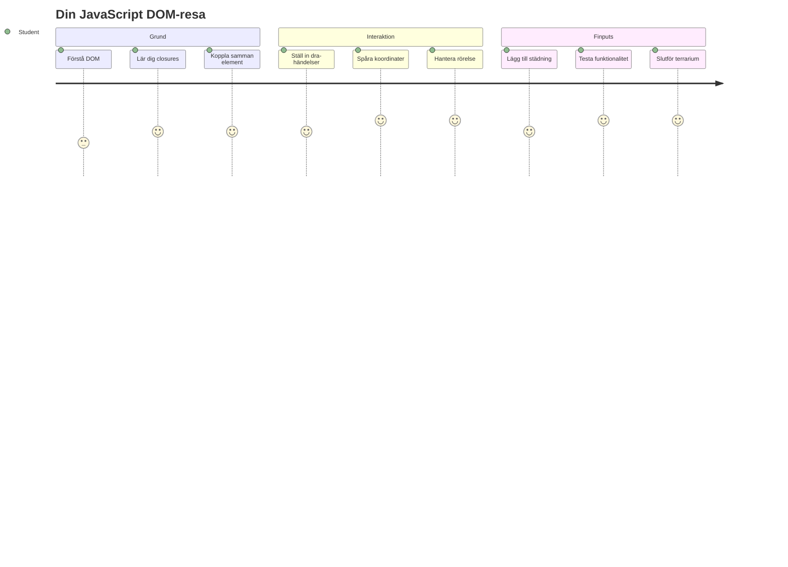
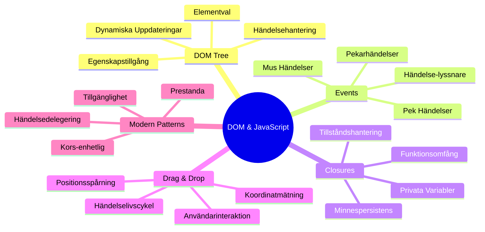
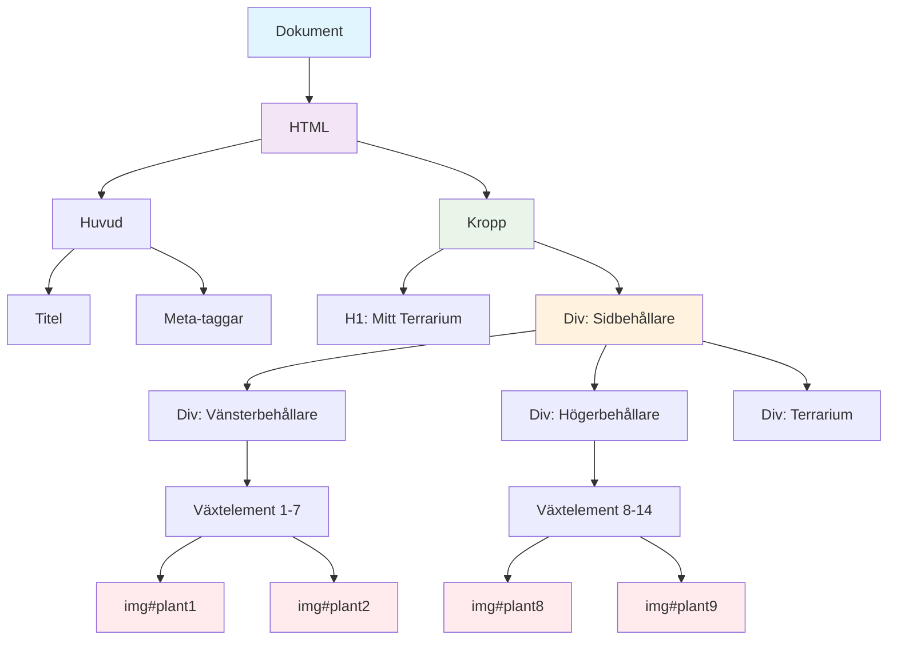
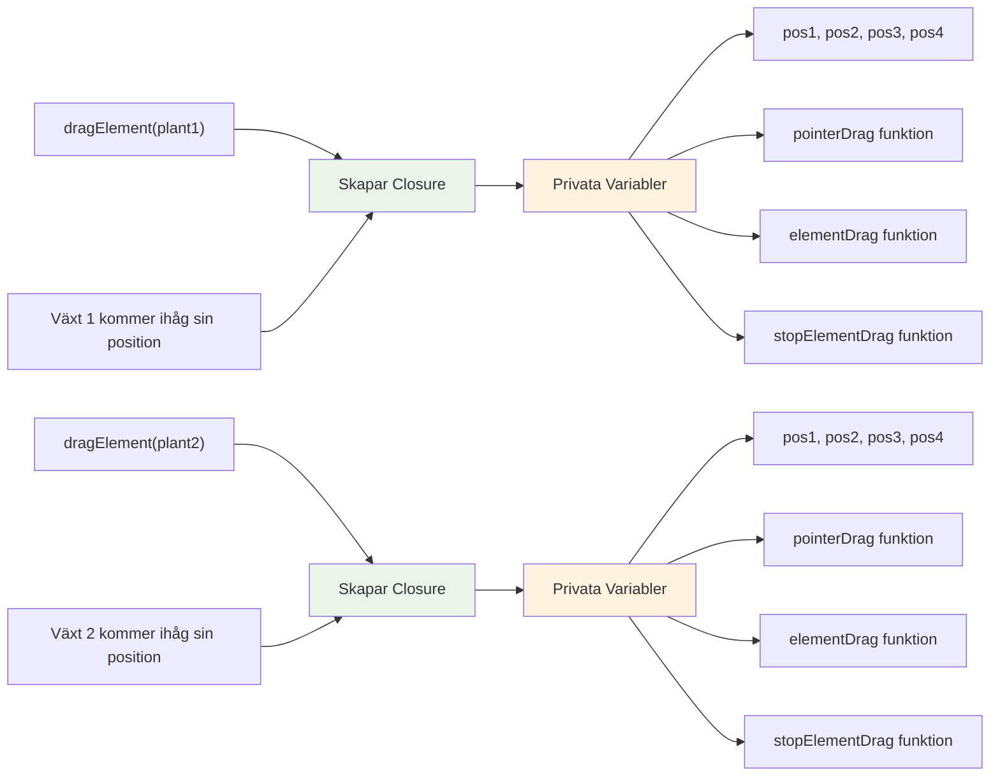
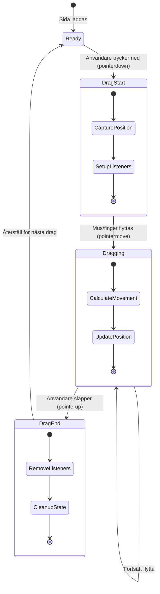
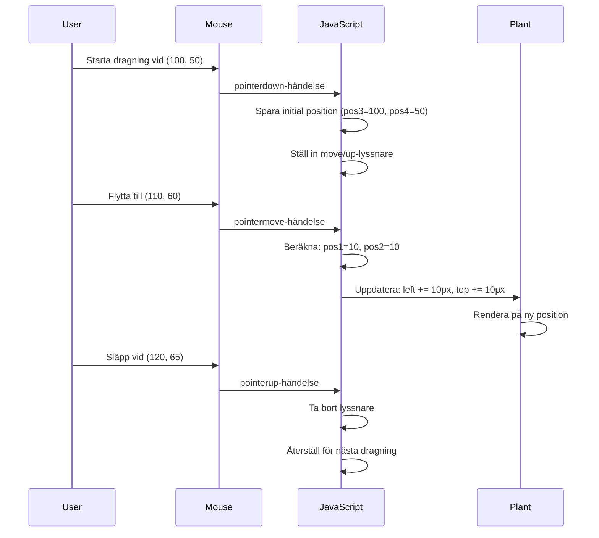
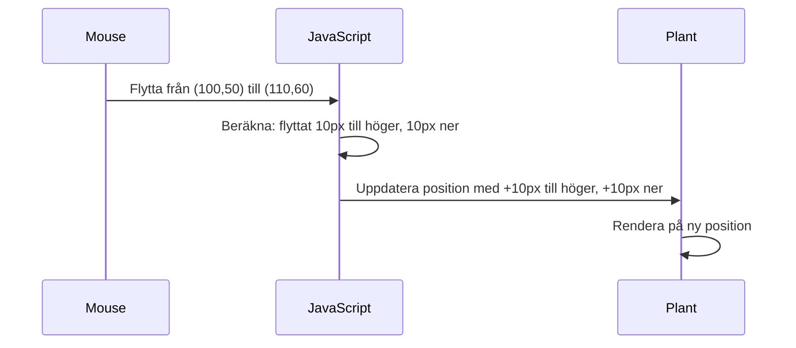

<!--
CO_OP_TRANSLATOR_METADATA:
{
  "original_hash": "973e48ad87d67bf5bb819746c9f8e302",
  "translation_date": "2026-01-06T23:10:11+00:00",
  "source_file": "3-terrarium/3-intro-to-DOM-and-closures/README.md",
  "language_code": "sv"
}
-->
# Terrarium-projekt Del 3: DOM-manipulation och JavaScript-closures



> Sketchnote av [Tomomi Imura](https://twitter.com/girlie_mac)

Välkommen till en av de mest engagerande aspekterna av webbutveckling – att göra saker interaktiva! Document Object Model (DOM) är som en bro mellan din HTML och JavaScript, och idag ska vi använda den för att ge liv åt ditt terrarium. När Tim Berners-Lee skapade den första webbläsaren, såg han framför sig en web där dokument kunde vara dynamiska och interaktiva – DOM gör denna vision möjlig.

Vi kommer också att utforska JavaScript-closures, vilket i början kan låta skrämmande. Tänk på closures som att skapa "minnesfickor" där dina funktioner kan komma ihåg viktig information. Det är som att varje växt i ditt terrarium har sin egen dataregistrering för att hålla koll på sin position. I slutet av denna lektion kommer du att förstå hur naturliga och användbara de är.

Här är vad vi bygger: ett terrarium där användare kan dra och släppa växter vart de vill. Du kommer att lära dig DOM-manipulationsteknikerna som driver allt från drag-och-släpp-filuppladdningar till interaktiva spel. Låt oss få ditt terrarium att leva.


## Quiz före föreläsningen

[Pre-lecture quiz](https://ff-quizzes.netlify.app/web/quiz/19)

## Förstå DOM: Din port till interaktiva webbsidor

Document Object Model (DOM) är hur JavaScript kommunicerar med dina HTML-element. När din webbläsare laddar en HTML-sida, skapar den en strukturerad representation av sidan i minnet – det är DOM. Tänk på det som en familjetree där varje HTML-element är en familjemedlem som JavaScript kan komma åt, ändra eller omordna.

DOM-manipulation omvandlar statiska sidor till interaktiva webbplatser. Varje gång du ser en knapp ändra färg vid hovring, innehåll uppdateras utan att sidan laddas om, eller element du kan dra omkring, då är det DOM-manipulation som arbetar.




> En representation av DOM och HTML-markupen som refererar till den. Från [Olfa Nasraoui](https://www.researchgate.net/publication/221417012_Profile-Based_Focused_Crawler_for_Social_Media-Sharing_Websites)

**Det här gör DOM kraftfullt:**
- **Ger** ett strukturerat sätt att komma åt vilket element som helst på din sida
- **Möjliggör** dynamiska innehållsuppdateringar utan omladdning
- **Tillåter** svar i realtid på användarinteraktioner som klick och drag
- **Skapar** grunden för moderna interaktiva webbapplikationer

## JavaScript-closures: Skapa organiserad, kraftfull kod

En [JavaScript-closure](https://developer.mozilla.org/docs/Web/JavaScript/Closures) är som att ge en funktion sin egen privata arbetsyta med bestående minne. Tänk på hur Darwins finkar på Galápagosöarna utvecklade specialiserade näbbar baserat på deras specifika miljö – closures fungerar likadant och skapar specialiserade funktioner som "kommer ihåg" sin specifika kontext även efter att föräldrafunktionen är klar.

I vårt terrarium hjälper closures varje växt att minnas sin egen position oberoende. Detta mönster förekommer ofta inom professionell JavaScript-utveckling, vilket gör det till ett värdefullt koncept att förstå.


> 💡 **Förstå closures**: Closures är ett stort ämne inom JavaScript, och många utvecklare använder dem i åratal innan de fullt förstår alla teoretiska delar. Idag fokuserar vi på praktisk tillämpning – du kommer naturligt att se closures uppstå när vi bygger våra interaktiva funktioner. Förståelsen växer när du ser hur de löser verkliga problem.


> En representation av DOM och HTML-markupen som refererar till den. Från [Olfa Nasraoui](https://www.researchgate.net/publication/221417012_Profile-Based_Focused_Crawler_for_Social_Media-Sharing_Websites)

I denna lektion avslutar vi vårt interaktiva terrariumprojekt genom att skapa JavaScript-koden som tillåter användaren att manipulera växterna på sidan.

## Innan vi börjar: Förbered för framgång

Du kommer behöva dina HTML- och CSS-filer från tidigare terrariumlektioner – nu ska vi göra den statiska designen interaktiv. Om du deltar för första gången, rekommenderar vi att du genomför de tidigare lektionerna först för viktig kontext.

Det här bygger vi:
- **Smidig drag-och-släpp** för alla terrariumväxter
- **Koordinatspårning** så att växterna minns sina positioner
- **Ett komplett interaktivt gränssnitt** med vanlig JavaScript
- **Ren, organiserad kod** med closure-mönster

## Skapa din JavaScript-fil

Låt oss skapa JavaScript-filen som ska göra ditt terrarium interaktivt.

**Steg 1: Skapa din skriptfil**

I din terrarium-mapp, skapa en ny fil som heter `script.js`.

**Steg 2: Koppla JavaScript till din HTML**

Lägg till denna script-tag i `<head>`-sektionen av din `index.html`-fil:

```html
<script src="./script.js" defer></script>
```

**Varför `defer`-attributet är viktigt:**
- **Säkerställer** att din JavaScript väntar tills all HTML är laddad
- **Förhindrar** fel där JavaScript söker element som inte är redo än
- **Garanterar** att alla dina växtelement är tillgängliga för interaktion
- **Ger** bättre prestanda än att placera skript i sidans slut

> ⚠️ **Viktigt**: `defer`-attributet förhindrar vanliga tidsproblem. Utan det kan JavaScript försöka komma åt HTML-element innan de har laddats, vilket orsakar fel.

---

## Koppla JavaScript till dina HTML-element

Innan vi kan göra element dragbara måste JavaScript hitta dem i DOM. Tänk på det som en biblioteks-katalogisering – när du har katalognumret kan du hitta exakt boken du behöver och komma åt allt innehåll.

Vi använder metoden `document.getElementById()` för att skapa dessa kopplingar. Det är som ett precist arkivsystem – du anger ett ID och det hittar exakt det element du behöver i din HTML.

### Aktivera dragfunktionalitet för alla växter

Lägg till denna kod i din `script.js`-fil:

```javascript
// Aktivera dra-funktionalitet för alla 14 växter
dragElement(document.getElementById('plant1'));
dragElement(document.getElementById('plant2'));
dragElement(document.getElementById('plant3'));
dragElement(document.getElementById('plant4'));
dragElement(document.getElementById('plant5'));
dragElement(document.getElementById('plant6'));
dragElement(document.getElementById('plant7'));
dragElement(document.getElementById('plant8'));
dragElement(document.getElementById('plant9'));
dragElement(document.getElementById('plant10'));
dragElement(document.getElementById('plant11'));
dragElement(document.getElementById('plant12'));
dragElement(document.getElementById('plant13'));
dragElement(document.getElementById('plant14'));
```

**Det här åstadkommer koden:**
- **Hittar** varje växts element i DOM med dess unika ID
- **Hämtar** en JavaScript-referens till varje HTML-element
- **Skickar** varje element till en `dragElement`-funktion (som vi skapar nästa)
- **Förbereder** varje växt för drag-och-släpp-interaktion
- **Kopplar** din HTML-struktur till JavaScript-funktionalitet

> 🎯 **Varför använda ID istället för klasser?** ID:n ger unika identifierare för specifika element, medan CSS-klasser är designade för att styla grupper av element. När JavaScript behöver manipulera enskilda element ger ID:n den precision och prestanda vi behöver.

> 💡 **Proffstips**: Lägg märke till hur vi kallar `dragElement()` för varje växt individuellt. Detta säkerställer att varje växt får sitt eget oberoende dragbeteende, vilket är nödvändigt för smidig användarinteraktion.

### 🔄 **Pedagogisk kontrollpunkt**
**DOM-anslutningsförståelse**: Innan vi går vidare till dragfunktionaliteten, verifiera att du kan:
- ✅ Förklara hur `document.getElementById()` hittar HTML-element
- ✅ Förstå varför vi använder unika ID:n för varje växt
- ✅ Beskriva syftet med `defer`-attributet i script-tags
- ✅ Känna igen hur JavaScript och HTML kopplas ihop via DOM

**Snabb självtest**: Vad händer om två element har samma ID? Varför returnerar `getElementById()` bara ett element?
*Svar: ID:n ska vara unika; om de dupliceras returneras bara det första elementet*

---

## Bygga dragElement-closure

Nu ska vi skapa hjärtat i vår dragfunktionalitet: en closure som hanterar dragbeteendet för varje växt. Denna closure kommer innehålla flera interna funktioner som tillsammans spårar musrörelser och uppdaterar elementens positioner.

Closures är perfekta för detta eftersom de tillåter oss att skapa "privata" variabler som består mellan funktionsanrop, vilket ger varje växt ett eget oberoende system för koordinatspårning.

### Förstå closures med ett enkelt exempel

Låt mig demonstrera closures med ett enkelt exempel som förklarar konceptet:

```javascript
function createCounter() {
    let count = 0; // Detta är som en privat variabel
    
    function increment() {
        count++; // Den inre funktionen minns den yttre variabeln
        return count;
    }
    
    return increment; // Vi ger tillbaka den inre funktionen
}

const myCounter = createCounter();
console.log(myCounter()); // 1
console.log(myCounter()); // 2
```

**Det här händer i detta closure-mönster:**
- **Skapas** en privat `count`-variabel som bara finns inom denna closure
- **Den inre funktionen** kan komma åt och ändra den yttre variabeln (closure-mekanismen)
- **När vi returnerar** den inre funktionen behåller den sin koppling till dessa privata data
- **Även efter** att `createCounter()` har avslutats, består `count` och minns sitt värde

### Varför closures är perfekta för dragfunktionalitet

För vårt terrarium behöver varje växt minnas sina aktuella position-koordinater. Closures ger den perfekta lösningen:

**Nyckelfördelar för vårt projekt:**
- **Behåller** privata positionsvariabler för varje växt oberoende
- **Bevarar** koordinatdata mellan draghändelser
- **Förhindrar** variabelkonflikter mellan olika dragbara element
- **Skapar** ren och organiserad kodstruktur

> 🎯 **Lärandemål**: Du behöver inte behärska alla aspekter av closures just nu. Fokusera på att se hur de hjälper oss att organisera koden och bibehålla tillstånd för vår dragfunktion.


### Skapa dragElement-funktionen

Låt oss nu bygga huvudfunktionen som hanterar all draglogik. Lägg till denna funktion under deklarationen av dina växtelement:

```javascript
function dragElement(terrariumElement) {
    // Initiera positioneringsvariabler
    let pos1 = 0,  // Föregående mus X-position
        pos2 = 0,  // Föregående mus Y-position
        pos3 = 0,  // Aktuell mus X-position
        pos4 = 0;  // Aktuell mus Y-position
    
    // Ställ in den initiala dragghändelse-lyssnaren
    terrariumElement.onpointerdown = pointerDrag;
}
```

**Förstå systemet för positionsspårning:**
- **`pos1` och `pos2`**: Sparar skillnaden mellan gamla och nya muspositioner
- **`pos3` och `pos4`**: Spårar musens aktuella koordinater
- **`terrariumElement`**: Det specifika växtelement som ska göras dragbart
- **`onpointerdown`**: Händelsen som triggas när användaren börjar dra

**Så här fungerar closure-mönstret:**
- **Skapar** privata positionsvariabler för varje växtelement
- **Bibehåller** dessa variabler under hela dragcykeln
- **Säkerställer** att varje växt spårar sina egna koordinater oberoende
- **Ger** ett rent gränssnitt via `dragElement`-funktionen

### Varför använda pointer-händelser?

Du kanske undrar varför vi använder `onpointerdown` istället för den mer bekanta `onclick`. Här är resonemanget:

| Händelsetyp | Passar bäst för | Fångsten |
|------------|-----------------|----------|
| `onclick` | Enkla knappklick | Kan inte hantera drag (bara klick och släpp) |
| `onpointerdown` | Både mus och touch | Nyare, men väl stödd idag |
| `onmousedown` | Endast mus på desktop | Utesluter mobilanvändare |

**Varför pointer-händelser är perfekta för det vi bygger:**
- **Fungerar utmärkt** oavsett om någon använder mus, finger eller stylus
- **Känns likadant** på laptop, surfplatta eller telefon
- **Hanterar** själva drag-rörelsen (inte bara klick)
- **Ger** en smidig upplevelse som användare förväntar sig av moderna webbappar

> 💡 **Framtidssäkring**: Pointer-händelser är det moderna sättet att hantera användarinteraktioner. Istället för att skriva separat kod för mus och touch får du båda på köpet. Rätt smart, eller hur?

### 🔄 **Pedagogisk kontrollpunkt**
**Förståelse för händelsehantering**: Pausa och bekräfta din förståelse:
- ✅ Varför använder vi pointer-händelser istället för mus-händelser?
- ✅ Hur består closure-variabler mellan funktionsanrop?
- ✅ Vilken roll spelar `preventDefault()` för smidigt drag?
- ✅ Varför fäster vi lyssnare på dokumentet istället för på enskilda element?

**Verklighetskoppling**: Tänk på drag-och-släpp-gränssnitt du använder dagligen:
- **Filuppladdningar**: Dra filer till ett webbläsarfönster
- **Kanban-tavlor**: Flytta uppgifter mellan kolumner
- **Bildgallerier**: Ordna om foton
- **Mobilgränssnitt**: Svep- och dragfunktioner på pekskärmar

---

## Funktionen pointerDrag: Fångar starten på ett drag

När en användare trycker ner på en växt (med musklick eller finger) sätts `pointerDrag`-funktionen igång. Den fångar initiala koordinater och förbereder drag-systemet.

Lägg till denna funktion inuti din `dragElement`-closure, precis efter raden `terrariumElement.onpointerdown = pointerDrag;`:

```javascript
function pointerDrag(e) {
    // Förhindra standardbeteende i webbläsaren (som textmarkering)
    e.preventDefault();
    
    // Fånga den initiala mus-/touchpositionen
    pos3 = e.clientX;  // X-koordinat där dragningen startade
    pos4 = e.clientY;  // Y-koordinat där dragningen startade
    
    // Ställ in händelselyssnare för dragprocessen
    document.onpointermove = elementDrag;
    document.onpointerup = stopElementDrag;
}
```

**Steg för steg, det här händer:**
- **Förhindrar** standardbeteenden i webbläsaren som kan störa draget
- **Spelar in** de exakta koordinater där användaren startade draget
- **Etablerar** händelselyssnare för pågående dragrörelse
- **Förbereder** systemet för att spåra mus-/fingerförflyttning över hela dokumentet

### Förstå förebyggande av händelser

Raden `e.preventDefault()` är avgörande för smidigt drag:

**Utan förebyggande kan webbläsare:**
- **Markera** text när man drar över sidan
- **Visa** kontextmenyer vid högerklick-drag
- **Störa** vårt anpassade dragbeteende
- **Skapa** visuella störningar under draget

> 🔍 **Experiment**: Efter denna lektion, testa att ta bort `e.preventDefault()` och se hur dragupplevelsen påverkas. Då förstår du snabbt varför raden är viktig!

### Koordinatspårningssystem

Egenskaperna `e.clientX` och `e.clientY` ger oss exakta mus-/touch-koordinater:

| Egenskap | Vad den mäter | Användningsfall |
|----------|---------------|-----------------|
| `clientX` | Horisontell position relativt viewport | Spåra vänster-höger rörelse |
| `clientY` | Vertikal position relativt viewport | Spåra upp-och-ner rörelse |
**Förstå dessa koordinater:**
- **Ger** pixelperfekt placeringsinformation
- **Uppdateras** i realtid när användaren flyttar pekaren
- **Förblir** konsekvent över olika skärmstorlekar och zoomnivåer
- **Möjliggör** smidiga, responsiva draginteraktioner

### Ställa in händelselyssnare på dokumentnivå

Notera hur vi kopplar move- och stop-händelserna till hela `document`, inte bara till plantelementet:

```javascript
document.onpointermove = elementDrag;
document.onpointerup = stopElementDrag;
```

**Varför koppla till dokumentet:**
- **Fortsätter** att spåra även när musen lämnar plantelementet
- **Förhindrar** avbrott i dragningen om användaren rör sig snabbt
- **Ger** smidig dragning över hela skärmen
- **Hanterar** kantfall där pekaren rör sig utanför webbläsarfönstret

> ⚡ **Prestandanotis:** Vi tar bort dessa dokumentnivå-lyssnare när dragningen slutar för att undvika minnesläckor och prestandaproblem.

## Slutföra drag-systemet: rörelse och städning

Nu lägger vi till de två återstående funktionerna som hanterar själva dragningen och städningen när dragningen avslutas. Dessa funktioner samverkar för att skapa en mjuk, responsiv planteffekt i ditt terrarium.

### Funktion för elementDrag: Spåra rörelse

Lägg till funktionen `elementDrag` precis efter den avslutande krullparentesen för `pointerDrag`:

```javascript
function elementDrag(e) {
    // Beräkna avståndet som flyttats sedan senaste händelse
    pos1 = pos3 - e.clientX;  // Horisontellt avstånd som flyttats
    pos2 = pos4 - e.clientY;  // Vertikalt avstånd som flyttats
    
    // Uppdatera den aktuella positionsspårningen
    pos3 = e.clientX;  // Ny aktuell X-position
    pos4 = e.clientY;  // Ny aktuell Y-position
    
    // Tillämpa rörelsen på elementets position
    terrariumElement.style.top = (terrariumElement.offsetTop - pos2) + 'px';
    terrariumElement.style.left = (terrariumElement.offsetLeft - pos1) + 'px';
}
```

**Förstå koordinatmatematiken:**
- **`pos1` och `pos2`**: Beräknar hur långt musen har rört sig sedan senaste uppdatering
- **`pos3` och `pos4`**: Sparar musens aktuella position inför nästa beräkning
- **`offsetTop` och `offsetLeft`**: Hämtar elementets aktuella position på sidan
- **Subtraktionslogik**: Flyttar elementet med samma avstånd som musen rört sig


**Så här ser rörelseberäkningen ut:**
1. **Mäter** skillnaden mellan gamla och nya muspositioner
2. **Beräknar** hur mycket elementet ska flyttas baserat på musrörelsen
3. **Uppdaterar** elementets CSS-positionegenskaper i realtid
4. **Sparar** den nya positionen som baslinje för nästa rörelseberäkning

### Visuell representation av matematiken


### Funktionen stopElementDrag: Städar upp

Lägg till städfunktionen efter den avslutande krullparentesen för `elementDrag`:

```javascript
function stopElementDrag() {
    // Ta bort händelselyssnare på dokumentnivå
    document.onpointerup = null;
    document.onpointermove = null;
}
```

**Varför städning är avgörande:**
- **Förhindrar** minnesläckor från kvarvarande händelselyssnare
- **Stoppar** dragbeteendet när användaren släpper plantan
- **Tillåter** andra element att dras självständigt
- **Återställer** systemet inför nästa dragoperation

**Vad som händer utan städning:**
- Händelselyssnare fortsätter arbeta även efter att dragningen stoppar
- Prestandan försämras när överflödiga lyssnare ackumuleras
- Oväntat beteende vid interaktion med andra element
- Webbläsarresurser slösas på onödig händelsehantering

### Förstå CSS positionerings-egenskaper

Vårt drag-system manipulerar två viktiga CSS-egenskaper:

| Egenskap | Vad den styr | Hur vi använder den |
|----------|--------------|---------------------|
| `top` | Avstånd från övre kanten | Vertikal position under drag |
| `left` | Avstånd från vänstra kanten | Horisontell position under drag |

**Viktiga insikter om offset-egenskaper:**
- **`offsetTop`**: Aktuellt avstånd från toppen av den positionerade föräldern
- **`offsetLeft`**: Aktuellt avstånd från vänster av den positionerade föräldern
- **Positioneringskontext**: Dessa värden är relativa till närmaste positionerade förfader
- **Uppdateringar i realtid**: Ändras direkt när vi modifierar CSS-egenskaperna

> 🎯 **Designfilosofi**: Detta drag-system är medvetet flexibelt – inga "drop-zoner" eller begränsningar. Användare kan placera plantor var som helst och få full kreativ kontroll över sitt terrarium.

## Att få allt att fungera ihop: ditt kompletta drag-system

Grattis! Du har just byggt ett avancerat drag-och-släpp-system med ren JavaScript. Din kompletta `dragElement` funktion innehåller nu en kraftfull closure som hanterar:

**Vad din closure åstadkommer:**
- **Behåller** privata positioneringsvariabler för varje planta oberoende
- **Hanterar** hela draglivscykeln från start till slut
- **Ger** smidig, responsiv rörelse över hela skärmen
- **Städar** upp resurser korrekt för att undvika minnesläckor
- **Skapar** ett intuitivt, kreativt gränssnitt för terrariumdesign

### Testa ditt interaktiva terrarium

Testa nu ditt interaktiva terrarium! Öppna din `index.html`-fil i en webbläsare och prova funktionaliteten:

1. **Klicka och håll** på vilken planta som helst för att börja dra
2. **Flytta musen eller fingret** och se hur plantan följer smidigt med
3. **Släpp** för att placera plantan i dess nya position
4. **Experimentera** med olika arrangemang för att utforska gränssnittet

🥇 **Prestation**: Du har skapat en fullt interaktiv webbapplikation med kärnkoncept som professionella utvecklare använder dagligen. Denna drag-och-släpp-funktion bygger på samma principer som filuppladdningar, kanban-tavlor och många andra interaktiva gränssnitt.

### 🔄 **Pedagogisk kontroll**
**Fullständig systemförståelse**: Bekräfta din förståelse av hela drag-systemet:
- ✅ Hur håller closures oberoende tillstånd för varje planta?
- ✅ Varför är koordinatberäkningen nödvändig för smidig rörelse?
- ✅ Vad händer om vi glömmer städa upp händelselyssnare?
- ✅ Hur skalar detta mönster till mer komplexa interaktioner?

**Reflektion över kodkvalitet**: Granska din fullständiga lösning:
- **Modulär design**: Varje planta har sin egen closure-instans
- **Händelseeffektivitet**: Korrekt uppsättning och städning av lyssnare
- **Stöd för alla enheter**: Fungerar på desktop och mobil
- **Prestandamedvetenhet**: Inga minnesläckor eller onödiga beräkningar


---

## GitHub Copilot Agent-utmaning 🚀

Använd Agent-läget för att lösa följande utmaning:

**Beskrivning:** Förbättra terrariumprojektet med en återställningsfunktion som flyttar alla plantor tillbaka till deras ursprungliga positioner med smidiga animationer.

**Prompt:** Skapa en återställningsknapp som när den klickas animerar alla plantor tillbaka till sina ursprungliga sidopanelpositioner med CSS-övergångar. Funktionen ska spara de ursprungliga positionerna när sidan laddas och smidigt flytta tillbaka plantorna till dessa positioner över 1 sekund när återställningsknappen trycks.

Läs mer om [agent-läget](https://code.visualstudio.com/blogs/2025/02/24/introducing-copilot-agent-mode) här.

## 🚀 Extra utmaning: Utöka dina färdigheter

Redo att ta ditt terrarium till nästa nivå? Prova att implementera dessa förbättringar:

**Kreativa tillägg:**
- **Dubbelklicka** på en planta för att ta den till fronten (z-index-manipulation)
- **Lägg till visuell feedback** som ett subtilt sken vid hovring över plantor
- **Implementera gränser** för att förhindra att plantor dras utanför terrariet
- **Skapa en spara-funktion** som minns plantornas positioner via localStorage
- **Lägg till ljudeffekter** när plantor plockas upp och placeras

> 💡 **Inlärningsmöjlighet:** Varje utmaning lär dig nya aspekter av DOM-manipulation, händelsehantering och användarupplevelsedesign.

## Quiz efter lektionen

[Quiz efter lektionen](https://ff-quizzes.netlify.app/web/quiz/20)

## Repetition & Självstudier: Fördjupa din förståelse

Du har bemästrat grunderna i DOM-manipulation och closures, men det finns alltid mer att utforska! Här är några vägar för att utöka dina kunskaper och färdigheter.

### Alternativa drag-och-släpp-metoder

Vi använde pointer events för maximal flexibilitet, men webb-utveckling erbjuder flera tillvägagångssätt:

| Metod | Passar bäst för | Inlärningsvärde |
|----------|-------------------|-----------------|
| [HTML Drag and Drop API](https://developer.mozilla.org/docs/Web/API/HTML_Drag_and_Drop_API) | Filuppladdningar, formella dragzoner | Förstå inbyggda webbläsarfunktioner |
| [Touch Events](https://developer.mozilla.org/docs/Web/API/Touch_events) | Mobilspecifika interaktioner | Mobil-först utvecklingsmönster |
| CSS `transform`-egenskaper | Smidiga animationer | Prestandaoptimeringstekniker |

### Avancerade DOM-manipulationsteman

**Nästa steg i din inlärningsresa:**
- **Event delegation**: Effektiv hantering av händelser för flera element
- **Intersection Observer**: Upptäcka när element går in/ut ur vyområdet
- **Mutation Observer**: Observera förändringar i DOM-strukturen
- **Web Components**: Skapa återanvändbara, kapslade UI-element
- **Virtual DOM-koncept**: Förstå hur ramverk optimerar DOM-uppdateringar

### Viktiga resurser för vidare lärande

**Teknisk dokumentation:**
- [MDN Pointer Events Guide](https://developer.mozilla.org/docs/Web/API/Pointer_events) - Omfattande pointer event-referens
- [W3C Pointer Events Specification](https://www.w3.org/TR/pointerevents1/) - Officiell standarddokumentation
- [JavaScript Closures Deep Dive](https://developer.mozilla.org/docs/Web/JavaScript/Closures) - Avancerade closure-mönster

**Webbläsarkompatibilitet:**
- [CanIUse.com](https://caniuse.com/) - Kontrollera funktionsstöd i olika webbläsare
- [MDN Browser Compatibility Data](https://github.com/mdn/browser-compat-data) - Detaljerad kompatibilitetsinformation

**Övningsmöjligheter:**
- **Bygg** ett pusselspel med liknande dragfunktionalitet
- **Skapa** en kanban-tavla med drag-och-släpp för uppgiftshantering
- **Designa** ett bildgalleri med dragbara fotoordningar
- **Experimentera** med touchgester för mobilgränssnitt

> 🎯 **Inlärningsstrategi:** Det bästa sättet att befästa dessa koncept är genom praktik. Bygg variationer av dragbara gränssnitt – varje projekt lär dig något nytt om användarinteraktion och DOM-manipulation.

### ⚡ **Vad du kan göra de närmaste 5 minuterna**
- [ ] Öppna webbläsarens DevTools och skriv `document.querySelector('body')` i konsolen
- [ ] Testa ändra en webbsidas text med `innerHTML` eller `textContent`
- [ ] Lägg till en klickhändelselyssnare på en knapp eller länk på en webbsida
- [ ] Inspektera DOM-trädstrukturen med Elements-panelen

### 🎯 **Vad du kan uppnå den här timmen**
- [ ] Klara quizet efter lektionen och repetera DOM-manipulationskoncept
- [ ] Skapa en interaktiv webbsida som svarar på användarklick
- [ ] Öva händelsehantering med olika eventtyper (click, mouseover, keypress)
- [ ] Bygg en enkel att-göra-lista eller räknare med DOM-manipulation
- [ ] Utforska relationen mellan HTML-element och JavaScript-objekt

### 📅 **Din veckolånga JavaScript-resa**
- [ ] Slutför terrariumprojektet med drag-och-släpp-funktionalitet
- [ ] Bemästra event delegation för effektiv händelsehantering
- [ ] Lär dig om event loop och asynkron JavaScript
- [ ] Öva closures genom att bygga moduler med privat tillstånd
- [ ] Undersök moderna DOM-API:er som Intersection Observer
- [ ] Bygg interaktiva komponenter utan ramverk

### 🌟 **Din månadslånga JavaScript-mästerskap**
- [ ] Skapa en komplex single-page-applikation med ren JavaScript
- [ ] Lär dig ett modernt ramverk (React, Vue eller Angular) och jämför med ren DOM
- [ ] Bidra till open source JavaScript-projekt
- [ ] Bemästra avancerade koncept som web components och custom elements
- [ ] Bygg högpresterande webbapplikationer med optimala DOM-mönster
- [ ] Lär andra om DOM-manipulation och JavaScript-grunder

## 🎯 Din tidslinje för JavaScript DOM-mästerskap

```mermaid
timeline
    title DOM & JavaScript Läroframsteg
    
    section Grundläggande (15 minuter)
        DOM Förståelse: Metoder för elementval
                         : Navigering i trädstruktur
                         : Mönster för åtkomst av egenskaper
        
    section Händelsehantering (20 minuter)
        Användarinteraktion: Grunder i pekarevenemang
                        : Inställning av händelselyssnare
                        : Enhetsövergripande kompatibilitet
                        : Tekniker för att förhindra händelser
        
    section Closures (25 minuter)
        Scope-hantering: Skapande av privata variabler
                        : Funktionsvaraktighet
                        : Mönster för tillståndshantering
                        : Minnessnålhet
        
    section Dragssystem (30 minuter)
        Interaktiva funktioner: Koordinatspårning
                            : Positionsberäkning
                            : Rörelsematematik
                            : Rensningsprocedurer
        
    section Avancerade mönster (45 minuter)
        Professionella färdigheter: Händelsedelegering
                           : Prestandaoptimering
                           : Felhantering
                           : Tillgänglighetsöverväganden
        
    section Förståelse av ramverk (1 vecka)
        Modern utveckling: Virtual DOM-koncept
                          : Bibliotek för tillståndshantering
                          : Komponentarkitekturer
                          : Integration av byggverktyg
        
    section Expert nivå (1 månad)
        Avancerade DOM API:er: Intersection Observer
                         : Mutation Observer
                         : Anpassade element
                         : Web Components
```
### 🛠️ Din JavaScript-verktygslådesammanfattning

Efter detta kapitel har du nu:
- **DOM-mästerskap**: Elementval, egenskapsmanipulation och trädnavigering
- **Event-expertis**: Hantering av interaktioner över enheter med pointer events
- **Closure-förståelse**: Privat tillståndshantering och funktionspersistens
- **Interaktiva system**: Komplett drag-och-släpp-implementering från grunden
- **Prestandamedvetenhet**: Korrekt städning av event och minneshantering
- **Moderna mönster**: Kodorganiseringstekniker använda i professionell utveckling
- **Användarupplevelse**: Skapande av intuitiva, responsiva gränssnitt

**Professionella färdigheter du fått**: Du har byggt funktioner med samma tekniker som:
- **Trello/Kanban-tavlor**: Kortdragning mellan kolumner
- **Filuppladdningssystem**: Drag-och-släpp-filhanteirng
- **Bildgallerier**: Bildarrangemangsgränssnitt
- **Mobilappar**: Pekbaserade interaktionsmönster

**Nästa nivå**: Du är redo att utforska moderna ramverk som React, Vue eller Angular som bygger vidare på dessa grundläggande DOM-koncept!

## Uppgift

[Arbeta lite mer med DOM](assignment.md)

---

<!-- CO-OP TRANSLATOR DISCLAIMER START -->
**Ansvarsfriskrivning**:
Detta dokument har översatts med hjälp av AI-översättningstjänsten [Co-op Translator](https://github.com/Azure/co-op-translator). Även om vi strävar efter noggrannhet, var god observera att automatiska översättningar kan innehålla fel eller brister. Det ursprungliga dokumentet på dess modersmål bör betraktas som den auktoritativa källan. För kritisk information rekommenderas professionell mänsklig översättning. Vi ansvarar inte för eventuella missförstånd eller feltolkningar som uppstår vid användning av denna översättning.
<!-- CO-OP TRANSLATOR DISCLAIMER END -->