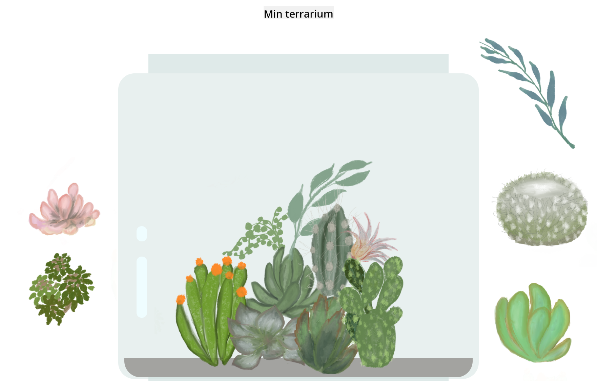

<!--
CO_OP_TRANSLATOR_METADATA:
{
  "original_hash": "7965cd2bc5dc92ad888dc4c6ab2ab70a",
  "translation_date": "2025-08-26T21:28:12+00:00",
  "source_file": "3-terrarium/README.md",
  "language_code": "sv"
}
-->
# Mitt Terrarium: Ett projekt för att lära sig om HTML, CSS och DOM-manipulation med JavaScript 🌵🌱

En liten drag-och-släpp kodmeditation. Med lite HTML, JS och CSS kommer du kunna bygga ett webbgränssnitt, styla det och till och med lägga till flera interaktioner efter eget val.

# Lektioner

1. [Introduktion till HTML](./1-intro-to-html/README.md)
2. [Introduktion till CSS](./2-intro-to-css/README.md)
3. [Introduktion till DOM och JS Closures](./3-intro-to-DOM-and-closures/README.md)

## Krediter

Skrivet med ♥️ av [Jen Looper](https://www.twitter.com/jenlooper)

Terrariet skapat med CSS är inspirerat av Jakub Mandras glasburk [codepen](https://codepen.io/Rotarepmi/pen/rjpNZY).

Konstverket är handritat av [Jen Looper](http://jenlooper.com) med hjälp av Procreate.

## Publicera ditt Terrarium

Du kan publicera ditt terrarium på webben med hjälp av Azure Static Web Apps.

1. Forka detta repo

2. Tryck på denna knapp

3. Följ guiden för att skapa din app. Se till att du ställer in appens rot till antingen `/solution` eller roten av din kodbas. Det finns ingen API i denna app, så du behöver inte oroa dig för att lägga till det. En github-mapp kommer att skapas i ditt forkade repository som hjälper Azure Static Web Apps' byggtjänster att bygga och publicera din app till en ny URL.

---

**Ansvarsfriskrivning**:  
Detta dokument har översatts med hjälp av AI-översättningstjänsten [Co-op Translator](https://github.com/Azure/co-op-translator). Även om vi strävar efter noggrannhet, bör du vara medveten om att automatiserade översättningar kan innehålla fel eller felaktigheter. Det ursprungliga dokumentet på dess ursprungliga språk bör betraktas som den auktoritativa källan. För kritisk information rekommenderas professionell mänsklig översättning. Vi ansvarar inte för eventuella missförstånd eller feltolkningar som uppstår vid användning av denna översättning.