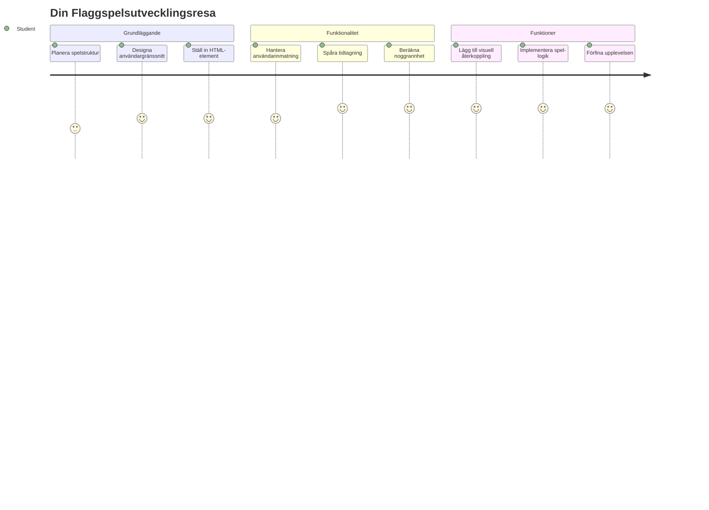
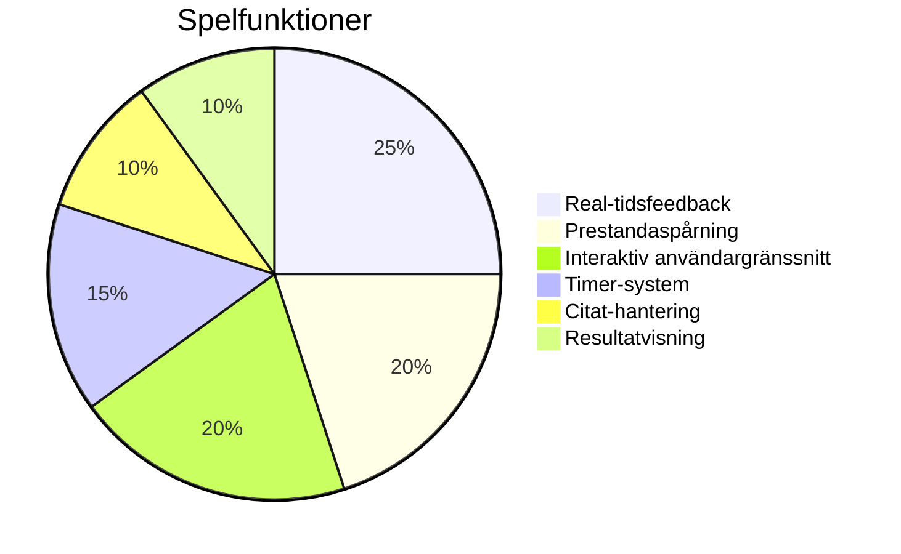
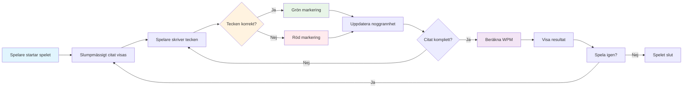
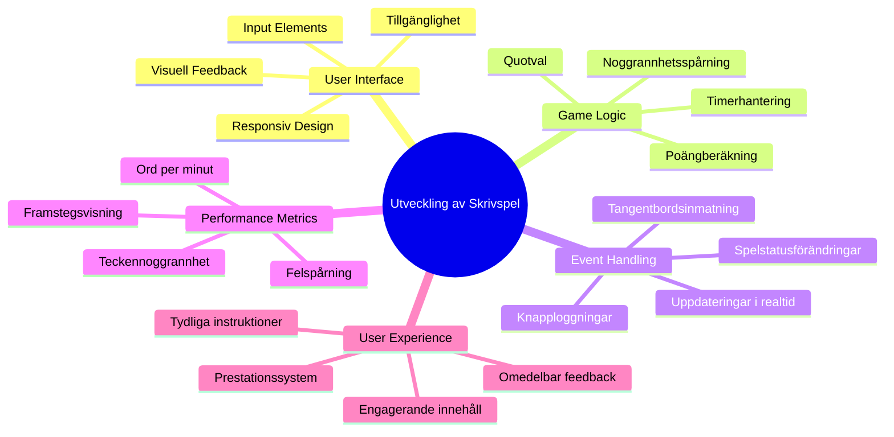
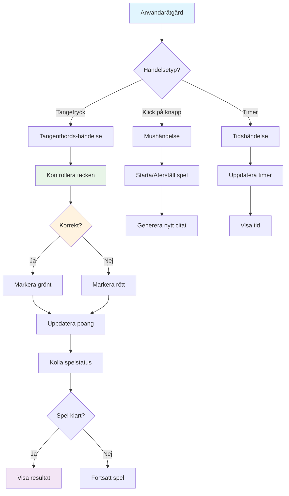
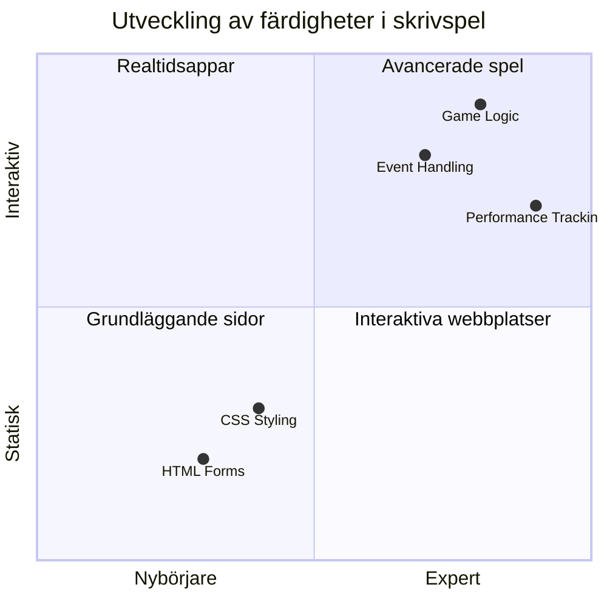
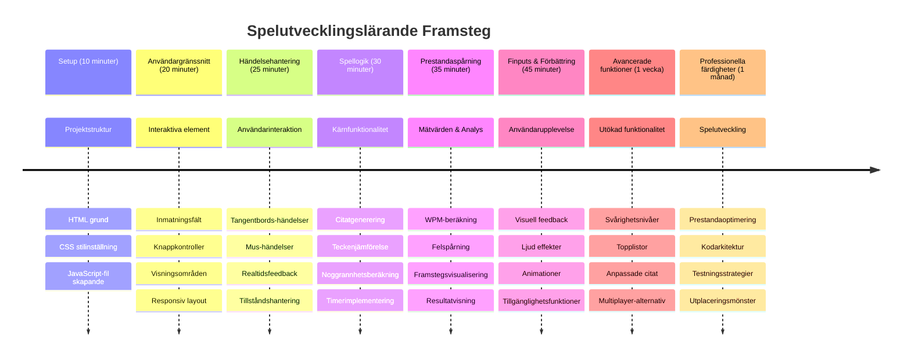

<!--
CO_OP_TRANSLATOR_METADATA:
{
  "original_hash": "efa2ab875b8bb5a7883816506da6b6d2",
  "translation_date": "2026-01-06T22:31:55+00:00",
  "source_file": "4-typing-game/README.md",
  "language_code": "sv"
}
-->
# Eventstyrd programmering - Bygg ett skrivspel

## Introduktion

Här är något som alla utvecklare vet men sällan pratar om: att skriva snabbt är en superkraft! 🚀 Tänk på det - ju snabbare du kan få dina idéer från hjärnan till din kodredigerare, desto mer kan din kreativitet flöda. Det är som att ha en direktledning mellan dina tankar och skärmen.

Vill du veta ett av de bästa sätten att förbättra denna förmåga? Du gissade rätt - vi ska bygga ett spel!

> Låt oss skapa ett fantastiskt skrivspel tillsammans!

Redo att använda alla de där JavaScript-, HTML- och CSS-kunskaperna som du har lärt dig? Vi ska bygga ett skrivspel som utmanar dig med slumpmässiga citat från den legendariska detektiven [Sherlock Holmes](https://en.wikipedia.org/wiki/Sherlock_Holmes). Spelet kommer att mäta hur snabbt och noggrant du kan skriva - och tro mig, det är mer beroendeframkallande än du kanske tror!

## Vad du behöver kunna

Innan vi dyker in, se till att du är bekväm med följande begrepp (oroa dig inte om du behöver en snabb uppfräschning - vi har alla varit där!):

- Skapa textinmatning och knappkontroller
- CSS och att ställa in stilar med hjälp av klasser  
- Grundläggande JavaScript
  - Skapa en array
  - Skapa ett slumpmässigt tal
  - Hämta aktuell tid

Om något av detta känns lite rostigt är det helt okej! Ibland är det bästa sättet att befästa kunskapen genom att kasta sig in i ett projekt och lista ut saker under tiden.

### 🔄 **Pedagogisk kontroll**
**Grundläggande bedömning**: Innan du börjar utvecklingen, se till att du förstår:
- ✅ Hur HTML-formulär och inmatningselement fungerar
- ✅ CSS-klasser och dynamisk styling
- ✅ JavaScript event-lyssnare och hanterare
- ✅ Arraymanipulation och slumpmässigt val
- ✅ Tidsmätning och beräkningar

**Snabb självtest**: Kan du förklara hur dessa koncept samverkar i ett interaktivt spel?
- **Händelser** triggas när användare interagerar med element
- **Hanterare** bearbetar dessa händelser och uppdaterar spelstatus
- **CSS** ger visuell återkoppling för användarens handlingar
- **Tidsinställning** möjliggör mätning av prestation och spelprogression

## Nu bygger vi detta!

[Skapa ett skrivspel med eventstyrd programmering](./typing-game/README.md)

### ⚡ **Vad du kan göra under de kommande 5 minuterna**
- [ ] Öppna webbläsarens konsol och prova att lyssna på tangentborttryckningar med `addEventListener`
- [ ] Skapa en enkel HTML-sida med ett inmatningsfält och testa skrivaavkänning
- [ ] Öva på strängmanipulation genom att jämföra inskriven text med måltext
- [ ] Experimentera med `setTimeout` för att förstå tidsfunktioner

### 🎯 **Vad du kan uppnå denna timme**
- [ ] Klara efterlektionens quiz och förstå eventstyrd programmering
- [ ] Bygg en grundläggande version av skrivspelet med ordvalidering
- [ ] Lägg till visuell återkoppling för rätt och fel skrivande
- [ ] Implementera ett enkelt poängsystem baserat på hastighet och noggrannhet
- [ ] Styla spelet med CSS för att göra det visuellt tilltalande

### 📅 **Din veckolånga spelutveckling**
- [ ] Komplett skrivspel med alla funktioner och polering
- [ ] Lägg till svårighetsgrader med varierande ordkomplexitet
- [ ] Implementera användarstatistik (WPM, noggrannhet över tid)
- [ ] Skapa ljudeffekter och animationer för bättre användarupplevelse
- [ ] Gör spelet mobilanpassat för pekskärmsenheter
- [ ] Dela spelet online och samla feedback från användare

### 🌟 **Din månadslånga interaktiva utveckling**
- [ ] Bygg flera spel som utforskar olika interaktionsmönster
- [ ] Lär dig om spelloopar, tillståndshantering och prestandaoptimering
- [ ] Bidra till open source-projekt för spelutveckling
- [ ] Bemästra avancerade tidskoncept och smidiga animationer
- [ ] Skapa en portfolio som visar olika interaktiva applikationer
- [ ] Mentorera andra intresserade av spelutveckling och användarinteraktion

## 🎯 Din tidslinje för mästerskap i skrivspelet

### 🛠️ Din sammanfattning av spelutvecklingsverktyg

Efter att ha slutfört detta projekt kommer du ha bemästrat:
- **Eventstyrd programmering**: Responsiva användargränssnitt som reagerar på inmatning
- **Real-tids återkoppling**: Omedelbara visuella och prestationsuppdateringar
- **Prestandamätning**: Exakta tids- och poängsystem
- **Speltillståndshantering**: Kontroll över applikationens flöde och användarupplevelse
- **Interaktiv design**: Skapande av engagerande, beroendeframkallande användarupplevelser
- **Moderna web API:er**: Användning av webbläsarfunktioner för rika interaktioner
- **Tillgänglighetsmönster**: Inkluderande design för alla användare

**Verkliga tillämpningar**: Dessa färdigheter är direkt tillämpliga på:
- **Webbapplikationer**: Alla interaktiva gränssnitt eller dashboards
- **Utbildningsprogramvara**: Lärandeplattformar och kompetensbedömningsverktyg
- **Produktivitetsverktyg**: Textredigerare, IDE:er och samarbetsprogramvara
- **Spelindustrin**: Webbläsarspel och interaktiv underhållning
- **Mobilutveckling**: Pekbaserade gränssnitt och gesthantering

**Nästa nivå**: Du är redo att utforska avancerade spelramverk, realtids-multiplayer system eller komplexa interaktiva applikationer!

## Credits

Skrivet med ♥️ av [Christopher Harrison](http://www.twitter.com/geektrainer)

---

<!-- CO-OP TRANSLATOR DISCLAIMER START -->
**Ansvarsfriskrivning**:  
Detta dokument har översatts med hjälp av AI-översättningstjänsten [Co-op Translator](https://github.com/Azure/co-op-translator). Även om vi strävar efter noggrannhet, bör du vara medveten om att automatiska översättningar kan innehålla fel eller brister. Det ursprungliga dokumentet på dess ursprungliga språk ska betraktas som den auktoritativa källan. För viktig information rekommenderas professionell mänsklig översättning. Vi ansvarar inte för eventuella missförstånd eller feltolkningar som uppstår vid användning av denna översättning.
<!-- CO-OP TRANSLATOR DISCLAIMER END -->