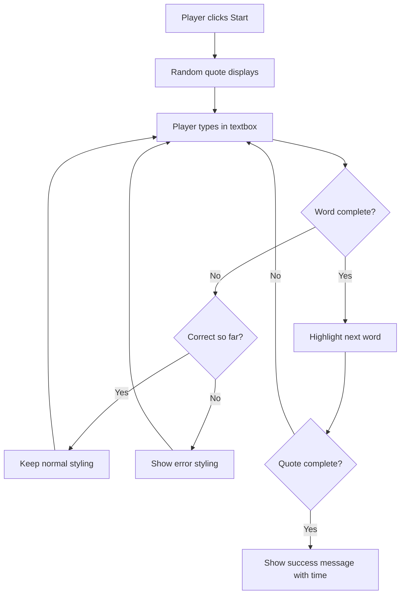
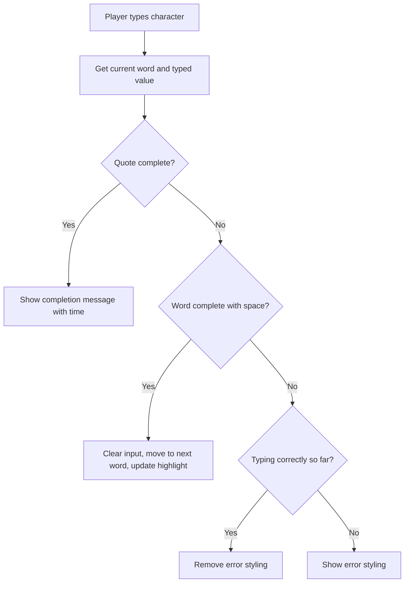

<!--
CO_OP_TRANSLATOR_METADATA:
{
  "original_hash": "e6b75e5b8caae906473a8a09d77b7121",
  "translation_date": "2025-10-23T21:45:02+00:00",
  "source_file": "4-typing-game/typing-game/README.md",
  "language_code": "sv"
}
-->
# Skapa ett spel med hjälp av händelser

Har du någonsin undrat hur webbplatser vet när du klickar på en knapp eller skriver i en textruta? Det är magin med händelsestyrd programmering! Vilket bättre sätt att lära sig denna viktiga färdighet än att bygga något användbart - ett skrivhastighetsspel som reagerar på varje tangenttryckning du gör.

Du kommer att få se hur webbläsare "pratar" med din JavaScript-kod. Varje gång du klickar, skriver eller rör musen skickar webbläsaren små meddelanden (vi kallar dem händelser) till din kod, och du får bestämma hur du ska reagera!

När vi är klara här kommer du ha byggt ett riktigt skrivspel som mäter din hastighet och noggrannhet. Ännu viktigare, du kommer att förstå de grundläggande koncepten som driver varje interaktiv webbplats du någonsin har använt. Låt oss sätta igång!

## Quiz före föreläsningen

[Quiz före föreläsningen](https://ff-quizzes.netlify.app/web/quiz/21)

## Händelsestyrd programmering

Tänk på din favoritapp eller webbplats - vad får den att kännas levande och responsiv? Det handlar om hur den reagerar på vad du gör! Varje tryck, klick, svep eller tangenttryckning skapar det vi kallar en "händelse", och det är där den verkliga magin med webbutveckling händer.

Här är vad som gör programmering för webben så intressant: vi vet aldrig när någon kommer att klicka på den där knappen eller börja skriva i en textruta. De kanske klickar direkt, väntar fem minuter eller kanske aldrig klickar alls! Denna oförutsägbarhet innebär att vi måste tänka annorlunda kring hur vi skriver vår kod.

Istället för att skriva kod som körs från topp till botten som ett recept, skriver vi kod som sitter och väntar på att något ska hända. Det är likt hur telegrafoperatörer på 1800-talet satt vid sina maskiner, redo att svara så snart ett meddelande kom genom tråden.

Så vad exakt är en "händelse"? Enkelt uttryckt, det är något som händer! När du klickar på en knapp - det är en händelse. När du skriver en bokstav - det är en händelse. När du rör musen - det är en annan händelse.

Händelsestyrd programmering låter oss ställa in vår kod för att lyssna och reagera. Vi skapar speciella funktioner som kallas **händelselyssnare** som väntar tålmodigt på specifika saker att hända, och sedan agerar när de gör det.

Tänk på händelselyssnare som att ha en dörrklocka för din kod. Du ställer in dörrklockan (`addEventListener()`), berättar vilken ljudsignal den ska lyssna efter (som ett 'klick' eller 'tangenttryckning'), och sedan specificerar vad som ska hända när någon ringer på den (din anpassade funktion).

**Så här fungerar händelselyssnare:**
- **Lyssnar** efter specifika användaråtgärder som klick, tangenttryckningar eller musrörelser
- **Utför** din anpassade kod när den angivna händelsen inträffar
- **Reagerar** omedelbart på användarinteraktioner och skapar en smidig upplevelse
- **Hantera** flera händelser på samma element med olika lyssnare

> **NOTE:** Det är värt att påpeka att det finns många sätt att skapa händelselyssnare. Du kan använda anonyma funktioner eller skapa namngivna. Du kan använda olika genvägar, som att ställa in `click`-egenskapen eller använda `addEventListener()`. I vår övning kommer vi att fokusera på `addEventListener()` och anonyma funktioner, eftersom det förmodligen är den vanligaste tekniken som webbutvecklare använder. Det är också den mest flexibla, eftersom `addEventListener()` fungerar för alla händelser och händelsenamnet kan anges som en parameter.

### Vanliga händelser

Även om webbläsare erbjuder dussintals olika händelser att lyssna på, förlitar sig de flesta interaktiva applikationer på bara en handfull viktiga händelser. Att förstå dessa kärnhändelser ger dig grunden för att bygga sofistikerade användarinteraktioner.

Det finns [dussintals händelser](https://developer.mozilla.org/docs/Web/Events) som du kan lyssna på när du skapar en applikation. I princip allt en användare gör på en sida skapar en händelse, vilket ger dig mycket kraft att säkerställa att de får den upplevelse du önskar. Lyckligtvis behöver du normalt bara ett fåtal händelser. Här är några vanliga (inklusive de två vi kommer att använda när vi skapar vårt spel):

| Händelse | Beskrivning | Vanliga användningsområden |
|----------|-------------|----------------------------|
| `click` | Användaren klickade på något | Knappar, länkar, interaktiva element |
| `contextmenu` | Användaren klickade med höger musknapp | Anpassade högerklicksmenyer |
| `select` | Användaren markerade text | Textredigering, kopieringsoperationer |
| `input` | Användaren skrev in text | Formulärvalidering, realtidssökning |

**Att förstå dessa händelsetyper:**
- **Triggar** när användare interagerar med specifika element på din sida
- **Ger** detaljerad information om användarens handling genom händelseobjekt
- **Möjliggör** att du kan skapa responsiva, interaktiva webbapplikationer
- **Fungerar** konsekvent över olika webbläsare och enheter

## Skapa spelet

Nu när du förstår hur händelser fungerar, låt oss omsätta den kunskapen i praktiken genom att bygga något användbart. Vi ska skapa ett skrivhastighetsspel som demonstrerar händelsehantering samtidigt som det hjälper dig att utveckla en viktig färdighet som utvecklare.

Vi ska skapa ett spel för att utforska hur händelser fungerar i JavaScript. Vårt spel kommer att testa spelarens skrivförmåga, vilket är en av de mest underskattade färdigheterna som alla utvecklare borde ha. Rolig fakta: QWERTY-tangentbordslayouten vi använder idag designades faktiskt på 1870-talet för skrivmaskiner - och goda skrivfärdigheter är fortfarande lika värdefulla för programmerare idag! Den allmänna spelgången kommer att se ut så här:



**Så här kommer vårt spel att fungera:**
- **Startar** när spelaren klickar på startknappen och visar ett slumpmässigt citat
- **Spårar** spelarens skrivframsteg ord för ord i realtid
- **Markerar** det aktuella ordet för att vägleda spelarens fokus
- **Ger** omedelbar visuell feedback för skrivfel
- **Beräknar** och visar den totala tiden när citatet är klart

Låt oss bygga vårt spel och lära oss om händelser!

### Filstruktur

Innan vi börjar koda, låt oss organisera oss! Att ha en ren filstruktur från början sparar dig huvudvärk senare och gör ditt projekt mer professionellt. 😊

Vi kommer att hålla det enkelt med bara tre filer: `index.html` för vår sidstruktur, `script.js` för all vår spellogik och `style.css` för att få allt att se bra ut. Detta är den klassiska trion som driver de flesta webbplatser!

**Skapa en ny mapp för ditt arbete genom att öppna en konsol eller terminalfönster och köra följande kommando:**

```bash
# Linux or macOS
mkdir typing-game && cd typing-game

# Windows
md typing-game && cd typing-game
```

**Här är vad dessa kommandon gör:**
- **Skapar** en ny katalog som heter `typing-game` för dina projektfiler
- **Navigerar** automatiskt in i den nyss skapade katalogen
- **Ställer in** en ren arbetsyta för din spelutveckling

**Öppna Visual Studio Code:**

```bash
code .
```

**Detta kommando:**
- **Startar** Visual Studio Code i den aktuella katalogen
- **Öppnar** din projektmapp i editorn
- **Ger** tillgång till alla utvecklingsverktyg du behöver

**Lägg till tre filer i mappen i Visual Studio Code med följande namn:**
- `index.html` - Innehåller strukturen och innehållet för ditt spel
- `script.js` - Hanterar all spellogik och händelselyssnare
- `style.css` - Definierar det visuella utseendet och stilen

## Skapa användargränssnittet

Nu ska vi bygga scenen där all vår spelaction kommer att äga rum! Tänk på detta som att designa kontrollpanelen för ett rymdskepp - vi måste se till att allt våra spelare behöver finns precis där de förväntar sig det.

Låt oss lista ut vad vårt spel faktiskt behöver. Om du spelade ett skrivspel, vad skulle du vilja se på skärmen? Här är vad vi behöver:

| UI-element | Syfte | HTML-element |
|------------|-------|--------------|
| Citatvisning | Visar texten att skriva | `<p>` med `id="quote"` |
| Meddelandeområde | Visar status- och framgångsmeddelanden | `<p>` med `id="message"` |
| Textinmatning | Där spelare skriver citatet | `<input>` med `id="typed-value"` |
| Startknapp | Startar spelet | `<button>` med `id="start"` |

**Att förstå UI-strukturen:**
- **Organiserar** innehåll logiskt från topp till botten
- **Tilldelar** unika ID:n till element för JavaScript-mål
- **Ger** en tydlig visuell hierarki för bättre användarupplevelse
- **Inkluderar** semantiska HTML-element för tillgänglighet

Varje av dessa behöver ID:n så att vi kan arbeta med dem i vår JavaScript. Vi kommer också att lägga till referenser till CSS- och JavaScript-filerna vi ska skapa.

Skapa en ny fil som heter `index.html`. Lägg till följande HTML:

```html
<!-- inside index.html -->
<html>
<head>
  <title>Typing game</title>
  <link rel="stylesheet" href="style.css">
</head>
<body>
  <h1>Typing game!</h1>
  <p>Practice your typing skills with a quote from Sherlock Holmes. Click **start** to begin!</p>
  <p id="quote"></p> <!-- This will display our quote -->
  <p id="message"></p> <!-- This will display any status messages -->
  <div>
    <input type="text" aria-label="current word" id="typed-value" /> <!-- The textbox for typing -->
    <button type="button" id="start">Start</button> <!-- To start the game -->
  </div>
  <script src="script.js"></script>
</body>
</html>
```

**Att bryta ner vad denna HTML-struktur åstadkommer:**
- **Länkar** CSS-stilmallen i `<head>` för styling
- **Skapar** en tydlig rubrik och instruktioner för användare
- **Etablerar** platshållarparagrafer med specifika ID:n för dynamiskt innehåll
- **Inkluderar** ett inmatningsfält med tillgänglighetsattribut
- **Tillhandahåller** en startknapp för att trigga spelet
- **Laddar** JavaScript-filen i slutet för optimal prestanda

### Starta applikationen

Att testa din applikation ofta under utvecklingen hjälper dig att upptäcka problem tidigt och se dina framsteg i realtid. Live Server är ett ovärderligt verktyg som automatiskt uppdaterar din webbläsare när du sparar ändringar, vilket gör utvecklingen mycket effektivare.

Det är alltid bäst att utveckla iterativt för att se hur saker ser ut. Låt oss starta vår applikation. Det finns en fantastisk tillägg för Visual Studio Code som heter [Live Server](https://marketplace.visualstudio.com/items?itemName=ritwickdey.LiveServer&WT.mc_id=academic-77807-sagibbon) som både kommer att vara värd för din applikation lokalt och uppdatera webbläsaren varje gång du sparar.

**Installera [Live Server](https://marketplace.visualstudio.com/items?itemName=ritwickdey.LiveServer&WT.mc_id=academic-77807-sagibbon) genom att följa länken och klicka på Installera:**

**Här är vad som händer under installationen:**
- **Öppnar** din webbläsare för att starta Visual Studio Code
- **Vägleder** dig genom installationsprocessen för tillägget
- **Kan kräva** att du startar om Visual Studio Code för att slutföra installationen

**När det är installerat, klicka på Ctrl-Shift-P (eller Cmd-Shift-P) i Visual Studio Code för att öppna kommandopaletten:**

**Att förstå kommandopaletten:**
- **Ger** snabb åtkomst till alla VS Code-kommandon
- **Söker** kommandon medan du skriver
- **Erbjuder** kortkommandon för snabbare utveckling

**Skriv "Live Server: Open with Live Server":**

**Vad Live Server gör:**
- **Startar** en lokal utvecklingsserver för ditt projekt
- **Uppdaterar** automatiskt webbläsaren när du sparar filer
- **Serverar** dina filer från en lokal URL (vanligtvis `localhost:5500`)

**Öppna en webbläsare och navigera till `https://localhost:5500`:**

Du bör nu se sidan du skapade! Låt oss lägga till lite funktionalitet.

## Lägg till CSS

Nu ska vi få saker att se bra ut! Visuell feedback har varit avgörande för användargränssnitt sedan datorernas tidiga dagar. På 1980-talet upptäckte forskare att omedelbar visuell feedback dramatiskt förbättrar användarens prestation och minskar fel. Det är precis vad vi ska skapa.

Vårt spel behöver vara kristallklart om vad som händer. Spelare ska omedelbart veta vilket ord de ska skriva, och om de gör ett misstag ska de se det direkt. Låt oss skapa en enkel men effektiv styling:

Skapa en ny fil som heter `style.css` och lägg till följande syntax.

```css
/* inside style.css */
.highlight {
  background-color: yellow;
}

.error {
  background-color: lightcoral;
  border: red;
}
```

**Att förstå dessa CSS-klasser:**
- **Markerar** det aktuella ordet med en gul bakgrund för tydlig visuell vägledning
- **Signalerar** skrivfel med en ljus korallfärgad bakgrund
- **Ger** omedelbar feedback utan att störa användarens skrivflöde
- **Använder** kontrasterande färger för tillgänglighet och tydlig visuell kommunikation

✅ När det gäller CSS kan du layouta din sida hur du vill. Ta lite tid och gör sidan mer tilltalande:

- Välj ett annat typsnitt
- Färglägg rubrikerna
- Ändra storlek på element

## JavaScript

Nu blir det intressant! 🎉 Vi har vår HTML-struktur och vår CSS-styling, men just nu är vårt spel som en vacker bil utan motor. JavaScript kommer att vara den motorn - det är vad som får allt att faktiskt fungera och reagera på vad spelarna gör.

Här kommer du att se din skapelse komma till liv. Vi ska ta oss an detta steg för steg så att inget känns överväldigande:

| Steg | Syfte | Vad du kommer att lära dig |
|------|-------|----------------------------|
| [Skapa konstanterna](../../../../4-typing-game/typing-game) | Ställ in citat och DOM-referenser | Variabelhantering och DOM-val |
| [Händelselyssnare för att starta spelet](../../../../4-typing-game/typing-game) | Hantera spelinitiering | Händelsehantering och UI-uppdateringar |
| [Händelselyssnare för skrivning](../../../../4-typing-game/typing-game) | Bearbeta användarinmatning i realtid | Inmatningsvalidering och dynamisk feedback |

**Denna strukturerade metod hjälper dig:**
- **Organisera** din kod i logiska, hanterbara sektioner
- **Bygga** funktionalitet stegvis för enklare felsökning
- **Förstå** hur olika delar av din applikation samverkar
- **Skapa** återanvändbara mönster för framtida projekt

Men först, skapa en ny fil som heter `script.js`.

### Lägg till konstanterna

Innan vi dyker in i handlingen, låt oss samla alla våra resurser! Precis som hur NASA:s kontrollcenter ställer in alla sina övervakningssystem före en uppskjutning, är det mycket enklare när du har allt förberett och redo att gå. Detta sparar oss från att leta runt efter saker senare och hjälper till att förhindra stavfel.

Här är vad vi behöver ställa in först:

| Datatyp | Syfte | Exempel |
|---------|-------|---------|
| Array av citat | Lagra alla möjliga citat för spelet | `['Citat 1', 'Citat 2', ...]` |
| Ord-array | Dela upp aktuellt citat i enskilda ord | `['När', 'du', 'har', ...]` |
| Ordindex | Håll koll på vilket ord spelaren skriver | `0, 1, 2, 3...` |
| Starttid | Beräkna förfluten tid för poängberäkning | `Date.now()` |

**Vi behöver också referenser till våra UI-element:**
| Element | ID | Syfte |
|---------|----|-------|
| Textinmatning | `typed-value` | Där spelarna skriver |
| Citatvisning | `quote` | Visar citatet att skriva |
| Meddelandeområde | `message` | Visar statusuppdateringar |

```javascript
// inside script.js
// all of our quotes
const quotes = [
    'When you have eliminated the impossible, whatever remains, however improbable, must be the truth.',
    'There is nothing more deceptive than an obvious fact.',
    'I ought to know by this time that when a fact appears to be opposed to a long train of deductions it invariably proves to be capable of bearing some other interpretation.',
    'I never make exceptions. An exception disproves the rule.',
    'What one man can invent another can discover.',
    'Nothing clears up a case so much as stating it to another person.',
    'Education never ends, Watson. It is a series of lessons, with the greatest for the last.',
];
// store the list of words and the index of the word the player is currently typing
let words = [];
let wordIndex = 0;
// the starting time
let startTime = Date.now();
// page elements
const quoteElement = document.getElementById('quote');
const messageElement = document.getElementById('message');
const typedValueElement = document.getElementById('typed-value');
```

**Bryta ner vad denna setup-kod gör:**
- **Lagrar** en array av Sherlock Holmes-citat med `const` eftersom citaten inte kommer att ändras
- **Initierar** spårningsvariabler med `let` eftersom dessa värden kommer att uppdateras under spelets gång
- **Hämtar** referenser till DOM-element med `document.getElementById()` för effektiv åtkomst
- **Skapar** grunden för all spelfunktionalitet med tydliga, beskrivande variabelnamn
- **Organiserar** relaterad data och element logiskt för enklare kodunderhåll

✅ Lägg till fler citat till ditt spel

> 💡 **Proffstips**: Vi kan hämta elementen när som helst i koden genom att använda `document.getElementById()`. Eftersom vi kommer att referera till dessa element regelbundet undviker vi stavfel med stränglitteraler genom att använda konstanter. Ramverk som [Vue.js](https://vuejs.org/) eller [React](https://reactjs.org/) kan hjälpa dig att bättre hantera centralisering av din kod.
>
**Varför denna metod fungerar så bra:**
- **Förhindrar** stavfel när element refereras flera gånger
- **Förbättrar** kodläsbarheten med beskrivande konstantnamn
- **Möjliggör** bättre IDE-stöd med autokomplettering och felkontroll
- **Gör** omstrukturering enklare om element-ID:n ändras senare

Ta en minut och titta på en video om att använda `const`, `let` och `var`

[](https://youtube.com/watch?v=JNIXfGiDWM8 "Typer av variabler")

> 🎥 Klicka på bilden ovan för en video om variabler.

### Lägg till startlogik

Nu börjar allt falla på plats! 🚀 Du är på väg att skriva din första riktiga eventlyssnare, och det är något väldigt tillfredsställande med att se din kod reagera på ett knapptryck.

Tänk på det: någonstans där ute kommer en spelare att klicka på "Start"-knappen, och din kod måste vara redo för dem. Vi har ingen aning om när de kommer att klicka - det kan vara direkt, eller efter att de hämtat en kopp kaffe - men när de gör det, vaknar ditt spel till liv.

När användaren klickar på `start` behöver vi välja ett citat, ställa in användargränssnittet och sätta upp spårning för aktuellt ord och tidtagning. Nedan är JavaScript-koden du behöver lägga till; vi diskuterar den precis efter kodblocket.

```javascript
// at the end of script.js
document.getElementById('start').addEventListener('click', () => {
  // get a quote
  const quoteIndex = Math.floor(Math.random() * quotes.length);
  const quote = quotes[quoteIndex];
  // Put the quote into an array of words
  words = quote.split(' ');
  // reset the word index for tracking
  wordIndex = 0;

  // UI updates
  // Create an array of span elements so we can set a class
  const spanWords = words.map(function(word) { return `<span>${word} </span>`});
  // Convert into string and set as innerHTML on quote display
  quoteElement.innerHTML = spanWords.join('');
  // Highlight the first word
  quoteElement.childNodes[0].className = 'highlight';
  // Clear any prior messages
  messageElement.innerText = '';

  // Setup the textbox
  // Clear the textbox
  typedValueElement.value = '';
  // set focus
  typedValueElement.focus();
  // set the event handler

  // Start the timer
  startTime = new Date().getTime();
});
```

**Låt oss bryta ner koden i logiska sektioner:**

**📊 Ordspårningssetup:**
- **Väljer** ett slumpmässigt citat med hjälp av `Math.floor()` och `Math.random()` för variation
- **Konverterar** citatet till en array av enskilda ord med `split(' ')`
- **Återställer** `wordIndex` till 0 eftersom spelarna börjar med det första ordet
- **Förbereder** spelstatus för en ny omgång

**🎨 UI-setup och visning:**
- **Skapar** en array av `<span>`-element, som omsluter varje ord för individuell styling
- **Sammanfogar** span-elementen till en enda sträng för effektiv DOM-uppdatering
- **Markerar** det första ordet genom att lägga till CSS-klassen `highlight`
- **Rensar** eventuella tidigare spelmeddelanden för att ge en ren start

**⌨️ Textboxförberedelse:**
- **Rensar** eventuell befintlig text i inmatningsfältet
- **Sätter fokus** på textboxen så att spelarna kan börja skriva direkt
- **Förbereder** inmatningsområdet för den nya spelomgången

**⏱️ Timerinitiering:**
- **Hämtar** aktuell tidsstämpel med `new Date().getTime()`
- **Möjliggör** noggrann beräkning av skrivhastighet och slutförandetid
- **Startar** prestationsspårning för spelomgången

### Lägg till skrivlogik

Här tar vi itu med hjärtat av vårt spel! Oroa dig inte om detta verkar mycket till en början - vi går igenom varje del, och i slutet kommer du att se hur logiskt allt är.

Vad vi bygger här är ganska sofistikerat: varje gång någon skriver en bokstav kommer vår kod att kontrollera vad de skrev, ge dem feedback och bestämma vad som ska hända härnäst. Det liknar hur tidiga ordbehandlare som WordStar på 1970-talet gav realtidsfeedback till skrivare.

```javascript
// at the end of script.js
typedValueElement.addEventListener('input', () => {
  // Get the current word
  const currentWord = words[wordIndex];
  // get the current value
  const typedValue = typedValueElement.value;

  if (typedValue === currentWord && wordIndex === words.length - 1) {
    // end of sentence
    // Display success
    const elapsedTime = new Date().getTime() - startTime;
    const message = `CONGRATULATIONS! You finished in ${elapsedTime / 1000} seconds.`;
    messageElement.innerText = message;
  } else if (typedValue.endsWith(' ') && typedValue.trim() === currentWord) {
    // end of word
    // clear the typedValueElement for the new word
    typedValueElement.value = '';
    // move to the next word
    wordIndex++;
    // reset the class name for all elements in quote
    for (const wordElement of quoteElement.childNodes) {
      wordElement.className = '';
    }
    // highlight the new word
    quoteElement.childNodes[wordIndex].className = 'highlight';
  } else if (currentWord.startsWith(typedValue)) {
    // currently correct
    // highlight the next word
    typedValueElement.className = '';
  } else {
    // error state
    typedValueElement.className = 'error';
  }
});
```

**Förstå flödet för skrivlogik:**

Denna funktion använder en vattenfallsmetod, där den kontrollerar villkor från mest specifikt till mest generellt. Låt oss bryta ner varje scenario:



**🏁 Citat slutfört (Scenario 1):**
- **Kontrollerar** om det skrivna värdet matchar det aktuella ordet OCH vi är på sista ordet
- **Beräknar** förfluten tid genom att subtrahera starttid från aktuell tid
- **Konverterar** millisekunder till sekunder genom att dividera med 1 000
- **Visar** gratulationsmeddelande med slutförandetid

**✅ Ord slutfört (Scenario 2):**
- **Upptäcker** att ordet är slutfört när inmatningen slutar med ett mellanslag
- **Validerar** att trimmad inmatning exakt matchar det aktuella ordet
- **Rensar** inmatningsfältet för nästa ord
- **Går vidare** till nästa ord genom att öka `wordIndex`
- **Uppdaterar** visuell markering genom att ta bort alla klasser och markera det nya ordet

**📝 Skrivning pågår (Scenario 3):**
- **Verifierar** att det aktuella ordet börjar med det som har skrivits hittills
- **Tar bort** eventuell felaktig styling för att visa att inmatningen är korrekt
- **Tillåter** fortsatt skrivning utan avbrott

**❌ Felaktigt tillstånd (Scenario 4):**
- **Triggar** när den skrivna texten inte matchar början av det förväntade ordet
- **Applicerar** CSS-klassen för fel för att ge omedelbar visuell feedback
- **Hjälper** spelare att snabbt identifiera och rätta till misstag

## Testa din applikation

Se vad du har åstadkommit! 🎉 Du har precis byggt ett riktigt, fungerande skrivspel från grunden med hjälp av händelsedriven programmering. Ta en stund och uppskatta det - det är ingen liten bedrift!

Nu kommer testfasen! Kommer det att fungera som förväntat? Missade vi något? Här är grejen: om något inte fungerar perfekt direkt, är det helt normalt. Även erfarna utvecklare hittar buggar i sin kod regelbundet. Det är en del av utvecklingsprocessen!

Klicka på `start` och börja skriva! Det borde se ut ungefär som animationen vi såg tidigare.


**Vad du ska testa i din applikation:**
- **Verifierar** att klicka på Start visar ett slumpmässigt citat
- **Bekräftar** att skrivning markerar det aktuella ordet korrekt
- **Kontrollerar** att felaktig styling visas vid felaktig skrivning
- **Säkerställer** att slutförande av ord flyttar markeringen korrekt
- **Testar** att slutförandet av citatet visar slutförandemeddelandet med tidtagning

**Vanliga felsökningstips:**
- **Kontrollera** webbläsarkonsolen (F12) för JavaScript-fel
- **Verifiera** att alla filnamn matchar exakt (skiftlägeskänsligt)
- **Säkerställ** att Live Server körs och uppdateras korrekt
- **Testa** olika citat för att verifiera att slumpmässigt urval fungerar

---

## GitHub Copilot Agent Challenge 🎮

Använd Agent-läget för att slutföra följande utmaning:

**Beskrivning:** Utöka skrivspelet genom att implementera ett svårighetssystem som anpassar spelet baserat på spelarens prestation. Denna utmaning hjälper dig att öva på avancerad händelsehantering, dataanalys och dynamiska UI-uppdateringar.

**Uppdrag:** Skapa ett svårighetsjusteringssystem för skrivspelet som:
1. Spårar spelarens skrivhastighet (ord per minut) och noggrannhetsprocent
2. Justerar automatiskt till tre svårighetsnivåer: Lätt (enkla citat), Medel (aktuella citat), Svår (komplexa citat med skiljetecken)
3. Visar aktuell svårighetsnivå och spelarstatistik i UI
4. Implementerar en streak-räknare som ökar svårigheten efter 3 konsekutiva bra prestationer
5. Lägger till visuell feedback (färger, animationer) för att indikera svårighetsförändringar

Lägg till nödvändiga HTML-element, CSS-stilar och JavaScript-funktioner för att implementera denna funktion. Inkludera korrekt felhantering och säkerställ att spelet förblir tillgängligt med lämpliga ARIA-etiketter.

Läs mer om [agent mode](https://code.visualstudio.com/blogs/2025/02/24/introducing-copilot-agent-mode) här.

## 🚀 Utmaning

Redo att ta ditt skrivspel till nästa nivå? Försök att implementera dessa avancerade funktioner för att fördjupa din förståelse för händelsehantering och DOM-manipulation:

**Lägg till mer funktionalitet:**

| Funktion | Beskrivning | Färdigheter du övar på |
|----------|-------------|------------------------|
| **Inmatningskontroll** | Inaktivera `input`-eventlyssnaren vid slutförande och aktivera den igen när knappen klickas | Händelsehantering och statuskontroll |
| **UI-statushantering** | Inaktivera textfältet när spelaren slutför citatet | Manipulering av DOM-egenskaper |
| **Modal dialogruta** | Visa en modal dialogruta med framgångsmeddelandet | Avancerade UI-mönster och tillgänglighet |
| **High Score-system** | Spara höga poäng med `localStorage` | Webbläsarens lagrings-API:er och datalagring |

**Implementeringstips:**
- **Undersök** `localStorage.setItem()` och `localStorage.getItem()` för beständig lagring
- **Öva** på att lägga till och ta bort eventlyssnare dynamiskt
- **Utforska** HTML-dialogelement eller CSS-modal-mönster
- **Tänk på** tillgänglighet när du inaktiverar och aktiverar formulärkontroller

## Quiz efter föreläsningen

[Quiz efter föreläsningen](https://ff-quizzes.netlify.app/web/quiz/22)

## Granskning & Självstudier

Läs om [alla tillgängliga händelser](https://developer.mozilla.org/docs/Web/Events) för utvecklare via webbläsaren och fundera över scenarier där du skulle använda var och en.

## Uppgift

[Skapa ett nytt tangentbordsspel](assignment.md)

---

**Ansvarsfriskrivning**:  
Detta dokument har översatts med hjälp av AI-översättningstjänsten [Co-op Translator](https://github.com/Azure/co-op-translator). Även om vi strävar efter noggrannhet, bör det noteras att automatiserade översättningar kan innehålla fel eller felaktigheter. Det ursprungliga dokumentet på dess ursprungliga språk bör betraktas som den auktoritativa källan. För kritisk information rekommenderas professionell mänsklig översättning. Vi ansvarar inte för eventuella missförstånd eller feltolkningar som uppstår vid användning av denna översättning.