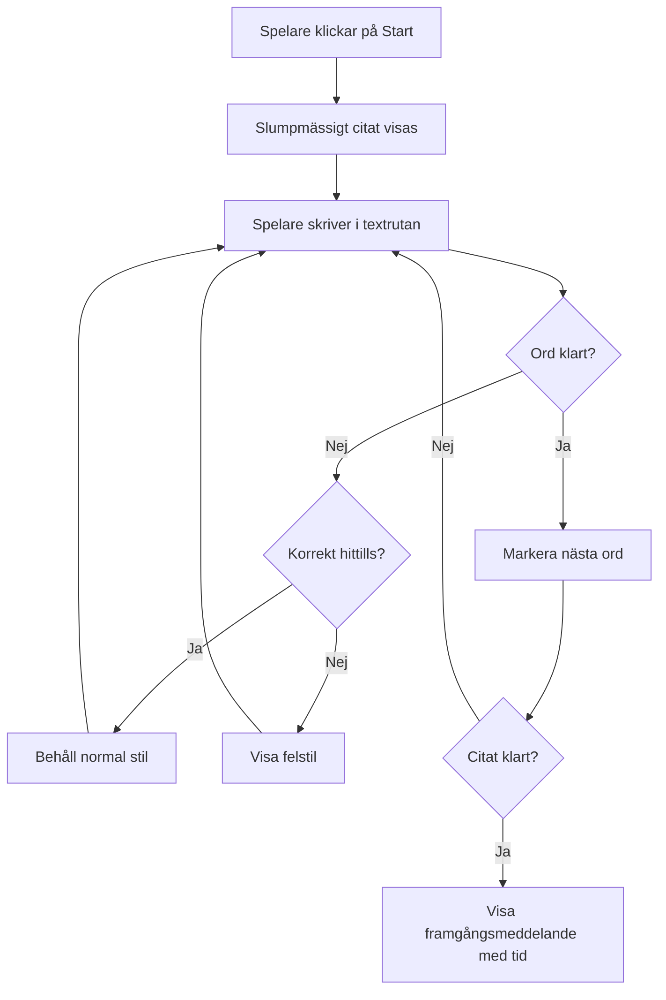
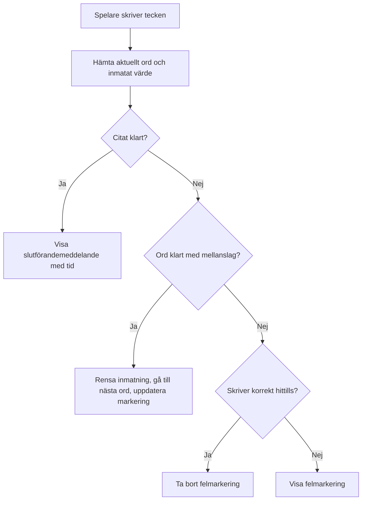
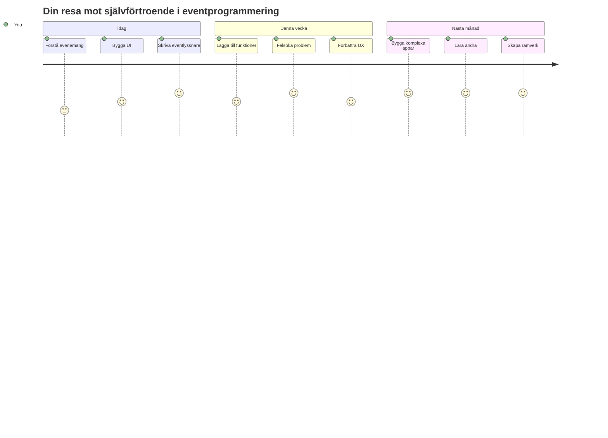

<!--
CO_OP_TRANSLATOR_METADATA:
{
  "original_hash": "da8bc72041a2bb3826a54654ee1a8844",
  "translation_date": "2026-01-06T23:07:36+00:00",
  "source_file": "4-typing-game/typing-game/README.md",
  "language_code": "sv"
}
-->
# Skapa ett spel med händelser

Har du någonsin undrat hur webbplatser vet när du klickar på en knapp eller skriver i en textruta? Det är magin med händelsestyrd programmering! Vad är ett bättre sätt att lära sig denna viktiga färdighet än genom att bygga något användbart – ett skrivhastighetsspel som reagerar på varje tangenttryckning du gör.

Du kommer att se på nära håll hur webbläsare "pratar" med din JavaScript-kod. Varje gång du klickar, skriver eller flyttar musen, skickar webbläsaren små meddelanden (vi kallar dem händelser) till din kod, och du bestämmer hur du vill svara!

När vi är klara här har du byggt ett riktigt skrivspel som mäter din hastighet och noggrannhet. Viktigast av allt är att du kommer att förstå de grundläggande koncepten som driver varje interaktiv webbplats du någonsin har använt. Låt oss sätta igång!

## Förföreläsningsquiz

[Förföreläsningsquiz](https://ff-quizzes.netlify.app/web/quiz/21)

## Händelsestyrd programmering

Tänk på din favoritapp eller webbplats – vad gör att den känns levande och responsiv? Det handlar om hur den reagerar på det du gör! Varje tryckning, klick, svep eller tangenttryckning skapar det vi kallar en "händelse", och det är där den verkliga magin i webbutveckling händer.

Det som gör programmering för webben så intressant är att vi aldrig vet när någon kommer att klicka på den knappen eller börja skriva i en textruta. De kan klicka direkt, vänta fem minuter eller kanske aldrig klicka alls! Denna oförutsägbarhet betyder att vi behöver tänka annorlunda när vi skriver vår kod.

Istället för att skriva kod som körs från toppen till botten som ett recept, skriver vi kod som tålmodigt väntar på att något ska hända. Det liknar hur telegrafoperatörer på 1800-talet satt vid sina maskiner och var redo att svara i samma stund ett meddelande kom genom kabeln.

Så vad är exakt en "händelse"? Enkelt uttryckt är det något som händer! När du klickar på en knapp – det är en händelse. När du skriver en bokstav – det är en händelse. När du rör på musen – det är en annan händelse.

Händelsestyrd programmering låter oss ställa in vår kod för att lyssna och svara. Vi skapar specialfunktioner som kallas **event listeners** (händelselyssnare) som tålmodigt väntar på specifika saker att hända och sedan sätter igång när det sker.

Tänk på event listeners som att ha en dörrklocka för din kod. Du ställer in dörrklockan (`addEventListener()`), berättar vilken ljudsignal den ska lyssna efter (som ett 'click' eller 'keypress') och specificerar sedan vad som ska hända när någon ringer på (din egna funktion).

**Så här fungerar händelselyssnare:**
- **Lyssnar** på specifika användaråtgärder som klick, tangenttryckningar eller musrörelser
- **Utför** din anpassade kod när den angivna händelsen inträffar
- **Svarar** omedelbart på användarinteraktioner och skapar en sömlös upplevelse
- **Hanterar** flera händelser på samma element med olika lyssnare

> **NOTE:** Det är värt att betona att det finns många sätt att skapa händelselyssnare. Du kan använda anonyma funktioner eller skapa namngivna. Du kan använda olika genvägar, som att sätta `click`-egenskapen eller använda `addEventListener()`. I vår övning kommer vi att fokusera på `addEventListener()` och anonyma funktioner, eftersom det förmodligen är den vanligaste tekniken webbutvecklare använder. Det är också mest flexibelt, eftersom `addEventListener()` fungerar för alla händelser och händelsens namn kan ges som en parameter.

### Vanliga händelser

Medan webbläsare erbjuder dussintals olika händelser att lyssna efter, förlitar sig de flesta interaktiva applikationer på bara en handfull viktiga händelser. Att förstå dessa kärnhändelser ger dig grunden för att bygga avancerade användarinteraktioner.

Det finns [dussintals händelser](https://developer.mozilla.org/docs/Web/Events) tillgängliga att lyssna på när du skapar en applikation. I princip väcker allt en användare gör på en sida en händelse, vilket ger dig mycket makt att säkerställa att de får den upplevelse du önskar. Lyckligtvis behöver du normalt bara en liten handfull händelser. Här är några vanliga (inklusive de två vi kommer att använda när vi skapar vårt spel):

| Händelse | Beskrivning | Vanliga Användningsområden |
|----------|-------------|----------------------------|
| `click` | Användaren klickade på något | Knappar, länkar, interaktiva element |
| `contextmenu` | Användaren klickade med höger musknapp | Anpassade högerklicksmenyer |
| `select` | Användaren markerade text | Textredigering, kopieringsoperationer |
| `input` | Användaren skrev in text | Formulärvalidering, realtidssökning |

**Att förstå dessa händelsetyper:**
- **Utlöses** när användare interagerar med specifika element på din sida
- **Ger** detaljerad information om användarens handling via händelseobjekt
- **Möjliggör** att du kan skapa responsiva, interaktiva webbapplikationer
- **Fungerar** konsekvent över olika webbläsare och enheter

## Skapa spelet

Nu när du förstår hur händelser fungerar, låt oss omsätta den kunskapen i praktiken genom att bygga något användbart. Vi ska skapa ett skrivhastighetsspel som visar upp händelsehantering samtidigt som det hjälper dig att utveckla en viktig utvecklarfärdighet.

Vi ska skapa ett spel för att utforska hur händelser fungerar i JavaScript. Vårt spel kommer att testa spelarens skrivkunskaper, vilket är en av de mest underskattade färdigheterna som alla utvecklare bör ha. Rolig fakta: det QWERTY-tangentbord vi använder idag designades faktiskt på 1870-talet för skrivmaskiner – och goda skrivfärdigheter är fortfarande lika värdefulla för programmerare idag! Spelets allmänna flöde kommer att se ut så här:


**Så här fungerar vårt spel:**
- **Startar** när spelaren klickar på startknappen och visar ett slumpmässigt citat
- **Spårar** spelarens skrivprogression ord för ord i realtid
- **Markera** det aktuella ordet för att styra spelarens fokus
- **Ger** omedelbar visuell feedback vid skrivfel
- **Beräknar** och visar den totala tiden när citatet är slutfört

Låt oss bygga vårt spel och lära oss om händelser!

### Filstruktur

Innan vi börjar koda, låt oss organisera oss! Att ha en ren filstruktur från början sparar dig huvudvärk senare och gör ditt projekt mer professionellt. 😊

Vi håller det enkelt med bara tre filer: `index.html` för vår sidstruktur, `script.js` för all vår spelloigik och `style.css` för att få allt att se bra ut. Det är den klassiska trion som driver majoriteten av webben!

**Skapa en ny mapp för ditt arbete genom att öppna en konsol eller terminal och skriva följande kommando:**

```bash
# Linux eller macOS
mkdir typing-game && cd typing-game

# Windows
md typing-game && cd typing-game
```

**Det här gör dessa kommandon:**
- **Skapar** en ny katalog som heter `typing-game` för dina projektfiler
- **Byter** automatiskt till den nyskapade katalogen
- **Sätter upp** en ren arbetsyta för din spelutveckling

**Öppna Visual Studio Code:**

```bash
code .
```

**Detta kommando:**
- **Startar** Visual Studio Code i den aktuella katalogen
- **Öppnar** din projektmapp i editorn
- **Ger** tillgång till alla utvecklingsverktyg du behöver

**Lägg till tre filer i mappen i Visual Studio Code med följande namn:**
- `index.html` - Innehåller strukturen och innehållet för ditt spel
- `script.js` - Hanterar all spelloigik och händelselyssnare
- `style.css` - Definierar det visuella utseendet och stilen

## Skapa användargränssnittet

Nu bygger vi scenen där all spelaktivitet kommer att ske! Tänk på detta som att designa kontrollpanelen för ett rymdskepp – vi måste se till att allt spelarna behöver finns precis där de förväntar sig.

Låt oss ta reda på vad vårt spel faktiskt behöver. Om du spelade ett skrivspel, vad skulle du vilja se på skärmen? Här är vad vi kommer att behöva:

| UI-Element | Syfte | HTML-element |
|------------|--------|-------------|
| Citatvisning | Visar texten att skriva | `<p>` med `id="quote"` |
| Meddelandeområde | Visar status- och framgångsmeddelanden | `<p>` med `id="message"` |
| Textinmatning | Där spelare skriver citatet | `<input>` med `id="typed-value"` |
| Startknapp | Startar spelet | `<button>` med `id="start"` |

**Att förstå UI-strukturen:**
- **Organiserar** innehållet logiskt uppifrån och ner
- **Tilldelar** unika ID:n till element för JavaScript-målning
- **Ger** tydlig visuell hierarki för bättre användarupplevelse
- **Inkluderar** semantiska HTML-element för tillgänglighet

Varje element behöver ett ID så att vi kan arbeta med dem i vår JavaScript. Vi kommer även lägga till referenser till CSS- och JavaScript-filerna vi kommer att skapa.

Skapa en ny fil som heter `index.html`. Lägg till följande HTML:

```html
<!-- inside index.html -->
<html>
<head>
  <title>Typing game</title>
  <link rel="stylesheet" href="style.css">
</head>
<body>
  <h1>Typing game!</h1>
  <p>Practice your typing skills with a quote from Sherlock Holmes. Click **start** to begin!</p>
  <p id="quote"></p> <!-- This will display our quote -->
  <p id="message"></p> <!-- This will display any status messages -->
  <div>
    <input type="text" aria-label="current word" id="typed-value" /> <!-- The textbox for typing -->
    <button type="button" id="start">Start</button> <!-- To start the game -->
  </div>
  <script src="script.js"></script>
</body>
</html>
```

**Det här uppnår denna HTML-struktur:**
- **Länkar** CSS-stilmallen i `<head>` för styling
- **Skapar** en tydlig rubrik och instruktioner för användare
- **Upprättar** platshållarparagrafer med specifika ID:n för dynamiskt innehåll
- **Inkluderar** ett inmatningsfält med tillgänglighetsattribut
- **Ger** en startknapp för att trigga spelet
- **Laddar** JavaScript-filen i slutet för optimal prestanda

### Starta applikationen

Att testa din applikation ofta under utvecklingen hjälper dig att upptäcka problem tidigt och se dina framsteg i realtid. Live Server är ett ovärderligt verktyg som automatiskt uppdaterar din webbläsare varje gång du sparar ändringar, vilket gör utvecklingen mycket effektivare.

Det är alltid bäst att utveckla iterativt för att se hur saker ser ut. Låt oss starta vår applikation. Det finns en underbar tillägg för Visual Studio Code som heter [Live Server](https://marketplace.visualstudio.com/items?itemName=ritwickdey.LiveServer&WT.mc_id=academic-77807-sagibbon) som både kommer att hosta din applikation lokalt och uppdatera webbläsaren varje gång du sparar.

**Installera [Live Server](https://marketplace.visualstudio.com/items?itemName=ritwickdey.LiveServer&WT.mc_id=academic-77807-sagibbon) genom att följa länken och klicka på Installera:**

**Det här sker under installationen:**
- **Ber** din webbläsare att öppna Visual Studio Code
- **Vägleder** dig genom processen för tilläggsinstallation
- **Kan kräva** att du startar om Visual Studio Code för att slutföra installationen

**När det är installerat, i Visual Studio Code, klicka Ctrl-Shift-P (eller Cmd-Shift-P) för att öppna kommandopaletten:**

**Att förstå kommandopaletten:**
- **Ger** snabb åtkomst till alla VS Code-kommandon
- **Söker** kommandon medan du skriver
- **Erbjuder** kortkommandon för snabbare utveckling

**Skriv "Live Server: Open with Live Server":**

**Vad Live Server gör:**
- **Startar** en lokal utvecklingsserver för ditt projekt
- **Uppdaterar automatiskt** webbläsaren när du sparar filer
- **Serverar** dina filer från en lokal URL (vanligtvis `localhost:5500`)

**Öppna en webbläsare och navigera till `https://localhost:5500`:**

Du bör nu se sidan du skapade! Låt oss lägga till lite funktionalitet.

## Lägg till CSS

Nu ska vi få det att se snyggt ut! Visuell feedback har varit avgörande för användargränssnitt sedan datorernas tidiga dagar. På 1980-talet upptäckte forskare att omedelbar visuell feedback dramatiskt förbättrar användarprestanda och minskar fel. Just en sådan feedback ska vi skapa.

Vårt spel behöver vara kristallklart kring vad som händer. Spelarna ska omedelbart veta vilket ord de ska skriva och om de gör ett misstag ska de se det direkt. Låt oss skapa en enkel men effektiv stil:

Skapa en ny fil som heter `style.css` och lägg till följande syntax.

```css
/* inside style.css */
.highlight {
  background-color: yellow;
}

.error {
  background-color: lightcoral;
  border: red;
}
```

**Att förstå dessa CSS-klasser:**
- **Markerar** det aktuella ordet med en gul bakgrund för tydlig visuell vägledning
- **Signalerar** skrivfel med en ljus korallfärgad bakgrund
- **Ger** omedelbar feedback utan att störa spelarens skrivflöde
- **Använder** kontrasterande färger för tillgänglighet och tydlig visuell kommunikation

✅ När det gäller CSS kan du layouta sidan som du vill. Ta lite tid och gör sidan mer tilltalande:

- Välj ett annat typsnitt
- Färgsätt rubrikerna
- Ändra storlek på element

## JavaScript

Här blir det intressant! 🎉 Vi har vår HTML-struktur och vår CSS-styling, men just nu är vårt spel som en vacker bil utan motor. JavaScript ska vara motorn – det som gör att allt faktiskt fungerar och svarar på vad spelarna gör.

Det är här du ser ditt verk komma till liv. Vi tar det steg för steg så inget känns överväldigande:

| Steg | Syfte | Vad du lär dig |
|------|--------|----------------|
| [Skapa konstanter](../../../../4-typing-game/typing-game) | Sätta upp citat och DOM-referenser | Hantering av variabler och DOM-val |
| [Händelselyssnare för att starta spelet](../../../../4-typing-game/typing-game) | Hantera spelinitiering | Händelsehantering och UI-uppdateringar |
| [Händelselyssnare för skrivning](../../../../4-typing-game/typing-game) | Hantera användarinput i realtid | Inputvalidering och dynamisk feedback |

**Denna strukturerade metod hjälper dig att:**
- **Organisera** din kod i logiska, hanterbara sektioner
- **Bygga** funktionalitet steg för steg för enklare felsökning
- **Förstå** hur olika delar av din applikation samverkar
- **Skapa** återanvändbara mönster för framtida projekt

Men först, skapa en ny fil med namnet `script.js`.

### Lägg till konstanterna

Innan vi går in i action, låt oss samla alla resurser! Precis som NASA:s kontrollrum sätter upp alla sina övervakningssystem före uppskjutning är det mycket enklare när du har allt förberett och klart. Det sparar oss från att behöva leta runt senare och hjälper till att undvika stavfel.

Här är vad vi behöver sätta upp först:

| Datatyp | Syfte | Exempel |
| Array of quotes | Spara alla möjliga citat för spelet | `['Quote 1', 'Quote 2', ...]` |
| Word array | Dela upp aktuellt citat i enskilda ord | `['When', 'you', 'have', ...]` |
| Word index | Spåra vilket ord spelaren skriver | `0, 1, 2, 3...` |
| Start time | Beräkna förfluten tid för poängberäkning | `Date.now()` |

**Vi behöver också referenser till våra UI-element:**
| Element | ID | Syfte |
|---------|----|---------|
| Textinput | `typed-value` | Där spelarna skriver |
| Citatvisning | `quote` | Visar citatet som ska skrivas |
| Meddelandeområde | `message` | Visar statusuppdateringar |

```javascript
// i script.js
// alla våra citat
const quotes = [
    'When you have eliminated the impossible, whatever remains, however improbable, must be the truth.',
    'There is nothing more deceptive than an obvious fact.',
    'I ought to know by this time that when a fact appears to be opposed to a long train of deductions it invariably proves to be capable of bearing some other interpretation.',
    'I never make exceptions. An exception disproves the rule.',
    'What one man can invent another can discover.',
    'Nothing clears up a case so much as stating it to another person.',
    'Education never ends, Watson. It is a series of lessons, with the greatest for the last.',
];
// lagra listan över ord och indexet för det ord spelaren för närvarande skriver
let words = [];
let wordIndex = 0;
// starttiden
let startTime = Date.now();
// sidans element
const quoteElement = document.getElementById('quote');
const messageElement = document.getElementById('message');
const typedValueElement = document.getElementById('typed-value');
```

**Bryter ner vad denna uppsättningskod åstadkommer:**
- **Sparar** en array med Sherlock Holmes-citat med `const` eftersom citaten inte kommer att ändras
- **Initierar** spårningsvariabler med `let` eftersom dessa värden kommer att uppdateras under spelets gång
- **Fångar** referenser till DOM-element med `document.getElementById()` för effektiv åtkomst
- **Lägger grunden** för all spel-funktionalitet med tydliga, beskrivande variabelnamn
- **Organiserar** relaterad data och element logiskt för enklare kodunderhåll

✅ Fortsätt och lägg till fler citat till ditt spel

> 💡 **Proffstips**: Vi kan hämta elementen när som helst i koden med `document.getElementById()`. Eftersom vi kommer att referera till dessa element regelbundet undviker vi stavfel i strängar genom att använda konstanter. Ramverk som [Vue.js](https://vuejs.org/) eller [React](https://reactjs.org/) kan hjälpa dig att bättre hantera centraliseringen av din kod.
>
**Så här kommer det sig att denna metod fungerar så bra:**
- **Förebygger** stavfel vid upprepade referenser till element
- **Förbättrar** kodläsbarheten med beskrivande konstantnamn
- **Möjliggör** bättre stöd i IDE med autokomplettering och felkontroll
- **Gör** refaktorering enklare om element-ID ändras senare

Ta en minut att titta på en video om att använda `const`, `let` och `var`

[](https://youtube.com/watch?v=JNIXfGiDWM8 "Typer av variabler")

> 🎥 Klicka på bilden ovan för en video om variabler.

### Lägg till startlogik

Här är platsen där allt faller på plats! 🚀 Du är på väg att skriva din första riktiga händelselyssnare, och det är något väldigt tillfredsställande med att se din kod reagera på ett knapptryck.

Tänk på det: någonstans där ute kommer en spelare att klicka på "Start"-knappen, och din kod behöver vara redo för dem. Vi har ingen aning när de klickar - det kan vara direkt, eller efter att de tagit en kaffe - men när de gör det, sätts spelet igång.

När användaren klickar på `start` måste vi välja ett citat, ställa in användargränssnittet och spåra det aktuella ordet och tiden. Nedan finns JavaScript-koden du behöver lägga till; vi diskuterar den precis efter skriptblocket.

```javascript
// i slutet av script.js
document.getElementById('start').addEventListener('click', () => {
  // hämta ett citat
  const quoteIndex = Math.floor(Math.random() * quotes.length);
  const quote = quotes[quoteIndex];
  // Sätt citatet i en array av ord
  words = quote.split(' ');
  // återställ ordindex för spårning
  wordIndex = 0;

  // UI-uppdateringar
  // Skapa en array av span-element så att vi kan sätta en klass
  const spanWords = words.map(function(word) { return `<span>${word} </span>`});
  // Konvertera till sträng och sätt som innerHTML på citatvisningen
  quoteElement.innerHTML = spanWords.join('');
  // Markera det första ordet
  quoteElement.childNodes[0].className = 'highlight';
  // Rensa eventuella tidigare meddelanden
  messageElement.innerText = '';

  // Förbered textrutan
  // Rensa textrutan
  typedValueElement.value = '';
  // sätt fokus
  typedValueElement.focus();
  // sätt händelsehanteraren

  // Starta timern
  startTime = new Date().getTime();
});
```

**Låt oss bryta ner koden i logiska sektioner:**

**📊 Ordspårningsuppsättning:**
- **Väljer** ett slumpmässigt citat med `Math.floor()` och `Math.random()` för variation
- **Konverterar** citatet till en array av enskilda ord med `split(' ')`
- **Nollställer** `wordIndex` till 0 eftersom spelaren börjar med det första ordet
- **Förbereder** spelstatus för en ny runda

**🎨 UI-uppsättning och visning:**
- **Skapar** en array av `<span>`-element som omsluter varje ord för individuell styling
- **Sammanfogar** span-elementen till en sträng för effektiv DOM-uppdatering
- **Markerar** det första ordet genom att lägga till CSS-klassen `highlight`
- **Rensar** tidigare spelmeddelanden för en ren start

**⌨️ Textfältförberedelse:**
- **Tömmer** eventuell text i inmatningsfältet
- **Sätter fokus** på textfältet så att spelaren kan börja skriva direkt
- **Förbereder** inmatningsområdet för den nya spelsessionen

**⏱️ Timerinitiering:**
- **Fångar** aktuell tid med `new Date().getTime()`
- **Möjliggör** exakt beräkning av skrivhastighet och sluttid
- **Startar** prestationsspårningen för spelsessionen

### Lägg till skrivlogik

Här tar vi itu med hjärtat i vårt spel! Oroa dig inte om detta verkar mycket till en början – vi går igenom varje del, och i slutet kommer du att se hur logiskt allt är.

Det vi bygger här är ganska sofistikerat: varje gång någon skriver en bokstav kommer vår kod att kontrollera vad som skrivits, ge feedback och avgöra vad som ska hända härnäst. Det liknar hur tidiga ordbehandlare som WordStar på 1970-talet gav realtidsfeedback till skrivare.

```javascript
// i slutet av script.js
typedValueElement.addEventListener('input', () => {
  // Hämta det aktuella ordet
  const currentWord = words[wordIndex];
  // hämta det aktuella värdet
  const typedValue = typedValueElement.value;

  if (typedValue === currentWord && wordIndex === words.length - 1) {
    // slut på mening
    // Visa framgång
    const elapsedTime = new Date().getTime() - startTime;
    const message = `CONGRATULATIONS! You finished in ${elapsedTime / 1000} seconds.`;
    messageElement.innerText = message;
  } else if (typedValue.endsWith(' ') && typedValue.trim() === currentWord) {
    // slut på ord
    // rensa typedValueElement för det nya ordet
    typedValueElement.value = '';
    // gå vidare till nästa ord
    wordIndex++;
    // återställ klassnamnet för alla element i citatet
    for (const wordElement of quoteElement.childNodes) {
      wordElement.className = '';
    }
    // markera det nya ordet
    quoteElement.childNodes[wordIndex].className = 'highlight';
  } else if (currentWord.startsWith(typedValue)) {
    // för närvarande korrekt
    // markera nästa ord
    typedValueElement.className = '';
  } else {
    // felstatus
    typedValueElement.className = 'error';
  }
});
```

**Förstå flödet i skrivlogiken:**

Denna funktion använder en kaskadmetod och kontrollerar villkor från mest specifikt till mest generellt. Låt oss bryta ner varje scenario:


**🏁 Citat avslutat (Scenario 1):**
- **Kontrollerar** att inskriven text matchar aktuellt ord OCH att vi är på sista ordet
- **Beräknar** förfluten tid genom att subtrahera starttiden från nuvarande tid
- **Konverterar** millisekunder till sekunder genom att dela med 1000
- **Visar** gratulationsmeddelande med sluttiden

**✅ Ord avslutat (Scenario 2):**
- **Upptäcker** när ett ord är färdigt när inmatningen slutar med ett mellanslag
- **Verifierar** att den avklippta inmatningen exakt matchar aktuellt ord
- **Tömmer** inmatningsfältet för nästa ord
- **Avancerar** till nästa ord genom att öka `wordIndex`
- **Uppdaterar** visuell markering genom att ta bort alla klasser och markera nytt ord

**📝 Pågående inmatning (Scenario 3):**
- **Verifierar** att aktuellt ord börjar med det som hittills skrivits
- **Tar bort** eventuell felstyling för att visa att inmatningen är korrekt
- **Tillåter** fortsatt skrivande utan störningar

**❌ Felstatus (Scenario 4):**
- **Utlöses** när den skrivna texten inte stämmer med den förväntade ordbörjan
- **Lägger till** fel-CSS-klass för omedelbar visuell återkoppling
- **Hjälper** spelaren att snabbt hitta och rätta till fel

## Testa din applikation

Titta vad du åstadkommit! 🎉 Du har just byggt ett riktigt, fungerande skrivspel från grunden med händelsestyrd programmering. Ta en stund och uppskatta det – det här är ingen liten bedrift!

Nu kommer testfasen! Kommer det fungera som förväntat? Missade vi något? Saken är den: om något inte fungerar perfekt på direkten är det helt normalt. Även erfarna utvecklare hittar buggar i sin kod regelbundet. Det är en del av utvecklingsprocessen!

Klicka på `start` och börja skriva! Det bör se lite ut som animationen vi såg tidigare.


**Vad du ska testa i din applikation:**
- **Verifiera** att klick på Start visar ett slumpmässigt citat
- **Bekräfta** att skrivning markerar det aktuella ordet korrekt
- **Kontrollera** att felstyling visas vid felaktig inmatning
- **Säkerställ** att avslutade ord flyttar markeringen framåt korrekt
- **Testa** att avsluta citatet visar färdigmeddelande med tidsangivelse

**Vanliga felsökningstips:**
- **Kolla** webbläsarens konsol (F12) för JavaScript-fel
- **Verifiera** att alla filnamn matchar exakt (skiftlägeskänsligt)
- **Säkerställ** att Live Server körs och uppdaterar korrekt
- **Testa** olika citat för att kontrollera att slumpvalet fungerar

---

## GitHub Copilot Agent Challenge 🎮

Använd Agent-läget för att lösa följande utmaning:

**Beskrivning:** Utöka skrivspelet med ett svårighetsgradssystem som anpassar spelet efter spelarens prestation. Denna utmaning hjälper dig att öva avancerad händelsehantering, dataanalys och dynamiska UI-uppdateringar.

**Uppmaning:** Skapa ett system för svårighetsanpassning i skrivspelet som:
1. Spårar spelarens skrivhastighet (ord per minut) och noggrannhetsprocent
2. Justerar automatiskt mellan tre svårighetsnivåer: Lätt (enkla citat), Medel (nuvarande citat), Svår (komplexa citat med skiljetecken)
3. Visar aktuell svårighetsnivå och spelarstatistik i UI
4. Implementerar en "streak"-räknare som höjer svårighetsgraden efter 3 på varandra följande bra prestationer
5. Lägger till visuell återkoppling (färger, animationer) för att indikera svårighetsändringar

Lägg till nödvändiga HTML-element, CSS-stilar och JavaScript-funktioner för att implementera denna funktion. Inkludera korrekt felhantering och säkerställ att spelet förblir tillgängligt med lämpliga ARIA-labels.

Läs mer om [agent mode](https://code.visualstudio.com/blogs/2025/02/24/introducing-copilot-agent-mode) här.

## 🚀 Utmaning

Redo att ta ditt skrivspel till nästa nivå? Försök implementera dessa avancerade funktioner för att fördjupa din förståelse av händelsehantering och DOM-manipulering:

**Lägg till mer funktionalitet:**

| Funktion | Beskrivning | Färdigheter du övar |
|---------|-------------|------------------------|
| **Input Control** | Inaktivera `input`-händelselyssnaren vid slutförande, och aktivera den igen när knappen klickas | Händelsehantering och state-kontroll |
| **UI State Management** | Inaktivera textfältet när spelaren avslutat citatet | Ändra DOM-egenskaper |
| **Modal Dialog** | Visa en modal dialogruta med lyckomeddelandet | Avancerade UI-mönster och tillgänglighet |
| **High Score System** | Spara high scores med `localStorage` | Webbläsarens lagrings-API och datapedistens |

**Implementeringstips:**
- **Utforska** `localStorage.setItem()` och `localStorage.getItem()` för beständig lagring
- **Öva** på att lägga till och ta bort händelselyssnare dynamiskt
- **Utforska** HTML-dialog-element eller CSS-modal mönster
- **Tänk på** tillgänglighet vid inaktivering och aktivering av formkontroller

## Quiz efter föreläsning

[Quiz efter föreläsning](https://ff-quizzes.netlify.app/web/quiz/22)

---

## 🚀 Din tidslinje för att bemästra skrivspelet

### ⚡ **Vad du kan göra de kommande 5 minuterna**
- [ ] Testa ditt skrivspel med olika citat för att säkerställa att det fungerar smidigt
- [ ] Experimentera med CSS-styling – prova att ändra markerings- och fel-färger
- [ ] Öppna webbläsarens utvecklarverktyg (F12) och titta på konsolen medan du spelar
- [ ] Utmana dig själv att skriva ett citat så snabbt som möjligt

### ⏰ **Vad du kan åstadkomma under denna timme**
- [ ] Lägg till fler citat i arrayen (kanske från dina favoritböcker eller filmer)
- [ ] Implementera high score-system med localStorage från utmaningssektionen
- [ ] Skapa en ord-per-minut-räknare som visas efter varje spel
- [ ] Lägg till ljudeffekter för korrekt skrivning, fel och slutförande

### 📅 **Ditt äventyr under veckan**
- [ ] Bygg en multiplayer-version där vänner kan tävla sida vid sida
- [ ] Skapa olika svårighetsnivåer med varierande citatkomplexitet
- [ ] Lägg till en progressbar som visar hur mycket av citatet som är klart
- [ ] Implementera användarkonton med personlig statistikkoll
- [ ] Designa egna temata och låt användaren välja sin stil

### 🗓️ **Din månadslånga förvandling**
- [ ] Skapa en skrivkurs med lektioner som successivt lär ut korrekt fingerplacering
- [ ] Skapa analyser som visar vilka bokstäver eller ord som orsakar flest fel
- [ ] Lägg till stöd för olika språk och tangentbordslayouter
- [ ] Integrera med utbildnings-API:er för att hämta citat från litteraturdatabaser
- [ ] Publicera ditt förbättrade skrivspel för andra att använda och njuta av

### 🎯 **Slutreflektion**

**Innan du går vidare, ta en stund och fira:**
- Vad var det mest tillfredsställande ögonblicket under byggandet av detta spel?
- Hur känner du inför händelsestyrd programmering nu jämfört med när du började?
- Vilken funktion är du mest taggad på att lägga till för att göra spelet unikt ditt?
- Hur kan du använda koncepten för händelsehantering i andra projekt?


> 🌟 **Kom ihåg**: Du har just bemästrat ett av de kärnkoncept som driver varje interaktiv webbplats och applikation. Händelsestyrd programmering är vad som får webben att kännas levande och responsiv. Varje gång du ser en dropdown-meny, ett formulär som valideras när du skriver, eller ett spel som reagerar på dina klick, förstår du nu magin bakom det. Du lär dig inte bara att koda – du lär dig skapa upplevelser som känns intuitiva och engagerande! 🎉

---

## Genomgång & Självstudier

Läs på om [alla händelser som webbläsare gör tillgängliga för utvecklare](https://developer.mozilla.org/docs/Web/Events) och fundera på scenarier där du skulle använda var och en.

## Uppgift

[Skapa ett nytt tangentbordsspel](assignment.md)

---

<!-- CO-OP TRANSLATOR DISCLAIMER START -->
**Ansvarsfriskrivning**:
Detta dokument har översatts med hjälp av AI-översättningstjänsten [Co-op Translator](https://github.com/Azure/co-op-translator). Även om vi strävar efter noggrannhet, bör du vara medveten om att automatiska översättningar kan innehålla fel eller brister. Det ursprungliga dokumentet på dess modersmål ska betraktas som den auktoritativa källan. För viktig information rekommenderas professionell mänsklig översättning. Vi ansvarar inte för eventuella missförstånd eller feltolkningar som uppstår genom användning av denna översättning.
<!-- CO-OP TRANSLATOR DISCLAIMER END -->