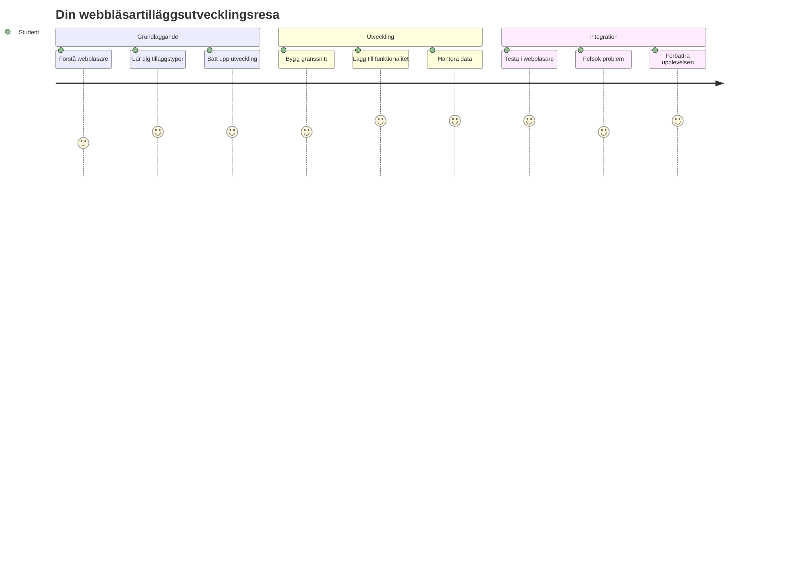
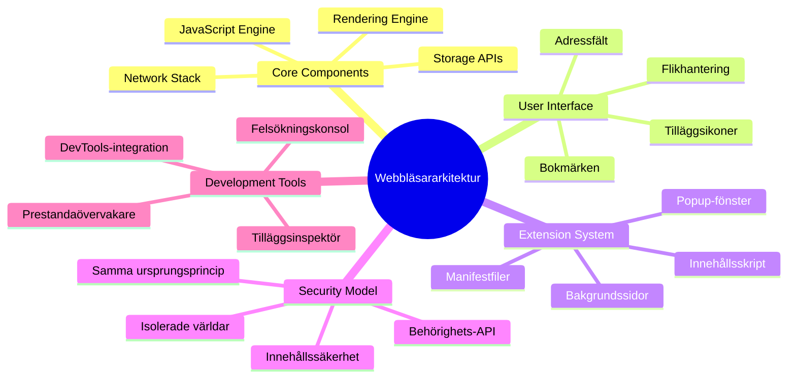
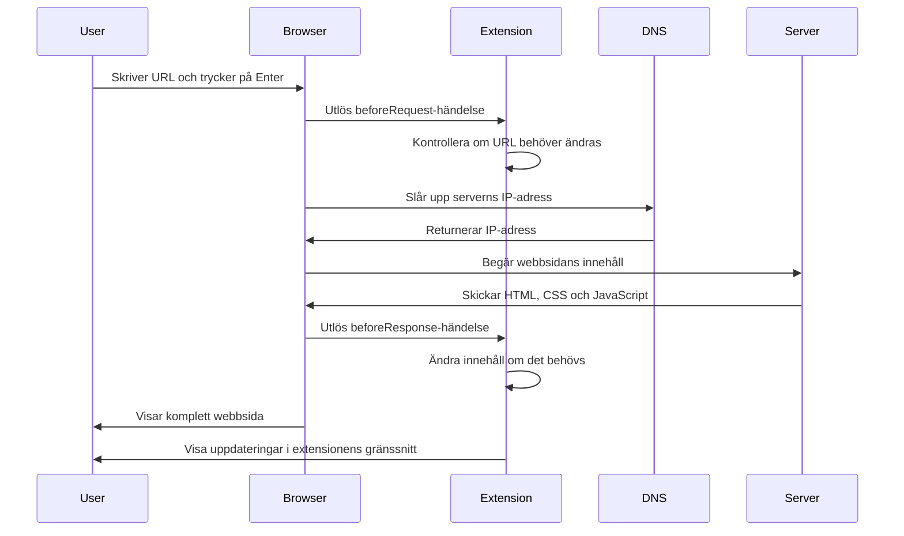
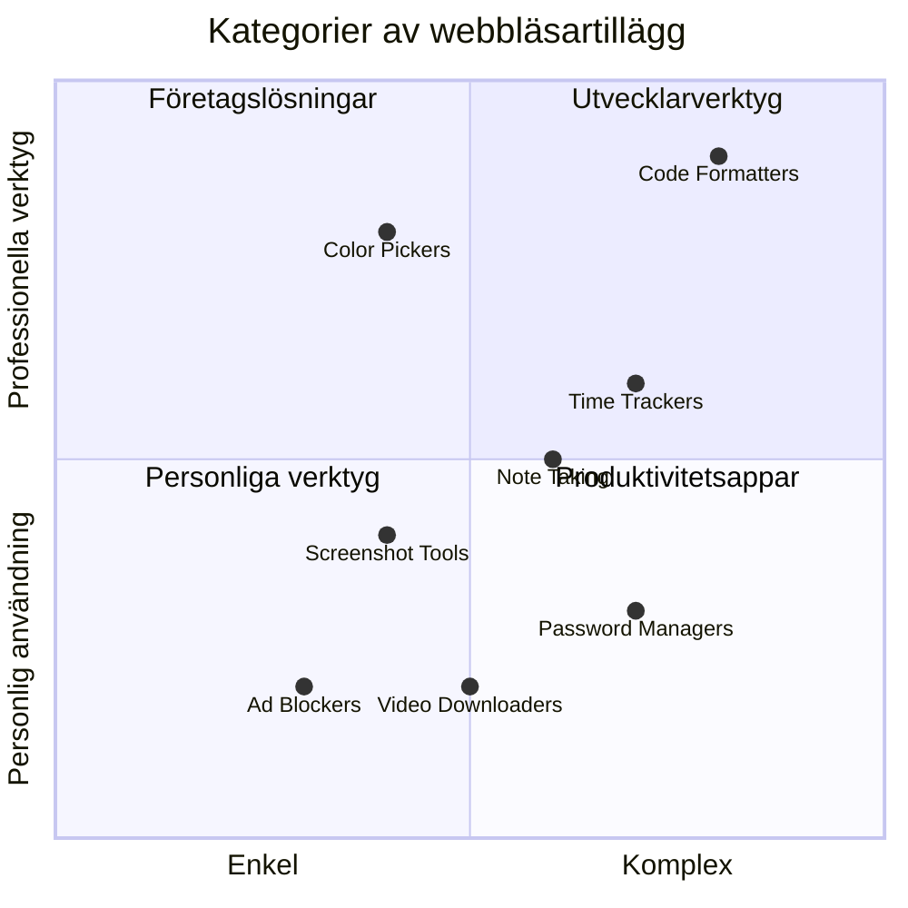
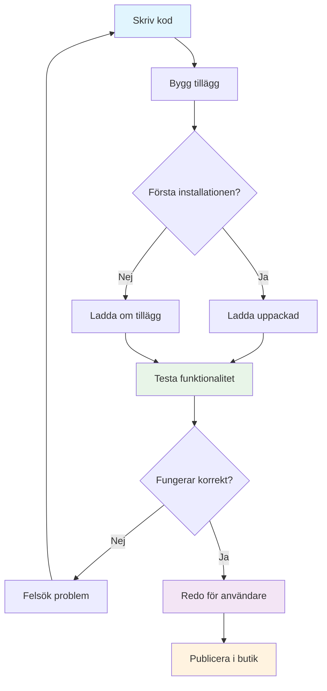

<!--
CO_OP_TRANSLATOR_METADATA:
{
  "original_hash": "00aa85715e1efd4930c17a23e3012e69",
  "translation_date": "2026-01-06T22:58:07+00:00",
  "source_file": "5-browser-extension/1-about-browsers/README.md",
  "language_code": "sv"
}
-->
# Webbläsartilläggsprojekt Del 1: Allt om webbläsare



> Sketchnote av [Wassim Chegham](https://dev.to/wassimchegham/ever-wondered-what-happens-when-you-type-in-a-url-in-an-address-bar-in-a-browser-3dob)

## Förföreläsningsquiz

[Förföreläsningsquiz](https://ff-quizzes.netlify.app/web/quiz/23)

### Introduktion

Webbläsartillägg är miniapplikationer som förbättrar din webbupplevelse. Precis som Tim Berners-Lees ursprungliga vision om en interaktiv web, utökar tillägg webbläsarens funktioner bortom enkel dokumentvisning. Från lösenordshanterare som håller dina konton säkra till färgväljare som hjälper designers att hitta perfekta nyanser, löser tillägg vardagliga utmaningar vid webbsurfning.

Innan vi bygger ditt första tillägg, låt oss förstå hur webbläsare fungerar. Precis som Alexander Graham Bell behövde förstå ljudöverföring innan han uppfann telefonen, kommer kunskap om webbläsarens grunder hjälpa dig att skapa tillägg som integreras sömlöst med befintliga webbläsarsystem.

I slutet av denna lektion kommer du att förstå webbläsararkitektur och ha påbörjat byggandet av ditt första tillägg.


## Förståelse av webbläsare

En webbläsare är i grund och botten en sofistikerad dokumenttolkare. När du skriver "google.com" i adressfältet utför webbläsaren en komplex serie av operationer - begär innehåll från servrar över hela världen, sedan analyserar och renderar den den koden till de interaktiva webbsidor du ser.

Denna process speglar hur den första webbläsaren, WorldWideWeb, designades av Tim Berners-Lee 1990 för att göra hyperlänkade dokument tillgängliga för alla.

✅ **Lite historia**: Den första webbläsaren kallades "WorldWideWeb" och skapades av Sir Timothy Berners-Lee 1990.


> Några tidiga webbläsare, via [Karen McGrane](https://www.slideshare.net/KMcGrane/week-4-ixd-history-personal-computing)

### Hur webbläsare bearbetar webbinnehåll

Processen mellan att skriva in en URL och att se en webbsida involverar flera samordnade steg som sker inom sekunder:


**Det här uppnår processen:**
- **Översätter** den lättlästa URL:en till en server-IP-adress genom DNS-uppslagning
- **Etablerar** en säker anslutning till webbservern via HTTP eller HTTPS-protokoll
- **Begär** det specifika webbsidans innehåll från servern
- **Tar emot** HTML-markup, CSS-styling och JavaScript-kod från servern
- **Renderar** allt innehåll till den interaktiva webbsida du ser

### Webbläsarens kärnfunktioner

Moderna webbläsare erbjuder många funktioner som tilläggsutvecklare kan utnyttja:

| Funktion | Syfte | Möjligheter för tillägg |
|---------|---------|------------------------|
| **Renderingsmotor** | Visar HTML, CSS och JavaScript | Innehållsmodifiering, stilinjektion |
| **JavaScript-motor** | Kör JavaScript-kod | Egna skript, API-interaktioner |
| **Lokal lagring** | Sparar data lokalt | Användarinställningar, cachelagrad data |
| **Nätverksstack** | Hanterar webbförfrågningar | Övervakning av förfrågningar, dataanalys |
| **Säkerhetsmodell** | Skyddar användare från skadligt innehåll | Innehållsfiltrering, säkerhetsförbättringar |

**Att förstå dessa funktioner hjälper dig att:**
- **Identifiera** var ditt tillägg kan tillföra mest värde
- **Välja** rätt webbläsar-API:er för ditt tilläggs funktionalitet
- **Designa** tillägg som fungerar effektivt med webbläsarsystemen
- **Säkerställa** att ditt tillägg följer webbläsarens säkerhetsriktlinjer

### Överväganden för utveckling av tillägg för flera webbläsare

Olika webbläsare implementerar standarder med små variationer, likt hur olika programmeringsspråk kan hantera samma algoritm olika. Chrome, Firefox och Safari har unika egenskaper som utvecklare måste ta hänsyn till vid tilläggsutveckling.

> 💡 **Proffstips**: Använd [caniuse.com](https://www.caniuse.com) för att kolla vilka webteknologier som stöds över olika webbläsare. Detta är ovärderligt när du planerar vilka funktioner ditt tillägg ska ha!

**Viktiga aspekter för tilläggsutveckling:**
- **Testa** ditt tillägg i Chrome, Firefox och Edge
- **Anpassa** dig till olika API:er och manifestformat för webbläsartillägg
- **Hantera** variationer i prestanda och begränsningar
- **Ge** backuplösningar för funktioner som kan saknas i vissa webbläsare

✅ **Analysinsikt**: Du kan ta reda på vilka webbläsare dina användare föredrar genom att installera analysverktyg i dina webbprojekt. Denna data hjälper dig att prioritera vilka webbläsare du ska stödja först.

## Förståelse för webbläsartillägg

Webbläsartillägg löser vanliga problem vid webbupptäckande genom att lägga till funktionalitet direkt i webbläsargränssnittet. Istället för att kräva separata program eller komplexa arbetsflöden, ger tillägg snabb åtkomst till verktyg och funktioner.

Detta koncept speglar hur tidiga datorpionjärer som Douglas Engelbart föreställde sig att teknologi kan förstärka mänskliga förmågor – tillägg förstärker webbläsarens grundläggande funktionalitet.


**Populära typer av tillägg och deras fördelar:**
- **Produktivitetsverktyg**: Uppgiftshanterare, anteckningsappar och tidsmätare som hjälper dig behålla ordning
- **Säkerhetsförbättringar**: Lösenordshanterare, annonsblockerare och integritetsverktyg som skyddar din data
- **Utvecklarverktyg**: Kodformaterare, färgväljare och felsökningsverktyg som effektiviserar utveckling
- **Innehållsförbättringar**: Läs-lägen, videonedladdare och skärmdumpar som förbättrar din webbupplevelse

✅ **Reflektionsfråga**: Vilka är dina favoritwebbläsartillägg? Vilka specifika uppgifter utför de, och hur förbättrar de din surfupplevelse?

### 🔄 **Pedagogisk kontrollpunkt**
**Förståelse för webbläsararkitektur**: Innan du går vidare till tilläggsutveckling, se till att du kan:
- ✅ Förklara hur webbläsare bearbetar webbförfrågningar och renderar innehåll
- ✅ Identifiera huvudkomponenterna i webbläsararkitektur
- ✅ Förstå hur tillägg integreras med webbläsarfunktioner
- ✅ Känna igen säkerhetsmodellen som skyddar användarna

**Snabb självtest**: Kan du följa steget från att skriva en URL till att se en webbsida?
1. **DNS-uppslagning** omvandlar URL till IP-adress
2. **HTTP-förfrågan** hämtar innehåll från servern
3. **Parsing** bearbetar HTML, CSS och JavaScript
4. **Rendering** visar slutgiltig webbsida
5. **Tillägg** kan modifiera innehåll i flera steg

## Installera och hantera tillägg

Att förstå installationsprocessen för tillägg hjälper dig att förutse användarupplevelsen när personer installerar ditt tillägg. Installationsprocessen är standardiserad över moderna webbläsare med små skillnader i gränssnittsdesign.


> **Viktigt**: Se till att aktivera utvecklarläge och tillåt tillägg från andra butiker när du testar dina egna tillägg.

### Utvecklingsinstallationsprocess för tillägg

När du utvecklar och testar egna tillägg, följ detta arbetsflöde:


```bash
# Steg 1: Bygg din tillägg
npm run build
```

**Detta kommando gör:**
- **Kompilerar** din källkod till filer som är klara för webbläsaren
- **Paketerar** JavaScript-moduler till optimerade paket
- **Genererar** slutliga tilläggsfiler i `/dist`-mappen
- **Förbereder** ditt tillägg för installation och testning

**Steg 2: Navigera till webbläsartillägg**
1. **Öppna** webbläsarens sida för hantering av tillägg
2. **Klicka** på knappen "Inställningar och mer" (ikonen `...`) uppe till höger
3. **Välj** "Tillägg" i rullgardinsmenyn

**Steg 3: Ladda ditt tillägg**
- **För nya installationer**: Välj `load unpacked` och peka på din `/dist`-mapp
- **För uppdateringar**: Klicka `reload` bredvid ditt redan installerade tillägg
- **För testning**: Aktivera "Utvecklarläge" för att få fler felsökningsfunktioner

### Produktioninstallationsprocess för tillägg

> ✅ **Observera**: Dessa utvecklingsinstruktioner gäller tillägg som du själv bygger. För att installera publicerade tillägg, besök officiella webbläsarbutiker som [Microsoft Edge Add-ons store](https://microsoftedge.microsoft.com/addons/Microsoft-Edge-Extensions-Home).

**Skillnaden i korthet:**
- **Utvecklingsinstallationer** låter dig testa opublicerade tillägg under utveckling
- **Butiksinstallationer** ger granskade och publicerade tillägg med automatiska uppdateringar
- **Sidoinstallation** möjliggör installation av tillägg utanför de officiella butikerna (kräver utvecklarläge)

## Bygga ditt koldioxidavtryckstillägg

Vi ska skapa ett webbläsartillägg som visar koldioxidavtrycket för energianvändningen i din region. Detta projekt demonstrerar viktiga koncept inom tilläggsutveckling samtidigt som du skapar ett praktiskt verktyg för miljömedvetenhet.

Detta tillvägagångssätt följer principen "learning by doing" som varit framgångsrikt sedan John Deweys pedagogiska teorier – att kombinera tekniska färdigheter med meningsfulla tillämpningar i verkligheten.

### Projektkrav

Innan utvecklingen börjar, låt oss samla de nödvändiga resurserna och beroenden:

**Nödvändig API-åtkomst:**
- **[CO2 Signal API-nyckel](https://www.co2signal.com/)**: Ange din e-postadress för att få din gratis API-nyckel
- **[Regionkod](http://api.electricitymap.org/v3/zones)**: Hitta din regionkod med [Electricity Map](https://www.electricitymap.org/map) (t.ex. använder Boston 'US-NEISO')

**Utvecklingsverktyg:**
- **[Node.js och NPM](https://www.npmjs.com)**: Paketverktyg för att installera projektberoenden
- **[Startkod](../../../../5-browser-extension/start)**: Ladda ner mappen `start` för att börja utveckla

✅ **Lär dig mer**: Förbättra dina kunskaper i paketshantering med denna [omfattande Learn-modul](https://docs.microsoft.com/learn/modules/create-nodejs-project-dependencies/?WT.mc_id=academic-77807-sagibbon)

### Förståelse av projektstrukturen

Att förstå projektets struktur hjälper till att organisera utvecklingsarbetet effektivt. Precis som Biblioteket i Alexandria organiserades för lätt kunskapsåtkomst, gör en välstrukturerad kodbas utvecklingen mer effektiv:

```
project-root/
├── dist/                    # Built extension files
│   ├── manifest.json        # Extension configuration
│   ├── index.html           # User interface markup
│   ├── background.js        # Background script functionality
│   └── main.js              # Compiled JavaScript bundle
├── src/                     # Source development files
│   └── index.js             # Your main JavaScript code
├── package.json             # Project dependencies and scripts
└── webpack.config.js        # Build configuration
```

**Vad varje fil gör:**
- **`manifest.json`**: **Definierar** tilläggets metadata, behörigheter och ingångspunkter
- **`index.html`**: **Skapar** användargränssnittet som visas när användare klickar på ditt tillägg
- **`background.js`**: **Hantera** bakgrundsuppgifter och webbläsarhändelselyssnare
- **`main.js`**: **Innehåller** den slutgiltiga sammansatta JavaScript-koden efter byggprocessen
- **`src/index.js`**: **Huserar** din huvudsakliga utvecklingskod som kompileras till `main.js`

> 💡 **Organiseringstips**: Spara din API-nyckel och regionkod i en säker anteckning för enkel åtkomst under utvecklingen. Du kommer behöva dessa värden för att testa ditt tilläggs funktionalitet.

✅ **Säkerhetsnotis**: Aldrig checka in API-nycklar eller känsliga uppgifter i ditt kodförråd. Vi visar dig hur du hanterar detta säkert i nästa steg.

## Skapa tilläggsgränssnittet

Nu bygger vi gränssnittskomponenterna. Tillägget använder en tvåskärmsstrategi: en konfigurationsskärm för första setup och en resultatskärm för datavisning.

Detta följer principen om progressiv avslöjande som använts i gränssnittsdesign sedan datorernas begynnelse – visa information och val i en logisk ordning för att undvika att användaren överbelastas.

### Översikt av tilläggsvyer

**Inställningsvy** – Konfiguration för första gången:


**Resultatvy** – Visning av koldioxidavtrycksdata:


### Bygga konfigurationsformuläret

Inställningsformuläret samlar in användarens konfigurationsdata vid första användning. När det är konfigurerat sparas informationen i webbläsarens lagring för framtida sessioner.

I filen `/dist/index.html`, lägg till denna formstrukturen:

```html
<form class="form-data" autocomplete="on">
    <div>
        <h2>New? Add your Information</h2>
    </div>
    <div>
        <label for="region">Region Name</label>
        <input type="text" id="region" required class="region-name" />
    </div>
    <div>
        <label for="api">Your API Key from tmrow</label>
        <input type="text" id="api" required class="api-key" />
    </div>
    <button class="search-btn">Submit</button>
</form>
```

**Det här formuläret gör:**
- **Skapar** en semantisk formulärstruktur med korrekta etiketter och inputkopplingar
- **Aktiverar** webbläsarens autokomplettering för förbättrad användarupplevelse
- **Kräver** att båda fälten fylls i före inskickning med `required`-attribut
- **Organiserar** inputfält med beskrivande klassnamn för enkel styling och JavaScript-målning
- **Ger** tydliga instruktioner för användare som ställer in tillägget första gången

### Bygga resultatsvisningen

Skapa sedan området som visar koldioxidavtrycksdata. Lägg till detta HTML nedanför formuläret:

```html
<div class="result">
    <div class="loading">loading...</div>
    <div class="errors"></div>
    <div class="data"></div>
    <div class="result-container">
        <p><strong>Region: </strong><span class="my-region"></span></p>
        <p><strong>Carbon Usage: </strong><span class="carbon-usage"></span></p>
        <p><strong>Fossil Fuel Percentage: </strong><span class="fossil-fuel"></span></p>
    </div>
    <button class="clear-btn">Change region</button>
</div>
```

**Vad denna struktur ger:**
- **`loading`**: **Visar** ett laddningsmeddelande medan API-data hämtas
- **`errors`**: **Visar** felmeddelanden om API-anrop misslyckas eller data är ogiltig
- **`data`**: **Huserar** rådata för felsökning under utvecklingen
- **`result-container`**: **Visar** formaterad koldioxidavtrycksinformation för användarna
- **`clear-btn`**: **Tillåter** användare att ändra region och konfigurera tillägget på nytt

### Ställa in byggprocessen

Nu installerar vi projektets beroenden och testar byggprocessen:

```bash
npm install
```

**Denna installationsprocess gör:**
- **Laddar ner** Webpack och andra utvecklingsberoenden specificerade i `package.json`
- **Konfigurerar** byggverktygskedjan för att kompilera modern JavaScript
- **Förbereder** utvecklingsmiljön för att bygga och testa tillägget
- **Möjliggör** kodpaketering, optimering och flersäker webbläsarkompatibilitet

> 💡 **Insikt i byggprocessen**: Webpack paketerar din källkod från `/src/index.js` till `/dist/main.js`. Denna process optimerar koden för produktion och säkerställer kompatibilitet med olika webbläsare.

### Testa dina framsteg

Vid denna punkt kan du testa ditt tillägg:
1. **Kör** build-kommandot för att kompilera din kod  
2. **Ladda** tillägget i din webbläsare med utvecklarläge  
3. **Verifiera** att formuläret visas korrekt och ser professionellt ut  
4. **Kontrollera** att alla formelement är korrekt justerade och funktionella  

**Det du har åstadkommit:**  
- **Byggt** den grundläggande HTML-strukturen för ditt tillägg  
- **Skapat** både konfigurations- och resultatgränssnitt med korrekt semantisk markup  
- **Kommit igång** med en modern utvecklingsarbetsflöde med branschstandardverktyg  
- **Förberett** grund för att lägga till interaktiv JavaScript-funktionalitet  

### 🔄 **Pedagogisk återkoppling**  
**Utvecklingsprogress för tillägg:** Bekräfta din förståelse innan du fortsätter:  
- ✅ Kan du förklara syftet med varje fil i projektstrukturen?  
- ✅ Förstår du hur byggprocessen omvandlar din källkod?  
- ✅ Varför separerar vi konfiguration och resultat i olika UI-sektioner?  
- ✅ Hur stöder formulärstrukturen både användbarhet och tillgänglighet?  

**Förståelse för utvecklingsarbetsflöde:** Du bör nu kunna:  
1. **Ändra** HTML och CSS för ditt tilläggsgränssnitt  
2. **Köra** build-kommandot för att kompilera dina ändringar  
3. **Ladda om** tillägget i din webbläsare för att testa uppdateringar  
4. **Felsöka** problem med webbläsarens utvecklarverktyg  

Du har genomfört den första fasen av webbläsartilläggsutveckling. Precis som bröderna Wright först behövde förstå aerodynamik innan de kunde flyga, förbereder förståelsen av dessa grundläggande begrepp dig för att skapa mer komplexa interaktiva funktioner i nästa lektion.  

## GitHub Copilot Agent-utmaning 🚀  

Använd Agent-läget för att slutföra följande utmaning:  

**Beskrivning:** Förbättra webbläsartillägget genom att lägga till formulärvalidering och användarfeedback för att förbättra användarupplevelsen när API-nycklar och regionskoder anges.  

**Uppmaning:** Skapa JavaScript-valideringsfunktioner som kontrollerar att API-nyckelfältet innehåller minst 20 tecken och att regionskoden följer korrekt format (som 'US-NEISO'). Lägg till visuell feedback genom att ändra inmatningsfältets kantfärg till grönt för giltiga inmatningar och rött för ogiltiga. Lägg även till en växlingsfunktion för att visa/dölja API-nyckeln för säkerhetsskäl.  

Läs mer om [agent mode](https://code.visualstudio.com/blogs/2025/02/24/introducing-copilot-agent-mode) här.  

## 🚀 Utmaning  

Ta en titt i en webbläsartilläggsbutik och installera ett till din webbläsare. Du kan undersöka dess filer på intressanta sätt. Vad upptäcker du?  

## Quiz efter lektionen  

[Quiz efter lektionen](https://ff-quizzes.netlify.app/web/quiz/24)  

## Översikt & Självstudier  

I den här lektionen lärde du dig lite om webbläsarens historia; ta tillfället i akt att lära dig mer om hur uppfinnarna av World Wide Web föreställde sig dess användning genom att läsa mer om dess historia. Några användbara sidor inkluderar:  

[Webbläsarens historia](https://www.mozilla.org/firefox/browsers/browser-history/)  

[Webbens historia](https://webfoundation.org/about/vision/history-of-the-web/)  

[En intervju med Tim Berners-Lee](https://www.theguardian.com/technology/2019/mar/12/tim-berners-lee-on-30-years-of-the-web-if-we-dream-a-little-we-can-get-the-web-we-want)  

### ⚡ **Vad Du Kan Göra På Nästa 5 Minauter**  
- [ ] Öppna Chrome/Edge tilläggssidan (chrome://extensions) och utforska vad du har installerat  
- [ ] Titta på webbläsarens DevTools Network-flik medan du laddar en webbsida  
- [ ] Försök visa sidans källa (Ctrl+U) för att se HTML-strukturen  
- [ ] Inspektera vilket som helst webbsideselement och modifiera dess CSS i DevTools  

### 🎯 **Vad Du Kan Uppnå Under Den Här Timmen**  
- [ ] Slutför quizzen efter lektionen och förstå webbläsarens grunder  
- [ ] Skapa en enkel manifest.json-fil för ett webbläsartillägg  
- [ ] Bygg ett enkelt "Hello World"-tillägg som visar ett popup-fönster  
- [ ] Testa att ladda ditt tillägg i utvecklarläge  
- [ ] Utforska dokumentationen för webbläsartillägg för din målwebbläsare  

### 📅 **Din Veckolånga Tilläggsresa**  
- [ ] Slutför ett funktionellt webbläsartillägg med verklig nytta  
- [ ] Lär dig om content scripts, background scripts och popup-interaktioner  
- [ ] Bemästra webbläsar-API:er som lagring, flikar och meddelanden  
- [ ] Designa användarvänliga gränssnitt för ditt tillägg  
- [ ] Testa ditt tillägg på olika webbplatser och scenarier  
- [ ] Publicera ditt tillägg i webbläsarens tilläggsbutik  

### 🌟 **Din Månadslånga Webbläsarutveckling**  
- [ ] Skapa flera tillägg som löser olika användarproblem  
- [ ] Lär dig avancerade webbläsar-API:er och säkerhetsbästa praxis  
- [ ] Bidra till öppna källkodsprojekt för webbläsartillägg  
- [ ] Bemästra tvärwebbläsarkompatibilitet och progressiv förbättring  
- [ ] Skapa utvecklingsverktyg och mallar för tillägg till andra  
- [ ] Bli expert på webbläsartillägg som hjälper andra utvecklare  

## 🎯 Din Tidslinje för Mästerskap i Webbläsartillägg  

```mermaid
timeline
    title Webbläsartillägg Utvecklingsprogression
    
    section Grundläggande (15 minuter)
        Förståelse för webbläsare: Kärnarkitektur
                              : Renderingsprocess
                              : Integration av tillägg
        
    section Installation (20 minuter)
        Utvecklingsmiljö: Projektstruktur
                         : Konfiguration av byggverktyg
                         : Webbläsarens utvecklarläge
                         : Tilläggets laddningsprocess
        
    section Gränssnittsdesign (25 minuter)
        Användarupplevelse: HTML-struktur
                         : CSS-styling
                         : Formulärvalidering
                         : Responsiv design
        
    section Kärnfunktionalitet (35 minuter)
        JavaScript-integration: Händelsehantering
                              : API-interaktioner
                              : Datainlagring
                              : Felhantering
        
    section Webbläsar-API:er (45 minuter)
        Plattformintegration: Behörighetssystem
                            : Lagrings-API:er
                            : Flikhantering
                            : Kontextmenyer
        
    section Avancerade funktioner (1 vecka)
        Professionella tillägg: Bakgrundsskript
                             : Innehållsskript
                             : Kompatibilitet över webbläsare
                             : Prestandaoptimering
        
    section Publicering (2 veckor)
        Distribution: Butikspublicering
                   : Granskningsprocess
                   : Användarfeedback
                   : Uppdateringshantering
        
    section Expertnivå (1 månad)
        Tilläggsekosystem: Avancerade API:er
                         : Säkerhetsbästa praxis
                         : Företagsfunktioner
                         : Ramverksintegration
```  
### 🛠️ Din Sammanfattning av Utvecklingsverktyg för Tillägg  

Efter att ha genomfört denna lektion har du nu:  
- **Kunskap om webbläsararkitektur:** Förståelse för renderingsmotorer, säkerhetsmodeller och tilläggsintegration  
- **Utvecklingsmiljö:** Modern verktygskedja med Webpack, NPM och felsökningsmöjligheter  
- **UI/UX-grund:** Semantisk HTML-struktur med progressiva avslöjandemönster  
- **Säkerhetsmedvetenhet:** Förståelse för webbläsarbehörigheter och säker kodutveckling  
- **Koncept för tvärwebbläsarkompatibilitet:** Kännedom om kompatibilitetsaspekter och testmetoder  
- **API-integration:** Grund för att arbeta med externa datakällor  
- **Professionellt arbetsflöde:** Branschstandard för utveckling och testning  

**Verkliga tillämpningar:** Dessa färdigheter används direkt för:  
- **Webbutveckling:** Enkel- och progressiva webbapplikationer  
- **Stationära applikationer:** Electron och webbaserad stationär programvara  
- **Mobilutveckling:** Hybridappar och webbaserade mobillösningar  
- **Företagsverktyg:** Interna produktivitetsapplikationer och arbetsflödesautomatisering  
- **Öppen källkod:** Bidra till projekt för webbläsartillägg och webbstandarder  

**Nästa nivå:** Du är redo att lägga till interaktiv funktionalitet, arbeta med webbläsar-API:er och skapa tillägg som löser verkliga användarproblem!  

## Uppgift  

[Ge stil på ditt tillägg](assignment.md)

---

<!-- CO-OP TRANSLATOR DISCLAIMER START -->
**Ansvarsfriskrivning**:
Detta dokument har översatts med hjälp av AI-översättningstjänsten [Co-op Translator](https://github.com/Azure/co-op-translator). Även om vi strävar efter noggrannhet, bör du vara medveten om att automatiska översättningar kan innehålla fel eller brister. Det ursprungliga dokumentet på dess modersmål ska betraktas som den auktoritativa källan. För kritisk information rekommenderas professionell, mänsklig översättning. Vi ansvarar inte för några missförstånd eller feltolkningar som uppstår till följd av användningen av denna översättning.
<!-- CO-OP TRANSLATOR DISCLAIMER END -->