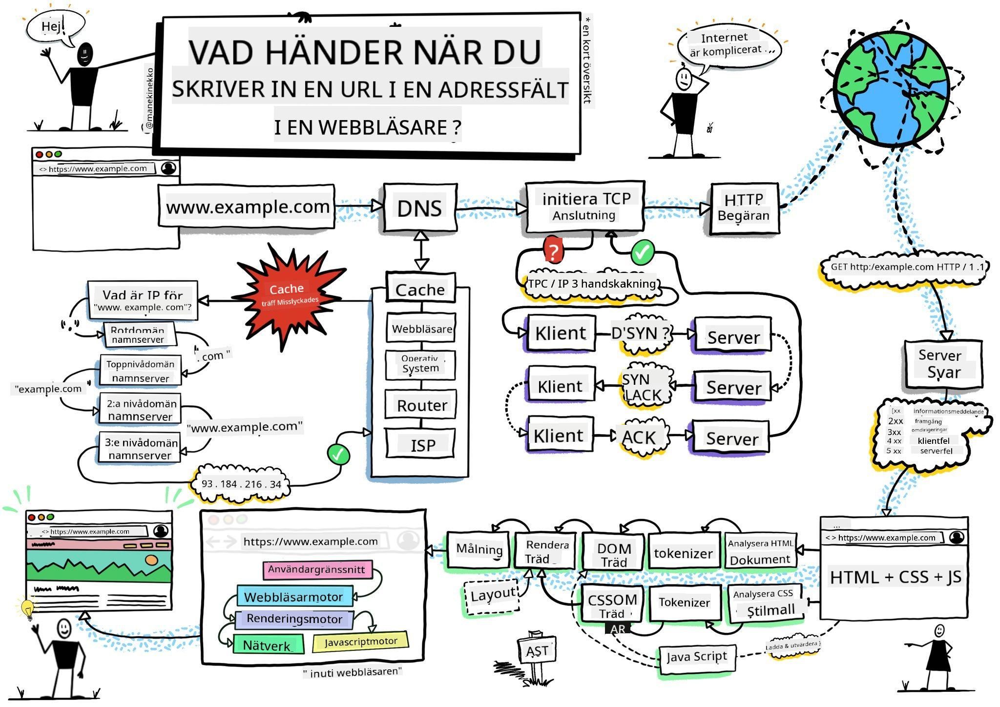
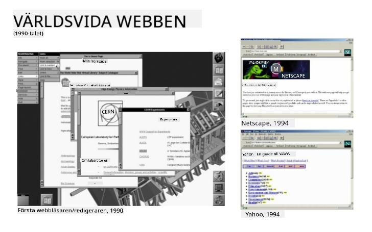
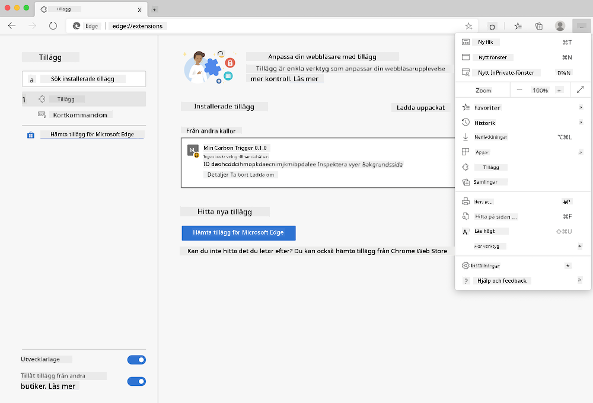
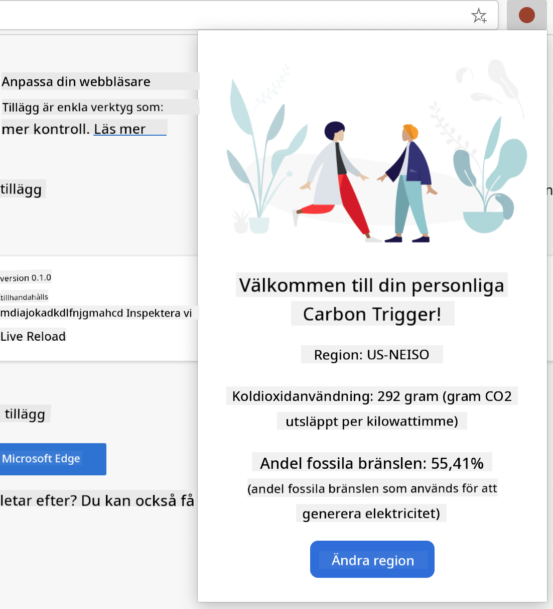

<!--
CO_OP_TRANSLATOR_METADATA:
{
  "original_hash": "2326d04e194a10aa760b51f5e5a1f61d",
  "translation_date": "2025-08-29T07:51:51+00:00",
  "source_file": "5-browser-extension/1-about-browsers/README.md",
  "language_code": "sv"
}
-->
# Webbläsartillägg Projekt Del 1: Allt om webbläsare


> Skiss av [Wassim Chegham](https://dev.to/wassimchegham/ever-wondered-what-happens-when-you-type-in-a-url-in-an-address-bar-in-a-browser-3dob)

## Förhandsquiz

[Förhandsquiz](https://ff-quizzes.netlify.app/web/quiz/23)

### Introduktion

Webbläsartillägg lägger till extra funktionalitet till en webbläsare. Men innan du bygger ett, bör du lära dig lite om hur webbläsare fungerar.

### Om webbläsaren

I den här serien av lektioner kommer du att lära dig hur man bygger ett webbläsartillägg som fungerar på Chrome, Firefox och Edge. I den här delen kommer du att upptäcka hur webbläsare fungerar och strukturera upp elementen i webbläsartillägget.

Men vad är egentligen en webbläsare? Det är en mjukvaruapplikation som gör det möjligt för en slutanvändare att komma åt innehåll från en server och visa det på webbsidor.

✅ Lite historia: den första webbläsaren hette 'WorldWideWeb' och skapades av Sir Timothy Berners-Lee år 1990.


> Några tidiga webbläsare, via [Karen McGrane](https://www.slideshare.net/KMcGrane/week-4-ixd-history-personal-computing)

När en användare ansluter till internet med en URL (Uniform Resource Locator)-adress, vanligtvis via Hypertext Transfer Protocol med en `http`- eller `https`-adress, kommunicerar webbläsaren med en webbserver och hämtar en webbsida.

Vid denna punkt visar webbläsarens renderingsmotor sidan på användarens enhet, som kan vara en mobiltelefon, stationär dator eller laptop.

Webbläsare har också förmågan att cachelagra innehåll så att det inte behöver hämtas från servern varje gång. De kan registrera historiken av en användares surfaktivitet, lagra 'cookies', som är små databit som innehåller information för att lagra en användares aktivitet, och mycket mer.

En väldigt viktig sak att komma ihåg om webbläsare är att de inte är likadana! Varje webbläsare har sina styrkor och svagheter, och en professionell webbutvecklare behöver förstå hur man får webbsidor att fungera bra i olika webbläsare. Detta inkluderar att hantera små skärmar, som en mobiltelefon, samt en användare som är offline.

En väldigt användbar webbplats som du förmodligen bör bokmärka i den webbläsare du föredrar att använda är [caniuse.com](https://www.caniuse.com). När du bygger webbsidor är det väldigt hjälpsamt att använda caniuse:s listor över stödda teknologier så att du kan ge bästa möjliga stöd till dina användare.

✅ Hur kan du ta reda på vilka webbläsare som är mest populära bland användarna av din webbplats? Kontrollera din analysdata - du kan installera olika analysverktyg som en del av din webbutvecklingsprocess, och de kommer att visa vilka webbläsare som används mest av de olika populära webbläsarna.

## Webbläsartillägg

Varför skulle du vilja bygga ett webbläsartillägg? Det är ett praktiskt verktyg att koppla till din webbläsare när du behöver snabb åtkomst till uppgifter som du ofta upprepar. Till exempel, om du ofta behöver kontrollera färger på olika webbsidor som du interagerar med, kan du installera ett färgväljar-tillägg. Om du har svårt att komma ihåg lösenord, kan du använda ett lösenordshanterings-tillägg.

Webbläsartillägg är också roliga att utveckla. De tenderar att hantera ett begränsat antal uppgifter som de utför väl.

✅ Vilka är dina favoritwebbläsartillägg? Vilka uppgifter utför de?

### Installera tillägg

Innan du börjar bygga, ta en titt på processen för att bygga och distribuera ett webbläsartillägg. Även om varje webbläsare skiljer sig lite åt i hur de hanterar denna uppgift, är processen liknande på Chrome och Firefox som detta exempel på Edge:



> Obs: Se till att aktivera utvecklarläge och tillåta tillägg från andra butiker.

I huvudsak kommer processen att vara:

- bygg ditt tillägg med `npm run build` 
- navigera i webbläsaren till tilläggspanelen via knappen "Inställningar och mer" (ikonen `...`) längst upp till höger
- om det är en ny installation, välj `load unpacked` för att ladda upp ett nytt tillägg från dess byggmapp (i vårt fall är det `/dist`) 
- eller, klicka på `reload` om du laddar om ett redan installerat tillägg

✅ Dessa instruktioner gäller tillägg du bygger själv; för att installera tillägg som har släppts till webbläsarens tilläggsbutik, bör du navigera till dessa [butiker](https://microsoftedge.microsoft.com/addons/Microsoft-Edge-Extensions-Home) och installera det tillägg du väljer.

### Kom igång

Du ska bygga ett webbläsartillägg som visar din regions koldioxidavtryck, med information om din regions energianvändning och energikällor. Tillägget kommer att ha ett formulär som samlar in en API-nyckel så att du kan få åtkomst till CO2 Signal:s API.

**Du behöver:**

- [en API-nyckel](https://www.co2signal.com/); ange din e-postadress i rutan på denna sida så skickas en nyckel till dig
- [koden för din region](http://api.electricitymap.org/v3/zones) som motsvarar [Electricity Map](https://www.electricitymap.org/map) (i Boston, till exempel, använder jag 'US-NEISO').
- [startkoden](../../../../5-browser-extension/start). Ladda ner mappen `start`; du kommer att komplettera koden i denna mapp.
- [NPM](https://www.npmjs.com) - NPM är ett verktyg för paketadministration; installera det lokalt så installeras paketen som anges i din `package.json`-fil för användning av dina webbtillgångar

✅ Läs mer om paketadministration i denna [utmärkta Learn-modul](https://docs.microsoft.com/learn/modules/create-nodejs-project-dependencies/?WT.mc_id=academic-77807-sagibbon)

Ta en minut och gå igenom kodbasen:

dist
    -|manifest.json (standardinställningar här)
    -|index.html (HTML-markup för front-end här)
    -|background.js (bakgrunds-JS här)
    -|main.js (byggd JS)
src
    -|index.js (din JS-kod går här)

✅ När du har din API-nyckel och regionskod redo, spara dem någonstans i en anteckning för framtida användning.

### Bygg HTML för tillägget

Detta tillägg har två vyer. En för att samla in API-nyckeln och regionskoden:


Och den andra för att visa regionens koldioxidanvändning:



Låt oss börja med att bygga HTML för formuläret och styla det med CSS.

I mappen `/dist` kommer du att bygga ett formulär och ett resultatområde. I filen `index.html`, fyll i det avgränsade formulärområdet:

```HTML
<form class="form-data" autocomplete="on">
	<div>
		<h2>New? Add your Information</h2>
	</div>
	<div>
		<label for="region">Region Name</label>
		<input type="text" id="region" required class="region-name" />
	</div>
	<div>
		<label for="api">Your API Key from tmrow</label>
		<input type="text" id="api" required class="api-key" />
	</div>
	<button class="search-btn">Submit</button>
</form>	
```
Detta är formuläret där din sparade information kommer att matas in och sparas i lokal lagring.

Skapa sedan resultatområdet; under den sista formulärtaggen, lägg till några divs:

```HTML
<div class="result">
	<div class="loading">loading...</div>
	<div class="errors"></div>
	<div class="data"></div>
	<div class="result-container">
		<p><strong>Region: </strong><span class="my-region"></span></p>
		<p><strong>Carbon Usage: </strong><span class="carbon-usage"></span></p>
		<p><strong>Fossil Fuel Percentage: </strong><span class="fossil-fuel"></span></p>
	</div>
	<button class="clear-btn">Change region</button>
</div>
```
Vid denna punkt kan du prova en byggning. Se till att installera paketberoenden för detta tillägg:

```
npm install
```

Detta kommando kommer att använda npm, Node Package Manager, för att installera webpack för tilläggets byggprocess. Webpack är en bundlare som hanterar kompilering av kod. Du kan se resultatet av denna process genom att titta i `/dist/main.js` - du ser att koden har bundlats.

För tillfället bör tillägget byggas och, om du distribuerar det i Edge som ett tillägg, kommer du att se ett snyggt visat formulär.

Grattis, du har tagit de första stegen mot att bygga ett webbläsartillägg. I efterföljande lektioner kommer du att göra det mer funktionellt och användbart.

---

## 🚀 Utmaning

Ta en titt på en webbläsartilläggsbutik och installera ett tillägg i din webbläsare. Du kan undersöka dess filer på intressanta sätt. Vad upptäcker du?

## Efterhandsquiz

[Efterhandsquiz](https://ff-quizzes.netlify.app/web/quiz/24)

## Granskning & Självstudier

I denna lektion lärde du dig lite om webbläsarens historia; ta denna möjlighet att lära dig om hur uppfinnarna av World Wide Web föreställde sig dess användning genom att läsa mer om dess historia. Några användbara webbplatser inkluderar:

[Webbläsarens historia](https://www.mozilla.org/firefox/browsers/browser-history/)

[Webbens historia](https://webfoundation.org/about/vision/history-of-the-web/)

[En intervju med Tim Berners-Lee](https://www.theguardian.com/technology/2019/mar/12/tim-berners-lee-on-30-years-of-the-web-if-we-dream-a-little-we-can-get-the-web-we-want)

## Uppgift 

[Styla om ditt tillägg](assignment.md)

---

**Ansvarsfriskrivning**:  
Detta dokument har översatts med hjälp av AI-översättningstjänsten [Co-op Translator](https://github.com/Azure/co-op-translator). Även om vi strävar efter noggrannhet, vänligen notera att automatiska översättningar kan innehålla fel eller felaktigheter. Det ursprungliga dokumentet på dess originalspråk bör betraktas som den auktoritativa källan. För kritisk information rekommenderas professionell mänsklig översättning. Vi ansvarar inte för eventuella missförstånd eller feltolkningar som uppstår vid användning av denna översättning.