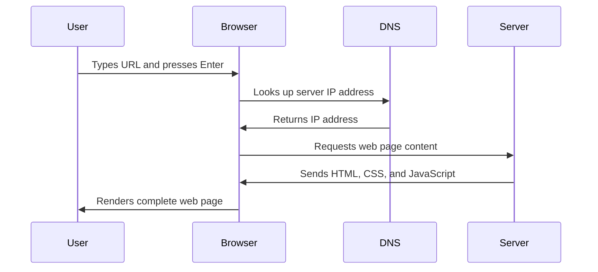

<!--
CO_OP_TRANSLATOR_METADATA:
{
  "original_hash": "33a875c522f237a2026e4653240dfc07",
  "translation_date": "2025-10-23T21:50:38+00:00",
  "source_file": "5-browser-extension/1-about-browsers/README.md",
  "language_code": "sv"
}
-->
# Webbläsartillägg Projekt Del 1: Allt om Webbläsare


> Sketchnote av [Wassim Chegham](https://dev.to/wassimchegham/ever-wondered-what-happens-when-you-type-in-a-url-in-an-address-bar-in-a-browser-3dob)

## Förhandsquiz

[Förhandsquiz](https://ff-quizzes.netlify.app/web/quiz/23)

### Introduktion

Webbläsartillägg är små applikationer som förbättrar din webbläsarupplevelse. Precis som Tim Berners-Lees ursprungliga vision om en interaktiv web, utökar tillägg webbläsarens kapacitet bortom enkel dokumentvisning. Från lösenordshanterare som håller dina konton säkra till färgväljare som hjälper designers att hitta perfekta nyanser, löser tillägg vardagliga utmaningar vid surfning.

Innan vi bygger ditt första tillägg, låt oss förstå hur webbläsare fungerar. Precis som Alexander Graham Bell behövde förstå ljudöverföring innan han uppfann telefonen, kommer kunskap om webbläsarens grunder att hjälpa dig att skapa tillägg som integreras smidigt med befintliga webbläsarsystem.

I slutet av denna lektion kommer du att förstå webbläsarens arkitektur och ha påbörjat byggandet av ditt första tillägg.

## Förstå Webbläsare

En webbläsare är i grunden en sofistikerad dokumenttolkare. När du skriver "google.com" i adressfältet utför webbläsaren en komplex serie operationer - begär innehåll från servrar världen över, och tolkar och renderar sedan den koden till de interaktiva webbsidor du ser.

Denna process speglar hur den första webbläsaren, WorldWideWeb, designades av Tim Berners-Lee 1990 för att göra hyperlänkade dokument tillgängliga för alla.

✅ **Lite historia**: Den första webbläsaren kallades 'WorldWideWeb' och skapades av Sir Timothy Berners-Lee 1990.


> Några tidiga webbläsare, via [Karen McGrane](https://www.slideshare.net/KMcGrane/week-4-ixd-history-personal-computing)

### Hur Webbläsare Bearbetar Webbinnehåll

Processen mellan att skriva in en URL och att se en webbsida involverar flera samordnade steg som sker inom några sekunder:



**Det här uppnår processen:**
- **Översätter** den människoläsbara URL:en till en server-IP-adress via DNS-uppslag
- **Upprättar** en säker anslutning med webbservern med hjälp av HTTP- eller HTTPS-protokoll
- **Begär** det specifika webbsidans innehåll från servern
- **Tar emot** HTML-markup, CSS-styling och JavaScript-kod från servern
- **Renderar** allt innehåll till den interaktiva webbsidan du ser

### Webbläsarens Kärnfunktioner

Moderna webbläsare erbjuder många funktioner som tilläggsutvecklare kan dra nytta av:

| Funktion | Syfte | Möjligheter för tillägg |
|----------|-------|-------------------------|
| **Renderingsmotor** | Visar HTML, CSS och JavaScript | Innehållsmodifiering, stylinginjektion |
| **JavaScript-motor** | Kör JavaScript-kod | Anpassade skript, API-interaktioner |
| **Lokal lagring** | Sparar data lokalt | Användarinställningar, cachelagrad data |
| **Nätverksstack** | Hanterar webbförfrågningar | Övervakning av förfrågningar, dataanalys |
| **Säkerhetsmodell** | Skyddar användare från skadligt innehåll | Innehållsfiltrering, säkerhetsförbättringar |

**Att förstå dessa funktioner hjälper dig att:**
- **Identifiera** var ditt tillägg kan tillföra mest värde
- **Välja** rätt webbläsar-API:er för ditt tilläggs funktionalitet
- **Designa** tillägg som fungerar effektivt med webbläsarsystem
- **Säkerställa** att ditt tillägg följer webbläsarens säkerhetsriktlinjer

### Överväganden för Utveckling av Tillägg för Flera Webbläsare

Olika webbläsare implementerar standarder med små variationer, på samma sätt som olika programmeringsspråk kan hantera samma algoritm på olika sätt. Chrome, Firefox och Safari har var och en unika egenskaper som utvecklare måste ta hänsyn till vid utveckling av tillägg.

> 💡 **Tips**: Använd [caniuse.com](https://www.caniuse.com) för att kontrollera vilka webbteknologier som stöds i olika webbläsare. Detta är ovärderligt när du planerar funktionerna för ditt tillägg!

**Viktiga överväganden för tilläggsutveckling:**
- **Testa** ditt tillägg i Chrome, Firefox och Edge-webbläsare
- **Anpassa** till olika webbläsartilläggs-API:er och manifestformat
- **Hantera** varierande prestandaegenskaper och begränsningar
- **Tillhandahåll** alternativ för webbläsarspecifika funktioner som kanske inte är tillgängliga

✅ **Analysinsikt**: Du kan ta reda på vilka webbläsare dina användare föredrar genom att installera analysverktyg i dina webbutvecklingsprojekt. Denna data hjälper dig att prioritera vilka webbläsare du ska stödja först.

## Förstå Webbläsartillägg

Webbläsartillägg löser vanliga utmaningar vid webbsurfning genom att lägga till funktionalitet direkt i webbläsarens gränssnitt. Istället för att kräva separata applikationer eller komplexa arbetsflöden, ger tillägg omedelbar tillgång till verktyg och funktioner.

Detta koncept speglar hur tidiga datorteknikpionjärer som Douglas Engelbart föreställde sig att förstärka mänskliga förmågor med teknik - tillägg förstärker webbläsarens grundläggande funktionalitet.

**Populära tilläggskategorier och deras fördelar:**
- **Produktivitetsverktyg**: Uppgiftsplanerare, anteckningsappar och tidsspårare som hjälper dig att hålla dig organiserad
- **Säkerhetsförbättringar**: Lösenordshanterare, annonsblockerare och integritetsverktyg som skyddar dina data
- **Utvecklingsverktyg**: Kodformaterare, färgväljare och felsökningsverktyg som förenklar utveckling
- **Innehållsförbättring**: Läslägen, videonedladdare och skärmdumpsverktyg som förbättrar din webbupplevelse

✅ **Reflektionsfråga**: Vilka är dina favoritwebbläsartillägg? Vilka specifika uppgifter utför de, och hur förbättrar de din webbläsarupplevelse?

## Installera och Hantera Tillägg

Att förstå installationsprocessen för tillägg hjälper dig att förutse användarupplevelsen när människor installerar ditt tillägg. Installationsprocessen är standardiserad över moderna webbläsare, med mindre variationer i gränssnittsdesign.


> **Viktigt**: Se till att aktivera utvecklarläge och tillåta tillägg från andra butiker när du testar dina egna tillägg.

### Utvecklingsinstallation av Tillägg

När du utvecklar och testar dina egna tillägg, följ detta arbetsflöde:

```bash
# Step 1: Build your extension
npm run build
```

**Vad detta kommando uppnår:**
- **Kompilerar** din källkod till webbläsarklara filer
- **Paketerar** JavaScript-moduler till optimerade paket
- **Genererar** de slutliga tilläggsfilerna i `/dist`-mappen
- **Förbereder** ditt tillägg för installation och testning

**Steg 2: Navigera till Webbläsartillägg**
1. **Öppna** webbläsarens sida för hantering av tillägg
2. **Klicka** på knappen "Inställningar och mer" (ikonen `...`) längst upp till höger
3. **Välj** "Tillägg" från rullgardinsmenyn

**Steg 3: Ladda Ditt Tillägg**
- **För nya installationer**: Välj `ladda uppackat` och välj din `/dist`-mapp
- **För uppdateringar**: Klicka på `ladda om` bredvid ditt redan installerade tillägg
- **För testning**: Aktivera "Utvecklarläge" för att få tillgång till ytterligare felsökningsfunktioner

### Installation av Färdiga Tillägg

> ✅ **Observera**: Dessa utvecklingsinstruktioner är specifikt för tillägg du bygger själv. För att installera publicerade tillägg, besök de officiella webbläsartilläggsbutikerna som [Microsoft Edge Add-ons store](https://microsoftedge.microsoft.com/addons/Microsoft-Edge-Extensions-Home).

**Förstå skillnaden:**
- **Utvecklingsinstallationer** låter dig testa opublicerade tillägg under utveckling
- **Butiksinstallationer** tillhandahåller granskade, publicerade tillägg med automatiska uppdateringar
- **Sidoinstallation** tillåter installation av tillägg från andra källor än officiella butiker (kräver utvecklarläge)

## Bygga Ditt Koldioxidavtryckstillägg

Vi kommer att skapa ett webbläsartillägg som visar koldioxidavtrycket för energianvändningen i din region. Detta projekt demonstrerar viktiga koncept för tilläggsutveckling samtidigt som det skapar ett praktiskt verktyg för miljömedvetenhet.

Denna metod följer principen "learning by doing" som har visat sig vara effektiv sedan John Deweys pedagogiska teorier - att kombinera tekniska färdigheter med meningsfulla verkliga tillämpningar.

### Projektkrav

Innan vi börjar utvecklingen, låt oss samla de nödvändiga resurserna och beroendena:

**Nödvändig API-åtkomst:**
- **[CO2 Signal API-nyckel](https://www.co2signal.com/)**: Ange din e-postadress för att få din gratis API-nyckel
- **[Regionskod](http://api.electricitymap.org/v3/zones)**: Hitta din regionskod med hjälp av [Electricity Map](https://www.electricitymap.org/map) (till exempel använder Boston 'US-NEISO')

**Utvecklingsverktyg:**
- **[Node.js och NPM](https://www.npmjs.com)**: Verktyg för paketadministration för att installera projektberoenden
- **[Startkod](../../../../5-browser-extension/start)**: Ladda ner mappen `start` för att börja utvecklingen

✅ **Läs Mer**: Förbättra dina färdigheter inom paketadministration med denna [omfattande Learn-modul](https://docs.microsoft.com/learn/modules/create-nodejs-project-dependencies/?WT.mc_id=academic-77807-sagibbon)

### Förstå Projektstrukturen

Att förstå projektstrukturen hjälper till att organisera utvecklingsarbetet effektivt. Precis som Biblioteket i Alexandria var organiserat för enkel kunskapsåtervinning, gör en välstrukturerad kodbas utvecklingen mer effektiv:

```
project-root/
├── dist/                    # Built extension files
│   ├── manifest.json        # Extension configuration
│   ├── index.html           # User interface markup
│   ├── background.js        # Background script functionality
│   └── main.js              # Compiled JavaScript bundle
└── src/                     # Source development files
    └── index.js             # Your main JavaScript code
```

**Vad varje fil gör:**
- **`manifest.json`**: **Definierar** metadata, behörigheter och startpunkter för tillägget
- **`index.html`**: **Skapar** användargränssnittet som visas när användare klickar på ditt tillägg
- **`background.js`**: **Hantera** bakgrundsuppgifter och webbläsarhändelselyssnare
- **`main.js`**: **Innehåller** den slutliga paketerade JavaScript-koden efter byggprocessen
- **`src/index.js`**: **Innehåller** din huvudsakliga utvecklingskod som kompileras till `main.js`

> 💡 **Organisationsråd**: Spara din API-nyckel och regionskod i en säker anteckning för enkel åtkomst under utvecklingen. Du kommer att behöva dessa värden för att testa ditt tilläggs funktionalitet.

✅ **Säkerhetsråd**: Lämna aldrig in API-nycklar eller känsliga uppgifter till din koddatabas. Vi visar dig hur du hanterar dessa säkert i nästa steg.

## Skapa Tilläggets Gränssnitt

Nu ska vi bygga användargränssnittskomponenterna. Tillägget använder en tvåskärmsmetod: en konfigurationsskärm för första inställningen och en resultatskärm för datavisning.

Detta följer principen om progressiv avslöjande som används i gränssnittsdesign sedan datorernas tidiga dagar - att avslöja information och alternativ i en logisk sekvens för att undvika att överväldiga användare.

### Översikt över Tilläggets Vy

**Inställningsvy** - Första gången användaren konfigurerar:


**Resultatvy** - Visning av koldioxidavtrycksdata:


### Bygga Konfigurationsformuläret

Inställningsformuläret samlar användarkonfigurationsdata vid första användningen. När det är konfigurerat, sparas denna information i webbläsarens lagring för framtida sessioner.

I filen `/dist/index.html`, lägg till denna formulärstruktur:

```html
<form class="form-data" autocomplete="on">
    <div>
        <h2>New? Add your Information</h2>
    </div>
    <div>
        <label for="region">Region Name</label>
        <input type="text" id="region" required class="region-name" />
    </div>
    <div>
        <label for="api">Your API Key from tmrow</label>
        <input type="text" id="api" required class="api-key" />
    </div>
    <button class="search-btn">Submit</button>
</form>
```

**Vad detta formulär gör:**
- **Skapar** en semantisk formulärstruktur med korrekta etiketter och inmatningsassociationer
- **Aktiverar** webbläsarens autofyllfunktion för förbättrad användarupplevelse
- **Kräver** att båda fälten fylls i innan inskickning med attributet `required`
- **Organiserar** inmatningar med beskrivande klassnamn för enkel styling och JavaScript-mål
- **Tillhandahåller** tydliga instruktioner för användare som konfigurerar tillägget för första gången

### Bygga Resultatvisningen

Skapa sedan resultatområdet som ska visa koldioxidavtrycksdata. Lägg till denna HTML under formuläret:

```html
<div class="result">
    <div class="loading">loading...</div>
    <div class="errors"></div>
    <div class="data"></div>
    <div class="result-container">
        <p><strong>Region: </strong><span class="my-region"></span></p>
        <p><strong>Carbon Usage: </strong><span class="carbon-usage"></span></p>
        <p><strong>Fossil Fuel Percentage: </strong><span class="fossil-fuel"></span></p>
    </div>
    <button class="clear-btn">Change region</button>
</div>
```

**Vad denna struktur tillhandahåller:**
- **`loading`**: **Visar** ett laddningsmeddelande medan API-data hämtas
- **`errors`**: **Visar** felmeddelanden om API-anrop misslyckas eller data är ogiltig
- **`data`**: **Innehåller** rådata för felsökning under utveckling
- **`result-container`**: **Presenterar** formaterad information om koldioxidavtryck för användare
- **`clear-btn`**: **Tillåter** användare att ändra sin region och konfigurera om tillägget

### Ställa in Byggprocessen

Nu ska vi installera projektberoenden och testa byggprocessen:

```bash
npm install
```

**Vad denna installationsprocess gör:**
- **Laddar ner** Webpack och andra utvecklingsberoenden som anges i `package.json`
- **Konfigurerar** byggverktygskedjan för att kompilera modern JavaScript
- **Förbereder** utvecklingsmiljön för att bygga och testa tillägg
- **Aktiverar** kodpaketering, optimering och funktioner för webbläsarkompatibilitet

> 💡 **Insikt om Byggprocessen**: Webpack paketerar din källkod från `/src/index.js` till `/dist/main.js`. Denna process optimerar din kod för produktion och säkerställer webbläsarkompatibilitet.

### Testa Din Framgång

Vid denna punkt kan du testa ditt tillägg:

1. **Kör** byggkommandot för att kompilera din kod
2. **Ladda** tillägget i din webbläsare med utvecklarläge
3. **Verifiera** att formuläret visas korrekt och ser professionellt ut
4. **Kontrollera** att alla formulärelement är korrekt justerade och funktionella

**Vad du har uppnått:**
- **Byggt** den grundläggande HTML-strukturen för ditt tillägg
- **Skapat** både konfigurations- och resultatgränssnitt med korrekt semantisk markup
- **Ställt in** ett modernt utvecklingsarbetsflöde med branschstandardverktyg
- **Förberett** grunden för att lägga till interaktiv JavaScript-funktionalitet

Du har slutfört den första fasen av utvecklingen av webbläsartillägg. Precis som Wright-bröderna först behövde förstå aerodynamik innan de kunde flyga, förbereder förståelsen av dessa grundläggande koncept dig för att bygga mer komplexa interaktiva funktioner
**Beskrivning:** Förbättra webbläsartillägget genom att lägga till formulärvalidering och användarfeedback för att förbättra användarupplevelsen vid inmatning av API-nycklar och regionkoder.

**Uppgift:** Skapa JavaScript-valideringsfunktioner som kontrollerar om fältet för API-nyckeln innehåller minst 20 tecken och om regionkoden följer rätt format (som 'US-NEISO'). Lägg till visuell feedback genom att ändra färgen på inmatningsfältets kantlinje till grönt för giltiga inmatningar och rött för ogiltiga. Lägg också till en växlingsfunktion för att visa/dölja API-nyckeln av säkerhetsskäl.

Läs mer om [agentläge](https://code.visualstudio.com/blogs/2025/02/24/introducing-copilot-agent-mode) här.

## 🚀 Utmaning

Ta en titt på en webbläsartilläggsbutik och installera ett tillägg i din webbläsare. Du kan undersöka dess filer på intressanta sätt. Vad upptäcker du?

## Quiz efter föreläsningen

[Quiz efter föreläsningen](https://ff-quizzes.netlify.app/web/quiz/24)

## Granskning & Självstudier

I denna lektion lärde du dig lite om webbläsarens historia; ta tillfället i akt att lära dig mer om hur uppfinnarna av World Wide Web föreställde sig dess användning genom att läsa mer om dess historia. Några användbara webbplatser inkluderar:

[Webbläsarnas historia](https://www.mozilla.org/firefox/browsers/browser-history/)

[Webbens historia](https://webfoundation.org/about/vision/history-of-the-web/)

[En intervju med Tim Berners-Lee](https://www.theguardian.com/technology/2019/mar/12/tim-berners-lee-on-30-years-of-the-web-if-we-dream-a-little-we-can-get-the-web-we-want)

## Uppgift 

[Styla om ditt tillägg](assignment.md)

---

**Ansvarsfriskrivning**:  
Detta dokument har översatts med hjälp av AI-översättningstjänsten [Co-op Translator](https://github.com/Azure/co-op-translator). Även om vi strävar efter noggrannhet, bör det noteras att automatiserade översättningar kan innehålla fel eller felaktigheter. Det ursprungliga dokumentet på dess ursprungliga språk bör betraktas som den auktoritativa källan. För kritisk information rekommenderas professionell mänsklig översättning. Vi ansvarar inte för eventuella missförstånd eller feltolkningar som uppstår vid användning av denna översättning.