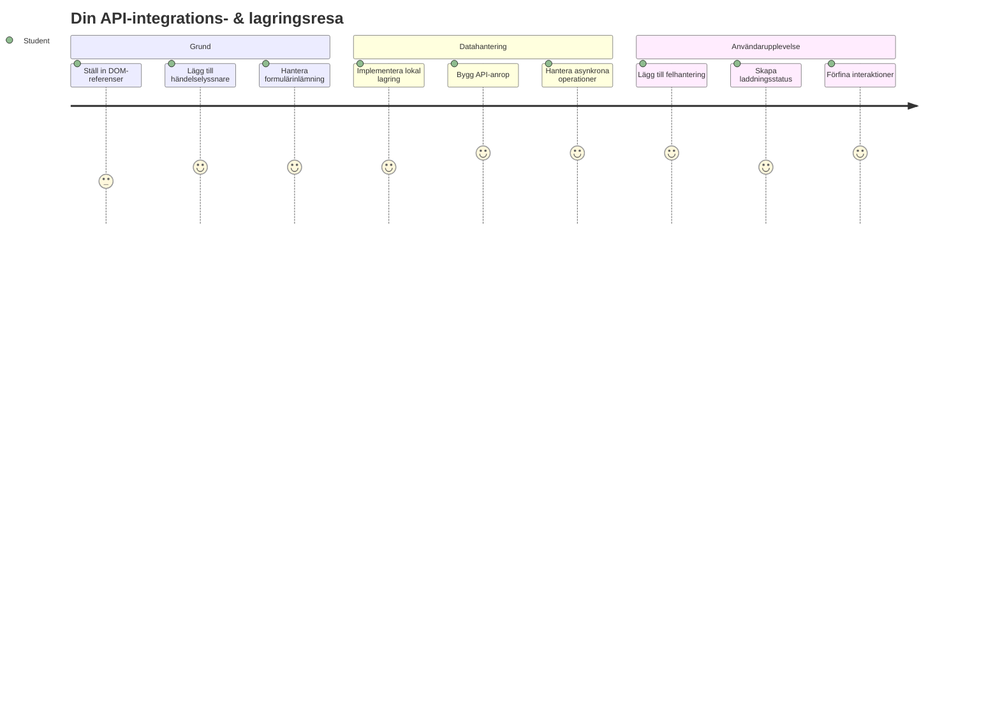
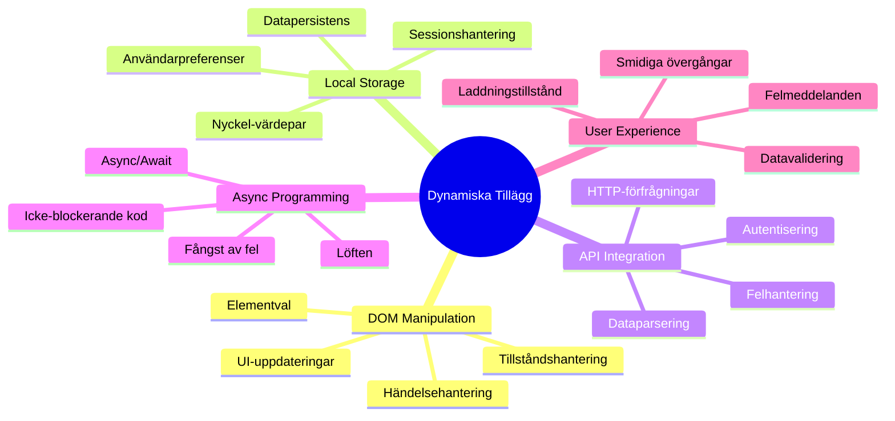
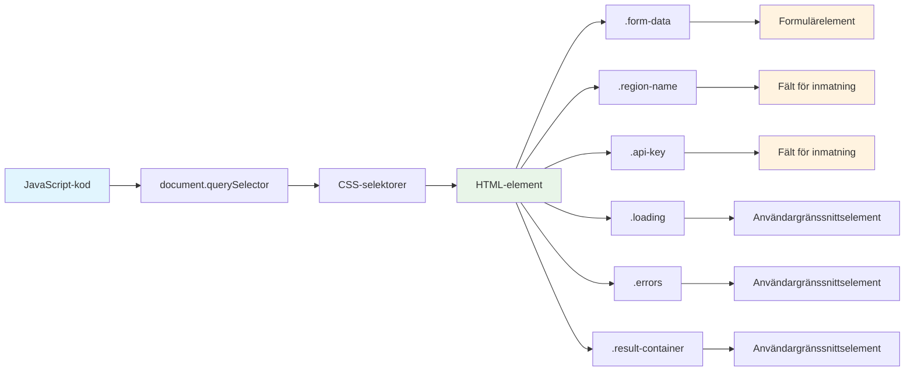
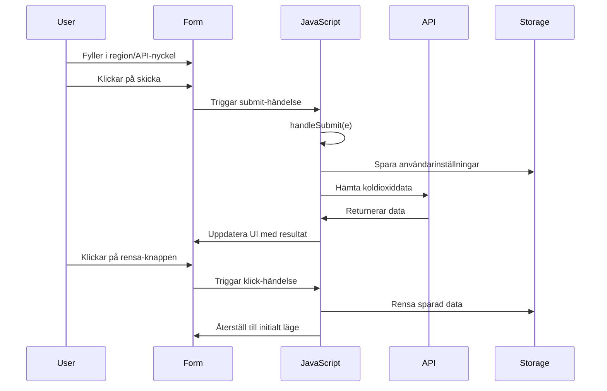
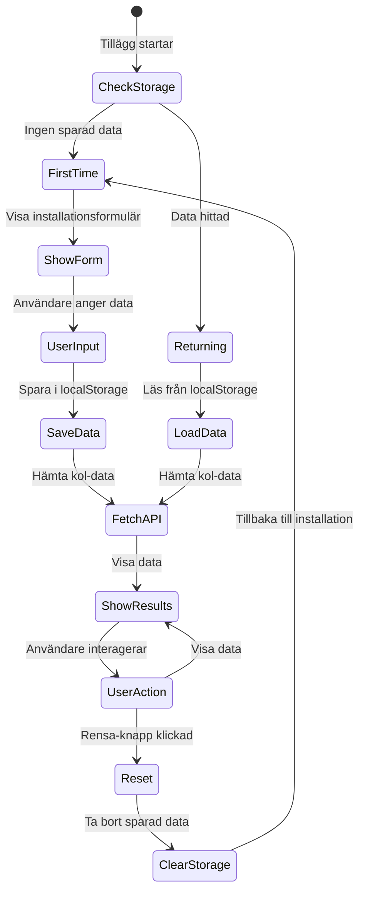
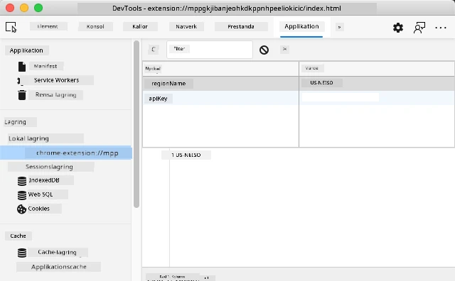
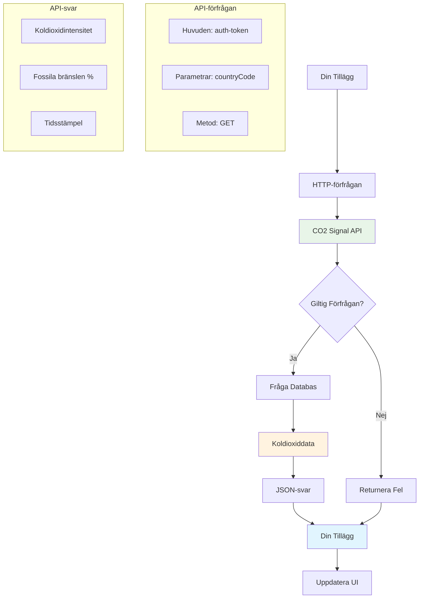
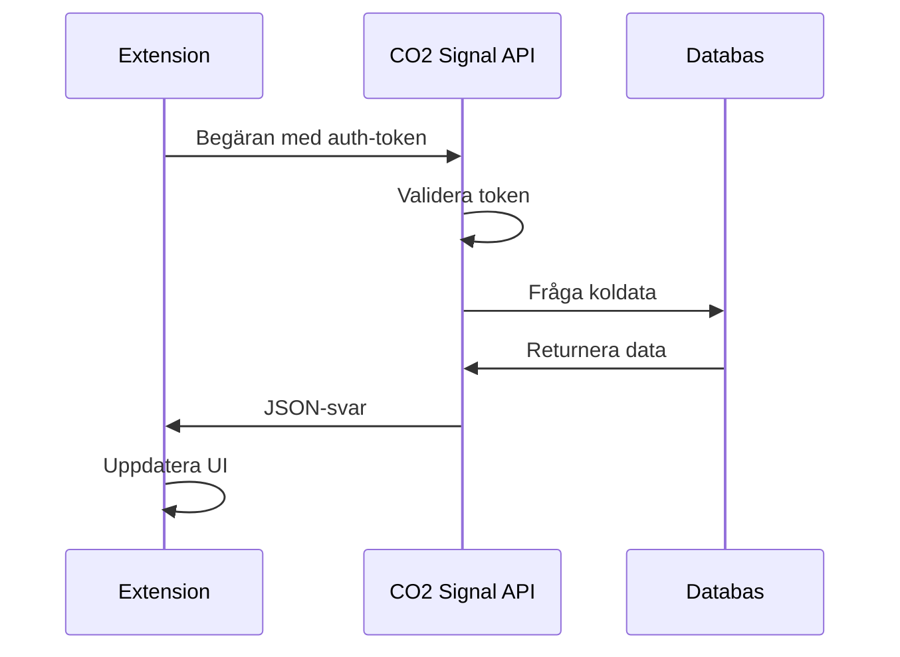
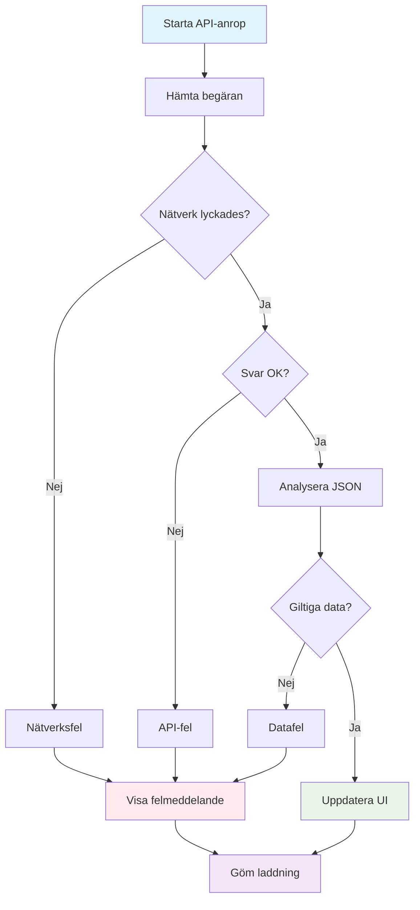
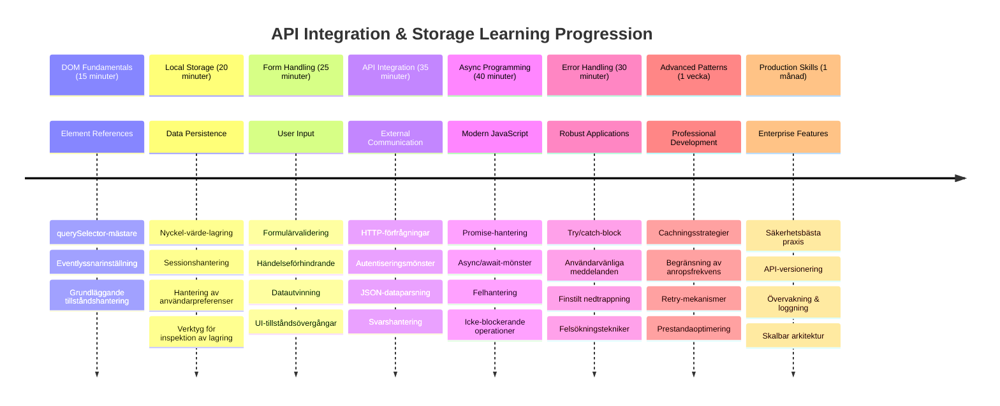

# Webbläsartilläggsprojekt Del 2: Anropa ett API, använd Lokalt Lagringsutrymme


## För-lectures quiz

[För-lectures quiz](https://ff-quizzes.netlify.app/web/quiz/25)

## Introduktion

Kommer du ihåg det webbläsartillägg du började bygga? Just nu har du ett snyggt formulär, men det är i princip statiskt. Idag ska vi få det att leva genom att koppla det till verkliga data och ge det minne.

Tänk på Apollo-uppdragets kontroll-datorer – de visade inte bara fast information. De kommunicerade konstant med rymdfarkosten, uppdaterades med telemetridata och kom ihåg viktiga uppdragsparametrar. Det är den typen av dynamiskt beteende vi bygger idag. Ditt tillägg kommer att nå ut på internet, hämta verklig miljödata och komma ihåg dina inställningar till nästa gång.

API-integration kan låta komplext, men det handlar egentligen bara om att lära din kod att kommunicera med andra tjänster. Oavsett om du hämtar väderdata, sociala medier-flöden eller information om koldioxidavtryck som vi ska göra idag, handlar allt om att etablera dessa digitala kopplingar. Vi kommer också utforska hur webbläsare kan bevara information – på liknande sätt som bibliotek har använt kortkataloger för att komma ihåg var böcker hör hemma.

I slutet av denna lektion kommer du ha ett webbläsartillägg som hämtar verklig data, lagrar användarinställningar och erbjuder en smidig upplevelse. Låt oss börja!


✅ Följ de numrerade segmenten i rätt filer för att veta var du ska placera din kod

## Ställ in elementen som ska manipuleras i tillägget

Innan din JavaScript kan manipulera gränssnittet behöver den referenser till specifika HTML-element. Tänk på det som ett teleskop som måste pekas mot särskilda stjärnor – innan Galileo kunde studera Jupiters månar, var han tvungen att lokalisera och fokusera på Jupiter själv.

I din `index.js`-fil ska vi skapa `const`-variabler som fångar referenser till varje viktigt form-element. Detta liknar hur forskare märker sin utrustning – istället för att söka igenom hela laboratoriet varje gång kan de direkt komma åt det de behöver.


```javascript
// formulärfält
const form = document.querySelector('.form-data');
const region = document.querySelector('.region-name');
const apiKey = document.querySelector('.api-key');

// resultat
const errors = document.querySelector('.errors');
const loading = document.querySelector('.loading');
const results = document.querySelector('.result-container');
const usage = document.querySelector('.carbon-usage');
const fossilfuel = document.querySelector('.fossil-fuel');
const myregion = document.querySelector('.my-region');
const clearBtn = document.querySelector('.clear-btn');
```

**Det här gör koden:**
- **Fångar** formelement med `document.querySelector()` med CSS-klassväljare
- **Skapar** referenser till inmatningsfält för regionsnamn och API-nyckel
- **Etablerar** kopplingar till resultatvisnings-element för koldioxiddata
- **Ställer in** åtkomst till UI-element som laddningsindikatorer och felmeddelanden
- **Sparar** varje elementreferens i en `const`-variabel för enkel återanvändning i koden

## Lägg till event-lyssnare

Nu ska vi få ditt tillägg att reagera på användarens handlingar. Event-lyssnare är din kods sätt att övervaka användarinteraktioner. Tänk på dem som telefonväxlarna i tidiga telefoncentraler – de lyssnade efter inkommande samtal och kopplade rätt kretsar när någon ville göra en anslutning.


```javascript
form.addEventListener('submit', (e) => handleSubmit(e));
clearBtn.addEventListener('click', (e) => reset(e));
init();
```

**Förstå dessa koncept:**
- **Fäster** en submit-lyssnare till formuläret som triggas när användare trycker på Enter eller klickar på skicka
- **Kopplar** en klick-lyssnare till rensa-knappen för att återställa formuläret
- **Skickar** event-objektet `(e)` till handlerfunktioner för extra kontroll
- **Anropar** funktionen `init()` omedelbart för att ställa in tilläggets initiala tillstånd

✅ Notera den kortsyntax för arrow-funktioner som används här. Det är en modern JavaScript-metod som är renare än traditionella funktionsuttryck, men båda fungerar lika bra!

### 🔄 **Pedagogisk kontroll**
**Förståelse för event-hantering**: Innan vi går vidare till initialisering, säkerställ att du kan:
- ✅ Förklara hur `addEventListener` kopplar användarhandlingar till JavaScript-funktioner
- ✅ Förstå varför vi skickar event-objektet `(e)` till handlerfunktioner
- ✅ Känna igen skillnaden mellan `submit` och `click` events
- ✅ Beskriva när funktionen `init()` körs och varför

**Snabb självtest**: Vad skulle hända om du glömde `e.preventDefault()` vid formulärinlämning?
*Svar: Sidan skulle laddas om, alla JavaScript-tillstånd skulle förloras och användarupplevelsen skulle avbrytas*

## Bygg initialiserings- och återställningsfunktionerna

Låt oss skapa initialiseringslogiken för ditt tillägg. Funktionen `init()` är som ett skepps navigationssystem som kontrollerar sina instrument – den avgör det aktuella tillståndet och justerar gränssnittet därefter. Den kontrollerar om någon har använt ditt tillägg tidigare och laddar deras tidigare inställningar.

Funktionen `reset()` ger användare en nystart – ungefär som när forskare nollställer sina instrument mellan experiment för att säkerställa rena data.

```javascript
function init() {
	// Kontrollera om användaren tidigare har sparat API-uppgifter
	const storedApiKey = localStorage.getItem('apiKey');
	const storedRegion = localStorage.getItem('regionName');

	// Sätt tilläggsikonen till generisk grön (platshållare för framtida lektion)
	// TODO: Implementera ikonuppdatering i nästa lektion

	if (storedApiKey === null || storedRegion === null) {
		// Förstagångsanvändare: visa installationsformuläret
		form.style.display = 'block';
		results.style.display = 'none';
		loading.style.display = 'none';
		clearBtn.style.display = 'none';
		errors.textContent = '';
	} else {
		// Återvändande användare: ladda deras sparade data automatiskt
		displayCarbonUsage(storedApiKey, storedRegion);
		results.style.display = 'none';
		form.style.display = 'none';
		clearBtn.style.display = 'block';
	}
}

function reset(e) {
	e.preventDefault();
	// Rensa lagrad region för att tillåta användaren att välja en ny plats
	localStorage.removeItem('regionName');
	// Starta om initialiseringsprocessen
	init();
}
```

**Förklaring av vad som händer här:**
- **Hämtar** sparad API-nyckel och region från webbläsarens lokala lagring
- **Kontrollerar** om det är en förstegangsanvändare (inga sparade uppgifter) eller återvändande användare
- **Visar** inställningsformuläret för nya användare och döljer andra gränssnittselement
- **Laddar** sparad data automatiskt för återvändande användare och visar återställningsalternativet
- **Hantera** gränssnittets tillstånd baserat på tillgängliga data

**Viktiga begrepp om Lokalt Lagringsutrymme:**
- **Bevarar** data mellan webbläsarsessioner (till skillnad från session storage)
- **Sparar** data som nyckel-värde-par med `getItem()` och `setItem()`
- **Returnerar** `null` om ingen data finns för en given nyckel
- **Ger** ett enkelt sätt att komma ihåg användarinställningar

> 💡 **Förståelse av webbläsarlagring**: [LocalStorage](https://developer.mozilla.org/docs/Web/API/Window/localStorage) är som att ge ditt tillägg ett bestående minne. Tänk på hur det antika biblioteket i Alexandria lagrade skriftrullar – information fanns tillgänglig även när forskare gick iväg och kom tillbaka.
>
> **Viktiga egenskaper:**
> - **Består** även efter att du stänger webbläsaren
> - **Överlever** omstart av dator och webbläsarkrascher
> - **Ger** stort lagringsutrymme för användarinställningar
> - **Erbjuder** direktåtkomst utan nätverksfördröjningar

> **Viktigt:** Ditt webbläsartillägg har sin egen isolerade lokala lagring som är separat från vanliga webbsidor. Detta ger säkerhet och förhindrar konflikter med andra webbplatser.

Du kan se din lagrade data genom att öppna webbläsarens utvecklarverktyg (F12), gå till fliken **Application** och expandera sektionen **Local Storage**.




> ⚠️ **Säkerhetsaspekt:** I produktionsapplikationer innebär lagring av API-nycklar i LocalStorage säkerhetsrisker eftersom JavaScript kan komma åt dessa data. För lärande ändamål fungerar det bra, men riktiga applikationer bör använda säker serverlagring för känsliga uppgifter.

## Hantera formulärinlämning

Nu hanterar vi vad som händer när någon skickar in ditt formulär. Webbläsare laddar om sidan som standard när formulär skickas, men vi kommer att avbryta detta beteende för att skapa en smidigare upplevelse.

Detta liknar hur uppdragskontrollen hanterar rymdfarkostkommunikation – istället för att återställa hela systemet för varje transmission, upprätthålls kontinuerlig drift samtidigt som ny information behandlas.

Skapa en funktion som fångar formulärinlämningshändelsen och hämtar användarens input:

```javascript
function handleSubmit(e) {
	e.preventDefault();
	setUpUser(apiKey.value, region.value);
}
```

**I ovanstående har vi:**
- **Förhindrat** standardbeteendet vid formulärinlämning som skulle uppdatera sidan
- **Extraherat** användar-input från API-nyckel och regionsfält
- **Skickat** formulärdata till funktionen `setUpUser()` för bearbetning
- **Behållit** single-page-application-beteende genom att undvika omladdningar

✅ Kom ihåg att dina HTML-formulärfält har attributet `required`, så webbläsaren validerar automatiskt att användare anger både API-nyckel och region innan denna funktion körs.

## Ställ in användarinställningar

Funktionen `setUpUser` ansvarar för att spara användarens uppgifter och påbörja det första API-anropet. Detta skapar en smidig övergång från inställning till att visa resultat.

```javascript
function setUpUser(apiKey, regionName) {
	// Spara användaruppgifter för framtida sessioner
	localStorage.setItem('apiKey', apiKey);
	localStorage.setItem('regionName', regionName);
	
	// Uppdatera UI för att visa laddningstillstånd
	loading.style.display = 'block';
	errors.textContent = '';
	clearBtn.style.display = 'block';
	
	// Hämta kolanvändningsdata med användarens uppgifter
	displayCarbonUsage(apiKey, regionName);
}
```

**Steg för steg händer detta:**
- **Sparar** API-nyckel och regionsnamn till lokal lagring för framtida användning
- **Visar** en laddningsindikator för att informera användaren om att data hämtas
- **Rensar** eventuella tidigare felmeddelanden från vyn
- **Visar** rensa-knappen för att användare ska kunna återställa inställningarna senare
- **Initierar** API-anropet för att hämta verklig koldioxiddata

Funktionen skapar en sömlös användarupplevelse genom att hantera data och UI-uppdateringar i en koordinerad åtgärd.

## Visa koldioxiddata

Nu kopplar vi ditt tillägg till externa datakällor via API:er. Detta förvandlar ditt tillägg från ett fristående verktyg till något som kan hämta realtidsinformation från internet.

**Förstå API:er**

[API:er](https://www.webopedia.com/TERM/A/API.html) är hur olika applikationer kommunicerar med varandra. Tänk på dem som telegrafsystemet som kopplade ihop avlägsna städer på 1800-talet – operatörer skickade förfrågningar till fjärrstationer och fick svar med den begärda informationen. Varje gång du kollar sociala medier, ställer en fråga till en röstassistent eller använder en leveransapp, är API:er det som möjliggör dessa datautbyten.


**Viktiga begrepp om REST API:er:**
- **REST** står för 'Representational State Transfer'
- **Använder** standard-HTTP-metoder (GET, POST, PUT, DELETE) för att interagera med data
- **Returnerar** data i förutsägbara format, vanligtvis JSON
- **Erbjuder** konsekventa URL-baserade slutpunkter för olika typer av förfrågningar

✅ [CO2 Signal API](https://www.co2signal.com/) som vi använder tillhandahåller realtidsdata för koldioxidintensitet från elnät världen över. Detta hjälper användare att förstå miljöpåverkan av deras elförbrukning!

> 💡 **Förståelse av Asynkron JavaScript**: [`async`-nyckelordet](https://developer.mozilla.org/docs/Web/JavaScript/Reference/Statements/async_function) gör det möjligt för din kod att hantera flera operationer samtidigt. När du begär data från en server vill du inte att hela tillägget fryser – det vore som att flygledningen stannar all verksamhet medan ett plan svarar.
>
> **Viktiga fördelar:**
> - **Behåller** tilläggets responsivitet medan data laddas
> - **Tillåter** annan kod att fortsätta exekvera under nätverksförfrågningar
> - **Förbättrar** kodläsbarhet jämfört med traditionella callback-mönster
> - **Möjliggör** smidig felhantering vid nätverksproblem

Här är en snabb video om `async`:

[](https://youtube.com/watch?v=YwmlRkrxvkk "Async and Await för att hantera promises")

> 🎥 Klicka på bilden ovan för en video om async/await.

### 🔄 **Pedagogisk kontroll**
**Förståelse av asynkron programmering**: Innan du går in i API-funktionen, verifiera att du förstår:
- ✅ Varför vi använder `async/await` istället för att blockera hela tillägget
- ✅ Hur `try/catch`-block hanterar nätverksfel på ett smidigt sätt
- ✅ Skillnaden mellan synkrona och asynkrona operationer
- ✅ Varför API-anrop kan misslyckas och hur man hanterar dessa fel

**Verklighetsanknytning**: Tänk på vardagliga asynkrona exempel:
- **Beställa mat**: Du väntar inte vid köket – får en kvittens och fortsätter med annat
- **Skicka e-post**: Appen fryser inte vid sändning – du kan skriva fler e-postmeddelanden
- **Ladda webbsidor**: Bilder laddas successivt och du kan redan läsa texten

**API-autentiseringsflöde**:

Skapa funktionen som hämtar och visar koldioxiddata:

```javascript
// Modern fetch API-metod (inga externa beroenden behövs)
async function displayCarbonUsage(apiKey, region) {
	try {
		// Hämta koldioxidintensitetsdata från CO2 Signal API
		const response = await fetch('https://api.co2signal.com/v1/latest', {
			method: 'GET',
			headers: {
				'auth-token': apiKey,
				'Content-Type': 'application/json'
			},
			// Lägg till frågeparametrar för den specifika regionen
			...new URLSearchParams({ countryCode: region }) && {
				url: `https://api.co2signal.com/v1/latest?countryCode=${region}`
			}
		});

		// Kontrollera om API-förfrågan lyckades
		if (!response.ok) {
			throw new Error(`API request failed: ${response.status}`);
		}

		const data = await response.json();
		const carbonData = data.data;

		// Beräkna avrundat värde för koldioxidintensitet
		const carbonIntensity = Math.round(carbonData.carbonIntensity);

		// Uppdatera användargränssnittet med hämtade data
		loading.style.display = 'none';
		form.style.display = 'none';
		myregion.textContent = region.toUpperCase();
		usage.textContent = `${carbonIntensity} grams (grams CO₂ emitted per kilowatt hour)`;
		fossilfuel.textContent = `${carbonData.fossilFuelPercentage.toFixed(2)}% (percentage of fossil fuels used to generate electricity)`;
		results.style.display = 'block';

		// TODO: calculateColor(carbonIntensity) - implementera i nästa lektion

	} catch (error) {
		console.error('Error fetching carbon data:', error);
		
		// Visa användarvänligt felmeddelande
		loading.style.display = 'none';
		results.style.display = 'none';
		errors.textContent = 'Sorry, we couldn\'t fetch data for that region. Please check your API key and region code.';
	}
}
```

**Genomgång av vad som händer här:**
- **Använder** den moderna `fetch()`-API:et istället för externa bibliotek som Axios för ren, beroendefri kod
- **Implementerar** korrekt felkontroll med `response.ok` för att fånga API-fel tidigt
- **Hanterar** asynkrona operationer med `async/await` för mer läsbar kodflöde
- **Autentiserar** med CO2 Signal API via `auth-token`-headern
- **Parser** JSON-svar och extraherar koldioxidintensitetsinformation
- **Uppdaterar** flera UI-element med formaterad miljödata
- **Visar** användarvänliga felmeddelanden när API-anrop misslyckas

**Viktiga moderna JavaScript-koncept som demonstreras:**
- **Template literals** med `${}`-syntax för ren strängformatering
- **Felhantering** med try/catch för robusta applikationer
- **Async/await**-mönster för smidig nätverkshantering
- **Objektdestrukturering** för att extrahera specifika data från API-svar
- **Metodkedjning** för flera DOM-manipulationer

✅ Denna funktion demonstrerar flera viktiga webbprogrammeringskoncept – kommunikation med externa servrar, hantering av autentisering, bearbetning av data, uppdatering av gränssnitt och felformuleringar. Dessa är grundläggande färdigheter som professionella utvecklare använder regelbundet.


### 🔄 **Pedagogisk kontroll**
**Helhetssyn på systemet**: Säkerställ din behärskning av hela flödet:
- ✅ Hur DOM-referenser gör det möjligt för JavaScript att styra gränssnittet
- ✅ Varför lokal lagring skapar beständighet mellan webbläsarsessioner
- ✅ Hur async/await gör API-anrop utan att frysa tillägget
- ✅ Vad som händer när API-anrop misslyckas och hur fel hanteras
- ✅ Varför användarupplevelsen inkluderar laddningstillstånd och felmeddelanden

🎉 **Vad du åstadkommit:** Du har skapat ett webbläsartillägg som:
- **Kopplar** upp sig mot internet och hämtar verklig miljödata
- **Bevarar** användarinställningar mellan sessioner
- **Hanterar** fel smidigt istället för att krascha
- **Ger** en smidig, professionell användarupplevelse

Testa ditt arbete genom att köra `npm run build` och uppdatera tillägget i webbläsaren. Du har nu en fungerande koldioxidfotspårsspårare. Nästa lektion lägger till dynamisk ikonfunktionalitet för att slutföra tillägget.

---

## GitHub Copilot Agent-utmaning 🚀

Använd Agent-läget för att slutföra följande utmaning:
**Beskrivning:** Förbättra webbläsartillägget genom att lägga till förbättrad felhantering och funktioner för användarupplevelsen. Denna utmaning hjälper dig att öva på att arbeta med API:er, lokal lagring och DOM-manipulation med moderna JavaScript-mönster.

**Uppmaning:** Skapa en förbättrad version av funktionen displayCarbonUsage som inkluderar: 1) En retry-mekanism för misslyckade API-anrop med exponentiell backoff, 2) Indatavalidering för regionkoden innan API-anropet görs, 3) En laddningsanimation med progressindikatorer, 4) Cachning av API-svar i localStorage med utgångstid (cache i 30 minuter), och 5) En funktion för att visa historiska data från tidigare API-anrop. Lägg även till korrekt TypeScript-stil JSDoc-kommentarer för att dokumentera alla funktionsparametrar och returtyper.

Lär dig mer om [agent mode](https://code.visualstudio.com/blogs/2025/02/24/introducing-copilot-agent-mode) här.

## 🚀 Utmaning

Utöka din förståelse för API:er genom att utforska den stora mängd webbläsarbaserade API:er som finns för webbutveckling. Välj ett av dessa webbläsar-API:er och bygg en liten demonstration:

- [Geolocation API](https://developer.mozilla.org/docs/Web/API/Geolocation_API) - Hämta användarens aktuella plats
- [Notification API](https://developer.mozilla.org/docs/Web/API/Notifications_API) - Skicka skrivbordsnotiser
- [HTML Drag and Drop API](https://developer.mozilla.org/docs/Web/API/HTML_Drag_and_Drop_API) - Skapa interaktiva draggränssnitt
- [Web Storage API](https://developer.mozilla.org/docs/Web/API/Web_Storage_API) - Avancerade tekniker för lokal lagring
- [Fetch API](https://developer.mozilla.org/docs/Web/API/Fetch_API) - Modern ersättning för XMLHttpRequest

**Forskningsfrågor att överväga:**
- Vilka verkliga problem löser detta API?
- Hur hanterar API:et fel och edge cases?
- Vilka säkerhetsaspekter finns vid användning av detta API?
- Hur väl stödjs detta API i olika webbläsare?

Efter din research, identifiera vilka egenskaper som gör ett API utvecklarvänligt och pålitligt.

## Quiz efter föreläsningen

[Quiz efter föreläsningen](https://ff-quizzes.netlify.app/web/quiz/26)

## Genomgång och Självstudier

Du lärde dig om LocalStorage och API:er i denna lektion, båda mycket användbara för professionella webbutvecklare. Kan du fundera på hur dessa två saker samverkar? Fundera på hur du skulle arkitektera en webbplats som sparar objekt för att användas av ett API.

### ⚡ **Vad du kan göra de närmaste 5 minuterna**
- [ ] Öppna DevTools Application-fliken och utforska localStorage på vilken webbplats som helst
- [ ] Skapa ett enkelt HTML-formulär och testa formulärvalidering i webbläsaren
- [ ] Prova att spara och hämta data med localStorage i webbläsarens konsol
- [ ] Inspektera formulärdata som skickas via fliken Network

### 🎯 **Vad du kan åstadkomma denna timme**
- [ ] Klara quizet efter lektionen och förstå koncept för formulärhantering
- [ ] Bygga ett webbläsartilläggsformulär som sparar användarinställningar
- [ ] Implementera klientbaserad formulärvalidering med hjälpsamma felmeddelanden
- [ ] Öva på att använda chrome.storage API för lagrad data i tillägg
- [ ] Skapa ett användargränssnitt som svarar på sparade användarinställningar

### 📅 **Din veckolånga tilläggsutveckling**
- [ ] Bygga ett fullfjädrat webbläsartillägg med formulärfunktionalitet
- [ ] Bemästra olika lagringsalternativ: lokal, synkroniserad och sessionslagring
- [ ] Implementera avancerade formulärfunktioner som autokomplettering och validering
- [ ] Lägg till import/export-funktionalitet för användardata
- [ ] Testa ditt tillägg noggrant i olika webbläsare
- [ ] Putsa till användarupplevelsen och felhanteringen i ditt tillägg

### 🌟 **Din månadsvisa Web API-mästarklass**
- [ ] Bygga komplexa applikationer med olika webbläsarlagrings-API:er
- [ ] Lära dig offline-först-utvecklingsmönster
- [ ] Bidra till öppen källkod projekt med datapersistering
- [ ] Bemästra integritetsfokuserad utveckling och GDPR-efterlevnad
- [ ] Skapa återanvändbara bibliotek för formulärhantering och datahantering
- [ ] Dela kunskap om web-API:er och tilläggsutveckling

## 🎯 Din tidslinje för fördjupad tilläggsutveckling


### 🛠️ Din sammanfattning av verktyg för fullstackutveckling

Efter att ha slutfört denna lektion har du nu:
- **DOM-mästerskap**: Noggrann elementinriktning och manipulation
- **Lagringskompetens**: Ihållande datahantering med localStorage
- **API-integration**: Realtidsdatahämtning och autentisering
- **Asynkron programmering**: Icke-blockerande operationer med modern JavaScript
- **Felhantering**: Robust applikation som hanterar fel smidigt
- **Användarupplevelse**: Laddningstillstånd, validering och mjuka interaktioner
- **Moderna mönster**: fetch API, async/await och ES6+-funktioner

**Professionella färdigheter du fått**: Du har implementerat mönster som används i:
- **Webbapplikationer**: Single-page-appar med externa datakällor
- **Mobilutveckling**: API-drivna appar med offlinefunktioner
- **Skrivbordsprogramvara**: Electron-appar med ihållande lagring
- **Företagssystem**: Autentisering, cachning och felhantering
- **Moderna ramverk**: Datahanteringsmönster i React/Vue/Angular

**Nästa nivå**: Du är redo att utforska avancerade ämnen som cachningsstrategier, realtids WebSocket-anslutningar eller komplex tillståndshantering!

## Uppgift

[Anta ett API](assignment.md)

---

<!-- CO-OP TRANSLATOR DISCLAIMER START -->
**Ansvarsfriskrivning**:  
Detta dokument har översatts med hjälp av AI-översättningstjänsten [Co-op Translator](https://github.com/Azure/co-op-translator). Även om vi strävar efter noggrannhet, bör du vara medveten om att automatiska översättningar kan innehålla fel eller brister. Det ursprungliga dokumentet på dess modersmål ska betraktas som den auktoritativa källan. För viktig information rekommenderas professionell human översättning. Vi ansvarar inte för eventuella missförstånd eller feltolkningar som uppstår till följd av användning av denna översättning.
<!-- CO-OP TRANSLATOR DISCLAIMER END -->