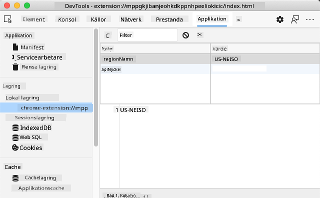

<!--
CO_OP_TRANSLATOR_METADATA:
{
  "original_hash": "a7587943d38d095de8613e1b508609f5",
  "translation_date": "2025-08-29T07:53:19+00:00",
  "source_file": "5-browser-extension/2-forms-browsers-local-storage/README.md",
  "language_code": "sv"
}
-->
# Webbläsartillägg Projekt Del 2: Anropa en API, använd Lokal Lagring

## Förhandsquiz

[Förhandsquiz](https://ff-quizzes.netlify.app/web/quiz/25)

### Introduktion

I denna lektion kommer du att anropa en API genom att skicka in formuläret i ditt webbläsartillägg och visa resultaten i tillägget. Dessutom kommer du att lära dig hur du kan lagra data i webbläsarens lokala lagring för framtida referens och användning.

✅ Följ de numrerade segmenten i de relevanta filerna för att veta var du ska placera din kod.

### Ställ in elementen att manipulera i tillägget:

Vid det här laget har du byggt HTML för formuläret och resultat-`<div>` för ditt webbläsartillägg. Från och med nu behöver du arbeta i filen `/src/index.js` och bygga ditt tillägg steg för steg. Hänvisa till [föregående lektion](../1-about-browsers/README.md) för att få ditt projekt uppsatt och för byggprocessen.

Arbeta i din `index.js`-fil och börja med att skapa några `const`-variabler för att hålla värdena som är kopplade till olika fält:

```JavaScript
// form fields
const form = document.querySelector('.form-data');
const region = document.querySelector('.region-name');
const apiKey = document.querySelector('.api-key');

// results
const errors = document.querySelector('.errors');
const loading = document.querySelector('.loading');
const results = document.querySelector('.result-container');
const usage = document.querySelector('.carbon-usage');
const fossilfuel = document.querySelector('.fossil-fuel');
const myregion = document.querySelector('.my-region');
const clearBtn = document.querySelector('.clear-btn');
```

Alla dessa fält refereras till med sina CSS-klasser, som du ställde in i HTML i föregående lektion.

### Lägg till lyssnare

Lägg sedan till eventlyssnare för formuläret och rensningsknappen som återställer formuläret, så att något händer om en användare skickar in formuläret eller klickar på återställningsknappen. Lägg också till anropet för att initiera appen längst ner i filen:

```JavaScript
form.addEventListener('submit', (e) => handleSubmit(e));
clearBtn.addEventListener('click', (e) => reset(e));
init();
```

✅ Notera den förkortade syntaxen som används för att lyssna på ett submit- eller klick-event, och hur eventet skickas till funktionerna handleSubmit eller reset. Kan du skriva motsvarigheten till denna förkortning i ett längre format? Vilken föredrar du?

### Bygg init()-funktionen och reset()-funktionen:

Nu ska du bygga funktionen som initierar tillägget, kallad init():

```JavaScript
function init() {
	//if anything is in localStorage, pick it up
	const storedApiKey = localStorage.getItem('apiKey');
	const storedRegion = localStorage.getItem('regionName');

	//set icon to be generic green
	//todo

	if (storedApiKey === null || storedRegion === null) {
		//if we don't have the keys, show the form
		form.style.display = 'block';
		results.style.display = 'none';
		loading.style.display = 'none';
		clearBtn.style.display = 'none';
		errors.textContent = '';
	} else {
        //if we have saved keys/regions in localStorage, show results when they load
        displayCarbonUsage(storedApiKey, storedRegion);
		results.style.display = 'none';
		form.style.display = 'none';
		clearBtn.style.display = 'block';
	}
};

function reset(e) {
	e.preventDefault();
	//clear local storage for region only
	localStorage.removeItem('regionName');
	init();
}

```
I denna funktion finns det intressant logik. När du läser igenom den, kan du se vad som händer?

- Två `const` sätts upp för att kontrollera om användaren har lagrat en API-nyckel och regionskod i lokal lagring.
- Om någon av dessa är null, visa formuläret genom att ändra dess stil till att visas som 'block'.
- Dölj resultaten, laddningsindikatorn och clearBtn och sätt eventuell feltext till en tom sträng.
- Om det finns en nyckel och region, starta en rutin för att:
  - Anropa API:t för att få data om koldioxidanvändning.
  - Dölj resultatområdet.
  - Dölj formuläret.
  - Visa återställningsknappen.

Innan du går vidare är det användbart att lära sig om ett mycket viktigt koncept som finns tillgängligt i webbläsare: [LocalStorage](https://developer.mozilla.org/docs/Web/API/Window/localStorage). LocalStorage är ett användbart sätt att lagra strängar i webbläsaren som ett `key-value`-par. Denna typ av webblagring kan manipuleras med JavaScript för att hantera data i webbläsaren. LocalStorage löper inte ut, medan SessionStorage, en annan typ av webblagring, rensas när webbläsaren stängs. De olika typerna av lagring har för- och nackdelar med sin användning.

> Notera - ditt webbläsartillägg har sin egen lokala lagring; huvudwebbläsarfönstret är en separat instans och beter sig annorlunda.

Du ställer in din API-nyckel med ett strängvärde, till exempel, och du kan se att den är inställd i Edge genom att "inspektera" en webbsida (du kan högerklicka på en webbläsare för att inspektera) och gå till fliken Applications för att se lagringen.



✅ Fundera på situationer där du INTE skulle vilja lagra viss data i LocalStorage. Generellt sett är det en dålig idé att placera API-nycklar i LocalStorage! Kan du se varför? I vårt fall, eftersom vår app är enbart för lärande och inte kommer att distribueras till en appbutik, kommer vi att använda denna metod.

Notera att du använder Web API för att manipulera LocalStorage, antingen genom att använda `getItem()`, `setItem()` eller `removeItem()`. Det stöds brett över webbläsare.

Innan du bygger funktionen `displayCarbonUsage()` som anropas i `init()`, låt oss bygga funktionaliteten för att hantera den initiala formulärinlämningen.

### Hantera formulärinlämningen

Skapa en funktion kallad `handleSubmit` som accepterar ett event-argument `(e)`. Stoppa eventet från att spridas (i detta fall vill vi stoppa webbläsaren från att uppdatera) och anropa en ny funktion, `setUpUser`, med argumenten `apiKey.value` och `region.value`. På detta sätt använder du de två värdena som hämtas via det initiala formuläret när de relevanta fälten är ifyllda.

```JavaScript
function handleSubmit(e) {
	e.preventDefault();
	setUpUser(apiKey.value, region.value);
}
```
✅ Fräscha upp ditt minne - HTML:en du ställde in i förra lektionen har två inmatningsfält vars `values` fångas via `const` du ställde in högst upp i filen, och de är båda `required` så att webbläsaren hindrar användare från att mata in null-värden.

### Ställ in användaren

Vidare till funktionen `setUpUser`, här ställer du in värden för lokal lagring för apiKey och regionName. Lägg till en ny funktion:

```JavaScript
function setUpUser(apiKey, regionName) {
	localStorage.setItem('apiKey', apiKey);
	localStorage.setItem('regionName', regionName);
	loading.style.display = 'block';
	errors.textContent = '';
	clearBtn.style.display = 'block';
	//make initial call
	displayCarbonUsage(apiKey, regionName);
}
```
Denna funktion visar ett laddningsmeddelande medan API:t anropas. Vid denna punkt har du kommit fram till att skapa den viktigaste funktionen i detta webbläsartillägg!

### Visa koldioxidanvändning

Slutligen är det dags att fråga API:t!

Innan vi går vidare bör vi diskutera API:er. API:er, eller [Application Programming Interfaces](https://www.webopedia.com/TERM/A/API.html), är en kritisk del av en webbutvecklares verktygslåda. De tillhandahåller standardiserade sätt för program att interagera och kommunicera med varandra. Till exempel, om du bygger en webbplats som behöver fråga en databas, kanske någon har skapat en API för dig att använda. Även om det finns många typer av API:er, är en av de mest populära en [REST API](https://www.smashingmagazine.com/2018/01/understanding-using-rest-api/).

✅ Termen 'REST' står för 'Representational State Transfer' och innebär att använda olika konfigurerade URL:er för att hämta data. Gör lite research om de olika typerna av API:er som finns tillgängliga för utvecklare. Vilket format tilltalar dig?

Det finns viktiga saker att notera om denna funktion. Först, notera nyckelordet [`async`](https://developer.mozilla.org/docs/Web/JavaScript/Reference/Statements/async_function). Att skriva dina funktioner så att de körs asynkront innebär att de väntar på en åtgärd, såsom att data returneras, innan de fortsätter.

Här är en snabb video om `async`:

[](https://youtube.com/watch?v=YwmlRkrxvkk "Async och Await för att hantera löften")

> 🎥 Klicka på bilden ovan för en video om async/await.

Skapa en ny funktion för att fråga C02Signal API:

```JavaScript
import axios from '../node_modules/axios';

async function displayCarbonUsage(apiKey, region) {
	try {
		await axios
			.get('https://api.co2signal.com/v1/latest', {
				params: {
					countryCode: region,
				},
				headers: {
					'auth-token': apiKey,
				},
			})
			.then((response) => {
				let CO2 = Math.floor(response.data.data.carbonIntensity);

				//calculateColor(CO2);

				loading.style.display = 'none';
				form.style.display = 'none';
				myregion.textContent = region;
				usage.textContent =
					Math.round(response.data.data.carbonIntensity) + ' grams (grams C02 emitted per kilowatt hour)';
				fossilfuel.textContent =
					response.data.data.fossilFuelPercentage.toFixed(2) +
					'% (percentage of fossil fuels used to generate electricity)';
				results.style.display = 'block';
			});
	} catch (error) {
		console.log(error);
		loading.style.display = 'none';
		results.style.display = 'none';
		errors.textContent = 'Sorry, we have no data for the region you have requested.';
	}
}
```

Detta är en stor funktion. Vad händer här?

- Enligt bästa praxis använder du nyckelordet `async` för att få denna funktion att bete sig asynkront. Funktionen innehåller ett `try/catch`-block eftersom den kommer att returnera ett löfte när API:t returnerar data. Eftersom du inte har kontroll över hastigheten som API:t svarar (det kanske inte svarar alls!), behöver du hantera denna osäkerhet genom att anropa det asynkront.
- Du frågar co2signal API för att få data om din regions koldioxidanvändning, med din API-nyckel. För att använda den nyckeln måste du använda en typ av autentisering i dina header-parametrar.
- När API:t svarar tilldelar du olika element av dess svar till de delar av din skärm som du ställde in för att visa denna data.
- Om det finns ett fel, eller om det inte finns något resultat, visar du ett felmeddelande.

✅ Att använda asynkrona programmeringsmönster är ett annat mycket användbart verktyg i din verktygslåda. Läs [om de olika sätten](https://developer.mozilla.org/docs/Web/JavaScript/Reference/Statements/async_function) du kan konfigurera denna typ av kod.

Grattis! Om du bygger ditt tillägg (`npm run build`) och uppdaterar det i din tilläggspanel, har du ett fungerande tillägg! Det enda som inte fungerar är ikonen, och du kommer att fixa det i nästa lektion.

---

## 🚀 Utmaning

Vi har diskuterat flera typer av API:er hittills i dessa lektioner. Välj en web-API och undersök i detalj vad det erbjuder. Till exempel, ta en titt på API:er som finns tillgängliga i webbläsare såsom [HTML Drag and Drop API](https://developer.mozilla.org/docs/Web/API/HTML_Drag_and_Drop_API). Vad gör ett API bra enligt dig?

## Efterföreläsningsquiz

[Efterföreläsningsquiz](https://ff-quizzes.netlify.app/web/quiz/26)

## Granskning & Självstudier

Du lärde dig om LocalStorage och API:er i denna lektion, båda mycket användbara för den professionella webbutvecklaren. Kan du tänka på hur dessa två saker fungerar tillsammans? Fundera på hur du skulle designa en webbplats som lagrar objekt för att användas av en API.

## Uppgift

[Adoptera en API](assignment.md)

---

**Ansvarsfriskrivning**:  
Detta dokument har översatts med hjälp av AI-översättningstjänsten [Co-op Translator](https://github.com/Azure/co-op-translator). Även om vi strävar efter noggrannhet, vänligen notera att automatiska översättningar kan innehålla fel eller felaktigheter. Det ursprungliga dokumentet på dess originalspråk bör betraktas som den auktoritativa källan. För kritisk information rekommenderas professionell mänsklig översättning. Vi ansvarar inte för eventuella missförstånd eller feltolkningar som uppstår vid användning av denna översättning.