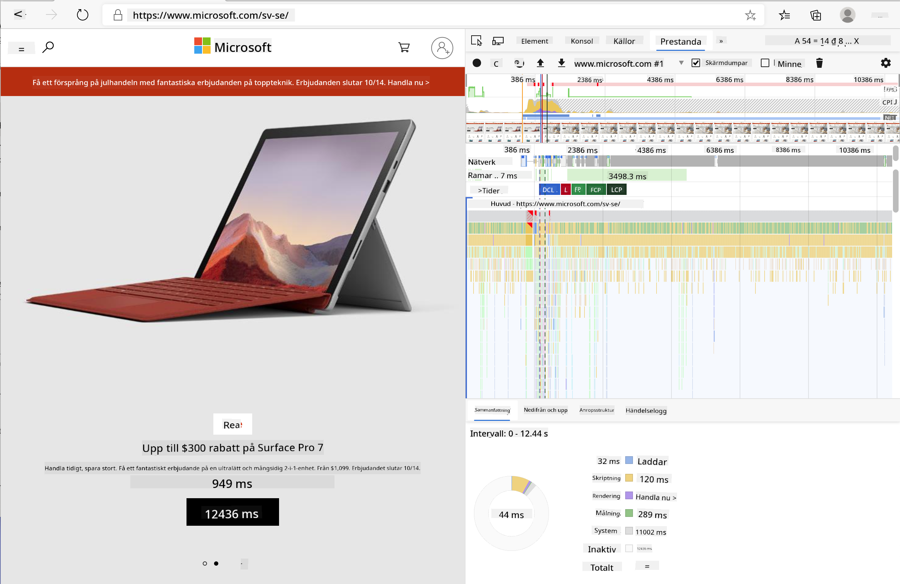
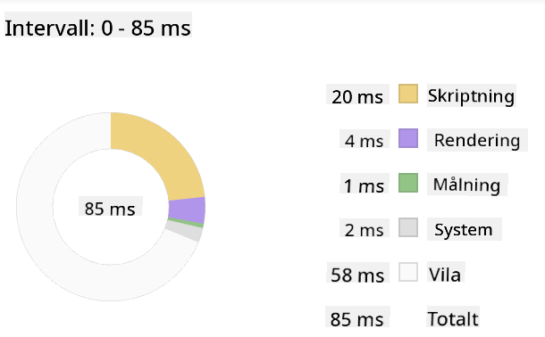
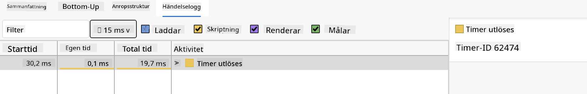

<!--
CO_OP_TRANSLATOR_METADATA:
{
  "original_hash": "f198c6b817b4b2a99749f4662e7cae98",
  "translation_date": "2025-08-26T22:43:15+00:00",
  "source_file": "5-browser-extension/3-background-tasks-and-performance/README.md",
  "language_code": "sv"
}
-->
# Webbläsartillägg Projekt Del 3: Lär dig om Bakgrundsuppgifter och Prestanda

## Förkunskapstest

[Förkunskapstest](https://ashy-river-0debb7803.1.azurestaticapps.net/quiz/27)

### Introduktion

I de två senaste lektionerna i denna modul lärde du dig att bygga ett formulär och ett visningsområde för data hämtad från ett API. Det är ett mycket vanligt sätt att skapa en webbnärvaro. Du lärde dig även att hantera asynkron datainhämtning. Ditt webbläsartillägg är nästan klart.

Det som återstår är att hantera några bakgrundsuppgifter, inklusive att uppdatera färgen på tilläggets ikon. Detta är ett utmärkt tillfälle att prata om hur webbläsaren hanterar denna typ av uppgifter. Låt oss tänka på dessa webbläsaruppgifter i kontexten av prestandan för dina webbresurser medan du bygger dem.

## Grundläggande om Webbprestanda

> "Webbplatsens prestanda handlar om två saker: hur snabbt sidan laddas och hur snabbt koden på den körs." -- [Zack Grossbart](https://www.smashingmagazine.com/2012/06/javascript-profiling-chrome-developer-tools/)

Ämnet om hur man gör sina webbplatser blixtsnabba på alla typer av enheter, för alla typer av användare, i alla typer av situationer, är föga förvånande omfattande. Här är några punkter att tänka på när du bygger antingen ett standardwebbprojekt eller ett webbläsartillägg.

Det första du behöver göra för att säkerställa att din webbplats fungerar effektivt är att samla in data om dess prestanda. Den första platsen att göra detta är i utvecklarverktygen i din webbläsare. I Edge kan du välja knappen "Inställningar och mer" (ikonen med tre prickar längst upp till höger i webbläsaren), sedan navigera till Fler verktyg > Utvecklarverktyg och öppna fliken Prestanda. Du kan också använda tangentbordsgenvägarna `Ctrl` + `Shift` + `I` på Windows eller `Option` + `Command` + `I` på Mac för att öppna utvecklarverktygen.

Fliken Prestanda innehåller ett profileringsverktyg. Öppna en webbplats (prova till exempel [https://www.microsoft.com](https://www.microsoft.com/?WT.mc_id=academic-77807-sagibbon)) och klicka på knappen "Spela in", uppdatera sedan sidan. Stoppa inspelningen när som helst, och du kommer att kunna se de rutiner som genereras för att 'skripta', 'rendera' och 'måla' sidan:



✅ Besök [Microsofts dokumentation](https://docs.microsoft.com/microsoft-edge/devtools-guide/performance/?WT.mc_id=academic-77807-sagibbon) om prestandapanelen i Edge.

> Tips: för att få en korrekt avläsning av din webbplats starttid, rensa webbläsarens cache.

Välj element i profiltidslinjen för att zooma in på händelser som inträffar medan din sida laddas.

Få en ögonblicksbild av din sidas prestanda genom att välja en del av profiltidslinjen och titta på sammanfattningspanelen:



Kontrollera händelseloggen för att se om någon händelse tog längre än 15 ms:



✅ Lär känna din profilerare! Öppna utvecklarverktygen på denna webbplats och se om det finns några flaskhalsar. Vilken resurs laddar långsammast? Vilken är snabbast?

## Profilkontroller

Generellt sett finns det några "problemområden" som varje webbutvecklare bör hålla koll på när de bygger en webbplats för att undvika obehagliga överraskningar när det är dags att distribuera till produktion.

**Resursstorlekar**: Webben har blivit "tyngre" och därmed långsammare under de senaste åren. En del av denna vikt beror på användningen av bilder.

✅ Titta igenom [Internetarkivet](https://httparchive.org/reports/page-weight) för en historisk översikt av sidvikt och mer.

En bra praxis är att säkerställa att dina bilder är optimerade och levereras i rätt storlek och upplösning för dina användare.

**DOM-traverseringar**: Webbläsaren måste bygga sitt Document Object Model baserat på koden du skriver, så det är i intresset av god sidprestanda att hålla dina taggar minimala och endast använda och styla det som sidan behöver. Till exempel kan överflödig CSS som är kopplad till en sida optimeras; stilar som bara behöver användas på en sida behöver inte inkluderas i huvudstilmallen.

**JavaScript**: Varje JavaScript-utvecklare bör hålla koll på "render-blocking"-skript som måste laddas innan resten av DOM kan traverseras och målas i webbläsaren. Överväg att använda `defer` med dina inline-skript (som görs i Terrarium-modulen).

✅ Testa några webbplatser på en [webbplatshastighetstest](https://www.webpagetest.org/) för att lära dig mer om de vanliga kontroller som görs för att avgöra webbplatsens prestanda.

Nu när du har en uppfattning om hur webbläsaren renderar de resurser du skickar till den, låt oss titta på de sista sakerna du behöver göra för att slutföra ditt tillägg:

### Skapa en funktion för att beräkna färg

Arbeta i `/src/index.js`, lägg till en funktion som heter `calculateColor()` efter serien av `const`-variabler som du ställer in för att få åtkomst till DOM:

```JavaScript
function calculateColor(value) {
	let co2Scale = [0, 150, 600, 750, 800];
	let colors = ['#2AA364', '#F5EB4D', '#9E4229', '#381D02', '#381D02'];

	let closestNum = co2Scale.sort((a, b) => {
		return Math.abs(a - value) - Math.abs(b - value);
	})[0];
	console.log(value + ' is closest to ' + closestNum);
	let num = (element) => element > closestNum;
	let scaleIndex = co2Scale.findIndex(num);

	let closestColor = colors[scaleIndex];
	console.log(scaleIndex, closestColor);

	chrome.runtime.sendMessage({ action: 'updateIcon', value: { color: closestColor } });
}
```

Vad händer här? Du skickar in ett värde (koldioxidintensiteten) från API-anropet du slutförde i förra lektionen, och sedan beräknar du hur nära dess värde är indexet som presenteras i färgarrayen. Sedan skickar du det närmaste färgvärdet vidare till Chrome-runtime.

Chrome.runtime har [ett API](https://developer.chrome.com/extensions/runtime) som hanterar alla typer av bakgrundsuppgifter, och ditt tillägg utnyttjar detta:

> "Använd chrome.runtime API för att hämta bakgrundssidan, returnera detaljer om manifestet och lyssna på och svara på händelser i appens eller tilläggets livscykel. Du kan också använda detta API för att konvertera relativa sökvägar för URL:er till fullständiga URL:er."

✅ Om du utvecklar detta webbläsartillägg för Edge kan det överraska dig att du använder ett Chrome-API. De nyare versionerna av Edge-webbläsaren körs på Chromium-webbläsarmotorn, så du kan utnyttja dessa verktyg.

> Observera, om du vill profilera ett webbläsartillägg, starta utvecklarverktygen från själva tillägget, eftersom det är en separat webbläsarinstans.

### Ställ in en standardfärg för ikonen

Nu, i funktionen `init()`, ställ in ikonen till att vara generiskt grön från början genom att återigen kalla på Chromes `updateIcon`-åtgärd:

```JavaScript
chrome.runtime.sendMessage({
	action: 'updateIcon',
		value: {
			color: 'green',
		},
});
```

### Anropa funktionen, utför anropet

Anropa sedan funktionen du just skapade genom att lägga till den i löftet som returneras av C02Signal API:

```JavaScript
//let CO2...
calculateColor(CO2);
```

Och slutligen, i `/dist/background.js`, lägg till lyssnaren för dessa bakgrundsåtgärdsanrop:

```JavaScript
chrome.runtime.onMessage.addListener(function (msg, sender, sendResponse) {
	if (msg.action === 'updateIcon') {
		chrome.browserAction.setIcon({ imageData: drawIcon(msg.value) });
	}
});
//borrowed from energy lollipop extension, nice feature!
function drawIcon(value) {
	let canvas = document.createElement('canvas');
	let context = canvas.getContext('2d');

	context.beginPath();
	context.fillStyle = value.color;
	context.arc(100, 100, 50, 0, 2 * Math.PI);
	context.fill();

	return context.getImageData(50, 50, 100, 100);
}
```

I denna kod lägger du till en lyssnare för alla meddelanden som skickas till bakgrundsuppgiftshanteraren. Om det kallas "updateIcon" körs nästa kod för att rita en ikon med rätt färg med hjälp av Canvas API.

✅ Du kommer att lära dig mer om Canvas API i [Space Game-lektionerna](../../6-space-game/2-drawing-to-canvas/README.md).

Nu, bygg om ditt tillägg (`npm run build`), uppdatera och starta ditt tillägg, och se färgen ändras. Är det dags att göra ett ärende eller diska? Nu vet du!

Grattis, du har byggt ett användbart webbläsartillägg och lärt dig mer om hur webbläsaren fungerar och hur man profilerar dess prestanda.

---

## 🚀 Utmaning

Undersök några öppna källkodssajter som har funnits länge, och baserat på deras GitHub-historik, se om du kan avgöra hur de har optimerats för prestanda genom åren, om alls. Vilken är den vanligaste flaskhalsen?

## Efterföreläsningstest

[Efterföreläsningstest](https://ashy-river-0debb7803.1.azurestaticapps.net/quiz/28)

## Granskning & Självstudier

Överväg att prenumerera på ett [prestandanyhetsbrev](https://perf.email/).

Undersök några av de sätt som webbläsare mäter webbprestanda genom att titta igenom prestandaflikarna i deras webbutvecklarverktyg. Hittar du några stora skillnader?

## Uppgift

[Analysera en webbplats för prestanda](assignment.md)

---

**Ansvarsfriskrivning**:  
Detta dokument har översatts med hjälp av AI-översättningstjänsten [Co-op Translator](https://github.com/Azure/co-op-translator). Även om vi strävar efter noggrannhet, bör du vara medveten om att automatiserade översättningar kan innehålla fel eller felaktigheter. Det ursprungliga dokumentet på dess ursprungliga språk bör betraktas som den auktoritativa källan. För kritisk information rekommenderas professionell mänsklig översättning. Vi ansvarar inte för eventuella missförstånd eller feltolkningar som uppstår vid användning av denna översättning.