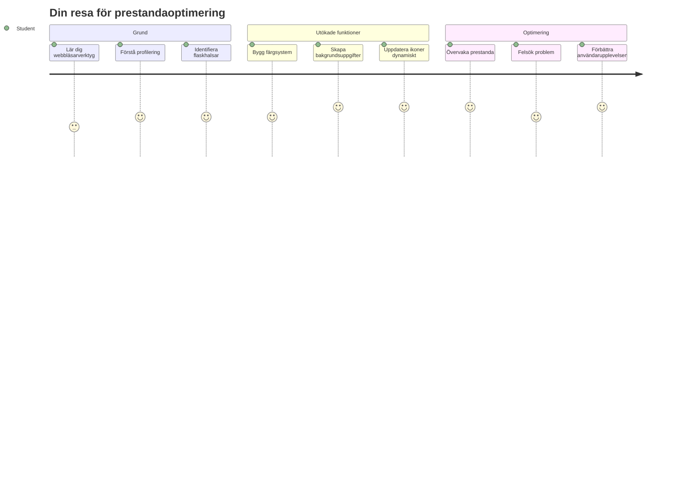
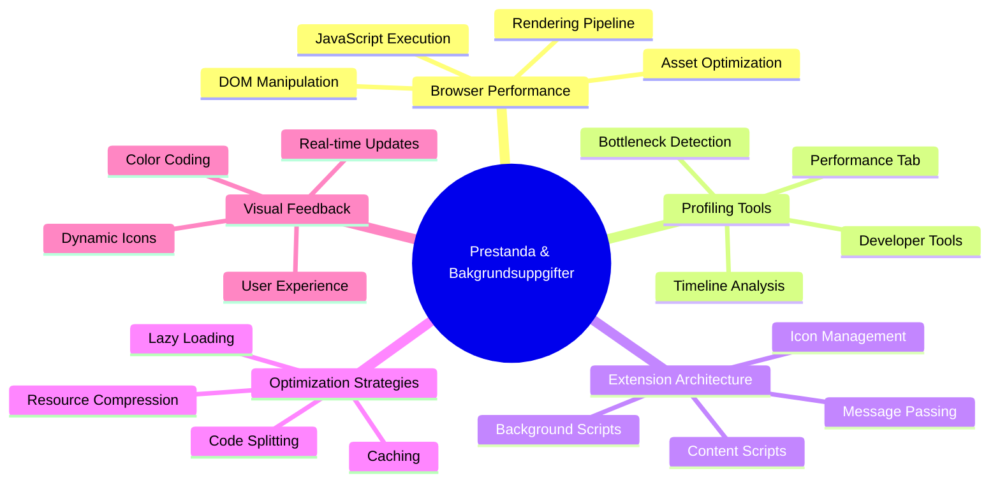
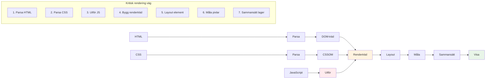
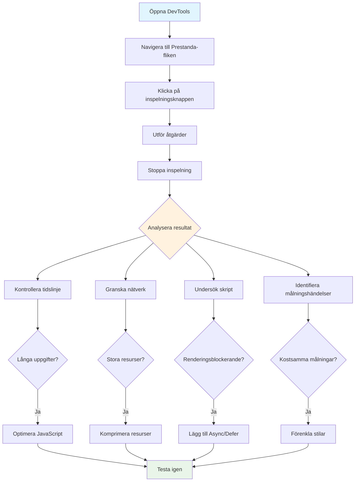
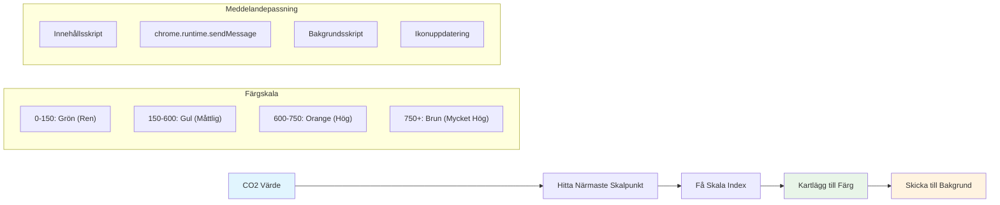
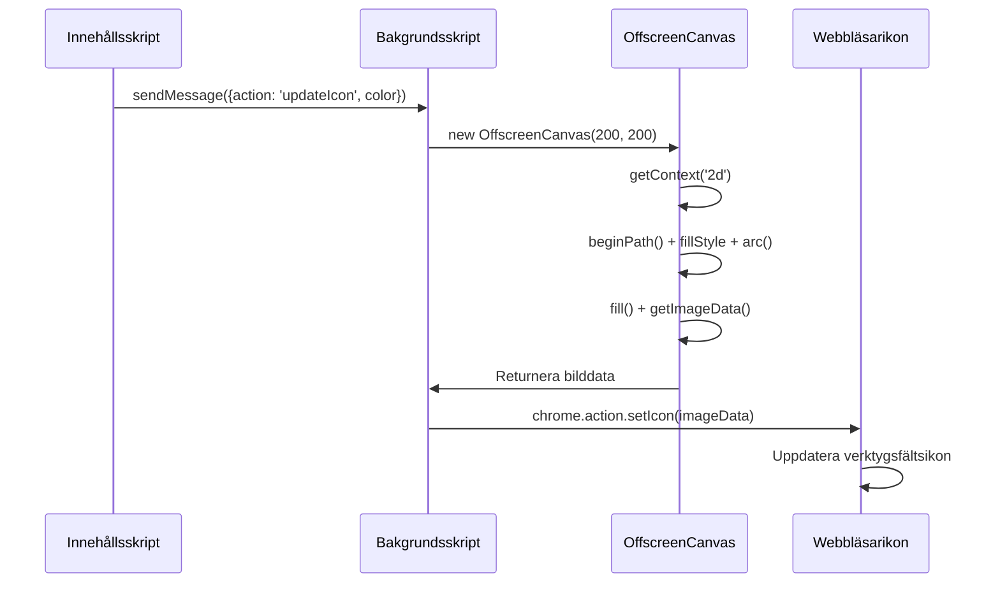
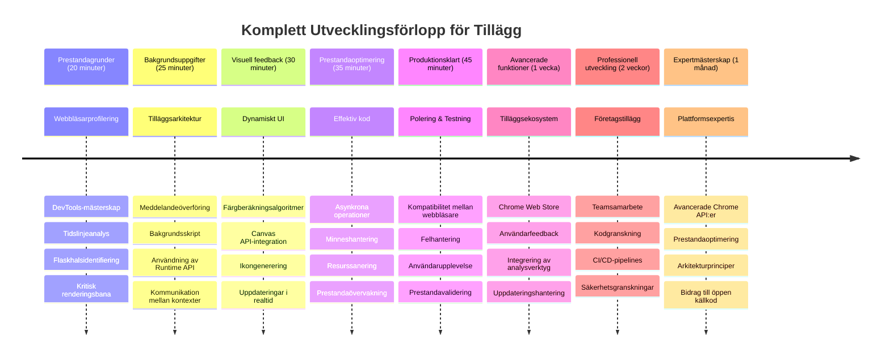

<!--
CO_OP_TRANSLATOR_METADATA:
{
  "original_hash": "b275fed2c6fc90d2b9b6661a3225faa2",
  "translation_date": "2026-01-06T22:56:33+00:00",
  "source_file": "5-browser-extension/3-background-tasks-and-performance/README.md",
  "language_code": "sv"
}
-->
# Browser Extension Project Del 3: Lär dig om Bakgrundsuppgifter och Prestanda


Har du någonsin undrat vad som gör att vissa webbläsartillägg känns snabba och responsiva medan andra verkar slöa? Hemligheten ligger i vad som händer bakom kulisserna. Medan användare klickar runt i ditt tilläggs gränssnitt finns en hel värld av bakgrundsprocesser som tyst hanterar datahämtning, ikonuppdateringar och systemresurser.

Detta är vår sista lektion i serien om webbläsartillägg, och vi ska få din koldioxidavtrycksspårare att fungera smidigt. Du kommer att lägga till dynamiska ikonuppdateringar och lära dig hur du upptäcker prestandaproblem innan de blir problem. Det är som att trimma en racerbils motor - små optimeringar kan göra en enorm skillnad i hur allt fungerar.

När vi är klara kommer du ha ett polerat tillägg och förstå de prestandaprinciper som skiljer bra webbappar från fantastiska. Nu dyker vi in i webbläsaroptimeringens värld.

## Förföreläsningsquiz

[Förföreläsningsquiz](https://ff-quizzes.netlify.app/web/quiz/27)

### Introduktion

I våra tidigare lektioner byggde du ett formulär, kopplade det till ett API och hanterade asynkron datahämtning. Ditt tillägg tar form fint.

Nu behöver vi lägga till den sista finishen – som att få tilläggsikonen att ändra färg baserat på koldioxiddata. Det påminner mig om hur NASA var tvungna att optimera varje system på Apollo-rymdfarkosten. De hade inte råd med några bortkastade cykler eller minne eftersom liv berodde på prestanda. Även om vårt webbläsartillägg inte är lika kritiskt, gäller samma principer – effektiv kod skapar bättre användarupplevelser.


## Grundläggande om Webbprestanda

När din kod körs effektivt kan folk faktiskt *känna* skillnaden. Du vet det ögonblick när en sida laddas omedelbart eller en animation flyter smidigt? Det är bra prestanda i arbete.

Prestanda handlar inte bara om hastighet – det handlar om att skapa webbupplevelser som känns naturliga istället för klumpiga och frustrerande. På datorns tidiga dagar höll Grace Hopper berömt en nanosekund (en bit tråd ungefär en fot lång) på sitt skrivbord för att visa hur långt ljuset färdas på en miljarddels sekund. Det var hennes sätt att förklara varför varje mikrosekund spelar roll i datorvärlden. Låt oss utforska detektivverktygen som hjälper dig fatta vad som saktar ner saker.

> "Webbplatsers prestanda handlar om två saker: hur snabbt sidan laddas, och hur snabbt koden på den körs." -- [Zack Grossbart](https://www.smashingmagazine.com/2012/06/javascript-profiling-chrome-developer-tools/)

Ämnet om hur man får sina webbplatser blixtsnabba på alla sorters enheter, för alla sorters användare, i alla möjliga situationer, är föga förvånande mycket omfattande. Här är några punkter att ha i åtanke när du bygger ett standard webbprojekt eller ett webbläsartillägg.

Det första steget i optimering av din sida är att förstå vad som faktiskt händer under huven. Lyckligtvis kommer din webbläsare med kraftfulla detektivverktyg inbyggda.


För att öppna utvecklarverktygen i Edge klickar du på de tre prickarna uppe till höger, gå sedan till Fler verktyg > Utvecklarverktyg. Eller använd kortkommandot: `Ctrl` + `Shift` + `I` på Windows eller `Option` + `Command` + `I` på Mac. När du är där, klicka på fliken Prestanda – det är här du gör din undersökning.

**Här är din prestandadetektivutrustning:**
- **Öppna** Utvecklarverktyg (du kommer använda dessa hela tiden som utvecklare!)
- **Gå** till fliken Prestanda – tänk på det som din webbapps träningsklocka
- **Tryck** på Spela in-knappen och se sidan i aktion
- **Studera** resultaten för att upptäcka vad som saktar ner

Låt oss prova. Öppna en webbplats (Microsoft.com fungerar bra för detta) och klicka på 'Spela in'-knappen. Uppdatera sidan och se hur profileraren fångar allt som händer. När du stoppar inspelningen ser du en detaljerad sammanställning av hur webbläsaren 'skriver skript', 'renderar' och 'målar' sidan. Det påminner om hur mission control övervakar varje system under en raketuppskjutning – du får realtidsdata på exakt vad som händer och när.


✅ [Microsoft Dokumentationen](https://docs.microsoft.com/microsoft-edge/devtools-guide/performance/?WT.mc_id=academic-77807-sagibbon) har massor mer detaljer om du vill fördjupa dig

> Proffs tipset: Rensa din webbläsares cache innan testning för att se hur din sida presterar för första gången besökare – det är oftast ganska annorlunda från återkommande besök!

Välj delar av profiler-tidslinjen för att zooma in på händelser som sker medan din sida laddas.

Få en ögonblicksbild av din sidas prestanda genom att välja en del av profiler-tidslinjen och titta i sammanfattningspanelen:


Kolla i Event Log-panelen för att se om något event tog längre än 15 ms:


✅ Lär känna din profiler! Öppna utvecklarverktygen på denna sida och se om det finns några flaskhalsar. Vad är den långsammaste tillgången att ladda? Den snabbaste?


## Vad du ska leta efter när du profilerar

Att köra profileraren är bara början – den riktiga färdigheten är att veta vad de där färgglada graferna faktiskt berättar för dig. Oroa dig inte, du kommer lära dig läsa dem. Erfarna utvecklare har lärt sig att upptäcka varningstecken innan de blir fullständiga problem.

Låt oss prata om de vanliga misstänkta – prestandabovarna som brukar smyga sig in i webbprojekt. Precis som Marie Curie noggrant kontrollerade strålningsnivåer i sitt labb, måste vi hålla koll på vissa mönster som signalerar problem på gång. Att fånga dessa tidigt kommer spara dig (och dina användare) mycket frustration.

**Tillgångsstorlekar**: Webbplatser har blivit "tyngre" genom åren, och mycket av den extra vikten kommer från bilder. Det är som om vi packat alltmer i våra digitala resväskor.

✅ Kolla in [Internet Archive](https://httparchive.org/reports/page-weight) för att se hur sidornas storlek vuxit över tid – det är ganska avslöjande.

**Så här håller du tillgångarna optimerade:**
- **Komprimera** bilderna! Moderna format som WebP kan drastiskt minska filstorlekar
- **Servera** rätt bildstorlek för varje enhet – inga jättestora skrivbordsbilder till mobiler
- **Minifiera** din CSS och JavaScript – varje byte räknas
- **Använd** lazy loading så bilder bara laddas när användare faktiskt scrollar till dem

**DOM-traverseringar**: Webbläsaren måste bygga sitt Dokumentobjektsmodell baserat på koden du skriver, så det är till fördel för sidans prestanda att hålla dina taggar minimala, använda och styla bara det som sidan behöver. I detta avseende kan överflödig CSS associerad med en sida optimeras; stilar som bara behövs för en sida behöver inte inkluderas i huvudstilmallen, till exempel.

**Nyckelstrategier för DOM-optimering:**
- **Minimerar** antalet HTML-element och nästlingsnivåer
- **Tar bort** oanvända CSS-regler och konsoliderar stilmallar effektivt
- **Organiserar** CSS för att bara ladda det som behövs för varje sida
- **Strukturerar** HTML semantiskt för bättre webbläsartolkning

**JavaScript**: Varje JavaScript-utvecklare bör vaka över 'render-blocking'-skript som måste laddas innan resten av DOM kan traverseras och renderas i webbläsaren. Överväg att använda `defer` med dina inline-skript (såsom i Terrarium-modulen).

**Moderna JavaScript-optimeringstekniker:**
- **Använder** `defer`-attributet för att ladda skript efter DOM-tolkning
- **Implementerar** kodsplittring för att ladda bara nödvändig JavaScript
- **Tillämpa** lazy loading för icke-kritisk funktionalitet
- **Minimerar** användning av tunga bibliotek och ramverk när det är möjligt

✅ Testa några sidor på en [Site Speed Test website](https://www.webpagetest.org/) för att lära dig mer om vanliga kontroller som görs för att bedöma webbplatsens prestanda.

### 🔄 **Pedagogisk Kontrollpunkt**
**Prestandaförståelse**: Innan du bygger tilläggsfunktioner, säkerställ att du kan:
- ✅ Förklara den kritiska renderingsvägen från HTML till pixlar
- ✅ Identifiera vanliga prestandaflaskhalsar i webbapplikationer
- ✅ Använda webbläsarens utvecklarverktyg för att profilera sidprestanda
- ✅ Förstå hur tillgångsstorlek och DOM-komplexitet påverkar hastighet

**Snabb Självtest**: Vad händer när du har render-blocking JavaScript?
*Svar: Webbläsaren måste ladda ner och exekvera skriptet innan den kan fortsätta tolka HTML och rendera sidan*

**Verklig prestandapåverkan**:
- **100 ms fördröjning**: Användare märker avmattningen
- **1 sekunds fördröjning**: Användarna börjar tappa fokus
- **3+ sekunder**: 40% av användarna lämnar sidan
- **Mobila nätverk**: Prestanda betyder ännu mer

Nu när du har en idé om hur webbläsaren renderar tillgångarna du skickar, låt oss titta på de sista sakerna du behöver göra för att slutföra ditt tillägg:

### Skapa en funktion för att räkna ut färg

Nu skapar vi en funktion som omvandlar numeriska data till meningsfulla färger. Tänk på det som ett trafikljussystem – grönt för ren energi, rött för hög koldioxidintensitet.

Denna funktion tar CO2-data från vårt API och avgör vilken färg som bäst representerar miljöpåverkan. Det påminner om hur forskare använder färgkodning i värmekartor för att visualisera komplexa datamönster – från havstemperaturer till stjärnbildning. Lägg till detta i `/src/index.js`, precis efter de `const`-variabler vi tidigare satte upp:


```javascript
function calculateColor(value) {
	// Definiera CO2-intensitetsskala (gram per kWh)
	const co2Scale = [0, 150, 600, 750, 800];
	// Motsvarande färger från grönt (rent) till mörkbrunt (högt kolinnehåll)
	const colors = ['#2AA364', '#F5EB4D', '#9E4229', '#381D02', '#381D02'];

	// Hitta det närmaste skalvärdet till vår input
	const closestNum = co2Scale.sort((a, b) => {
		return Math.abs(a - value) - Math.abs(b - value);
	})[0];
	
	console.log(`${value} is closest to ${closestNum}`);
	
	// Hitta index för färgkartläggning
	const num = (element) => element > closestNum;
	const scaleIndex = co2Scale.findIndex(num);

	const closestColor = colors[scaleIndex];
	console.log(scaleIndex, closestColor);

	// Skicka färguppdateringsmeddelande till bakgrundsskriptet
	chrome.runtime.sendMessage({ action: 'updateIcon', value: { color: closestColor } });
}
```

**Låt oss bryta ner denna smarta lilla funktion:**
- **Sätter upp** två arrayer – en för CO2-nivåer, en annan för färger (grönt = rent, brunt = smutsigt!)
- **Hittar** närmaste match till vårt verkliga CO2-värde med hjälp av smart arraysortering
- **Tar** färgen med samma index via findIndex()-metoden
- **Skickar** ett meddelande till Chromes bakgrundsskript med vår valda färg
- **Använder** mallliteraler (de där backticks) för renare strängformatering
- **Håller** allt organiserat med const-deklarationer

`chrome.runtime` [API](https://developer.chrome.com/extensions/runtime) är som nervsystemet i ditt tillägg – det hanterar all bakom kulisserna-kommunikation och uppgifter:

> "Använd chrome.runtime API för att hämta bakgrundssidan, få detaljer om manifestet, och lyssna på och svara på händelser i appens eller tilläggets livscykel. Du kan också använda detta API för att konvertera relativa URL-vägar till fullständigt kvalificerade URL:er."

**Varför Chrome Runtime API är så praktiskt:**
- **Låter** olika delar av tillägget prata med varandra
- **Hanterar** bakgrundsarbete utan att frysa användargränssnittet
- **Sköter** tilläggets livscykelhändelser
- **Gör** meddelandeutbyte mellan skript supersmidigt

✅ Om du utvecklar detta webbläsartillägg för Edge, kan det överraska dig att du använder ett chrome-API. Nyare Edge-versioner körs på Chromium-motorn, så du kan utnyttja dessa verktyg.


> **Proffs-tips**: Vill du profilera ett webbläsartillägg, starta utvecklarverktygen från tillägget självt, eftersom det är en egen separat webbläsarinstans. Detta ger dig tillgång till tilläggsspecifika prestandamått.

### Sätt en standardikonfärg

Innan vi börjar hämta riktiga data, låt oss ge vårt tillägg en startpunkt. Ingen gillar att stirra på en tom eller trasig ikon. Vi börjar med en grön färg så användarna vet att tillägget fungerar från det ögonblick det installeras.

I din `init()`-funktion, ställ in den gröna standardikonen:

```javascript
chrome.runtime.sendMessage({
	action: 'updateIcon',
	value: {
		color: 'green',
	},
});
```

**Vad denna initialisering åstadkommer:**
- **Sätter** en neutral grön färg som standardläge
- **Ger** omedelbar visuell återkoppling när tillägget laddas
- **Etablerar** kommunikationsmönstret med bakgrundsskriptet
- **Säkerställer** att användare ser ett fungerande tillägg innan data laddas

### Anropa funktionen, kör anropet

Nu kopplar vi ihop allt så att när färsk CO2-data kommer in, uppdateras din ikon automatiskt med rätt färg. Det är som att koppla den sista kretsen i en elektronisk enhet – plötsligt fungerar alla komponenter som ett system.

Lägg till denna rad precis efter att du fått CO2-datan från API:et:

```javascript
// Efter att ha hämtat CO2-data från API:et
// låt CO2 = data.data[0].intensity.actual;
calculateColor(CO2);
```

**Denna integration uppnår:**
- **Kopplar** API-datans flöde med det visuella indikatorsystemet
- **Trigger** ikonuppdateringar automatiskt när nya data anländer
- **Säkerställer** realtidsvisuell återkoppling baserat på aktuell koldioxidintensitet
- **Behåller** separationen av ansvar mellan datahämtning och visningslogik

Och slutligen, i `/dist/background.js`, lägg till lyssnaren för dessa bakgrundsåtgärdssamtal:

```javascript
// Lyssna efter meddelanden från innehållsskriptet
chrome.runtime.onMessage.addListener(function (msg, sender, sendResponse) {
	if (msg.action === 'updateIcon') {
		chrome.action.setIcon({ imageData: drawIcon(msg.value) });
	}
});

// Rita en dynamisk ikon med Canvas API
// Lånat från energy lollipop-tillägget - trevlig funktion!
function drawIcon(value) {
	// Skapa en offscreen-canvas för bättre prestanda
	const canvas = new OffscreenCanvas(200, 200);
	const context = canvas.getContext('2d');

	// Rita en färgad cirkel som representerar kolintensitet
	context.beginPath();
	context.fillStyle = value.color;
	context.arc(100, 100, 50, 0, 2 * Math.PI);
	context.fill();

	// Returnera bilddata för webbläsarikonen
	return context.getImageData(50, 50, 100, 100);
}
```

**Detta bakgrundsskript gör:**
- **Lyssnar** efter meddelanden från ditt huvudsakliga skript (som en receptionist som tar emot samtal)
- **Bearbetar** de där 'updateIcon'-begärandena för att ändra din verktygsradsikon
- **Skapar** nya ikoner på språng med Canvas API
- **Ritar** en enkel färgad cirkel som visar aktuell koldioxidintensitet
- **Uppdaterar** din webbläsarverktygsrad med den färska ikonen
- **Använder** OffscreenCanvas för smidig prestanda (ingen UI-blockering)

✅ Du kommer lära dig mer om Canvas API i [Space Game-lektionerna](../../6-space-game/2-drawing-to-canvas/README.md).


### 🔄 **Pedagogisk Kontrollpunkt**
**Fullständig Tilläggsförståelse**: Verifiera din kunskap om hela systemet:
- ✅ Hur fungerar meddelandeutbyte mellan olika tilläggsskript?
- ✅ Varför använder vi OffscreenCanvas istället för vanlig Canvas för prestanda?
- ✅ Vilken roll spelar Chrome Runtime API i extension-arkitekturen?
- ✅ Hur kartlägger färgberekningsalgoritmen data till visuell återkoppling?

**Prestandahänsyn**: Din extension visar nu:
- **Effektiv meddelandehantering**: Ren kommunikation mellan skriptkontexter
- **Optimerad rendering**: OffscreenCanvas förhindrar UI-blockering
- **Uppdateringar i realtid**: Dynamiska ikonändringar baserade på levande data
- **Minneshantering**: Korrekt städning och resursbokning

**Dags att testa din extension:**
- **Bygg** allt med `npm run build`
- **Ladda om** din extension i webbläsaren (glöm inte detta steg)
- **Öppna** din extension och se ikonen ändra färger
- **Kontrollera** hur den svarar på verkliga CO2-data från hela världen

Nu vet du på ett ögonblick om det är en bra tid att köra tvätten eller om du ska vänta på renare energi. Du har precis byggt något verkligt användbart och lärt dig om webbläsarprestanda på vägen.

## GitHub Copilot Agent Challenge 🚀

Använd Agent-läget för att slutföra följande utmaning:

**Beskrivning:** Förbättra webbläsartilläggets prestandaövervakningsmöjligheter genom att lägga till en funktion som spårar och visar laddningstider för olika komponenter i tillägget.

**Uppmaning:** Skapa ett system för prestandaövervakning för webbläsartillägget som mäter och loggar tiden det tar att hämta CO2-data från API:et, beräkna färger och uppdatera ikonen. Lägg till en funktion som heter `performanceTracker` som använder Performance API för att mäta dessa operationer och visar resultaten i webbläsarkonsolen med tidsstämplar och varaktighetsmått.

Läs mer om [agent mode](https://code.visualstudio.com/blogs/2025/02/24/introducing-copilot-agent-mode) här.

## 🚀 Utmaning

Här är ett intressant detektivuppdrag: välj några open source-webbplatser som funnits i många år (tänk Wikipedia, GitHub eller Stack Overflow) och gräv i deras commit-historik. Kan du hitta var de gjorde prestandaförbättringar? Vilka problem dök upp om och om igen?

**Din undersökningsmetod:**
- **Sök** i commit-meddelanden efter ord som "optimize", "performance" eller "faster"
- **Titta** efter mönster – rättar de ständigt samma typer av problem?
- **Identifiera** de vanligaste orsakerna till att webbplatser blir långsamma
- **Dela** vad du upptäcker – andra utvecklare lär sig av verkliga exempel

## Post-Lecture Quiz

[Post-lecture quiz](https://ff-quizzes.netlify.app/web/quiz/28)

## Återblick & Självstudier

Överväg att prenumerera på ett [prestandanyhetsbrev](https://perf.email/)

Undersök några av de sätt webbläsare mäter webbprestanda genom att titta i prestandaflikarna i deras utvecklarverktyg. Ser du några stora skillnader?

### ⚡ **Vad du kan göra på 5 minuter**
- [ ] Öppna webbläsarens Task Manager (Shift+Esc i Chrome) för att se extensionens resursanvändning
- [ ] Använd DevTools fliken Performance för att spela in och analysera webbsidans prestanda
- [ ] Kolla webbläsarens Extensions-sida för att se vilka tillägg som påverkar uppstartstiden
- [ ] Testa att tillfälligt inaktivera tillägg för att se prestandaskillnader

### 🎯 **Vad du kan åstadkomma under denna timme**
- [ ] Gör post-lesson-quizen och förstå prestandakoncept
- [ ] Implementera ett bakgrundsskript för din webbläsarextension
- [ ] Lär dig använda browser.alarms för effektiva bakgrundsuppgifter
- [ ] Öva på meddelandehantering mellan innehållsskript och bakgrundsskript
- [ ] Mät och optimera din extensions resursanvändning

### 📅 **Din veckolånga prestandaresa**
- [ ] Skapa en högpresterande webbläsarextension med bakgrundsfunktionalitet
- [ ] Bemästra service workers och modern extensionsarkitektur
- [ ] Implementera effektiv datasynkronisering och cache-strategier
- [ ] Lär dig avancerade felsökningstekniker för extension-prestanda
- [ ] Optimera din extension både för funktionalitet och resurseffektivitet
- [ ] Skapa omfattande tester för extension-prestandascenarier

### 🌟 **Din månadsvisa optimeringsmästerskap**
- [ ] Bygg enterprise-grade webbläsarextensioner med optimal prestanda
- [ ] Lär dig om Web Workers, Service Workers och modern webbprestanda
- [ ] Bidra till open source-projekt med fokus på prestandaoptimering
- [ ] Bemästra webbläsarens interna funktioner och avancerade felsökningsmetoder
- [ ] Skapa verktyg för prestandaövervakning och guider för bästa praxis
- [ ] Bli en prestandaexpert som hjälper till att optimera webbtillämpningar

## 🎯 Din masterplan för webbläsarextension


### 🛠️ Din kompletta toolkit för extensionutveckling

Efter att ha slutfört denna trilogi behärskar du nu:
- **Webbläsararkitektur**: Djup förståelse för hur extensions integreras med webbläsarsystem
- **Prestandaprofilering**: Förmåga att identifiera och åtgärda flaskhalsar med utvecklarverktyg
- **Asynkron programmering**: Moderna JavaScript-mönster för responsiva, icke-blockerande operationer
- **API-integration**: Extern datahämtning med autentisering och felhantering
- **Visuell design**: Dynamiska UI-uppdateringar och grafikgenerering baserad på Canvas
- **Meddelandeflöde**: Kommunikation mellan skript i extensionsarkitekturer
- **Användarupplevelse**: Laddningstillstånd, felhantering och intuitiva interaktioner
- **Produktionstekniker**: Testning, felsökning och optimering för verklig användning

**Användningsområden i verkliga projekt**: Ditt extensionsutvecklingskunnande gäller direkt för:
- **Progressiva webbappar**: Liknande arkitektur och prestandamönster
- **Electron-skrivbordsappar**: Plattformoberoende appar med webtekniker
- **Mobila hybridappar**: Cordova/PhoneGap-utveckling med web APIs
- **Enterprise webbapplikationer**: Komplexa dashboards och produktivitetsverktyg
- **Chrome DevTools-tillägg**: Avancerade utvecklarverktyg och felsökning
- **Web API-integration**: Alla applikationer som kommunicerar med externa tjänster

**Professionell påverkan**: Nu kan du:
- **Bygga** produktionsfärdiga webbläsarextensioner från idé till lansering
- **Optimera** webbapplikationers prestanda med branschstandard verktyg
- **Konstruera** skalbara system med korrekt ansvarsfördelning
- **Felsöka** komplexa asynkrona operationer och kommunikation mellan kontexter
- **Bidra** till open source extension-projekt och webbläsarstandarder

**Nya karriärmöjligheter**:
- **Chrome Web Store-utvecklare**: Publicera tillägg för miljontals användare
- **Webbprestandaingenjör**: Specialisera dig på optimering och användarupplevelse
- **Webbläsarplattformutvecklare**: Bidra till webbläsarmotorns utveckling
- **Utvecklingsramverksbyggare**: Skapa verktyg som hjälper andra utvecklare
- **Utvecklarkommunikation**: Dela kunskap genom undervisning och content creation

🌟 **Uppnåelse låst upp**: Du har byggt en komplett, fungerande webbläsarextension som visar professionella utvecklingsrutiner och moderna webbstandarder!

## Uppgift

[Analysera en webbplats för prestanda](assignment.md)

---

<!-- CO-OP TRANSLATOR DISCLAIMER START -->
**Ansvarsfriskrivning**:
Detta dokument har översatts med hjälp av AI-översättningstjänsten [Co-op Translator](https://github.com/Azure/co-op-translator). Även om vi strävar efter noggrannhet, vänligen var medveten om att automatiska översättningar kan innehålla fel eller felaktigheter. Det ursprungliga dokumentet på dess modersmål bör betraktas som den auktoritativa källan. För kritisk information rekommenderas professionell human översättning. Vi ansvarar inte för några missförstånd eller feltolkningar som uppstår vid användning av denna översättning.
<!-- CO-OP TRANSLATOR DISCLAIMER END -->