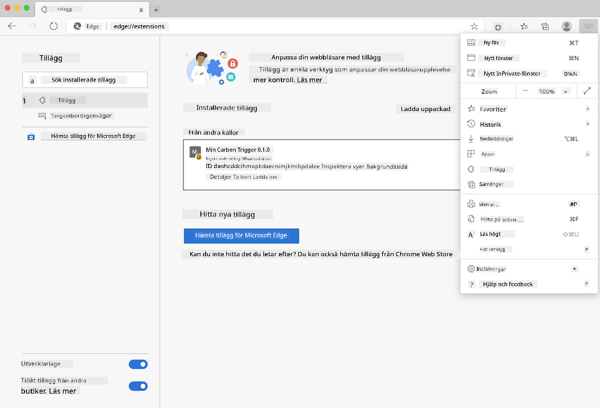

<!--
CO_OP_TRANSLATOR_METADATA:
{
  "original_hash": "dd58ae1b7707034f055718c1b68bc8de",
  "translation_date": "2025-08-26T22:48:00+00:00",
  "source_file": "5-browser-extension/solution/translation/README.hi.md",
  "language_code": "sv"
}
-->
# Carbon Trigger Browser Extension: Färdig kod

Användning av tmrow:s C02 Signal API för att spåra elförbrukning, bygga en webbläsartillägg som påminner dig om hur tungt elförbrukningen är i ditt område direkt i din webbläsare. Genom att använda detta tillägg kan du fatta beslut om dina aktiviteter baserat på denna information.


## Kom igång

Du behöver [npm](https://npmjs.com) installerat. Ladda ner en kopia av denna kod till en mapp på din dator.

Installera alla nödvändiga paket:

```
npm install
```

Bygg tillägget med webpack:

```
npm run build
```

För att installera på Edge, använd "tre prickar"-menyn i det övre högra hörnet av webbläsaren för att hitta tilläggspanelen. Därifrån, välj "Ladda uppackat" för att ladda ett nytt tillägg. Öppna mappen "dist" vid prompten, och tillägget kommer att laddas. För att använda det behöver du en API-nyckel för CO2 Signal ([få den via e-post här](https://www.co2signal.com/) - ange din e-post i rutan på den sidan) och [koden för ditt område](http://api.electricitymap.org/v3/zones) från [Electricity Map](https://www.electricitymap.org/map) (till exempel, i Boston använder jag "US-NEISO").



När API-nyckeln och området har matats in i tilläggets gränssnitt, bör den färgade pricken i webbläsartilläggsfältet ändras för att återspegla energiförbrukningen i ditt område och ge dig en indikator på vilka energiintensiva aktiviteter som är lämpliga att utföra. Konceptet bakom detta "prick"-system inspirerades av [Energy Lollipop Extension](https://energylollipop.com/) för Kaliforniens utsläpp.

---

**Ansvarsfriskrivning**:  
Detta dokument har översatts med hjälp av AI-översättningstjänsten [Co-op Translator](https://github.com/Azure/co-op-translator). Även om vi strävar efter noggrannhet, bör du vara medveten om att automatiserade översättningar kan innehålla fel eller inexaktheter. Det ursprungliga dokumentet på dess originalspråk bör betraktas som den auktoritativa källan. För kritisk information rekommenderas professionell mänsklig översättning. Vi ansvarar inte för eventuella missförstånd eller feltolkningar som uppstår vid användning av denna översättning.