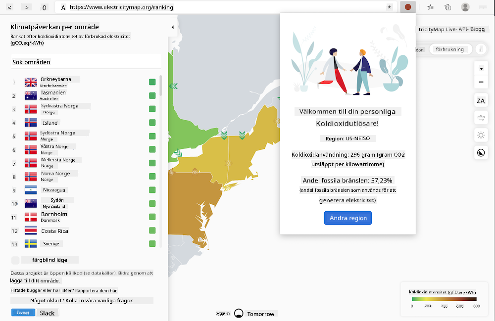

<!--
CO_OP_TRANSLATOR_METADATA:
{
  "original_hash": "3f5e6821e0febccfc5d05e7c944d9e3d",
  "translation_date": "2025-08-26T22:51:10+00:00",
  "source_file": "5-browser-extension/solution/translation/README.ja.md",
  "language_code": "sv"
}
-->
# Carbon Trigger-webbläsartillägg: Färdig kod

Bygg ett webbläsartillägg som använder tmrow:s CO2 Signal API för att spåra din elförbrukning och visa hur mycket energi som används i ditt område som en påminnelse direkt i webbläsaren. Genom att använda detta tillägg kan du fatta beslut om dina aktiviteter baserat på denna information.



## Kom igång

Du måste ha [npm](https://npmjs.com) installerat. Ladda ner en kopia av koden till en mapp på din dator.

Installera alla nödvändiga paket.

```
npm install
```

Bygg tillägget med webpack.

```
npm run build
```

För att installera det i Edge, hitta "Tillägg"-panelen via "tre prickar"-menyn längst upp till höger i webbläsaren. Välj "Load Unpacked" och ladda det nya tillägget. När du blir ombedd, öppna "dist"-mappen så laddas tillägget. För att använda det behöver du en API-nyckel för CO2 Signal API ([få en här via e-post](https://www.co2signal.com/) - ange din e-post i rutan på sidan) och en [kod för din region](http://api.electricitymap.org/v3/zones) som stöds av [Electricity Map](https://www.electricitymap.org/map) (för Boston, till exempel, använd 'US-NEISO').


När du har angett API-nyckeln och regionen i tilläggets gränssnitt, kommer en färgad prick att visas i webbläsarens tilläggsfält. Denna prick ändrar färg baserat på energiförbrukningen i ditt område och hjälper dig att avgöra vilka aktiviteter som är lämpliga att utföra beroende på energibehovet. Konceptet med detta "prick"-system inspirerades av [Energy Lollipop extension](https://energylollipop.com/) för utsläpp i Kalifornien.

---

**Ansvarsfriskrivning**:  
Detta dokument har översatts med hjälp av AI-översättningstjänsten [Co-op Translator](https://github.com/Azure/co-op-translator). Även om vi strävar efter noggrannhet, bör det noteras att automatiserade översättningar kan innehålla fel eller brister. Det ursprungliga dokumentet på dess originalspråk bör betraktas som den auktoritativa källan. För kritisk information rekommenderas professionell mänsklig översättning. Vi ansvarar inte för eventuella missförstånd eller feltolkningar som kan uppstå vid användning av denna översättning.