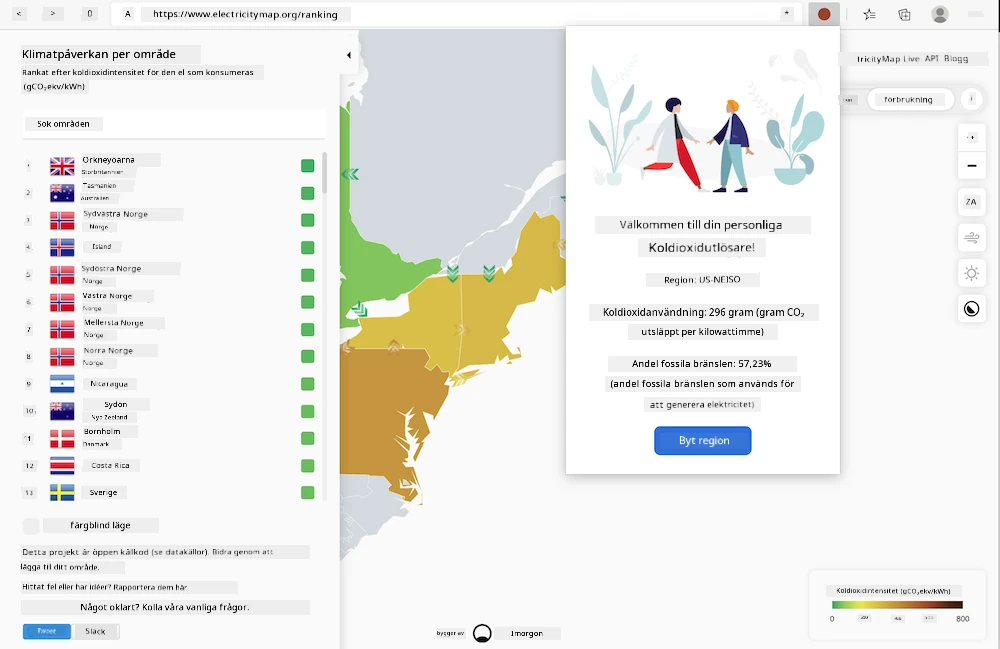
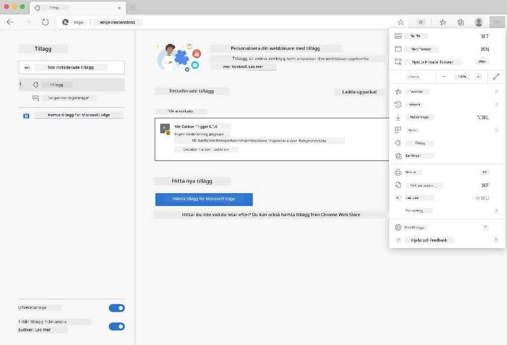

<!--
CO_OP_TRANSLATOR_METADATA:
{
  "original_hash": "21b364c158c8e4f698de65eeac16c9fe",
  "translation_date": "2025-08-26T22:48:46+00:00",
  "source_file": "5-browser-extension/solution/translation/README.ms.md",
  "language_code": "sv"
}
-->
# Carbon Trigger Webbläsartillägg: Komplett Kod

Använd API:n för CO2-signal från tmrow för att övervaka elförbrukning och skapa ett webbläsartillägg som varnar dig om hur tung elförbrukningen är i din region. Genom att använda detta tillägg kan du fatta mer informerade beslut om dina aktiviteter baserat på denna information.



## Kom igång här

Du behöver installera [npm](https://npmjs.com). Ladda ner en kopia av denna kod till en mapp på din dator.

Installera alla nödvändiga paket:

```
npm install
```

Bygg tillägget med webpack:

```
npm run build
```

För att installera i Edge, använd menyn med 'tre punkter' i det övre högra hörnet av webbläsaren för att hitta panelen Tillägg. Därifrån väljer du 'Ladda uppackat' för att ladda det nya tillägget. Öppna mappen 'dist' när du blir ombedd, och tillägget kommer att laddas. För att använda det behöver du en API-nyckel för CO2-signalens API ([skaffa en här via e-post](https://www.co2signal.com/) - ange din e-post i rutan på den här sidan) och [koden för din region](http://api.electricitymap.org/v3/zones) som motsvarar [Electricity Map](https://www.electricitymap.org/map) (i Boston, till exempel, använder jag 'US-NEISO').



När API-nyckeln och regionen har angetts i tilläggets gränssnitt, kommer en färgad punkt i webbläsarens tilläggsfält att ändras för att återspegla din regions energiförbrukning och ge dig vägledning om vilka energikrävande aktiviteter som är lämpliga att utföra. Konceptet bakom detta 'punkt'-system inspirerades av [Energy Lollipop-webbläsartillägget](https://energylollipop.com/) för Kaliforniens utsläpp.

---

**Ansvarsfriskrivning**:  
Detta dokument har översatts med hjälp av AI-översättningstjänsten [Co-op Translator](https://github.com/Azure/co-op-translator). Även om vi strävar efter noggrannhet, bör du vara medveten om att automatiska översättningar kan innehålla fel eller felaktigheter. Det ursprungliga dokumentet på dess ursprungliga språk bör betraktas som den auktoritativa källan. För kritisk information rekommenderas professionell mänsklig översättning. Vi ansvarar inte för eventuella missförstånd eller feltolkningar som uppstår vid användning av denna översättning.