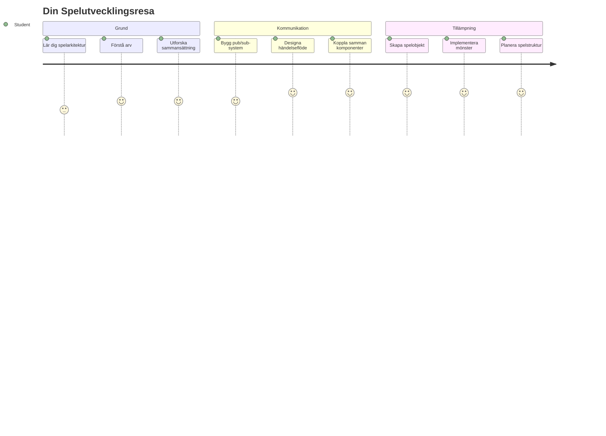
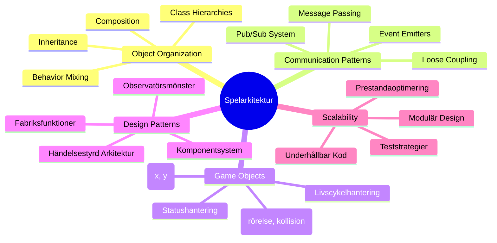
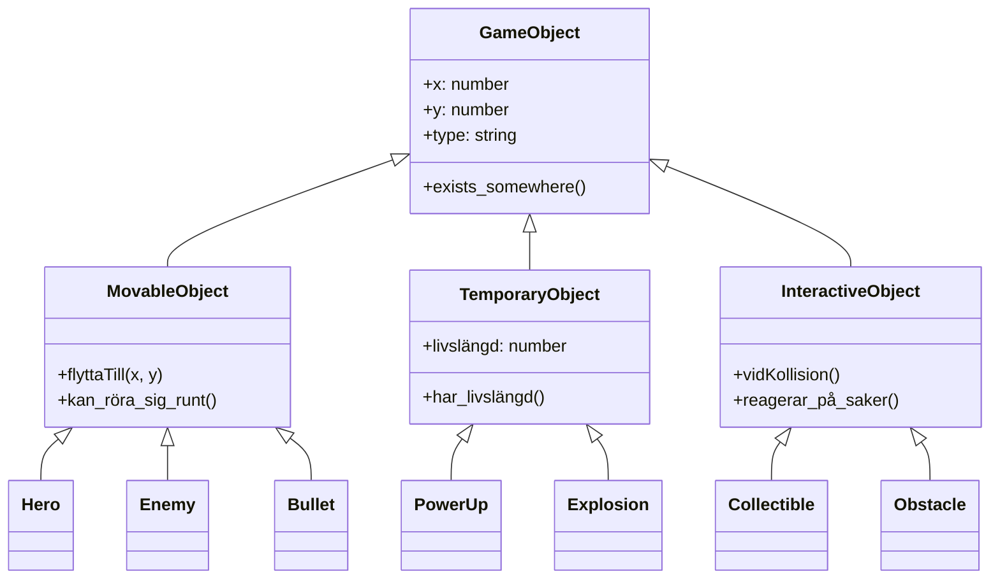
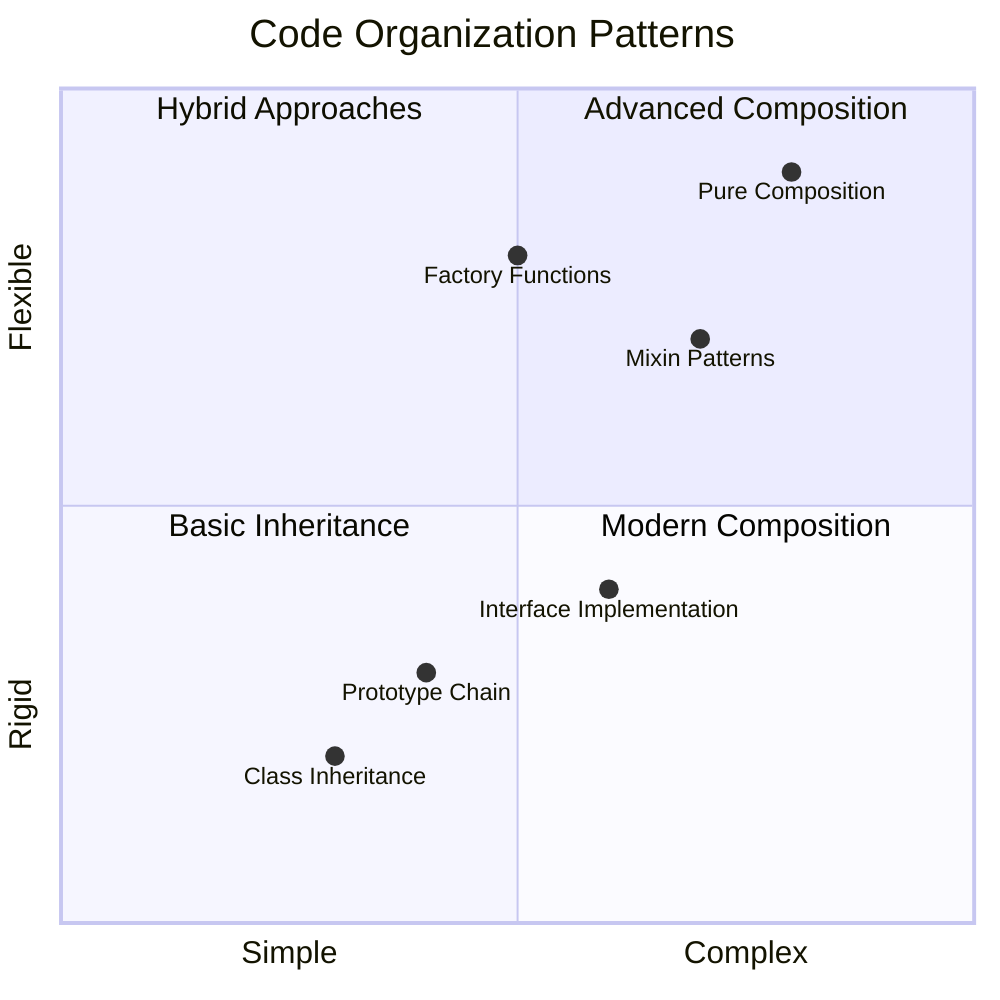
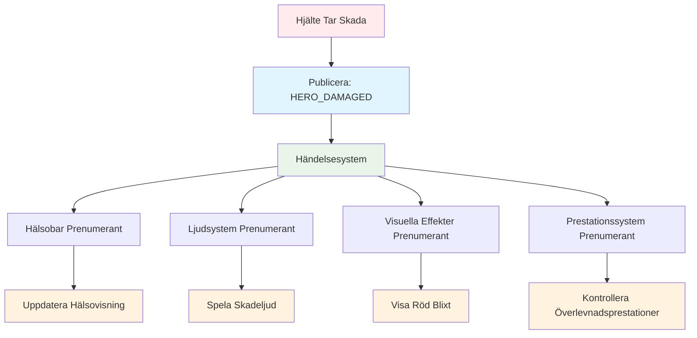
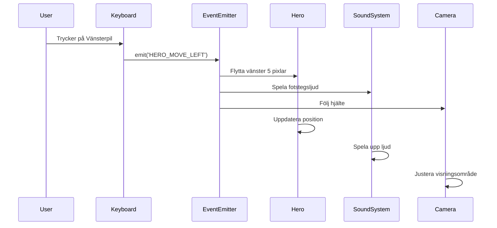
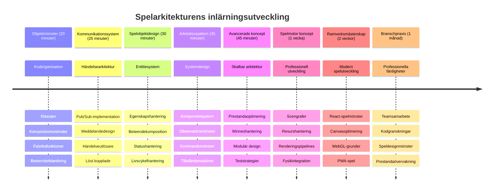

<!--
CO_OP_TRANSLATOR_METADATA:
{
  "original_hash": "a6332a7bb4d0be3bfd24199c83993777",
  "translation_date": "2026-01-06T22:51:51+00:00",
  "source_file": "6-space-game/1-introduction/README.md",
  "language_code": "sv"
}
-->
# Skapa ett rymdspel Del 1: Introduktion




Precis som NASAs kontrollcenter samordnar flera system under en rymduppskjutning, ska vi bygga ett rymdspel som visar hur olika delar av ett program kan samarbeta sömlöst. Medan vi skapar något du faktiskt kan spela kommer du att lära dig viktiga programmeringskoncept som gäller för alla mjukvaruprojekt.

Vi kommer att utforska två grundläggande tillvägagångssätt för att organisera kod: arv och komposition. Det är inte bara akademiska begrepp – det är samma mönster som driver allt från videospel till banksystem. Vi kommer också att implementera ett kommunikationssystem som kallas pub/sub som fungerar som kommunikationsnätverk som används i rymdfarkoster, vilket tillåter olika komponenter att dela information utan att skapa beroenden.

I slutet av denna serie kommer du att förstå hur man bygger applikationer som kan skalas och utvecklas – oavsett om du utvecklar spel, webbapplikationer eller andra mjukvarusystem.


## Quiz före föreläsning

[Quiz före föreläsning](https://ff-quizzes.netlify.app/web/quiz/29)

## Arv och komposition i spelutveckling

När projekt växer i komplexitet blir kodorganisation kritisk. Det som börjar som ett enkelt skript kan bli svårt att underhålla utan rätt struktur – precis som Apollo-uppdragen krävde noggrann koordinering mellan tusentals komponenter.

Vi kommer att utforska två grundläggande tillvägagångssätt för att organisera kod: arv och komposition. Varje har tydliga fördelar, och att förstå båda hjälper dig att välja rätt tillvägagångssätt för olika situationer. Vi kommer att demonstrera dessa koncept genom vårt rymdspel där hjältar, fiender, power-ups och andra objekt måste interagera effektivt.

✅ En av de mest berömda programmeringsböckerna någonsin handlar om [designmönster](https://en.wikipedia.org/wiki/Design_Patterns).

I vilket spel som helst har du `spelsobjekt` – de interaktiva elementen som fyller din spelvärld. Hjältar, fiender, power-ups och visuella effekter är alla spelsobjekt. Varje objekt finns på specifika skärmpositioner med hjälp av `x` och `y` värden, likt att plotta punkter på ett koordinatsystem.

Trots sina visuella skillnader delar dessa objekt ofta grundläggande beteenden:

- **De finns någonstans** – Varje objekt har x- och y-koordinater så spelet vet var det ska ritas upp
- **Många kan röra sig** – Hjältar springer, fiender jagar, kulor flyger över skärmen
- **De har en livslängd** – Vissa finns kvar för alltid, andra (som explosioner) visas kort och försvinner
- **De reagerar på saker** – När saker kolliderar, samlas power-ups in, hälsobarer uppdateras

✅ Tänk på ett spel som Pac-Man. Kan du identifiera de fyra objekttyperna som listas ovan i detta spel?


### Att uttrycka beteende genom kod

Nu när du förstår de gemensamma beteenden som spelsobjekt delar, låt oss utforska hur vi implementerar dessa beteenden i JavaScript. Du kan uttrycka objektbeteende genom metoder kopplade antingen till klasser eller individuella objekt, och det finns flera tillvägagångssätt att välja mellan.

**Klassbaserat tillvägagångssätt**

Klasser och arv ger en strukturerad metod för att organisera spelsobjekt. Precis som det taxonomiska klassificeringssystem som utvecklades av Carl Linnaeus börjar du med en basklass som innehåller gemensamma egenskaper, sedan skapar du specialiserade klasser som ärver dessa grundläggande värden samtidigt som de lägger till specifika funktioner.

✅ Arv är ett viktigt koncept att förstå. Läs mer i [MDNs artikel om arv](https://developer.mozilla.org/docs/Web/JavaScript/Inheritance_and_the_prototype_chain).

Så här kan du implementera spelsobjekt med hjälp av klasser och arv:

```javascript
// Steg 1: Skapa basklassen GameObject
class GameObject {
  constructor(x, y, type) {
    this.x = x;
    this.y = y;
    this.type = type;
  }
}
```

**Låt oss bryta ner detta steg för steg:**
- Vi skapar en grundmall som varje spelsobjekt kan använda
- Konstruktorn sparar var objektet finns (`x`, `y`) och vilken typ det är
- Detta blir grunden som alla dina spelsobjekt bygger på

```javascript
// Steg 2: Lägg till rörelseförmåga genom arv
class Movable extends GameObject {
  constructor(x, y, type) {
    super(x, y, type); // Anropa föräldrakonstruktorn
  }

  // Lägg till möjligheten att flytta till en ny position
  moveTo(x, y) {
    this.x = x;
    this.y = y;
  }
}
```

**I ovanstående har vi:**
- **Utökat** GameObject-klassen för att lägga till rörelsefunktionalitet
- **Anropat** föräldrakonstruktorn med `super()` för att initiera ärvda egenskaper
- **Lagt till** en `moveTo()`-metod som uppdaterar objektets position

```javascript
// Steg 3: Skapa specifika spelobjektstyper
class Hero extends Movable {
  constructor(x, y) {
    super(x, y, 'Hero'); // Ställ in typ automatiskt
  }
}

class Tree extends GameObject {
  constructor(x, y) {
    super(x, y, 'Tree'); // Träd behöver inte rörelse
  }
}

// Steg 4: Använd dina spelobjekt
const hero = new Hero(0, 0);
hero.moveTo(5, 5); // Hjälten kan röra sig!

const tree = new Tree(10, 15);
// tree.moveTo() skulle orsaka ett fel - träd kan inte röra sig
```

**Att förstå dessa koncept:**
- **Skapar** specialiserade objekttyper som ärver lämpliga beteenden
- **Visar** hur arv möjliggör selektiv inkludering av funktioner
- **Visar** att hjältar kan röra sig medan träd står stilla
- **Illustrerar** hur klasshierarkin förhindrar olämpliga åtgärder

✅ Ta några minuter att tänka om en Pac-Man hjälte (Inky, Pinky eller Blinky, till exempel) och hur den skulle skrivas i JavaScript.

**Kompositionsmetoden**

Komposition följer en modulär designfilosofi, liknande hur ingenjörer designar rymdfarkoster med utbytbara komponenter. Istället för att ärva från en föräldraklass kombinerar du specifika beteenden för att skapa objekt med exakt den funktionalitet de behöver. Detta tillvägagångssätt erbjuder flexibilitet utan rigida hierarkiska begränsningar.

```javascript
// Steg 1: Skapa basbeteendeobjekt
const gameObject = {
  x: 0,
  y: 0,
  type: ''
};

const movable = {
  moveTo(x, y) {
    this.x = x;
    this.y = y;
  }
};
```

**Det här gör koden:**
- **Definierar** ett bas-`gameObject` med position och typ-egenskaper
- **Skapar** ett separat `movable` beteendeobjekt med rörelsefunktionalitet
- **Separera** ansvar genom att hålla positionsdata och rörelselogik oberoende

```javascript
// Steg 2: Sätt ihop objekt genom att kombinera beteenden
const movableObject = { ...gameObject, ...movable };

// Steg 3: Skapa fabrikfunktioner för olika objekttyper
function createHero(x, y) {
  return {
    ...movableObject,
    x,
    y,
    type: 'Hero'
  };
}

function createStatic(x, y, type) {
  return {
    ...gameObject,
    x,
    y,
    type
  };
}
```

**I ovanstående har vi:**
- **Kombinerat** basobjektets egenskaper med rörelsebeteende med hjälp av spridningssyntax
- **Skapat** fabriksfunktioner som returnerar anpassade objekt
- **Möjliggjort** flexibel objektskapning utan rigida klasshierarkier
- **Tillåtit** objekt att ha exakt de beteenden de behöver

```javascript
// Steg 4: Skapa och använd dina sammansatta objekt
const hero = createHero(10, 10);
hero.moveTo(5, 5); // Fungerar perfekt!

const tree = createStatic(0, 0, 'Tree');
// tree.moveTo() är odefinierad - ingen rörelsebeteende har satts ihop
```

**Viktiga punkter att komma ihåg:**
- **Komponerar** objekt genom att blanda beteenden istället för att ärva dem
- **Ger** mer flexibilitet än rigida arvshierarkier
- **Tillåter** objekt att ha exakt de funktioner de behöver
- **Använder** modern JavaScript spridningssyntax för ren objektkombination
```

**Which Pattern Should You Choose?**

**Which Pattern Should You Choose?**



> 💡 **Proffstips**: Båda mönstren har sin plats i modern JavaScript-utveckling. Klasser fungerar bra för tydligt definierade hierarkier, medan komposition lyser när du behöver maximal flexibilitet.
> 
**När du använder varje tillvägagångssätt:**
- **Välj** arv när du har tydliga "är-en" relationer (en Hjälte *är-en* Flyttbar objekt)
- **Välj** komposition när du har "har-en" relationer (en Hjälte *har* rörelseförmågor)
- **Tänk på** ditt teams preferenser och projektkrav
- **Kom ihåg** att du kan blanda båda tillvägagångssätten i samma applikation

### 🔄 **Pedagogisk kontroll**
**Förståelse för objektorganisation**: Innan vi går vidare till kommunikationsmönster, se till att du kan:
- ✅ Förklara skillnaden mellan arv och komposition
- ✅ Identifiera när du ska använda klasser kontra fabriksfunktioner
- ✅ Förstå hur nyckelordet `super()` fungerar vid arv
- ✅ Känna igen fördelarna med varje tillvägagångssätt för spelutveckling

**Snabb Självtest**: Hur skulle du skapa en Flygande Fiende som både kan röra sig och flyga?
- **Arvsperspektiv**: `class FlyingEnemy extends Movable`
- **Kompositionsperspektiv**: `{ ...movable, ...flyable, ...gameObject }`

**Verklig koppling**: Dessa mönster finns överallt:
- **React-komponenter**: Props (komposition) vs klassarv
- **Spelmotorer**: Entity-component-system använder komposition
- **Mobilappar**: UI-ramverk använder ofta arvshierarkier

## Kommunikationsmönster: Pub/Sub-systemet

När applikationer blir komplexa blir hantering av kommunikation mellan komponenter utmanande. Publicera/abonnera-mönstret (pub/sub) löser detta problem med principer liknande radioutsändning – en sändare kan nå flera mottagare utan att veta vem som lyssnar.

Tänk på vad som händer när en hjälte tar skada: hälsobar uppdateras, ljudeffekter spelas, visuell feedback visas. Istället för att koppla hjälteobjektet direkt till dessa system, tillåter pub/sub att hjälten sänder ett meddelande om "tagit skada". Alla system som behöver reagera kan prenumerera på denna meddelandetyp och reagera därefter.

✅ **Pub/Sub** står för 'publish-subscribe'


### Förstå pub/sub-arkitekturen

Pub/sub-mönstret håller olika delar av din applikation löst kopplade, vilket betyder att de kan samarbeta utan att vara direkt beroende av varandra. Denna separation gör din kod mer underhållbar, testbar och flexibel för förändringar.

**Nyckelaktörerna i pub/sub:**
- **Meddelanden** – Enkla textetiketter som `'PLAYER_SCORED'` som beskriver vad som hände (plus eventuell extra info)
- **Publicerare** – De objekt som ropar ut "Något hände!" till alla som lyssnar
- **Prenumeranter** – De objekt som säger "Jag bryr mig om den händelsen" och reagerar när den händer
- **Eventsystem** – Mellanhänder som ser till att meddelandena når rätt lyssnare

### Skapa ett eventsystem

Låt oss skapa ett enkelt men kraftfullt eventsystem som demonstrerar dessa koncept:

```javascript
// Steg 1: Skapa EventEmitter-klassen
class EventEmitter {
  constructor() {
    this.listeners = {}; // Spara alla händelselyssnare
  }
  
  // Registrera en lyssnare för en specifik meddelandetyp
  on(message, listener) {
    if (!this.listeners[message]) {
      this.listeners[message] = [];
    }
    this.listeners[message].push(listener);
  }
  
  // Skicka ett meddelande till alla registrerade lyssnare
  emit(message, payload = null) {
    if (this.listeners[message]) {
      this.listeners[message].forEach(listener => {
        listener(message, payload);
      });
    }
  }
}
```

**Bryter ner vad som händer här:**
- **Skapar** ett centralt eventhanteringssystem med hjälp av en enkel klass
- **Sparar** lyssnare i ett objekt organiserat efter meddelandetyp
- **Registrerar** nya lyssnare med `on()`-metoden
- **Sänder** meddelanden till alla intresserade lyssnare med `emit()`
- **Stöder** valfria datapaket för att skicka relevant information

### Sätta ihop allt: Ett praktiskt exempel

Okej, låt oss se detta i praktiken! Vi bygger ett enkelt rörelsesystem som visar hur rent och flexibelt pub/sub kan vara:

```javascript
// Steg 1: Definiera dina meddelandetyper
const Messages = {
  HERO_MOVE_LEFT: 'HERO_MOVE_LEFT',
  HERO_MOVE_RIGHT: 'HERO_MOVE_RIGHT',
  ENEMY_SPOTTED: 'ENEMY_SPOTTED'
};

// Steg 2: Skapa ditt händelsesystem och dina spelobjekt
const eventEmitter = new EventEmitter();
const hero = createHero(0, 0);
```

**Det här gör koden:**
- **Definierar** ett konstanter-objekt för att undvika stavfel i meddelanden
- **Skapar** en instans av EventEmitter som hanterar all kommunikation
- **Initierar** ett hjälteobjekt på startpositionen

```javascript
// Steg 3: Ställ in händelselyssnare (prenumeranter)
eventEmitter.on(Messages.HERO_MOVE_LEFT, () => {
  hero.moveTo(hero.x - 5, hero.y);
  console.log(`Hero moved to position: ${hero.x}, ${hero.y}`);
});

eventEmitter.on(Messages.HERO_MOVE_RIGHT, () => {
  hero.moveTo(hero.x + 5, hero.y);
  console.log(`Hero moved to position: ${hero.x}, ${hero.y}`);
});
```

**I ovanstående har vi:**
- **Registrerat** eventlyssnare som svarar på rörelse-meddelanden
- **Uppdaterat** hjältes position baserat på rörelseriktning
- **Lagt till** konsolloggning för att spåra hjältes positionsändringar
- **Separera** rörelselogiken från inputhanteringen

```javascript
// Steg 4: Koppla tangentbordsinmatning till händelser (publicister)
window.addEventListener('keydown', (event) => {
  switch(event.key) {
    case 'ArrowLeft':
      eventEmitter.emit(Messages.HERO_MOVE_LEFT);
      break;
    case 'ArrowRight':
      eventEmitter.emit(Messages.HERO_MOVE_RIGHT);
      break;
  }
});
```

**Förstå dessa koncept:**
- **Kopplar** tangentbordsinput till spelevent utan tajt koppling
- **Gör det möjligt** för inputs att kommunicera med spelsobjekt indirekt
- **Tillåter** flera system att reagera på samma knapptryckningar
- **Gör det enkelt** att ändra knappbindningar eller lägga till nya inputmetoder


> 💡 **Proffstips**: Skönheten med detta mönster är flexibiliteten! Du kan enkelt lägga till ljudeffekter, skärm-skakning eller partikeleffekter genom att bara lägga till fler eventlyssnare – ingen ändring i befintlig tangentbords- eller rörelsekod behövs.
> 
**Det här är varför du kommer att älska detta tillvägagångssätt:**
- Det blir superlätt att lägga till nya funktioner – bara lyssna på de event du bryr dig om
- Flera saker kan reagera på samma event utan att störa varandra
- Testning blir mycket enklare eftersom varje del fungerar självständigt
- När något går fel vet du exakt var du ska titta

### Varför pub/sub skalar bra

Pub/sub-mönstret bibehåller enkelhet när applikationer växer i komplexitet. Oavsett om du hanterar tiotals fiender, dynamiska UI-uppdateringar eller ljussystem, hanterar mönstret ökad skala utan att ändra arkitekturen. Nya funktioner integreras i det befintliga eventsystemet utan att påverka etablerad funktionalitet.

> ⚠️ **Vanligt misstag**: Skapa inte för många specifika meddelandetyper tidigt. Börja med breda kategorier och förfina dem när ditt spelbehov blir tydligare.
> 
**Bästa praxis att följa:**
- **Gruppera** relaterade meddelanden i logiska kategorier
- **Använda** beskrivande namn som tydligt visar vad som hände
- **Hålla** meddelandepayloads enkla och fokuserade
- **Dokumentera** dina meddelandetyper för samarbete i teamet

### 🔄 **Pedagogisk kontroll**
**Förståelse för händelsedriven arkitektur**: Verifiera din förståelse av hela systemet:
- ✅ Hur förhindrar pub/sub mönstret tajt koppling mellan komponenter?
- ✅ Varför är det lättare att lägga till nya funktioner med händelsedriven arkitektur?
- ✅ Vilken roll spelar EventEmitter i kommunikationsflödet?
- ✅ Hur förhindrar meddelandekonstanter buggar och förbättrar underhållet?

**Designutmaning**: Hur skulle du hantera dessa spelscenarier med pub/sub?
1. **Fiende dör**: Uppdatera poäng, spela ljud, skapa power-up, ta bort från skärmen
2. **Nivå slutförd**: Stoppa musik, visa UI, spara framsteg, ladda nästa nivå
3. **Power-up insamlad**: Förbättra förmågor, uppdatera UI, spela effekt, starta timer

**Professionell koppling**: Detta mönster finns i:
- **Frontend-ramverk**: React/Vue event-system
- **Backend-tjänster**: Mikroservice-kommunikation
- **Spelmotorer**: Unitys event-system
- **Mobilutveckling**: iOS/Android notifikationssystem

---

## GitHub Copilot Agent Challenge 🚀

Använd Agent-läget för att slutföra följande utmaning:

**Beskrivning:** Skapa ett enkelt spelsystem som använder både arv och pub/sub-mönstret. Du kommer att implementera ett grundläggande spel där olika objekt kan kommunicera genom event utan att känna till varandra direkt.

**Uppgift:** Skapa ett JavaScript-spelsystem med följande krav: 1) Skapa en bas-GameObject-klass med x, y-koordinater och en typ-egenskap. 2) Skapa en Hero-klass som ärver från GameObject och kan röra sig. 3) Skapa en Enemy-klass som ärver från GameObject och kan jaga hjälten. 4) Implementera en EventEmitter-klass för pub/sub-mönstret. 5) Sätt upp eventlyssnare så att när hjälten rör sig får närliggande fiender ett 'HERO_MOVED'-event och uppdaterar sin position för att röra sig mot hjälten. Inkludera console.log-utskrifter för att visa kommunikationen mellan objekten.

Lär dig mer om [agent-läget](https://code.visualstudio.com/blogs/2025/02/24/introducing-copilot-agent-mode) här.

## 🚀 Utmaning
Tänk på hur pub-sub-mönstret kan förbättra spelarkitekturen. Identifiera vilka komponenter som bör sända ut händelser och hur systemet ska reagera. Designa ett spelkoncept och kartlägg kommunikationsmönstren mellan dess komponenter.

## Post-Lecture Quiz

[Post-lecture quiz](https://ff-quizzes.netlify.app/web/quiz/30)

## Review & Self Study

Lär dig mer om Pub/Sub genom att [läsa om det](https://docs.microsoft.com/azure/architecture/patterns/publisher-subscriber/?WT.mc_id=academic-77807-sagibbon).

### ⚡ **Vad du kan göra under de närmaste 5 minuterna**
- [ ] Öppna ett HTML5-spel online och inspektera dess kod med DevTools
- [ ] Skapa ett enkelt HTML5 Canvas-element och rita en grundläggande form
- [ ] Prova att använda `setInterval` för att skapa en enkel animationsslinga
- [ ] Utforska Canvas API-dokumentationen och prova en ritmetod

### 🎯 **Vad du kan åstadkomma under denna timme**
- [ ] Avsluta post-lesson quiz och förstå spelutvecklingskoncept
- [ ] Sätt upp din spelprojektstruktur med HTML, CSS och JavaScript-filer
- [ ] Skapa en grundläggande spelloop som kontinuerligt uppdaterar och renderar
- [ ] Rita dina första spelfigurer på canvas
- [ ] Implementera grundläggande laddning av resurser för bilder och ljud

### 📅 **Din veckolånga spelskapande**
- [ ] Slutför hela rymdspelet med alla planerade funktioner
- [ ] Lägg till polerade grafik, ljudeffekter och smidiga animationer
- [ ] Implementera spelstater (startskärm, spelomgång, game over)
- [ ] Skapa ett poängsystem och spårning av spelarens framsteg
- [ ] Gör ditt spel responsivt och tillgängligt på olika enheter
- [ ] Dela ditt spel online och samla feedback från spelare

### 🌟 **Din månadslånga spelutveckling**
- [ ] Bygg flera spel som utforskar olika genrer och mekaniker
- [ ] Lär dig ett spelutvecklingsramverk som Phaser eller Three.js
- [ ] Bidra till open source-spelutvecklingsprojekt
- [ ] Bemästra avancerade programmeringsmönster och optimering för spel
- [ ] Skapa en portfolio som visar dina spelutvecklingsfärdigheter
- [ ] Mentor andra som är intresserade av spelutveckling och interaktiv media

## 🎯 Din tidslinje för spelutvecklingsmästerskap


### 🛠️ Sammanfattning av din spelarkitektur-verktygslåda

Efter att ha genomfört denna lektion har du nu:
- **Mästerskap i designmönster**: Förståelse för arv kontra kompositionsavvägningar
- **Händelsedriven arkitektur**: Pub/sub-implementation för skalbar kommunikation
- **Objektorienterad design**: Klasshierarkier och beteendekomposition
- **Modern JavaScript**: Factory-funktioner, spridningssyntax och ES6+ mönster
- **Skalbar Arkitektur**: Lös koppling och modulära designprinciper
- **Grundläggande spelutveckling**: Entitiesystem och komponentmönster
- **Professionella mönster**: Industri-standard för kodorganisation

**Verkliga tillämpningar**: Dessa mönster används direkt i:
- **Frontend-ramverk**: React/Vue komponentarkitektur och tillståndshantering
- **Backend-tjänster**: Mikrotjänstkommunikation och händelsestyrda system
- **Mobilutveckling**: iOS/Android apparkitektur och notifieringssystem
- **Spelmotorer**: Unity, Unreal och webbaserad spelutveckling
- **Företagsprogramvara**: Event sourcing och distribuerad systemdesign
- **API-design**: RESTful-tjänster och realtidskommunikation

**Professionella färdigheter du har fått**: Du kan nu:
- **Designa** skalbara mjukvaruarkitekturer med beprövade mönster
- **Implementera** händelsedrivna system som hanterar komplexa interaktioner
- **Välja** lämpliga kodorganisationsstrategier för olika scenarier
- **Felsöka** och underhålla lös-kopplade system effektivt
- **Kommunicera** tekniska beslut med industristandardterminologi

**Nästa nivå**: Du är redo att implementera dessa mönster i ett riktigt spel, utforska avancerade spelutvecklingsteman eller tillämpa dessa arkitekturkoncept på webbapplikationer!

🌟 **Uppnått mål**: Du har behärskat grundläggande mjukvaruarkitektur-mönster som driver allt från enkla spel till komplexa företagsystem!

## Assignment

[Mock up a game](assignment.md)

---

<!-- CO-OP TRANSLATOR DISCLAIMER START -->
**Ansvarsfriskrivning**:
Detta dokument har översatts med hjälp av AI-översättningstjänsten [Co-op Translator](https://github.com/Azure/co-op-translator). Även om vi strävar efter noggrannhet, vänligen observera att automatiska översättningar kan innehålla fel eller brister. Det ursprungliga dokumentet på dess ursprungsspråk bör betraktas som den auktoritativa källan. För kritisk information rekommenderas professionell mänsklig översättning. Vi ansvarar inte för några missförstånd eller feltolkningar som uppstår vid användning av denna översättning.
<!-- CO-OP TRANSLATOR DISCLAIMER END -->