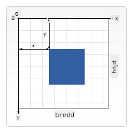

<!--
CO_OP_TRANSLATOR_METADATA:
{
  "original_hash": "056641280211e52fd0adb81b6058ec55",
  "translation_date": "2025-08-29T07:55:10+00:00",
  "source_file": "6-space-game/2-drawing-to-canvas/README.md",
  "language_code": "sv"
}
-->
# Bygg ett rymdspel del 2: Rita hjälte och monster på Canvas

## Quiz före föreläsning

[Quiz före föreläsning](https://ff-quizzes.netlify.app/web/quiz/31)

## Canvas

Canvas är ett HTML-element som som standard inte har något innehåll; det är en tom yta. Du måste lägga till innehåll genom att rita på det.

✅ Läs [mer om Canvas API](https://developer.mozilla.org/docs/Web/API/Canvas_API) på MDN.

Så här deklareras det vanligtvis, som en del av sidans body:

```html
<canvas id="myCanvas" width="200" height="100"></canvas>
```

Ovan ställer vi in `id`, `width` och `height`.

- `id`: sätt detta så att du kan få en referens när du behöver interagera med det.
- `width`: detta är elementets bredd.
- `height`: detta är elementets höjd.

## Rita enkel geometri

Canvas använder ett kartesiskt koordinatsystem för att rita saker. Det använder alltså en x-axel och en y-axel för att uttrycka var något är placerat. Platsen `0,0` är det övre vänstra hörnet och det nedre högra hörnet är det som du har angett som bredden och höjden på canvasen.


> Bild från [MDN](https://developer.mozilla.org/docs/Web/API/Canvas_API/Tutorial/Drawing_shapes)

För att rita på canvas-elementet behöver du gå igenom följande steg:

1. **Få en referens** till Canvas-elementet.
2. **Få en referens** till Context-elementet som ligger på Canvas-elementet.
3. **Utför en ritoperation** med hjälp av Context-elementet.

Koden för ovanstående steg ser vanligtvis ut så här:

```javascript
// draws a red rectangle
//1. get the canvas reference
canvas = document.getElementById("myCanvas");

//2. set the context to 2D to draw basic shapes
ctx = canvas.getContext("2d");

//3. fill it with the color red
ctx.fillStyle = 'red';

//4. and draw a rectangle with these parameters, setting location and size
ctx.fillRect(0,0, 200, 200) // x,y,width, height
```

✅ Canvas API fokuserar mest på 2D-former, men du kan också rita 3D-element på en webbsida; för detta kan du använda [WebGL API](https://developer.mozilla.org/docs/Web/API/WebGL_API).

Du kan rita alla möjliga saker med Canvas API, som:

- **Geometriska former**, vi har redan visat hur man ritar en rektangel, men det finns mycket mer du kan rita.
- **Text**, du kan rita text med valfritt typsnitt och färg.
- **Bilder**, du kan rita en bild baserat på en bildresurs som en .jpg eller .png till exempel.

✅ Testa! Du vet hur man ritar en rektangel, kan du rita en cirkel på en sida? Ta en titt på några intressanta Canvas-ritningar på CodePen. Här är ett [särskilt imponerande exempel](https://codepen.io/dissimulate/pen/KrAwx).

## Ladda och rita en bildresurs

Du laddar en bildresurs genom att skapa ett `Image`-objekt och ställa in dess `src`-egenskap. Sedan lyssnar du på `load`-händelsen för att veta när den är redo att användas. Koden ser ut så här:

### Ladda resurs

```javascript
const img = new Image();
img.src = 'path/to/my/image.png';
img.onload = () => {
  // image loaded and ready to be used
}
```

### Mönster för att ladda resurs

Det rekommenderas att omsluta ovanstående i en konstruktion som denna, så att det blir enklare att använda och du bara försöker manipulera den när den är helt laddad:

```javascript
function loadAsset(path) {
  return new Promise((resolve) => {
    const img = new Image();
    img.src = path;
    img.onload = () => {
      // image loaded and ready to be used
      resolve(img);
    }
  })
}

// use like so

async function run() {
  const heroImg = await loadAsset('hero.png')
  const monsterImg = await loadAsset('monster.png')
}

```

För att rita spelresurser på en skärm skulle din kod se ut så här:

```javascript
async function run() {
  const heroImg = await loadAsset('hero.png')
  const monsterImg = await loadAsset('monster.png')

  canvas = document.getElementById("myCanvas");
  ctx = canvas.getContext("2d");
  ctx.drawImage(heroImg, canvas.width/2,canvas.height/2);
  ctx.drawImage(monsterImg, 0,0);
}
```

## Nu är det dags att börja bygga ditt spel

### Vad du ska bygga

Du ska bygga en webbsida med ett Canvas-element. Det ska visa en svart skärm `1024*768`. Vi har försett dig med två bilder:

- Hjälteskepp

   

- 5*5 monster

   

### Rekommenderade steg för att börja utvecklingen

Leta upp filerna som har skapats åt dig i undermappen `your-work`. Den bör innehålla följande:

```bash
-| assets
  -| enemyShip.png
  -| player.png
-| index.html
-| app.js
-| package.json
```

Öppna en kopia av denna mapp i Visual Studio Code. Du behöver ha en lokal utvecklingsmiljö inställd, helst med Visual Studio Code med NPM och Node installerat. Om du inte har `npm` installerat på din dator, [så här gör du det](https://www.npmjs.com/get-npm).

Starta ditt projekt genom att navigera till mappen `your_work`:

```bash
cd your-work
npm start
```

Ovanstående kommer att starta en HTTP-server på adressen `http://localhost:5000`. Öppna en webbläsare och ange den adressen. Det är en tom sida just nu, men det kommer att ändras.

> Obs: för att se ändringar på skärmen, uppdatera din webbläsare.

### Lägg till kod

Lägg till den nödvändiga koden i `your-work/app.js` för att lösa följande:

1. **Rita** en canvas med svart bakgrund  
   > tips: lägg till två rader under lämplig TODO i `/app.js`, där du ställer in `ctx`-elementet till svart och topp/vänster-koordinaterna till 0,0 samt höjden och bredden till att motsvara canvasens.
2. **Ladda** texturer  
   > tips: lägg till spelare och fiendebilder med hjälp av `await loadTexture` och ange bildens sökväg. Du kommer inte att se dem på skärmen än!
3. **Rita** hjälten i mitten av skärmen i den nedre halvan  
   > tips: använd `drawImage`-API:et för att rita heroImg på skärmen, med inställningarna `canvas.width / 2 - 45` och `canvas.height - canvas.height / 4)`;
4. **Rita** 5*5 monster  
   > tips: Nu kan du avkommentera koden för att rita fiender på skärmen. Gå sedan till funktionen `createEnemies` och bygg ut den.

   Börja med att ställa in några konstanter:

    ```javascript
    const MONSTER_TOTAL = 5;
    const MONSTER_WIDTH = MONSTER_TOTAL * 98;
    const START_X = (canvas.width - MONSTER_WIDTH) / 2;
    const STOP_X = START_X + MONSTER_WIDTH;
    ```

   Skapa sedan en loop för att rita arrayen av monster på skärmen:

    ```javascript
    for (let x = START_X; x < STOP_X; x += 98) {
        for (let y = 0; y < 50 * 5; y += 50) {
          ctx.drawImage(enemyImg, x, y);
        }
      }
    ```

## Resultat

Det färdiga resultatet bör se ut så här:


## Lösning

Försök lösa det själv först, men om du fastnar kan du titta på en [lösning](../../../../6-space-game/2-drawing-to-canvas/solution/app.js).

---

## 🚀 Utmaning

Du har lärt dig att rita med det 2D-fokuserade Canvas API; ta en titt på [WebGL API](https://developer.mozilla.org/docs/Web/API/WebGL_API) och försök rita ett 3D-objekt.

## Quiz efter föreläsning

[Quiz efter föreläsning](https://ff-quizzes.netlify.app/web/quiz/32)

## Granskning och självstudier

Lär dig mer om Canvas API genom att [läsa om det](https://developer.mozilla.org/docs/Web/API/Canvas_API).

## Uppgift

[Utforska Canvas API](assignment.md)

---

**Ansvarsfriskrivning**:  
Detta dokument har översatts med hjälp av AI-översättningstjänsten [Co-op Translator](https://github.com/Azure/co-op-translator). Även om vi strävar efter noggrannhet, bör du vara medveten om att automatiserade översättningar kan innehålla fel eller felaktigheter. Det ursprungliga dokumentet på dess ursprungliga språk bör betraktas som den auktoritativa källan. För kritisk information rekommenderas professionell mänsklig översättning. Vi ansvarar inte för eventuella missförstånd eller feltolkningar som uppstår vid användning av denna översättning.