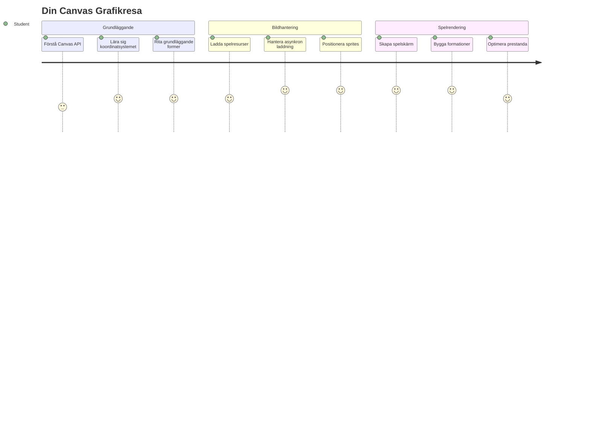
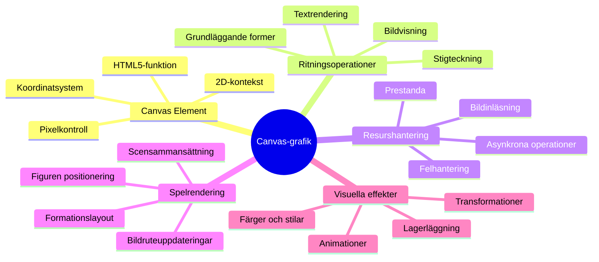
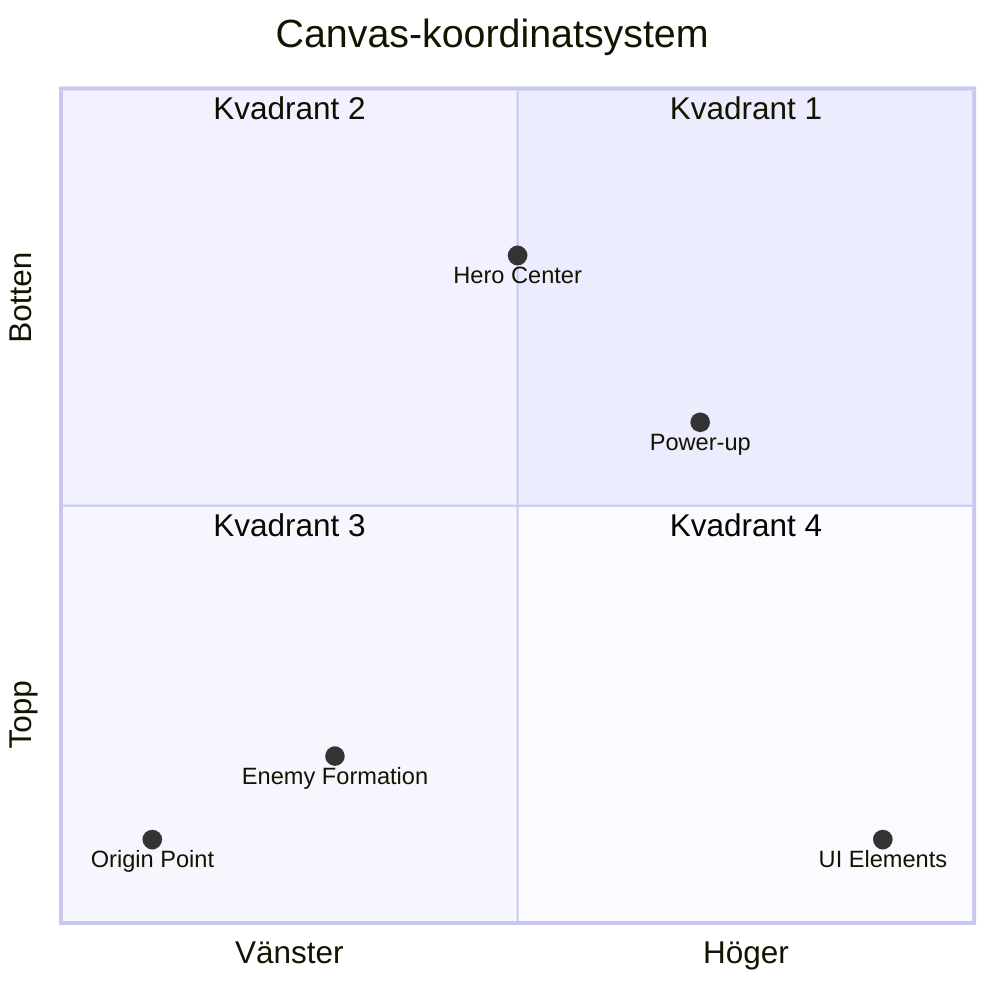
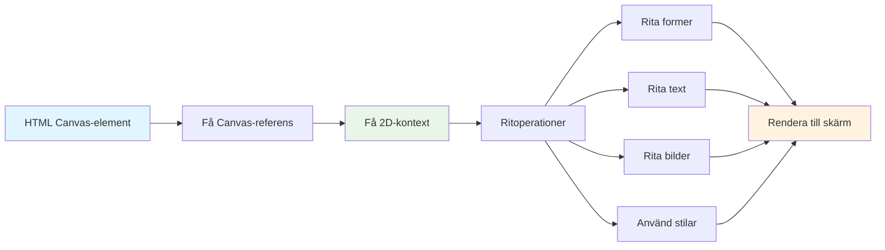
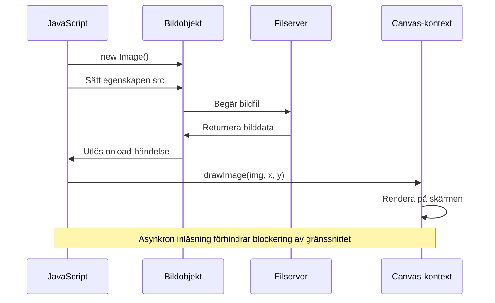
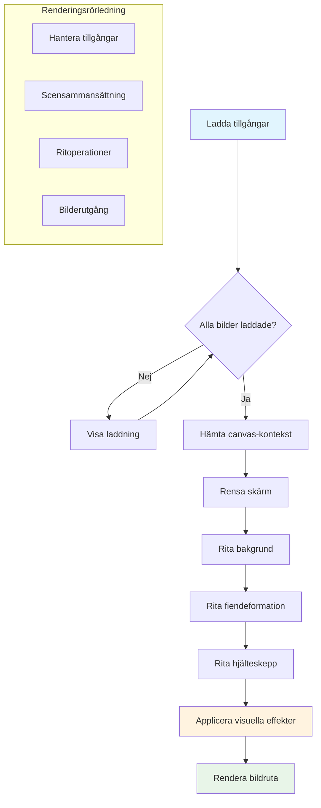
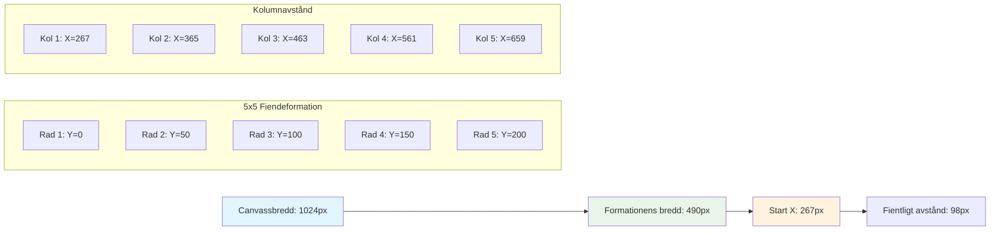
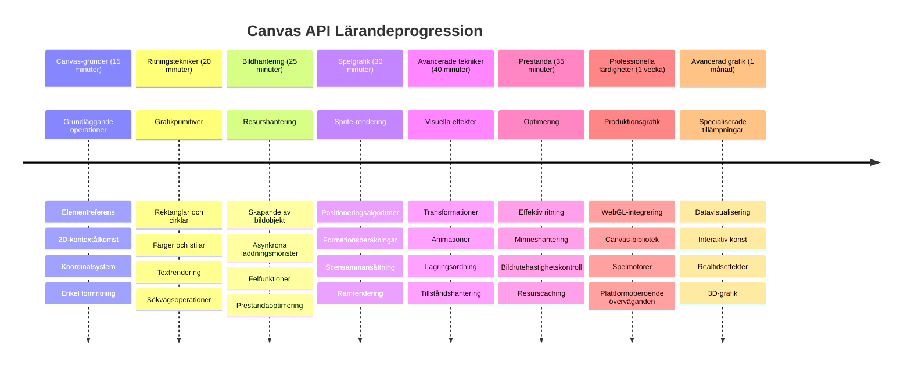

<!--
CO_OP_TRANSLATOR_METADATA:
{
  "original_hash": "7994743c5b21fdcceb36307916ef249a",
  "translation_date": "2026-01-06T22:48:06+00:00",
  "source_file": "6-space-game/2-drawing-to-canvas/README.md",
  "language_code": "sv"
}
-->
# Bygg ett rymdspel Del 2: Rita hjälte och monster på canvas


Canvas-API:et är en av webbutvecklingens mest kraftfulla funktioner för att skapa dynamiska, interaktiva grafik direkt i din webbläsare. I denna lektion kommer vi att förvandla det tomma HTML-`<canvas>`-elementet till en spelvärld fylld med hjältar och monster. Tänk på canvas som din digitala konsttavla där kod blir visuellt.

Vi bygger vidare på vad du lärde dig i föregående lektion, och nu dyker vi ner i de visuella aspekterna. Du kommer att lära dig hur du laddar och visar spel-sprites, positionerar element exakt och skapar den visuella grunden för ditt rymdspel. Detta binder ihop klyftan mellan statiska webbsidor och dynamiska, interaktiva upplevelser.

I slutet av denna lektion har du en komplett spelscen med ditt hjälteskepp korrekt positionerat och fiendeformationer redo för strid. Du kommer att förstå hur moderna spel renderar grafik i webbläsare och få färdigheter för att skapa dina egna interaktiva visuella upplevelser. Låt oss utforska canvas-grafik och ge liv åt ditt rymdspel!


## Förkompetensquiz

[Förkompetensquiz](https://ff-quizzes.netlify.app/web/quiz/31)

## Canvas

Så vad exakt är detta `<canvas>`-element? Det är HTML5:s lösning för att skapa dynamisk grafik och animationer i webbläsare. Till skillnad från vanliga bilder eller videor som är statiska ger canvas dig pixelkontroll över allt som visas på skärmen. Detta gör det perfekt för spel, datavisualiseringar och interaktiv konst. Tänk på det som en programmerbar rityta där JavaScript blir din pensel.

Som standard ser ett canvas-element ut som en tom, transparent rektangel på din sida. Men där ligger potentialen! Dess verkliga styrka framträder när du använder JavaScript för att rita former, ladda bilder, skapa animationer och göra saker responsiva för användarinteraktioner. Det liknar hur tidiga datorgrafik-pionjärer på Bell Labs på 1960-talet fick programmera varje pixel för att skapa de första digitala animationerna.

✅ Läs [mer om Canvas API:et](https://developer.mozilla.org/docs/Web/API/Canvas_API) på MDN.

Så här deklareras det vanligtvis, som en del av sidans body:

```html
<canvas id="myCanvas" width="200" height="100"></canvas>
```

**Detta gör koden:**
- **Sätter** `id`-attributet så att du kan referera till detta specifika canvas-element i JavaScript
- **Definierar** `width` i pixlar för att kontrollera canvasens horisontella storlek
- **Fastställer** `height` i pixlar för att bestämma canvasens vertikala dimensioner

## Rita enkel geometri

Nu när du vet vad canvas-elementet är, låt oss utforska hur man faktiskt ritar på det! Canvas använder ett koordinatsystem som kan kännas igen från mattetimmen, men med en viktig skillnad som är specifik för datorgrafik.

Canvas använder kartesiska koordinater med en x-axel (horisontell) och y-axel (vertikal) för att positionera allt du ritar. Men här är nyckelskillnaden: till skillnad från koordinatsystemet i matteläxor startar origo `(0,0)` i det övre vänstra hörnet, där x-värden ökar när du rör dig åt höger, och y-värden ökar när du rör dig nedåt. Denna metod härstammar från tidiga datorskärmar där elektronstrålar skannade från topp till botten, vilket gjorde övre vänstra hörnet till den naturliga startpunkten.



> Bild från [MDN](https://developer.mozilla.org/docs/Web/API/Canvas_API/Tutorial/Drawing_shapes)

För att rita på canvas-elementet följer du samma trestegsprocess som utgör grunden för all canvas-grafik. När du väl har gjort detta några gånger blir det andra natur:


1. **Hämta en referens** till ditt Canvas-element från DOM (precis som vilket annat HTML-element som helst)
2. **Hämta 2D-renderingskontexten** – detta ger alla ritmetoderna
3. **Börja rita!** Använd kontextens inbyggda metoder för att skapa din grafik

Så här ser det ut i kod:

```javascript
// Steg 1: Hämta canvas-elementet
const canvas = document.getElementById("myCanvas");

// Steg 2: Hämta 2D-renderingskontexten
const ctx = canvas.getContext("2d");

// Steg 3: Ställ in fyllnadsfärg och rita en rektangel
ctx.fillStyle = 'red';
ctx.fillRect(0, 0, 200, 200); // x, y, bredd, höjd
```

**Låt oss bryta ner detta steg för steg:**
- Vi **hämtar** vårt canvas-element med dess ID och sparar det i en variabel
- Vi **hämtar** 2D-renderingskontexten – detta är vårt verktygspaket fullt av ritmetoder
- Vi **sätter** canvas att fylla med rött genom egenskapen `fillStyle`
- Vi **ritar** en rektangel som börjar i det övre vänstra hörnet (0,0) med bredd och höjd på 200 pixlar

✅ Canvas API fokuserar mest på 2D-former, men du kan också rita 3D-element på en webbplats; för detta kan du använda [WebGL API](https://developer.mozilla.org/docs/Web/API/WebGL_API).

Med Canvas API kan du rita alla möjliga saker som:

- **Geometriska former**, vi har redan visat hur man ritar en rektangel, men det finns mycket mer du kan rita.
- **Text**, du kan rita text med vilken font och färg du vill.
- **Bilder**, du kan rita en bild baserat på en bildresurs som en .jpg eller .png till exempel.

✅ Prova själv! Du vet hur man ritar en rektangel, kan du rita en cirkel på en sida? Ta en titt på några intressanta Canvas-ritningar på CodePen. Här är ett [särskilt imponerande exempel](https://codepen.io/dissimulate/pen/KrAwx).

### 🔄 **Pedagogisk kontroll**
**Förståelse för Canvas-grunder**: Innan du går vidare med bildladdning, se till att du kan:
- ✅ Förklara hur canvas koordinatsystem skiljer sig från matematiska koordinater
- ✅ Förstå trestegsprocessen för canvas-ritoperationer
- ✅ Identifiera vad 2D-renderingskontexten ger
- ✅ Beskriva hur fillStyle och fillRect fungerar tillsammans

**Snabb självtest**: Hur skulle du rita en blå cirkel på position (100, 50) med radie 25?
```javascript
ctx.fillStyle = 'blue';
ctx.beginPath();
ctx.arc(100, 50, 25, 0, 2 * Math.PI);
ctx.fill();
```

**Canvas ritmetoder du nu känner till**:
- **fillRect()**: Ritar ifyllda rektanglar
- **fillStyle**: Sätter färger och mönster
- **beginPath()**: Startar nya ritvägar
- **arc()**: Skapar cirklar och kurvor

## Ladda och rita en bildresurs

Att rita grundläggande former är användbart för att komma igång, men de flesta spel behöver faktiska bilder! Sprites, bakgrunder och texturer är det som ger spel deras visuella attraktionskraft. Att ladda och visa bilder på canvas fungerar annorlunda än att rita geometriska former, men det är enkelt när du förstår processen.

Vi behöver skapa ett `Image`-objekt, ladda vår bildfil (detta sker asynkront, vilket betyder "i bakgrunden") och sedan rita det på canvas när det är klart. Detta tillvägagångssätt säkerställer att dina bilder visas korrekt utan att blockera din applikation medan de laddas.


### Grundläggande bildladdning

```javascript
const img = new Image();
img.src = 'path/to/my/image.png';
img.onload = () => {
  // Bild laddad och klar att användas
  console.log('Image loaded successfully!');
};
```

**Det här händer i koden:**
- Vi **skapar** ett helt nytt Image-objekt för att hålla vår sprite eller textur
- Vi **anger** vilken bildfil som ska laddas genom att sätta källvägen
- Vi **lyssnar** på load-eventet så vi vet exakt när bilden är redo att användas

### Ett bättre sätt att ladda bilder

Här är ett mer robust sätt att hantera bildladdning som professionella utvecklare ofta använder. Vi kapslar in bildladdningen i en Promise-baserad funktion – detta tillvägagångssätt, som blev populärt när JavaScript Promises blev standard i ES6, gör din kod mer organiserad och hanterar fel på ett smidigt sätt:

```javascript
function loadAsset(path) {
  return new Promise((resolve, reject) => {
    const img = new Image();
    img.src = path;
    img.onload = () => {
      resolve(img);
    };
    img.onerror = () => {
      reject(new Error(`Failed to load image: ${path}`));
    };
  });
}

// Modernt användande med async/await
async function initializeGame() {
  try {
    const heroImg = await loadAsset('hero.png');
    const monsterImg = await loadAsset('monster.png');
    // Bilderna är nu redo att användas
  } catch (error) {
    console.error('Failed to load game assets:', error);
  }
}
```

**Vad vi gjort här:**
- **Kapslat in** all bildladdningslogik i en Promise så vi kan hantera det bättre
- **Lagt till** felhantering som faktiskt berättar när något går fel
- **Använt** modern async/await-syntax eftersom det är mycket renare att läsa
- **Inkluderat** try/catch-block för att smidigt hantera eventuella laddningsproblem

När dina bilder är laddade är det faktiskt ganska enkelt att rita dem på canvas:

```javascript
async function renderGameScreen() {
  try {
    // Ladda spelresurser
    const heroImg = await loadAsset('hero.png');
    const monsterImg = await loadAsset('monster.png');

    // Hämta canvas och kontext
    const canvas = document.getElementById("myCanvas");
    const ctx = canvas.getContext("2d");

    // Rita bilder på specifika positioner
    ctx.drawImage(heroImg, canvas.width / 2, canvas.height / 2);
    ctx.drawImage(monsterImg, 0, 0);
  } catch (error) {
    console.error('Failed to render game screen:', error);
  }
}
```

**Vi går igenom detta steg för steg:**
- Vi **laddar** både våra hjälte- och monsterbilder i bakgrunden med await
- Vi **hämtar** vårt canvas-element och får den 2D-renderingskontext vi behöver
- Vi **positionerar** hjältebilden mitt i på bredden med lite koordinatmatematik
- Vi **placerar** monsterbilden uppe i det övre vänstra hörnet för att starta vår fiendeformation
- Vi **fångar** eventuella fel som kan inträffa under laddning eller rendering


## Nu är det dags att börja bygga ditt spel

Nu sätter vi ihop allt för att skapa den visuella grunden för ditt rymdspel. Du har en stabil förståelse för canvas-grunder och bildladdningstekniker, så denna praktiska sektion guidar dig genom att skapa en komplett spelskärm med korrekt positionerade sprites.

### Vad du ska bygga

Du ska bygga en webbsida med ett Canvas-element. Det ska visa en svart skärm `1024*768`. Vi har försett dig med två bilder:

- Hjälteskepp

   

- 5*5 monster

   

### Rekommenderade steg för att börja utvecklingen

Leta upp startfilerna som har skapats åt dig i undermappen `your-work`. Din projektstruktur bör innehålla:

```bash
your-work/
├── assets/
│   ├── enemyShip.png
│   └── player.png
├── index.html
├── app.js
└── package.json
```

**Det här jobbar du med:**
- **Spel-sprites** finns i mappen `assets/` så allt hålls organiserat
- **Din huvud-HTML-fil** som sätter upp canvas-elementet och förbereder allt
- **En JavaScript-fil** där du skriver all rendering av ditt spel
- **En package.json** som sätter upp en utvecklingsserver så du kan testa lokalt

Öppna denna mapp i Visual Studio Code för att börja utveckla. Du behöver en lokal utvecklingsmiljö med Visual Studio Code, NPM och Node.js installerade. Om du inte har `npm` installerat på din dator, [så här installerar du det](https://www.npmjs.com/get-npm).

Starta din utvecklingsserver genom att navigera till mappen `your-work`:

```bash
cd your-work
npm start
```

**Detta kommando gör ganska coola saker:**
- **Startar** en lokal server på `http://localhost:5000` så du kan testa ditt spel
- **Serverar** alla dina filer korrekt så att din webbläsare kan ladda dem rätt
- **Bevakar** dina filer för ändringar så du kan utveckla smidigt
- **Ger dig** en professionell utvecklingsmiljö för att testa allt

> 💡 **Notera**: Din webbläsare visar initialt en tom sida – det är förväntat! När du lägger till kod, uppdatera webbläsaren för att se dina ändringar. Denna iterativa utvecklingsmetod är liknande hur NASA byggde Apollo guidance computer – testa varje komponent innan den integreras i det större systemet.

### Lägg till kod

Lägg till den nödvändiga koden till `your-work/app.js` för att slutföra följande uppgifter:

1. **Rita en canvas med svart bakgrund**
   > 💡 **Så här gör du**: Hitta TODO i `/app.js` och lägg till bara två rader. Sätt `ctx.fillStyle` till svart, sedan använd `ctx.fillRect()` med start (0,0) och canvasens dimensioner. Enkelt!

2. **Ladda speltexturer**
   > 💡 **Så här gör du**: Använd `await loadAsset()` för att ladda dina spelare- och fiendebilder. Spara dem i variabler så du kan använda dem senare. Kom ihåg – de syns inte förrän du faktiskt ritar dem!

3. **Rita hjälteskeppet i mitten-nedre position**
   > 💡 **Så här gör du**: Använd `ctx.drawImage()` för att positionera hjälten. För x-koordinaten, prova `canvas.width / 2 - 45` för att centrera det, och för y-koordinaten `canvas.height - canvas.height / 4` för att placera det i nederdelen.

4. **Rita en 5×5-formation av fiendeskepp**
   > 💡 **Så här gör du**: Hitta funktionen `createEnemies` och sätt upp en nästlad loop. Du måste göra lite matematik för avstånd och positionering, men oroa dig inte – jag visar dig exakt hur!

Först, definiera konstanter för korrekt layout av fiendeformationen:

```javascript
const ENEMY_TOTAL = 5;
const ENEMY_SPACING = 98;
const FORMATION_WIDTH = ENEMY_TOTAL * ENEMY_SPACING;
const START_X = (canvas.width - FORMATION_WIDTH) / 2;
const STOP_X = START_X + FORMATION_WIDTH;
```

**Det här gör konstanterna:**
- Vi **sätter** 5 fiender per rad och kolumn (ett snyggt 5×5-rutnät)
- Vi **definierar** hur mycket utrymme som ska vara mellan fiender så de inte ser trångbodda ut
- Vi **beräknar** hur brett hela formationen blir
- Vi **räknar ut** var vi ska starta och sluta så formationen ser centrerad ut


Sedan skapar du nästlade loopar för att rita fiendeformationen:

```javascript
for (let x = START_X; x < STOP_X; x += ENEMY_SPACING) {
  for (let y = 0; y < 50 * 5; y += 50) {
    ctx.drawImage(enemyImg, x, y);
  }
}
```

**Det här gör den nästlade loopen:**
- Den yttre loopen **rör sig** från vänster till höger över formationen
- Den inre loopen **går** uppifrån och ned för att skapa prydliga rader
- Vi **ritar** varje fiendesprite på exakt de x,y-koordinater vi beräknat
- Allt hålls **jämnt avstånd** så det ser professionellt och ordnat ut

### 🔄 **Pedagogisk kontroll**
**Full kontroll på spelrendreringen**: Verifiera din förståelse av hela renderingssystemet:
- ✅ Hur förhindrar asynkron bildladdning UI-blockering under spelstart?
- ✅ Varför beräknar vi fiendeformationens positioner med konstanter istället för hårdkodning?
- ✅ Vilken roll spelar 2D-renderingskontexten i ritoperationer?
- ✅ Hur skapar nästlade loopar organiserade sprite-formationer?

**Prestandahänsyn**: Ditt spel visar nu:
- **Effektiv resursladdning**: Promise-baserad bildhantering
- **Organiserad rendering**: Strukturerade ritoperationer
- **Matematisk positionering**: Beräknad sprite-placering
- **Felhantering**: Smidig hantering av fel

**Koncept inom visuell programmering**: Du har lärt dig:
- **Koordinatsystem**: Översätta matematik till skärmpositioner  
- **Sprite-hantering**: Ladda och visa spelgrafik  
- **Formationsalgoritmer**: Matematiska mönster för organiserade layouter  
- **Asynkrona operationer**: Modern JavaScript för smidig användarupplevelse  

## Resultat

Det färdiga resultatet bör se ut så här:


## Lösning

Försök gärna lösa det själv först, men om du fastnar, ta en titt på en [lösning](../../../../6-space-game/2-drawing-to-canvas/solution/app.js)

---

## GitHub Copilot Agent-utmaning 🚀

Använd Agent-läget för att slutföra följande utmaning:

**Beskrivning:** Förbättra ditt rymdspelscanvas genom att lägga till visuella effekter och interaktiva element med hjälp av Canvas API-tekniker som du lärt dig.

**Uppmaning:** Skapa en ny fil som heter `enhanced-canvas.html` med en canvas som visar animerade stjärnor i bakgrunden, en pulserande hälsobar för hjälteskeppet och fiendeskepp som långsamt rör sig nedåt. Inkludera JavaScript-kod som ritar blinkande stjärnor med slumpmässiga positioner och opacitet, implementerar en hälsobar som ändrar färg baserat på hälsostatus (grön > gul > röd) och animerar fiendeskepp som rör sig nedåt på skärmen i olika hastigheter.

Läs mer om [agent-läget](https://code.visualstudio.com/blogs/2025/02/24/introducing-copilot-agent-mode) här.

## 🚀 Utmaning

Du har lärt dig att rita med 2D-fokuserade Canvas API; titta på [WebGL API](https://developer.mozilla.org/docs/Web/API/WebGL_API) och försök att rita ett 3D-objekt.

## Quiz efter lektionen

[Quiz efter lektionen](https://ff-quizzes.netlify.app/web/quiz/32)

## Översikt & Självstudier

Lär dig mer om Canvas API genom att [läsa om det](https://developer.mozilla.org/docs/Web/API/Canvas_API).

### ⚡ **Vad du kan göra på nästa 5 minuter**
- [ ] Öppna webbläsarens konsol och skapa ett canvas-element med `document.createElement('canvas')`
- [ ] Prova att rita en rektangel med `fillRect()` på ett canvas-kontekst
- [ ] Experimentera med olika färger med `fillStyle`-egenskapen
- [ ] Rita en enkel cirkel med metoden `arc()`

### 🎯 **Vad du kan uppnå under denna timme**
- [ ] Klara quiz efter lektionen och förstå canvas-grunderna
- [ ] Skapa en canvas ritapplikation med flera former och färger
- [ ] Implementera bildinladdning och sprite-rendering för ditt spel
- [ ] Bygg en enkel animation som rör objekt över canvas
- [ ] Öva canvas-transformationer som skalning, rotation och förflyttning

### 📅 **Din veckolånga Canvas-resa**
- [ ] Klara rymdspelet med polerad grafik och sprite-animationer
- [ ] Bemästra avancerade canvastekniker som gradienter, mönster och kompositering
- [ ] Skapa interaktiva visualiseringar med canvas för datavisualisering
- [ ] Lär dig optimeringstekniker för canvas för smidig prestanda
- [ ] Bygg en rit- eller målningsapplikation med olika verktyg
- [ ] Utforska kreativa kodningsmönster och generativ konst med canvas

### 🌟 **Din månadslånga grafikmästerskap**
- [ ] Bygg komplexa visuella applikationer med Canvas 2D och WebGL
- [ ] Lär dig grafikprogrammeringskoncept och shader-grunder
- [ ] Bidra till open source-grafikbibliotek och visualiseringsverktyg
- [ ] Bemästra prestandaoptimering för grafikintensiva applikationer
- [ ] Skapa utbildningsinnehåll om canvasprogrammering och datorgrafik
- [ ] Bli en expert på grafikprogrammering som hjälper andra att skapa visuella upplevelser

## 🎯 Din tidslinje för Canvas-grafikmästerskap


### 🛠️ Din Canvas Graphics Toolkit-sammanfattning

Efter att ha slutfört denna lektion har du nu:  
- **Canvas API-mästerskap**: Full förståelse för 2D-grafikprogrammering  
- **Matematik för koordinater**: Precisa positionerings- och layoutalgoritmer  
- **Asset-hantering**: Professionell bildinladdning och felhantering  
- **Renderingspipeline**: Strukturerad metod för scenkomposition  
- **Spelgrafik**: Sprite-positionering och formationsberäkningar  
- **Asynkron programmering**: Moderna JavaScript-mönster för smidig prestanda  
- **Visuell programmering**: Översätta matematiska koncept till skärmgrafik  

**Applikationer i verkliga världen**: Dina Canvas-kunskaper tillämpas direkt på:  
- **Datavisualisering**: Diagram, grafer och interaktiva instrumentpaneler  
- **Spelutveckling**: 2D-spel, simuleringar och interaktiva upplevelser  
- **Digital konst**: Kreativ kodning och generativa konstprojekt  
- **UI/UX-design**: Anpassad grafik och interaktiva element  
- **Utbildningsprogramvara**: Visuella lärverktyg och simuleringar  
- **Webbapplikationer**: Dynamisk grafik och realtidsvisualiseringar  

**Professionella färdigheter som du har fått**: Du kan nu:  
- **Bygga** anpassade grafiklösningar utan externa bibliotek  
- **Optimera** renderingens prestanda för smidig användarupplevelse  
- **Felsöka** komplexa visuella problem med webbläsarens utvecklarverktyg  
- **Designa** skalbara grafiksystem med matematiska principer  
- **Integrera** Canvas-grafik med moderna webbapplikationsramverk  

**Canvas API-metoder du behärskar**:  
- **Elementhantering**: getElementById, getContext  
- **Ritoperationer**: fillRect, drawImage, fillStyle  
- **Assetinladdning**: Bildobjekt, Promise-mönster  
- **Matematisk positionering**: Koordinatberäkningar, formationsalgoritmer  

**Nästa nivå**: Du är redo att lägga till animation, användarinteraktion, kollisionsdetektion eller utforska WebGL för 3D-grafik!

🌟 **Uppnått mål**: Du har byggt ett komplett spelrenderingssystem med grundläggande Canvas API-tekniker!

## Uppgift

[Lek med Canvas API](assignment.md)

---

<!-- CO-OP TRANSLATOR DISCLAIMER START -->
**Ansvarsfriskrivning**:
Detta dokument har översatts med hjälp av AI-översättningstjänsten [Co-op Translator](https://github.com/Azure/co-op-translator). Även om vi strävar efter noggrannhet, vänligen observera att automatiska översättningar kan innehålla fel eller brister. Det ursprungliga dokumentet på dess modersmål ska betraktas som den auktoritativa källan. För kritisk information rekommenderas professionell mänsklig översättning. Vi ansvarar inte för några missförstånd eller feltolkningar som uppstår vid användning av denna översättning.
<!-- CO-OP TRANSLATOR DISCLAIMER END -->