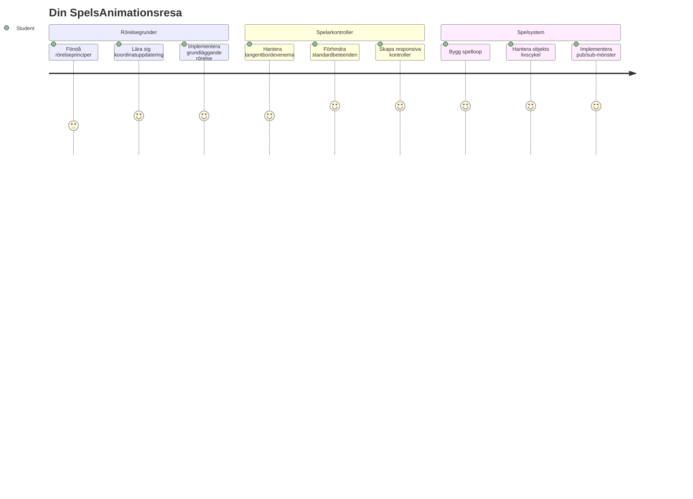
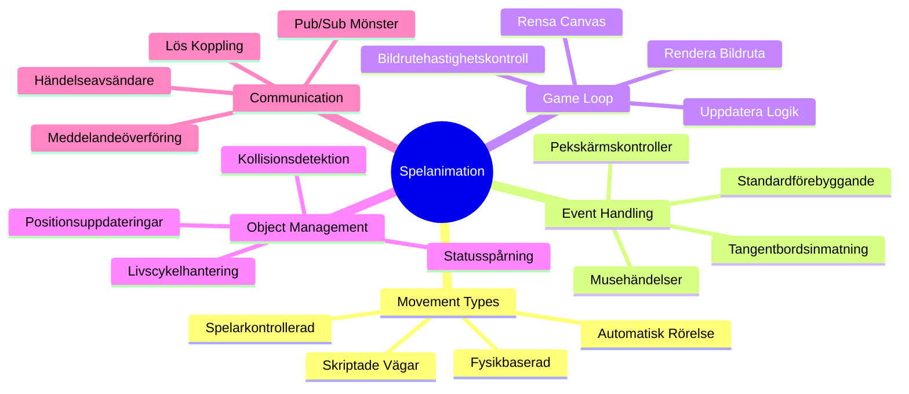
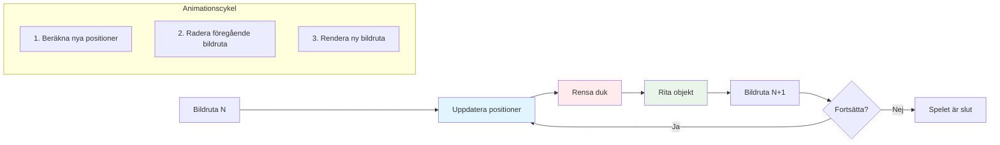
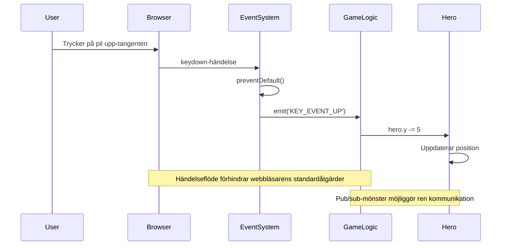
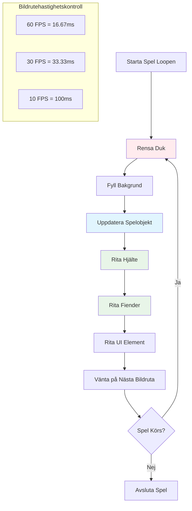
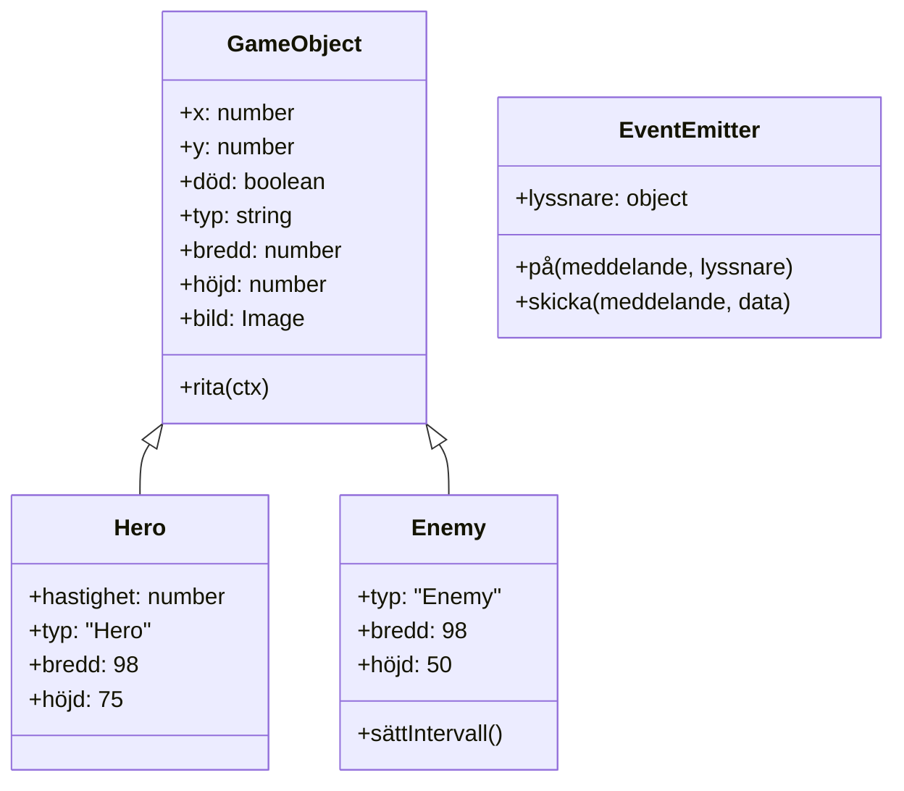
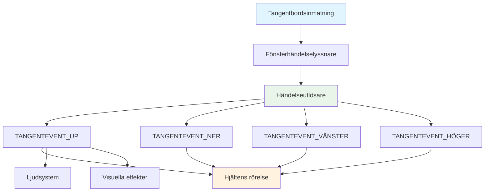
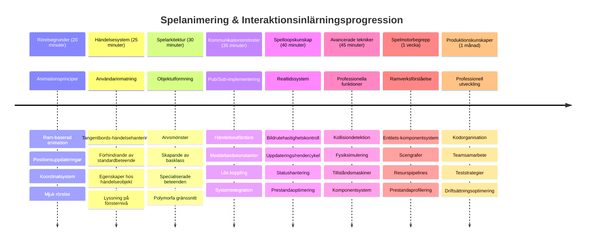

# Skapa ett rymdspel del 3: Lägga till rörelse


Tänk på dina favoritspel – det som gör dem fängslande är inte bara snygg grafik, det är sättet allt rör sig och svarar på dina handlingar. Just nu är ditt rymdspel som en vacker målning, men vi är på väg att lägga till rörelse som ger det liv.

När NASAs ingenjörer programmerade styrdatorn för Apollo-uppdragen stod de inför en liknande utmaning: hur får man ett rymdskepp att svara på pilotens input samtidigt som det automatiskt gör kurskorrigeringar? Principerna vi ska lära oss idag ekar samma koncept – att hantera spelarstyrd rörelse tillsammans med automatiska systembeteenden.

I denna lektion ska du lära dig hur du får rymdskepp att glida över skärmen, svara på spelarkommandon och skapa mjuka rörelsemönster. Vi delar upp allt i hanterbara koncept som bygger på varandra på ett naturligt sätt.

I slutet kommer spelarna flyga sitt hjälteskepp runt på skärmen medan fientliga skepp patrullerar ovanför. Än viktigare är att du kommer förstå de grundläggande principerna som driver spelsystemen för rörelse.


## Förförelsetest

[Förförelsetest](https://ff-quizzes.netlify.app/web/quiz/33)

## Förståelse för spelrörelse

Spel blir levande när saker börjar röra sig, och det finns i grunden två sätt detta händer på:

- **Spelarstyrd rörelse**: När du trycker på en tangent eller klickar med musen, rör sig något. Det är den direkta kopplingen mellan dig och din spelvärld.
- **Automatisk rörelse**: När spelet självt bestämmer att något ska röra sig – som de där fientliga skeppen som måste patrullera skärmen oavsett om du gör någonting eller inte.

Att få objekt att röra sig på en datorskärm är enklare än du kanske tror. Kommer du ihåg x- och y-koordinaterna från mattetimmarna? Det är precis det vi jobbar med här. När Galileo 1610 kartlade Jupiters månar gjorde han i princip samma sak – plottade positioner över tid för att förstå rörelsemönster.

Att flytta saker på skärmen är som att skapa en bläddra-bok-animation – du behöver följa dessa tre enkla steg:


1. **Uppdatera positionen** – Ändra var ditt objekt ska vara (kanske flytta det 5 pixlar åt höger)
2. **Radera den gamla ramen** – Rensa skärmen så att du inte ser spöklika spår överallt
3. **Rita den nya ramen** – Placera ditt objekt på sin nya plats

Gör du detta tillräckligt snabbt, och pang! Har du mjuk rörelse som känns naturlig för spelarna.

Så här kan det se ut i kod:

```javascript
// Ställ in hjälterens plats
hero.x += 5;
// Rensa rektangeln som rymmer hjälten
ctx.clearRect(0, 0, canvas.width, canvas.height);
// Rita om spelbakgrunden och hjälten
ctx.fillRect(0, 0, canvas.width, canvas.height);
ctx.fillStyle = "black";
ctx.drawImage(heroImg, hero.x, hero.y);
```

**Det här gör koden:**
- **Uppdaterar** hjälterymdskeppets x-koordinat med 5 pixlar för att flytta det horisontellt
- **Rensar** hela canvasområdet för att ta bort den tidigare ramen
- **Fyller** canvas med en svart bakgrundsfärg
- **Ritar om** hjälten i sin nya position

✅ Kan du tänka dig en anledning till varför att rita om hjälten många gånger per sekund kan leda till prestandakostnader? Läs om [alternativ till detta mönster](https://developer.mozilla.org/en-US/docs/Web/API/Canvas_API/Tutorial/Optimizing_canvas).

## Hantera tangentbords-händelser

Här kopplar vi spelarinmatning till spelfunktioner. När någon trycker på mellanslag för att skjuta en laser eller trycker på en piltangent för att ducka för en asteroid, måste spelet känna av och svara på den inmatningen.

Tangentbordshändelser inträffar på fönsternivå, vilket betyder att hela din webbläsarfönster lyssnar efter dessa tangenttryckningar. Musklick kan däremot kopplas till specifika element (som att klicka på en knapp). För vårt rymdspel fokuserar vi på tangentbordsstyrning eftersom det ger spelarna den klassiska arkadkänslan.

Det påminner om hur telegrafoperatörer på 1800-talet behövde översätta morsekod till meningsfulla meddelanden – vi gör något liknande här, vi översätter tangenttryckningar till spelkommandon.

För att hantera en händelse måste du använda fönstrets `addEventListener()`-metod och ge den två inparametrar. Den första parametern är namnet på händelsen, t.ex. `keyup`. Den andra är funktionen som ska anropas när händelsen inträffar.

Så här ser ett exempel ut:

```javascript
window.addEventListener('keyup', (evt) => {
  // evt.key = strängrepresentation av tangenten
  if (evt.key === 'ArrowUp') {
    // gör något
  }
});
```

**Det här händer i koden:**
- **Lyssnar** efter tangentbordshändelser på hela fönstret
- **Fångar** event-objektet som innehåller information om vilken tangent som trycktes
- **Kontrollerar** om den tryckta tangenten matchar en viss tangent (i detta fall pil upp)
- **Utför** kod när villkoret är sant

För tangentbords-händelser finns två egenskaper på event-objektet som du kan använda för att se vilken tangent som trycktes:

- `key` - detta är en strängrepresentation av tryckta tangenten, t.ex. `'ArrowUp'`
- `keyCode` - detta är ett nummer, t.ex. `37`, som motsvarar `ArrowLeft`

✅ Tangentbordsmanipulation är användbart även utanför spelutveckling. Vilka andra användningar kan du tänka dig för denna teknik?


### Speciella tangenter: en varning!

Vissa tangenter har inbyggda beteenden i webbläsaren som kan störa ditt spel. Piltangenter scrollar sidan och mellanslag hoppar ner – beteenden du inte vill ha när någon försöker styra sitt rymdskepp.

Vi kan förhindra dessa standardbeteenden och låta vårt spel hantera inmatningen istället. Det är likt hur tidiga programmerare var tvungna att överstyra systemavbrott för att skapa egna beteenden – här gör vi det på webbläsarnivå. Så här gör du:

```javascript
const onKeyDown = function (e) {
  console.log(e.keyCode);
  switch (e.keyCode) {
    case 37:
    case 39:
    case 38:
    case 40: // Piltangenter
    case 32:
      e.preventDefault();
      break; // Mellanslag
    default:
      break; // blockera inte andra tangenter
  }
};

window.addEventListener('keydown', onKeyDown);
```

**Det här förhindrande-koden gör:**
- **Kollar** specifika tangentkoder som kan orsaka oönskat beteende i webbläsaren
- **Stoppar** standardåtgärden i webbläsaren för piltangenter och mellanslag
- **Tillåter** andra tangenter att fungera normalt
- **Använder** `e.preventDefault()` för att stoppa webbläsarens inbyggda beteende

### 🔄 **Pedagogisk kontroll**
**Förståelse för Händelsehantering**: Innan du går vidare till automatisk rörelse, se till att du kan:
- ✅ Förklara skillnaden mellan `keydown` och `keyup`-händelser
- ✅ Förstå varför vi förhindrar standardbeteenden i webbläsaren
- ✅ Beskriva hur eventlyssnare kopplar användarinmatning till spel-logik
- ✅ Identifiera vilka tangenter som kan störa spelkontroller

**Snabbt självtest**: Vad skulle hända om du inte förhindrade standardbeteende för piltangenterna?
*Svar: Webbläsaren skulle scrolla sidan och störa spelets rörelse*

**Event-systemets arkitektur**: Du förstår nu:
- **Lyssnande på fönsternivå**: Fånga händelser på webbläsarnivå
- **Egenskaper på event-objektet**: `key` strängar vs `keyCode` nummer
- **Standardförhindrande**: Stoppa oönskade webbläsarbeteenden
- **Villkorslogik**: Svara på specifika tangentkombinationer

## Spelinducerad rörelse

Nu pratar vi om objekt som rör sig utan spelarinput. Tänk på fiendeskepp som seglar över skärmen, kulor som flyger i raka linjer eller moln som driver i bakgrunden. Denna autonoma rörelse gör att din spelvärld känns levande även när ingen rör kontrollerna.

Vi använder JavaScripts inbyggda timers för att uppdatera positioner med jämna intervaller. Detta koncept påminner om hur pendelur fungerar – en regelbunden mekanism som triggar konsekventa, tidsstyrda åtgärder. Så här enkelt kan det vara:

```javascript
const id = setInterval(() => {
  // Flytta fienden på y-axeln
  enemy.y += 10;
}, 100);
```

**Det här gör rörelsekoden:**
- **Skapar** en timer som körs var 100:e millisekund
- **Uppdaterar** fiendens y-koordinat med 10 pixlar varje gång
- **Sparar** intervallets ID så vi kan stoppa det senare om det behövs
- **Flyttar** fienden automatiskt nedåt på skärmen

## Spelloopen

Här är konceptet som binder samman allt – spelloopen. Om ditt spel vore en film, skulle spelloopen vara filmprojektorn som visar bildruta efter bildruta så snabbt att allt ser ut att röra sig mjukt.

Alla spel har en sådan loop som körs i bakgrunden. Det är en funktion som uppdaterar alla spelobjekt, ritar om skärmen och upprepar detta kontinuerligt. Den håller koll på hjälten, alla fiender, laserskott – hela spelstatusen.

Det påminner mig om hur tidiga filmanimatörer som Walt Disney var tvungna att rita om karaktärer bildruta för bildruta för att skapa illusionen av rörelse. Vi gör samma sak, fast med kod istället för pennor.

Så här kan en spelloop typiskt se ut i kod:


```javascript
const gameLoopId = setInterval(() => {
  function gameLoop() {
    ctx.clearRect(0, 0, canvas.width, canvas.height);
    ctx.fillStyle = "black";
    ctx.fillRect(0, 0, canvas.width, canvas.height);
    drawHero();
    drawEnemies();
    drawStaticObjects();
  }
  gameLoop();
}, 200);
```

**Förståelse för spelloopsstruktur:**
- **Rensar** hela canvas för att ta bort föregående bildruta
- **Fyller** bakgrunden med en enfärgad bakgrund
- **Ritar** alla spelobjekt i sina aktuella positioner
- **Upprepar** denna process var 200:e millisekund för att skapa mjuk animation
- **Hanterar** bildrutefrekvensen genom att kontrollera intervallets timing

## Fortsättning på Rymdspelet

Nu ska vi lägga till rörelse till den statiska scenen du byggt tidigare. Vi ska förvandla den från en stillbild till en interaktiv upplevelse. Vi arbetar steg för steg för att varje del ska bygga på den föregående.

Hämta koden från där vi slutade i föregående lektion (eller börja med koden i mappen [Part II- starter](../../../../6-space-game/3-moving-elements-around/your-work) om du behöver börja från början).

**Det här bygger vi idag:**
- **Hjälte-kontroller**: Piltangenter styr ditt rymdskepp runt skärmen
- **Fienderörelse**: De där utomjordiska skeppen påbörjar sin framryckning

Låt oss börja implementera dessa funktioner.

## Rekommenderade steg

Leta upp filerna som har skapats åt dig i undermappen `your-work`. Den bör innehålla följande:

```bash
-| assets
  -| enemyShip.png
  -| player.png
-| index.html
-| app.js
-| package.json
```

Du börjar ditt projekt i mappen `your-work` genom att skriva:

```bash
cd your-work
npm start
```

**Det här kommandot gör:**
- **Navigerar** till din projektkatalog
- **Startar** en HTTP-server på adressen `http://localhost:5000`
- **Serverar** dina spel-filer så att du kan testa dem i en webbläsare

Ovanstående startar en HTTP-server på adressen `http://localhost:5000`. Öppna en webbläsare och skriv in den adressen, för tillfället ska det visa hjälten och alla fiender; inget rör sig – än!

### Lägg till kod

1. **Lägg till dedikerade objekt** för `hero`, `enemy` och `game object`, de ska ha `x` och `y` egenskaper. (Kom ihåg delen om [Inheritance eller composition](../README.md)).

   *TIPS* `game object` ska vara den som har `x` och `y` och förmågan att rita sig själv på en canvas.

   > **Tips**: Börja med att lägga till en ny `GameObject`-klass med konstruktorn definierad enligt nedan, och sedan rita den på canvas:

    ```javascript
    class GameObject {
      constructor(x, y) {
        this.x = x;
        this.y = y;
        this.dead = false;
        this.type = "";
        this.width = 0;
        this.height = 0;
        this.img = undefined;
      }
    
      draw(ctx) {
        ctx.drawImage(this.img, this.x, this.y, this.width, this.height);
      }
    }
    ```

    **Förståelse för basklassen:**
    - **Definierar** gemensamma egenskaper som alla spelobjekt delar (position, storlek, bild)
    - **Inkluderar** en flagga `dead` för att hålla koll på om objektet ska tas bort
    - **Tillhandahåller** en `draw()`-metod som ritar objektet på canvas
    - **Sätter** standardvärden för alla egenskaper som underklasser kan åsidosätta


    Nu, utöka denna `GameObject` för att skapa `Hero` och `Enemy`:
    
    ```javascript
    class Hero extends GameObject {
      constructor(x, y) {
        super(x, y);
        this.width = 98;
        this.height = 75;
        this.type = "Hero";
        this.speed = 5;
      }
    }
    ```

    ```javascript
    class Enemy extends GameObject {
      constructor(x, y) {
        super(x, y);
        this.width = 98;
        this.height = 50;
        this.type = "Enemy";
        const id = setInterval(() => {
          if (this.y < canvas.height - this.height) {
            this.y += 5;
          } else {
            console.log('Stopped at', this.y);
            clearInterval(id);
          }
        }, 300);
      }
    }
    ```

    **Nyckelkoncept i dessa klasser:**
    - **Ärver** från `GameObject` via `extends`-nyckelordet
    - **Kallar** föräldrakonstruktorn med `super(x, y)`
    - **Sätter** specifika dimensioner och egenskaper för varje objekttyp
    - **Implementerar** automatisk rörelse för fiender med hjälp av `setInterval()`

2. **Lägg till tangentbords-händelsehanterare** för att hantera tangentsurfning (flytta hjälten upp/ner vänster/höger)

   *KOM IHÅG* det är ett kartesiskt system, övre vänstra hörnet är `0,0`. Kom också ihåg att lägga till kod för att stoppa *standardbeteende*

   > **Tips**: Skapa din `onKeyDown`-funktion och koppla den till fönstret:

   ```javascript
   const onKeyDown = function (e) {
     console.log(e.keyCode);
     // Lägg till koden från lektionen ovan för att stoppa standardbeteendet
     switch (e.keyCode) {
       case 37:
       case 39:
       case 38:
       case 40: // Piltangenter
       case 32:
         e.preventDefault();
         break; // Mellanslag
       default:
         break; // blockera inte andra tangenter
     }
   };

   window.addEventListener("keydown", onKeyDown);
   ```
    
   **Det här gör eventhanteraren:**
   - **Lyssnar** efter keydown-händelser på hela fönstret
   - **Loggar** tangentkoden för att hjälpa dig debugga vilka tangenter som trycks
   - **Förhindrar** standard webbläsarbeteende för piltangenter och mellanslag
   - **Tillåter** andra tangenter att fungera normalt
   
   Kolla din webbläsarkonsol vid detta steg och se tangenttryckningarna loggas. 

3. **Implementera** [Pub sub-mönstret](../README.md), detta håller din kod ren när du följer resterande delar.

   Publish-Subscribe-mönstret hjälper till att organisera koden genom att separera detektering av händelser från händelsehantering. Det gör koden mer modulär och enklare att underhålla.

   För att göra denna sista del kan du:

   1. **Lägga till en event listener** på fönstret:

       ```javascript
       window.addEventListener("keyup", (evt) => {
         if (evt.key === "ArrowUp") {
           eventEmitter.emit(Messages.KEY_EVENT_UP);
         } else if (evt.key === "ArrowDown") {
           eventEmitter.emit(Messages.KEY_EVENT_DOWN);
         } else if (evt.key === "ArrowLeft") {
           eventEmitter.emit(Messages.KEY_EVENT_LEFT);
         } else if (evt.key === "ArrowRight") {
           eventEmitter.emit(Messages.KEY_EVENT_RIGHT);
         }
       });
       ```

   **Det här gör event-systemet:**
   - **Känner av** tangentbordsinput och konverterar det till egna spelsevenemang
   - **Separera** inmatningsdetektion från spelloop-logik
   - **Gör det lätt** att ändra kontroller senare utan att påverka spelkoden
   - **Tillåter** flera system att svara på samma inmatning


   2. **Skapa en EventEmitter-klass** för att publicera och prenumerera på meddelanden:

       ```javascript
       class EventEmitter {
         constructor() {
           this.listeners = {};
         }
       
         on(message, listener) {
           if (!this.listeners[message]) {
             this.listeners[message] = [];
           }
           this.listeners[message].push(listener);
         }
       
   3. **Lägg till konstanter** och sätt upp EventEmitter:

       ```javascript
       const Messages = {
         KEY_EVENT_UP: "KEY_EVENT_UP",
         KEY_EVENT_DOWN: "KEY_EVENT_DOWN",
         KEY_EVENT_LEFT: "KEY_EVENT_LEFT",
         KEY_EVENT_RIGHT: "KEY_EVENT_RIGHT",
       };
       
       let heroImg, 
           enemyImg, 
           laserImg,
           canvas, ctx, 
           gameObjects = [], 
           hero, 
           eventEmitter = new EventEmitter();
       ```

   **Förståelse för uppsättningen:**
   - **Definierar** meddelandekonstanter för att undvika felskrivningar och underlätta refaktorering
   - **Deklarerar** variabler för bilder, canvas-kontext och spelstatus
   - **Skapar** en global event emitter för pub-sub-systemet
   - **Initierar** en array för att hålla alla spelobjekt

   4. **Initiera spelet**

       ```javascript
       function initGame() {
         gameObjects = [];
         createEnemies();
         createHero();
       
         eventEmitter.on(Messages.KEY_EVENT_UP, () => {
           hero.y -= 5;
         });
       
         eventEmitter.on(Messages.KEY_EVENT_DOWN, () => {
           hero.y += 5;
         });
       
         eventEmitter.on(Messages.KEY_EVENT_LEFT, () => {
           hero.x -= 5;
         });
       
4. **Sätt upp spel-loopen**

   Refaktorera funktionen `window.onload` för att initiera spelet och sätta upp en spel-loop med ett bra intervall. Du kommer även att lägga till en laserstråle:

    ```javascript
    window.onload = async () => {
      canvas = document.getElementById("canvas");
      ctx = canvas.getContext("2d");
      heroImg = await loadTexture("assets/player.png");
      enemyImg = await loadTexture("assets/enemyShip.png");
      laserImg = await loadTexture("assets/laserRed.png");
    
      initGame();
      const gameLoopId = setInterval(() => {
        ctx.clearRect(0, 0, canvas.width, canvas.height);
        ctx.fillStyle = "black";
        ctx.fillRect(0, 0, canvas.width, canvas.height);
        drawGameObjects(ctx);
      }, 100);
    };
    ```

   **Förståelse för speluppsättningen:**
   - **Väntar** på att sidan ska laddas klart innan start
   - **Hämtar** canvas-elementet och dess 2D-renderingskontext
   - **Laddar** alla bildresurser asynkront med `await`
   - **Startar** spel-loopen som körs med 100ms intervall (10 FPS)
   - **Rensar** och ritar om hela skärmen varje bildruta

5. **Lägg till kod** för att röra fiender med ett visst intervall

    Refaktorera funktionen `createEnemies()` för att skapa fienderna och lägga till dem i den nya gameObjects-klassen:

    ```javascript
    function createEnemies() {
      const MONSTER_TOTAL = 5;
      const MONSTER_WIDTH = MONSTER_TOTAL * 98;
      const START_X = (canvas.width - MONSTER_WIDTH) / 2;
      const STOP_X = START_X + MONSTER_WIDTH;
    
      for (let x = START_X; x < STOP_X; x += 98) {
        for (let y = 0; y < 50 * 5; y += 50) {
          const enemy = new Enemy(x, y);
          enemy.img = enemyImg;
          gameObjects.push(enemy);
        }
      }
    }
    ```

    **Vad fiendeskapandet gör:**
    - **Beräknar** positioner för att centrera fiender på skärmen
    - **Skapar** ett rutnät av fiender med nästlade loopar
    - **Tilldelar** fiendebilden till varje fiendeobjekt
    - **Lägger till** varje fiende i den globala game objects-arrayen
    
    och lägg till en `createHero()`-funktion för att göra en liknande process för hjälten.
    
    ```javascript
    function createHero() {
      hero = new Hero(
        canvas.width / 2 - 45,
        canvas.height - canvas.height / 4
      );
      hero.img = heroImg;
      gameObjects.push(hero);
    }
    ```

    **Vad hjälteskapandet gör:**
    - **Positionerar** hjälten längst ner i mitten av skärmen
    - **Tilldelar** hjältebilden till hjälteobjektet
    - **Lägger till** hjälten i game objects-arrayen för rendering

    och slutligen, lägg till en `drawGameObjects()`-funktion för att börja rita:

    ```javascript
    function drawGameObjects(ctx) {
      gameObjects.forEach(go => go.draw(ctx));
    }
    ```

    **Förståelse för ritfunktionen:**
    - **Itererar** genom alla spelobjekt i arrayen
    - **Anropar** `draw()`-metoden på varje objekt
    - **Skickar** canvas-kontexten så att objekten kan rita sig själva

    ### 🔄 **Pedagogisk kontroll**
    **Fullständig förståelse av spelsystemet**: Verifiera din behärskning av hela arkitekturen:
    - ✅ Hur låter arv hjälte och fiende dela gemensamma GameObject-egenskaper?
    - ✅ Varför gör pub/sub-mönstret din kod mer underhållbar?
    - ✅ Vilken roll spelar spel-loopen för att skapa smidig animation?
    - ✅ Hur kopplar event-lyssnare användarinput till spelobjektsbeteende?

    **Systemintegration**: Ditt spel demonstrerar nu:
    - **Objektorienterad design**: Bas-klasser med specialiserat arv
    - **Händelsestyrd arkitektur**: Pub/sub-mönster för lös koppling
    - **Animationsramverk**: Spel-loop med konsekventa uppdateringar
    - **Inputhantering**: Tangentbords-händelser med standardförhindran
    - **Resurshantering**: Bildinladdning och spritrendering

    **Professionella mönster**: Du har implementerat:
    - **Separation av ansvar**: Input, logik och rendering separerade
    - **Polymorfism**: Alla spelobjekt delar en gemensam ritningsgränssnitt
    - **Meddelandepassning**: Ren kommunikation mellan komponenter
    - **Resurshantering**: Effektiv sprite- och animationshantering

    Dina fiender bör nu börja avancera mot ditt hjälteskepp!
      }
    }
    ```
    
    and add a `createHero()` function to do a similar process for the hero.
    
    ```javascript
    function createHero() {
      hero = new Hero(
        canvas.width / 2 - 45,
        canvas.height - canvas.height / 4
      );
      hero.img = heroImg;
      gameObjects.push(hero);
    }
    ```

    och slutligen, lägg till en `drawGameObjects()`-funktion för att börja rita:

    ```javascript
    function drawGameObjects(ctx) {
      gameObjects.forEach(go => go.draw(ctx));
    }
    ```

    Dina fiender bör nu börja avancera mot ditt hjälteskepp!

---

## GitHub Copilot Agent-utmaning 🚀

Här är en utmaning som kommer att förbättra ditt spels höjdpunkt: att lägga till gränser och smidiga kontroller. Just nu kan din hjälte flyga utanför skärmen, och rörelsen kan kännas hackig.

**Din uppgift:** Få ditt rymdskepp att kännas mer realistiskt genom att implementera skärmkanter och flytande rörelse. Detta liknar hur NASAs flygkontrollsystem förhindrar att rymdfarkoster överskrider säkra operativa gränser.

**Det här ska du bygga:** Skapa ett system som håller ditt hjälteskepp på skärmen, och gör kontrollerna smidiga. När spelare håller ned en piltangent ska skeppet glida kontinuerligt istället för att röra sig i steg. Tänk också på att lägga till visuell feedback när skeppet når skärmens gränser – kanske en subtil effekt för att indikera spelområdet.

Läs mer om [agentläge](https://code.visualstudio.com/blogs/2025/02/24/introducing-copilot-agent-mode) här.

## 🚀 Utmaning

Kodorganisation blir allt viktigare i takt med att projekt växer. Du kanske har märkt att din fil börjar bli överfull med funktioner, variabler och klasser blandat tillsammans. Detta påminner mig om hur ingenjörerna som organiserade Apollo-uppdragets kod var tvungna att skapa tydliga, underhållbara system som flera team kunde arbeta på samtidigt.

**Din uppgift:**
Tänk som en mjukvaruarkitekt. Hur skulle du organisera din kod så att sex månader från nu, du (eller en kollega) kan förstå vad som händer? Även om allt är i en fil just nu kan du skapa bättre organisation:

- **Gruppera relaterade funktioner** tillsammans med tydliga kommentar-rubriker
- **Separera ansvarsområden** - håll spel-logik åtskild från rendering
- **Använda konsekventa namngivningsprinciper** för variabler och funktioner
- **Skapa moduler** eller namnrymder för att organisera olika delar av spelet
- **Lägga till dokumentation** som förklarar syftet med varje större sektion

**Reflektionsfrågor:**
- Vilka delar av din kod är svårast att förstå när du återvänder till dem?
- Hur skulle du organisera din kod för att göra det lättare för någon annan att bidra?
- Vad skulle hända om du ville lägga till nya funktioner som power-ups eller olika fiendetyper?

## Quiz efter föreläsning

[Quiz efter föreläsning](https://ff-quizzes.netlify.app/web/quiz/34)

## Granskning & Självstudier

Vi har byggt allt från grunden, vilket är fantastiskt för lärande, men här är en liten hemlighet – det finns några fantastiska JavaScript-ramverk som kan hantera mycket av det tunga arbetet åt dig. När du känner dig bekväm med grunderna vi gått igenom är det värt att [utforska vad som finns](https://github.com/collections/javascript-game-engines).

Tänk på ramverk som en välfylld verktygslåda istället för att göra varje verktyg för hand. De kan lösa många av de kodorganisationsutmaningar vi talade om, plus erbjuda funktioner som skulle ta veckor att utveckla själv.

**Saker värda att utforska:**
- Hur spelmotorer organiserar kod – du kommer att bli förvånad över de smarta mönster de använder
- Prestandatricks för att få canvas-spel att flyta på fint  
- Moderna JavaScript-funktioner som kan göra din kod renare och mer underhållbar
- Olika metoder för att hantera spelobjekt och deras relationer

## 🎯 Din tidslinje för spelanimationsexpertis


### 🛠️ Din sammanfattning av spelutvecklingsverktyg

Efter att ha slutfört denna lektion har du nu behärskat:
- **Animationsprinciper**: Bildrörelse och mjuka övergångar
- **Händelsestyrd programmering**: Tangentbordsinmatning med korrekt eventhantering
- **Objektorienterad design**: Arvshierarkier och polymorfa gränssnitt
- **Kommunikationsmönster**: Pub/sub-arkitektur för underhållbar kod
- **Spel-loop-arkitektur**: Realtidsuppdatering och renderingscykler
- **Inmatningssystem**: Användarkontroll med standardbeteendeförhindran
- **Resurshantering**: Spriteinladdning och effektiv rendering

### ⚡ **Vad du kan göra de närmaste 5 minuterna**
- [ ] Öppna webbläsarens konsol och prova `addEventListener('keydown', console.log)` för att se tangentbords-händelser
- [ ] Skapa ett enkelt div-element och flytta det med piltangenter
- [ ] Experimentera med `setInterval` för kontinuerlig rörelse
- [ ] Testa att förhindra standardbeteende med `event.preventDefault()`

### 🎯 **Vad du kan åstadkomma denna timme**
- [ ] Klara quizet efter lektionen och förstå händelsestyrd programmering
- [ ] Bygga det rörliga hjälteskeppet med full tangentbordskontroll
- [ ] Implementera smidiga fienderörelsemönster
- [ ] Lägga till gränser för att förhindra att spelobjekt lämnar skärmen
- [ ] Skapa grundläggande krockdetektering mellan spelobjekt

### 📅 **Din vecka med animation**
- [ ] Slutföra hela rymdspelet med polerad rörelse och interaktioner
- [ ] Lägga till avancerade rörelsemönster som kurvor, acceleration och fysik
- [ ] Implementera mjuka övergångar och easing-funktioner
- [ ] Skapa partikeleffekter och visuella feedback-system
- [ ] Optimera spelets prestanda för mjuk 60fps
- [ ] Lägga till mobil touch-kontroller och responsiv design

### 🌟 **Din månad med interaktiv utveckling**
- [ ] Bygga komplexa interaktiva applikationer med avancerade animationssystem
- [ ] Lära dig animationsbibliotek som GSAP eller skapa din egen animationsmotor
- [ ] Bidra till open source projekt för spelutveckling och animation
- [ ] Bemästra prestandaoptimering för grafikintensiva applikationer
- [ ] Skapa utbildningsmaterial om spelutveckling och animation
- [ ] Bygga en portfolio som visar avancerad interaktiv programmering

**Tillämpningar i verkliga världen**: Dina animationskunskaper används direkt för:
- **Interaktiva webbapplikationer**: Dynamiska instrumentpaneler och realtidsgränssnitt
- **Datavisualisering**: Animerade diagram och interaktiva grafik
- **Utbildningsprogramvara**: Interaktiva simuleringar och lärverktyg
- **Mobilutveckling**: Touchbaserade spel och geststyrning
- **Skrivbordsapplikationer**: Electron-appar med smidig animation
- **Webbanimationer**: CSS- och JavaScript animationsbibliotek

**Professionella färdigheter som uppnåtts**: Du kan nu:
- **Designa** händelsestyrda system som skalar med komplexitet
- **Implementera** mjuka animationer med matematiska principer
- **Felsöka** komplexa interaktionssystem med webbläsarens utvecklarverktyg
- **Optimera** spels prestanda för olika enheter och webbläsare
- **Designa** underhållbara kodstrukturer med beprövade mönster

**Behärskade koncept för spelutveckling**:
- **Bildfrekvenshantering**: Förstå FPS och tidsstyrning
- **Inputhantering**: Plattformoberoende tangentbord och event-system
- **Objektlivscykel**: Skapande, uppdatering och destruktion
- **Tillståndssynkronisering**: Hålla spelstatus konsekvent över bildrutor
- **Händelsearkitektur**: Lös kopplad kommunikation mellan spelsystem

**Nästa nivå**: Du är redo att lägga till krockdetektering, poängsystem, ljudeffekter eller utforska moderna spelramverk som Phaser eller Three.js!

🌟 **Uppdrag slutfört**: Du har byggt ett komplett interaktivt spelsystem med professionella arkitekturmönster!

## Uppgift

[Kommentera din kod](assignment.md)

---

<!-- CO-OP TRANSLATOR DISCLAIMER START -->
**Ansvarsfriskrivning**:
Detta dokument har översatts med hjälp av AI-översättningstjänsten [Co-op Translator](https://github.com/Azure/co-op-translator). Även om vi strävar efter noggrannhet, vänligen observera att automatiska översättningar kan innehålla fel eller brister. Originaldokumentet på dess ursprungliga språk bör betraktas som den auktoritativa källan. För kritisk information rekommenderas professionell mänsklig översättning. Vi ansvarar inte för några missförstånd eller feltolkningar som uppstår från användningen av denna översättning.
<!-- CO-OP TRANSLATOR DISCLAIMER END -->