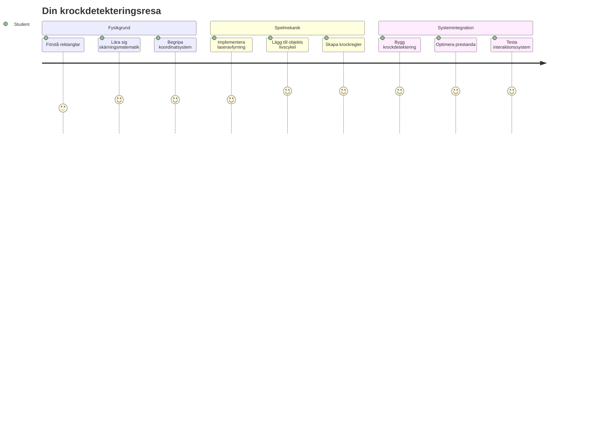
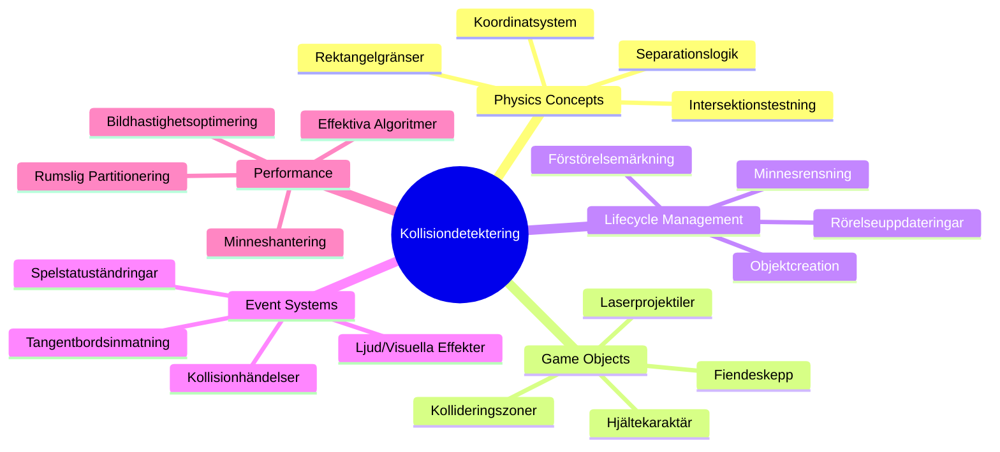
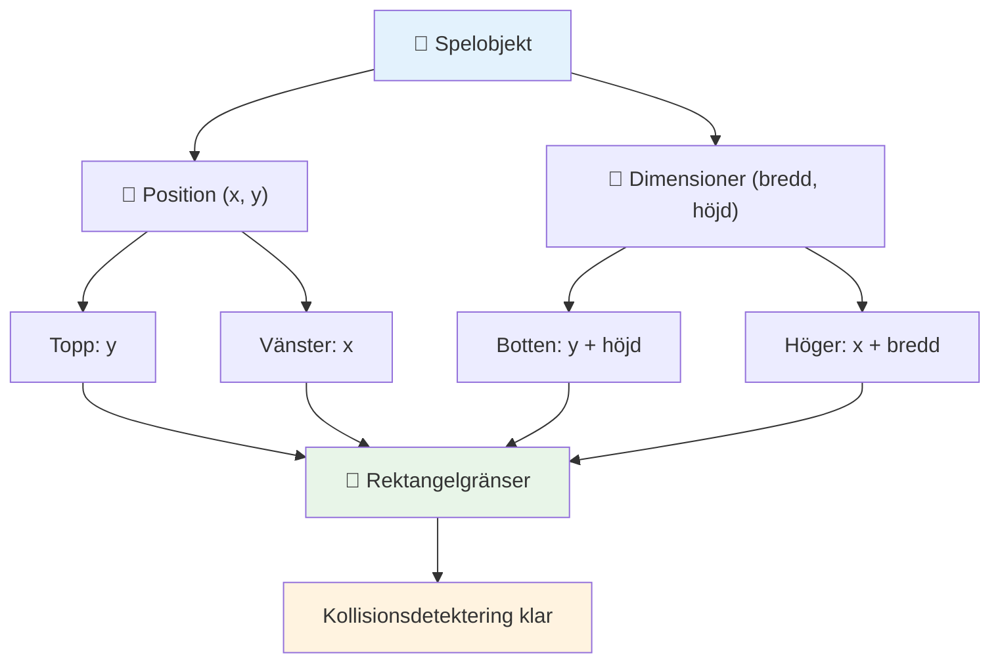
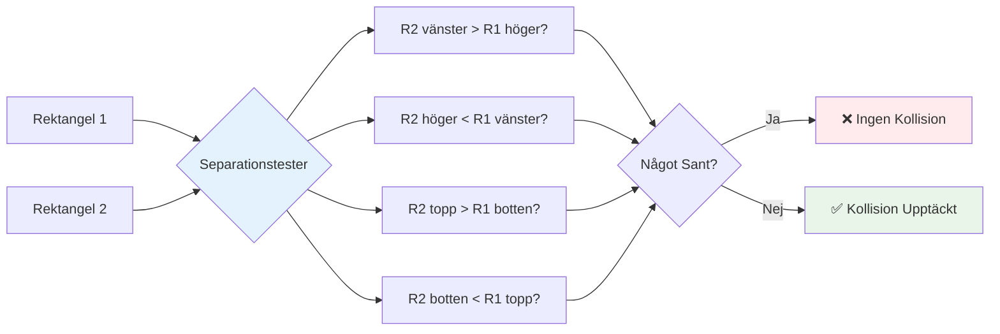
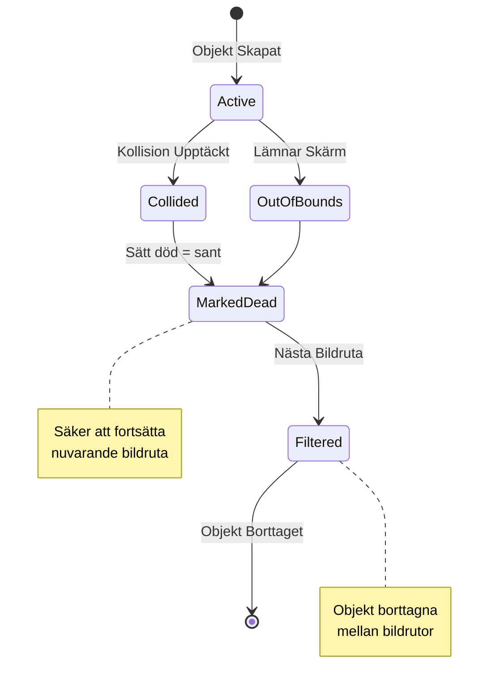
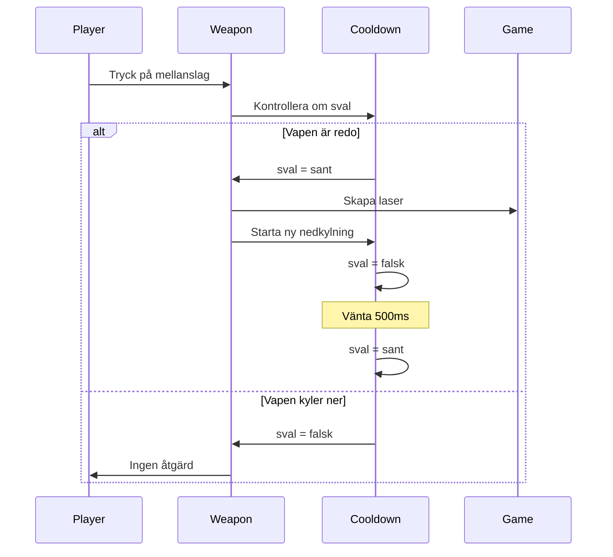
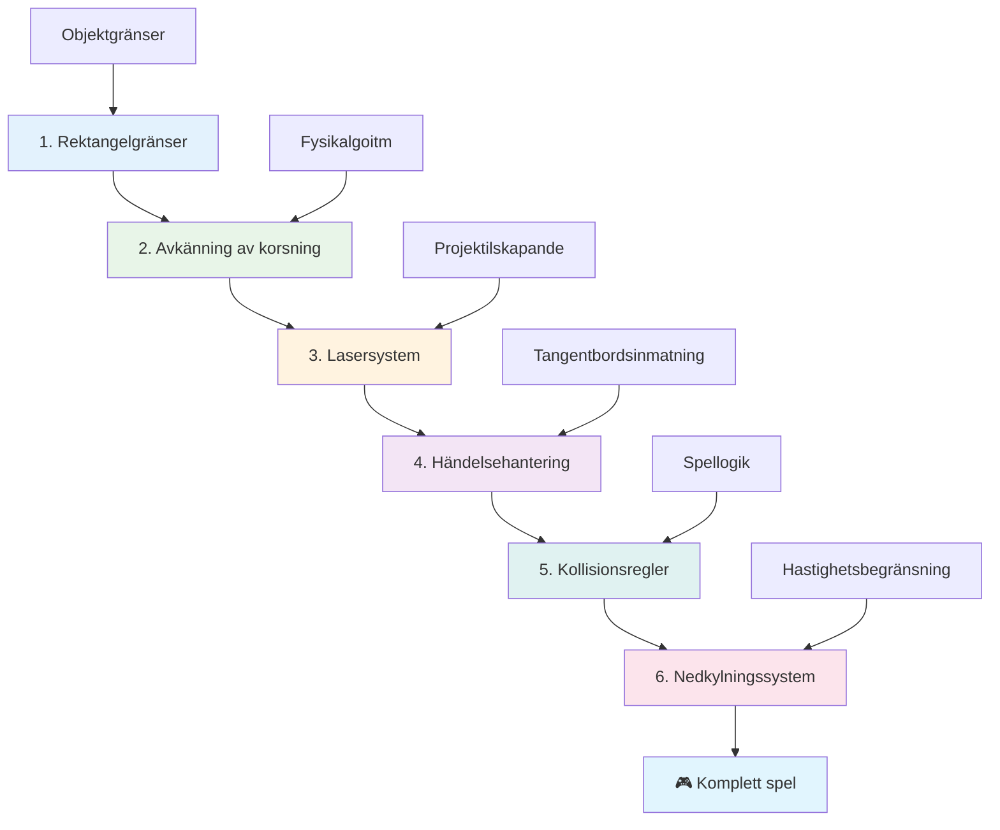
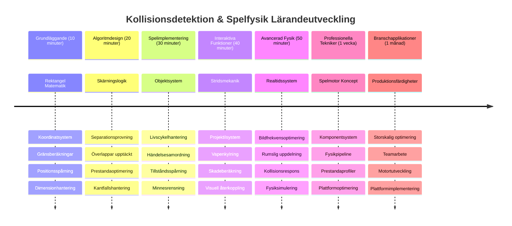

# Skapa ett rymdspel Del 4: Lägga till en laser och upptäcka kollisioner


## Förhandsquiz

[Förhandsquiz](https://ff-quizzes.netlify.app/web/quiz/35)

Tänk på ögonblicket i Star Wars när Lukes protontorpeder träffar Dödsstjärnans utsläppsport. Den exakta kollisionen förändrade galaxens öde! I spel fungerar kollisiondetektering på samma sätt – den avgör när objekt interagerar och vad som händer härnäst.

I den här lektionen kommer du att lägga till laser vapen till ditt rymdspel och implementera kollisiondetektering. Precis som NASAs uppdragsplanerare beräknar rymdfarkosters banor för att undvika rymdskräp, kommer du att lära dig att upptäcka när spelo objekt korsar varandra. Vi delar upp detta i hanterbara steg som bygger på varandra.

I slutet kommer du att ha ett fungerande stridssystem där lasrar förstör fiender och kollisioner triggar spelhändelser. Samma kollisionprinciper används i allt från fysiksimuleringar till interaktiva webgränssnitt.


✅ Gör lite research om det allra första datorspelet som någonsin skrevs. Vad hade det för funktionalitet?

## Kollisiondetektering

Kollisiondetektering fungerar som närhetssensorerna på Apollo månlandaren – den kontrollerar konstant avstånd och utlöser varningar när objekt kommer för nära varandra. I spel bestämmer detta system när objekt interagerar och vad som ska hända därefter.

Den metod vi använder behandlar varje spelo objekt som en rektangel, liknande hur flygtrafikstyrningar använder förenklade geometriska former för att följa flygplan. Denna rektangelmetod kan verka enkel, men den är beräkningsmässigt effektiv och fungerar bra för de flesta spelscenarier.

### Rektangelrepresentation

Varje spelo objekt behöver koordinerade gränser, likt hur Mars Pathfinder-rovern kartlade sin position på Mars yta. Så här definierar vi dessa gränskoordinater:


```javascript
rectFromGameObject() {
  return {
    top: this.y,
    left: this.x,
    bottom: this.y + this.height,
    right: this.x + this.width
  }
}
```

**Låt oss bryta ner detta:**
- **Övre kant**: Det är bara var objektet startar vertikalt (dess y-position)
- **Vänstra kant**: Var det startar horisontellt (dess x-position)
- **Nedre kant**: Lägg till höjden till y-positionen – nu vet du var det slutar!
- **Högra kant**: Lägg till bredden till x-positionen – och du har hela gränsen

### Intersektionsalgoritm

Att upptäcka rektangelintersektioner använder logik liknande hur Hubble-rumteleskopet avgör om himlakroppar överlappar i sitt synfält. Algoritmen kontrollerar separation:


```javascript
function intersectRect(r1, r2) {
  return !(r2.left > r1.right ||
    r2.right < r1.left ||
    r2.top > r1.bottom ||
    r2.bottom < r1.top);
}
```

**Separations-testet fungerar som radarsystem:**
- Är rektangel 2 helt till höger om rektangel 1?
- Är rektangel 2 helt till vänster om rektangel 1?
- Är rektangel 2 helt under rektangel 1?
- Är rektangel 2 helt ovanför rektangel 1?

Om inget av dessa villkor är sant måste rektanglarna överlappa. Denna metod speglar hur radaroperatörer avgör om två flygplan är på säkra avstånd.

## Hantering av objektlivscykler

När en laser träffar en fiende måste båda objekten tas bort från spelet. Att ta bort objekt mitt i en loop kan dock orsaka krascher – en lärdom som tidiga datorsystem som Apollo Guidance Computer fick lära sig på det hårda sättet. Istället använder vi en "markera för borttagning"-metod som säkert tar bort objekt mellan bildrutor.


Så här markerar vi något för borttagning:

```javascript
// Markera objekt för borttagning
enemy.dead = true;
```

**Varför denna metod fungerar:**
- Vi markerar objektet som "dött" men tar inte bort det direkt
- Detta låter den nuvarande bildrutan avslutas säkert
- Inga krascher från att försöka använda något som redan är borta!

Sedan filtrerar vi ut markerade objekt före nästa renderingscykel:

```javascript
gameObjects = gameObjects.filter(go => !go.dead);
```

**Vad denna filtrering gör:**
- Skapar en ny lista med bara "levande" objekt
- Slänger ut allt markerat som dött
- Håller spelet flytande smidigt
- Förhindrar minnesuppblåsning från ackumulerade förstörda objekt

## Implementera lasermekanik

Laserprojektiler i spel fungerar på samma princip som fotontorpeder i Star Trek – de är diskreta objekt som färdas i raka linjer tills de träffar något. Varje tryck på mellanslag skapar ett nytt laserobjekt som rör sig över skärmen.

För att detta ska fungera måste vi koordinera några olika delar:

**Viktiga komponenter att implementera:**
- **Skapa** laserobjekt som spawns från hjältens position
- **Hantera** tangentbordsinmatning för att utlösa laserskapande
- **Hantera** laserens rörelse och livscykel
- **Implementera** visuell representation för laserprojektilerna

## Implementera eldhastighetskontroll

Obegränsad eldhastighet skulle överbelasta spelmotorn och göra spelupplevelsen för enkel. Verkliga vapensystem möter liknande begränsningar – även USS Enterprises phasers behövde tid för att ladda om mellan skotten.

Vi implementerar ett återkopplingssystem som förhindrar snabbspamming samtidigt som kontrollerna förblir responsiva:


```javascript
class Cooldown {
  constructor(time) {
    this.cool = false;
    setTimeout(() => {
      this.cool = true;
    }, time);
  }
}

class Weapon {
  constructor() {
    this.cooldown = null;
  }
  
  fire() {
    if (!this.cooldown || this.cooldown.cool) {
      // Skapa laserprojektil
      this.cooldown = new Cooldown(500);
    } else {
      // Vapnet håller fortfarande på att svalna
    }
  }
}
```

**Hur återkopplingen fungerar:**
- När vapnet skapas börjar det "hett" (kan inte skjuta än)
- Efter tidsfördröjningen blir det "kallt" (redo att avfyra)
- Innan avfyrning kontrollerar vi: "Är vapnet kallt?"
- Detta förhindrar spamming men håller kontrollerna responsiva

✅ Se lektion 1 i rymdspelserien för att påminna dig om cooldowns.

## Bygga kollisionssystemet

Du kommer att bygga vidare på din existerande kod för rymdspelet för att skapa ett system för kollisiondetektering. Som Internationella rymdstationens automatiska kollisionsundvikningssystem, kommer ditt spel kontinuerligt övervaka objektpositioner och reagera på skärningspunkter.

Utifrån förra lektionens kod kommer du att lägga till kollisiondetektering med specifika regler som styr objektinteraktioner.

> 💡 **Proffstips**: Laserspriten finns redan i din mapp för tillgångar och refereras i din kod, redo att användas.

### Kollisionregler att implementera

**Spelmekaniker att lägga till:**
1. **Laser träffar fiende**: Fiende förstörs när den träffas av en laserprojektil
2. **Laser träffar skärmkant**: Laser tas bort när den når skärmens övre kant
3. **Fiende och hjälte kolliderar**: Båda objekten förstörs när de korsar varandra
4. **Fiende når botten**: Game over när fiender når skärmens botten

### 🔄 **Pedagogisk check-in**
**Grundläggande kollisiondetektering**: Innan du implementerar, säkerställ att du förstår:
- ✅ Hur rektangelgränser definierar kollisionszoner
- ✅ Varför separationstest är mer effektivt än beräkning av intersektion
- ✅ Vikten av objektlivscykelhantering i spel-loopar
- ✅ Hur händelsedrivna system koordinerar kollisionrespons

**Snabb självtest**: Vad skulle hända om du tog bort objekt omedelbart istället för att markera dem?
*Svar: Borttagning mitt i loopen kan orsaka krascher eller hoppa över objekt i iterationen*

**Fysikförståelse**: Du förstår nu:
- **Koordinatsystem**: Hur position och dimensioner skapar gränser
- **Intersektionslogik**: Matematiska principer bakom kollisiondetektering
- **Prestandaoptimering**: Varför effektiva algoritmer är viktiga i realtidssystem
- **Minneshantering**: Säkra objektlivscykel-mönster för stabilitet

## Ställa in din utvecklingsmiljö

God nyhet – vi har redan lagt grunden för dig! Alla dina speltillgångar och grundläggande struktur väntar i undermappen `your-work`, redo för dig att lägga till coola kollisionsfunktioner.

### Projektstruktur

```bash
-| assets
  -| enemyShip.png
  -| player.png
  -| laserRed.png
-| index.html
-| app.js
-| package.json
```

**Förstå filstrukturen:**
- **Innehåller** alla spritebilder som behövs för spelo objekten
- **Inkluderar** huvud-HTML-dokumentet och JavaScript-applikationsfilen
- **Tillhandahåller** paketkonfiguration för lokal utvecklingsserver

### Starta utvecklingsservern

Navigera till din projektmapp och starta den lokala servern:

```bash
cd your-work
npm start
```

**Denna kommandokedja:**
- **Byter** katalog till din arbetsmapp för projektet
- **Startar** en lokal HTTP-server på `http://localhost:5000`
- **Serverar** dina spelfiler för test och utveckling
- **Aktiverar** liveutveckling med automatisk omladdning

Öppna din webbläsare och navigera till `http://localhost:5000` för att se aktuellt speltillstånd med hjälten och fienderna renderade på skärmen.

### Steg-för-steg-implementering

Som den systematiska metoden NASA använde för att programmera Voyager-rymdfarkosten, kommer vi att implementera kollisiondetektering metodiskt, steg för steg, komponent för komponent.


#### 1. Lägg till rektangelkollisionsgränser

Först, låt oss lära våra spelo objekt att beskriva sina gränser. Lägg till denna metod i din `GameObject`-klass:

```javascript
rectFromGameObject() {
    return {
      top: this.y,
      left: this.x,
      bottom: this.y + this.height,
      right: this.x + this.width,
    };
  }
```

**Denna metod åstadkommer:**
- **Skapar** ett rektangelobjekt med exakta gränskoordinater
- **Beräknar** nederkant och högra kant med hjälp av position plus dimensioner
- **Returnerar** ett objekt redo för kollisiondetekteringsalgoritmer
- **Ger** ett standardiserat gränssnitt för alla spelo objekt

#### 2. Implementera intersektionsdetektering

Nu skapar vi vår kollisiondetektiv – en funktion som kan avgöra när två rektanglar överlappar:

```javascript
function intersectRect(r1, r2) {
  return !(
    r2.left > r1.right ||
    r2.right < r1.left ||
    r2.top > r1.bottom ||
    r2.bottom < r1.top
  );
}
```

**Denna algoritm fungerar genom att:**
- **Testar** fyra separationsvillkor mellan rektanglar
- **Returnerar** `false` om något separationsvillkor är sant
- **Indikerar** kollision när ingen separation finns
- **Använder** negationslogik för effektiv intersektionstestning

#### 3. Implementera laserskjutningssystem

Här blir det spännande! Låt oss sätta upp laserskjutningssystemet.

##### Meddelandekonstanter

Först definierar vi några meddelandetyper så att olika delar av spelet kan kommunicera med varandra:

```javascript
KEY_EVENT_SPACE: "KEY_EVENT_SPACE",
COLLISION_ENEMY_LASER: "COLLISION_ENEMY_LASER",
COLLISION_ENEMY_HERO: "COLLISION_ENEMY_HERO",
```

**Dessa konstanter ger:**
- **Standardiserar** händelsenamn i hela applikationen
- **Möjliggör** konsekvent kommunikation mellan spelsystem
- **Förhindrar** stavfel i registrering av event handlers

##### Tangentbordsinmatningshantering

Lägg till mellanslagstangentsdetektion i din key event listener:

```javascript
} else if(evt.keyCode === 32) {
  eventEmitter.emit(Messages.KEY_EVENT_SPACE);
}
```

**Denna input-hanterare:**
- **Upptäcker** tryck på mellanslag med keyCode 32
- **Sänder ut** ett standardiserat händelsemeddelande
- **Möjliggör** lösgjord skjutningslogik

##### Eventlyssnare setup

Registrera skjutbeteende i din `initGame()`-funktion:

```javascript
eventEmitter.on(Messages.KEY_EVENT_SPACE, () => {
 if (hero.canFire()) {
   hero.fire();
 }
});
```

**Denna eventlyssnare:**
- **Svarar** på mellanslagshändelser
- **Kontrollerar** skjutningens cooldown-status
- **Utlöser** laserskapande när tillåtet

Lägg till kollisionhantering för laser-fiende-interaktioner:

```javascript
eventEmitter.on(Messages.COLLISION_ENEMY_LASER, (_, { first, second }) => {
  first.dead = true;
  second.dead = true;
});
```

**Denna kollisionhanterare:**
- **Tar emot** kollisionhändelsedata med båda objekten
- **Markerar** båda objekten för borttagning
- **Säkerställer** korrekt städning efter kollision

#### 4. Skapa Laser-klassen

Implementera en laserprojektil som rör sig uppåt och hanterar sin egen livscykel:

```javascript
class Laser extends GameObject {
  constructor(x, y) {
    super(x, y);
    this.width = 9;
    this.height = 33;
    this.type = 'Laser';
    this.img = laserImg;
    
    let id = setInterval(() => {
      if (this.y > 0) {
        this.y -= 15;
      } else {
        this.dead = true;
        clearInterval(id);
      }
    }, 100);
  }
}
```

**Denna klassimplementering:**
- **Extenderar** GameObject för att ärva grundfunktionalitet
- **Sätter** lämpliga dimensioner för laserspriten
- **Skapar** automatisk uppåtrörelse med `setInterval()`
- **Hantera** självförstörelse när den når skärmens övre kant
- **Sköter** egen animationstid och städning

#### 5. Implementera kollisiondetekteringssystem

Skapa en omfattande kollisiondetekteringsfunktion:

```javascript
function updateGameObjects() {
  const enemies = gameObjects.filter(go => go.type === 'Enemy');
  const lasers = gameObjects.filter(go => go.type === "Laser");
  
  // Testa kollisioner mellan laser och fiender
  lasers.forEach((laser) => {
    enemies.forEach((enemy) => {
      if (intersectRect(laser.rectFromGameObject(), enemy.rectFromGameObject())) {
        eventEmitter.emit(Messages.COLLISION_ENEMY_LASER, {
          first: laser,
          second: enemy,
        });
      }
    });
  });

  // Ta bort förstörda objekt
  gameObjects = gameObjects.filter(go => !go.dead);
}
```

**Detta kollisionssystem:**
- **Filtrerar** spelo objekt efter typ för effektiv testning
- **Testar** varje laser mot varje fiende för överlappningar
- **Sänder** ut kollisionhändelser när överlapp upptäcks
- **Rensar** bort förstörda objekt efter kollisionshantering

> ⚠️ **Viktigt**: Lägg till `updateGameObjects()` i din huvudsakliga spel-loop i `window.onload` för att aktivera kollisiondetektering.

#### 6. Lägg till cooldown-system i Hero-klassen

Förbättra Hero-klassen med skjutmekaniker och taktsbegränsning:

```javascript
class Hero extends GameObject {
  constructor(x, y) {
    super(x, y);
    this.width = 99;
    this.height = 75;
    this.type = "Hero";
    this.speed = { x: 0, y: 0 };
    this.cooldown = 0;
  }
  
  fire() {
    gameObjects.push(new Laser(this.x + 45, this.y - 10));
    this.cooldown = 500;

    let id = setInterval(() => {
      if (this.cooldown > 0) {
        this.cooldown -= 100;
      } else {
        clearInterval(id);
      }
    }, 200);
  }
  
  canFire() {
    return this.cooldown === 0;
  }
}
```

**Förståelse för den förbättrade Hero-klassen:**
- **Initierar** cooldown-timer till noll (redo att skjuta)
- **Skapar** laserobjekt positionerade ovanför hjälteskeppet
- **Sätter** cooldown-period för att förhindra snabb eldning
- **Minskar** cooldown-timer med intervallbaserade uppdateringar
- **Ger** skjutningsstatuskontroll via `canFire()`-metoden

### 🔄 **Pedagogisk check-in**
**Fullständig systemförståelse**: Kontrollera din behärskning av kollisionssystemet:
- ✅ Hur gör rektangelgränser effektiv kollisiondetektering möjlig?
- ✅ Varför är objektlivscykelhantering kritisk för spelstabilitet?
- ✅ Hur förhindrar cooldown-systemet prestandaproblem?
- ✅ Vilken roll spelar händelsedriven arkitektur för kollisionshantering?

**Systemintegration**: Din kollisiondetektering visar:
- **Matematisk noggrannhet**: Algoritmer för rektangelintersektion
- **Prestandaoptimering**: Effektiva mönster för kollisionstestning
- **Minneshantering**: Säker objektkonstruktion och destruktion
- **Händelsekoordinering**: Lösgjort system för kommunikation
- **Realtidsbehandling**: Uppdateringscykler per bildruta

**Professionella mönster**: Du har implementerat:
- **Separation av ansvar**: Fysik, rendering och input åtskilda
- **Objektorienterad design**: Arv och polymorfism
- **Tillståndshantering**: Objektlivscykel och speltillståndsspårning
- **Prestandaoptimering**: Effektiva algoritmer för realtid

### Testa din implementation

Ditt rymdspel har nu komplett kollisiondetektering och stridsmekanik. 🚀 Testa dessa nya funktioner:
- **Navigera** med piltangenter för att verifiera rörelsekontroller
- **Skjut lasrar** med mellanslag – märk hur cooldown förhindrar spamming
- **Observera kollisioner** när lasrar träffar fiender, vilket triggar borttagning
- **Verifiera städning** när förstörda objekt försvinner från spelet

Du har framgångsrikt implementerat ett kollisiondetekteringssystem med samma matematiska principer som styr rymdfarkosters navigation och robotik.

### ⚡ **Vad du kan göra på de närmaste 5 minuterna**
- [ ] Öppna webbläsarens DevTools och sätt brytpunkter i din kollisionsdetekteringsfunktion
- [ ] Testa att ändra lasers hastighet eller fiendens rörelse för att se kollisions-effekter
- [ ] Experimentera med olika cooldown-värden för att testa skjuthastigheter
- [ ] Lägg till `console.log`-satser för att spåra kollisioner i realtid

### 🎯 **Vad du kan uppnå denna timme**
- [ ] Klara efter-lektionens quiz och förstå algoritmer för kollisiondetektion
- [ ] Lägg till visuella effekter som explosioner när kollisioner inträffar
- [ ] Implementera olika typer av projektiler med varierande egenskaper
- [ ] Skapa power-ups som tillfälligt förbättrar spelarens förmågor
- [ ] Lägg till ljudeffekter för att göra kollisioner mer tillfredsställande

### 📅 **Din vecko-långa fysikprogrammering**
- [ ] Klara hela rymdspelet med polerade kollisionssystem
- [ ] Implementera avancerade kollisionsformer utöver rektanglar (cirklar, polygoner)
- [ ] Lägg till partikelssystem för realistiska explosionseffekter
- [ ] Skapa komplex fiende-beteende med kollisionsundvikande
- [ ] Optimera kollisiondetektering för bättre prestanda vid många objekt
- [ ] Lägg till fysiksimulering som rörelsemängd och realistisk rörelse

### 🌟 **Din månads-långa mästerskap i spel-fysik**
- [ ] Bygg spel med avancerade fysikmotorer och realistiska simuleringar
- [ ] Lär dig 3D kollisiondetektion och rumslig partitionering algoritmer
- [ ] Bidra till open source fysikbibliotek och spelmotorer
- [ ] Bemästra prestandaoptimering för grafikintensiva applikationer
- [ ] Skapa utbildningsinnehåll om spel-fysik och kollisiondetektion
- [ ] Bygg en portfolio som visar avancerade fysikprogrammeringskunskaper

## 🎯 Din tidslinje för mästerskap i kollisiondetektion


### 🛠️ Din sammanfattning av verktygslådan för spel-fysik

Efter att ha fullföljt denna lektion har du nu behärskat:
- **Kollisionsmatematik**: Algoritmer för rektangelintersektion och koordinatsystem
- **Prestandaoptimering**: Effektiv kollisiondetektion för realtidsapplikationer
- **Objektlivscykelhantering**: Säkra mönster för skapande, uppdatering och förstöring
- **Händelsestyrd arkitektur**: Lös kopplade system för kollisionreaktion
- **Spelloop-integration**: Ram-baserade fysikuppdateringar och renderingskoordinering
- **Inmatningssystem**: Responsiva kontroller med taktbegränsning och feedback
- **Minneshantering**: Effektiva strategier för objektpoolning och städning

**Tillämpningar i verkliga världen**: Dina kollisiondetektionsfärdigheter tillämpas direkt på:
- **Interaktiva simuleringar**: Vetenskaplig modellering och utbildningsverktyg
- **Användargränssnittsdesign**: Dra-och-släpp-interaktioner och pekdetektion
- **Datavisualisering**: Interaktiva diagram och klickbara element
- **Mobilutveckling**: Rörelsedetektering och hantering av kollisioner på pekskärm
- **Robotprogrammering**: Ruttplanering och hinderundvikande
- **Datorgrafik**: Raytracing och rumsliga algoritmer

**Professionella färdigheter du fått**: Du kan nu:
- **Designa** effektiva algoritmer för realtids kollisiondetektion
- **Implementera** fysiksystem som skalar med objektkomplexitet
- **Avlusning** av komplexa interaktionssystem med hjälp av matematisk principer
- **Optimera** prestanda för olika hårdvaru- och webbläsarförmågor
- **Arkitektera** underhållbara spelsystem med beprövade designmönster

**Begrepp inom spelutveckling du behärskar**:
- **Fysiksimulering**: Realtids kollisiondetektion och respons
- **Prestandaingenjörskap**: Optimerade algoritmer för interaktiva applikationer
- **Händelsesystem**: Lös kopplad kommunikation mellan speldelar
- **Objekthantering**: Effektiva livscykelmönster för dynamiskt innehåll
- **Inmatningshantering**: Responsiva kontroller med lämplig återkoppling

**Nästa nivå**: Du är redo att utforska avancerade fysikmotorer som Matter.js, implementera 3D kollisiondetektion, eller bygga komplexa partikelsystem!

🌟 **Uppnått prestation**: Du har byggt ett komplett fysikbaserat interaktionssystem med professionell kollisiondetektion!

## GitHub Copilot Agent-utmaning 🚀

Använd agent-läget för att klara följande utmaning:

**Beskrivning:** Förbättra kollisiondetektionssystemet genom att implementera power-ups som spawnas slumpmässigt och ger tillfälliga förmågor när de samlas upp av hjälteskeppet.

**Prompt:** Skapa en PowerUp-klass som ärver från GameObject och implementera kollisiondetektion mellan hjälten och power-ups. Lägg till minst två typer av power-ups: en som ökar eldhastigheten (minskar cooldown) och en annan som skapar en tillfällig sköld. Inkludera spawn-logik som skapar power-ups vid slumpmässiga intervaller och positioner.

---


## 🚀 Utmaning

Lägg till en explosion! Ta en titt på spelresurserna i [the Space Art repo](../../../../6-space-game/solution/spaceArt/readme.txt) och försök lägga till en explosion när lasern träffar en alien

## Quiz efter föreläsningen

[Post-lecture quiz](https://ff-quizzes.netlify.app/web/quiz/36)

## Granskning & Självstudier

Experimentera med intervallerna i ditt spel hittills. Vad händer när du ändrar på dem? Läs mer om [JavaScript timing events](https://www.freecodecamp.org/news/javascript-timing-events-settimeout-and-setinterval/).

## Uppgift

[Utforska kollisioner](assignment.md)

---

<!-- CO-OP TRANSLATOR DISCLAIMER START -->
**Ansvarsfriskrivning**:
Detta dokument har översatts med hjälp av AI-översättningstjänsten [Co-op Translator](https://github.com/Azure/co-op-translator). Även om vi strävar efter noggrannhet, var vänlig notera att automatiska översättningar kan innehålla fel eller brister. Det ursprungliga dokumentet på dess modersmål bör betraktas som den auktoritativa källan. För kritisk information rekommenderas professionell mänsklig översättning. Vi ansvarar inte för eventuella missförstånd eller feltolkningar som uppstår till följd av användningen av denna översättning.
<!-- CO-OP TRANSLATOR DISCLAIMER END -->