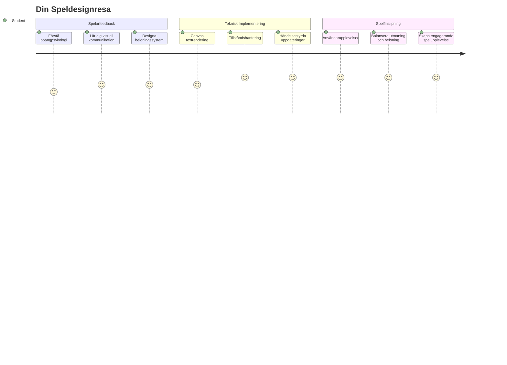
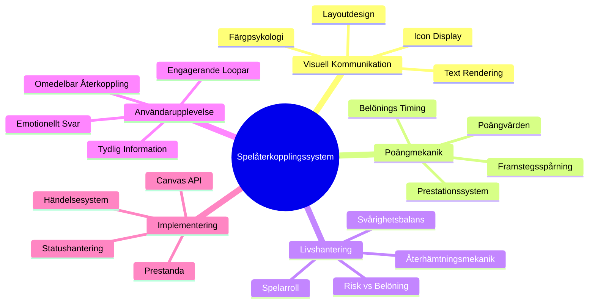
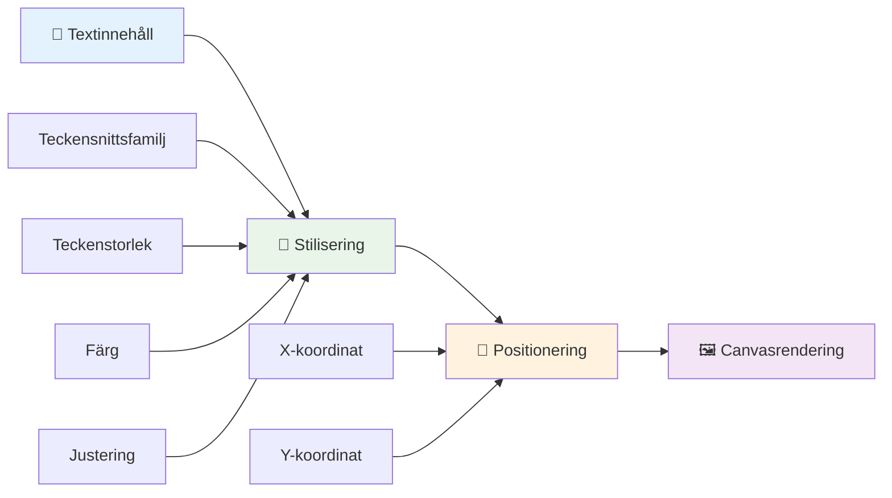
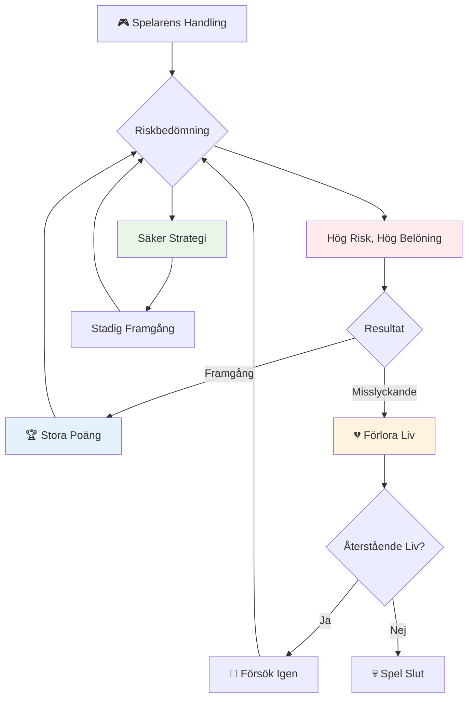
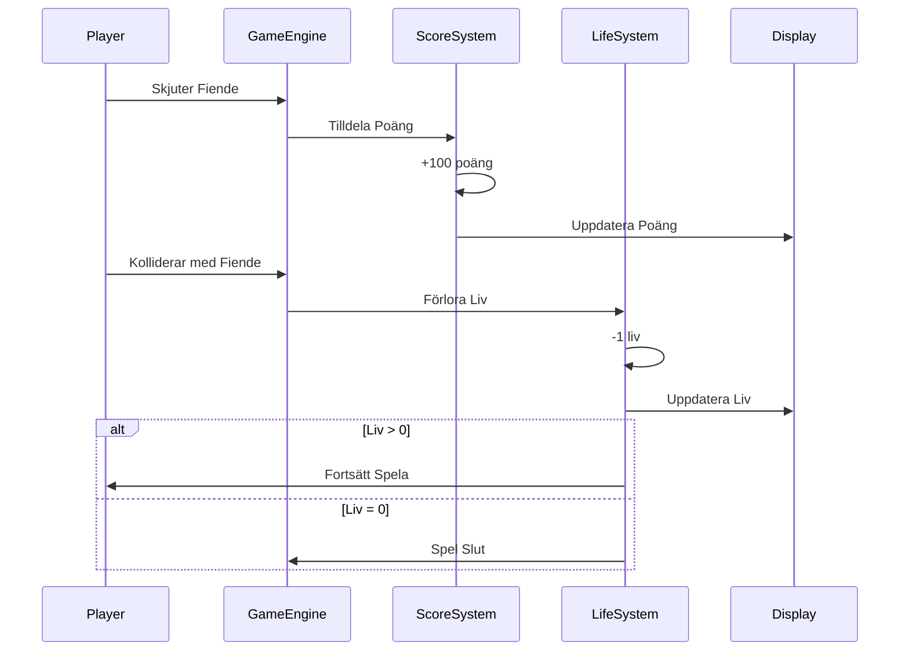
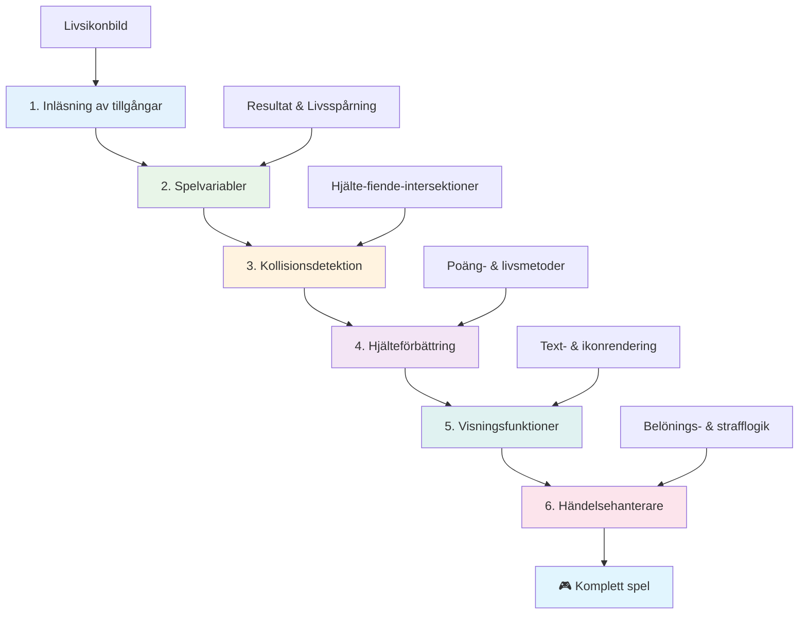
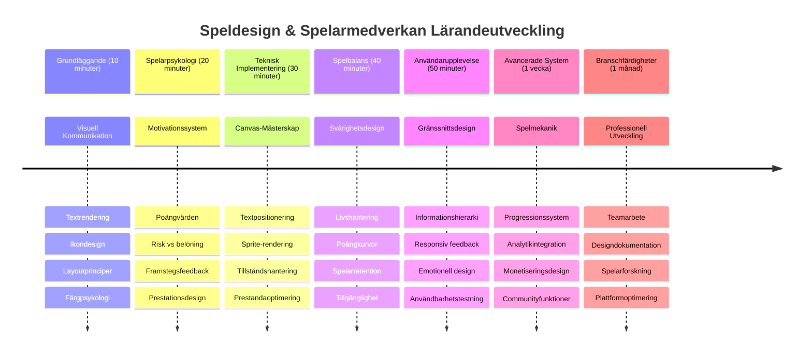

<!--
CO_OP_TRANSLATOR_METADATA:
{
  "original_hash": "2ed9145a16cf576faa2a973dff84d099",
  "translation_date": "2026-01-06T22:50:51+00:00",
  "source_file": "6-space-game/5-keeping-score/README.md",
  "language_code": "sv"
}
-->
# Bygg ett rymdspel Del 5: Poäng och Liv


## Quiz före föreläsningen

[Quiz före föreläsningen](https://ff-quizzes.netlify.app/web/quiz/37)

Redo att få ditt rymdspel att kännas som ett riktigt spel? Låt oss lägga till poängräkning och hantering av liv - kärnmekanikerna som förvandlade tidiga arkadspel som Space Invaders från enkla demonstrationer till beroendeframkallande underhållning. Här blir ditt spel verkligen spelbart.


## Rita text på skärmen - Ditt spels röst

För att visa din poäng behöver vi lära oss hur man renderar text på canvasen. Metoden `fillText()` är ditt huvudsakliga verktyg för detta - samma teknik som användes i klassiska arkadspel för att visa poäng och statusinformation.


Du har full kontroll över textens utseende:

```javascript
ctx.font = "30px Arial";
ctx.fillStyle = "red";
ctx.textAlign = "right";
ctx.fillText("show this on the screen", 0, 0);
```

✅ Fördjupa dig i [att lägga till text på en canvas](https://developer.mozilla.org/docs/Web/API/Canvas_API/Tutorial/Drawing_text) – du kan bli förvånad över hur kreativ du kan bli med teckensnitt och stil!

## Liv - Mer än bara ett nummer

I speldesign representerar ett "liv" spelarens marginal för misstag. Detta koncept går tillbaka till flipperspel där du fick flera bollar att spela med. I tidiga videospel som Asteroids gav liv spelare tillåtelse att ta risker och lära sig av misstag.


Visuell representation är mycket viktig – att visa skeppsikoner istället för bara "Liv: 3" skapar omedelbar visuell igenkänning, liknande hur tidiga arkadmaskiner använde ikonografi för att kommunicera över språkbarriärer.

## Att bygga ditt spels belöningssystem

Nu implementerar vi de grundläggande återkopplingssystemen som håller spelarna engagerade:


- **Poängsystem**: Varje förstört fiendeskepp ger 100 poäng (runda siffror är lättare för spelare att räkna mental). Poängen visas i nedre vänstra hörnet.
- **Livräknare**: Din hjälte börjar med tre liv – en standard satt av tidiga arkadspel för att balansera utmaning och spelbarhet. Varje kollision med en fiende kostar ett liv. Vi visar återstående liv nere till höger med skeppsikoner .

## Nu kör vi igång!

Börja med att ställa in din arbetsyta. Navigera till filerna i din `your-work` undermapp. Du bör se dessa filer:

```bash
-| assets
  -| enemyShip.png
  -| player.png
  -| laserRed.png
-| index.html
-| app.js
-| package.json
```

För att testa ditt spel, starta utvecklingsservern från mappen `your_work`:

```bash
cd your-work
npm start
```

Detta kör en lokal server på `http://localhost:5000`. Öppna denna adress i din webbläsare för att se ditt spel. Testa kontrollerna med piltangenterna och prova att skjuta fiender för att verifiera att allt fungerar.


### Dags att koda!

1. **Hämta de visuella resurser du behöver**. Kopiera resursen `life.png` från mappen `solution/assets/` till din `your-work`-mapp. Lägg sedan till lifeImg i din window.onload-funktion:

    ```javascript
    lifeImg = await loadTexture("assets/life.png");
    ```

1. Glöm inte att lägga till `lifeImg` i din resurslista:

    ```javascript
    let heroImg,
    ...
    lifeImg,
    ...
    eventEmitter = new EventEmitter();
    ```
  
2. **Ställ in dina spelvariabler**. Lägg till kod för att följa din totala poäng (börjar på 0) och återstående liv (börjar på 3). Vi visar dessa på skärmen så att spelarna alltid vet hur de ligger till.

3. **Implementera kollisionsdetektion**. Utöka din `updateGameObjects()`-funktion för att upptäcka när fiender kolliderar med din hjälte:

    ```javascript
    enemies.forEach(enemy => {
        const heroRect = hero.rectFromGameObject();
        if (intersectRect(heroRect, enemy.rectFromGameObject())) {
          eventEmitter.emit(Messages.COLLISION_ENEMY_HERO, { enemy });
        }
      })
    ```

4. **Lägg till livs- och poängräkning till din hjälte**. 
   1. **Initiera räknarna**. Under `this.cooldown = 0` i din `Hero`-klass, sätt upp liv och poäng:

        ```javascript
        this.life = 3;
        this.points = 0;
        ```

   1. **Visa dessa värden för spelaren**. Skapa funktioner som ritar dessa värden på skärmen:

        ```javascript
        function drawLife() {
          // ATT GÖRA, 35, 27
          const START_POS = canvas.width - 180;
          for(let i=0; i < hero.life; i++ ) {
            ctx.drawImage(
              lifeImg, 
              START_POS + (45 * (i+1) ), 
              canvas.height - 37);
          }
        }
        
        function drawPoints() {
          ctx.font = "30px Arial";
          ctx.fillStyle = "red";
          ctx.textAlign = "left";
          drawText("Points: " + hero.points, 10, canvas.height-20);
        }
        
        function drawText(message, x, y) {
          ctx.fillText(message, x, y);
        }

        ```

   1. **Koppla allt i din spelloop**. Lägg till dessa funktioner i din window.onload-funktion precis efter `updateGameObjects()`:

        ```javascript
        drawPoints();
        drawLife();
        ```

### 🔄 **Pedagogisk avstämning**
**Förståelse för speldesign**: Innan du implementerar konsekvenser, säkerställ att du förstår:
- ✅ Hur visuell återkoppling kommunicerar spelstatus till spelare
- ✅ Varför konsekvent placering av UI-element förbättrar användbarhet
- ✅ Psykologin bakom poängvärden och livshantering
- ✅ Hur canvas-text rendering skiljer sig från HTML-text

**Snabb självtest**: Varför använder arkadspel vanligtvis runda siffror för poängvärden?
*Svar: Runda siffror är lättare för spelare att räkna mentalt och skapar tillfredsställande psykologiska belöningar*

**Principer för användarupplevelse**: Du tillämpar nu:
- **Visuell hierarki**: Viktig information positionerad framträdande
- **Omedelbar återkoppling**: Uppdatering i realtid av spelarens handlingar
- **Kognitiv belastning**: Enkel, tydlig informationspresentation
- **Emotionell design**: Ikoner och färger som skapar koppling till spelaren

1. **Implementera spelkonsekvenser och belöningar**. Nu lägger vi till återkopplingssystemen som gör spelarens handlingar meningsfulla:

   1. **Kollisioner kostar liv**. Varje gång din hjälte kraschar in i en fiende, ska du tappa ett liv.
   
      Lägg till denna metod i din `Hero`-klass:

        ```javascript
        decrementLife() {
          this.life--;
          if (this.life === 0) {
            this.dead = true;
          }
        }
        ```

   2. **Skjuta fiender ger poäng**. Varje lyckad träff ger 100 poäng och ger omedelbar positiv återkoppling för träffsäkert skjutande.

      Utöka din Hero-klass med denna ökningsmetod:
    
        ```javascript
          incrementPoints() {
            this.points += 100;
          }
        ```

        Koppla nu dessa funktioner till dina kollisionsevent:

        ```javascript
        eventEmitter.on(Messages.COLLISION_ENEMY_LASER, (_, { first, second }) => {
           first.dead = true;
           second.dead = true;
           hero.incrementPoints();
        })

        eventEmitter.on(Messages.COLLISION_ENEMY_HERO, (_, { enemy }) => {
           enemy.dead = true;
           hero.decrementLife();
        });
        ```

✅ Nyfiken på andra spel byggda med JavaScript och Canvas? Utforska lite – du kan bli förvånad över vad som är möjligt!

Efter att ha implementerat dessa funktioner, testa ditt spel för att se hela återkopplingssystemet i aktion. Du bör se livsikoner nere till höger, din poäng nere till vänster, och se hur kollisioner minskar liv medan lyckade skott ökar poängen.

Ditt spel har nu de väsentliga mekaniker som gjorde tidiga arkadspel så engagerande – tydliga mål, omedelbar återkoppling och meningsfulla konsekvenser för spelarens handlingar.

### 🔄 **Pedagogisk avstämning**
**Komplett speldesignsystem**: Verifiera din förståelse för återkopplingssystem för spelare:
- ✅ Hur skapar poängmekaniker motivation och engagemang?
- ✅ Varför är visuell konsistens viktig för användargränssnitt?
- ✅ Hur balanserar livssystemet utmaning med spelarretention?
- ✅ Vilken roll spelar omedelbar återkoppling för tillfredsställande gameplay?

**Systemintegration**: Ditt återkopplingssystem visar:
- **Användarupplevelsedesign**: Tydlig visuell kommunikation och informationshierarki
- **Händelsestyrd arkitektur**: Responsiva uppdateringar på spelarhandlingar
- **Styrning av tillstånd**: Spårning och visning av dynamisk speldata
- **Canvas-kunskap**: Textrendering och sprite-positionering
- **Spelpsykologi**: Förståelse för spelarmotivation och engagemang

**Professionella mönster**: Du har implementerat:
- **MVC-arkitektur**: Separation av spel-logik, data och presentation
- **Observermönster**: Händelsestyrda uppdateringar av spelstatus
- **Komponentdesign**: Återanvändbara funktioner för rendering och logik
- **Prestandaoptimering**: Effektiv rendering i spelloopen

### ⚡ **Vad du kan göra på nästa 5 minuter**
- [ ] Experimentera med olika teckenstorlekar och färger för poängvisningen
- [ ] Försök ändra poängvärdena och se hur det påverkar spelkänslan
- [ ] Lägg till console.log-satser för att spåra när poäng och liv ändras
- [ ] Testa kantfall som att gå tom på liv eller nå höga poäng

### 🎯 **Vad du kan uppnå på denna timme**
- [ ] Klara quizet efter lektionen och förstå speldesignpsykologi
- [ ] Lägg till ljudeffekter för poäng och livsförlust
- [ ] Implementera ett highscore-system med localStorage
- [ ] Skapa olika poängvärden för olika fiendetyper
- [ ] Lägg till visuella effekter som skakning av skärmen vid livsförlust

### 📅 **Din veckolånga speldesignresa**
- [ ] Slutför hela rymdspelet med polerade återkopplingssystem
- [ ] Implementera avancerade poängmekaniker som combo-multiplikatorer
- [ ] Lägg till prestationer och upplåsbart innehåll
- [ ] Skapa svårighetsprogression och balanseringssystem
- [ ] Designa användargränssnitt för menyer och spel-slut-skärmar
- [ ] Studera andra spel för att förstå engagemangsmetoder

### 🌟 **Din månadslånga spelskapande-expertis**
- [ ] Bygg kompletta spel med sofistikerade progressionssystem
- [ ] Lär dig spelanalys och spelarbeteende-mätning
- [ ] Bidra till open source spelskapandeprojekt
- [ ] Bemästra avancerade speldesignmönster och monetarisering
- [ ] Skapa pedagogiskt innehåll om speldesign och användarupplevelse
- [ ] Bygg en portfolio som visar speldesign- och utvecklingsfärdigheter

## 🎯 Din tidslinje för speldesignexpertis


### 🛠️ Sammanfattning av din speldesignverktygslåda

Efter denna lektion har du nu behärskat:
- **Spelarpsykologi**: Förstå motivation, risk/belöning och engagemangsloopar
- **Visuell kommunikation**: Effektiv UI-design med text, ikoner och layout
- **Återkopplingssystem**: Realtidsrespons på spelarhandlingar och spelevent
- **Styrning av tillstånd**: Effektiv spårning och visning av dynamisk speldata
- **Textrendering på canvas**: Professionell textvisning med stil och positionering
- **Händelseintegration**: Koppla användarhandlingar till meningsfulla spelkonsekvenser
- **Spelbalans**: Design av svårighetskurvor och spelarprogression

**Tillämpningar i verkliga världen**: Dina speldesignfärdigheter används direkt för:
- **Användargränssnittsdesign**: Skapa engagerande och intuitiva gränssnitt
- **Produktutveckling**: Förstå användarmotivation och återkopplingsloopar
- **Pedagogisk teknik**: Gamifiering och lärandeengagemangssystem
- **Datavisualisering**: Göra komplex information tillgänglig och engagerande
- **Mobilapputveckling**: Retentionsmekaniker och användarupplevelsedesign
- **Marknadsföringsteknologi**: Förstå användarbeteende och konverteringsoptimering

**Professionella färdigheter du fått**: Du kan nu:
- **Designa** användarupplevelser som motiverar och engagerar
- **Implementera** återkopplingssystem som styr användarbeteende effektivt
- **Balansera** utmaning och tillgänglighet i interaktiva system
- **Skapa** visuell kommunikation som fungerar över olika användargrupper
- **Analysera** användarbeteende och iterera designförbättringar

**Spelutvecklingskoncept du behärskar**:
- **Spelarmotivation**: Förstå vad som driver engagemang och retention
- **Visuell design**: Skapa tydliga, attraktiva och funktionella gränssnitt
- **Systemintegration**: Koppla samman flera spelsystem för en sammanhållen upplevelse
- **Prestandaoptimering**: Effektiv rendering och tillståndshantering
- **Tillgänglighet**: Designa för olika färdighetsnivåer och spelarens behov

**Nästa nivå**: Du är redo att utforska avancerade speldesignmönster, implementera analystjänster eller studera spelmonetarisering och spelarretention!

🌟 **Uppnått**: Du har byggt ett komplett återkopplingssystem för spelare med professionella speldesignprinciper!

---

## GitHub Copilot Agent-utmaning 🚀

Använd Agent-läget för att klara följande utmaning:

**Beskrivning:** Förbättra rymdspelets poängsystem genom att implementera ett highscore-system med ihållande lagring och bonussystem för poäng.

**Prompt:** Skapa ett highscore-system som sparar spelarens bästa poäng i localStorage. Lägg till bonuspoäng för konsekutiva fiendedöd (combo-system) och implementera olika poängvärden för olika fiendetyper. Inkludera en visuell indikator när spelaren når ett nytt highscore och visa aktuell highscore på spelskärmen.


## 🚀 Utmaning

Du har nu ett fungerande spel med poäng och liv. Fundera på vilka ytterligare funktioner som kan förbättra spelarupplevelsen.

## Quiz efter föreläsningen

[Quiz efter föreläsningen](https://ff-quizzes.netlify.app/web/quiz/38)

## Översikt & Självstudier

Vill du utforska mer? Undersök olika metoder för poängräkning och livssystem i spel. Det finns fascinerande spelmotorer där ute som [PlayFab](https://playfab.com) som hanterar poäng, topplistor och spelarprogression. Hur kan integration av något sådant ta ditt spel till nästa nivå?

## Uppgift

[Bygg ett poängspel](assignment.md)

---

<!-- CO-OP TRANSLATOR DISCLAIMER START -->
**Ansvarsfriskrivning**:
Detta dokument har översatts med hjälp av AI-översättningstjänsten [Co-op Translator](https://github.com/Azure/co-op-translator). Även om vi strävar efter noggrannhet, vänligen var medveten om att automatiska översättningar kan innehålla fel eller brister. Det ursprungliga dokumentet på dess modersmål ska betraktas som den auktoritativa källan. För kritisk information rekommenderas professionell mänsklig översättning. Vi ansvarar inte för eventuella missförstånd eller feltolkningar som uppstår genom användning av denna översättning.
<!-- CO-OP TRANSLATOR DISCLAIMER END -->