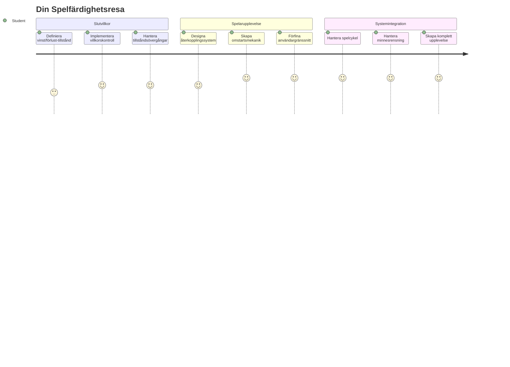
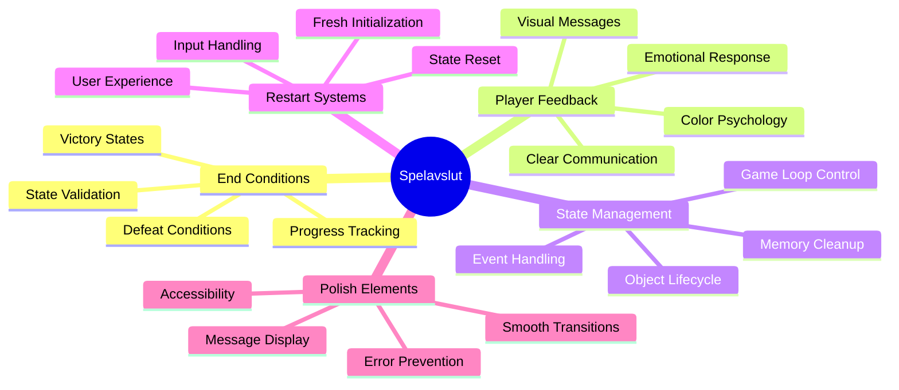
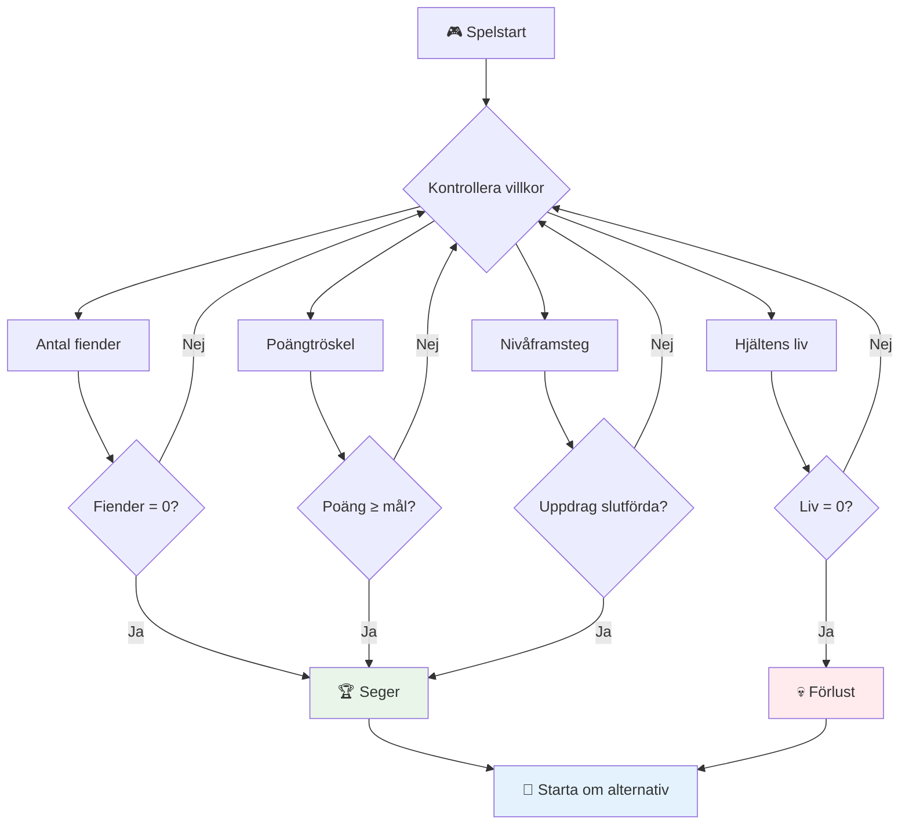
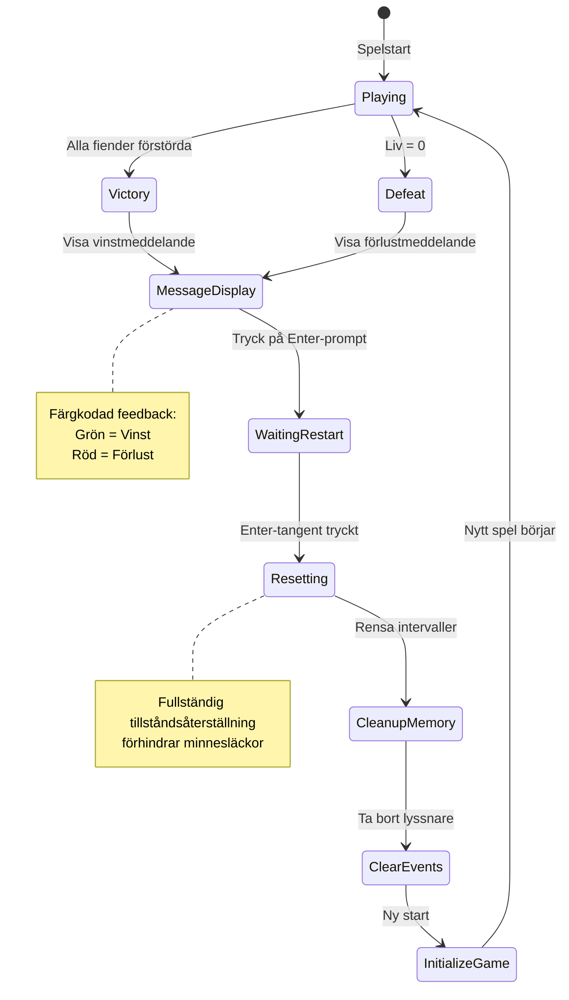
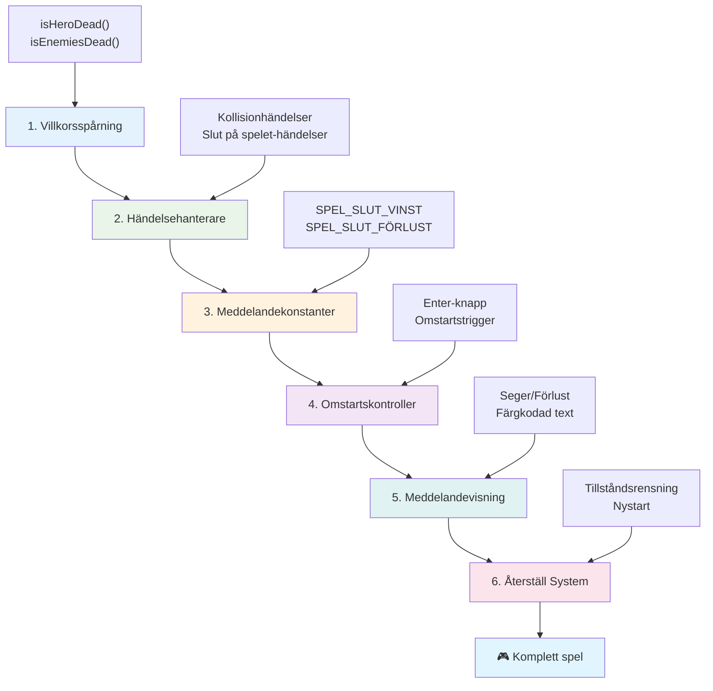
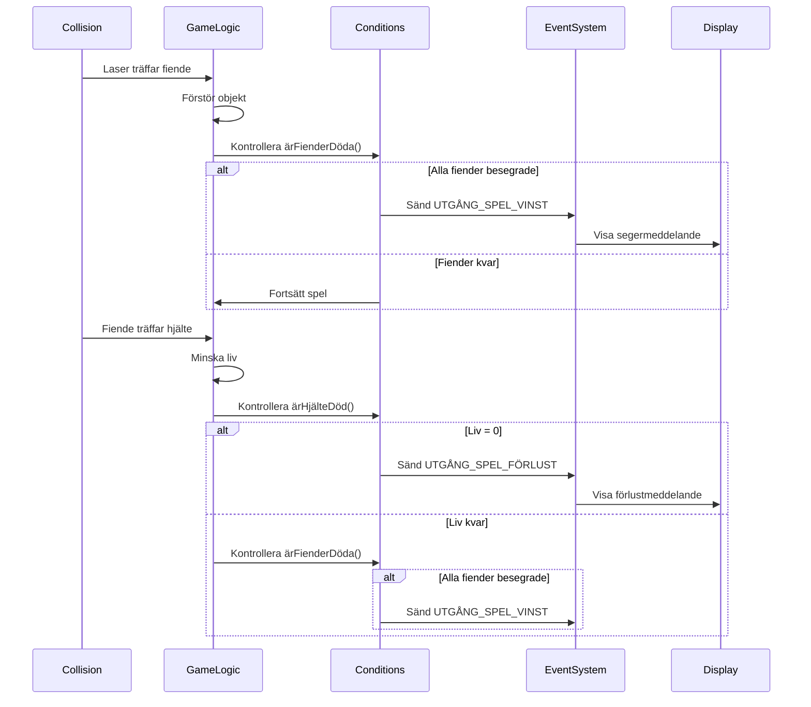
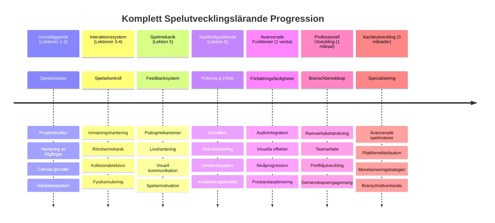

<!--
CO_OP_TRANSLATOR_METADATA:
{
  "original_hash": "a4b78043f4d64bf3ee24e0689b8b391d",
  "translation_date": "2026-01-06T22:49:28+00:00",
  "source_file": "6-space-game/6-end-condition/README.md",
  "language_code": "sv"
}
-->
# Bygg ett rymdspel Del 6: Slut och omstart


Varje fantastiskt spel behöver tydliga slutvillkor och en smidig mekanism för omstart. Du har byggt ett imponerande rymdspel med rörelse, strider och poängräkning – nu är det dags att lägga till de sista bitarna som får det att kännas komplett.

Ditt spel körs för närvarande oändligt, som Voyager-sonderna som NASA skickade ut 1977 – som fortfarande färdas i rymden decennier senare. Det är okej för rymdutforskning, men spel behöver definierade slutpunkter för att skapa tillfredsställande upplevelser.

Idag ska vi implementera riktiga vinst- och förlustvillkor samt ett omstartsystem. I slutet av denna lektion kommer du ha ett polerat spel som spelare kan klara av och spela om, precis som de klassiska arkadspelen som definierade mediet.


## För-föreläsningsquiz

[För-föreläsningsquiz](https://ff-quizzes.netlify.app/web/quiz/39)

## Förstå spelens slutvillkor

När ska ditt spel ta slut? Denna grundläggande fråga har format speldesign sedan den tidiga arkaderan. Pac-Man slutar när du blir fångad av spöken eller rensar alla prickar, medan Space Invaders slutar när utomjordingar når botten eller du förstör dem alla.

Som spillets skapare definierar du seger- och förlustvillkoren. För vårt rymdspel finns här beprövade tillvägagångssätt som skapar engagerande spelupplevelser:


- **`N` fiendeskepp har förstörts**: Det är ganska vanligt om du delar upp ett spel i olika nivåer att du behöver förstöra `N` fiendeskepp för att klara en nivå  
- **Ditt skepp har förstörts**: Det finns definitivt spel där du förlorar om ditt skepp förstörs. En annan vanlig metod är att du har begreppet liv. Varje gång ditt skepp förstörs dras ett liv bort. När alla liv är förbrukade förlorar du spelet.  
- **Du har samlat `N` poäng**: Ett annat vanligt slutvillkor är att du ska samla poäng. Hur du får poäng är upp till dig, men det är vanligt att tilldela poäng för olika aktiviteter såsom att förstöra ett fiendeskepp eller samla föremål som *faller* när de förstörs.  
- **Klart en nivå**: Detta kan involvera flera villkor såsom att `X` fiendeskepp förstörts, `Y` poäng samlats in eller kanske att ett specifikt föremål har samlats in.

## Implementera funktionalitet för omstart av spelet

Bra spel uppmuntrar till upprepning genom smidiga omstartsmekanismer. När spelare klarar ett spel (eller förlorar) vill de ofta prova direkt igen – vare sig det är för att slå sin poäng eller förbättra sin prestation.


Tetris är ett perfekt exempel: när dina block når toppen kan du omedelbart starta ett nytt spel utan att navigera i komplicerade menyer. Vi ska bygga ett liknande omstartssystem som rent återställer spelstatusen och snabbt får spelarna tillbaka i spelet.

✅ **Reflektion**: Tänk på spelen du har spelat. Under vilka villkor slutar de, och hur blir du uppmanad att starta om? Vad gör att en omstart känns smidig istället för frustrerande?

## Vad du kommer att bygga

Du kommer att implementera de sista funktionerna som förvandlar ditt projekt till en komplett spelupplevelse. Dessa element skiljer polerade spel från grundläggande prototyper.

**Här är vad vi lägger till idag:**

1. **Vinstvillkor**: Spräng alla fiender och få en riktig firande (det har du förtjänat!)  
2. **Förlustvillkor**: Sluta på liv och möt ödet med en förlustskärm  
3. **Omstartsmekanism**: Tryck på Enter för att hoppa in igen – eftersom ett spel aldrig är nog  
4. **Tillståndshantering**: Rent bord varje gång – inga kvarvarande fiender eller konstiga buggar från föregående spel

## Kom igång

Låt oss förbereda din utvecklingsmiljö. Du bör ha alla dina rymdspelsfiler från föregående lektioner redo.

**Ditt projekt ska se ut ungefär så här:**

```bash
-| assets
  -| enemyShip.png
  -| player.png
  -| laserRed.png
  -| life.png
-| index.html
-| app.js
-| package.json
```

**Starta din utvecklingsserver:**

```bash
cd your-work
npm start
```

**Det här kommandot:**
- Kör en lokal server på `http://localhost:5000`  
- Serverar dina filer korrekt  
- Uppdaterar automatiskt när du gör ändringar

Öppna `http://localhost:5000` i din webbläsare och verifiera att spelet körs. Du ska kunna röra dig, skjuta och interagera med fiender. När detta är bekräftat kan vi fortsätta med implementeringen.

> 💡 **Tips**: För att undvika varningar i Visual Studio Code, deklarera `gameLoopId` i toppen av din fil som `let gameLoopId;` istället för att deklarera den inuti funktionen `window.onload`. Detta följer moderna bästa praxis för variabeldeklaration i JavaScript.


## Implementeringssteg

### Steg 1: Skapa funktioner för att bevaka slutvillkor

Vi behöver funktioner som övervakar när spelet ska ta slut. Precis som sensorer på Internationella rymdstationen som konstant monitorerar kritiska system, kommer dessa funktioner att kontinuerligt kontrollera spelsituationen.

```javascript
function isHeroDead() {
  return hero.life <= 0;
}

function isEnemiesDead() {
  const enemies = gameObjects.filter((go) => go.type === "Enemy" && !go.dead);
  return enemies.length === 0;
}
```

**Så här fungerar det bakom kulisserna:**
- **Kontrollerar** om vår hjälte har slut på liv (aj!)  
- **Räknar** hur många fiender som fortfarande lever och strider  
- **Returnerar** `true` när slagfältet är fritt från fiender  
- **Använder** enkel true/false-logik för att hålla det lättförståeligt  
- **Filtrerar** igenom alla spelföremål för att hitta överlevarna

### Steg 2: Uppdatera händelsehanterare för slutvillkor

Nu kopplar vi samman dessa villkorskontroller till spelets händelsessystem. Varje gång en kollision inträffar utvärderar spelet om det triggar ett slutvillkor. Detta ger omedelbar respons vid viktiga spelhändelser.


```javascript
eventEmitter.on(Messages.COLLISION_ENEMY_LASER, (_, { first, second }) => {
    first.dead = true;
    second.dead = true;
    hero.incrementPoints();

    if (isEnemiesDead()) {
      eventEmitter.emit(Messages.GAME_END_WIN);
    }
});

eventEmitter.on(Messages.COLLISION_ENEMY_HERO, (_, { enemy }) => {
    enemy.dead = true;
    hero.decrementLife();
    if (isHeroDead())  {
      eventEmitter.emit(Messages.GAME_END_LOSS);
      return; // förlust före seger
    }
    if (isEnemiesDead()) {
      eventEmitter.emit(Messages.GAME_END_WIN);
    }
});

eventEmitter.on(Messages.GAME_END_WIN, () => {
    endGame(true);
});
  
eventEmitter.on(Messages.GAME_END_LOSS, () => {
  endGame(false);
});
```

**Det som händer här är:**
- **Laser träffar fiende**: Båda försvinner, du får poäng och vi kollar om du vunnit  
- **Fiende träffar dig**: Du förlorar ett liv, och vi kollar om du är kvar vid liv  
- **Smart ordning**: Vi kollar förlust först (ingen vill vinna och förlora samtidigt!)  
- **Omedelbara reaktioner**: Så fort något viktigt händer vet spelet om det

### Steg 3: Lägg till nya meddelandekonstanter

Du behöver lägga till nya meddelandetyper i ditt `Messages`-konstantsobjekt. Dessa konstanter hjälper till att hålla konsekvens och förebygga stavfel i händelsessystemet.

```javascript
GAME_END_LOSS: "GAME_END_LOSS",
GAME_END_WIN: "GAME_END_WIN",
```

**I ovanstående har vi:**
- **Lagt till** konstanter för spel-slut-händelser för konsekvens  
- **Använt** beskrivande namn som tydligt visar vad händelsen gäller  
- **Följt** befintligt namngivningsmönster för meddelandetyper

### Steg 4: Implementera omstartskontroller

Nu lägger du till tangentbordsstyrning som låter spelare starta om spelet. Enter-tangenten är ett naturligt val eftersom den vanligtvis förknippas med att bekräfta och starta nya spel.

**Lägg till upptäckt av Enter-tangenten i din befintliga keydown-händelselyssnare:**

```javascript
else if(evt.key === "Enter") {
   eventEmitter.emit(Messages.KEY_EVENT_ENTER);
}
```

**Lägg till den nya meddelandekonstanten:**

```javascript
KEY_EVENT_ENTER: "KEY_EVENT_ENTER",
```

**Det du behöver veta:**
- **Utökar** ditt befintliga tangentbords-händelsehanteringssystem  
- **Använder** Enter-tangenten som omstart-trigg för intuitiv användarupplevelse  
- **Skickar ut** en anpassad händelse som andra delar i spelet kan lyssna på  
- **Behåller** samma mönster som dina andra tangentbordsstyrningar

### Steg 5: Skapa meddelandesystemet

Ditt spel måste tydligt kommunicera resultat till spelarna. Vi skapar ett meddelandesystem som visar vinst- och förluststatus med färgkodad text, liknande terminalgränssnitt från tidiga datorsystem där grönt betydde framgång och rött signalerade fel.

**Skapa funktionen `displayMessage()`:**

```javascript
function displayMessage(message, color = "red") {
  ctx.font = "30px Arial";
  ctx.fillStyle = color;
  ctx.textAlign = "center";
  ctx.fillText(message, canvas.width / 2, canvas.height / 2);
}
```

**Steg för steg, så här fungerar det:**
- **Sätter** teckenstorlek och fontfamilj för klar och läsbar text  
- **Använder** en färgparameter med "red" som standard för varningar  
- **Centrerar** texten horisontellt och vertikalt på canvas  
- **Använder** moderna JavaScript-standardparametrar för flexibel färgval  
- **Utnyttjar** canvas 2D-kontekst för direkt textrendering

**Skapa funktionen `endGame()`:**

```javascript
function endGame(win) {
  clearInterval(gameLoopId);

  // Ställ in en fördröjning för att säkerställa att eventuella väntande renderingar blir klara
  setTimeout(() => {
    ctx.clearRect(0, 0, canvas.width, canvas.height);
    ctx.fillStyle = "black";
    ctx.fillRect(0, 0, canvas.width, canvas.height);
    if (win) {
      displayMessage(
        "Victory!!! Pew Pew... - Press [Enter] to start a new game Captain Pew Pew",
        "green"
      );
    } else {
      displayMessage(
        "You died !!! Press [Enter] to start a new game Captain Pew Pew"
      );
    }
  }, 200)  
}
```

**Vad denna funktion gör:**
- **Fryser** allting på plats – inga fler rörliga skepp eller lasrar  
- **Tar** en liten paus (200 ms) för att låta sista bilden ritas klart  
- **Rensar** skärmen och målar den svart för dramatisk effekt  
- **Visar** olika meddelanden för vinnare och förlorare  
- **Färgkodar** meddelandet – grönt för bra, rött för... ja, inte så bra  
- **Talar om** för spelaren exakt hur de kan hoppa tillbaka in

### 🔄 **Pedagogisk kontroll**
**Speltillståndshantering**: Innan du implementerar återställning, se till att du förstår:  
- ✅ Hur slutvillkor skapar tydliga spelmål  
- ✅ Varför visuell feedback är avgörande för spelarens förståelse  
- ✅ Vikten av proper städning för att förhindra minnesläckor  
- ✅ Hur händelsedriven arkitektur möjliggör rena tillståndsövergångar

**Snabbt självtest**: Vad skulle hända om du inte tar bort event-lyssnare under återställning?  
*Svar: Minnesläckor och dubbla eventhanterare som orsakar oförutsägbart beteende*

**Speldesignprinciper**: Du implementerar nu:  
- **Tydliga mål**: Spelare vet exakt vad som definierar framgång och misslyckande  
- **Omedelbar feedback**: Speltillstånd förändras och kommuniceras direkt  
- **Användarkontroll**: Spelare kan starta om när de vill  
- **Systemtillförlitlighet**: Proper städning förhindrar buggar och prestandaproblem

### Steg 6: Implementera återställningsfunktionalitet

Återställningssystemet måste helt och hållet rensa nuvarande speltillstånd och initiera en ny spelsession. Detta säkerställer att spelaren får en fräsch start utan kvarvarande data från föregående spel.

**Skapa funktionen `resetGame()`:**

```javascript
function resetGame() {
  if (gameLoopId) {
    clearInterval(gameLoopId);
    eventEmitter.clear();
    initGame();
    gameLoopId = setInterval(() => {
      ctx.clearRect(0, 0, canvas.width, canvas.height);
      ctx.fillStyle = "black";
      ctx.fillRect(0, 0, canvas.width, canvas.height);
      drawPoints();
      drawLife();
      updateGameObjects();
      drawGameObjects(ctx);
    }, 100);
  }
}
```

**Låt oss förstå varje del:**
- **Kollar** om en spel-loop körs innan återställning  
- **Rensar** den befintliga spel-loopen för att stoppa all nuvarande aktivitet  
- **Tar bort** alla event-lyssnare för att förhindra minnesläckor  
- **Initierar om** speltillståndet med nya objekt och variabler  
- **Startar** en ny spel-loop med alla viktiga spelfunktioner  
- **Behåller** samma 100 ms-intervall för jämn spelflöde

**Lägg till Enter-tangentens eventhanterare i din `initGame()`-funktion:**

```javascript
eventEmitter.on(Messages.KEY_EVENT_ENTER, () => {
  resetGame();
});
```

**Lägg till `clear()`-metoden i din EventEmitter-klass:**

```javascript
clear() {
  this.listeners = {};
}
```

**Viktiga punkter att minnas:**
- **Kopplar** Enter-tangenten till återställningsfunktionen  
- **Registrerar** den här eventlyssnaren vid spelinitiering  
- **Ger** ett rent sätt att ta bort alla eventlyssnare vid återställning  
- **Förebygger** minnesläckor genom att rensa eventhanterare mellan spel  
- **Nollställer** listeners-objektet till ett tomt tillstånd för ny initiering

## Grattis! 🎉

👽 💥 🚀 Du har framgångsrikt byggt ett komplett spel från grunden. Precis som programmerarna som skapade de första videospelen på 1970-talet, har du förvandlat rader av kod till en interaktiv upplevelse med riktiga spelmekaniker och användarfeedback. 🚀 💥 👽

**Du har åstadkommit:**
- **Implementerat** kompletta vinst- och förlustvillkor med användarfeedback  
- **Skapat** ett sömlöst omstartsystem för kontinuerligt spelande  
- **Designat** tydlig visuell kommunikation för speltillstånd  
- **Hantera** komplexa speltillståndsövergångar och städning  
- **Satt ihop** alla komponenter till ett sammanhängande, spelbart spel

### 🔄 **Pedagogisk kontroll**
**Komplett spelsystemutveckling**: Fira din behärskning av hela spelutvecklingscykeln:  
- ✅ Hur skapar slutvillkor tillfredsställande spelupplevelser?  
- ✅ Varför är proper tillståndshantering kritisk för spelstabilitet?  
- ✅ Hur förbättrar visuell feedback spelarens förståelse?  
- ✅ Vilken roll spelar omstartsystemet för spelarretention?

**Systembehärskning**: Ditt kompletta spel visar:  
- **Fullstack-spelutveckling**: Från grafik till input till tillståndshantering  
- **Professionell arkitektur**: Händelsedrivna system med rätt städning  
- **Användarupplevelsedesign**: Tydlig feedback och intuitiv kontroll  
- **Prestandaoptimering**: Effektiv rendering och minneshantering  
- **Polish och fullständighet**: Alla detaljer som gör ett spel färdigt

**Branschredo kompetens**: Du har implementerat:  
- **Spelloop-arkitektur**: Realtidssystem med stabil prestanda  
- **Händelsedriven programmering**: Löst kopplade system som skalas bra  
- **Tillståndshantering**: Komplex databehandling och livscykelhantering  
- **Användargränssnittsdesign**: Tydlig kommunikation och responsiv kontroll  
- **Testning och felsökning**: Iterativ utveckling och problemlösning

### ⚡ **Vad du kan göra de nästa 5 minuterna**
- [ ] Spela ditt kompletta spel och testa alla vinst- och förlustvillkor  
- [ ] Experimentera med olika parametrar för slutvillkor  
- [ ] Testa att lägga till console.log-utskrifter för att följa speltillståndsändringar  
- [ ] Dela ditt spel med vänner och samla in feedback

### 🎯 **Vad du kan åstadkomma denna timme**
- [ ] Klara efter-lektions-quiz och reflektera över din spelutvecklingsresa  
- [ ] Lägg till ljudeffekter för vinst- och förlustlägen  
- [ ] Implementera ytterligare slutvillkor som tidsgränser eller bonusmål  
- [ ] Skapa olika svårighetsnivåer med varierande antal fiender  
- [ ] Förbättra det visuella med bättre typsnitt och färger

### 📅 **Din veckolånga spelskapandemästerskap**
- [ ] Slutföra den förbättrade rymdspelet med flera nivåer och progression  
- [ ] Lägg till avancerade funktioner såsom power-ups, olika fiendetyper och specialvapen  
- [ ] Skapa ett highscore-system med persistent lagring  
- [ ] Designa användargränssnitt för menyer, inställningar och spelalternativ  
- [ ] Optimera prestanda för olika enheter och webbläsare  
- [ ] Distribuera ditt spel online och dela det med communityn
### 🌟 **Din Månadslånga Spelutvecklingskarriär**
- [ ] Skapa flera kompletta spel och utforska olika genrer och mekaniker
- [ ] Lär dig avancerade spelutvecklingsramverk som Phaser eller Three.js
- [ ] Bidra till öppna källkodsprojekt för spelutveckling
- [ ] Studera speldesignprinciper och spelarpsykologi
- [ ] Skapa en portfolio som visar dina spelutvecklingsfärdigheter
- [ ] Anslut till spelutvecklingsgemenskapen och fortsätt att lära dig

## 🎯 Din Kompletta Tidslinje för Mästerskap i Spelutveckling


### 🛠️ Din Kompletta Uppställning av Verktyg för Spelutveckling

Efter att ha avslutat hela denna rymdspelsserie har du nu behärskat:
- **Spelarkitektur**: Händelsestyrda system, spelloopar och tillståndshantering
- **Grafikprogrammering**: Canvas-API, sprite-rendering och visuella effekter
- **Inmatningssystem**: Tangentbordsbehandling, kollisionsdetektion och responsiva kontroller
- **Speldesign**: Spelarfeedback, progressionssystem och engagemangs-mekanismer
- **Prestandaoptimering**: Effektiv rendering, minneshantering och bildfrekvenskontroll
- **Användarupplevelse**: Tydlig kommunikation, intuitiva kontroller och detaljerad polering
- **Professionella Mönster**: Ren kod, felsökningstekniker och projektorganisation

**Verkliga Tillämpningar**: Dina spelutvecklingsfärdigheter kan direkt tillämpas på:
- **Interaktiva Webbapplikationer**: Dynamiska gränssnitt och realtidssystem
- **Datavisualisering**: Animerade diagram och interaktiva grafik
- **Utbildningsteknologi**: Gamifiering och engagerande lärandeupplevelser
- **Mobilutveckling**: Pekskärmsinteraktioner och prestandaoptimering
- **Simuleringsmjukvara**: Fysikmotorer och realtidsmodellering
- **Kreativa branscher**: Interaktiv konst, underhållning och digitala upplevelser

**Professionella Färdigheter Du Fått**: Du kan nu:
- **Arkitektera** komplexa interaktiva system från grunden
- **Felsöka** realtidsapplikationer med systematiska metoder
- **Optimera** prestanda för smidiga användarupplevelser
- **Designa** engagerande användargränssnitt och interaktionsmönster
- **Samarbeta** effektivt i tekniska projekt med ordentlig kodorganisation

**Spelutvecklingskoncept Du Har Behärskat**:
- **Realtidssystem**: Spelloopar, bildfrekvenshantering och prestanda
- **Händelsestyrd Arkitektur**: Avkopplade system och meddelandeöverföring
- **Tillståndshantering**: Komplext datahantering och livscykelhantering
- **Gränssnittsprogrammering**: Canvas-grafik och responsiv design
- **Speldesignteori**: Spelarpsykologi och engagemangsmekanismer

**Nästa Nivå**: Du är redo att utforska avancerade spelramverk, 3D-grafik, multiplayer-system eller gå över till professionella roller inom spelutveckling!

🌟 **Prestationsnivå Uppnådd**: Du har genomfört en komplett spelutvecklingsresa och byggt en interaktiv upplevelse av professionell kvalitet från grunden!

**Välkommen till spelutvecklingsgemenskapen!** 🎮✨

## GitHub Copilot Agent-utmaning 🚀

Använd Agent-läget för att slutföra följande utmaning:

**Beskrivning:** Förbättra rymdspelet genom att implementera ett nivåprogressionssystem med ökande svårighetsgrad och bonusfunktioner.

**Uppmaning:** Skapa ett flernivåigt rymdspelsystem där varje nivå har fler fiendeskepp med ökad hastighet och hälsa. Lägg till en poängmultiplikator som ökar för varje nivå, och implementera power-ups (som snabb eld eller sköld) som slumpmässigt dyker upp när fiender förstörs. Inkludera en nivåslutbonus och visa den aktuella nivån på skärmen bredvid den befintliga poängen och liv.

Läs mer om [agent mode](https://code.visualstudio.com/blogs/2025/02/24/introducing-copilot-agent-mode) här.

## 🚀 Valfri Förbättringsutmaning

**Lägg till ljud i ditt spel**: Förbättra din spelupplevelse genom att implementera ljudeffekter! Överväg att lägga till ljud för:

- **Lasereld** när spelaren skjuter
- **Fiendeförstörelse** när skepp träffas
- **Hjärteskada** när spelaren tar skador
- **Segrarmusik** när spelet vinns
- **Förlustljud** när spelet förloras

**Exempel på ljudimplementering:**

```javascript
// Skapa ljudobjekt
const laserSound = new Audio('assets/laser.wav');
const explosionSound = new Audio('assets/explosion.wav');

// Spela ljud vid händelser i spelet
function playLaserSound() {
  laserSound.currentTime = 0; // Återställ till början
  laserSound.play();
}
```

**Vad du behöver veta:**
- **Skapar** Audio-objekt för olika ljudeffekter
- **Återställer** `currentTime` för att möjliggöra snabb eld-ljud
- **Hanterar** webbläsarens autoplay-policy genom att trigga ljud från användarinteraktioner
- **Styr** ljudvolym och timing för bättre spelupplevelse

> 💡 **Lärresurs**: Utforska denna [ljud-sandbox](https://www.w3schools.com/jsref/tryit.asp?filename=tryjsref_audio_play) för att lära dig mer om att implementera ljud i JavaScript-spel.

## Quiz efter Föreläsning

[Quiz efter föreläsning](https://ff-quizzes.netlify.app/web/quiz/40)

## Granskning & Självstudier

Din uppgift är att skapa ett nytt exempelspel, så utforska några intressanta spel där ute för att se vilken typ av spel du kan bygga.

## Uppgift

[Bygg ett Exempelspel](assignment.md)

---

<!-- CO-OP TRANSLATOR DISCLAIMER START -->
**Ansvarsfriskrivning**:
Detta dokument har översatts med hjälp av AI-översättningstjänsten [Co-op Translator](https://github.com/Azure/co-op-translator). Trots vår strävan efter noggrannhet kan automatiska översättningar innehålla fel eller brister. Det ursprungliga dokumentet på dess modersmål bör betraktas som den auktoritativa källan. För kritisk information rekommenderas professionell mänsklig översättning. Vi ansvarar inte för eventuella missförstånd eller feltolkningar som uppstår från användningen av denna översättning.
<!-- CO-OP TRANSLATOR DISCLAIMER END -->