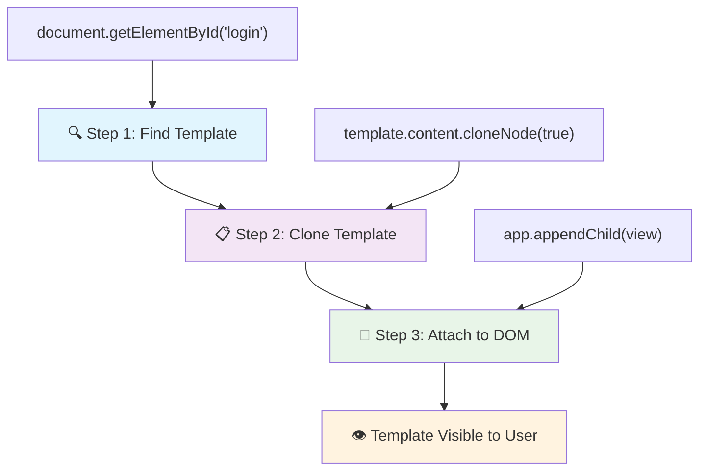
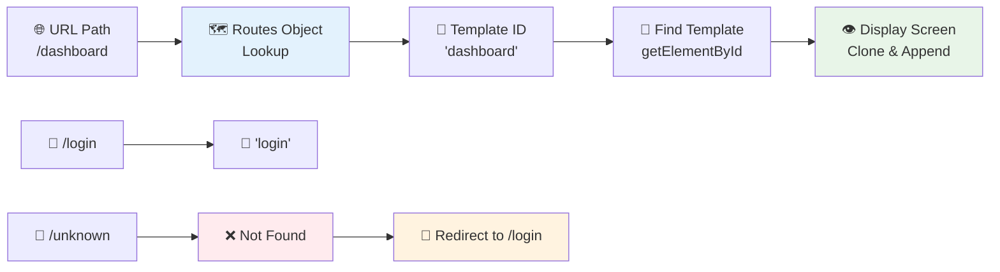
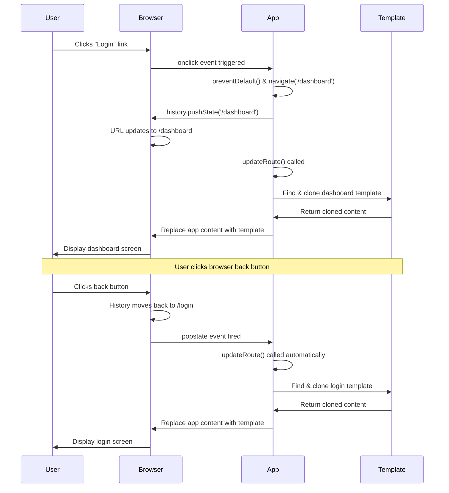

<!--
CO_OP_TRANSLATOR_METADATA:
{
  "original_hash": "5d259f6962464ad91e671083aa0398f4",
  "translation_date": "2025-10-23T21:42:41+00:00",
  "source_file": "7-bank-project/1-template-route/README.md",
  "language_code": "sv"
}
-->
# Bygg en bankapp Del 1: HTML-mallar och rutter i en webbapp

När Apollo 11:s styrdator navigerade till månen 1969, behövde den växla mellan olika program utan att starta om hela systemet. Moderna webbapplikationer fungerar på liknande sätt – de ändrar vad du ser utan att ladda om allt från början. Detta skapar den smidiga och responsiva upplevelse som användare förväntar sig idag.

Till skillnad från traditionella webbplatser som laddar om hela sidor vid varje interaktion, uppdaterar moderna webbappar endast de delar som behöver ändras. Denna metod, ungefär som hur kontrollrummet växlar mellan olika skärmar samtidigt som konstant kommunikation upprätthålls, skapar den smidiga upplevelse vi har vant oss vid.

Här är vad som gör skillnaden så dramatisk:

| Traditionella fler-sidiga appar | Moderna en-sidiga appar |
|---------------------------------|-------------------------|
| **Navigering** | Hela sidan laddas om för varje skärm | Omedelbar växling av innehåll |
| **Prestanda** | Långsammare på grund av fullständiga HTML-nedladdningar | Snabbare med partiella uppdateringar |
| **Användarupplevelse** | Ryckiga sidövergångar | Smidiga, app-liknande övergångar |
| **Dela data** | Svårt mellan sidor | Enkel hantering av tillstånd |
| **Utveckling** | Flera HTML-filer att underhålla | En HTML-fil med dynamiska mallar |

**Förstå utvecklingen:**
- **Traditionella appar** kräver serverförfrågningar för varje navigeringsåtgärd
- **Moderna SPAs** laddas en gång och uppdaterar innehållet dynamiskt med JavaScript
- **Användarförväntningar** föredrar nu omedelbara, sömlösa interaktioner
- **Prestandafördelar** inkluderar minskad bandbredd och snabbare svarstider

I denna lektion ska vi bygga en bankapp med flera skärmar som flyter samman smidigt. Precis som forskare använder modulära instrument som kan omkonfigureras för olika experiment, kommer vi att använda HTML-mallar som återanvändbara komponenter som kan visas vid behov.

Du kommer att arbeta med HTML-mallar (återanvändbara ritningar för olika skärmar), JavaScript-routing (systemet som växlar mellan skärmar) och webbläsarens historik-API (som håller bakåtknappen fungerande som förväntat). Dessa är samma grundläggande tekniker som används av ramverk som React, Vue och Angular.

I slutet kommer du att ha en fungerande bankapp som demonstrerar professionella principer för en-sidiga applikationer.

## Förberedande quiz

[Förberedande quiz](https://ff-quizzes.netlify.app/web/quiz/41)

### Vad du behöver

Vi behöver en lokal webbserver för att testa vår bankapp – oroa dig inte, det är enklare än det låter! Om du inte redan har en installerad, installera bara [Node.js](https://nodejs.org) och kör `npx lite-server` från din projektmapp. Detta praktiska kommando startar en lokal server och öppnar automatiskt din app i webbläsaren.

### Förberedelse

På din dator, skapa en mapp som heter `bank` med en fil som heter `index.html` inuti. Vi börjar med denna HTML [boilerplate](https://en.wikipedia.org/wiki/Boilerplate_code):

```html
<!DOCTYPE html>
<html lang="en">
  <head>
    <meta charset="UTF-8">
    <meta name="viewport" content="width=device-width, initial-scale=1.0">
    <title>Bank App</title>
  </head>
  <body>
    <!-- This is where you'll work -->
  </body>
</html>
```

**Detta boilerplate ger:**
- **Etablerar** HTML5-dokumentstrukturen med korrekt DOCTYPE-deklaration
- **Konfigurerar** teckenkodning som UTF-8 för internationellt textstöd
- **Aktiverar** responsiv design med viewport meta-taggen för mobilkompatibilitet
- **Sätter** en beskrivande titel som visas i webbläsarens flik
- **Skapar** en ren body-sektion där vi bygger vår applikation

> 📁 **Projektstrukturförhandsvisning**
> 
> **I slutet av denna lektion kommer ditt projekt att innehålla:**
> ```
> bank/
> ├── index.html      <!-- Main HTML with templates -->
> ├── app.js          <!-- Routing and navigation logic -->
> └── style.css       <!-- (Optional for future lessons) -->
> ```
> 
> **Filansvar:**
> - **index.html**: Innehåller alla mallar och ger appens struktur
> - **app.js**: Hanterar routing, navigering och mallhantering
> - **Mallar**: Definierar användargränssnittet för inloggning, dashboard och andra skärmar

---

## HTML-mallar

Mallar löser ett grundläggande problem inom webbutveckling. När Gutenberg uppfann tryckpressen med rörliga typer på 1440-talet insåg han att istället för att rista hela sidor, kunde han skapa återanvändbara bokstavsblock och arrangera dem vid behov. HTML-mallar fungerar på samma princip – istället för att skapa separata HTML-filer för varje skärm, definierar du återanvändbara strukturer som kan visas vid behov.

Tänk på mallar som ritningar för olika delar av din app. Precis som en arkitekt skapar en ritning och använder den flera gånger istället för att rita identiska rum, skapar vi mallar en gång och instansierar dem vid behov. Webbläsaren håller dessa mallar dolda tills JavaScript aktiverar dem.

Om du vill skapa flera skärmar för en webbsida, skulle en lösning vara att skapa en HTML-fil för varje skärm du vill visa. Men denna lösning har vissa nackdelar:

- Du måste ladda om hela HTML-filen när du byter skärm, vilket kan vara långsamt.
- Det är svårt att dela data mellan de olika skärmarna.

Ett annat tillvägagångssätt är att ha endast en HTML-fil och definiera flera [HTML-mallar](https://developer.mozilla.org/docs/Web/HTML/Element/template) med hjälp av `<template>`-elementet. En mall är ett återanvändbart HTML-block som inte visas av webbläsaren och måste instansieras vid körning med JavaScript.

### Låt oss bygga det

Vi ska skapa en bankapp med två huvudsakliga skärmar: en inloggningssida och en dashboard. Först lägger vi till ett platshållarelement i vår HTML-body – här kommer alla våra olika skärmar att visas:

```html
<div id="app">Loading...</div>
```

**Förstå denna platshållare:**
- **Skapar** en container med ID "app" där alla skärmar kommer att visas
- **Visar** ett laddningsmeddelande tills JavaScript initierar den första skärmen
- **Ger** en enda monteringspunkt för vårt dynamiska innehåll
- **Möjliggör** enkel målsökning från JavaScript med `document.getElementById()`

> 💡 **Tips**: Eftersom innehållet i detta element kommer att ersättas, kan vi lägga in ett laddningsmeddelande eller indikator som visas medan appen laddas.

Nästa steg är att lägga till HTML-mallen för inloggningssidan. För tillfället lägger vi bara till en titel och en sektion som innehåller en länk som vi kommer att använda för att navigera.

```html
<template id="login">
  <h1>Bank App</h1>
  <section>
    <a href="/dashboard">Login</a>
  </section>
</template>
```

**Bryta ner denna inloggningsmall:**
- **Definierar** en mall med det unika identifieraren "login" för JavaScript-mål
- **Inkluderar** en huvudrubrik som etablerar appens varumärke
- **Innehåller** ett semantiskt `<section>`-element för att gruppera relaterat innehåll
- **Tillhandahåller** en navigeringslänk som leder användare till dashboarden

Sedan lägger vi till en annan HTML-mall för dashboard-sidan. Denna sida kommer att innehålla olika sektioner:

- En header med en titel och en utloggningslänk
- Det aktuella saldot på bankkontot
- En lista över transaktioner, visade i en tabell

```html
<template id="dashboard">
  <header>
    <h1>Bank App</h1>
    <a href="/login">Logout</a>
  </header>
  <section>
    Balance: 100$
  </section>
  <section>
    <h2>Transactions</h2>
    <table>
      <thead>
        <tr>
          <th>Date</th>
          <th>Object</th>
          <th>Amount</th>
        </tr>
      </thead>
      <tbody></tbody>
    </table>
  </section>
</template>
```

**Låt oss förstå varje del av denna dashboard:**
- **Strukturerar** sidan med ett semantiskt `<header>`-element som innehåller navigering
- **Visar** appens titel konsekvent över skärmar för varumärkesbyggande
- **Tillhandahåller** en utloggningslänk som leder tillbaka till inloggningsskärmen
- **Visar** det aktuella kontosaldot i en dedikerad sektion
- **Organiserar** transaktionsdata med en korrekt strukturerad HTML-tabell
- **Definierar** tabellhuvuden för kolumnerna Datum, Objekt och Belopp
- **Lämnar** tabellkroppen tom för dynamisk innehållsinjektion senare

> 💡 **Tips**: När du skapar HTML-mallar, om du vill se hur det kommer att se ut, kan du kommentera ut `<template>` och `</template>`-raderna genom att omsluta dem med `<!-- -->`.

✅ Varför tror du att vi använder `id`-attribut på mallarna? Skulle vi kunna använda något annat som klasser?

## Ge liv åt mallar med JavaScript

Nu behöver vi göra våra mallar funktionella. Precis som en 3D-skrivare tar en digital ritning och skapar ett fysiskt objekt, tar JavaScript våra dolda mallar och skapar synliga, interaktiva element som användare kan se och använda.

Processen följer tre konsekventa steg som utgör grunden för modern webbutveckling. När du förstår detta mönster kommer du att känna igen det i många ramverk och bibliotek.

Om du testar din nuvarande HTML-fil i en webbläsare, kommer du att se att den fastnar på att visa `Loading...`. Det beror på att vi behöver lägga till lite JavaScript-kod för att instansiera och visa HTML-mallarna.

Att instansiera en mall görs vanligtvis i tre steg:

1. Hämta mallelementet i DOM, till exempel med [`document.getElementById`](https://developer.mozilla.org/docs/Web/API/Document/getElementById).
2. Klona mallelementet med [`cloneNode`](https://developer.mozilla.org/docs/Web/API/Node/cloneNode).
3. Fästa det till DOM under ett synligt element, till exempel med [`appendChild`](https://developer.mozilla.org/docs/Web/API/Node/appendChild).



**Visuell uppdelning av processen:**
- **Steg 1** lokaliserar den dolda mallen i DOM-strukturen
- **Steg 2** skapar en fungerande kopia som kan modifieras säkert
- **Steg 3** infogar kopian i det synliga sidområdet
- **Resultat** är en funktionell skärm som användare kan interagera med

✅ Varför behöver vi klona mallen innan vi fäster den till DOM? Vad tror du skulle hända om vi hoppade över detta steg?

### Uppgift

Skapa en ny fil som heter `app.js` i din projektmapp och importera den filen i `<head>`-sektionen av din HTML:

```html
<script src="app.js" defer></script>
```

**Förstå denna skriptimport:**
- **Länkar** JavaScript-filen till vårt HTML-dokument
- **Använder** attributet `defer` för att säkerställa att skriptet körs efter att HTML-parsningen är klar
- **Möjliggör** åtkomst till alla DOM-element eftersom de är fullt laddade innan skriptet körs
- **Följer** moderna bästa praxis för skriptladdning och prestanda

Nu i `app.js` ska vi skapa en ny funktion `updateRoute`:

```js
function updateRoute(templateId) {
  const template = document.getElementById(templateId);
  const view = template.content.cloneNode(true);
  const app = document.getElementById('app');
  app.innerHTML = '';
  app.appendChild(view);
}
```

**Steg för steg, här är vad som händer:**
- **Lokaliserar** mallelementet med dess unika ID
- **Skapar** en djup kopia av mallens innehåll med `cloneNode(true)`
- **Hittar** appcontainern där innehållet kommer att visas
- **Rensar** befintligt innehåll från appcontainern
- **Infogar** det klonade mallinnehållet i den synliga DOM

Nu anropar vi denna funktion med en av mallarna och tittar på resultatet.

```js
updateRoute('login');
```

**Vad detta funktionsanrop åstadkommer:**
- **Aktiverar** inloggningsmallen genom att skicka dess ID som parameter
- **Demonstrerar** hur man programmässigt växlar mellan olika appskärmar
- **Visar** inloggningsskärmen istället för meddelandet "Loading..."

✅ Vad är syftet med denna kod `app.innerHTML = '';`? Vad händer utan den?

## Skapa rutter

Routing handlar i grunden om att koppla URL:er till rätt innehåll. Tänk på hur tidiga telefonoperatörer använde kopplingsbord för att koppla samtal – de tog emot en inkommande begäran och kopplade den till rätt destination. Webbrouting fungerar på liknande sätt, tar emot en URL-begäran och avgör vilket innehåll som ska visas.

Traditionellt hanterade webbservrar detta genom att leverera olika HTML-filer för olika URL:er. Eftersom vi bygger en en-sidig app, måste vi hantera denna routing själva med JavaScript. Detta tillvägagångssätt ger oss mer kontroll över användarupplevelsen och prestandan.



**Förstå routingflödet:**
- **URL-ändringar** utlöser en sökning i vår ruttkonfiguration
- **Giltiga rutter** mappar till specifika mall-ID:n för rendering
- **Ogiltiga rutter** utlöser fallback-beteende för att förhindra trasiga tillstånd
- **Mallrendering** följer den trestegsprocess vi lärde oss tidigare

När vi pratar om en webbapp kallar vi *Routing* för avsikten att koppla **URL:er** till specifika skärmar som ska visas. På en webbplats med flera HTML-filer görs detta automatiskt eftersom filvägarna återspeglas i URL:en. Till exempel, med dessa filer i din projektmapp:

```
mywebsite/index.html
mywebsite/login.html
mywebsite/admin/index.html
```

Om du skapar en webbserver med `mywebsite` som root, kommer URL-mappningen att vara:

```
https://site.com            --> mywebsite/index.html
https://site.com/login.html --> mywebsite/login.html
https://site.com/admin/     --> mywebsite/admin/index.html
```

Men för vår webbapp använder vi en enda HTML-fil som innehåller alla skärmar, så detta standardbeteende kommer inte att hjälpa oss. Vi måste skapa denna karta manuellt och uppdatera den visade mallen med JavaScript.

### Uppgift

Vi kommer att använda ett enkelt objekt för att implementera en [karta](https://en.wikipedia.org/wiki/Associative_array) mellan URL-vägar och våra mallar. Lägg till detta objekt högst upp i din `app.js`-fil.

```js
const routes = {
  '/login': { templateId: 'login' },
  '/dashboard': { templateId: 'dashboard' },
};
```

**Förstå denna ruttkonfiguration:**
- **Definierar** en mappning mellan URL-vägar och mallidentifierare
- **Använder** objektsyntax där nycklar är URL-vägar och värden innehåller mallinformation
- **Möjliggör** enkel sökning av vilken mall som ska visas för en given URL
- **Ger** en skalbar struktur för att lägga till nya rutter i framtiden

Nu ska vi modifiera funktionen `updateRoute` lite. Istället för att direkt skicka `templateId` som ett argument, vill vi hämta det genom att först titta på den aktuella URL:en och sedan använda vår karta för att få motsvarande mall-ID-värde. Vi kan använda [`window.location.pathname`](https://developer.mozilla.org/docs/Web/API/Location/pathname) för att få endast sökvägsdelen från URL:en.

```js
function updateRoute() {
  const path = window.location.pathname;
  const route = routes[path];

  const template = document.getElementById(route.templateId);
  const view = template.content.cloneNode(true);
  const app = document.getElementById('app');
  app.innerHTML = '';
  app.appendChild(view);
}
```

**Bryta ner vad som händer här:**
- **Extraherar** den aktuella sökvägen från webbläsarens URL med `window.location.pathname`
- **Söker upp** motsvarande ruttkonfiguration i vårt ruttobjekt
- **Hämtar** mall-ID från ruttkonfigurationen
- **Följer** samma mallrenderingsprocess som tidigare
- **Skapar** ett dynamiskt system som svarar på URL-ändringar

Här har vi kopplat de rutter vi deklarerade till motsvarande mall. Du kan testa att det fungerar korrekt genom att ändra URL:en manuellt i din webbläsare.
✅ Vad händer om du anger en okänd sökväg i URL:en? Hur kan vi lösa detta?

## Lägga till navigering

När routning är etablerad behöver användarna ett sätt att navigera genom appen. Traditionella webbplatser laddar om hela sidor när man klickar på länkar, men vi vill uppdatera både URL och innehåll utan siduppdateringar. Detta skapar en smidigare upplevelse, liknande hur skrivbordsapplikationer växlar mellan olika vyer.

Vi behöver koordinera två saker: att uppdatera webbläsarens URL så att användarna kan bokmärka sidor och dela länkar, och att visa rätt innehåll. När detta implementeras korrekt skapas den sömlösa navigering som användarna förväntar sig av moderna applikationer.

> 🏗️ **Arkitekturinsikt**: Navigeringssystemets komponenter
>
> **Vad du bygger:**
> - **🔄 URL-hantering**: Uppdaterar webbläsarens adressfält utan siduppdateringar
> - **📋 Mallsystem**: Byter innehåll dynamiskt baserat på aktuell rutt  
> - **📚 Historikintegration**: Bibehåller funktionaliteten för webbläsarens bakåt-/framåtknappar
> - **🛡️ Felhantering**: Smidiga lösningar för ogiltiga eller saknade rutter
>
> **Hur komponenterna samverkar:**
> - **Lyssnar** på navigeringshändelser (klick, historikändringar)
> - **Uppdaterar** URL med hjälp av History API
> - **Renderar** rätt mall för den nya rutten
> - **Bibehåller** en sömlös användarupplevelse hela tiden

Nästa steg för vår app är att lägga till möjligheten att navigera mellan sidor utan att manuellt ändra URL:en. Detta innebär två saker:

  1. Uppdatera aktuell URL
  2. Uppdatera den visade mallen baserat på den nya URL:en

Vi har redan tagit hand om den andra delen med funktionen `updateRoute`, så vi måste lista ut hur vi ska uppdatera den aktuella URL:en.

Vi måste använda JavaScript och mer specifikt [`history.pushState`](https://developer.mozilla.org/docs/Web/API/History/pushState) som gör det möjligt att uppdatera URL:en och skapa en ny post i webbläsarens historik, utan att ladda om HTML.

> ⚠️ **Viktig notering**: Även om HTML-ankarelementet [`<a href>`](https://developer.mozilla.org/docs/Web/HTML/Element/a) kan användas på egen hand för att skapa hyperlänkar till olika URL:er, kommer det som standard att få webbläsaren att ladda om HTML. Det är nödvändigt att förhindra detta beteende när man hanterar routning med anpassad JavaScript, genom att använda funktionen preventDefault() på klickhändelsen.

### Uppgift

Låt oss skapa en ny funktion som vi kan använda för att navigera i vår app:

```js
function navigate(path) {
  window.history.pushState({}, path, path);
  updateRoute();
}
```

**Förstå denna navigeringsfunktion:**
- **Uppdaterar** webbläsarens URL till den nya sökvägen med `history.pushState`
- **Lägger till** en ny post i webbläsarens historikstack för korrekt stöd för bakåt-/framåtknappar
- **Triggar** funktionen `updateRoute()` för att visa motsvarande mall
- **Bibehåller** single-page app-upplevelsen utan siduppdateringar

Denna metod uppdaterar först den aktuella URL:en baserat på den angivna sökvägen och uppdaterar sedan mallen. Egenskapen `window.location.origin` returnerar URL-roten, vilket gör att vi kan återskapa en komplett URL från en given sökväg.

Nu när vi har denna funktion kan vi ta itu med problemet vi har om en sökväg inte matchar någon definierad rutt. Vi kommer att modifiera funktionen `updateRoute` genom att lägga till en fallback till en av de befintliga rutterna om vi inte kan hitta en matchning.

```js
function updateRoute() {
  const path = window.location.pathname;
  const route = routes[path];

  if (!route) {
    return navigate('/login');
  }

  const template = document.getElementById(route.templateId);
  const view = template.content.cloneNode(true);
  const app = document.getElementById('app');
  app.innerHTML = '';
  app.appendChild(view);
}
```

**Viktiga punkter att komma ihåg:**
- **Kontrollerar** om en rutt finns för den aktuella sökvägen
- **Omdirigerar** till inloggningssidan när en ogiltig rutt nås
- **Tillhandahåller** en fallback-mekanism som förhindrar trasig navigering
- **Säkerställer** att användarna alltid ser en giltig skärm, även med felaktiga URL:er

Om en rutt inte kan hittas kommer vi nu att omdirigera till sidan `login`.

Nu ska vi skapa en funktion för att hämta URL:en när en länk klickas på och för att förhindra webbläsarens standardbeteende för länkar:

```js
function onLinkClick(event) {
  event.preventDefault();
  navigate(event.target.href);
}
```

**Bryta ner denna klickhanterare:**
- **Förhindrar** webbläsarens standardbeteende för länkar med `preventDefault()`
- **Extraherar** destinations-URL:en från det klickade länk-elementet
- **Anropar** vår anpassade navigeringsfunktion istället för att ladda om sidan
- **Bibehåller** den smidiga single-page applikationsupplevelsen

```html
<a href="/dashboard" onclick="onLinkClick(event)">Login</a>
...
<a href="/login" onclick="onLinkClick(event)">Logout</a>
```

**Vad denna onclick-bindning åstadkommer:**
- **Kopplar** varje länk till vårt anpassade navigeringssystem
- **Skickar** klickhändelsen till vår funktion `onLinkClick` för bearbetning
- **Möjliggör** smidig navigering utan siduppdateringar
- **Bibehåller** korrekt URL-struktur som användare kan bokmärka eller dela

Attributet [`onclick`](https://developer.mozilla.org/docs/Web/API/GlobalEventHandlers/onclick) binder klickhändelsen till JavaScript-kod, här anropet till funktionen `navigate()`.

Prova att klicka på dessa länkar, du bör nu kunna navigera mellan de olika skärmarna i din app.

✅ Metoden `history.pushState` är en del av HTML5-standarden och implementerad i [alla moderna webbläsare](https://caniuse.com/?search=pushState). Om du bygger en webbapp för äldre webbläsare finns det ett trick du kan använda istället för detta API: genom att använda en [hash (`#`)](https://en.wikipedia.org/wiki/URI_fragment) före sökvägen kan du implementera routning som fungerar med vanliga ankarnavigeringar och inte laddar om sidan, eftersom dess syfte var att skapa interna länkar inom en sida.

## Få bakåt- och framåtknapparna att fungera

Bakåt- och framåtknapparna är grundläggande för webbsurfning, ungefär som hur NASA:s uppdragskontrollanter kan granska tidigare systemtillstånd under rymduppdrag. Användare förväntar sig att dessa knappar fungerar, och när de inte gör det bryts den förväntade surfupplevelsen.

Vår single-page app behöver ytterligare konfiguration för att stödja detta. Webbläsaren bibehåller en historikstack (som vi har lagt till med `history.pushState`), men när användare navigerar genom denna historik måste vår app svara genom att uppdatera det visade innehållet därefter.



**Viktiga interaktionspunkter:**
- **Användaråtgärder** triggar navigering genom klick eller webbläsarknappar
- **Appen avlyssnar** klick på länkar för att förhindra siduppdateringar
- **History API** hanterar URL-ändringar och webbläsarens historikstack
- **Mallar** tillhandahåller innehållsstrukturen för varje skärm
- **Händelselyssnare** säkerställer att appen svarar på alla typer av navigering

Användningen av `history.pushState` skapar nya poster i webbläsarens navigeringshistorik. Du kan kontrollera detta genom att hålla inne *bakåtknappen* i din webbläsare, det bör visa något i stil med detta:


Om du försöker klicka på bakåtknappen några gånger kommer du att se att den aktuella URL:en ändras och historiken uppdateras, men samma mall fortsätter att visas.

Detta beror på att applikationen inte vet att vi behöver anropa `updateRoute()` varje gång historiken ändras. Om du tittar på dokumentationen för [`history.pushState`](https://developer.mozilla.org/docs/Web/API/History/pushState) kan du se att om tillståndet ändras - vilket innebär att vi har flyttat till en annan URL - triggas händelsen [`popstate`](https://developer.mozilla.org/docs/Web/API/Window/popstate_event). Vi kommer att använda detta för att åtgärda problemet.

### Uppgift

För att säkerställa att den visade mallen uppdateras när webbläsarens historik ändras, kommer vi att bifoga en ny funktion som anropar `updateRoute()`. Vi gör detta längst ner i vår `app.js`-fil:

```js
window.onpopstate = () => updateRoute();
updateRoute();
```

**Förstå denna historikintegration:**
- **Lyssnar** på `popstate`-händelser som inträffar när användare navigerar med webbläsarknappar
- **Använder** en pilfunktion för koncis syntax för händelsehanterare
- **Anropar** `updateRoute()` automatiskt varje gång historikens tillstånd ändras
- **Initierar** appen genom att anropa `updateRoute()` när sidan först laddas
- **Säkerställer** att rätt mall visas oavsett hur användarna navigerar

> 💡 **Proffstips**: Vi använde en [pilfunktion](https://developer.mozilla.org/docs/Web/JavaScript/Reference/Functions/Arrow_functions) här för att deklarera vår `popstate`-händelsehanterare för koncishet, men en vanlig funktion skulle fungera lika bra.

Här är en uppfriskningsvideo om pilfunktioner:

[](https://youtube.com/watch?v=OP6eEbOj2sc "Pilfunktioner")

> 🎥 Klicka på bilden ovan för en video om pilfunktioner.

Nu kan du prova att använda bakåt- och framåtknapparna i din webbläsare och kontrollera att den visade rutten uppdateras korrekt denna gång.

---

## GitHub Copilot Agent-utmaning 🚀

Använd Agent-läget för att slutföra följande utmaning:

**Beskrivning:** Förbättra bankappen genom att implementera felhantering och en 404-sidemall för ogiltiga rutter, vilket förbättrar användarupplevelsen vid navigering till icke-existerande sidor.

**Prompt:** Skapa en ny HTML-mall med id "not-found" som visar en användarvänlig 404-felsida med styling. Modifiera sedan JavaScript-routningslogiken för att visa denna mall när användare navigerar till ogiltiga URL:er, och lägg till en "Gå till startsidan"-knapp som navigerar tillbaka till inloggningssidan.

Läs mer om [agent-läge](https://code.visualstudio.com/blogs/2025/02/24/introducing-copilot-agent-mode) här.

## 🚀 Utmaning

Lägg till en ny mall och rutt för en tredje sida som visar krediter för denna app.

**Utmaningsmål:**
- **Skapa** en ny HTML-mall med lämplig innehållsstruktur
- **Lägg till** den nya rutten till din routningskonfigurationsobjekt
- **Inkludera** navigeringslänkar till och från kreditsidan
- **Testa** att all navigering fungerar korrekt med webbläsarhistorik

## Efterföreläsningsquiz

[Efterföreläsningsquiz](https://ff-quizzes.netlify.app/web/quiz/42)

## Granskning & Självstudier

Routning är en av de överraskande knepiga delarna av webbutveckling, särskilt när webben går från siduppdateringsbeteenden till Single Page Application-siduppdateringar. Läs lite om [hur Azure Static Web App-tjänsten](https://docs.microsoft.com/azure/static-web-apps/routes/?WT.mc_id=academic-77807-sagibbon) hanterar routning. Kan du förklara varför några av de beslut som beskrivs i det dokumentet är nödvändiga?

**Ytterligare lärresurser:**
- **Utforska** hur populära ramverk som React Router och Vue Router implementerar klientbaserad routning
- **Undersök** skillnaderna mellan hash-baserad routning och History API-routning
- **Lär dig** om server-side rendering (SSR) och hur det påverkar routningsstrategier
- **Undersök** hur Progressive Web Apps (PWAs) hanterar routning och navigering

## Uppgift

[Förbättra routningen](assignment.md)

---

**Ansvarsfriskrivning**:  
Detta dokument har översatts med hjälp av AI-översättningstjänsten [Co-op Translator](https://github.com/Azure/co-op-translator). Även om vi strävar efter noggrannhet, bör det noteras att automatiserade översättningar kan innehålla fel eller felaktigheter. Det ursprungliga dokumentet på dess originalspråk bör betraktas som den auktoritativa källan. För kritisk information rekommenderas professionell mänsklig översättning. Vi ansvarar inte för eventuella missförstånd eller feltolkningar som uppstår vid användning av denna översättning.