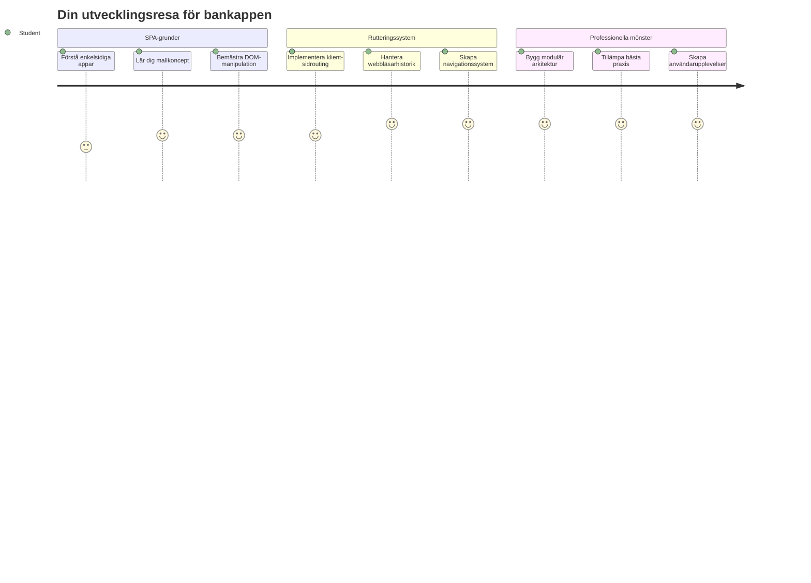
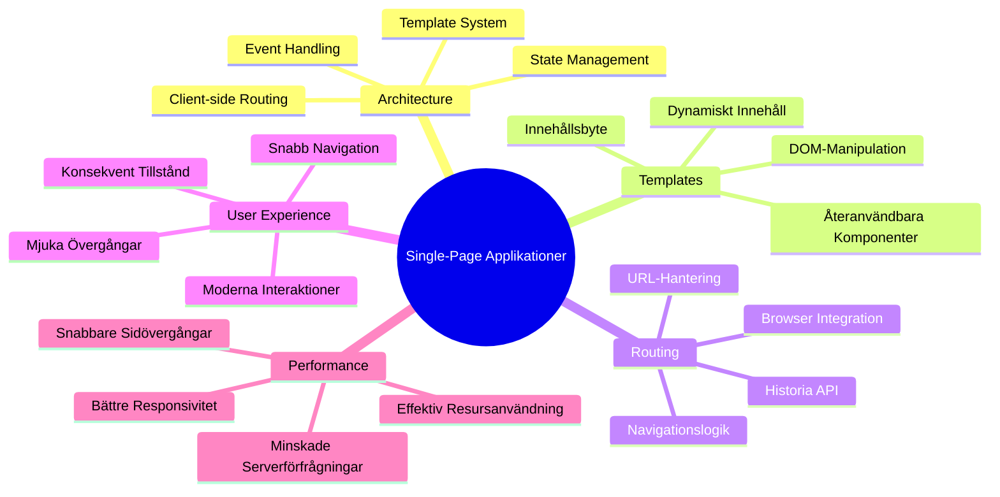
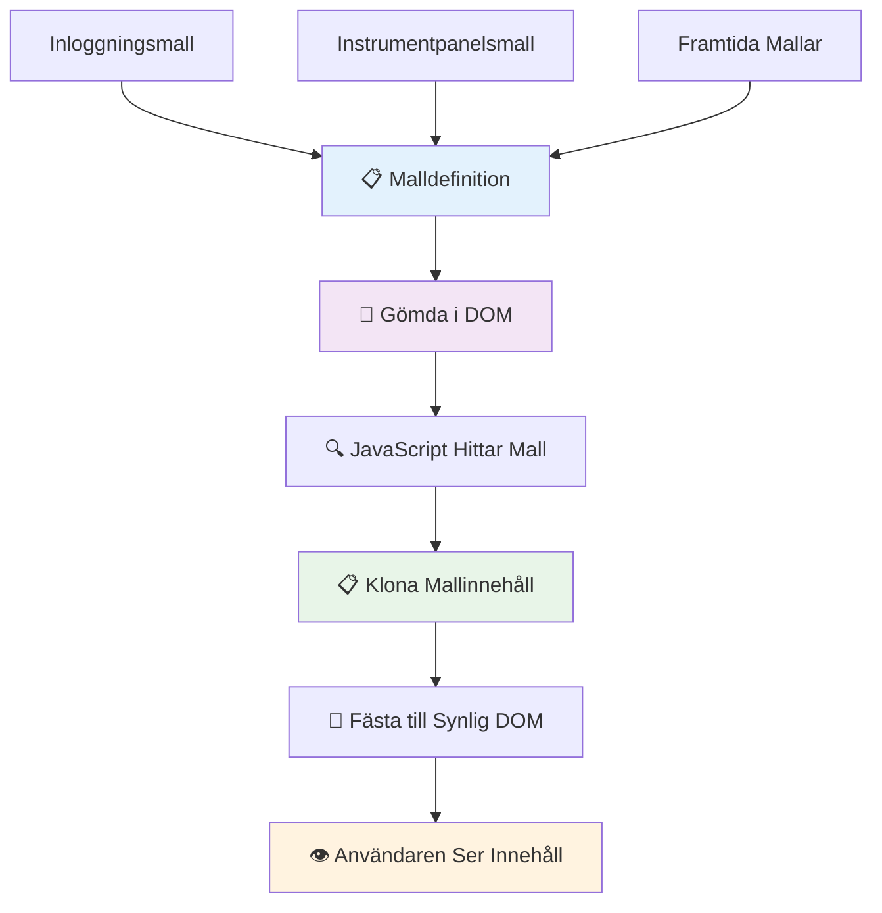
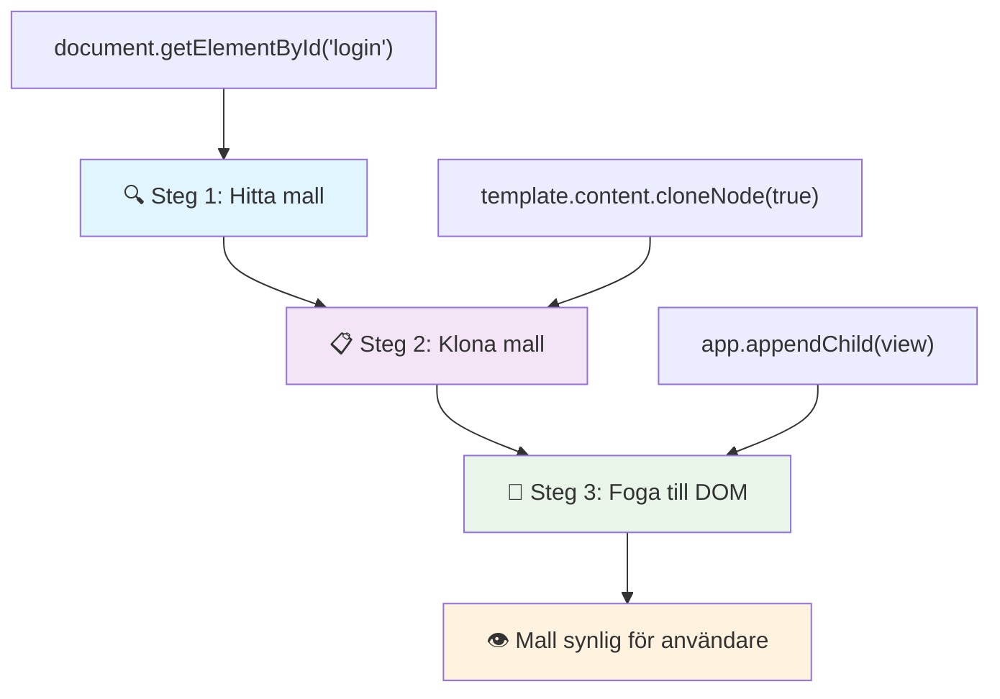
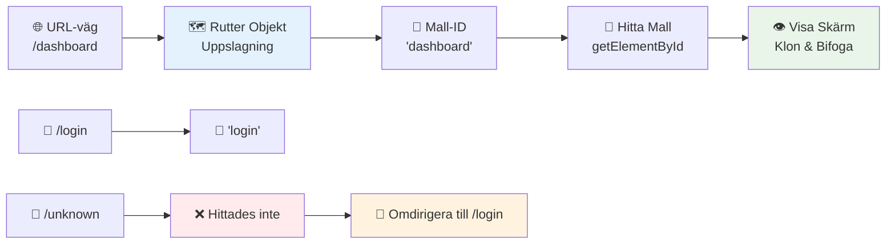
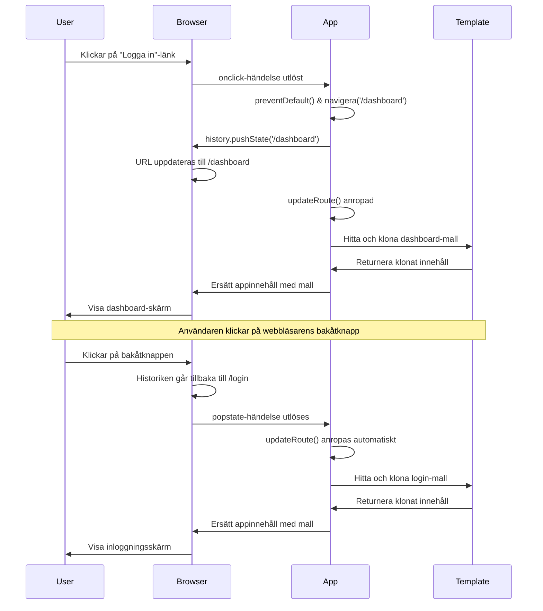
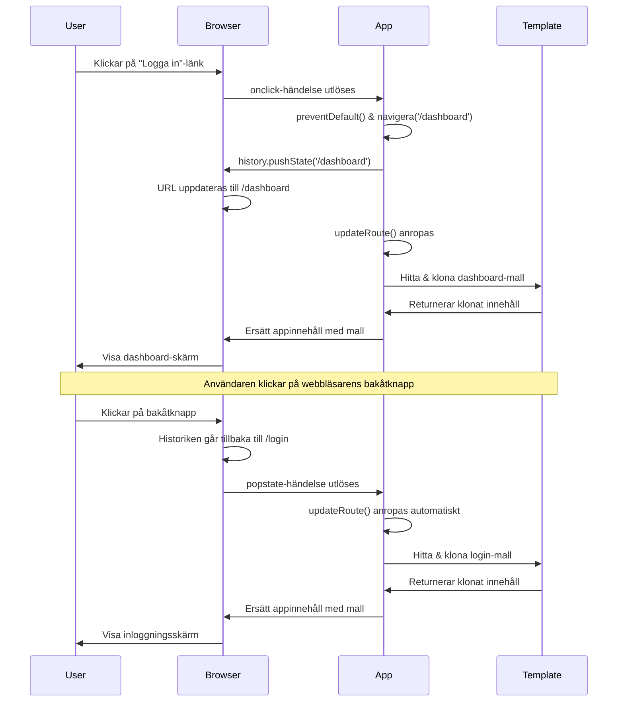
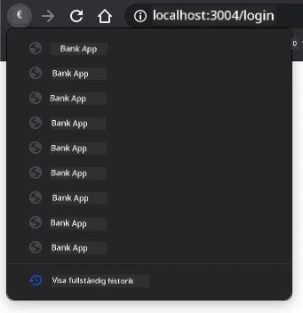
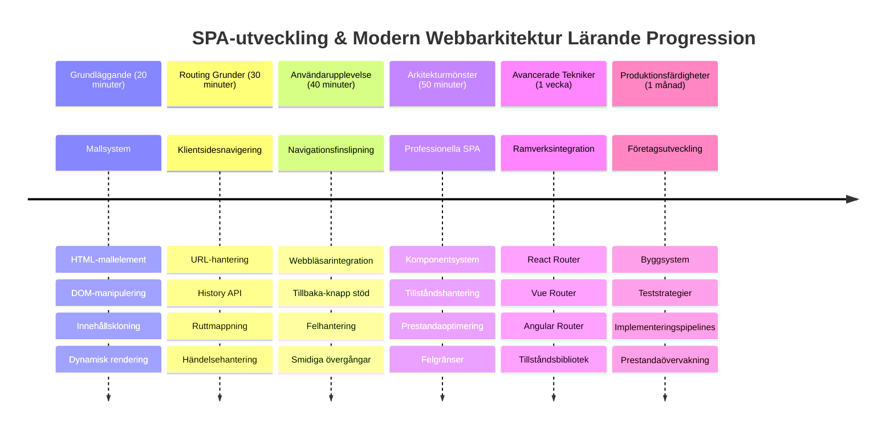

# Bygg en bankapp del 1: HTML-mallar och rutter i en webbapp


När Apollo 11:s styrdator navigerade till månen 1969, var den tvungen att växla mellan olika program utan att starta om hela systemet. Moderna webbapplikationer fungerar på liknande sätt – de ändrar vad du ser utan att ladda om allt från början. Detta skapar den smidiga, responsiva upplevelse som användare förväntar sig idag.

Till skillnad från traditionella webbplatser som laddar om hela sidor för varje interaktion, uppdaterar moderna webbappar endast de delar som behöver ändras. Detta tillvägagångssätt, ungefär som hur kontrollrummet byter mellan olika vyer samtidigt som kontakten bibehålls, skapar den flytande upplevelse vi vant oss vid.

Här är vad som gör skillnaden så dramatisk:

| Traditionella flersidiga appar | Moderna enkelsidiga appar |
|----------------------------|-------------------------|
| **Navigering** | Hela sidan laddas om för varje skärm | Omedelbart innehållsbyte |
| **Prestanda** | Långsammare på grund av fullständig HTML-nedladdning | Snabbare med partiella uppdateringar |
| **Användarupplevelse** | Ryckiga sidövergångar | Smidiga, app-liknande övergångar |
| **Dataspridning** | Svårt mellan sidor | Enkel hantering av tillstånd |
| **Utveckling** | Flera HTML-filer att underhålla | En HTML med dynamiska mallar |

**Förstå utvecklingen:**
- **Traditionella appar** kräver serverförfrågningar för varje navigeringshandling
- **Moderna SPA:er** laddar en gång och uppdaterar innehåll dynamiskt med JavaScript
- **Användarnas förväntningar** är idag för omedelbara, sömlösa interaktioner
- **Prestandafördelar** inkluderar reducerad bandbredd och snabbare svarstider

I den här lektionen bygger vi en bankapp med flera skärmar som flyter ihop sömlöst. Precis som forskare använder modulära instrument som kan konfigureras om för olika experiment, använder vi HTML-mallar som återanvändbara komponenter som visas vid behov.

Du kommer att arbeta med HTML-mallar (återanvändbara ritningar för olika skärmar), JavaScript-routing (systemet som växlar mellan skärmar) och webbläsarens history-API (som håller tillbaka-knappen fungerande som väntat). Dessa är samma grundläggande tekniker som används av ramverk som React, Vue och Angular.

I slutet kommer du att ha en fungerande bankapp som demonstrerar professionella principer för enkelsidiga applikationer.


## För-foreläsningsquiz

[För-foreläsningsquiz](https://ff-quizzes.netlify.app/web/quiz/41)

### Vad du behöver

Vi kommer att behöva en lokal webbserver för att testa vår bankapp – oroa dig inte, det är lättare än det låter! Om du inte redan har en sådan installerad, installera bara [Node.js](https://nodejs.org) och kör `npx lite-server` från din projektmapp. Det här praktiska kommandot startar en lokal server och öppnar automatiskt din app i webbläsaren.

### Förberedelse

På din dator skapar du en mapp som heter `bank` med en fil som heter `index.html` inuti. Vi börjar med den här HTML [boilerplate](https://en.wikipedia.org/wiki/Boilerplate_code):

```html
<!DOCTYPE html>
<html lang="en">
  <head>
    <meta charset="UTF-8">
    <meta name="viewport" content="width=device-width, initial-scale=1.0">
    <title>Bank App</title>
  </head>
  <body>
    <!-- This is where you'll work -->
  </body>
</html>
```

**Här är vad denna boilerplate ger:**
- **Fastställer** HTML5-dokumentstruktur med korrekt DOCTYPE-deklaration
- **Konfigurerar** teckenkodning som UTF-8 för internationellt textstöd
- **Aktiverar** responsiv design med viewport-meta-taggen för mobilkompatibilitet
- **Sätter** en beskrivande titel som visas i webbläsarfliken
- **Skapar** en ren body-sektion där vi bygger vår applikation

> 📁 **Förhandsvisning av projektstruktur**
> 
> **I slutet av denna lektion kommer ditt projekt att innehålla:**
> ```
> bank/
> ├── index.html      <!-- Main HTML with templates -->
> ├── app.js          <!-- Routing and navigation logic -->
> └── style.css       <!-- (Optional for future lessons) -->
> ```
> 
> **Filansvar:**
> - **index.html**: Innehåller alla mallar och tillhandahåller appens struktur
> - **app.js**: Hanterar routing, navigering och mallhantering
> - **Mallar**: Definierar UI för inloggning, dashboard och andra skärmar

---

## HTML-mallar

Mallar löser en grundläggande utmaning inom webbutveckling. När Gutenberg uppfann boktryckarkonsten med rörliga typer på 1440-talet insåg han att istället för att snida ut hela sidor kunde han skapa återanvändbara bokstavsblock och arrangera dem vid behov. HTML-mallar fungerar på samma princip – istället för att skapa separata HTML-filer för varje skärm definierar man återanvändbara strukturer som kan visas vid behov.


Tänk på mallar som ritningar för olika delar av din app. Precis som en arkitekt skapar en ritning och använder den flera gånger istället för att rita identiska rum om och om igen, skapar vi mallar en gång och instansierar dem när det behövs. Webbläsaren håller dessa mallar dolda tills JavaScript aktiverar dem.

Om du vill skapa flera skärmar för en webbsida, skulle en lösning vara att skapa en HTML-fil för varje skärm du vill visa. Men denna lösning kommer med vissa nackdelar:

- Du måste ladda om hela HTML när du växlar skärm, vilket kan vara långsamt.
- Det är svårt att dela data mellan olika skärmar.

Ett annat tillvägagångssätt är att ha endast en HTML-fil och definiera flera [HTML-mallar](https://developer.mozilla.org/docs/Web/HTML/Element/template) med hjälp av `<template>`-elementet. En mall är en återanvändbar HTML-block som inte visas av webbläsaren, och måste instansieras vid körning med JavaScript.

### Låt oss bygga det

Vi ska skapa en bankapp med två huvudsakliga skärmar: en inloggningssida och en dashboard. Först lägger vi till ett platshållarelement i vår HTML-body – det är här alla våra olika skärmar kommer att visas:

```html
<div id="app">Loading...</div>
```

**Förstå denna platshållare:**
- **Skapar** en container med ID "app" där alla skärmar kommer att visas
- **Visar** ett laddningsmeddelande tills JavaScript initierar första skärmen
- **Tillhandahåller** en enda monteringspunkt för vårt dynamiska innehåll
- **Möjliggör** enkel åtkomst från JavaScript med `document.getElementById()`

> 💡 **Proffstips**: Eftersom innehållet i detta element kommer att ersättas kan vi lägga in ett laddningsmeddelande eller indikator som visas medan appen laddas.

Lägg sedan till nedan HTML-mallen för inloggningssidan. För tillfället lägger vi bara in en titel och en sektion innehållande en länk som vi ska använda för navigering.

```html
<template id="login">
  <h1>Bank App</h1>
  <section>
    <a href="/dashboard">Login</a>
  </section>
</template>
```

**Genomgång av denna inloggningsmall:**
- **Definierar** en mall med unikt ID "login" för JavaScript-tillgång
- **Innehåller** en huvudrubrik som etablerar appens varumärke
- **Har** ett semantiskt `<section>`-element för att gruppera relaterat innehåll
- **Tillhandahåller** en navigeringslänk som leder användare till dashboarden

Sedan lägger vi till en annan HTML-mall för dashboard-sidan. Denna sida kommer att innehålla olika sektioner:

- En header med titel och en länk för utloggning
- Det nuvarande bankkontots saldo
- En lista över transaktioner, visade i en tabell

```html
<template id="dashboard">
  <header>
    <h1>Bank App</h1>
    <a href="/login">Logout</a>
  </header>
  <section>
    Balance: 100$
  </section>
  <section>
    <h2>Transactions</h2>
    <table>
      <thead>
        <tr>
          <th>Date</th>
          <th>Object</th>
          <th>Amount</th>
        </tr>
      </thead>
      <tbody></tbody>
    </table>
  </section>
</template>
```

**Låt oss förstå varje del av denna dashboard:**
- **Strukturerar** sidan med ett semantiskt `<header>`-element som innehåller navigation
- **Visar** appens titel konsekvent över skärmar för varumärkesprofil
- **Tillhandahåller** en utloggningslänk som leder tillbaka till inloggningssidan
- **Visar** nuvarande kontosaldo i en dedikerad sektion
- **Organiserar** transaktionsdata med en korrekt strukturerad HTML-tabell
- **Definierar** tabellhuvuden för Datum, Objekt och Belopp
- **Lämnar** tabellkroppen tom för dynamisk innehållsinjektion senare

> 💡 **Proffstips**: När du skapar HTML-mallar, om du vill se hur det kommer att se ut, kan du kommentera ut `<template>` och `</template>`-raderna genom att omsluta dem med `<!-- -->`.

### 🔄 **Pedagogisk avstämning**
**Förståelse för mallsystemet**: Innan du implementerar JavaScript, säkerställ att du förstår:
- ✅ Hur mallar skiljer sig från vanliga HTML-element
- ✅ Varför mallar förblir dolda tills de aktiveras av JavaScript
- ✅ Vikten av semantisk HTML-struktur i mallar
- ✅ Hur mallar möjliggör återanvändbara UI-komponenter

**Snabb självtest**: Vad händer om du tar bort `<template>`-taggarna runt din HTML?
*Svar: Innehållet blir direkt synligt och förlorar sin mallfunktionalitet*

**Arkitekturfördelar**: Mallar ger:
- **Återanvändbarhet**: En definition, flera instanser
- **Prestanda**: Ingen överflödig HTML-parsing
- **Underhållbarhet**: Centraliserad UI-struktur
- **Flexibilitet**: Dynamiskt innehållsbyte

✅ Varför tror du att vi använder `id`-attribut på mallarna? Skulle vi kunna använda något annat som klasser?

## Göra mallarna levande med JavaScript

Nu behöver vi göra våra mallar funktionella. Precis som en 3D-skrivare tar en digital ritning och skapar ett fysiskt objekt, tar JavaScript våra dolda mallar och skapar synliga, interaktiva element som användare kan se och använda.

Processen följer tre genomgående steg som utgör grunden för modern webbutveckling. När du förstår detta mönster känner du igen det i många ramverk och bibliotek.

Om du provar din nuvarande HTML-fil i en webbläsare, ser du att den fastnar på att visa `Loading...`. Det beror på att vi behöver lägga till viss JavaScript-kod för att instansiera och visa HTML-mallarna.

Att instansiera en mall görs vanligtvis i 3 steg:

1. Hämta mall-elementet i DOM, till exempel med [`document.getElementById`](https://developer.mozilla.org/docs/Web/API/Document/getElementById).
2. Klona mall-elementet, med [`cloneNode`](https://developer.mozilla.org/docs/Web/API/Node/cloneNode).
3. Fäst det i DOM under ett synligt element, till exempel med [`appendChild`](https://developer.mozilla.org/docs/Web/API/Node/appendChild).


**Visuell genomgång av processen:**
- **Steg 1** hittar den dolda mallen i DOM-strukturen
- **Steg 2** skapar en arbetskopia som säkert kan ändras
- **Steg 3** infogar kopian i den synliga sidans område
- **Resultat** är en funktionell skärm som användare kan interagera med

✅ Varför behöver vi klona mallen innan vi fäster den i DOM? Vad tror du skulle hända om vi hoppade över detta steg?

### Uppgift

Skapa en ny fil som heter `app.js` i din projektmapp och importera den filen i `<head>`-sektionen av din HTML:

```html
<script src="app.js" defer></script>
```

**Förstå denna script-import:**
- **Länkar** JavaScript-filen till vårt HTML-dokument
- **Använder** `defer` attributet för att säkerställa att skriptet körs efter att HTML-parsning är klar
- **Möjliggör** åtkomst till alla DOM-element eftersom de laddats färdigt före skriptets körning
- **Följer** moderna bästa praxis för skriptladdning och prestanda

Nu i `app.js` skapar vi en ny funktion `updateRoute`:

```js
function updateRoute(templateId) {
  const template = document.getElementById(templateId);
  const view = template.content.cloneNode(true);
  const app = document.getElementById('app');
  app.innerHTML = '';
  app.appendChild(view);
}
```

**Steg för steg, detta händer:**
- **Hittar** mall-elementet med dess unika ID
- **Skapar** en djup kopia av mallens innehåll med `cloneNode(true)`
- **Hittar** app-containern där innehållet ska visas
- **Rensar** bort eventuellt befintligt innehåll från app-containern
- **Infogar** den klonade mallens innehåll i den synliga DOM

Anropa nu denna funktion med en av mallarna och titta på resultatet.

```js
updateRoute('login');
```

**Vad detta funktionsanrop åstadkommer:**
- **Aktiverar** login-mallen genom att skicka dess ID som parameter
- **Visar** hur man programmerbart växlar mellan olika app-skärmar
- **Visar** inloggningsskärmen istället för meddelandet "Loading..."

✅ Vad är syftet med koden `app.innerHTML = '';`? Vad händer utan den?

## Skapa rutter

Routing handlar egentligen om att koppla URL:er till rätt innehåll. Tänk dig hur tidiga telefonister använde kopplingsbord för att koppla samtal – de tog emot en förfrågan och kopplade den till rätt destination. Webbrouting fungerar på liknande sätt, den tar en URL-förfrågan och avgör vilket innehåll som ska visas.


Traditionellt hanterade webbservrar detta genom att servera olika HTML-filer för olika URL:er. Eftersom vi bygger en enkelsidig app behöver vi hantera denna routing själva med JavaScript. Detta ger oss mer kontroll över användarupplevelsen och prestandan.


**Förstå routningsflödet:**
- **URL-förändringar** triggar en uppslagning i vår routes-konfiguration
- **Giltiga rutter** mappas till specifika mall-ID:n för renderering
- **Ogiltiga rutter** triggar fallback-beteende för att undvika trasiga tillstånd
- **Mall-rendering** följer den trestegsprocess vi lärde oss tidigare

När vi pratar om en webbapp kallar vi *Routing* viljan att koppla **URL:er** till specifika skärmar som ska visas. På en webbplats med flera HTML-filer görs detta automatiskt eftersom filvägar återspeglas i URL:en. Till exempel, med dessa filer i din projektmapp:

```
mywebsite/index.html
mywebsite/login.html
mywebsite/admin/index.html
```

Om du skapar en webbserver med `mywebsite` som rot, blir URL-mappningen:

```
https://site.com            --> mywebsite/index.html
https://site.com/login.html --> mywebsite/login.html
https://site.com/admin/     --> mywebsite/admin/index.html
```

Men för vår webbapp använder vi en enda HTML-fil som innehåller alla skärmar, så detta standardbeteende hjälper oss inte. Vi måste skapa denna karta manuellt och uppdatera den visade mallen med JavaScript.

### Uppgift

Vi använder ett enkelt objekt för att implementera en [karta](https://en.wikipedia.org/wiki/Associative_array) mellan URL-vägar och våra mallar. Lägg till detta objekt högst upp i din `app.js`-fil.

```js
const routes = {
  '/login': { templateId: 'login' },
  '/dashboard': { templateId: 'dashboard' },
};
```

**Förstå denna routes-konfiguration:**
- **Definierar** en mappning mellan URL-vägar och mallidentifikatorer
- **Använder** objektsyntax där nycklar är URL-vägar och värden innehåller mallinformation
- **Möjliggör** enkel uppslagning av vilken mall som ska visas för en given URL
- **Tillhandahåller** en skalbar struktur för att lägga till nya rutter framöver
Nu ska vi ändra lite på funktionen `updateRoute`. Istället för att direkt skicka `templateId` som argument vill vi hämta det genom att först titta på den aktuella URL:en, och sedan använda vår karta för att få motsvarande template ID-värde. Vi kan använda [`window.location.pathname`](https://developer.mozilla.org/docs/Web/API/Location/pathname) för att enbart ta vägdelen från URL:en.

```js
function updateRoute() {
  const path = window.location.pathname;
  const route = routes[path];

  const template = document.getElementById(route.templateId);
  const view = template.content.cloneNode(true);
  const app = document.getElementById('app');
  app.innerHTML = '';
  app.appendChild(view);
}
```

**Nedbrytning av vad som sker här:**
- **Extraherar** den aktuella vägen från webbläsarens URL med hjälp av `window.location.pathname`
- **Slår upp** motsvarande ruttkonfiguration i vårt routes-objekt
- **Hämtar** template ID från ruttkonfigurationen
- **Följer** samma template-renderingsprocess som tidigare
- **Skapar** ett dynamiskt system som svarar på URL-förändringar

Här har vi kartlagt de rutter vi deklarerat till motsvarande template. Du kan testa att det fungerar korrekt genom att manuellt ändra URL:en i din webbläsare.

✅ Vad händer om du skriver in en okänd väg i URL:en? Hur skulle vi kunna lösa det?

## Lägga till navigering

Med routing på plats behöver användare ett sätt att navigera i appen. Traditionella webbplatser laddar om hela sidor när man klickar på länkar, men vi vill uppdatera både URL och innehåll utan siduppdatering. Det skapar en smidigare upplevelse, liknande hur skrivbordsapplikationer byter mellan olika vyer.

Vi behöver samordna två saker: att uppdatera webbläsarens URL så att användare kan bokmärka sidor och dela länkar, och att visa rätt innehåll. När det implementeras rätt blir navigeringen sömlös, som användare förväntar sig i moderna appar.


### 🔄 **Pedagogisk kontrollpunkt**
**Single-Page Application-arkitektur**: Kontrollera att du förstår hela systemet:
- ✅ Hur skiljer sig klientbaserad routing från traditionell serverbaserad routing?
- ✅ Varför är History API viktigt för korrekt SPA-navigering?
- ✅ Hur möjliggör mallar dynamiskt innehåll utan siduppdateringar?
- ✅ Vilken roll spelar händelsehantering för att avlyssna navigation?

**Systemintegration**: Din SPA visar:
- **Templatehantering**: Återanvändbara UI-komponenter med dynamiskt innehåll
- **Klientbaserad routing**: URL-hantering utan serveranrop
- **Händelsedriven arkitektur**: Responsiv navigering och användarinteraktioner
- **Webbläsarintegration**: Bra stöd för historik- och framåt-/bakåtknappar
- **Prestandaoptimering**: Snabba övergångar och minskad serverbelastning

**Professionella mönster**: Du har implementerat:
- **Modell-Vy-separation**: Mallar separerade från applikationslogik
- **Tillståndshantering**: Synkronisering av URL-tillstånd med visat innehåll
- **Progressiv förbättring**: JavaScript förbättrar grundläggande HTML-funktionalitet
- **Användarupplevelse**: Smidig, app-liknande navigering utan siduppdateringar

> � **Arkitekturinformation**: Navigationssystemkomponenter
>
> **Vad du bygger:**
> - **🔄 URL-hantering**: Uppdaterar adressfältet utan sidladdning
> - **📋 Templatesystem**: Växlar dynamiskt innehåll baserat på aktuell rutt  
> - **📚 Historikintegration**: Behåller back-/forward-knappfunktionalitet
> - **🛡️ Felhantering**: Smidiga återfallslösningar för ogiltiga eller saknade rutter
>
> **Hur komponenter samverkar:**
> - **Lyssnar** på navigationshändelser (klick, historikändringar)
> - **Uppdaterar** URL med hjälp av History API
> - **Renderar** korrekt template för nya rutten
> - **Bibehåller** en sömlös användarupplevelse hela tiden

Nästa steg för vår app är att lägga till möjlighet att navigera mellan sidor utan att behöva ändra URL manuellt. Det innebär två saker:

  1. Uppdatera den aktuella URL:en
  2. Uppdatera den visade templaten baserat på den nya URL:en

Vi har redan tagit hand om andra delen med funktionen `updateRoute`, så vi måste lista ut hur vi uppdaterar den aktuella URL:en.

Vi kommer att använda JavaScript och mer specifikt [`history.pushState`](https://developer.mozilla.org/docs/Web/API/History/pushState) som tillåter att uppdatera URL och skapa en ny post i webbläsarens historik utan att ladda om HTML:en.

> ⚠️ **Viktigt**: Medan HTML-ankarelementet [`<a href>`](https://developer.mozilla.org/docs/Web/HTML/Element/a) kan användas solo för att skapa länkar till olika URL:er, kommer det som standard att ladda om HTML när man klickar. Det är nödvändigt att hindra detta beteende vid routing med egen JavaScript, med funktionen preventDefault() i klickhändelsen.

### Uppgift

Låt oss skapa en ny funktion som vi kan använda för att navigera i vår app:

```js
function navigate(path) {
  window.history.pushState({}, path, path);
  updateRoute();
}
```

**Förstå denna navigeringsfunktion:**
- **Uppdaterar** webbläsarens URL till ny väg med `history.pushState`
- **Lägger till** en ny post i historikstacken för back-/forwardknappar
- **Trigger** funktionen `updateRoute()` för att visa motsvarande template
- **Bibehåller** single-page app-upplevelsen utan siduppdateringar

Denna metod uppdaterar först den aktuella URL:en utifrån den angivna vägen, sedan uppdateras templaten. Egenskapen `window.location.origin` returnerar URL-rot, vilket låter oss bygga upp en fullständig URL från en viss väg.

Nu när vi har denna funktion kan vi ta itu med problemet när en väg inte matchar någon definierad rutt. Vi modifierar `updateRoute` genom att lägga till ett fallback till en av befintliga rutter om vi inte hittar någon match.

```js
function updateRoute() {
  const path = window.location.pathname;
  const route = routes[path];

  if (!route) {
    return navigate('/login');
  }

  const template = document.getElementById(route.templateId);
  const view = template.content.cloneNode(true);
  const app = document.getElementById('app');
  app.innerHTML = '';
  app.appendChild(view);
}
```

**Viktiga punkter att minnas:**
- **Kontrollerar** om en rutt finns för den aktuella vägen
- **Omdirigerar** till inloggningssidan när en ogiltig rutt nås
- **Ger** en fallback-mekanism som förhindrar brutna navigeringar
- **Säkerställer** att användare alltid ser en giltig sida, även med felaktiga URL:er

Om ingen rutt hittas omdirigerar vi nu till sidan `login`.

Låt oss nu skapa en funktion som hämtar URL när en länk klickas och som stoppar webbläsarens standardlänkbeteende:

```js
function onLinkClick(event) {
  event.preventDefault();
  navigate(event.target.href);
}
```

**Nedbrytning av denna klickhanterare:**
- **Förhindrar** webbläsarens standardlänkbeteende med `preventDefault()`
- **Hämtar** destinations-URL från den klickade länkens element
- **Anropar** vår egna navigate-funktion istället för att ladda om sidan
- **Bibehåller** en smidig single-page application-upplevelse

```html
<a href="/dashboard" onclick="onLinkClick(event)">Login</a>
...
<a href="/login" onclick="onLinkClick(event)">Logout</a>
```

**Vad denna onclick-bindning åstadkommer:**
- **Kopplar** varje länk till vårt egna navigationssystem
- **Sänder** klickhändelsen till vår funktion `onLinkClick` för bearbetning
- **Möjliggör** smidig navigering utan siduppdateringar
- **Bibehåller** korrekt URL-struktur som användare kan bokmärka och dela

Attributet [`onclick`](https://developer.mozilla.org/docs/Web/API/GlobalEventHandlers/onclick) binder `click`-händelsen till JavaScript-kod, här anropet till funktionen `navigate()`.

Testa att klicka på dessa länkar, du bör nu kunna navigera mellan olika vyer i din app.

✅ Metoden `history.pushState` är en del av HTML5-standarden och implementerad i [alla moderna webbläsare](https://caniuse.com/?search=pushState). Om du skapar en webbapp för äldre webbläsare finns ett knep som kan användas istället: med en [hash (`#`)](https://en.wikipedia.org/wiki/URI_fragment) före vägen kan du implementera routing som fungerar med vanlig ankarnavigation och inte laddar om sidan, eftersom dess syfte var att skapa interna länkar inom en sida.

## Göra tillbaka- och framåtknapparna funktionella

Tillbaka- och framåtknappar är grundläggande för webbsurfning, precis som NASA:s kontrollrum kan granska tidigare systemtillstånd under rymduppdrag. Användare förväntar sig att dessa knappar fungerar; om de inte gör det bryts förväntad surfupplevelse.

Vår single-page app behöver extra konfiguration för att stödja detta. Webbläsaren håller en historikstack (som vi lagt till med `history.pushState`), men när användare navigerar historiken måste appen svara med att uppdatera visat innehåll enligt detta.


**Viktiga interaktionspunkter:**
- **Användaråtgärder** initierar navigation via klick eller webbläsarknappar
- **Appen avlyssnar** klick på länkar för att förhindra sidladdningar
- **History API** hanterar URL-förändringar och historikstack
- **Templates** tillhandahåller innehåll för varje sida
- **Eventlyssnare** ser till att appen svarar på alla navigeringssätt

Användningen av `history.pushState` skapar nya poster i webbläsarens navigationshistorik. Du kan kontrollera detta genom att hålla inne *tillbaka-knappen* i din webbläsare, den bör visa något liknande:



Om du klickar på tillbaka-knappen några gånger kommer du se att den aktuella URL:en ändras och historiken uppdateras, men samma template fortsätter att visas.

Detta beror på att applikationen inte vet att vi måste anropa `updateRoute()` varje gång historiken ändras. Om du tittar i dokumentationen för [`history.pushState`](https://developer.mozilla.org/docs/Web/API/History/pushState) ser du att om tillståndet ändras – alltså om vi gått till en annan URL – triggas ett [`popstate`](https://developer.mozilla.org/docs/Web/API/Window/popstate_event)-event. Vi ska använda det för att fixa detta problem.

### Uppgift

För att se till att rätt template visas när webbläsarhistoriken ändras ska vi koppla en funktion som anropar `updateRoute()`. Det gör vi längst ned i vår `app.js`-fil:

```js
window.onpopstate = () => updateRoute();
updateRoute();
```

**Förstå denna historikintegration:**
- **Lyssnar** på `popstate`-händelser som uppstår när användare navigerar med webbläsarknappar
- **Använder** en arrowfunktion för kortfattad syntax i eventhanteraren
- **Anropar** automatiskt `updateRoute()` när historikens tillstånd ändras
- **Initierar** appen genom att anropa `updateRoute()` när sidan laddas
- **Säkerställer** att rätt template visas oavsett hur användaren navigerar

> 💡 **Proffstips**: Vi använde en [arrowfunktion](https://developer.mozilla.org/docs/Web/JavaScript/Reference/Functions/Arrow_functions) här för att deklarera vår `popstate`-eventhanterare för korthet, men en vanlig funktion skulle fungera lika bra.

Här är en repetitionsvideo om arrowfunktioner:

[](https://youtube.com/watch?v=OP6eEbOj2sc "Arrow Functions")

> 🎥 Klicka på bilden ovan för en video om arrowfunktioner.

Testa nu att använda tillbaka- och framåtknapparna i din webbläsare, och se till att visad rutt uppdateras korrekt den här gången.

### ⚡ **Vad du kan göra de närmaste 5 minuterna**
- [ ] Testa navigeringen i din bankapp med webbläsarens bakåt-/framåtknappar
- [ ] Prova att skriva olika URL:er manuellt i adressfältet för att testa routing
- [ ] Öppna webbläsarens DevTools och inspektera hur mallar klonas in i DOM
- [ ] Experimentera med att lägga till console.log-utskrifter för att följa routingflödet

### 🎯 **Vad du kan åstadkomma under denna timme**
- [ ] Klara efter-lektionsquizzen och förstå SPA-arkitekturkoncept
- [ ] Lägg till CSS-styling för att göra dina bankapp-mallar professionella
- [ ] Implementera en 404-felsida med korrekt felhantering
- [ ] Skapa en credits-sida med extra routingfunktionalitet
- [ ] Lägg till laddningstillstånd och övergångar mellan mallbyten

### 📅 **Din veckolånga SPA-utvecklingsresa**
- [ ] Bygg en komplett bankapp med formulär, databehandling och persistens
- [ ] Lägg till avancerade routingfunktioner som ruttparametrar och nästlade rutter
- [ ] Implementera navigation guards och autentiseringsbaserad routing
- [ ] Skapa återanvändbara templatekomponenter och ett komponentbibliotek
- [ ] Lägg till animationer och övergångar för mjukare användarupplevelse
- [ ] Distribuera din SPA till en hostingtjänst och konfigurera routing korrekt

### 🌟 **Din månads långa frontendarkitektur-mästarklass**
- [ ] Bygg komplexa SPA:er med moderna ramverk som React, Vue eller Angular
- [ ] Lär dig avancerade mönster och bibliotek för tillståndshantering
- [ ] Bemästra byggverktyg och utvecklingsflöden för SPA-utveckling
- [ ] Implementera Progressive Web App-funktioner och offline-stöd
- [ ] Studera prestandaoptimeringstekniker för stora SPA:er
- [ ] Bidra till öppna källkodsprojekt för SPA:er och dela din kunskap

## 🎯 Din tidslinje för att behärska Single-Page Applications


### 🛠️ Din kompilering av verktyg för SPA-utveckling

Efter denna lektion har du nu bemästrat:
- **Templatearkitektur**: Återanvändbara HTML-komponenter med dynamisk innehållsrendering
- **Klientbaserad routing**: URL-hantering och navigation utan siduppdateringar
- **Webbläsarintegration**: Användning av History API och back-/forward-knappstöd
- **Händelsedrivna system**: Navigationshantering och användarinteraktionsstyrning
- **DOM-manipulation**: Mallkloning, bytesinnehåll och elementhantering
- **Felhantering**: Smidiga återfallslösningar för ogiltiga rutter och saknat innehåll
- **Prestandamönster**: Effektiv innehållsladdning och renderingsstrategier

**Tillämpningar i verkliga livet**: Dina SPA-utvecklingsfärdigheter är direkt användbara för:
- **Moderna webbapplikationer**: React, Vue, Angular och andra ramverksutvecklingar
- **Progressiva webbappar**: Offline-kapabla appar med appliknande upplevelser
- **Företagsdashboards**: Komplexa affärsappar med flera vyer
- **E-handelsplattformar**: Produktkataloger, kundvagnar och kassaflöden
- **Innehållshantering**: Dynamisk innehållsskapande och redigeringsgränssnitt
- **Mobilutveckling**: Hybridappar som använder webteknologier

**Professionella färdigheter du fått**: Du kan nu:
- **Arkitektera** enskilda-sidapplikationer med korrekt separering av ansvarsområden  
- **Implementera** klientsidesroutningssystem som skalas med applikationens komplexitet  
- **Felsöka** komplexa navigationsflöden med webbläsarens utvecklarverktyg  
- **Optimera** applikationsprestanda genom effektiv mallhantering  
- **Designa** användarupplevelser som känns inhemska och responsiva  

**Behärskade frontendutvecklingskoncept**:  
- **Komponentarkitektur**: Återanvändbara UI-mönster och mallsystem  
- **Status-synkronisering**: URL-statushantering och webbläsarens historik  
- **Händelsestyrd programmering**: Hantering av användarinteraktioner och navigering  
- **Prestandaoptimering**: Effektiv DOM-manipulation och innehållsladdning  
- **Användarupplevelsedesign**: Smidiga övergångar och intuitiv navigering  

**Nästa steg**: Du är redo att utforska moderna frontendramverk, avancerad status-hantering eller bygga komplexa företagsapplikationer!  

🌟 **Prestationsupplåst**: Du har byggt en professionell grund för en enskild-sidapplikation med moderna webbarkitektur-mönster!  

---  

## GitHub Copilot Agent-utmaning 🚀  

Använd Agent-läget för att slutföra följande utmaning:  

**Beskrivning:** Förbättra bankappen genom att implementera felhantering och en 404-sidmall för ogiltiga rutter, vilket förbättrar användarupplevelsen vid navigering till icke-existerande sidor.  

**Uppmaning:** Skapa en ny HTML-mall med id "not-found" som visar en användarvänlig 404-felsida med styling. Modifiera sedan JavaScript-routningslogiken för att visa denna mall när användarna navigerar till ogiltiga URL:er, och lägg till en "Gå hem"-knapp som navigerar tillbaka till inloggningssidan.  

Läs mer om [agent mode](https://code.visualstudio.com/blogs/2025/02/24/introducing-copilot-agent-mode) här.  

## 🚀 Utmaning  

Lägg till en ny mall och rutt för en tredje sida som visar krediter för denna app.  

**Utmaningsmål:**  
- **Skapa** en ny HTML-mall med lämplig innehållsstruktur  
- **Lägg till** den nya rutten i din ruttkonfigurationsobjekt  
- **Inkludera** navigationslänkar till och från krediter-sidan  
- **Testa** att all navigering fungerar korrekt med webbläsarens historik  

## Quiz efter föreläsning  

[Quiz efter föreläsning](https://ff-quizzes.netlify.app/web/quiz/42)  

## Granskning & Självstudier  

Routing är en av de överraskande knepiga delarna av webbutveckling, särskilt när webben går från siduppdateringar till Single Page Application-siduppdateringar. Läs lite om [hur Azure Static Web App-tjänsten](https://docs.microsoft.com/azure/static-web-apps/routes/?WT.mc_id=academic-77807-sagibbon) hanterar routing. Kan du förklara varför några av de beslut som beskrivs i detta dokument är nödvändiga?  

**Ytterligare lärresurser:**  
- **Utforska** hur populära ramverk som React Router och Vue Router implementerar klientsidesrouting  
- **Forska** i skillnaderna mellan hashbaserad routing och history API-routing  
- **Lär dig** om serversidesrendering (SSR) och hur det påverkar routingstrategier  
- **Undersök** hur progressiva webbappar (PWA) hanterar routing och navigering  

## Uppgift  

[Förbättra routingen](assignment.md)

---

<!-- CO-OP TRANSLATOR DISCLAIMER START -->
**Friskrivning**:
Detta dokument har översatts med hjälp av AI-översättningstjänsten [Co-op Translator](https://github.com/Azure/co-op-translator). Vi strävar efter noggrannhet, men var medveten om att automatiska översättningar kan innehålla fel eller felaktigheter. Det ursprungliga dokumentet på dess modersmål bör anses vara den auktoritativa källan. För kritisk information rekommenderas professionell mänsklig översättning. Vi ansvarar inte för några missförstånd eller feltolkningar som uppstår från användningen av denna översättning.
<!-- CO-OP TRANSLATOR DISCLAIMER END -->