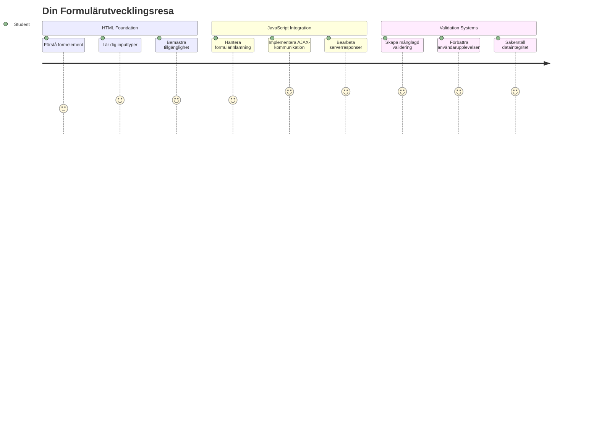
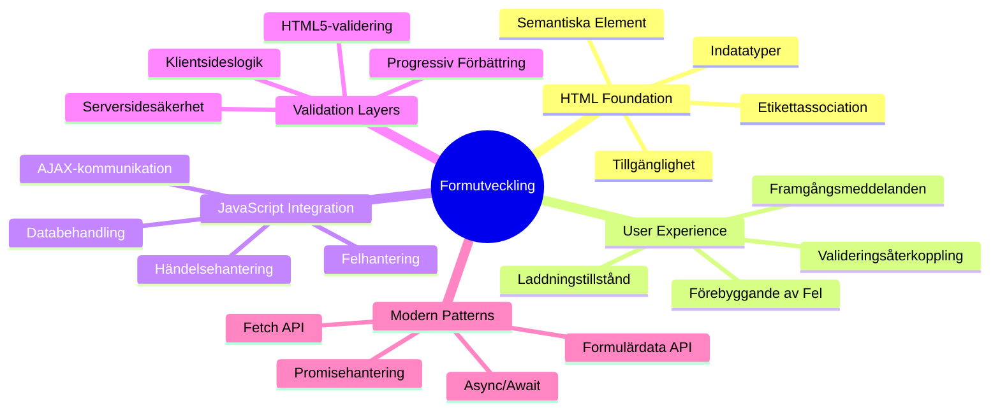
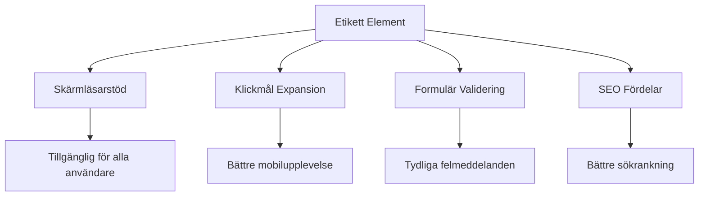
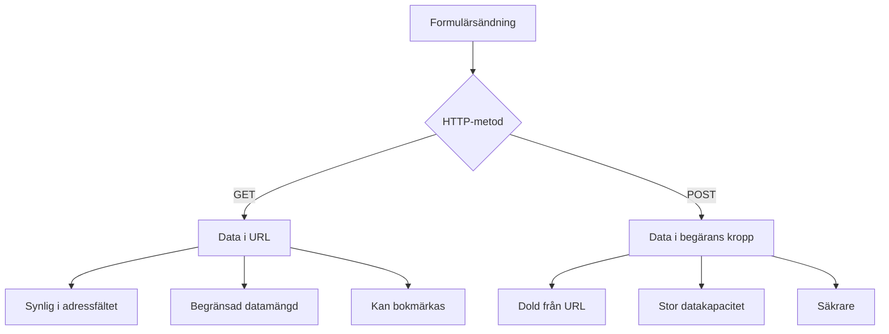
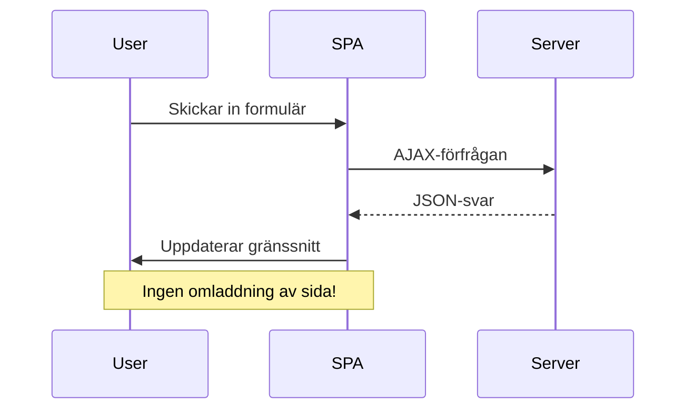
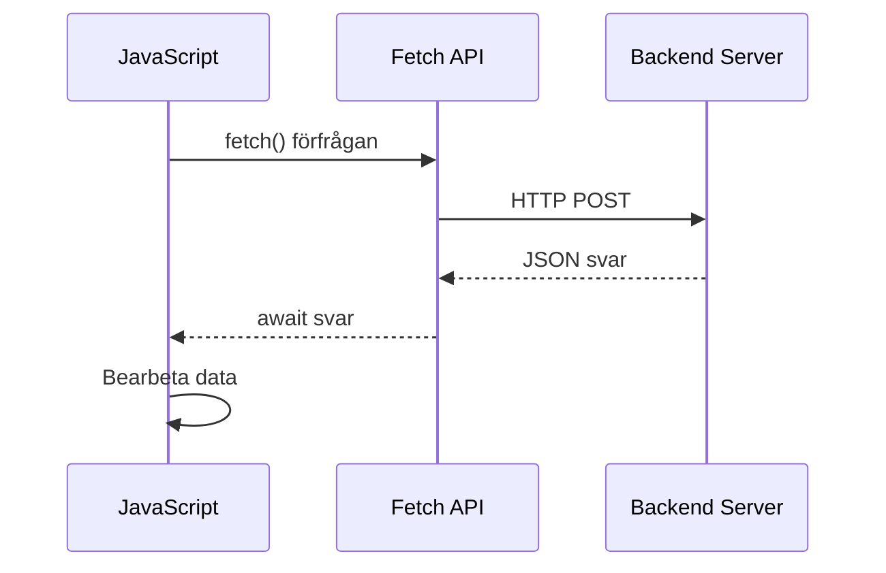
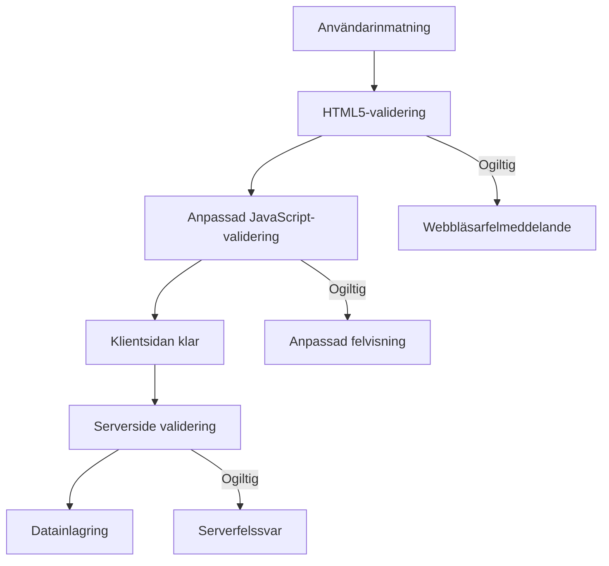
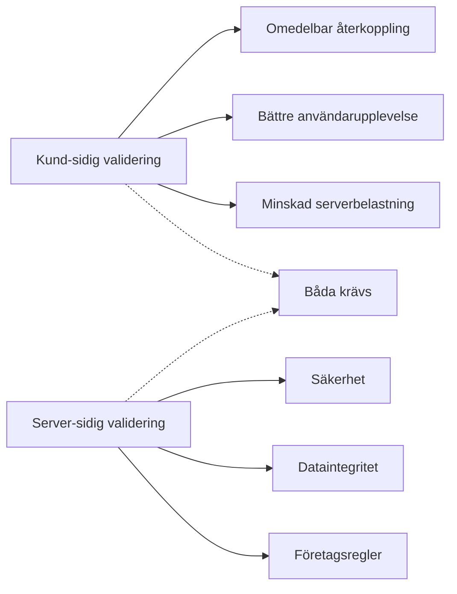
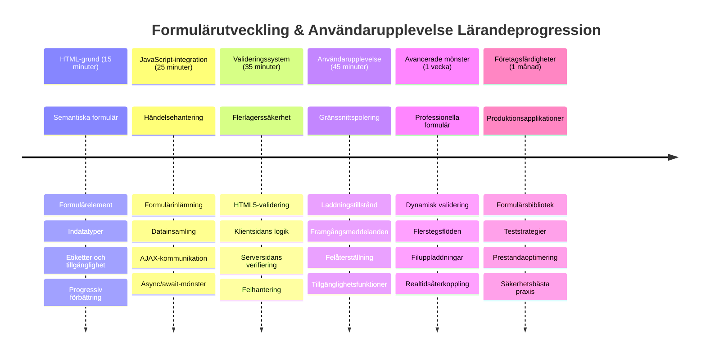

<!--
CO_OP_TRANSLATOR_METADATA:
{
  "original_hash": "7cbdbd132d39a2bb493e85bc2a9387cc",
  "translation_date": "2026-01-06T22:59:42+00:00",
  "source_file": "7-bank-project/2-forms/README.md",
  "language_code": "sv"
}
-->
# Bygg en Bankapp Del 2: Bygg ett Inloggnings- och Registreringsformulär


## Förföreläsningsquiz

[Förföreläsningsquiz](https://ff-quizzes.netlify.app/web/quiz/43)

Har du någonsin fyllt i ett formulär online och fått det att avvisa din e-postadress? Eller förlorat all din information när du klickade på skicka? Vi har alla stött på dessa frustrerande upplevelser.

Formulär är bron mellan dina användare och din applikations funktionalitet. Precis som de noggranna protokoll som flygledare använder för att guida flygplan säkert till deras destinationer, ger välutformade formulär tydlig feedback och förhindrar kostsamma misstag. Dåliga formulär, å andra sidan, kan driva användare bort snabbare än ett missförstånd på en hektisk flygplats.

I den här lektionen kommer vi att omvandla din statiska bankapp till en interaktiv applikation. Du kommer att lära dig att bygga formulär som validerar användarinmatning, kommunicerar med servrar och ger hjälpsam feedback. Tänk på det som att bygga kontrollgränssnittet som låter användare navigera bland din applikations funktioner.

I slutet kommer du att ha ett komplett inloggnings- och registreringssystem med validering som vägleder användare mot framgång istället för frustration.


## Förkunskaper

Innan vi börjar bygga formulär, låt oss försäkra oss om att du har allt uppsatt korrekt. Den här lektionen fortsätter precis där vi slutade i den föregående, så om du hoppade framåt kanske du vill gå tillbaka och få grunderna att fungera först.

### Krävd Uppställning

| Komponent | Status | Beskrivning |
|-----------|--------|-------------|
| [HTML-mallar](../1-template-route/README.md) | ✅ Krävs | Din grundstruktur för bankappen |
| [Node.js](https://nodejs.org) | ✅ Krävs | JavaScript-runtime för servern |
| [Bank API-server](../api/README.md) | ✅ Krävs | Backend-tjänst för datalagring |

> 💡 **Utvecklingstips**: Du kommer att köra två separata servrar samtidigt – en för din front-end bankapp och en annan för backend-API:et. Denna uppställning speglar verklig utveckling där frontend- och backendtjänster fungerar oberoende.

### Serverkonfiguration

**Din utvecklingsmiljö kommer inkludera:**
- **Frontend-server**: Servar din bankapp (vanligtvis port `3000`)
- **Backend API-server**: Hanterar datalagring och hämtning (port `5000`)
- **Båda servrarna** kan köras samtidigt utan konflikter

**Testa din API-anslutning:**
```bash
curl http://localhost:5000/api
# Förväntat svar: "Bank API v1.0.0"
```

**Om du ser API-versionens svar är du redo att gå vidare!**

---

## Förståelse av HTML-formulär och kontroller

HTML-formulär är hur användare kommunicerar med din webbapplikation. Tänk på dem som telegrafsystemet som kopplade samman avlägsna platser på 1800-talet – de är kommunikationsprotokollet mellan användarens avsikt och applikationens svar. När de är genomtänkta fångar de upp fel, guidar inmatningsformat och ger hjälpsamma förslag.

Moderna formulär är betydligt mer sofistikerade än enkla textinmatningar. HTML5 introducerade specialiserade input-typer som automatiskt hanterar e-postvalidering, nummerformat och datumval. Dessa förbättringar gynnar både tillgänglighet och mobilanvändarupplevelser.

### Viktiga Formellement

**Byggstenar som varje formulär behöver:**

```html
<!-- Basic form structure -->
<form id="userForm" method="POST">
  <label for="username">Username</label>
  <input id="username" name="username" type="text" required>
  
  <button type="submit">Submit</button>
</form>
```

**Det här gör koden:**
- **Skapar** en formulärbehållare med ett unikt identifierare
- **Anger** HTTP-metoden för datasändning
- **Kopplar** etiketter till inmatningar för tillgänglighet
- **Definierar** en skicka-knapp för att bearbeta formuläret

### Moderna Input-typer och Attribut

| Input-typ | Syfte | Exempelanvändning |
|------------|---------|---------------|
| `text` | Allmän textinmatning | `<input type="text" name="username">` |
| `email` | E-postvalidering | `<input type="email" name="email">` |
| `password` | Dold textinmatning | `<input type="password" name="password">` |
| `number` | Numerisk inmatning | `<input type="number" name="balance" min="0">` |
| `tel` | Telefonnummer | `<input type="tel" name="phone">` |

> 💡 **Moderna HTML5-fördelar**: Att använda specifika input-typer ger automatisk validering, lämpliga mobil-tangentbord och bättre tillgänglighetsstöd utan extra JavaScript!

### Knapp-typer och beteenden

```html
<!-- Different button behaviors -->
<button type="submit">Save Data</button>     <!-- Submits the form -->
<button type="reset">Clear Form</button>    <!-- Resets all fields -->
<button type="button">Custom Action</button> <!-- No default behavior -->
```

**Det här gör varje knapp-typ:**
- **Skicka-knappar**: Triggar formulärskick och skickar data till angiven slutpunkt
- **Återställ-knappar**: Återställer alla formulärfält till ursprungligt tillstånd
- **Vanliga knappar**: Ger inget standardbeteende, kräver skräddarsydd JavaScript-funktionalitet

> ⚠️ **Viktigt**: `<input>`-elementet är självlutande och kräver ingen avslutande tagg. Modern praxis är att skriva `<input>` utan snedstreck.

### Bygga Ditt Inloggningsformulär

Nu skapar vi ett praktiskt inloggningsformulär som visar moderna HTML-formulärsmetoder. Vi börjar med en grundstruktur och förbättrar den successivt med tillgänglighetsfunktioner och validering.

```html
<template id="login">
  <h1>Bank App</h1>
  <section>
    <h2>Login</h2>
    <form id="loginForm" novalidate>
      <div class="form-group">
        <label for="username">Username</label>
        <input id="username" name="user" type="text" required 
               autocomplete="username" placeholder="Enter your username">
      </div>
      <button type="submit">Login</button>
    </form>
  </section>
</template>
```

**Det som händer här:**
- **Strukturerar** formuläret med semantiska HTML5-element
- **Grupperar** relaterade element med `div`-behållare med meningsfulla klasser
- **Kopplar** etiketter till inmatningar med `for` och `id`-attribut
- **Inkluderar** moderna attribut som `autocomplete` och `placeholder` för bättre UX
- **Lägger till** `novalidate` för att hantera validering med JavaScript istället för webbläsarens standard

### Kraften i Korrekt Etikettering

**Varför etiketter är viktiga för modern webbuteckling:**


**Vad korrekta etiketter åstadkommer:**
- **Möjliggör** att skärmläsare tydligt kan meddela formulärfält
- **Ökar** klickytan (klick på etiketten fokuserar inmatningen)
- **Förbättrar** mobilanvändning med större touchmål
- **Stöder** formulärvalidering med meningsfulla felmeddelanden
- **Förbättrar** SEO genom att ge semantisk mening åt formulärelement

> 🎯 **Åtkomstmål**: Varje formulärinmatning bör ha en kopplad etikett. Denna enkla praxis gör dina formulär användbara för alla, inklusive personer med funktionsnedsättningar, och förbättrar upplevelsen för alla användare.

### Skapa Registreringsformuläret

Registreringsformuläret kräver mer detaljerad information för att skapa ett fullständigt användarkonto. Låt oss bygga det med moderna HTML5-funktioner och förbättrad tillgänglighet.

```html
<hr/>
<h2>Register</h2>
<form id="registerForm" novalidate>
  <div class="form-group">
    <label for="user">Username</label>
    <input id="user" name="user" type="text" required 
           autocomplete="username" placeholder="Choose a username">
  </div>
  
  <div class="form-group">
    <label for="currency">Currency</label>
    <input id="currency" name="currency" type="text" value="$" 
           required maxlength="3" placeholder="USD, EUR, etc.">
  </div>
  
  <div class="form-group">
    <label for="description">Account Description</label>
    <input id="description" name="description" type="text" 
           maxlength="100" placeholder="Personal savings, checking, etc.">
  </div>
  
  <div class="form-group">
    <label for="balance">Starting Balance</label>
    <input id="balance" name="balance" type="number" value="0" 
           min="0" step="0.01" placeholder="0.00">
  </div>
  
  <button type="submit">Create Account</button>
</form>
```

**I ovanstående har vi:**
- **Organiserat** varje fält i container-divar för bättre styling och layout
- **Lagt till** lämpliga `autocomplete`-attribut för webbläsarens autofyll-stöd
- **Inkluderat** hjälpsam platshållartext för att vägleda användarinmatning
- **Satt** rimliga default-värden med `value`-attributet
- **Använt** valideringsattribut som `required`, `maxlength` och `min`
- **Använt** `type="number"` för saldo-fältet med stöd för decimaltal

### Utforska Input-typer och Beteenden

**Moderna input-typer ger förbättrad funktionalitet:**

| Funktion | Fördel | Exempel |
|---------|---------|----------|
| `type="number"` | Numeriskt tangentbord på mobil | Enkel saldo-inmatning |
| `step="0.01"` | Kontroll av decimalprecision | Tillåter cent i valuta |
| `autocomplete` | Webbläsarens autofyll | Snabbare formulärfyllnad |
| `placeholder` | Kontextuella ledtrådar | Vägledning för användaren |

> 🎯 **Tillgänglighetsutmaning**: Försök att navigera formulären enbart med tangentbordet! Använd `Tab` för att flytta mellan fält, `Space` för att markera kryssrutor och `Enter` för att skicka. Denna erfarenhet hjälper dig att förstå hur skärmläsaranvändare interagerar med dina formulär.

### 🔄 **Pedagogisk Kontrollpunkt**
**Förståelse av formulärgrund**: Innan du implementerar JavaScript, se till att du förstår:
- ✅ Hur semantisk HTML skapar tillgängliga formstrukturer
- ✅ Varför input-typer är viktiga för mobil-tangentbord och validering
- ✅ Sambandet mellan etiketter och formulärkontroller
- ✅ Hur formulärattribut påverkar webbläsarens standardbeteende

**Snabb Självtest**: Vad händer om du skickar ett formulär utan JavaScript-hantering?
*Svar: Webbläsaren utför standardinlämning, vanligtvis genom att omdirigera till action-URL*

**HTML5 Formulärfördelar**: Moderna formulär erbjuder:
- **Inbyggd Validering**: Automatisk kontroll av e-post och nummerformat
- **Mobiloptimering**: Lämpliga tangentbord för olika input-typer
- **Tillgänglighet**: Skärmläsarstöd och tangentbordsnavigering
- **Progressiv Förbättring**: Fungerar även utan JavaScript

## Förstå Formulärskickningsmetoder

När någon fyller i ditt formulär och klickar på skicka, måste den datan gå någonstans – vanligtvis till en server som kan spara den. Det finns ett par olika sätt detta kan ske på, och att veta vilken du ska använda kan spara dig huvudvärk senare.

Låt oss titta på vad som egentligen händer när någon klickar på skickaknappen.

### Standardformulärsbeteende

Först, låt oss se vad som händer med grundläggande formulärinlämning:

**Testa dina nuvarande formulär:**
1. Klicka på *Registrera*-knappen i ditt formulär
2. Observera ändringarna i webbläsarens adressfält
3. Lägg märke till hur sidan laddas om och data visas i URL:en


### Jämförelse av HTTP-metoder


**Förstå skillnaderna:**

| Metod | Användningsfall | Data-plats | Säkerhetsnivå | Storleksgräns |
|--------|----------|---------------|----------------|-------------|
| `GET` | Sökfrågor, filter | URL-parametrar | Låg (synlig) | ~2000 tecken |
| `POST` | Användarkonton, känslig data | Request body | Högre (dold) | Ingen praktisk gräns |

**Grundläggande skillnader:**
- **GET**: Lägger till formulärdata i URL:en som query-parametrar (passande för sökoperationer)
- **POST**: Inkluderar data i förfrågningskroppen (väsentligt för känslig information)
- **GET-begränsningar**: Storleksbegränsningar, synlig data, kvarvarande webbläsarhistorik
- **POST-fördelar**: Stor datakapacitet, sekretesskydd, stöd för filuppladdning

> 💡 **Bästa praxis**: Använd `GET` för sökformulär och filter (datahämtning), använd `POST` för användarregistrering, inloggning och skapande av data.

### Konfigurera Formulärskickning

Låt oss konfigurera ditt registreringsformulär för att kommunicera korrekt med backend-API:et med POST-metoden:

```html
<form id="registerForm" action="//localhost:5000/api/accounts" 
      method="POST" novalidate>
```

**Det här gör konfigurationen:**
- **Styr** formulärskickning till ditt API-slutpunkt
- **Använder** POST-metoden för säker datatransmission
- **Inkluderar** `novalidate` för validering med JavaScript

### Testa Formulärskickning

**Följ dessa steg för att testa ditt formulär:**
1. **Fyll i** registreringsformuläret med din information
2. **Klicka** på "Skapa Konto"-knappen
3. **Observera** serverns svar i din webbläsare


**Det du bör se:**
- **Webbläsaren omdirigerar** till API-slutpunkts-URL:en
- **JSON-svar** innehållande ditt nyskapade kontodata
- **Serverbekräftelse** att kontot skapades lyckat

> 🧪 **Experimentera**: Försök registrera igen med samma användarnamn. Vilket svar får du? Detta hjälper dig att förstå hur servern hanterar duplicerad data och felvillkor.

### Förstå JSON-svar

**När servern bearbetar ditt formulär framgångsrikt:**
```json
{
  "user": "john_doe",
  "currency": "$",
  "description": "Personal savings",
  "balance": 100,
  "id": "unique_account_id"
}
```

**Detta svar bekräftar:**
- **Skapar** ett nytt konto med dina angivna data
- **Tilldelar** ett unikt ID för framtida referens
- **Returnerar** all kontoinformation för verifiering
- **Indikerar** framgångsrik lagring i databasen

## Modern Formhantering med JavaScript

Traditionell formulärskickning orsakar full sida-omladdning, likt hur tidiga rymduppdrag krävde kompletta systemnollställningar för kursändringar. Denna metod stör användarupplevelsen och förlorar applikationstillståndet.

JavaScript-formhantering fungerar som kontinuerliga styrsystem som används av moderna rymdfarkoster – gör realtidsjusteringar utan att tappa navigationskontext. Vi kan avbryta formulärskick, ge omedelbar feedback, hantera fel elegant och uppdatera gränssnittet baserat på serverrespons samtidigt som användarens position bevaras i applikationen.

### Varför undvika sida-omladdningar?


**Fördelar med JavaScript-formhantering:**
- **Bibehåller** applikationstillstånd och användarkontext
- **Ger** omedelbar feedback och laddningsindikatorer
- **Möjliggör** dynamisk felhantering och validering
- **Skapar** smidiga, app-liknande användarupplevelser
- **Tillåter** villkorlig logik baserat på serverrespons

### Övergång från Traditionella till Moderna Formulär

**Utmaningar med traditionell metod:**
- **Omdirigerar** användare bort från din applikation
- **Förlorar** aktuell applikationsstatus och kontext
- **Kräver** fullständig omladdning för enkla operationer
- **Ger** begränsad kontroll över användarfeedback

**Fördelar med modern JavaScript-metod:**
- **Håller** användare inom din applikation
- **Bevarar** hela applikationstillståndet och data
- **Möjliggör** validering och feedback i realtid
- **Stöder** progressiv förbättring och tillgänglighet

### Implementera JavaScript Formhantering

Låt oss ersätta traditionell formulärskickning med modern JavaScript-händelsehantering:

```html
<!-- Remove the action attribute and add event handling -->
<form id="registerForm" method="POST" novalidate>
```

**Lägg till registreringslogik i din `app.js`-fil:**

```javascript
// Modern händelsestyrd formulärhantering
function register() {
  const registerForm = document.getElementById('registerForm');
  const formData = new FormData(registerForm);
  const data = Object.fromEntries(formData);
  const jsonData = JSON.stringify(data);
  
  console.log('Form data prepared:', data);
}

// Bifoga händelselyssnare när sidan laddas
document.addEventListener('DOMContentLoaded', () => {
  const registerForm = document.getElementById('registerForm');
  registerForm.addEventListener('submit', (event) => {
    event.preventDefault(); // Förhindra standardformulärsändning
    register();
  });
});
```

**Vad som händer här:**
- **Förhindrar** standardformulärskick med `event.preventDefault()`
- **Hämtar** formulärelementet med modern DOM-selektion
- **Extraherar** formulärdata med kraftfulla `FormData`-API:et
- **Konverterar** FormData till ett vanligt objekt med `Object.fromEntries()`
- **Serialiserar** datan till JSON-format för serverkommunikation
- **Loggar** den bearbetade datan för felsökning och verifiering

### Förstå FormData-API:et

**FormData-API:et erbjuder kraftfull formulärhantering:**
```javascript
// Exempel på vad FormData fångar
const formData = new FormData(registerForm);

// FormData fångar automatiskt:
// {
//   "user": "john_doe",
//   "currency": "$",
//   "description": "Personligt konto",
//   "balance": "100"
// }
```

**Fördelar med FormData API:**
- **Omfattande samling**: Samlar alla formulärelement inklusive text, filer och komplexa inmatningar
- **Typmedvetenhet**: Hanterar automatiskt olika inmatningstyper utan anpassad kodning
- **Effektivitet**: Eliminerar manuell insamling av fält med ett enda API-anrop
- **Anpassningsbarhet**: Behåller funktionalitet när formulärets struktur utvecklas

### Skapa funktionen för serverkommunikation

Låt oss nu bygga en robust funktion för att kommunicera med ditt API-server med moderna JavaScript-mönster:

```javascript
async function createAccount(account) {
  try {
    const response = await fetch('//localhost:5000/api/accounts', {
      method: 'POST',
      headers: { 
        'Content-Type': 'application/json',
        'Accept': 'application/json'
      },
      body: account
    });
    
    // Kontrollera om svaret var framgångsrikt
    if (!response.ok) {
      throw new Error(`HTTP error! status: ${response.status}`);
    }
    
    return await response.json();
  } catch (error) {
    console.error('Account creation failed:', error);
    return { error: error.message || 'Network error occurred' };
  }
}
```

**Förstå asynkron JavaScript:**


**Vad denna moderna implementation uppnår:**
- **Använder** `async/await` för läsbar asynkron kod
- **Inkluderar** korrekt felhantering med try/catch-block
- **Kontrollerar** responsstatus innan data behandlas
- **Sätter** lämpliga headers för JSON-kommunikation
- **Ger** detaljerade felmeddelanden för felsökning
- **Returnerar** konsekvent datastruktur vid både framgång och fel

### Kraften i den moderna Fetch API

**Fördelar med Fetch API över äldre metoder:**

| Funktion | Fördel | Implementation |
|---------|---------|----------------|
| Promise-baserad | Ren asynkron kod | `await fetch()` |
| Anpassning av förfrågan | Full HTTP-kontroll | Headers, metoder, body |
| Responsbehandling | Flexibel dataparsering | `.json()`, `.text()`, `.blob()` |
| Felhantering | Omfattande felavlyssning | Try/catch-block |

> 🎥 **Lär dig mer**: [Async/Await Tutorial](https://youtube.com/watch?v=YwmlRkrxvkk) - Förstå asynkrona JavaScript-mönster för modern webbutveckling.

**Nyckelkoncept för serverkommunikation:**
- **Async-funktioner** tillåter att pausa exekvering för att vänta på serversvar
- **Await-nyckelordet** gör att asynkron kod läses som synkron
- **Fetch API** tillhandahåller moderna, promise-baserade HTTP-förfrågningar
- **Felhantering** säkerställer att din app reagerar graciöst vid nätverksproblem

### Komplettera registreringsfunktionen

Låt oss sammanfoga allt med en komplett, produktionsredo registreringsfunktion:

```javascript
async function register() {
  const registerForm = document.getElementById('registerForm');
  const submitButton = registerForm.querySelector('button[type="submit"]');
  
  try {
    // Visa laddningstillstånd
    submitButton.disabled = true;
    submitButton.textContent = 'Creating Account...';
    
    // Bearbeta formulärdata
    const formData = new FormData(registerForm);
    const jsonData = JSON.stringify(Object.fromEntries(formData));
    
    // Skicka till servern
    const result = await createAccount(jsonData);
    
    if (result.error) {
      console.error('Registration failed:', result.error);
      alert(`Registration failed: ${result.error}`);
      return;
    }
    
    console.log('Account created successfully!', result);
    alert(`Welcome, ${result.user}! Your account has been created.`);
    
    // Återställ formulär efter lyckad registrering
    registerForm.reset();
    
  } catch (error) {
    console.error('Unexpected error:', error);
    alert('An unexpected error occurred. Please try again.');
  } finally {
    // Återställ knappens tillstånd
    submitButton.disabled = false;
    submitButton.textContent = 'Create Account';
  }
}
```

**Denna förbättrade implementation inkluderar:**
- **Ger** visuell feedback under formulärinsändning
- **Inaktiverar** skicka-knappen för att förhindra dubbla inskickningar
- **Hanterar** både förväntade och oväntade fel elegant
- **Visar** användarvänliga framgångs- och felmeddelanden
- **Återställer** formuläret efter lyckad registrering
- **Återställer** UI-läget oavsett resultat

### Testa din implementation

**Öppna webbläsarens utvecklarverktyg och testa registreringen:**

1. **Öppna** webbläsarkonsolen (F12 → Console-fliken)
2. **Fyll i** registreringsformuläret
3. **Klicka** på "Create Account"
4. **Observera** konsolmeddelanden och användarfeedback


**Vad du bör se:**
- **Laddningstillstånd** visas på skicka-knappen
- **Konsolloggar** visar detaljerad information om processen
- **Framgångsmeddelande** visas när kontoskapande lyckas
- **Formuläret återställs** automatiskt efter lyckad inskickning

> 🔒 **Säkerhetstänk**: För närvarande skickas data över HTTP, vilket inte är säkert i produktion. I verkliga applikationer ska du alltid använda HTTPS för att kryptera datatrafiken. Läs mer om [HTTPS-säkerhet](https://en.wikipedia.org/wiki/HTTPS) och varför det är viktigt för att skydda användardata.

### 🔄 **Pedagogisk kontroll**
**Modern JavaScript-integration**: Verifiera din förståelse av asynkron formulärhantering:
- ✅ Hur ändrar `event.preventDefault()` standardbeteendet för formulär?
- ✅ Varför är FormData API mer effektivt än manuell fältinsamling?
- ✅ Hur förbättrar async/await-mönster kodläsbarheten?
- ✅ Vilken roll har felhantering i användarupplevelsen?

**Systemarkitektur**: Din formulärhantering visar:
- **Händelsedriven programmering**: Formulär reagerar på användaråtgärder utan omladdning
- **Asynkron kommunikation**: Serverförfrågningar blockerar inte användargränssnittet
- **Felhantering**: Graciös nedbrytning vid nätverksfel
- **Tillståndshantering**: UI uppdateras enligt serverns svar
- **Progressiv förbättring**: Grundfunktionalitet fungerar, JavaScript förbättrar upplevelsen

**Professionella mönster**: Du har implementerat:
- **Enkelansvar**: Funktioner har tydliga och fokuserade syften
- **Felgränser**: Try/catch-block förhindrar programmets krasch
- **Användarfeedback**: Laddningstillstånd och framgångs/felmeddelanden
- **Datatransformering**: Från FormData till JSON för serverkommunikation

## Omfattande formulärvalidering

Formulärvalidering förhindrar frustrationen av att upptäcka fel först efter inskickning. Precis som de många redundanta systemen på Internationella rymdstationen, använder effektiv validering flera lager av säkerhetskontroller.

Den optimala metoden kombinerar webbläsarens inbyggda validering för omedelbar feedback, JavaScript-validering för förbättrad användarupplevelse och servervalidering för säkerhet och dataintegritet. Denna redundans säkerställer både användarnöjdhet och systemskydd.

### Förstå valideringslager


**Strategi med flerskiktsvalidering:**
- **HTML5-validering**: Omedelbara webbläsarkontroller
- **JavaScript-validering**: Anpassad logik och användarupplevelse
- **Servervalidering**: Slutgiltiga säkerhets- och integritetskontroller
- **Progressiv förbättring**: Fungerar även om JavaScript är inaktiverat

### HTML5-valideringsattribut

**Moderna valideringsverktyg till ditt förfogande:**

| Attribut | Syfte | Exempelanvändning | Webbläsarens beteende |
|-----------|---------|---------------|------------------|
| `required` | Obligatoriska fält | `<input required>` | Förhindrar tom inskickning |
| `minlength`/`maxlength` | Begränsningar av textlängd | `<input maxlength="20">` | Tvingar teckenbegränsning |
| `min`/`max` | Numeriska intervall | `<input min="0" max="1000">` | Validerar numeriska gränser |
| `pattern` | Anpassade regex-regler | `<input pattern="[A-Za-z]+">` | Matchar specifika format |
| `type` | Datatypvalidering | `<input type="email">` | Validering specifik för format |

### CSS-valideringsstil

**Skapa visuell feedback för valideringstillstånd:**

```css
/* Valid input styling */
input:valid {
  border-color: #28a745;
  background-color: #f8fff9;
}

/* Invalid input styling */
input:invalid {
  border-color: #dc3545;
  background-color: #fff5f5;
}

/* Focus states for better accessibility */
input:focus:valid {
  box-shadow: 0 0 0 0.2rem rgba(40, 167, 69, 0.25);
}

input:focus:invalid {
  box-shadow: 0 0 0 0.2rem rgba(220, 53, 69, 0.25);
}
```

**Vad dessa visuella signaler uppnår:**
- **Gröna ramar**: Indikerar framgångsrik validering, likt grönt ljus i kontrollrummet
- **Röda ramar**: Signalera valideringsfel som kräver uppmärksamhet
- **Fokusmarkeringar**: Ger tydlig visuell kontext för aktuell inmatningsplats
- **Konsekvent stil**: Skapar förutsägbara gränssnittsmönster användare kan lära sig

> 💡 **Proffs-tips**: Använd CSS-pseudoklasser `:valid` och `:invalid` för att ge omedelbar visuell feedback medan användare skriver, vilket skapar ett responsivt och hjälpsamt gränssnitt.

### Implementera omfattande validering

Låt oss förfina ditt registreringsformulär med robust validering som erbjuder utmärkt användarupplevelse och datakvalitet:

```html
<form id="registerForm" method="POST" novalidate>
  <div class="form-group">
    <label for="user">Username <span class="required">*</span></label>
    <input id="user" name="user" type="text" required 
           minlength="3" maxlength="20" 
           pattern="[a-zA-Z0-9_]+" 
           autocomplete="username"
           title="Username must be 3-20 characters, letters, numbers, and underscores only">
    <small class="form-text">Choose a unique username (3-20 characters)</small>
  </div>
  
  <div class="form-group">
    <label for="currency">Currency <span class="required">*</span></label>
    <input id="currency" name="currency" type="text" required 
           value="$" maxlength="3" 
           pattern="[A-Z$€£¥₹]+" 
           title="Enter a valid currency symbol or code">
    <small class="form-text">Currency symbol (e.g., $, €, £)</small>
  </div>
  
  <div class="form-group">
    <label for="description">Account Description</label>
    <input id="description" name="description" type="text" 
           maxlength="100" 
           placeholder="Personal savings, checking, etc.">
    <small class="form-text">Optional description (up to 100 characters)</small>
  </div>
  
  <div class="form-group">
    <label for="balance">Starting Balance</label>
    <input id="balance" name="balance" type="number" 
           value="0" min="0" step="0.01" 
           title="Enter a positive number for your starting balance">
    <small class="form-text">Initial account balance (minimum $0.00)</small>
  </div>
  
  <button type="submit">Create Account</button>
</form>
```

**Förstå den förbättrade valideringen:**
- **Kombinerar** obligatoriska fältindikatorer med hjälpsamma beskrivningar
- **Inkluderar** `pattern`-attribut för formatvalidering
- **Ger** `title`-attribut för tillgänglighet och verktygstips
- **Lägger till** hjälpsam text för att guida användarinmatning
- **Använder** semantisk HTML-struktur för bättre tillgänglighet

### Avancerade valideringsregler

**Vad varje valideringsregel uppnår:**

| Fält | Valideringsregler | Användarnytta |
|-------|------------------|--------------|
| Användarnamn | `required`, `minlength="3"`, `maxlength="20"`, `pattern="[a-zA-Z0-9_]+"` | Säkerställer giltiga, unika identifierare |
| Valuta | `required`, `maxlength="3"`, `pattern="[A-Z$€£¥₹]+"` | Accepterar vanliga valutasymboler |
| Balans | `min="0"`, `step="0.01"`, `type="number"` | Förhindrar negativa saldon |
| Beskrivning | `maxlength="100"` | Rimliga längdbegränsningar |

### Testa valideringsbeteendet

**Prova dessa valideringsscenarier:**
1. **Skicka** formuläret med tomma obligatoriska fält
2. **Ange** ett användarnamn kortare än 3 tecken
3. **Försök** använda specialtecken i användarnamnsfältet
4. **Fyll i** ett negativt saldo


**Vad du kommer att se:**
- **Webbläsaren visar** inbyggda valideringsmeddelanden
- **Stiländringar** baserade på `:valid` och `:invalid` tillstånd
- **Formulärinsändning** förhindras tills alla valideringar klarar
- **Fokus flyttas automatiskt** till det första ogiltiga fältet

### Klient- vs servervalidering


**Varför du behöver båda lagren:**
- **Klientvalidering**: Ger omedelbar feedback och förbättrar användarupplevelse
- **Servervalidering**: Säkerställer säkerhet och hanterar komplexa affärsregler
- **Kombinerad metod**: Skapar robusta, användarvänliga och säkra applikationer
- **Progressiv förbättring**: Fungerar även när JavaScript är inaktiverat

> 🛡️ **Säkerhetspåminnelse**: Lita aldrig enbart på klientvalidering! Illasinnade användare kan kringgå klientkontroller, så servervalidering är avgörande för säkerhet och dataintegritet.

### ⚡ **Vad du kan göra på 5 minuter**
- [ ] Testa ditt formulär med ogiltiga data för att se valideringsmeddelanden
- [ ] Försök skicka formuläret med JavaScript inaktiverat för att se HTML5-validering
- [ ] Öppna webbläsarens DevTools och inspektera formulärdata som skickas till servern
- [ ] Experimentera med olika inmatningstyper för att se förändringar i mobilens tangentbord

### 🎯 **Vad du kan uppnå under denna timme**
- [ ] Klara post-lektionens frågesport och förstå formulärhanteringskoncepten
- [ ] Implementera den omfattande valideringsutmaningen med realtidsfeedback
- [ ] Lägg till CSS-styling för att skapa professionella formulär
- [ ] Skapa felhantering för dubbla användarnamn och serverfel
- [ ] Lägg till lösenordsbekräftelsefält med matchande validering

### 📅 **Din veckolånga resa till formulärmästerskap**
- [ ] Slutföra hela bankappen med avancerade formulärfunktioner
- [ ] Implementera filuppladdning för profilbilder eller dokument
- [ ] Lägg till flerstegsformulär med progressindikatorer och tillståndshantering
- [ ] Skapa dynamiska formulär som anpassar sig efter användarval
- [ ] Implementera formulärautosparande och återställning för bättre användarupplevelse
- [ ] Lägg till avancerad validering som e-postverifiering och telefonnummerformatering

### 🌟 **Din månadsresa till frontend-mästerskap**
- [ ] Bygg komplexa formapplikationer med villkorsstyrd logik och arbetsflöden
- [ ] Lär dig formulärbibliotek och ramverk för snabb utveckling
- [ ] Bemästra tillgänglighetsriktlinjer och inkluderande designprinciper
- [ ] Implementera internationalisering och lokalisering för globala formulär
- [ ] Skapa återanvändbara formulärkomponentbibliotek och designsystem
- [ ] Bidra till open source-formprojekt och dela bästa praxis

## 🎯 Din tidslinje för formulärutvecklingsmästerskap


### 🛠️ Sammanfattning av ditt formulärutvecklingsverktyg

Efter denna lektion har du nu behärskat:
- **HTML5-formulär**: Semantisk struktur, inmatningstyper och tillgänglighetsfunktioner
- **JavaScript-formhantering**: Eventhantering, datainsamling och AJAX-kommunikation
- **Valideringsarkitektur**: Flerskiktsvalidering för säkerhet och användarupplevelse
- **Asynkron programmering**: Modern fetch API och async/await-mönster
- **Felhantering**: Omfattande felhantering och användarfeedbacksystem
- **Användarupplevelsedesign**: Laddningstillstånd, framgångsmeddelanden och felåterhämtning
- **Progressiv förbättring**: Formulär som fungerar i alla webbläsare och kapabiliteter

**Verkliga tillämpningar**: Dina formulärutvecklingsfärdigheter kan direkt användas till:
- **E-handelsapplikationer**: Kassaprocesser, kontoregistrering och betalningsformulär
- **Företagsprogramvara**: Datasystem, rapportgränssnitt och arbetsflödesapplikationer
- **Innehållshantering**: Publiceringsplattformar, användargenererat innehåll och administrativa gränssnitt
- **Finansapplikationer**: Bankgränssnitt, investeringsplattformar och transaktionssystem
- **Hälsosystem**: Patientportaler, bokningssystem och medicinska formulär
- **Utbildningsplattformar**: Kursregistrering, bedömningsverktyg och lärplattformar

**Professionella färdigheter du fått**: Du kan nu:
- **Designa** tillgängliga formulär som fungerar för alla användare, även med funktionshinder
- **Implementera** säker formulärvalidering som förhindrar datakorruption och säkerhetsbrister
- **Skapa** responsiva användargränssnitt som ger tydlig feedback och vägledning
- **Felsöka** komplexa formulärinteraktioner med webbläsarens utvecklarverktyg och nätverksanalys
- **Optimera** formulärprestanda genom effektiv databehandling och valideringsstrategier

**Frontend-utvecklingskoncept bemästrade**:
- **Händelsedriven arkitektur**: Hantering av användarinteraktion och respons
- **Asynkron programmering**: Icke-blockerande serverkommunikation och felhantering
- **Datavalidering**: Klient- och server-säkerhet och integritetskontroller
- **Användarupplevelsedesign**: Intuitiva gränssnitt som leder användaren till framgång
- **Tillgänglighetsingenjör**: Inkluderande design som fungerar för olika användarbehov

**Nästa nivå**: Du är redo att utforska avancerade formulärbibliotek, implementera komplexa valideringsregler eller bygga företagsklassade datainsamlingssystem!

🌟 **Prestationsbelöning**: Du har byggt ett komplett formulärhanteringssystem med professionell validering, felhantering och användarupplevelsemönster!

---


---

## GitHub Copilot Agent Challenge 🚀

Använd Agent-läge för att slutföra följande utmaning:

**Beskrivning:** Förbättra registreringsformuläret med omfattande klientvalidering och användarfeedback. Denna utmaning hjälper dig att öva formulärvalidering, felhantering och förbättrad användarupplevelse med interaktiv feedback.
**Prompt:** Skapa ett komplett formulärvalideringssystem för registreringsformuläret som inkluderar: 1) Valideringsfeedback i realtid för varje fält medan användaren skriver, 2) Egna valideringsmeddelanden som visas under varje inmatningsfält, 3) Ett lösenordsbekräftelsefält med validering för att matcha lösenordet, 4) Visuella indikatorer (som gröna bockar för giltiga fält och röda varningar för ogiltiga), 5) En skicka-knapp som endast blir aktiverad när alla valideringar har godkänts. Använd HTML5-valideringsattribut, CSS för styling av valideringstillstånden och JavaScript för interaktiv funktionalitet.

Läs mer om [agent mode](https://code.visualstudio.com/blogs/2025/02/24/introducing-copilot-agent-mode) här.

## 🚀 Utmaning

Visa ett felmeddelande i HTML om användaren redan finns.

Här är ett exempel på hur den slutliga inloggningssidan kan se ut efter lite styling:


## Quiz efter föreläsningen

[Post-lecture quiz](https://ff-quizzes.netlify.app/web/quiz/44)

## Genomgång & Självstudier

Utvecklare har blivit mycket kreativa i sina formulärbyggnadsinsatser, särskilt när det gäller valideringsstrategier. Lär dig om olika formulärflöden genom att titta på [CodePen](https://codepen.com); kan du hitta några intressanta och inspirerande formulär?

## Uppgift

[Styla din bankapp](assignment.md)

---

<!-- CO-OP TRANSLATOR DISCLAIMER START -->
**Ansvarsfriskrivning**:
Detta dokument har översatts med hjälp av AI-översättningstjänsten [Co-op Translator](https://github.com/Azure/co-op-translator). Även om vi strävar efter noggrannhet, vänligen observera att automatiska översättningar kan innehålla fel eller brister. Det ursprungliga dokumentet på dess modersmål bör betraktas som den auktoritativa källan. För viktig information rekommenderas professionell mänsklig översättning. Vi ansvarar inte för några missförstånd eller feltolkningar som uppstår på grund av användningen av denna översättning.
<!-- CO-OP TRANSLATOR DISCLAIMER END -->