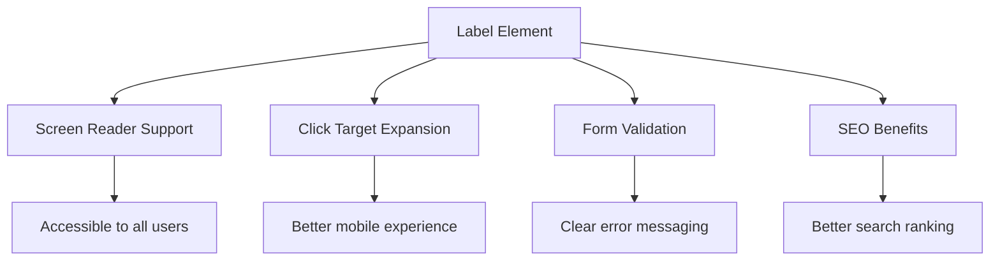
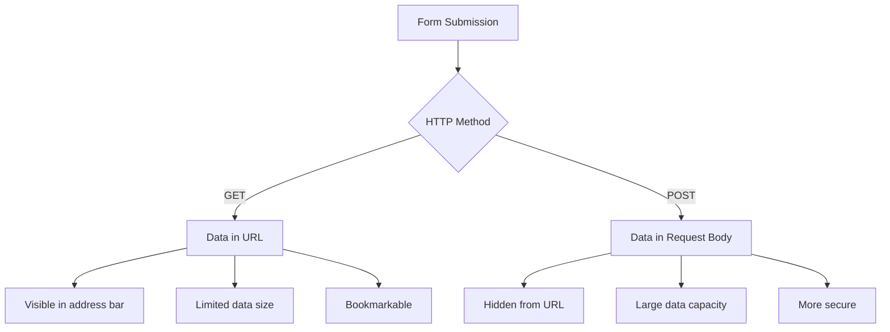
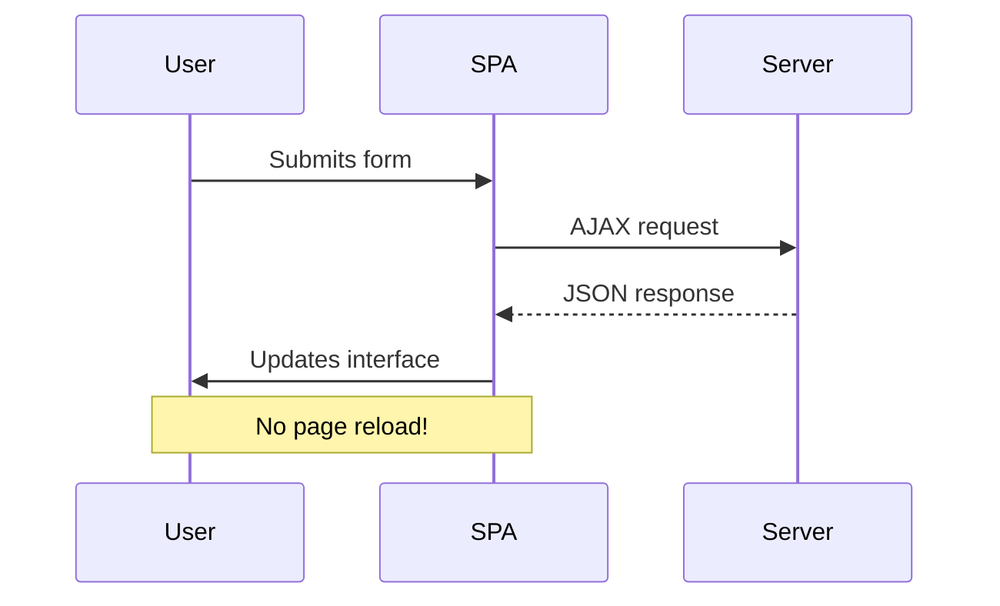
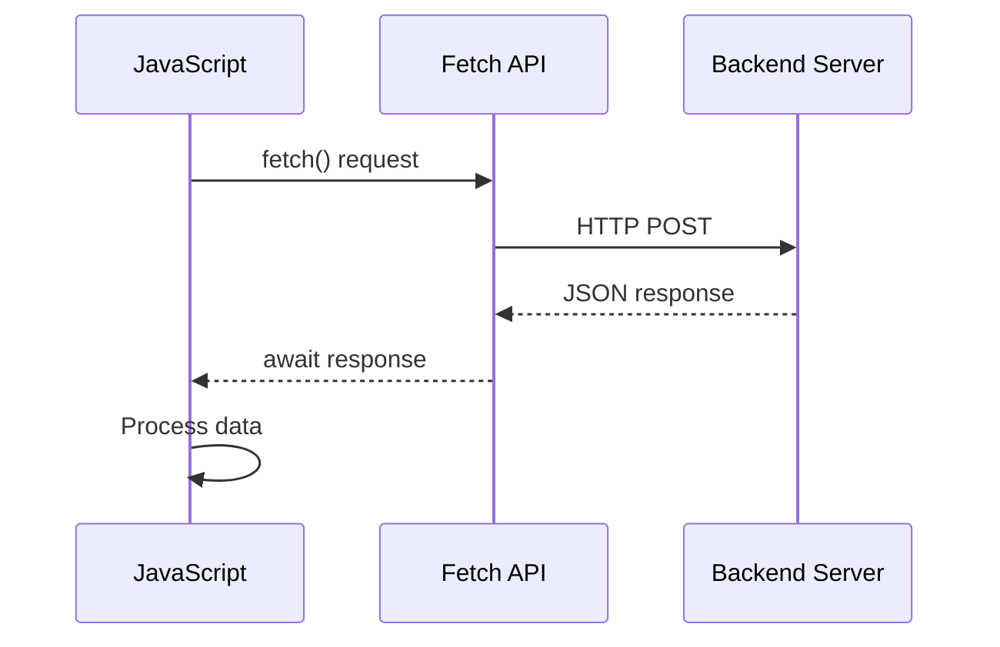
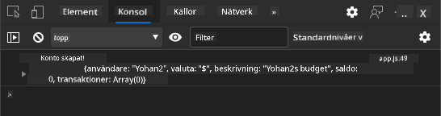
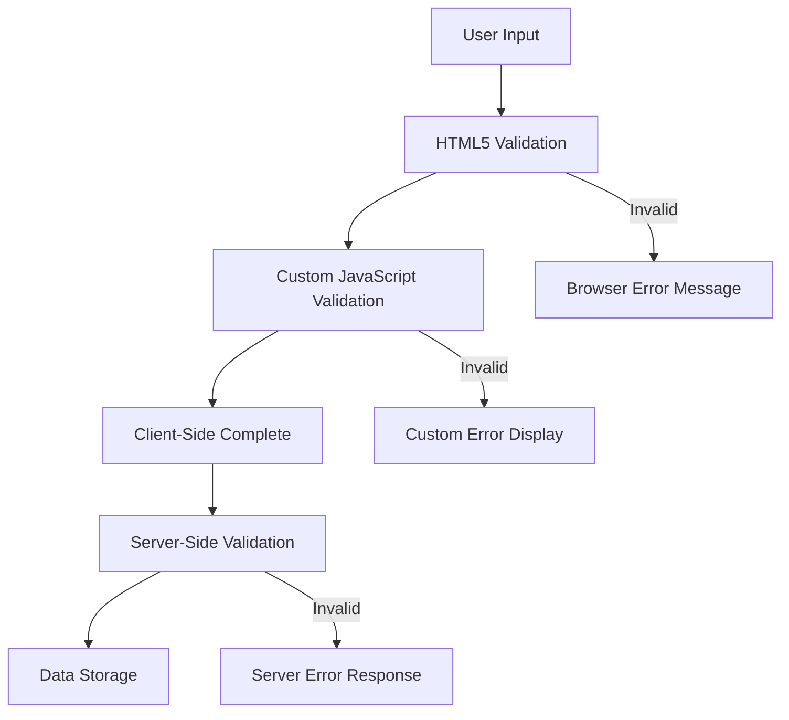
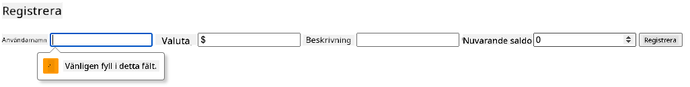
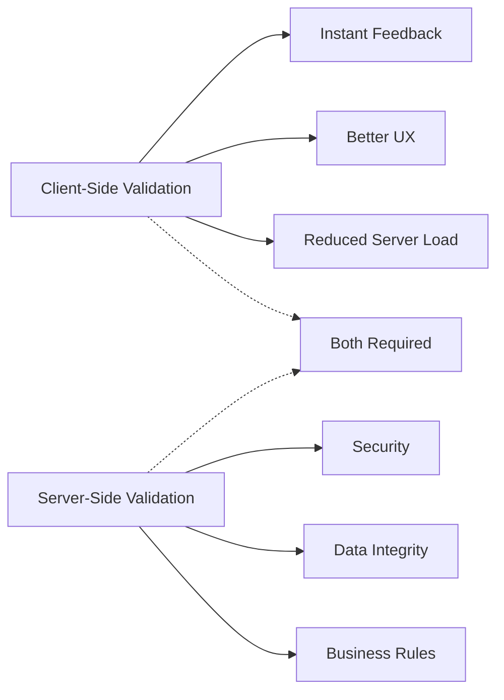
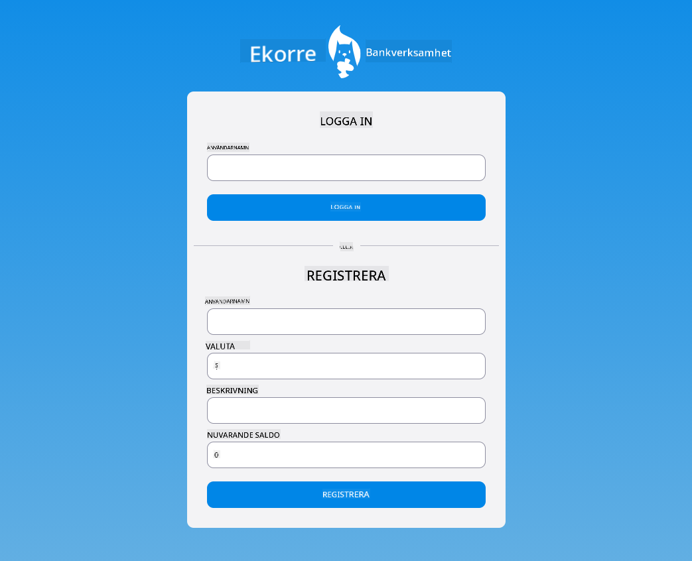

<!--
CO_OP_TRANSLATOR_METADATA:
{
  "original_hash": "b24f28fc46dd473aa9080f174182adde",
  "translation_date": "2025-10-23T21:43:39+00:00",
  "source_file": "7-bank-project/2-forms/README.md",
  "language_code": "sv"
}
-->
# Bygg en bankapp del 2: Skapa ett inloggnings- och registreringsformulär

## Förkunskapsquiz

[Förkunskapsquiz](https://ff-quizzes.netlify.app/web/quiz/43)

Har du någonsin fyllt i ett formulär online och fått ditt e-postformat avvisat? Eller förlorat all information när du klickade på "skicka"? Vi har alla stött på dessa frustrerande upplevelser.

Formulär är bron mellan dina användare och din applikations funktionalitet. Precis som de noggranna protokoll som flygledare använder för att guida flygplan säkert till sina destinationer, ger välutformade formulär tydlig feedback och förhindrar kostsamma misstag. Dåligt utformade formulär kan däremot skrämma bort användare snabbare än en misskommunikation på en hektisk flygplats.

I den här lektionen kommer vi att förvandla din statiska bankapp till en interaktiv applikation. Du kommer att lära dig att skapa formulär som validerar användarinmatning, kommunicerar med servrar och ger användbar feedback. Tänk på det som att bygga kontrollgränssnittet som låter användare navigera i din applikations funktioner.

I slutet kommer du att ha ett komplett inloggnings- och registreringssystem med validering som guidar användarna mot framgång istället för frustration.

## Förutsättningar

Innan vi börjar bygga formulär, låt oss se till att du har allt korrekt inställt. Den här lektionen fortsätter där vi slutade i den föregående, så om du hoppade framåt kan det vara bra att gå tillbaka och få grunderna att fungera först.

### Nödvändig inställning

| Komponent | Status | Beskrivning |
|-----------|--------|-------------|
| [HTML-mallar](../1-template-route/README.md) | ✅ Nödvändig | Grundstrukturen för din bankapp |
| [Node.js](https://nodejs.org) | ✅ Nödvändig | JavaScript-runtime för servern |
| [Bank API-server](../api/README.md) | ✅ Nödvändig | Backend-tjänst för datalagring |

> 💡 **Utvecklingstips**: Du kommer att köra två separata servrar samtidigt – en för din frontend-bankapp och en annan för backend-API:t. Denna inställning speglar verklig utveckling där frontend- och backend-tjänster fungerar oberoende av varandra.

### Serverkonfiguration

**Din utvecklingsmiljö kommer att inkludera:**
- **Frontend-server**: Serverar din bankapp (vanligtvis port `3000`)
- **Backend API-server**: Hanterar datalagring och hämtning (port `5000`)
- **Båda servrarna** kan köras samtidigt utan konflikter

**Testa din API-anslutning:**
```bash
curl http://localhost:5000/api
# Expected response: "Bank API v1.0.0"
```

**Om du ser API-versionens svar är du redo att fortsätta!**

---

## Förstå HTML-formulär och kontroller

HTML-formulär är hur användare kommunicerar med din webbapplikation. Tänk på dem som telegrafsystemet som kopplade samman avlägsna platser på 1800-talet – de är kommunikationsprotokollet mellan användarens intention och applikationens svar. När de är genomtänkt designade fångar de fel, guidar inmatningsformat och ger användbara förslag.

Moderna formulär är betydligt mer sofistikerade än grundläggande textinmatningar. HTML5 introducerade specialiserade inmatningstyper som automatiskt hanterar e-postvalidering, nummerformat och datumval. Dessa förbättringar gynnar både tillgänglighet och mobilanvändarupplevelser.

### Grundläggande formulärelement

**Byggstenar som varje formulär behöver:**

```html
<!-- Basic form structure -->
<form id="userForm" method="POST">
  <label for="username">Username</label>
  <input id="username" name="username" type="text" required>
  
  <button type="submit">Submit</button>
</form>
```

**Vad denna kod gör:**
- **Skapar** en formulärbehållare med en unik identifierare
- **Anger** HTTP-metoden för dataöverföring
- **Associerar** etiketter med inmatningar för tillgänglighet
- **Definierar** en skicka-knapp för att bearbeta formuläret

### Moderna inmatningstyper och attribut

| Inmatningstyp | Syfte | Exempel på användning |
|---------------|-------|-----------------------|
| `text` | Allmän textinmatning | `<input type="text" name="username">` |
| `email` | E-postvalidering | `<input type="email" name="email">` |
| `password` | Dold textinmatning | `<input type="password" name="password">` |
| `number` | Numerisk inmatning | `<input type="number" name="balance" min="0">` |
| `tel` | Telefonnummer | `<input type="tel" name="phone">` |

> 💡 **Fördel med modern HTML5**: Genom att använda specifika inmatningstyper får du automatisk validering, lämpliga mobiltangentbord och bättre stöd för tillgänglighet utan extra JavaScript!

### Knapptyper och beteende

```html
<!-- Different button behaviors -->
<button type="submit">Save Data</button>     <!-- Submits the form -->
<button type="reset">Clear Form</button>    <!-- Resets all fields -->
<button type="button">Custom Action</button> <!-- No default behavior -->
```

**Vad varje knapptyp gör:**
- **Skicka-knappar**: Startar formuläröverföring och skickar data till den angivna slutpunkten
- **Återställ-knappar**: Återställer alla formulärfält till deras ursprungliga tillstånd
- **Vanliga knappar**: Har inget standardbeteende och kräver anpassad JavaScript för funktionalitet

> ⚠️ **Viktig notering**: `<input>`-elementet är självstängande och kräver ingen avslutande tagg. Modern bästa praxis är att skriva `<input>` utan snedstreck.

### Skapa ditt inloggningsformulär

Nu ska vi skapa ett praktiskt inloggningsformulär som demonstrerar moderna HTML-formulärprinciper. Vi börjar med en grundläggande struktur och förbättrar den gradvis med tillgänglighetsfunktioner och validering.

```html
<template id="login">
  <h1>Bank App</h1>
  <section>
    <h2>Login</h2>
    <form id="loginForm" novalidate>
      <div class="form-group">
        <label for="username">Username</label>
        <input id="username" name="user" type="text" required 
               autocomplete="username" placeholder="Enter your username">
      </div>
      <button type="submit">Login</button>
    </form>
  </section>
</template>
```

**Genomgång av vad som händer här:**
- **Strukturerar** formuläret med semantiska HTML5-element
- **Grupperar** relaterade element med `div`-behållare med meningsfulla klasser
- **Associerar** etiketter med inmatningar med hjälp av attributen `for` och `id`
- **Inkluderar** moderna attribut som `autocomplete` och `placeholder` för bättre användarupplevelse
- **Lägger till** `novalidate` för att hantera validering med JavaScript istället för webbläsarens standardinställningar

### Kraften i korrekta etiketter

**Varför etiketter är viktiga för modern webbutveckling:**



**Vad korrekta etiketter åstadkommer:**
- **Möjliggör** att skärmläsare tydligt kan annonsera formulärfält
- **Utökar** det klickbara området (att klicka på etiketten fokuserar inmatningen)
- **Förbättrar** mobilanvändbarheten med större beröringsmål
- **Stödjer** formulärvalidering med meningsfulla felmeddelanden
- **Förbättrar** SEO genom att ge semantisk betydelse till formulärelement

> 🎯 **Tillgänglighetsmål**: Varje formulärinmatning bör ha en associerad etikett. Denna enkla praxis gör dina formulär användbara för alla, inklusive användare med funktionsnedsättningar, och förbättrar upplevelsen för alla användare.

### Skapa registreringsformuläret

Registreringsformuläret kräver mer detaljerad information för att skapa ett komplett användarkonto. Låt oss bygga det med moderna HTML5-funktioner och förbättrad tillgänglighet.

```html
<hr/>
<h2>Register</h2>
<form id="registerForm" novalidate>
  <div class="form-group">
    <label for="user">Username</label>
    <input id="user" name="user" type="text" required 
           autocomplete="username" placeholder="Choose a username">
  </div>
  
  <div class="form-group">
    <label for="currency">Currency</label>
    <input id="currency" name="currency" type="text" value="$" 
           required maxlength="3" placeholder="USD, EUR, etc.">
  </div>
  
  <div class="form-group">
    <label for="description">Account Description</label>
    <input id="description" name="description" type="text" 
           maxlength="100" placeholder="Personal savings, checking, etc.">
  </div>
  
  <div class="form-group">
    <label for="balance">Starting Balance</label>
    <input id="balance" name="balance" type="number" value="0" 
           min="0" step="0.01" placeholder="0.00">
  </div>
  
  <button type="submit">Create Account</button>
</form>
```

**I ovanstående har vi:**
- **Organiserat** varje fält i behållar-divar för bättre styling och layout
- **Lagt till** lämpliga `autocomplete`-attribut för webbläsarens autofyllstöd
- **Inkluderat** hjälpsam platshållartext för att guida användarinmatning
- **Satt** rimliga standardvärden med hjälp av attributet `value`
- **Använt** valideringsattribut som `required`, `maxlength` och `min`
- **Använt** `type="number"` för balansfältet med decimalsupport

### Utforska inmatningstyper och beteende

**Moderna inmatningstyper ger förbättrad funktionalitet:**

| Funktion | Fördel | Exempel |
|----------|--------|---------|
| `type="number"` | Numeriskt tangentbord på mobil | Enklare balansinmatning |
| `step="0.01"` | Kontroll av decimalprecision | Tillåter cent i valuta |
| `autocomplete` | Webbläsarens autofyll | Snabbare formulärifyllning |
| `placeholder` | Kontextuella tips | Guidar användarens förväntningar |

> 🎯 **Tillgänglighetsutmaning**: Försök navigera i formulären med bara ditt tangentbord! Använd `Tab` för att flytta mellan fält, `Space` för att markera kryssrutor och `Enter` för att skicka. Denna upplevelse hjälper dig att förstå hur skärmläsaranvändare interagerar med dina formulär.

## Förstå metoder för formuläröverföring

När någon fyller i ditt formulär och klickar på "skicka" måste den datan skickas någonstans – vanligtvis till en server som kan spara den. Det finns ett par olika sätt detta kan ske på, och att veta vilket du ska använda kan spara dig från huvudvärk senare.

Låt oss titta på vad som faktiskt händer när någon klickar på skicka-knappen.

### Standardbeteende för formulär

Låt oss först observera vad som händer med grundläggande formuläröverföring:

**Testa dina nuvarande formulär:**
1. Klicka på *Registrera* knappen i ditt formulär
2. Observera förändringarna i webbläsarens adressfält
3. Lägg märke till hur sidan laddas om och data visas i URL:en


### Jämförelse av HTTP-metoder



**Förstå skillnaderna:**

| Metod | Användningsområde | Plats för data | Säkerhetsnivå | Storleksbegränsning |
|-------|-------------------|----------------|---------------|---------------------|
| `GET` | Sökfrågor, filter | URL-parametrar | Låg (synlig) | ~2000 tecken |
| `POST` | Användarkonton, känslig data | Begärans kropp | Högre (dold) | Ingen praktisk gräns |

**Förstå grundläggande skillnader:**
- **GET**: Lägger till formulärdata i URL:en som frågeparametrar (lämpligt för sökoperationer)
- **POST**: Inkluderar data i begärans kropp (nödvändigt för känslig information)
- **Begränsningar med GET**: Storleksbegränsningar, synlig data, ihållande webbläsarhistorik
- **Fördelar med POST**: Stor datakapacitet, skydd av privat information, stöd för filöverföring

> 💡 **Bästa praxis**: Använd `GET` för sökformulär och filter (datahämtning), använd `POST` för användarregistrering, inloggning och dataskapande.

### Konfigurera formuläröverföring

Låt oss konfigurera ditt registreringsformulär för att kommunicera korrekt med backend-API:t med hjälp av POST-metoden:

```html
<form id="registerForm" action="//localhost:5000/api/accounts" 
      method="POST" novalidate>
```

**Vad denna konfiguration gör:**
- **Riktar** formuläröverföring till din API-slutpunkt
- **Använder** POST-metoden för säker dataöverföring
- **Inkluderar** `novalidate` för att hantera validering med JavaScript

### Testa formuläröverföring

**Följ dessa steg för att testa ditt formulär:**
1. **Fyll i** registreringsformuläret med din information
2. **Klicka** på knappen "Skapa konto"
3. **Observera** serverns svar i din webbläsare


**Vad du bör se:**
- **Webbläsaren omdirigeras** till API-slutpunktens URL
- **JSON-svar** som innehåller dina nyss skapade kontouppgifter
- **Serverbekräftelse** att kontot skapades framgångsrikt

> 🧪 **Experimentdags**: Försök registrera dig igen med samma användarnamn. Vilket svar får du? Detta hjälper dig att förstå hur servern hanterar duplicerad data och fel.

### Förstå JSON-svar

**När servern bearbetar ditt formulär framgångsrikt:**
```json
{
  "user": "john_doe",
  "currency": "$",
  "description": "Personal savings",
  "balance": 100,
  "id": "unique_account_id"
}
```

**Detta svar bekräftar:**
- **Skapar** ett nytt konto med dina angivna uppgifter
- **Tilldelar** en unik identifierare för framtida referens
- **Returnerar** all kontoinformation för verifiering
- **Indikerar** framgångsrik databaslagring

## Modern formulärhantering med JavaScript

Traditionella formuläröverföringar orsakar fullständig omladdning av sidan, ungefär som hur tidiga rymdmissioner krävde fullständiga systemåterställningar för kurskorrigeringar. Denna metod stör användarupplevelsen och förlorar applikationens tillstånd.

JavaScript-formulärhantering fungerar som de kontinuerliga styrsystem som används av moderna rymdfarkoster – gör justeringar i realtid utan att förlora navigeringskontext. Vi kan fånga formuläröverföringar, ge omedelbar feedback, hantera fel smidigt och uppdatera gränssnittet baserat på serverns svar samtidigt som vi behåller användarens position i applikationen.

### Varför undvika omladdning av sidan?



**Fördelar med JavaScript-formulärhantering:**
- **Bibehåller** applikationens tillstånd och användarkontext
- **Ger** omedelbar feedback och laddningsindikatorer
- **Möjliggör** dynamisk felhantering och validering
- **Skapar** smidiga, app-liknande användarupplevelser
- **Tillåter** villkorlig logik baserat på serverns svar

### Övergång från traditionella till moderna formulär

**Utmaningar med traditionell metod:**
- **Omdirigerar** användare bort från din applikation
- **Förlorar** aktuellt applikationstillstånd och kontext
- **Kräver** fullständig omladdning av sidan för enkla operationer
- **Ger** begränsad kontroll över användarfeedback

**Fördelar med modern JavaScript-metod:**
- **Håller** användare inom din applikation
- **Bibehåller** allt applikationstillstånd och data
- **Möjliggör** realtidsvalidering och feedback
- **Stödjer** progressiv förbättring och tillgänglighet

### Implementera JavaScript-formulärhantering

Låt oss ersätta den traditionella formuläröverföringen med modern JavaScript-händelsehantering:

```html
<!-- Remove the action attribute and add event handling -->
<form id="registerForm" method="POST" novalidate>
```

**Lägg till registreringslogiken i din `app.js`-fil:**

```javascript
// Modern event-driven form handling
function register() {
  const registerForm = document.getElementById('registerForm');
  const formData = new FormData(registerForm);
  const data = Object.fromEntries(formData);
  const jsonData = JSON.stringify(data);
  
  console.log('Form data prepared:', data);
}

// Attach event listener when the page loads
document.addEventListener('DOMContentLoaded', () => {
  const registerForm = document.getElementById('registerForm');
  registerForm.addEventListener('submit', (event) => {
    event.preventDefault(); // Prevent default form submission
    register();
  });
});
```

**Genomgång av vad som händer här:**
- **Förhindrar** standardformuläröverföring med `event.preventDefault()`
- **Hämtar** formulärelementet med modern DOM-selektion
- **Extraherar** formulärdata med det kraftfulla `FormData`-API:t
- **Konverterar** FormData till ett vanligt objekt med `Object.fromEntries()`
- **Serialiserar** datan till JSON-format för serverkommunikation
- **Loggar** den bearbetade datan för felsökning och verifiering

### Förstå FormData-API:t

**FormData-API:t erbjuder kraftfull formulärhantering:**

```javascript
// Example of what FormData captures
const formData = new FormData(registerForm);

// FormData automatically captures:
// {
//   "user": "john_doe",
//   "currency": "$", 
//   "description": "Personal account",
//   "balance": "100"
// }
```

**Fördelar med FormData-API:t:**
- **Omfattande insamling**: Fångar alla formulärelement inklusive text, filer och komplexa inmatningar
- **Typmedvetenhet**: Hanterar olika inmatningstyper automatiskt utan anpassad kodning
- **Effektivitet**: Eliminerar manuell insamling av fält med en enda API-anrop
- **Anpassningsbarhet**: Bibehåller funktionalitet när formulärstrukturen utvecklas

### Skapa funktionen för serverkommunikation

Låt oss nu bygga en robust funktion för att kommunicera med din API-server med moderna JavaScript-mönster:

```javascript
async function createAccount(account) {
  try {
    const response = await fetch('//localhost:5000/api/accounts', {
      method: 'POST',
      headers: { 
        'Content-Type': 'application/json',
        'Accept': 'application/json'
      },
      body: account
    });
    
    // Check if the response was successful
    if (!response.ok) {
      throw new Error(`HTTP error! status: ${response.status}`);
    }
    
    return await response.json();
  } catch (error) {
    console.error('Account creation failed:', error);
    return { error: error.message || 'Network error occurred' };
  }
}
```

**Förstå asynkron JavaScript:**



**Vad denna moderna implementering åstadkommer:**
- **Använder** `async/await` för läsbar asynkron kod
- **Inkluderar** korrekt felhantering med try/catch-block
- **Kontrollerar** svarstatus innan data bearbetas
- **Sätter** lämpliga headers för JSON-kommunikation
- **Ger** detaljerade felmeddelanden för felsökning  
- **Returnerar** konsekvent datastruktur för framgångs- och felhantering  

### Kraften i den moderna Fetch API  

**Fördelar med Fetch API jämfört med äldre metoder:**  

| Funktion | Fördel | Implementering |  
|----------|--------|----------------|  
| Baserad på Promise | Ren asynkron kod | `await fetch()` |  
| Anpassning av förfrågningar | Full HTTP-kontroll | Headers, metoder, body |  
| Hantering av svar | Flexibel dataparsering | `.json()`, `.text()`, `.blob()` |  
| Felhantering | Omfattande felhantering | Try/catch-block |  

> 🎥 **Lär dig mer**: [Async/Await Tutorial](https://youtube.com/watch?v=YwmlRkrxvkk) - Förstå asynkrona JavaScript-mönster för modern webbutveckling.  

**Nyckelkoncept för serverkommunikation:**  
- **Asynkrona funktioner** gör det möjligt att pausa exekveringen för att vänta på serverrespons  
- **Await-nyckelordet** gör att asynkron kod ser ut som synkron kod  
- **Fetch API** erbjuder moderna, promise-baserade HTTP-förfrågningar  
- **Felhantering** säkerställer att din app hanterar nätverksproblem på ett smidigt sätt  

### Slutföra registreringsfunktionen  

Låt oss sammanfoga allt med en komplett, produktionsklar registreringsfunktion:  

```javascript
async function register() {
  const registerForm = document.getElementById('registerForm');
  const submitButton = registerForm.querySelector('button[type="submit"]');
  
  try {
    // Show loading state
    submitButton.disabled = true;
    submitButton.textContent = 'Creating Account...';
    
    // Process form data
    const formData = new FormData(registerForm);
    const jsonData = JSON.stringify(Object.fromEntries(formData));
    
    // Send to server
    const result = await createAccount(jsonData);
    
    if (result.error) {
      console.error('Registration failed:', result.error);
      alert(`Registration failed: ${result.error}`);
      return;
    }
    
    console.log('Account created successfully!', result);
    alert(`Welcome, ${result.user}! Your account has been created.`);
    
    // Reset form after successful registration
    registerForm.reset();
    
  } catch (error) {
    console.error('Unexpected error:', error);
    alert('An unexpected error occurred. Please try again.');
  } finally {
    // Restore button state
    submitButton.disabled = false;
    submitButton.textContent = 'Create Account';
  }
}
```
  
**Denna förbättrade implementation inkluderar:**  
- **Ger** visuell feedback under formulärinlämning  
- **Inaktiverar** skicka-knappen för att förhindra dubbla inlämningar  
- **Hantera** både förväntade och oväntade fel på ett smidigt sätt  
- **Visar** användarvänliga framgångs- och felmeddelanden  
- **Återställer** formuläret efter lyckad registrering  
- **Återställer** UI-tillstånd oavsett resultat  

### Testa din implementation  

**Öppna utvecklarverktygen i din webbläsare och testa registreringen:**  

1. **Öppna** webbläsarkonsolen (F12 → Konsol-fliken)  
2. **Fyll i** registreringsformuläret  
3. **Klicka på** "Skapa konto"  
4. **Observera** konsolmeddelandena och användarfeedback  

  

**Vad du bör se:**  
- **Laddningsstatus** visas på skicka-knappen  
- **Konsolloggar** visar detaljerad information om processen  
- **Framgångsmeddelande** visas när kontoskapandet lyckas  
- **Formuläret återställs** automatiskt efter lyckad inlämning  

> 🔒 **Säkerhetsövervägande**: För närvarande skickas data via HTTP, vilket inte är säkert för produktion. I verkliga applikationer, använd alltid HTTPS för att kryptera dataöverföring. Läs mer om [HTTPS-säkerhet](https://en.wikipedia.org/wiki/HTTPS) och varför det är viktigt för att skydda användardata.  

## Omfattande formulärvalidering  

Formulärvalidering förhindrar den frustrerande upplevelsen av att upptäcka fel först efter inlämning. Precis som de många redundanta systemen på den internationella rymdstationen, använder effektiv validering flera lager av säkerhetskontroller.  

Den optimala metoden kombinerar validering på webbläsarnivå för omedelbar feedback, JavaScript-validering för förbättrad användarupplevelse och servervalidering för säkerhet och dataintegritet. Denna redundans säkerställer både användartillfredsställelse och systemskydd.  

### Förstå valideringslager  


  
**Strategi för flerlager-validering:**  
- **HTML5-validering**: Omedelbara webbläsarbaserade kontroller  
- **JavaScript-validering**: Anpassad logik och användarupplevelse  
- **Servervalidering**: Slutlig säkerhet och dataintegritetskontroller  
- **Progressiv förbättring**: Fungerar även om JavaScript är inaktiverat  

### HTML5-valideringsattribut  

**Moderna valideringsverktyg tillgängliga:**  

| Attribut | Syfte | Exempel på användning | Webbläsarbeteende |  
|----------|-------|-----------------------|-------------------|  
| `required` | Obligatoriska fält | `<input required>` | Förhindrar tom inlämning |  
| `minlength`/`maxlength` | Textlängdsgränser | `<input maxlength="20">` | Tvingar teckengränser |  
| `min`/`max` | Numeriska intervall | `<input min="0" max="1000">` | Validerar numeriska gränser |  
| `pattern` | Anpassade regex-regler | `<input pattern="[A-Za-z]+">` | Matchar specifika format |  
| `type` | Datatypvalidering | `<input type="email">` | Format-specifik validering |  

### CSS-valideringsstil  

**Skapa visuell feedback för valideringstillstånd:**  

```css
/* Valid input styling */
input:valid {
  border-color: #28a745;
  background-color: #f8fff9;
}

/* Invalid input styling */
input:invalid {
  border-color: #dc3545;
  background-color: #fff5f5;
}

/* Focus states for better accessibility */
input:focus:valid {
  box-shadow: 0 0 0 0.2rem rgba(40, 167, 69, 0.25);
}

input:focus:invalid {
  box-shadow: 0 0 0 0.2rem rgba(220, 53, 69, 0.25);
}
```
  
**Vad dessa visuella signaler åstadkommer:**  
- **Gröna ramar**: Indikerar lyckad validering, som gröna ljus i kontrollrummet  
- **Röda ramar**: Signalera valideringsfel som kräver uppmärksamhet  
- **Fokuseringsmarkeringar**: Ger tydlig visuell kontext för aktuell inmatningsplats  
- **Konsekvent styling**: Etablerar förutsägbara gränssnittsmönster som användare kan lära sig  

> 💡 **Proffstips**: Använd CSS-pseudoklasserna `:valid` och `:invalid` för att ge omedelbar visuell feedback medan användare skriver, vilket skapar ett responsivt och hjälpsamt gränssnitt.  

### Implementera omfattande validering  

Låt oss förbättra ditt registreringsformulär med robust validering som ger utmärkt användarupplevelse och datakvalitet:  

```html
<form id="registerForm" method="POST" novalidate>
  <div class="form-group">
    <label for="user">Username <span class="required">*</span></label>
    <input id="user" name="user" type="text" required 
           minlength="3" maxlength="20" 
           pattern="[a-zA-Z0-9_]+" 
           autocomplete="username"
           title="Username must be 3-20 characters, letters, numbers, and underscores only">
    <small class="form-text">Choose a unique username (3-20 characters)</small>
  </div>
  
  <div class="form-group">
    <label for="currency">Currency <span class="required">*</span></label>
    <input id="currency" name="currency" type="text" required 
           value="$" maxlength="3" 
           pattern="[A-Z$€£¥₹]+" 
           title="Enter a valid currency symbol or code">
    <small class="form-text">Currency symbol (e.g., $, €, £)</small>
  </div>
  
  <div class="form-group">
    <label for="description">Account Description</label>
    <input id="description" name="description" type="text" 
           maxlength="100" 
           placeholder="Personal savings, checking, etc.">
    <small class="form-text">Optional description (up to 100 characters)</small>
  </div>
  
  <div class="form-group">
    <label for="balance">Starting Balance</label>
    <input id="balance" name="balance" type="number" 
           value="0" min="0" step="0.01" 
           title="Enter a positive number for your starting balance">
    <small class="form-text">Initial account balance (minimum $0.00)</small>
  </div>
  
  <button type="submit">Create Account</button>
</form>
```
  
**Förstå den förbättrade valideringen:**  
- **Kombinerar** indikatorer för obligatoriska fält med hjälpsamma beskrivningar  
- **Inkluderar** `pattern`-attribut för formatvalidering  
- **Tillhandahåller** `title`-attribut för tillgänglighet och verktygstips  
- **Lägger till** hjälpt text för att vägleda användarinmatning  
- **Använder** semantisk HTML-struktur för bättre tillgänglighet  

### Avancerade valideringsregler  

**Vad varje valideringsregel åstadkommer:**  

| Fält | Valideringsregler | Användarfördel |  
|------|-------------------|----------------|  
| Användarnamn | `required`, `minlength="3"`, `maxlength="20"`, `pattern="[a-zA-Z0-9_]+"` | Säkerställer giltiga, unika identifierare |  
| Valuta | `required`, `maxlength="3"`, `pattern="[A-Z$€£¥₹]+"` | Accepterar vanliga valutasymboler |  
| Saldo | `min="0"`, `step="0.01"`, `type="number"` | Förhindrar negativa saldon |  
| Beskrivning | `maxlength="100"` | Rimliga längdgränser |  

### Testa valideringsbeteende  

**Prova dessa valideringsscenarier:**  
1. **Skicka in** formuläret med tomma obligatoriska fält  
2. **Ange** ett användarnamn kortare än 3 tecken  
3. **Försök** med specialtecken i användarnamnsfältet  
4. **Mata in** ett negativt saldo  

  

**Vad du kommer att observera:**  
- **Webbläsaren visar** inbyggda valideringsmeddelanden  
- **Stiländringar** baserade på `:valid` och `:invalid`-tillstånd  
- **Formulärinlämning** förhindras tills alla valideringar passerar  
- **Fokus flyttas automatiskt** till det första ogiltiga fältet  

### Klient- vs servervalidering  


  
**Varför du behöver båda lagren:**  
- **Klientvalidering**: Ger omedelbar feedback och förbättrar användarupplevelsen  
- **Servervalidering**: Säkerställer säkerhet och hanterar komplexa affärsregler  
- **Kombinerad metod**: Skapar robusta, användarvänliga och säkra applikationer  
- **Progressiv förbättring**: Fungerar även när JavaScript är inaktiverat  

> 🛡️ **Säkerhetspåminnelse**: Lita aldrig enbart på klientvalidering! Skadliga användare kan kringgå klientkontroller, så servervalidering är avgörande för säkerhet och dataintegritet.  

---  

---

## GitHub Copilot Agent Challenge 🚀  

Använd Agent-läget för att slutföra följande utmaning:  

**Beskrivning:** Förbättra registreringsformuläret med omfattande klientvalidering och användarfeedback. Denna utmaning hjälper dig att öva på formulärvalidering, felhantering och att förbättra användarupplevelsen med interaktiv feedback.  

**Uppmaning:** Skapa ett komplett valideringssystem för registreringsformuläret som inkluderar: 1) Realtidsvalideringsfeedback för varje fält medan användaren skriver, 2) Anpassade valideringsmeddelanden som visas under varje inmatningsfält, 3) Ett lösenordsbekräftelsefält med matchande validering, 4) Visuella indikatorer (som gröna bockar för giltiga fält och röda varningar för ogiltiga), 5) En skicka-knapp som bara aktiveras när alla valideringar passerar. Använd HTML5-valideringsattribut, CSS för att styla valideringstillstånd och JavaScript för interaktivt beteende.  

Läs mer om [agent mode](https://code.visualstudio.com/blogs/2025/02/24/introducing-copilot-agent-mode) här.  

## 🚀 Utmaning  

Visa ett felmeddelande i HTML om användaren redan finns.  

Här är ett exempel på hur den slutliga inloggningssidan kan se ut efter lite styling:  

  

## Quiz efter föreläsningen  

[Quiz efter föreläsningen](https://ff-quizzes.netlify.app/web/quiz/44)  

## Granskning & Självstudier  

Utvecklare har blivit mycket kreativa när det gäller sina formulärbyggande insatser, särskilt när det gäller valideringsstrategier. Lär dig om olika formulärflöden genom att titta igenom [CodePen](https://codepen.com); kan du hitta några intressanta och inspirerande formulär?  

## Uppgift  

[Styla din bankapp](assignment.md)  

---

**Ansvarsfriskrivning**:  
Detta dokument har översatts med hjälp av AI-översättningstjänsten [Co-op Translator](https://github.com/Azure/co-op-translator). Även om vi strävar efter noggrannhet, bör det noteras att automatiska översättningar kan innehålla fel eller felaktigheter. Det ursprungliga dokumentet på dess ursprungliga språk bör betraktas som den auktoritativa källan. För kritisk information rekommenderas professionell mänsklig översättning. Vi ansvarar inte för eventuella missförstånd eller feltolkningar som uppstår vid användning av denna översättning.