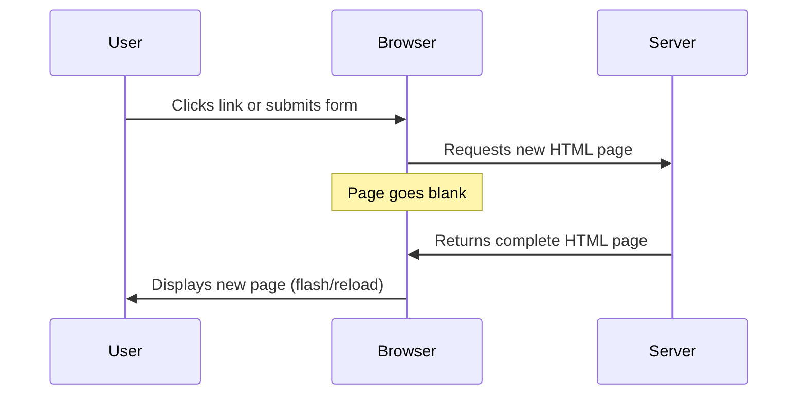
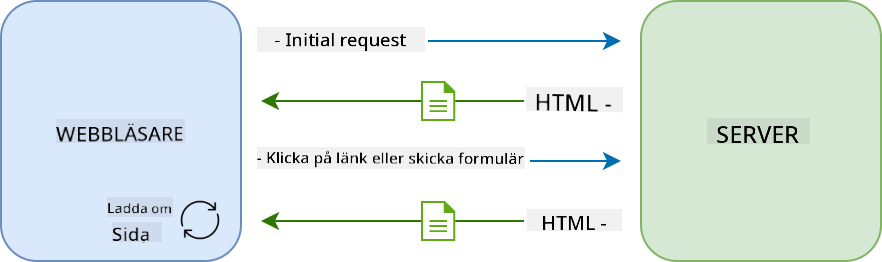
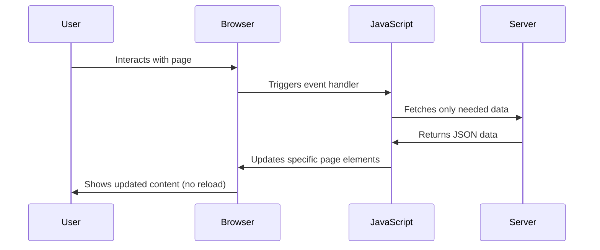
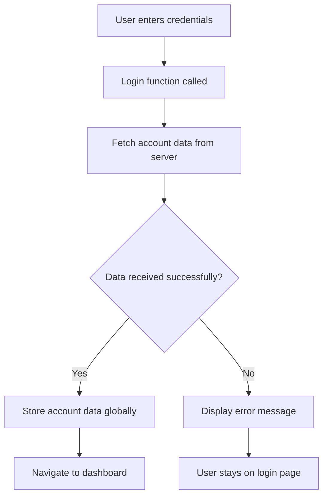
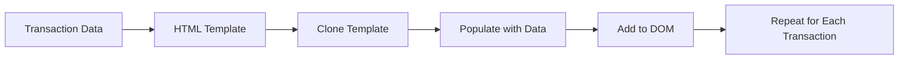
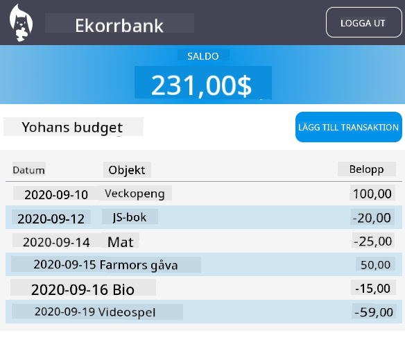

<!--
CO_OP_TRANSLATOR_METADATA:
{
  "original_hash": "2c1164912414820c8efd699b43f64954",
  "translation_date": "2025-10-23T21:41:32+00:00",
  "source_file": "7-bank-project/3-data/README.md",
  "language_code": "sv"
}
-->
# Bygg en bankapp del 3: Metoder för att hämta och använda data

Tänk på Enterprise-datorn i Star Trek - när kapten Picard frågar om skeppets status dyker informationen upp direkt utan att hela gränssnittet stängs ner och byggs om. Den sömlösa informationsflödet är precis vad vi bygger här med dynamisk datahämtning.

Just nu är din bankapp som en tryckt tidning - informativ men statisk. Vi ska förvandla den till något mer som NASA:s kontrollrum, där data flödar kontinuerligt och uppdateras i realtid utan att avbryta användarens arbetsflöde.

Du kommer att lära dig att kommunicera med servrar asynkront, hantera data som anländer vid olika tidpunkter och omvandla rå information till något meningsfullt för dina användare. Detta är skillnaden mellan en demo och produktionsklar mjukvara.

## Förhandsquiz

[Förhandsquiz](https://ff-quizzes.netlify.app/web/quiz/45)

### Förutsättningar

Innan du dyker in i datahämtning, se till att du har följande komponenter redo:

- **Föregående lektion**: Slutför [Inloggnings- och registreringsformuläret](../2-forms/README.md) - vi bygger vidare på denna grund
- **Lokal server**: Installera [Node.js](https://nodejs.org) och [kör server-API:t](../api/README.md) för att tillhandahålla kontodata
- **API-anslutning**: Testa din serveranslutning med detta kommando:

```bash
curl http://localhost:5000/api
# Expected response: "Bank API v1.0.0"
```

Detta snabba test säkerställer att alla komponenter kommunicerar korrekt:
- Verifierar att Node.js fungerar korrekt på ditt system
- Bekräftar att din API-server är aktiv och svarar
- Validerar att din app kan nå servern (som att kontrollera radiokontakt före en uppdrag)

---

## Förstå datahämtning i moderna webbappar

Sättet som webbapplikationer hanterar data har utvecklats dramatiskt under de senaste två decennierna. Att förstå denna utveckling hjälper dig att uppskatta varför moderna tekniker som AJAX och Fetch API är så kraftfulla och varför de har blivit oumbärliga verktyg för webbutvecklare.

Låt oss utforska hur traditionella webbplatser fungerade jämfört med de dynamiska, responsiva applikationer vi bygger idag.

### Traditionella fler-sidiga applikationer (MPA)

Under webben tidiga dagar var varje klick som att byta kanal på en gammal TV - skärmen blev svart och sedan kom det nya innehållet långsamt fram. Detta var verkligheten för tidiga webbapplikationer, där varje interaktion innebar att hela sidan byggdes om från grunden.





**Varför denna metod kändes klumpig:**
- Varje klick innebar att hela sidan byggdes om från grunden
- Användare blev avbrutna mitt i sina tankar av irriterande sidblinkningar
- Din internetanslutning arbetade övertid med att ladda ner samma header och footer om och om igen
- Appar kändes mer som att bläddra i ett arkivskåp än att använda mjukvara

### Moderna en-sidiga applikationer (SPA)

AJAX (Asynchronous JavaScript and XML) förändrade detta paradigm helt. Precis som den modulära designen av den internationella rymdstationen, där astronauter kan byta ut enskilda komponenter utan att bygga om hela strukturen, tillåter AJAX oss att uppdatera specifika delar av en webbsida utan att ladda om allt. Trots att namnet nämner XML använder vi mest JSON idag, men grundprincipen är densamma: uppdatera bara det som behöver ändras.




**Varför SPA:er känns så mycket bättre:**
- Endast de delar som faktiskt ändrats uppdateras (smart, eller hur?)
- Inga fler störande avbrott - dina användare kan fortsätta i sitt flöde
- Mindre data som skickas över nätet innebär snabbare laddning
- Allt känns snabbt och responsivt, precis som apparna på din telefon

### Utvecklingen till moderna Fetch API

Moderna webbläsare tillhandahåller [`Fetch` API](https://developer.mozilla.org/docs/Web/API/Fetch_API), som ersätter det äldre [`XMLHttpRequest`](https://developer.mozilla.org/docs/Web/API/XMLHttpRequest/Using_XMLHttpRequest). Precis som skillnaden mellan att använda en telegraf och att skicka e-post, använder Fetch API löften för renare asynkron kod och hanterar JSON naturligt.

| Funktion | XMLHttpRequest | Fetch API |
|----------|----------------|-----------|
| **Syntax** | Komplex callback-baserad | Ren promise-baserad |
| **JSON-hantering** | Kräver manuell parsing | Inbyggd `.json()`-metod |
| **Felkodshantering** | Begränsad felinformation | Omfattande felinformation |
| **Modern support** | Kompatibilitet med äldre | ES6+ promises och async/await |

> 💡 **Webbläsarkompatibilitet**: Goda nyheter - Fetch API fungerar i alla moderna webbläsare! Om du är nyfiken på specifika versioner, [caniuse.com](https://caniuse.com/fetch) har hela kompatibilitetsberättelsen.
> 
**Slutsats:**
- Fungerar utmärkt i Chrome, Firefox, Safari och Edge (i princip överallt där dina användare är)
- Endast Internet Explorer behöver extra hjälp (och ärligt talat, det är dags att släppa IE)
- Förbereder dig perfekt för de eleganta async/await-mönstren vi kommer att använda senare

### Implementera användarinloggning och datahämtning

Nu ska vi implementera inloggningssystemet som förvandlar din bankapp från en statisk display till en funktionell applikation. Precis som autentiseringsprotokollen som används i säkra militära anläggningar, kommer vi att verifiera användarens uppgifter och sedan ge tillgång till deras specifika data.

Vi bygger detta stegvis, med början i grundläggande autentisering och sedan lägger till datahämtning.

#### Steg 1: Skapa grunden för inloggningsfunktionen

Öppna din `app.js`-fil och lägg till en ny `login`-funktion. Denna kommer att hantera användarens autentiseringsprocess:

```javascript
async function login() {
  const loginForm = document.getElementById('loginForm');
  const user = loginForm.user.value;
}
```

**Låt oss bryta ner detta:**
- Det där `async`-nyckelordet? Det säger till JavaScript "hej, den här funktionen kan behöva vänta på saker"
- Vi hämtar vårt formulär från sidan (inget märkvärdigt, bara hittar det via dess ID)
- Sedan hämtar vi det användaren har skrivit som sitt användarnamn
- Här är ett smart knep: du kan komma åt alla formulärfält via deras `name`-attribut - ingen extra getElementById behövs!

> 💡 **Formuläråtkomstmönster**: Varje formulärkontroll kan nås via dess namn (inställt i HTML med `name`-attributet) som en egenskap av formulärelementet. Detta ger ett rent och läsbart sätt att hämta formulärdata.

#### Steg 2: Skapa funktionen för att hämta kontodata

Nästa steg är att skapa en dedikerad funktion för att hämta kontodata från servern. Detta följer samma mönster som din registreringsfunktion men fokuserar på datahämtning:

```javascript
async function getAccount(user) {
  try {
    const response = await fetch('//localhost:5000/api/accounts/' + encodeURIComponent(user));
    return await response.json();
  } catch (error) {
    return { error: error.message || 'Unknown error' };
  }
}
```

**Vad denna kod gör:**
- **Använder** det moderna `fetch`-API:t för att begära data asynkront
- **Konstruerar** en GET-förfrågnings-URL med användarnamnsparametern
- **Använder** `encodeURIComponent()` för att säkert hantera specialtecken i URL:er
- **Konverterar** svaret till JSON-format för enkel datamanipulation
- **Hanterar** fel på ett smidigt sätt genom att returnera ett felobjekt istället för att krascha

> ⚠️ **Säkerhetsnotering**: Funktionen `encodeURIComponent()` hanterar specialtecken i URL:er. Precis som kodningssystem som används i marin kommunikation säkerställer den att ditt meddelande anländer exakt som avsett, och förhindrar att tecken som "#" eller "&" tolkas fel.
> 
**Varför detta är viktigt:**
- Förhindrar att specialtecken bryter URL:er
- Skyddar mot URL-manipulationsattacker
- Säkerställer att din server får den avsedda datan
- Följer säkra kodningspraxis

#### Förstå HTTP GET-förfrågningar

Här är något som kanske överraskar dig: när du använder `fetch` utan några extra alternativ skapar det automatiskt en [`GET`](https://developer.mozilla.org/docs/Web/HTTP/Methods/GET)-förfrågan. Detta är perfekt för vad vi gör - att fråga servern "hej, kan jag se denna användares kontodata?"

Tänk på GET-förfrågningar som att artigt be att få låna en bok från biblioteket - du begär att få se något som redan finns. POST-förfrågningar (som vi använde för registrering) är mer som att lämna in en ny bok för att läggas till i samlingen.

| GET-förfrågan | POST-förfrågan |
|---------------|---------------|
| **Syfte** | Hämta befintlig data | Skicka ny data till servern |
| **Parametrar** | I URL-sökväg/query-sträng | I förfrågningskroppen |
| **Caching** | Kan cachas av webbläsare | Inte vanligtvis cachad |
| **Säkerhet** | Synlig i URL/loggar | Dold i förfrågningskroppen |

#### Steg 3: Koppla ihop allt

Nu till den tillfredsställande delen - låt oss koppla din kontohämtningsfunktion till inloggningsprocessen. Här klickar allt på plats:

```javascript
async function login() {
  const loginForm = document.getElementById('loginForm');
  const user = loginForm.user.value;
  const data = await getAccount(user);

  if (data.error) {
    return console.log('loginError', data.error);
  }

  account = data;
  navigate('/dashboard');
}
```

Denna funktion följer en tydlig sekvens:
- Extrahera användarnamnet från formulärfältet
- Begär användarens kontodata från servern
- Hantera eventuella fel som uppstår under processen
- Spara kontodatan och navigera till dashboarden vid framgång

> 🎯 **Async/Await-mönster**: Eftersom `getAccount` är en asynkron funktion använder vi nyckelordet `await` för att pausa exekveringen tills servern svarar. Detta förhindrar att koden fortsätter med odefinierad data.

#### Steg 4: Skapa en plats för din data

Din app behöver någonstans att komma ihåg kontoinformationen när den har laddats. Tänk på detta som appens korttidsminne - en plats att hålla den aktuella användarens data tillgänglig. Lägg till denna rad högst upp i din `app.js`-fil:

```javascript
// This holds the current user's account data
let account = null;
```

**Varför vi behöver detta:**
- Håller kontodatan tillgänglig från var som helst i din app
- Att börja med `null` betyder "ingen är inloggad än"
- Uppdateras när någon loggar in eller registrerar sig framgångsrikt
- Fungerar som en enda sanningskälla - ingen förvirring om vem som är inloggad

#### Steg 5: Koppla din formulär

Nu ska vi koppla din nya inloggningsfunktion till ditt HTML-formulär. Uppdatera din formulärtagg så här:

```html
<form id="loginForm" action="javascript:login()">
  <!-- Your existing form inputs -->
</form>
```

**Vad denna lilla ändring gör:**
- Stoppar formuläret från att göra sitt standardbeteende "ladda om hela sidan"
- Anropar din anpassade JavaScript-funktion istället
- Håller allt smidigt och SPA-likt
- Ger dig full kontroll över vad som händer när användare trycker på "Login"

#### Steg 6: Förbättra din registreringsfunktion

För konsekvens, uppdatera din `register`-funktion för att också spara kontodata och navigera till dashboarden:

```javascript
// Add these lines at the end of your register function
account = result;
navigate('/dashboard');
```

**Denna förbättring ger:**
- **Sömlös** övergång från registrering till dashboard
- **Konsekvent** användarupplevelse mellan inloggnings- och registreringsflöden
- **Omedelbar** åtkomst till kontodata efter framgångsrik registrering

#### Testa din implementation



**Dags att testa:**
1. Skapa ett nytt konto för att se till att allt fungerar
2. Försök logga in med samma uppgifter
3. Titta i webbläsarens konsol (F12) om något verkar fel
4. Se till att du landar på dashboarden efter en lyckad inloggning

Om något inte fungerar, få inte panik! De flesta problem är enkla att lösa, som stavfel eller att glömma att starta API-servern.

#### Ett snabbt ord om Cross-Origin magi

Du kanske undrar: "Hur pratar min webbapp med denna API-server när de körs på olika portar?" Bra fråga! Detta berör något som varje webbutvecklare stöter på förr eller senare.

> 🔒 **Cross-Origin-säkerhet**: Webbläsare upprätthåller en "same-origin policy" för att förhindra obehörig kommunikation mellan olika domäner. Precis som kontrollsystemet vid Pentagon verifierar de att kommunikationen är auktoriserad innan dataöverföring tillåts.
> 
**I vår setup:**
- Din webbapp körs på `localhost:3000` (utvecklingsserver)
- Din API-server körs på `localhost:5000` (backend-server)
- API-servern inkluderar [CORS-headers](https://developer.mozilla.org/docs/Web/HTTP/CORS) som uttryckligen tillåter kommunikation från din webbapp

Denna konfiguration speglar verklig utveckling där frontend- och backend-applikationer vanligtvis körs på separata servrar.

> 📚 **Läs mer**: Fördjupa dig i API:er och datahämtning med denna omfattande [Microsoft Learn-modul om API:er](https://docs.microsoft.com/learn/modules/use-apis-discover-museum-art/?WT.mc_id=academic-77807-sagibbon).

## Ge liv åt din data i HTML

Nu ska vi göra den hämtade datan synlig för användarna genom DOM-manipulation. Precis som processen att framkalla fotografier i ett mörkrum, tar vi osynlig data och renderar den till något användarna kan se och interagera med.

DOM-manipulation är tekniken som förvandlar statiska webbsidor till dynamiska applikationer som uppdaterar sitt innehåll baserat på användarinteraktioner och serverrespons.

### Välja rätt verktyg för jobbet

När det gäller att uppdatera din HTML med JavaScript har du flera alternativ. Tänk på dessa som olika verktyg i en verktygslåda - varje perfekt för specifika uppgifter:

| Metod | Vad den är bra för | När du ska använda den | Säkerhetsnivå |
|-------|--------------------|------------------------|---------------|
| `textContent` | Visa användardata säkert | När du visar text | ✅ Stensäker |
| `createElement()` + `append()` | Bygga komplexa layouter | Skapa nya sektioner/listor | ✅ Skottsäker |
| `innerHTML` | Ställa in HTML-innehåll | ⚠️ Försök undvika denna | ❌ Riskabelt |

#### Det säkra sättet att visa text: textContent

Egenskapen [`textContent`](https://developer.mozilla.org/docs/Web/API/Node/textContent) är din bästa vän när du visar användardata. Det är som att ha en dörrvakt för din webbsida - inget skadligt släpps igenom:

```javascript
// The safe, reliable way to update text
const balanceElement = document.getElementById('balance');
balanceElement.textContent = account.balance;
```

**Fördelar med textContent:**
- Behandlar allt som vanlig text (förhindrar skriptkörning)
- Rensar automatiskt befintligt innehåll
- Effektivt för enkla textuppdateringar
- Ger inbyggd säkerhet mot skadligt innehåll

#### Skapa dynamiska HTML-element
För mer komplexa innehåll, kombinera [`document.createElement()`](https://developer.mozilla.org/docs/Web/API/Document/createElement) med metoden [`append()`](https://developer.mozilla.org/docs/Web/API/ParentNode/append):

```javascript
// Safe way to create new elements
const transactionItem = document.createElement('div');
transactionItem.className = 'transaction-item';
transactionItem.textContent = `${transaction.date}: ${transaction.description}`;
container.append(transactionItem);
```

**Förstå denna metod:**
- **Skapar** nya DOM-element programmässigt
- **Ger** full kontroll över elementens attribut och innehåll
- **Möjliggör** komplexa, nästlade elementstrukturer
- **Bevarar** säkerheten genom att separera struktur från innehåll

> ⚠️ **Säkerhetsövervägande**: Även om [`innerHTML`](https://developer.mozilla.org/docs/Web/API/Element/innerHTML) ofta förekommer i tutorials, kan det exekvera inbäddade skript. Precis som säkerhetsprotokollen på CERN som förhindrar obehörig kodexekvering, erbjuder `textContent` och `createElement` säkrare alternativ.
> 
**Risker med innerHTML:**
- Exekverar alla `<script>`-taggar i användardata
- Sårbart för kodinjektionsattacker
- Skapar potentiella säkerhetsluckor
- De säkrare alternativen vi använder ger motsvarande funktionalitet

### Göra felmeddelanden användarvänliga

För närvarande visas inloggningsfel endast i webbläsarens konsol, vilket är osynligt för användare. Precis som skillnaden mellan en pilots interna diagnostik och passagerarinformationssystemet, behöver vi kommunicera viktig information via rätt kanal.

Att implementera synliga felmeddelanden ger användarna omedelbar feedback om vad som gick fel och hur de kan gå vidare.

#### Steg 1: Lägg till en plats för felmeddelanden

Först, ge felmeddelanden en plats i din HTML. Lägg till detta precis före din inloggningsknapp så att användarna ser det naturligt:

```html
<!-- This is where error messages will appear -->
<div id="loginError" role="alert"></div>
<button>Login</button>
```

**Vad som händer här:**
- Vi skapar en tom behållare som förblir osynlig tills den behövs
- Den är placerad där användarna naturligt tittar efter att ha klickat på "Logga in"
- `role="alert"` är en fin detalj för skärmläsare - det berättar för hjälpmedelsteknik att "hej, detta är viktigt!"
- Det unika `id` ger vår JavaScript en enkel måltavla

#### Steg 2: Skapa en praktisk hjälpfunktion

Låt oss skapa en liten hjälpfunktion som kan uppdatera texten för vilket element som helst. Detta är en av de "skriv en gång, använd överallt"-funktioner som sparar tid:

```javascript
function updateElement(id, text) {
  const element = document.getElementById(id);
  element.textContent = text;
}
```

**Fördelar med funktionen:**
- Enkel gränssnitt som bara kräver ett element-ID och textinnehåll
- Lokaliserar och uppdaterar DOM-element säkert
- Återanvändbart mönster som minskar kodduplicering
- Bibehåller konsekvent uppdateringsbeteende över hela applikationen

#### Steg 3: Visa fel där användarna kan se dem

Nu ska vi ersätta det dolda konsolmeddelandet med något som användarna faktiskt kan se. Uppdatera din inloggningsfunktion:

```javascript
// Instead of just logging to console, show the user what's wrong
if (data.error) {
  return updateElement('loginError', data.error);
}
```

**Denna lilla förändring gör stor skillnad:**
- Felmeddelanden visas precis där användarna tittar
- Inga fler mystiska tysta fel
- Användarna får omedelbar, handlingsbar feedback
- Din app börjar kännas professionell och genomtänkt

Nu när du testar med ett ogiltigt konto, kommer du att se ett hjälpsamt felmeddelande direkt på sidan!


#### Steg 4: Vara inkluderande med tillgänglighet

Här är något coolt med det `role="alert"` vi lade till tidigare - det är inte bara dekoration! Denna lilla attribut skapar det som kallas en [Live Region](https://developer.mozilla.org/docs/Web/Accessibility/ARIA/ARIA_Live_Regions) som omedelbart meddelar ändringar till skärmläsare:

```html
<div id="loginError" role="alert"></div>
```

**Varför detta är viktigt:**
- Skärmläsaranvändare hör felmeddelandet så snart det visas
- Alla får samma viktiga information, oavsett hur de navigerar
- Det är ett enkelt sätt att få din app att fungera för fler människor
- Visar att du bryr dig om att skapa inkluderande upplevelser

Små detaljer som denna skiljer bra utvecklare från fantastiska!

#### Steg 5: Använd samma mönster för registrering

För konsekvens, implementera identisk felhantering i ditt registreringsformulär:

1. **Lägg till** ett element för att visa fel i din registrerings-HTML:
```html
<div id="registerError" role="alert"></div>
```

2. **Uppdatera** din registreringsfunktion för att använda samma felvisningsmönster:
```javascript
if (data.error) {
  return updateElement('registerError', data.error);
}
```

**Fördelar med konsekvent felhantering:**
- **Ger** enhetlig användarupplevelse över alla formulär
- **Minskar** kognitiv belastning genom att använda bekanta mönster
- **Förenklar** underhåll med återanvändbar kod
- **Säkerställer** att tillgänglighetsstandarder uppfylls i hela appen

## Skapa din dynamiska instrumentpanel

Nu ska vi förvandla din statiska instrumentpanel till ett dynamiskt gränssnitt som visar verklig kontoinformation. Precis som skillnaden mellan en tryckt flygtidtabell och de levande avgångstavlorna på flygplatser, går vi från statisk information till realtids-, responsiva visningar.

Med hjälp av de DOM-manipuleringstekniker du har lärt dig, ska vi skapa en instrumentpanel som automatiskt uppdateras med aktuell kontoinformation.

### Lär känna din data

Innan vi börjar bygga, låt oss kika på vilken typ av data din server skickar tillbaka. När någon loggar in framgångsrikt, här är skatten av information du får arbeta med:

```json
{
  "user": "test",
  "currency": "$",
  "description": "Test account",
  "balance": 75,
  "transactions": [
    { "id": "1", "date": "2020-10-01", "object": "Pocket money", "amount": 50 },
    { "id": "2", "date": "2020-10-03", "object": "Book", "amount": -10 },
    { "id": "3", "date": "2020-10-04", "object": "Sandwich", "amount": -5 }
  ]
}
```

**Denna datastruktur ger:**
- **`user`**: Perfekt för att personifiera upplevelsen ("Välkommen tillbaka, Sarah!")
- **`currency`**: Säkerställer att vi visar pengabelopp korrekt
- **`description`**: Ett vänligt namn för kontot
- **`balance`**: Det viktiga aktuella saldot
- **`transactions`**: Den kompletta transaktionshistoriken med alla detaljer

Allt du behöver för att bygga en professionell bankinstrumentpanel!

> 💡 **Proffstips**: Vill du se din instrumentpanel i aktion direkt? Använd användarnamnet `test` när du loggar in - det kommer förladdat med exempeldata så att du kan se allt fungera utan att behöva skapa transaktioner först.
> 
**Varför testkontot är praktiskt:**
- Kommer med realistiska exempeldata redan laddade
- Perfekt för att se hur transaktioner visas
- Utmärkt för att testa dina instrumentpanelsfunktioner
- Sparar dig från att behöva skapa testdata manuellt

### Skapa instrumentpanelens visningselement

Låt oss bygga din instrumentpanel steg för steg, börja med kontosammanfattningen och sedan gå vidare till mer komplexa funktioner som transaktionslistor.

#### Steg 1: Uppdatera din HTML-struktur

Först, ersätt den statiska "Saldo"-sektionen med dynamiska platshållare som din JavaScript kan fylla i:

```html
<section>
  Balance: <span id="balance"></span><span id="currency"></span>
</section>
```

Lägg sedan till en sektion för kontobeskrivningen. Eftersom detta fungerar som en titel för instrumentpanelens innehåll, använd semantisk HTML:

```html
<h2 id="description"></h2>
```

**Förstå HTML-strukturen:**
- **Använder** separata `<span>`-element för saldo och valuta för individuell kontroll
- **Applicerar** unika ID:n till varje element för att JavaScript ska kunna rikta in sig
- **Följer** semantisk HTML genom att använda `<h2>` för kontobeskrivningen
- **Skapar** en logisk hierarki för skärmläsare och SEO

> ✅ **Insikt om tillgänglighet**: Kontobeskrivningen fungerar som en titel för instrumentpanelens innehåll, så den är markerad semantiskt som en rubrik. Läs mer om hur [rubrikstruktur](https://www.nomensa.com/blog/2017/how-structure-headings-web-accessibility) påverkar tillgänglighet. Kan du identifiera andra element på din sida som kan dra nytta av rubriktaggar?

#### Steg 2: Skapa funktionen för att uppdatera instrumentpanelen

Skapa nu en funktion som fyller din instrumentpanel med verklig kontodata:

```javascript
function updateDashboard() {
  if (!account) {
    return navigate('/login');
  }

  updateElement('description', account.description);
  updateElement('balance', account.balance.toFixed(2));
  updateElement('currency', account.currency);
}
```

**Steg för steg, här är vad denna funktion gör:**
- **Validerar** att kontodata finns innan den fortsätter
- **Omdirigerar** oautentiserade användare tillbaka till inloggningssidan
- **Uppdaterar** kontobeskrivningen med hjälp av den återanvändbara `updateElement`-funktionen
- **Formaterar** saldot för att alltid visa två decimaler
- **Visar** rätt valutasymbol

> 💰 **Pengarformatering**: Den [`toFixed(2)`](https://developer.mozilla.org/docs/Web/JavaScript/Reference/Global_Objects/Number/toFixed)-metoden är en räddare i nöden! Den säkerställer att ditt saldo alltid ser ut som riktiga pengar - "75.00" istället för bara "75". Dina användare kommer att uppskatta att se bekant valutaformatering.

#### Steg 3: Säkerställa att din instrumentpanel uppdateras

För att säkerställa att din instrumentpanel uppdateras med aktuell data varje gång någon besöker den, behöver vi koppla in din navigationssystem. Om du slutförde [lektion 1-uppgiften](../1-template-route/assignment.md), borde detta kännas bekant. Om inte, oroa dig inte - här är vad du behöver:

Lägg till detta i slutet av din `updateRoute()`-funktion:

```javascript
if (typeof route.init === 'function') {
  route.init();
}
```

Uppdatera sedan dina rutter för att inkludera initialiseringen av instrumentpanelen:

```javascript
const routes = {
  '/login': { templateId: 'login' },
  '/dashboard': { templateId: 'dashboard', init: updateDashboard }
};
```

**Vad denna smarta inställning gör:**
- Kontrollerar om en rutt har speciell initialiseringskod
- Kör den koden automatiskt när rutten laddas
- Säkerställer att din instrumentpanel alltid visar färsk, aktuell data
- Håller din routinglogik ren och organiserad

#### Testa din instrumentpanel

Efter att ha implementerat dessa ändringar, testa din instrumentpanel:

1. **Logga in** med ett testkonto
2. **Verifiera** att du omdirigeras till instrumentpanelen
3. **Kontrollera** att kontobeskrivningen, saldot och valutan visas korrekt
4. **Prova att logga ut och logga in igen** för att säkerställa att data uppdateras korrekt

Din instrumentpanel bör nu visa dynamisk kontoinformation som uppdateras baserat på den inloggade användarens data!

## Bygga smarta transaktionslistor med mallar

Istället för att manuellt skapa HTML för varje transaktion, ska vi använda mallar för att automatiskt generera konsekvent formatering. Precis som de standardiserade komponenterna som används i rymdfarkosttillverkning, säkerställer mallar att varje transaktionsrad följer samma struktur och utseende.

Denna teknik skalar effektivt från några transaktioner till tusentals, samtidigt som den bibehåller konsekvent prestanda och presentation.



### Steg 1: Skapa transaktionsmallen

Lägg först till en återanvändbar mall för transaktionsrader i din HTML `<body>`:

```html
<template id="transaction">
  <tr>
    <td></td>
    <td></td>
    <td></td>
  </tr>
</template>
```

**Förstå HTML-mallar:**
- **Definierar** strukturen för en enskild tabellrad
- **Förblir** osynlig tills den klonas och fylls med JavaScript
- **Innehåller** tre celler för datum, beskrivning och belopp
- **Tillhandahåller** ett återanvändbart mönster för konsekvent formatering

### Steg 2: Förbered din tabell för dynamiskt innehåll

Lägg sedan till ett `id` till din tabellkropp så att JavaScript enkelt kan rikta in sig på den:

```html
<tbody id="transactions"></tbody>
```

**Vad detta åstadkommer:**
- **Skapar** en tydlig måltavla för att infoga transaktionsrader
- **Separerar** tabellstrukturen från det dynamiska innehållet
- **Möjliggör** enkel rensning och påfyllning av transaktionsdata

### Steg 3: Bygg fabriksfunktionen för transaktionsrader

Skapa nu en funktion som omvandlar transaktionsdata till HTML-element:

```javascript
function createTransactionRow(transaction) {
  const template = document.getElementById('transaction');
  const transactionRow = template.content.cloneNode(true);
  const tr = transactionRow.querySelector('tr');
  tr.children[0].textContent = transaction.date;
  tr.children[1].textContent = transaction.object;
  tr.children[2].textContent = transaction.amount.toFixed(2);
  return transactionRow;
}
```

**Bryter ner denna fabriksfunktion:**
- **Hämtar** mallelementet via dess ID
- **Klonar** mallens innehåll för säker manipulation
- **Väljer** tabellraden inom det klonade innehållet
- **Fyller** varje cell med transaktionsdata
- **Formaterar** beloppet för att visa rätt decimaler
- **Returnerar** den färdiga raden redo att infogas

### Steg 4: Generera flera transaktionsrader effektivt

Lägg till denna kod i din `updateDashboard()`-funktion för att visa alla transaktioner:

```javascript
const transactionsRows = document.createDocumentFragment();
for (const transaction of account.transactions) {
  const transactionRow = createTransactionRow(transaction);
  transactionsRows.appendChild(transactionRow);
}
updateElement('transactions', transactionsRows);
```

**Förstå denna effektiva metod:**
- **Skapar** ett dokumentfragment för att gruppera DOM-operationer
- **Itererar** genom alla transaktioner i kontodata
- **Genererar** en rad för varje transaktion med hjälp av fabriksfunktionen
- **Samlar** alla rader i fragmentet innan de läggs till i DOM
- **Utför** en enda DOM-uppdatering istället för flera individuella insättningar

> ⚡ **Prestandaoptimering**: [`document.createDocumentFragment()`](https://developer.mozilla.org/docs/Web/API/Document/createDocumentFragment) fungerar som monteringsprocessen på Boeing - komponenter förbereds utanför huvudlinjen och installeras sedan som en komplett enhet. Denna gruppering minimerar DOM-omflöden genom att utföra en enda insättning istället för flera individuella operationer.

### Steg 5: Förbättra uppdateringsfunktionen för blandat innehåll

Din `updateElement()`-funktion hanterar för närvarande endast textinnehåll. Uppdatera den för att fungera med både text och DOM-noder:

```javascript
function updateElement(id, textOrNode) {
  const element = document.getElementById(id);
  element.textContent = ''; // Removes all children
  element.append(textOrNode);
}
```

**Viktiga förbättringar i denna uppdatering:**
- **Rensar** befintligt innehåll innan nytt innehåll läggs till
- **Accepterar** antingen textsträngar eller DOM-noder som parametrar
- **Använder** metoden [`append()`](https://developer.mozilla.org/docs/Web/API/ParentNode/append) för flexibilitet
- **Bibehåller** bakåtkompatibilitet med befintlig textbaserad användning

### Testa din instrumentpanel

Dags för sanningens ögonblick! Låt oss se din dynamiska instrumentpanel i aktion:

1. Logga in med testkontot (det har exempeldata redo att användas)
2. Navigera till din instrumentpanel
3. Kontrollera att transaktionsrader visas med korrekt formatering
4. Se till att datum, beskrivningar och belopp ser bra ut

Om allt fungerar, bör du se en fullt fungerande transaktionslista på din instrumentpanel! 🎉

**Vad du har åstadkommit:**
- Byggt en instrumentpanel som skalar med vilken mängd data som helst
- Skapat återanvändbara mallar för konsekvent formatering
- Implementerat effektiva DOM-manipuleringstekniker
- Utvecklat funktionalitet jämförbar med produktionsklara bankapplikationer

Du har framgångsrikt förvandlat en statisk webbsida till en dynamisk webbapplikation.

---

## GitHub Copilot Agent-utmaning 🚀

Använd Agent-läget för att slutföra följande utmaning:

**Beskrivning:** Förbättra bankappen genom att implementera en transaktionssöknings- och filtreringsfunktion som låter användare hitta specifika transaktioner baserat på datumintervall, belopp eller beskrivning.
**Uppmaning:** Skapa en sökfunktion för bankappen som inkluderar: 1) Ett sökformulär med inmatningsfält för datumintervall (från/till), minimi/maxbelopp och nyckelord för transaktionsbeskrivning, 2) En `filterTransactions()`-funktion som filtrerar arrayen account.transactions baserat på sökkriterierna, 3) Uppdatera `updateDashboard()`-funktionen för att visa filtrerade resultat, och 4) Lägg till en "Rensa filter"-knapp för att återställa vyn. Använd moderna JavaScript-arraymetoder som `filter()` och hantera specialfall för tomma sökkriterier.

Läs mer om [agentläge](https://code.visualstudio.com/blogs/2025/02/24/introducing-copilot-agent-mode) här.

## 🚀 Utmaning

Redo att ta din bankapp till nästa nivå? Låt oss göra den så snygg och användarvänlig att du faktiskt vill använda den. Här är några idéer för att inspirera dig:

**Gör den vacker**: Lägg till CSS-styling för att förvandla din funktionella dashboard till något visuellt tilltalande. Tänk rena linjer, bra avstånd och kanske till och med några subtila animationer.

**Gör den responsiv**: Försök använda [media queries](https://developer.mozilla.org/docs/Web/CSS/Media_Queries) för att skapa en [responsiv design](https://developer.mozilla.org/docs/Web/Progressive_web_apps/Responsive/responsive_design_building_blocks) som fungerar bra på telefoner, surfplattor och datorer. Dina användare kommer att tacka dig!

**Lägg till lite finess**: Överväg att färgkoda transaktioner (grönt för inkomster, rött för utgifter), lägga till ikoner eller skapa hovereffekter som gör gränssnittet mer interaktivt.

Så här skulle en polerad dashboard kunna se ut:



Känn dig inte tvungen att matcha detta exakt - använd det som inspiration och skapa din egen version!

## Quiz efter föreläsningen

[Quiz efter föreläsningen](https://ff-quizzes.netlify.app/web/quiz/46)

## Uppgift

[Refaktorisera och kommentera din kod](assignment.md)

---

**Ansvarsfriskrivning**:  
Detta dokument har översatts med hjälp av AI-översättningstjänsten [Co-op Translator](https://github.com/Azure/co-op-translator). Även om vi strävar efter noggrannhet, bör det noteras att automatiserade översättningar kan innehålla fel eller felaktigheter. Det ursprungliga dokumentet på dess originalspråk bör betraktas som den auktoritativa källan. För kritisk information rekommenderas professionell mänsklig översättning. Vi ansvarar inte för eventuella missförstånd eller feltolkningar som uppstår vid användning av denna översättning.