<!--
CO_OP_TRANSLATOR_METADATA:
{
  "original_hash": "86ee5069f27ea3151389d8687c95fac9",
  "translation_date": "2026-01-06T23:03:38+00:00",
  "source_file": "7-bank-project/3-data/README.md",
  "language_code": "sv"
}
-->
# Bygg en bankapp del 3: Metoder för att hämta och använda data

Tänk på Enterprise-datorn i Star Trek – när kapten Picard frågar efter status på skeppet, dyker informationen upp omedelbart utan att hela gränssnittet stängs ner och byggs upp igen. Det sömlösa informationsflödet är exakt vad vi bygger här med dynamisk datahämtning.

Just nu är din bankapp som en tryckt tidning – informativ men statisk. Vi ska förvandla den till något mer som NASA:s mission control, där data flödar kontinuerligt och uppdateras i realtid utan att avbryta användarens arbetsflöde.

Du kommer att lära dig hur man kommunicerar asynkront med servrar, hanterar data som anländer vid olika tidpunkter och omvandlar rå information till något meningsfullt för dina användare. Det är skillnaden mellan en demo och produktionsredo programvara.

## ⚡ Vad du kan göra under de nästa 5 minuterna

**Snabbstart för upptagna utvecklare**

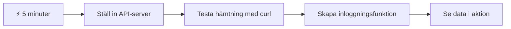
- **Minut 1-2**: Starta din API-server (`cd api && npm start`) och testa anslutningen
- **Minut 3**: Skapa en grundläggande `getAccount()`-funktion med fetch
- **Minut 4**: Koppla upp inloggningsformuläret med `action="javascript:login()"`
- **Minut 5**: Testa inloggning och se kontodata visas i konsolen

**Snabba testkommandon**:
```bash
# Verifiera att API:et körs
curl http://localhost:5000/api

# Testa hämtning av kontodata
curl http://localhost:5000/api/accounts/test
```

**Varför detta är viktigt**: På 5 minuter får du se magin i asynkron datahämtning som driver alla moderna webapplikationer. Detta är grunden som gör att appar känns responsiva och levande.

## 🗺️ Din läranderesa genom datadrivna webbapplikationer

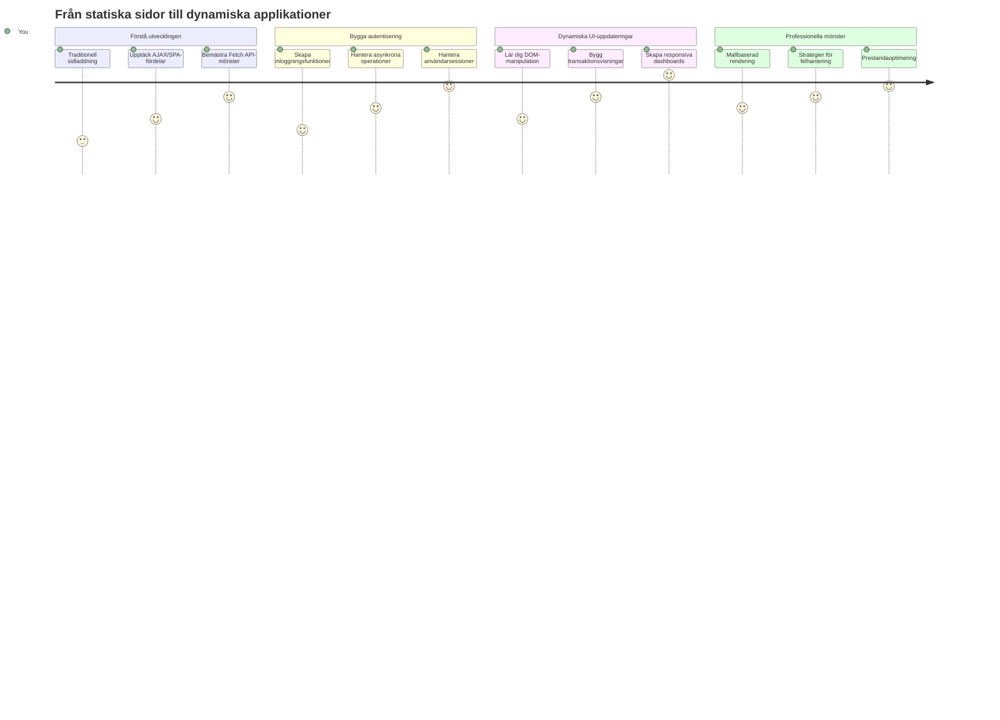
**Ditt resa mål**: I slutet av denna lektion kommer du att förstå hur moderna webbapplikationer hämtar, bearbetar och visar data dynamiskt och skapar de sömlösa användarupplevelser vi förväntar oss från professionella applikationer.

## Förföreläsningsquiz

[Förföreläsningsquiz](https://ff-quizzes.netlify.app/web/quiz/45)

### Förkunskaper

Innan du dyker ner i datahämtning, se till att dessa komponenter är klara:

- **Föregående lektion**: Slutför [Inloggnings- och registreringsformuläret](../2-forms/README.md) – vi bygger vidare på denna grund
- **Lokal server**: Installera [Node.js](https://nodejs.org) och [starta server-API:t](../api/README.md) för att tillhandahålla kontodata
- **API-anslutning**: Testa anslutningen till din server med detta kommando:

```bash
curl http://localhost:5000/api
# Förväntat svar: "Bank API v1.0.0"
```

Detta snabba test säkerställer att alla komponenter kommunicerar korrekt:
- Verifierar att Node.js körs korrekt på din dator
- Bekräftar att din API-server är aktiv och svarar
- Validerar att din app kan nå servern (som att kontrollera radiokontakt före en uppdrag)

## 🧠 Översikt av datahanteringsekosystemet

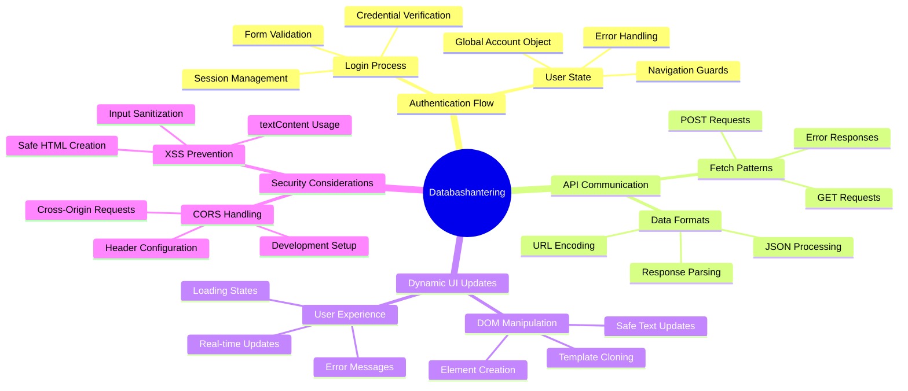
**Kärnprincip**: Moderna webbapplikationer är dataorkestreringssystem – de koordinerar mellan användargränssnitt, server-API:er och webbläsarens säkerhetsmodeller för att skapa sömlösa, responsiva upplevelser.

---

## Förstå datahämtning i moderna webbappar

Hur webbapplikationer hanterar data har utvecklats dramatiskt de senaste två decennierna. Att förstå denna utveckling hjälper dig att uppskatta varför moderna tekniker som AJAX och Fetch API är så kraftfulla och varför de blivit oumbärliga verktyg för webbutvecklare.

Låt oss utforska hur traditionella webbplatser fungerade jämfört med de dynamiska, responsiva applikationer vi bygger idag.

### Traditionella multipages-applikationer (MPA)

I webbens tidiga dagar var varje klick som att byta kanal på en gammal tv – skärmen blev svart och ställde in sig långsamt på det nya innehållet. Så var verkligheten för tidiga webbapplikationer, där varje interaktion innebar att hela sidan byggdes upp från grunden igen.

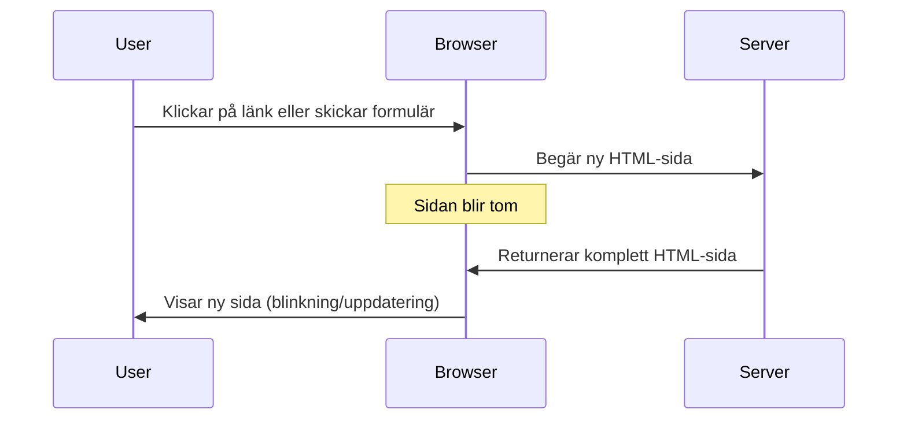
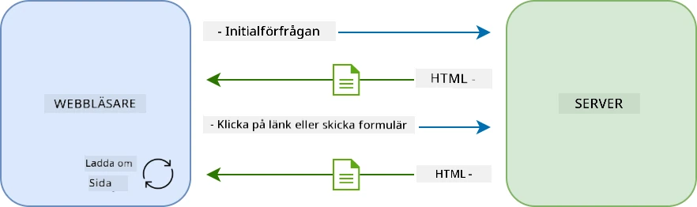

**Varför detta tillvägagångssätt kändes tungrott:**
- Varje klick innebar att hela sidan byggdes om från scratch
- Användare avbröts mitt i sina tankar av de irriterande sidblinkningarna
- Din internetanslutning jobbade övertid med att ladda samma sidhuvud och sidfot om och om igen
- Appar kändes mer som att klicka igenom ett arkivskåp än att använda programvara

### Moderna enkel-sidiga applikationer (SPA)

AJAX (Asynchronous JavaScript and XML) förändrade detta paradigm helt. Som den modulära designen av Internationella rymdstationen, där astronauter kan byta ut enskilda komponenter utan att bygga om hela strukturen, tillåter AJAX oss att uppdatera specifika delar av en webbsida utan att ladda om allt. Trots att namnet nämner XML använder vi mest JSON idag, men kärnprincipen består: uppdatera bara det som behöver ändras.

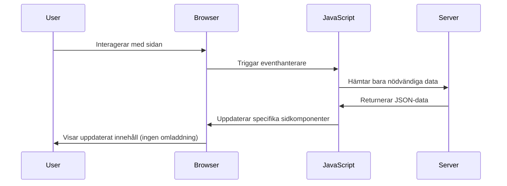
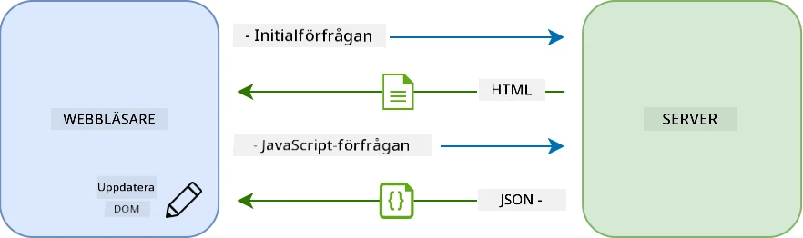

**Varför SPA känns så mycket bättre:**
- Endast de delar som faktiskt ändrats uppdateras (smart, eller hur?)
- Inga fler ryckiga avbrott – dina användare stannar i sitt flöde
- Mindre data som färdas över nätverket betyder snabbare laddning
- Allt känns snabbt och responsivt, precis som apparna i din telefon

### Evolutionen till moderna Fetch API

Moderna webbläsare tillhandahåller [`Fetch` API](https://developer.mozilla.org/docs/Web/API/Fetch_API), som ersätter den äldre [`XMLHttpRequest`](https://developer.mozilla.org/docs/Web/API/XMLHttpRequest/Using_XMLHttpRequest). Som skillnaden mellan att använda en telegraf och att skicka e-post, använder Fetch API löften (promises) för renare asynkron kod och hanterar JSON naturligt.

| Funktion | XMLHttpRequest | Fetch API |
|---------|----------------|----------|
| **Syntax** | Komplex callback-baserad | Ren promise-baserad |
| **JSON-hantering** | Kräver manuell tolkning | Inbyggd `.json()`-metod |
| **Felhanteirng** | Begränsad felinformation | Omfattande felinformation |
| **Modern support** | Bakåtkompatibilitet | ES6+ promises och async/await |

> 💡 **Webbläsarkompatibilitet**: Goda nyheter – Fetch API fungerar i alla moderna webbläsare! Om du är nyfiken på specifika versioner finns hela kompatibilitetshistoriken på [caniuse.com](https://caniuse.com/fetch).
> 
**Slutsatsen:**
- Fungerar utmärkt i Chrome, Firefox, Safari och Edge (typ överallt där dina användare är)
- Endast Internet Explorer behöver extra stöd (och ärligt talat, det är dags att låta IE gå)
- Sätter dig perfekt för de eleganta async/await-mönstren vi kommer att använda senare

### Implementera användarinloggning och datahämtning

Nu låt oss implementera inloggningssystemet som förvandlar din bankapp från en statisk vy till en fungerande applikation. Som autentiseringsprotokollen som används i säkra militära anläggningar, verifierar vi användaruppgifter och ger sedan tillgång till deras specifika data.

Vi bygger detta steg för steg, med grundläggande autentisering först och sedan lägger vi till datahämtning.

#### Steg 1: Skapa grunden för inloggningsfunktionen

Öppna din `app.js`-fil och lägg till en ny `login`-funktion. Den ska hantera användarens autentiseringsprocess:

```javascript
async function login() {
  const loginForm = document.getElementById('loginForm');
  const user = loginForm.user.value;
}
```

**Låt oss bryta ner det här:**
- Det där `async`-ordet? Det talar om för JavaScript "hej, den här funktionen kan behöva vänta på saker"
- Vi hämtar vårt formulär från sidan (inget fancy, bara hittar det via dess ID)
- Sen plockar vi ut vad användaren skrev in som användarnamn
- Ett smart trick: du kan nå vilket formulärfält som helst via dess `name`-attribut – inget behov av extra getElementById-anrop!

> 💡 **Tillgångsmönster för formulär**: Varje formulärkontroll kan nås via dess namn (satt i HTML med `name`-attribut) som en egenskap på formulärelementet. Det ger ett rent och läsbart sätt att hämta formulärdata.

#### Steg 2: Skapa funktionen för att hämta kontodata

Nästa steg är att skapa en dedikerad funktion för att hämta kontodata från servern. Den följer samma mönster som din registreringsfunktion men fokuserar på datahämtning:

```javascript
async function getAccount(user) {
  try {
    const response = await fetch('//localhost:5000/api/accounts/' + encodeURIComponent(user));
    return await response.json();
  } catch (error) {
    return { error: error.message || 'Unknown error' };
  }
}
```

**Det här klarar koden av:**
- **Använder** moderna `fetch` API för att asynkront begära data
- **Konstruerar** en GET-förfrågan med användarnamn som parameter
- **Använder** `encodeURIComponent()` för att säkert hantera specialtecken i URL:er
- **Konverterar** svaret till JSON-format för enkel datamanipulation
- **Hantera** fel graciöst genom att returnera ett felobjekt istället för att krascha

> ⚠️ **Säkerhetsnotering**: Funktionen `encodeURIComponent()` hanterar specialtecken i URL:er. Som kodsystemen som används i marin kommunikation garanterar den att ditt meddelande anländer exakt som avsett, och förhindrar att tecken som "#" eller "&" tolkas fel.
> 
**Varför detta är viktigt:**
- Förhindrar att specialtecken bryter URL:en
- Skyddar mot attacker som manipulerar URL:er
- Säkerställer att din server får korrekta data
- Följer säkra kodningsprinciper

#### Förstå HTTP GET-förfrågningar

Här är något som kan överraska dig: när du använder `fetch` utan extra alternativ skapar den automatiskt en [`GET`](https://developer.mozilla.org/docs/Web/HTTP/Methods/GET)-förfrågan. Det passar perfekt för vad vi gör – ber servern "hej, kan jag få se den här användarens kontodata?"

Tänk på GET-förfrågningar som att artigt fråga om du får låna en bok från biblioteket – du begär att få se något som redan finns. POST-förfrågningar (som vi använde för registrering) är mer som att skicka in en ny bok som ska läggas till i samlingen.

| GET-förfrågan | POST-förfrågan |
|-------------|-------------|
| **Syfte** | Hämta befintlig data | Skicka ny data till server |
| **Parametrar** | I URL-sökväg/frågesträng | I förfrågans kropp |
| **Cache** | Kan cachas av webbläsare | Cachas vanligtvis inte |
| **Säkerhet** | Synlig i URL/loggar | Dold i förfrågans kropp |

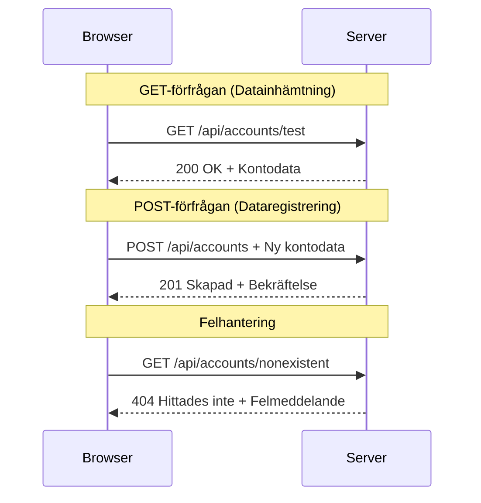
#### Steg 3: Sätta ihop allt

Nu kommer det tillfredsställande momentet – låt oss koppla din konto-hämtningsfunktion till inloggningsprocessen. Här faller allt på plats:

```javascript
async function login() {
  const loginForm = document.getElementById('loginForm');
  const user = loginForm.user.value;
  const data = await getAccount(user);

  if (data.error) {
    return console.log('loginError', data.error);
  }

  account = data;
  navigate('/dashboard');
}
```

Denna funktion följer en tydlig sekvens:
- Extraherar användarnamnet från formulärets input
- Begär användarens kontodata från servern
- Hanterar eventuella fel under processen
- Sparar kontodata och navigerar till instrumentpanelen vid framgång

> 🎯 **Async/Await-mönster**: Eftersom `getAccount` är asynkron används `await` för att pausa exekvering tills servern svarar. Detta förhindrar att koden fortsätter med odefinierade data.

#### Steg 4: Skapa ett hem för din data

Din app behöver någonstans att komma ihåg kontoinformationen när den väl är inläst. Tänk på det som appens korttidsminne – en plats för att hålla aktuell användardata nära till hands. Lägg till denna rad högst upp i din `app.js`:

```javascript
// Detta innehåller den nuvarande användarens kontodata
let account = null;
```

**Varför vi behöver detta:**
- Håller kontodatat åtkomligt från hela din app
- Börjar med `null` vilket betyder "ingen är inloggad än"
- Uppdateras när någon loggar in eller registrerar sig framgångsrikt
- Fungerar som en enda sanningskälla – ingen förvirring om vem som är inloggad

#### Steg 5: Koppla upp ditt formulär

Nu kopplar vi din blänkande nya inloggningsfunktion till ditt HTML-formulär. Uppdatera din formtagg så här:

```html
<form id="loginForm" action="javascript:login()">
  <!-- Your existing form inputs -->
</form>
```

**Vad denna lilla ändring gör:**
- Stoppar formuläret från att utföra sitt standardbeteende "ladda om hela sidan"
- Anropar din egna JavaScript-funktion istället
- Behåller allting smidigt och likt en single-page app
- Ger dig full kontroll över vad som händer när användare klickar på "Login"

#### Steg 6: Förbättra din registreringsfunktion

För konsekvens, uppdatera din `register`-funktion så den också sparar kontodata och navigerar till instrumentpanelen:

```javascript
// Lägg till dessa rader i slutet av din registerfunktion
account = result;
navigate('/dashboard');
```

**Denna förbättring ger:**
- **Sömlös** övergång från registrering till instrumentpanelen
- **Konsekvent** användarupplevelse mellan inloggning och registrering
- **Omedelbar** tillgång till kontodata efter lyckad registrering

#### Testa din implementation

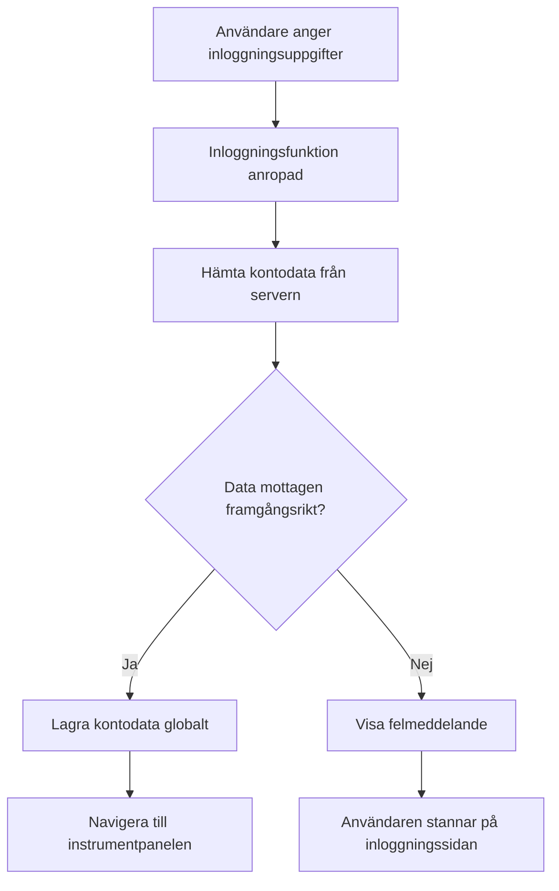
**Dags att provköra:**
1. Skapa ett nytt konto för att säkerställa att allt fungerar
2. Testa att logga in med samma uppgifter
3. Titta på din webbläsares konsol (F12) om något känns konstigt
4. Se till att du hamnar på instrumentpanelen efter lyckad inloggning

Om något inte fungerar, panikera inte! De flesta problem är enkla fixar som stavfel eller att glömma starta API-servern.

#### Ett snabbt ord om Cross-Origin-magik

Du kanske undrar: "Hur kan min webbapp prata med den här API-servern när de körs på olika portar?" Bra fråga! Detta är något som varje webbutvecklare stöter på till slut.

> 🔒 **Cross-Origin-säkerhet**: Webbläsare upprätthåller en "same-origin policy" för att förhindra obehörig kommunikation mellan olika domäner. Som kontrollstationen vid Pentagon verifierar de att kommunikationen är auktoriserad innan de tillåter datatransfer.
> 
**I vår uppsättning:**
- Din webbapp körs på `localhost:3000` (utvecklingsserver)
- Din API-server körs på `localhost:5000` (backend-server)
- API-servern inkluderar [CORS headers](https://developer.mozilla.org/docs/Web/HTTP/CORS) som explicit auktoriserar kommunikation från din webbapp

Denna konfiguration speglar verklig utveckling där frontend och backend-applikationer vanligtvis körs på separata servrar.

> 📚 **Läs mer**: Fördjupa dig mer i API:er och datahämtning med denna omfattande [Microsoft Learn-modul om API:er](https://docs.microsoft.com/learn/modules/use-apis-discover-museum-art/?WT.mc_id=academic-77807-sagibbon).

## Ge liv åt din data i HTML

Nu gör vi den hämtade datan synlig för användarna genom DOM-manipulation. Som processen att framkalla foton i ett mörkrum tar vi osynlig data och renderar den till något användarna kan se och interagera med.
DOM-manipulation är tekniken som förvandlar statiska webbsidor till dynamiska applikationer som uppdaterar sitt innehåll baserat på användarinteraktioner och server-svar.

### Välja rätt verktyg för jobbet

När det gäller att uppdatera din HTML med JavaScript har du flera alternativ. Tänk på dessa som olika verktyg i en verktygslåda – varje perfekt för specifika uppgifter:

| Metod | Vad den är bra för | När man ska använda den | Säkerhetsnivå |
|--------|---------------------|----------------|--------------|
| `textContent` | Visa användardata på ett säkert sätt | När du visar text | ✅ Stenhårt |
| `createElement()` + `append()` | Bygga komplexa layouter | Skapa nya sektioner/listor | ✅ Pansarsäkert |
| `innerHTML` | Sätta HTML-innehåll | ⚠️ Försök undvik den här | ❌ Riskfyllt |

#### Det säkra sättet att visa text: textContent

Egenskapen [`textContent`](https://developer.mozilla.org/docs/Web/API/Node/textContent) är din bästa vän när du visar användardata. Det är som att ha en vakt för din webbsida – inget skadligt släpps igenom:

```javascript
// Det säkra, pålitliga sättet att uppdatera text
const balanceElement = document.getElementById('balance');
balanceElement.textContent = account.balance;
```

**Fördelar med textContent:**
- Behandlar allt som vanlig text (hindrar scriptkörning)
- Rensar automatiskt befintligt innehåll
- Effektivt för enkla textuppdateringar
- Ger inbyggd säkerhet mot skadligt innehåll

#### Skapa dynamiska HTML-element

För mer komplext innehåll, kombinera [`document.createElement()`](https://developer.mozilla.org/docs/Web/API/Document/createElement) med metoden [`append()`](https://developer.mozilla.org/docs/Web/API/ParentNode/append):

```javascript
// Säkert sätt att skapa nya element
const transactionItem = document.createElement('div');
transactionItem.className = 'transaction-item';
transactionItem.textContent = `${transaction.date}: ${transaction.description}`;
container.append(transactionItem);
```

**Att förstå detta tillvägagångssätt:**
- **Skapar** nya DOM-element programmatiskt
- **Behåller** full kontroll över elementens attribut och innehåll
- **Tillåter** komplexa, nästlade elementstrukturer
- **Bevarar** säkerheten genom att separera struktur från innehåll

> ⚠️ **Säkerhetsaspekt**: Även om [`innerHTML`](https://developer.mozilla.org/docs/Web/API/Element/innerHTML) förekommer ofta i handledningar, kan det köra inbäddade script. Precis som säkerhetsprotokollen på CERN som förhindrar obehörig kodkörning, erbjuder `textContent` och `createElement` säkrare alternativ.
> 
**Risker med innerHTML:**
- Kör alla `<script>`-taggar i användardata
- Sårbart för kodinjektionsattacker
- Skapar potentiella säkerhetshål
- De säkrare alternativen vi använder har motsvarande funktionalitet

### Göra felmeddelanden användarvänliga

För närvarande visas bara inloggningsfel i webbläsarens konsol, som är osynlig för användarna. Precis som skillnaden mellan en pilots interna diagnostik och passagerarinformationssystemet, behöver vi kommunicera viktig information via rätt kanal.

Att visa synliga felmeddelanden ger användare omedelbar återkoppling om vad som gick fel och hur de ska gå vidare.

#### Steg 1: Lägg till en plats för felmeddelanden

Först, ge felmeddelanden en plats i din HTML. Lägg till detta precis före din inloggningsknapp så att användarna ser det på ett naturligt sätt:

```html
<!-- This is where error messages will appear -->
<div id="loginError" role="alert"></div>
<button>Login</button>
```

**Vad som händer här:**
- Vi skapar en tom container som förblir osynlig tills den behövs
- Den är placerad där användare naturligt tittar efter att ha klickat på "Login"
- `role="alert"` är en fin detalj för skärmläsare – det berättar för hjälpmedelsteknik "hej, det här är viktigt!"
- Det unika `id` ger vår JavaScript ett enkelt mål

#### Steg 2: Skapa en hjälpfunktion

Låt oss skriva en liten hjälpfunktion som kan uppdatera texten i vilket element som helst. Detta är en sån där "skriv en gång, använd överallt"-funktion som sparar tid:

```javascript
function updateElement(id, text) {
  const element = document.getElementById(id);
  element.textContent = text;
}
```

**Funktionens fördelar:**
- Enkelt gränssnitt som bara kräver element-ID och textinnehåll
- Letar upp och uppdaterar DOM-element säkert
- Återanvändbart mönster som minskar kodupprepning
- Säkerställer konsekvent uppdateringsbeteende i hela applikationen

#### Steg 3: Visa fel där användare kan se dem

Låt oss nu ersätta det dolda konsolmeddelandet med något användarna faktiskt kan se. Uppdatera din inloggningsfunktion:

```javascript
// I stället för att bara logga till konsolen, visa användaren vad som är fel
if (data.error) {
  return updateElement('loginError', data.error);
}
```

**Denna lilla ändring gör stor skillnad:**
- Felmeddelanden visas exakt där användarna tittar
- Inga fler mystiska tysta fel
- Användare får omedelbar och begriplig återkoppling
- Din app känns mer professionell och genomtänkt

Nu när du testar med ett ogiltigt konto, ser du ett hjälpsamt felmeddelande direkt på sidan!


#### Steg 4: Inkluderande med tillgänglighet

Det här är något bra med `role="alert"` vi lade till tidigare – det är inte bara dekoration! Denna lilla attribut skapar en så kallad [Live Region](https://developer.mozilla.org/docs/Web/Accessibility/ARIA/ARIA_Live_Regions) som direkt meddelar skärmläsare om förändringar:

```html
<div id="loginError" role="alert"></div>
```

**Varför detta är viktigt:**
- Skärmläsaranvändare hör felmeddelandet så fort det visas
- Alla får samma viktiga information, oavsett navigeringsmetod
- Ett enkelt sätt att göra din app tillgänglig för fler personer
- Visar att du bryr dig om att skapa inkluderande upplevelser

Små detaljer som denna skiljer bra utvecklare från de riktigt skickliga!

### 🎯 Pedagogisk avstämning: Autentiseringsmönster

**Pausa och reflektera**: Du har just implementerat ett komplett autentiseringsflöde. Detta är ett grundläggande mönster inom webbproduktion.

**Snabb självbedömning**:
- Kan du förklara varför vi använder async/await för API-anrop?
- Vad skulle hända om vi glömde funktionen `encodeURIComponent()`?
- Hur förbättrar vår felhantering användarupplevelsen?

**Verklighetskoppling**: Mönstren du lärt dig här (asynkron datahämtning, felhantering, användarfeedback) används i alla stora webbapplikationer från sociala medier till e-handelssajter. Du bygger produktionsklara färdigheter!

**Utmaningsfråga**: Hur skulle du modifiera detta autentiseringssystem för att hantera flera användarroller (kund, admin, kassör)? Fundera på datastrukturen och de UI-ändringar som behövs.

#### Steg 5: Applicera samma mönster på registrering

För konsekvens, implementera likadan felhantering i ditt registreringsformulär:

1. **Lägg till** ett element för felvisning i din registrerings-HTML:
```html
<div id="registerError" role="alert"></div>
```

2. **Uppdatera** din registreringsfunktion för att använda samma felvisningsmönster:
```javascript
if (data.error) {
  return updateElement('registerError', data.error);
}
```

**Fördelar med konsekvent felhantering:**
- **Ger** enhetlig användarupplevelse i alla formulär
- **Minskar** kognitiv belastning genom att använda välbekanta mönster
- **Förenklar** underhåll med återanvändbar kod
- **Säkerställer** att tillgänglighetsstandarder upprätthålls i hela appen

## Skapa din dynamiska dashboard

Nu ska vi förvandla din statiska dashboard till ett dynamiskt gränssnitt som visar verklig kontodata. Som skillnaden mellan ett tryckt flygschema och de live avgångstavlorna på flygplatser, går vi från statisk info till realtidsuppdateringar.

Med hjälp av DOM-manipulationsteknikerna du lärt dig skapar vi en dashboard som automatiskt uppdateras med aktuell kontoinformation.

### Lära känna din data

Innan vi börjar bygga, låt oss kika på vilken data din server skickar tillbaka. När någon loggar in framgångsrikt får du en informationsskatt att jobba med:

```json
{
  "user": "test",
  "currency": "$",
  "description": "Test account",
  "balance": 75,
  "transactions": [
    { "id": "1", "date": "2020-10-01", "object": "Pocket money", "amount": 50 },
    { "id": "2", "date": "2020-10-03", "object": "Book", "amount": -10 },
    { "id": "3", "date": "2020-10-04", "object": "Sandwich", "amount": -5 }
  ]
}
```

**Denna datastruktur innehåller:**
- **`user`**: Perfekt för att göra upplevelsen personlig ("Välkommen tillbaka, Sarah!")
- **`currency`**: Säkerställer att vi visar pengar korrekt
- **`description`**: Ett vänligt namn för kontot
- **`balance`**: Det oerhört viktiga aktuella saldot
- **`transactions`**: Den kompletta transaktionshistoriken med alla detaljer

Allt du behöver för att bygga en proffsig bankdashboard!

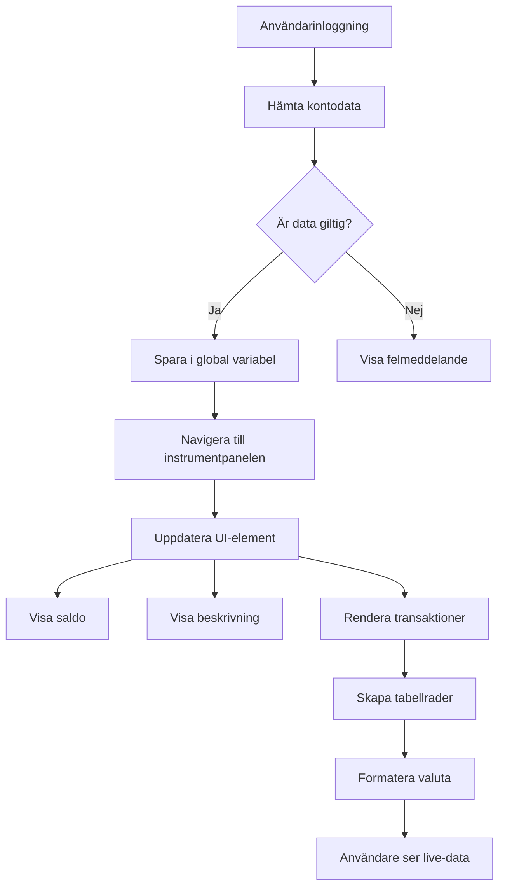
> 💡 **Proffstips**: Vill du se din dashboard i aktion direkt? Använd användarnamnet `test` när du loggar in – det är förladdat med exempeldata så att du kan se allt fungera utan att behöva skapa transaktioner först.
> 
**Varför testkontot är smidigt:**
- Kommer redan med realistiska exempeldata
- Perfekt för att se hur transaktioner visas
- Bra för att testa dashboardens funktioner
- Sparar dig från att manuellt skapa testdata

### Skapa dashboardens visnings-element

Låt oss bygga ditt dashboardgränssnitt steg för steg, börja med kontosammanfattningen och sedan gå vidare till mer komplexa funktioner som transaktionslistor.

#### Steg 1: Uppdatera din HTML-struktur

Först, ersätt den statiska "Saldo"-sektionen med dynamiska platshållare som din JavaScript kan fylla i:

```html
<section>
  Balance: <span id="balance"></span><span id="currency"></span>
</section>
```

Lägg sedan till en sektion för kontots beskrivning. Eftersom detta fungerar som titel för dashboard-innehållet, använd semantisk HTML:

```html
<h2 id="description"></h2>
```

**Att förstå HTML-strukturen:**
- **Använder** separata `<span>`-element för saldo och valuta för individuell kontroll
- **Tillämpa** unika ID:n på varje element för JavaScript-målsättning
- **Följer** semantisk HTML genom att använda `<h2>` för kontobeskrivningen
- **Skapar** en logisk hierarki för skärmläsare och SEO

> ✅ **Tillgänglighets-insikt**: Kontobeskrivningen fungerar som en titel för dashboard-innehållet, därför markeras den semantiskt som en rubrik. Läs mer om hur [struktur på rubriker](https://www.nomensa.com/blog/2017/how-structure-headings-web-accessibility) påverkar tillgänglighet. Kan du identifiera andra element på din sida som kan ha nytta av rubriker?

#### Steg 2: Skapa funktionen som uppdaterar dashboarden

Skapa nu en funktion som fyller din dashboard med verklig kontodata:

```javascript
function updateDashboard() {
  if (!account) {
    return navigate('/login');
  }

  updateElement('description', account.description);
  updateElement('balance', account.balance.toFixed(2));
  updateElement('currency', account.currency);
}
```

**Steg för steg, detta gör funktionen:**
- **Verifierar** att kontodata finns innan den fortsätter
- **Omdirigerar** icke-autentiserade användare tillbaka till inloggningssidan
- **Uppdaterar** kontobeskrivningen med hjälp av den återanvändbara `updateElement`-funktionen
- **Formaterar** saldot så att det alltid visar två decimaler
- **Visar** rätt valutasymbol

> 💰 **Pengarformattering**: Metoden [`toFixed(2)`](https://developer.mozilla.org/docs/Web/JavaScript/Reference/Global_Objects/Number/toFixed) är en livräddare! Den ser till att ditt saldo alltid ser ut som riktiga pengar – "75.00" istället för bara "75". Dina användare kommer uppskatta att se bekanta valutaformat.

#### Steg 3: Säkerställa att din dashboard uppdateras

För att se till att din dashboard uppdateras med aktuell data varje gång någon besöker den, måste vi koppla in oss på din navigationsfunktion. Om du gjorde [uppgiften i lektion 1](../1-template-route/assignment.md) känns detta igen. Om inte, oroa dig inte – här är vad du behöver:

Lägg till detta i slutet av din `updateRoute()`-funktion:

```javascript
if (typeof route.init === 'function') {
  route.init();
}
```

Uppdatera sedan dina rutter för att inkludera dashboard-initialisering:

```javascript
const routes = {
  '/login': { templateId: 'login' },
  '/dashboard': { templateId: 'dashboard', init: updateDashboard }
};
```

**Vad denna smarta lösning gör:**
- Kollar om en rutt har särskild initialiseringskod
- Kör den koden automatiskt när rutten laddas
- Ser till att din dashboard alltid visar färsk, aktuell data
- Håller routing-logiken ren och organiserad

#### Testa din dashboard

Efter att ha implementerat dessa förändringar, testa din dashboard:

1. **Logga in** med ett testkonto
2. **Kontrollera** att du blir omdirigerad till dashboarden
3. **Verifiera** att kontobeskrivning, saldo och valuta visas korrekt
4. **Testa att logga ut och in igen** för att säkerställa att data uppdateras korrekt

Din dashboard bör nu visa dynamisk kontoinformation som uppdateras baserat på den inloggade användarens data!

## Bygga smarta transaktionslistor med mallar

Istället för att manuellt skapa HTML för varje transaktion, använder vi mallar för att automatiskt generera konsekvent formatering. Liksom standardiserade komponenter i rymdfarkoststillverkning säkerställer mallar att varje transaktionsrad följer samma struktur och utseende.

Denna teknik skalar effektivt från några få transaktioner till tusentals, med bibehållen prestanda och presentation.

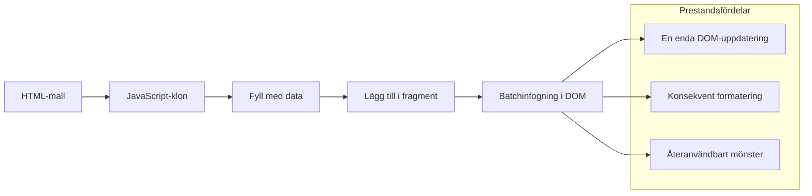
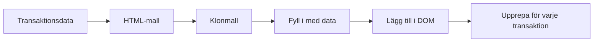
### Steg 1: Skapa transaktionsmallen

Först, lägg till en återanvändbar mall för transaktionsrader i `<body>` i din HTML:

```html
<template id="transaction">
  <tr>
    <td></td>
    <td></td>
    <td></td>
  </tr>
</template>
```

**Att förstå HTML-mallar:**
- **Definierar** strukturen för en enda tabellrad
- **Förblir** osynlig tills den klonas och fylls med JavaScript
- **Inkluderar** tre celler för datum, beskrivning och belopp
- **Ger** ett återanvändbart mönster för konsekvent formatering

### Steg 2: Förbered tabellen för dynamiskt innehåll

Lägg sedan till ett `id` på din tabellkropp så att JavaScript enkelt kan hitta den:

```html
<tbody id="transactions"></tbody>
```

**Vad detta åstadkommer:**
- **Skapar** ett tydligt mål för insättning av transaktionsrader
- **Separera** tabellstruktur från dynamiskt innehåll
- **Möjliggör** enkel rensning och omladdning av transaktionsdata

### Steg 3: Bygg funktionen som skapar transaktionsrader

Skapa nu en funktion som omvandlar transaktionsdata till HTML-element:

```javascript
function createTransactionRow(transaction) {
  const template = document.getElementById('transaction');
  const transactionRow = template.content.cloneNode(true);
  const tr = transactionRow.querySelector('tr');
  tr.children[0].textContent = transaction.date;
  tr.children[1].textContent = transaction.object;
  tr.children[2].textContent = transaction.amount.toFixed(2);
  return transactionRow;
}
```

**Uppdelning av denna fabriksfunktion:**
- **Hämtar** mallen via dess ID
- **Klona** mallens innehåll för säker bearbetning
- **Väljer** tabellraden inom klonen
- **Fyller** varje cell med transaktionsdata
- **Formaterar** beloppet med korrekt decimalvisning
- **Returnerar** den färdiga raden redo för insättning

### Steg 4: Generera flera transaktionsrader effektivt

Lägg till denna kod i din `updateDashboard()`-funktion för att visa alla transaktioner:

```javascript
const transactionsRows = document.createDocumentFragment();
for (const transaction of account.transactions) {
  const transactionRow = createTransactionRow(transaction);
  transactionsRows.appendChild(transactionRow);
}
updateElement('transactions', transactionsRows);
```

**Att förstå detta effektiva tillvägagångssätt:**
- **Skapar** ett dokumentfragment för att batch-behandla DOM-operationer
- **Loopar** genom alla transaktioner i kontodatat
- **Skapar** en rad för varje transaktion med fabriksfunktionen
- **Samlar** alla rader i fragmentet innan de läggs till i DOM:en
- **Utför** en enda DOM-uppdatering istället för flera individuella insättningar
> ⚡ **Prestandaoptimering**: [`document.createDocumentFragment()`](https://developer.mozilla.org/docs/Web/API/Document/createDocumentFragment) fungerar som monteringsprocessen hos Boeing – komponenter förbereds utanför huvudlinjen, sedan installeras de som en komplett enhet. Denna batchmetod minimerar DOM-omflöden genom att utföra en enda insättning istället för flera individuella operationer.

### Steg 5: Förbättra Uppdateringsfunktionen för Blandat Innehåll

Din `updateElement()`-funktion hanterar för närvarande bara textinnehåll. Uppdatera den för att fungera med både text och DOM-noder:

```javascript
function updateElement(id, textOrNode) {
  const element = document.getElementById(id);
  element.textContent = ''; // Tar bort alla barn
  element.append(textOrNode);
}
```

**Viktiga förbättringar i denna uppdatering:**
- **Rensar** befintligt innehåll innan nytt läggs till
- **Accepterar** antingen textsträngar eller DOM-noder som parametrar
- **Använder** [`append()`](https://developer.mozilla.org/docs/Web/API/ParentNode/append)-metoden för flexibilitet
- **Bibehåller** bakåtkompatibilitet med befintlig textbaserad användning

### Ta din Kontrollpanel på en Provkörning

Dags för avgörande ögonblick! Låt oss se din dynamiska kontrollpanel i aktion:

1. Logga in med kontot `test` (det har exempeldata klart att använda)
2. Navigera till din kontrollpanel
3. Kontrollera att transaktionsrader visas med korrekt formatering
4. Säkerställ att datum, beskrivningar och belopp ser bra ut

Om allt fungerar ska du se en fullt fungerande transaktionslista på din kontrollpanel! 🎉

**Vad du har åstadkommit:**
- Byggt en kontrollpanel som skalar med vilken mängd data som helst
- Skapat återanvändbara mallar för enhetlig formatering
- Implementerat effektiva DOM-manipulationstekniker
- Utvecklat funktionalitet jämförbar med produktionsbankapplikationer

Du har framgångsrikt förvandlat en statisk webbsida till en dynamisk webbapplikation.

### 🎯 Pedagogisk Kontrollpunkt: Dynamisk Innehållsgenerering

**Arkitekturförståelse**: Du har implementerat en sofistikerad data-till-användargränssnitt-pipeline som speglar mönster som används i ramverk som React, Vue och Angular.

**Centrala Begrepp Behärskade**:
- **Mallbaserad rendering**: Skapa återanvändbara UI-komponenter
- **Dokumentfragment**: Optimera DOM-prestanda
- **Säker DOM-manipulation**: Förebygga säkerhetsrisker
- **Datatransformation**: Omvandla serverdata till användargränssnitt

**Branschkoppling**: Dessa tekniker utgör grunden för moderna frontend-ramverk. Reacts virtuella DOM, Vues mallsystem och Angulars komponentarkitektur bygger alla på dessa kärnkoncept.

**Reflektionsfråga**: Hur skulle du utöka detta system för att hantera realtidsuppdateringar (som nya transaktioner som automatiskt dyker upp)? Tänk på WebSockets eller Server-Sent Events.

---

## 📈 Din Mästerskaps- och Datamanagementtidslinje

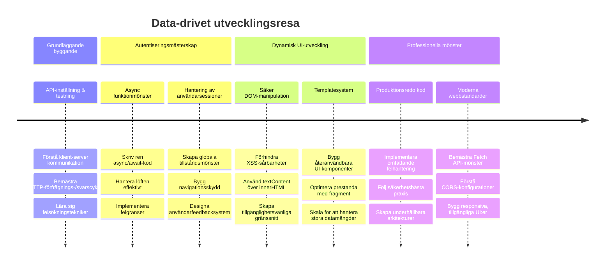
**🎓 Examensmilstolpe**: Du har framgångsrikt byggt en komplett data-driven webbapplikation med moderna JavaScript-mönster. Dessa färdigheter går direkt att tillämpa i ramverk som React, Vue eller Angular.

**🔄 Nästa nivå-förmågor**:
- Redo att utforska frontend-ramverk som bygger vidare på dessa koncept
- Förberedd att implementera realtidsfunktioner med WebSockets
- Utrustad för att bygga Progressiva webbappar med offlinekapabiliteter
- Grundlagd för att lära avancerade tillståndshanteringsmönster

## GitHub Copilot Agent-utmaning 🚀

Använd Agent-läge för att lösa följande utmaning:

**Beskrivning:** Förbättra bankappen genom att implementera en sök- och filterfunktion för transaktioner som tillåter användare att hitta specifika transaktioner baserat på datumintervall, belopp eller beskrivning.

**Uppmaning:** Skapa en sökfunktionalitet för bankappen som inkluderar: 1) Ett sökformulär med inmatningsfält för datumintervall (från/till), minimum/maximumbelopp och nyckelord i transaktionsbeskrivning, 2) En `filterTransactions()`-funktion som filtrerar account.transactions-arrayen baserat på sökkriterierna, 3) Uppdatera `updateDashboard()` för att visa filtrerade resultat, och 4) Lägg till en knapp "Rensa filter" för att återställa vyn. Använd moderna JavaScript-metoder som `filter()` och hantera kantfall för tomma sökkriterier.

Lär dig mer om [agent mode](https://code.visualstudio.com/blogs/2025/02/24/introducing-copilot-agent-mode) här.

## 🚀 Utmaning

Redo att ta din bankapp till nästa nivå? Låt oss göra den till något du faktiskt vill använda. Här är några idéer för att väcka din kreativitet:

**Gör den vacker**: Lägg till CSS-styling för att förvandla din funktionella kontrollpanel till något visuellt tilltalande. Tänk rena linjer, bra avstånd och kanske till och med subtila animationer.

**Gör den responsiv**: Prova att använda [media queries](https://developer.mozilla.org/docs/Web/CSS/Media_Queries) för att skapa en [responsiv design](https://developer.mozilla.org/docs/Web/Progressive_web_apps/Responsive/responsive_design_building_blocks) som fungerar utmärkt på telefoner, surfplattor och datorer. Dina användare kommer att tacka dig!

**Lägg till lite finess**: Överväg att färgkoda transaktioner (grön för inkomster, röd för utgifter), lägga till ikoner eller skapa hovereffekter som gör gränssnittet mer interaktivt.

Så här kan en snygg kontrollpanel se ut:

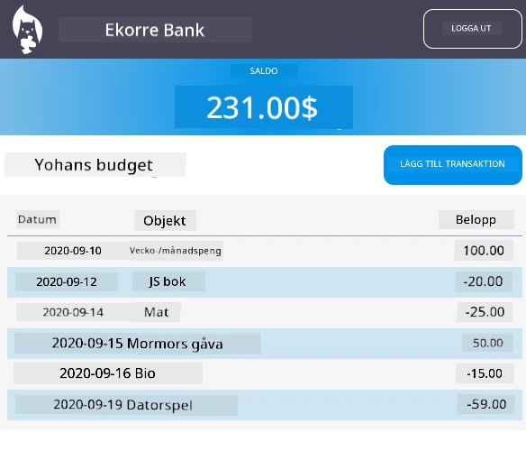

Känn inte att du måste efterlikna detta exakt – använd det som inspiration och gör det till ditt eget!

## Quiz efter föreläsning

[Post-lecture quiz](https://ff-quizzes.netlify.app/web/quiz/46)

## Uppgift

[Refaktorera och kommentera din kod](assignment.md)

---

<!-- CO-OP TRANSLATOR DISCLAIMER START -->
**Ansvarsfriskrivning**:
Detta dokument har översatts med hjälp av AI-översättningstjänsten [Co-op Translator](https://github.com/Azure/co-op-translator). Även om vi strävar efter noggrannhet, vänligen ha i åtanke att automatiska översättningar kan innehålla fel eller brister. Det ursprungliga dokumentet på dess modersmål bör betraktas som den auktoritativa källan. För kritisk information rekommenderas professionell mänsklig översättning. Vi ansvarar inte för några missförstånd eller feltolkningar som uppstår vid användning av denna översättning.
<!-- CO-OP TRANSLATOR DISCLAIMER END -->