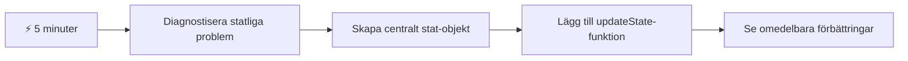
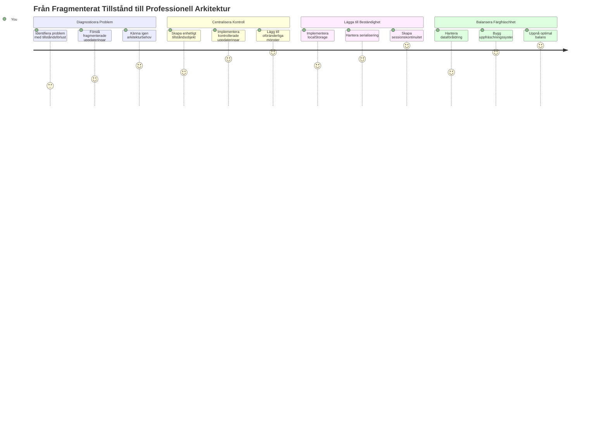
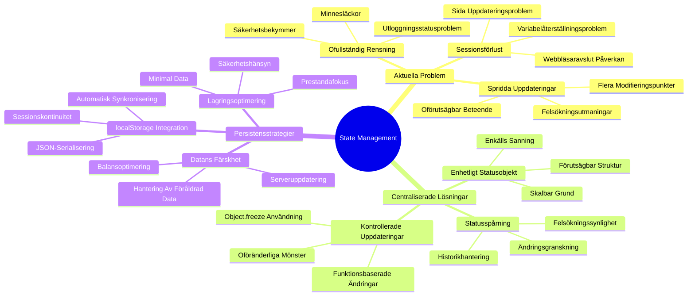
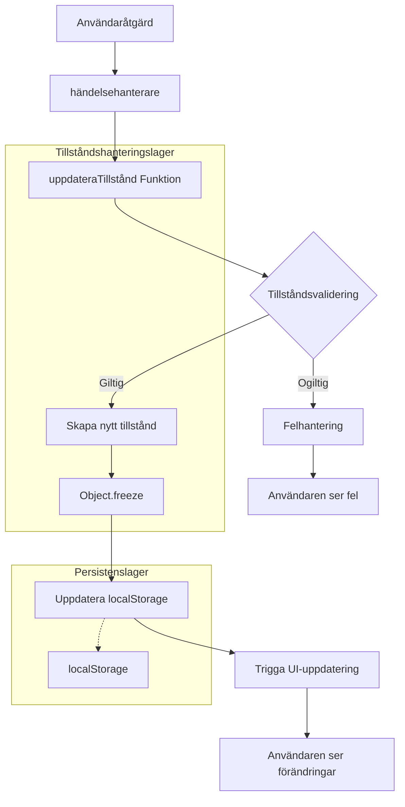
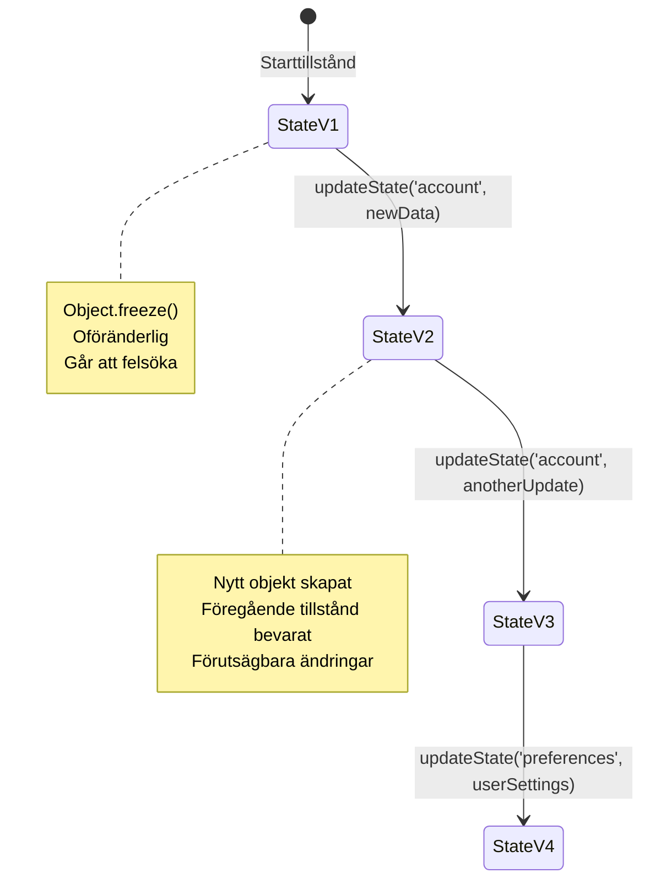
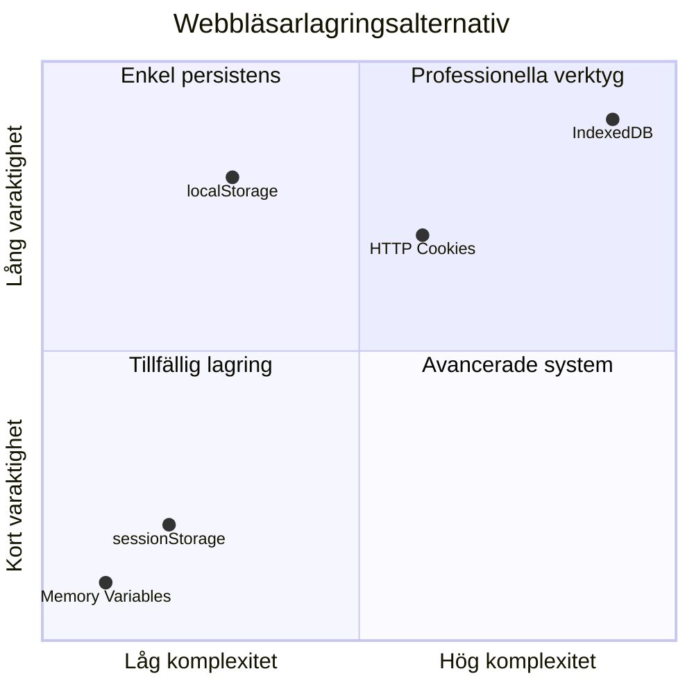
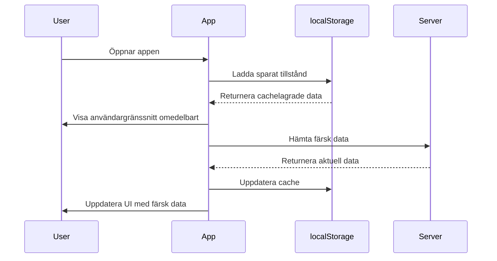
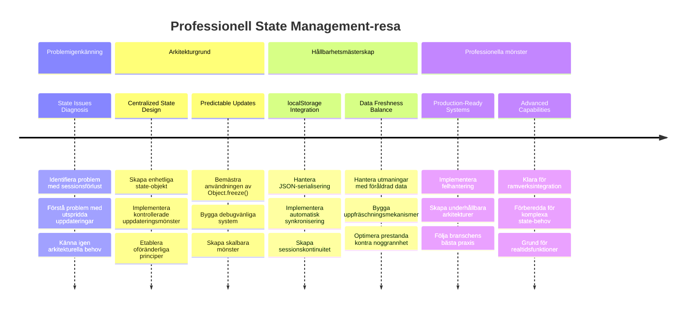

<!--
CO_OP_TRANSLATOR_METADATA:
{
  "original_hash": "b807b09df716dc48a2b750835bf8e933",
  "translation_date": "2026-01-06T23:05:49+00:00",
  "source_file": "7-bank-project/4-state-management/README.md",
  "language_code": "sv"
}
-->
# Bygg en bankapp del 4: Begrepp om tillståndshantering

## ⚡ Vad du kan göra på nästa 5 minuter

**Snabbstartväg för upptagna utvecklare**


- **Minut 1**: Testa det nuvarande tillståndsproblemet - logga in, uppdatera sidan, observera utloggning
- **Minut 2**: Byt ut `let account = null` mot `let state = { account: null }`
- **Minut 3**: Skapa en enkel `updateState()`-funktion för kontrollerade uppdateringar
- **Minut 4**: Uppdatera en funktion att använda det nya mönstret
- **Minut 5**: Testa den förbättrade förutsägbarheten och felsökningsmöjligheten

**Snabb diagnostiskt test**:
```javascript
// Före: Spridd status
let account = null; // Förlorad vid uppdatering!

// Efter: Centraliserad status
let state = Object.freeze({ account: null }); // Kontrollerad och spårbar!
```

**Varför detta är viktigt**: På 5 minuter kommer du uppleva övergången från kaotisk tillståndshantering till förutsägbara, felsökningsbara mönster. Detta är grunden som gör komplexa applikationer underhållbara.

## 🗺️ Din läranderesa genom mästerskap i tillståndshantering


**Din resedestination**: I slutet av denna lektion har du byggt ett professionellt tillståndshanteringssystem som hanterar persistens, datafräschhet och förutsägbara uppdateringar – samma mönster som används i produktionsapplikationer.

## Föravsnittsquiz

[Föravsnittsquiz](https://ff-quizzes.netlify.app/web/quiz/47)

## Introduktion

Tillståndshantering är som navigationssystemet på Voyager-rymdfarkosten – när allt fungerar smidigt märker du knappt att det finns där. Men när det går fel blir det skillnaden mellan att nå interstellärt utrymme och att driva bort vilse i det kosmiska tomrummet. I webbutveckling representerar tillstånd allt din applikation behöver komma ihåg: användarinloggning, formulärdata, navigationshistorik och temporära gränssnittstillstånd.

När din bankapp har utvecklats från ett enkelt inloggningsformulär till en mer sofistikerad applikation har du troligen stött på några vanliga utmaningar. Uppdatera sidan och användare loggas oväntat ut. Stäng webbläsaren och allt framsteg försvinner. Felsök ett problem och du jagar genom flera funktioner som alla modifierar samma data på olika sätt.

Detta är inga tecken på dålig kodning – det är de naturliga växtvärken som uppstår när applikationer når en viss komplexitetsnivå. Varje utvecklare möter dessa utmaningar när deras appar går från "bevis på koncept" till "produktionsfärdiga."

I denna lektion implementerar vi ett centraliserat tillståndshanteringssystem som förvandlar din bankapp till en pålitlig, professionell applikation. Du kommer lära dig hantera dataflöden förutsägbart, behålla användarsessioner på rätt sätt och skapa den smidiga användarupplevelse som moderna webbapplikationer kräver.

## Förutsättningar

Innan du dyker in i tillståndshanteringskoncepten behöver du ha din utvecklingsmiljö korrekt installerad och ha bankappens grund på plats. Denna lektion bygger direkt på koncept och kod från tidigare delar i denna serie.

Se till att du har följande komponenter redo innan du fortsätter:

**Nödvändig installation:**
- Slutför [datahämtningslektionen](../3-data/README.md) – din app ska kunna ladda och visa kontodata korrekt
- Installera [Node.js](https://nodejs.org) på ditt system för att köra backend-API:n
- Starta [server-API:n](../api/README.md) lokalt för att hantera kontodataoperationer

**Testa din miljö:**

Verifiera att din API-server körs korrekt genom att köra följande kommando i en terminal:

```sh
curl http://localhost:5000/api
# -> bör returnera "Bank API v1.0.0" som resultat
```

**Vad detta kommando gör:**
- **Skickar** en GET-förfrågan till din lokala API-server
- **Testar** anslutningen och verifierar att servern svarar
- **Returnerar** API-versionens information om allt fungerar korrekt

## 🧠 Översikt av tillståndshanteringsarkitektur


**Kärnprincip**: Professionell tillståndshantering balanserar förutsägbarhet, persistens och prestanda för att skapa pålitliga användarupplevelser som skalar från enkla interaktioner till komplexa applikationsarbetsflöden.

---

## Diagnosticering av nuvarande tillståndsproblem

Som Sherlock Holmes när han undersöker en brottsplats behöver vi förstå exakt vad som händer i vår nuvarande implementering innan vi kan lösa mysteriet med försvinnande användarsessioner.

Låt oss göra ett enkelt experiment som avslöjar grundläggande utmaningar i tillståndshanteringen:

**🧪 Prova detta diagnostiska test:**
1. Logga in i din bankapp och navigera till instrumentpanelen
2. Uppdatera webbläsarsidan
3. Observera vad som händer med din inloggningsstatus

Om du blir omdirigerad tillbaka till inloggningsskärmen har du hittat det klassiska problemet med att tillståndets persistens saknas. Detta beteende uppstår eftersom vår nuvarande implementering lagrar användardata i JavaScript-variabler som återställs vid varje sidladdning.

**Problem med nuvarande implementering:**

Den enkla `account`-variabeln från vår [föregående lektion](../3-data/README.md) skapar tre betydande problem som påverkar både användarupplevelsen och kodunderhållbarheten:

| Problem | Teknisk orsak | Användarpåverkan |
|---------|---------------|------------------|
| **Sessionsförlust** | Sidladdning tömmer JavaScript-variabler | Användare måste logga in ofta |
| **Spridda uppdateringar** | Flera funktioner modifierar tillstånd direkt | Felsökning blir allt svårare |
| **Ofullständig rensning** | Utloggning rensar inte all tillståndsreferens | Potentiella säkerhets- och sekretessproblem |

**Den arkitektoniska utmaningen:**

Som Titanics delade design som verkade robust förrän flera fack samtidigt översvämmades, löser man inte problemen enskilt genom att fixa varje punkt. Vi behöver en omfattande lösning för tillståndshantering.

> 💡 **Vad försöker vi egentligen åstadkomma här?**

[Tillståndshantering](https://en.wikipedia.org/wiki/State_management) handlar egentligen om att lösa två grundläggande pussel:

1. **Var finns mina data?**: Hålla koll på vilken information vi har och var den kommer ifrån
2. **Är alla överens?**: Säkerställa att det användarna ser matchar vad som faktiskt händer

**Vår spelplan:**

Istället för att jaga våra egna svansar ska vi skapa ett **centraliserat tillståndshanteringssystem**. Tänk på det som att ha en riktigt organiserad person som har hand om allt det viktiga:



**Förstå detta dataflöde:**
- **Centraliserar** allt applikationstillstånd på ett ställe
- **Rutter** alla tillståndsändringar genom kontrollerade funktioner
- **Säkerställer** att gränssnittet förblir synkroniserat med aktuellt tillstånd
- **Ger** ett tydligt, förutsägbart mönster för datahantering

> 💡 **Professionell insikt**: Denna lektion fokuserar på grundläggande koncept. För komplexa applikationer erbjuder bibliotek som [Redux](https://redux.js.org) mer avancerade funktioner för tillståndshantering. Att förstå dessa kärnprinciper hjälper dig behärska vilket tillståndshanteringsbibliotek som helst.

> ⚠️ **Avancerat ämne**: Vi kommer inte täcka automatiska UI-uppdateringar som triggas av tillståndsändringar, eftersom det innefattar [reaktiv programmering](https://en.wikipedia.org/wiki/Reactive_programming)-koncept. Se detta som ett utmärkt nästa steg på din läranderesa!

### Uppgift: Centralisera tillståndsstrukturen

Låt oss börja att transformera vår splittrade tillståndshantering till ett centraliserat system. Detta första steg skapar grunden för alla förbättringar som följer.

**Steg 1: Skapa ett centralt tillståndsobjekt**

Byt ut den enkla `account`-deklarationen:

```js
let account = null;
```

Mot ett strukturerat tillståndsobjekt:

```js
let state = {
  account: null
};
```

**Här är varför denna ändring är viktig:**
- **Centraliserar** all applikationsdata på ett ställe
- **Förbereder** strukturen för att lägga till fler tillståndsegenskaper senare
- **Skapar** en tydlig gräns mellan tillstånd och andra variabler
- **Etablerar** ett mönster som skalar när din app växer

**Steg 2: Uppdatera mönster för tillgång till tillstånd**

Uppdatera dina funktioner att använda den nya tillståndsstrukturen:

**I `register()` och `login()`-funktionerna**, byt ut:
```js
account = ...
```

Mot:
```js
state.account = ...
```

**I `updateDashboard()`-funktionen**, lägg till denna rad högst upp:
```js
const account = state.account;
```

**Vad dessa uppdateringar uppnår:**
- **Bibehåller** existerande funktionalitet samtidigt som strukturen förbättras
- **Förbereder** din kod för mer sofistikerad tillståndshantering
- **Skapar** konsekventa mönster för att nå tillståndsdata
- **Lägger grunden** för centraliserade tillståndsuppdateringar

> 💡 **Notera**: Denna omstrukturering löser inte omedelbart våra problem, men skapar den viktiga grunden för de kraftfulla förbättringar som komma skall!

### 🎯 Pedagogisk kontrollpunkt: Principer för centralisering

**Pausa och reflektera**: Du har just implementerat grunden för centraliserad tillståndshantering. Detta är ett avgörande arkitektoniskt beslut.

**Snabb självbedömning**:
- Kan du förklara varför det är bättre att centralisera tillstånd i ett objekt än spridda variabler?
- Vad skulle hända om du glömde uppdatera en funktion att använda `state.account`?
- Hur förbereder detta mönster din kod för mer avancerade funktioner?

**Verklighetskoppling**: Centraliseringsmönstret du lärt dig är grunden i moderna ramverk som Redux, Vuex och React Context. Du bygger samma arkitektoniska tänk som används i stora applikationer.

**Utmaningsfråga**: Om du behövde lägga till användarpreferenser (tema, språk) i din app, var skulle du lägga dem i tillståndsstrukturen? Hur skulle detta skala?

## Implementera kontrollerade tillståndsuppdateringar

När vi har centraliserat vårt tillstånd innebär nästa steg att etablera kontrollerade mekanismer för datamodifieringar. Detta tillvägagångssätt säkerställer förutsägbara tillståndsändringar och enklare felsökning.

Kärnprincipen liknar flygtrafikledning: istället för att låta flera funktioner modifiera tillstånd oberoende kommer vi kanalisera alla ändringar genom en enda, kontrollerad funktion. Detta mönster ger tydlig insyn i när och hur data förändras.

**Immutabel tillståndshantering:**

Vi kommer behandla vårt `state`-objekt som [*immunt*](https://en.wikipedia.org/wiki/Immutable_object), vilket betyder att vi aldrig modifierar det direkt. Istället skapar varje ändring ett nytt tillståndsobjekt med uppdaterad data.

Även om detta kan verka ineffektivt jämfört med direkta modifieringar till en början, ger det betydande fördelar vid felsökning, testning och att upprätthålla tillståndets förutsägbarhet.

**Fördelar med immutabel tillståndshantering:**

| Fördel | Beskrivning | Påverkan |
|--------|-------------|----------|
| **Förutsägbarhet** | Ändringar sker endast genom kontrollerade funktioner | Lättare att felsöka och testa |
| **Historikspårning** | Varje tillståndsändring skapar ett nytt objekt | Möjliggör ångra/gör om-funktioner |
| **Förekomst av sidoeffekter förhindras** | Inga oavsiktliga modifieringar | Förhindrar mystiska buggar |
| **Prestandaoptimering** | Lätt att upptäcka när tillstånd faktiskt ändrats | Möjliggör effektiva UI-uppdateringar |

**JavaScript-immutabilitet med `Object.freeze()`:**

JavaScript erbjuder [`Object.freeze()`](https://developer.mozilla.org/docs/Web/JavaScript/Reference/Global_Objects/Object/freeze) för att förhindra objektmodifieringar:

```js
const immutableState = Object.freeze({ account: userData });
// Varje försök att ändra immutableState kommer att generera ett fel
```

**Vad som händer här:**
- **Förhindrar** direkta attributtilldelningar eller borttagningar
- **Kastar** undantag om modifieringsförsök görs
- **Säkerställer** att tillståndsändringar måste gå via kontrollerade funktioner
- **Skapar** ett tydligt kontrakt för hur tillstånd kan uppdateras

> 💡 **Djupdykning**: Läs om skillnaden mellan *ytlig* och *djup* immutabilitet i [MDN-dokumentationen](https://developer.mozilla.org/docs/Web/JavaScript/Reference/Global_Objects/Object/freeze#What_is_shallow_freeze). Att förstå denna distinktion är avgörande för komplexa tillståndsstrukturer.


### Uppgift

Låt oss skapa en ny `updateState()`-funktion:

```js
function updateState(property, newData) {
  state = Object.freeze({
    ...state,
    [property]: newData
  });
}
```

I denna funktion skapar vi ett nytt tillståndsobjekt och kopierar data från föregående tillstånd med hjälp av [*spread (`...`) operatorn*](https://developer.mozilla.org/docs/Web/JavaScript/Reference/Operators/Spread_syntax#Spread_in_object_literals). Därefter skriver vi över en särskild egenskap i tillståndsobjektet med ny data med hjälp av [hakparentesnotationen](https://developer.mozilla.org/docs/Web/JavaScript/Guide/Working_with_Objects#Objects_and_properties) `[property]` för tilldelning. Slutligen låser vi objektet för att förhindra modifieringar med `Object.freeze()`. Vi har just nu bara `account`-egenskapen i tillståndet, men med detta tillvägagångssätt kan du lägga till så många egenskaper du behöver.

Vi uppdaterar även initialiseringen av `state` för att säkerställa att det initiala tillståndet också är fryst:

```js
let state = Object.freeze({
  account: null
});
```

Därefter uppdaterar du `register`-funktionen genom att byta ut tilldelningen `state.account = result;` mot:

```js
updateState('account', result);
```

Gör samma sak i `login`-funktionen, byt ut `state.account = data;` mot:

```js
updateState('account', data);
```

Vi passar nu på att åtgärda problemet med att kontodatat inte rensas när användaren klickar på *Logga ut*.

Skapa en ny funktion `logout()`:

```js
function logout() {
  updateState('account', null);
  navigate('/login');
}
```

I `updateDashboard()` byter du ut omdirigeringen `return navigate('/login');` till `return logout()`;

Testa att registrera ett nytt konto, logga ut och in igen för att kontrollera att allt fortfarande fungerar korrekt.

> Tips: du kan följa alla tillståndsförändringar genom att lägga till `console.log(state)` längst ned i `updateState()` och öppna konsolen i din webbläsares utvecklingsverktyg.

## Implementera datapersistens

Det sessionsbortfallsproblem vi identifierade tidigare kräver en persistenslösning som behåller användarens tillstånd över webbläsarsessioner. Detta förvandlar vår applikation från en temporär upplevelse till ett pålitligt, professionellt verktyg.

Tänk på hur atomklockor bibehåller exakt tid även genom strömavbrott genom att lagra kritiskt tillstånd i icke-flyktigt minne. På samma sätt behöver webbapplikationer persistenta lagringsmekanismer för att bevara viktig användardata över webbläsarsessioner och siduppdateringar.

**Strategiska frågor för datapersistens:**

Innan du implementerar persistens, överväg dessa kritiska faktorer:

| Fråga | Bankappens kontext | Besluts-påverkan |
|-------|--------------------|------------------|
| **Är datan känslig?** | Kontosaldo, transaktionshistorik | Välj säkra lagringsmetoder |
| **Hur länge ska det vara kvar?** | Inloggningsstatus vs. tillfälliga UI-inställningar | Välj lämplig lagringstid |
| **Behöver servern det?** | Autentiseringstoken vs. UI-inställningar | Bestäm delningskrav |

**Webblagringsalternativ:**

Moderna webbläsare erbjuder flera lagringsmekanismer, var och en avsedd för olika användningsområden:

**Primära lagrings-API:er:**

1. **[`localStorage`](https://developer.mozilla.org/docs/Web/API/Window/localStorage)**: Ihållande [Nyckel/Värde-lagring](https://en.wikipedia.org/wiki/Key%E2%80%93value_database)
   - **Består** av data mellan webbläsarsessioner på obestämd tid  
   - **Överlever** webbläsaromstart och datoromstarter
   - **Begränsad** till den specifika webbplatsens domän
   - **Perfekt** för användarpreferenser och inloggningsstatus

2. **[`sessionStorage`](https://developer.mozilla.org/docs/Web/API/Window/sessionStorage)**: Tillfällig sessionslagring
   - **Fungerar** identiskt med localStorage under aktiva sessioner
   - **Rensas** automatiskt när webbläsarfliken stängs
   - **Idealisk** för tillfälliga data som inte ska bestå

3. **[HTTP Cookies](https://developer.mozilla.org/docs/Web/HTTP/Cookies)**: Serverdelad lagring
   - **Skickas automatiskt** med varje serverförfrågan
   - **Perfekt** för [autentisering](https://en.wikipedia.org/wiki/Authentication)-token
   - **Begränsad** i storlek och kan påverka prestanda

**Krav på dataserialisering:**

Både `localStorage` och `sessionStorage` lagrar endast [strängar](https://developer.mozilla.org/docs/Web/JavaScript/Reference/Global_Objects/String):

```js
// Konvertera objekt till JSON-strängar för lagring
const accountData = { user: 'john', balance: 150 };
localStorage.setItem('account', JSON.stringify(accountData));

// Tolka JSON-strängar tillbaka till objekt vid hämtning
const savedAccount = JSON.parse(localStorage.getItem('account'));
```

**Förståelse för serialisering:**
- **Konverterar** JavaScript-objekt till JSON-strängar med hjälp av [`JSON.stringify()`](https://developer.mozilla.org/docs/Web/JavaScript/Reference/Global_Objects/JSON/stringify)
- **Återskapar** objekt från JSON med [`JSON.parse()`](https://developer.mozilla.org/docs/Web/JavaScript/Reference/Global_Objects/JSON/parse)
- **Hanterar** automatiskt komplexa nästlade objekt och arrayer
- **Misslyckas** med funktioner, undefined-värden och cirkulära referenser

> 💡 **Avancerat alternativ**: För komplexa offlineapplikationer med stora datamängder, överväg [`IndexedDB` API](https://developer.mozilla.org/docs/Web/API/IndexedDB_API). Det erbjuder en fullständig klientdatabas men kräver en mer komplex implementation.


### Uppgift: Implementera localStorage-persistens

Låt oss implementera ihållande lagring så att användare förblir inloggade tills de aktivt loggar ut. Vi använder `localStorage` för att lagra kontodata mellan webbläsarsessioner.

**Steg 1: Definiera lagringskonfiguration**

```js
const storageKey = 'savedAccount';
```

**Vad denna konstant tillhandahåller:**
- **Skapar** en konsekvent identifierare för vår lagrade data
- **Förhindrar** skrivfel i nyckelreferenser för lagring
- **Gör** det enkelt att ändra lagringsnyckeln vid behov
- **Följer** bästa praxis för underhållbar kod

**Steg 2: Lägg till automatisk persistens**

Lägg till denna rad i slutet av funktionen `updateState()`:

```js
localStorage.setItem(storageKey, JSON.stringify(state.account));
```

**Vad som händer här:**
- **Konverterar** kontoobjektet till en JSON-sträng för lagring
- **Sparar** datan med vår konsekventa lagringsnyckel
- **Körs** automatiskt när tillstånd ändras
- **Säkerställer** att lagrad data alltid är synkroniserad med aktuell tillstånd

> 💡 **Arkitekturfördel**: Eftersom vi centraliserade alla tillståndsuppdateringar via `updateState()`, krävde tillägget av persistens bara en kodrad. Detta visar styrkan i goda arkitekturval!

**Steg 3: Återskapa tillstånd vid appstart**

Skapa en initieringsfunktion för att återställa sparad data:

```js
function init() {
  const savedAccount = localStorage.getItem(storageKey);
  if (savedAccount) {
    updateState('account', JSON.parse(savedAccount));
  }

  // Vår tidigare initialiseringskod
  window.onpopstate = () => updateRoute();
  updateRoute();
}

init();
```

**Förståelse för initieringsprocessen:**
- **Hämtar** tidigare sparad kontodata från localStorage
- **Parsar** JSON-strängen tillbaka till ett JavaScript-objekt
- **Uppdaterar** tillståndet med vår kontrollerade uppdateringsfunktion
- **Återställer** användarens session automatiskt vid sidladdning
- **Körs** före ruttuppdateringar för att säkerställa tillgängligt tillstånd

**Steg 4: Optimera standardrutt**

Uppdatera standardrutten för att utnyttja persistensen:

I `updateRoute()`, ersätt:
```js
// Ersätt: returnera navigera('/login');
return navigate('/dashboard');
```

**Varför denna ändring är vettig:**
- **Utnyttjar** vårt nya persistenssystem effektivt
- **Tillåter** instrumentpanelen att hantera autentiseringskontroller
- **Omdirigerar** till inloggning automatiskt om ingen sparad session finns
- **Skapar** en smidigare användarupplevelse

**Testa din implementation:**

1. Logga in i din bankapp
2. Uppdatera webbläsarsidan
3. Verifiera att du förblir inloggad och på instrumentpanelen
4. Stäng och öppna webbläsaren igen
5. Navigera tillbaka till din app och bekräfta att du fortfarande är inloggad

🎉 **Mål uppnått**: Du har framgångsrikt implementerat ihållande tillståndshantering! Din app beter sig nu som en professionell webbapplikation.

### 🎯 Pedagogisk kontrollpunkt: Persistensarkitektur

**Förståelse för arkitektur**: Du har implementerat ett sofistikerat persistenslager som balanserar användarupplevelse med databehandlingskomplexitet.

**Nyckelbegrepp behärskade**:
- **JSON-serialisering**: Konvertera komplexa objekt till lagringsbara strängar
- **Automatisk synkronisering**: Tillståndsändringar triggar persistenslagring
- **Sessionsåterställning**: Appar kan återuppta användarkontext efter avbrott
- **Centraliserad persistens**: En uppdateringsfunktion hanterar all lagring

**Branschkoppling**: Detta persistensmönster är grundläggande för progressiva webbappar (PWA), offline-först-applikationer och moderna mobila webbupplevelser. Du bygger produktionsnivåfunktioner.

**Reflektionsfråga**: Hur skulle du modifiera detta system för att hantera flera användarkonton på samma enhet? Överväg integritets- och säkerhetsaspekter.

## Balans mellan persistens och datans färskhet

Vårt persistenssystem bibehåller framgångsrikt användarsessioner, men introducerar en ny utmaning: data som blir inaktuell. När flera användare eller appar ändrar samma serverdata, blir lokal cachelagrad information föråldrad.

Denna situation liknar vikinganavigatörer som förlitade sig både på lagrade stjärnkartor och aktuella himmelsobservationer. Kartorna gav konsistens, men navigatörerna behövde färska observationer för att ta hänsyn till förändrade förhållanden. På samma sätt behöver vår applikation både kvarvarande användartillstånd och aktuell serverdata.

**🧪 Upptäcka problemet med dataåldring:**

1. Logga in i instrumentpanelen med kontot `test`
2. Kör detta kommando i en terminal för att simulera en transaktion från en annan källa:

```sh
curl --request POST \
     --header "Content-Type: application/json" \
     --data "{ \"date\": \"2020-07-24\", \"object\": \"Bought book\", \"amount\": -20 }" \
     http://localhost:5000/api/accounts/test/transactions
```

3. Uppdatera din instrumentpanelsida i webbläsaren
4. Observera om du ser den nya transaktionen

**Vad detta test visar:**
- **Visar** hur lokal lagring kan bli "föråldrad"
- **Simulerar** verkliga scenarion där data ändras utanför din app
- **Avslöjar** spänningen mellan persistens och datans färskhet

**Utmaningen med dataåldring:**

| Problem | Orsak | Användarpåverkan |
|---------|-------|------------------|
| **Föråldrad data** | localStorage upphör aldrig automatiskt | Användare ser föråldrad information |
| **Serverändringar** | Andra appar/användare ändrar samma data | Inkonsistenta vyer över plattformar |
| **Cache kontra verklighet** | Lokal cache matchar inte serverns tillstånd | Dålig användarupplevelse och förvirring |

**Lösningsstrategi:**

Vi implementerar ett "uppdatera vid laddning"-mönster som balanserar fördelarna med persistens med behovet av färsk data. Detta tillvägagångssätt bibehåller en smidig användarupplevelse samtidigt som datan är korrekt.


### Uppgift: Implementera datasystem för uppdatering

Vi skapar ett system som automatiskt hämtar färsk data från servern samtidigt som vi behåller fördelarna med vår ihållande tillståndshantering.

**Steg 1: Skapa funktion för uppdatering av kontodata**

```js
async function updateAccountData() {
  const account = state.account;
  if (!account) {
    return logout();
  }

  const data = await getAccount(account.user);
  if (data.error) {
    return logout();
  }

  updateState('account', data);
}
```

**Förståelse för funktionens logik:**
- **Kontrollerar** om en användare är inloggad (state.account finns)
- **Omdirigerar** till utloggning om ingen giltig session finns
- **Hämtar** färsk kontodata från servern via existerande `getAccount()`-funktion
- **Hanterar** serverfel genom att logga ut ogiltiga sessioner
- **Uppdaterar** tillståndet med färsk data via vår kontrollerade uppdatering
- **Triggar** automatisk localStorage-persistens genom `updateState()`

**Steg 2: Skapa uppdateringshanterare för instrumentpanelen**

```js
async function refresh() {
  await updateAccountData();
  updateDashboard();
}
```

**Vad denna uppdateringsfunktion gör:**
- **Samordnar** datauppdatering och UI-uppdateringsprocessen
- **Väntar** på att färsk data laddas innan visningen ändras
- **Säkerställer** att instrumentpanelen visar den mest aktuella informationen
- **Bibehåller** en tydlig separation mellan datahantering och UI-uppdateringar

**Steg 3: Integrera med ruttsystemet**

Uppdatera din ruttkonfiguration för att trigga uppdatering automatiskt:

```js
const routes = {
  '/login': { templateId: 'login' },
  '/dashboard': { templateId: 'dashboard', init: refresh }
};
```

**Hur denna integration fungerar:**
- **Kör** uppdateringsfunktionen varje gång instrumentpanelsrutten laddas
- **Säkerställer** att färsk data alltid visas när användare navigerar till instrumentpanelen
- **Bibehåller** den befintliga ruttstrukturen samtidigt som data är färsk
- **Ger** ett konsekvent mönster för rutt-specifik initiering

**Testa ditt datasystem för uppdatering:**

1. Logga in i din bankapp
2. Kör tidigare curl-kommando för att skapa en ny transaktion
3. Uppdatera instrumentpanelsidan eller navigera bort och tillbaka
4. Kontrollera att den nya transaktionen visas omedelbart

🎉 **Perfekt balans uppnådd**: Din app kombinerar nu en smidig upplevelse med ihållande tillstånd och korrekt färsk serverdata!

## 📈 Din tidslinje för mästerskap i tillståndshantering


**🎓 Examensmilstolpe**: Du har framgångsrikt byggt ett komplett tillståndshanteringssystem med samma principer som driver Redux, Vuex och andra professionella bibliotek. Dessa mönster kan skalas från enkla appar till företagsapplikationer.

**🔄 Nästa nivå-funktioner**:
- Redo att behärska tillståndshanteringsramverk (Redux, Zustand, Pinia)
- Förberedd att implementera realtidsfunktioner med WebSockets
- Utrustad för att bygga offline-först-progressiva webbappar
- Grundlagd för avancerade mönster som statemaskiner och observatörer

## GitHub Copilot Agent-utmaning 🚀

Använd Agent-läget för att slutföra följande utmaning:

**Beskrivning:** Implementera ett omfattande tillståndshanteringssystem med ångra/redo-funktionalitet för bankappen. Denna utmaning hjälper dig att öva avancerade tillståndshanteringskoncept inklusive historikspårning, immutabla uppdateringar och användargränssnittssynkronisering.

**Uppgift:** Skapa ett förbättrat tillståndshanteringssystem som inkluderar: 1) En tillståndshistorik-array som spårar alla tidigare tillstånd, 2) Ångra- och redo-funktioner som kan återställa tidigare tillstånd, 3) UI-knappar för ångra/redo-operationer på instrumentpanelen, 4) En maximal historikbegränsning på 10 tillstånd för att förhindra minnesproblem, och 5) Korrekt rensning av historik när användaren loggar ut. Säkerställ att ångra/redo-funktionaliteten fungerar med ändringar i kontobalans och består över webbläsaruppdateringar.

Läs mer om [agent-läget](https://code.visualstudio.com/blogs/2025/02/24/introducing-copilot-agent-mode) här.

## 🚀 Utmaning: Lagringsoptimering

Din implementation hanterar nu användarsessioner, datauppdatering och tillståndshantering effektivt. Överväg dock om vårt nuvarande tillvägagångssätt balanserar lagringseffektivitet och funktionalitet optimalt.

Precis som schackmästare som skiljer mellan viktiga pjäser och förbrukningsbara bönder, kräver effektiv tillståndshantering identifiering av vilken data som måste bestå kontra vad som alltid ska vara färskt från servern.

**Optimeringsanalys:**

Utvärdera din nuvarande localStorage-implementation och fundera på dessa strategiska frågor:
- Vad är den minsta informationen som krävs för att bibehålla användarautentisering?
- Vilken data ändras så ofta att lokal cachelagring ger liten fördel?
- Hur kan lagringsoptimering förbättra prestanda utan att försämra användarupplevelsen?

Denna typ av arkitektonisk analys skiljer erfarna utvecklare som både beaktar funktionalitet och effektivitet.

**Implementationsstrategi:**
- **Identifiera** kritisk data som måste bestå (troligen endast användaridentifiering)
- **Modifiera** din localStorage-implementation för att lagra endast kritiska sessionsdata
- **Säkerställ** att färsk data alltid laddas från servern vid instrumentpanelsbesök
- **Testa** att din optimerade metod bibehåller samma användarupplevelse

**Avancerad övervägning:**
- **Jämför** för- och nackdelar mellan att lagra fullständig kontodata versus bara autentiseringstoken
- **Dokumentera** dina beslut och resonemang för framtida teammedlemmar

Denna utmaning hjälper dig att tänka som en professionell utvecklare som beaktar både användarupplevelse och applikationseffektivitet. Ta din tid att experimentera med olika tillvägagångssätt!

## Quiz efter föreläsning

[Post-lecture quiz](https://ff-quizzes.netlify.app/web/quiz/48)

## Uppgift

[Implementera dialogen "Lägg till transaktion"](assignment.md)

Här är ett exempelresultat efter att uppgiften är genomförd:


---

<!-- CO-OP TRANSLATOR DISCLAIMER START -->
**Ansvarsfriskrivning**:
Detta dokument har översatts med hjälp av AI-översättningstjänsten [Co-op Translator](https://github.com/Azure/co-op-translator). Även om vi strävar efter noggrannhet, var vänlig notera att automatiska översättningar kan innehålla fel eller brister. Det ursprungliga dokumentet på dess modersmål bör betraktas som den auktoritativa källan. För kritisk information rekommenderas professionell mänsklig översättning. Vi ansvarar inte för eventuella missförstånd eller feltolkningar som uppstår från användningen av denna översättning.
<!-- CO-OP TRANSLATOR DISCLAIMER END -->