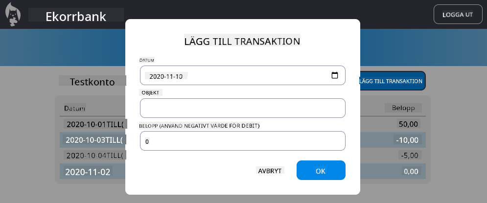

<!--
CO_OP_TRANSLATOR_METADATA:
{
  "original_hash": "50a7783473b39a2e0f133e271a102231",
  "translation_date": "2025-10-23T21:41:15+00:00",
  "source_file": "7-bank-project/4-state-management/assignment.md",
  "language_code": "sv"
}
-->
# Implementera dialogen "Lägg till transaktion"

## Översikt

Din bankapp har nu robust tillståndshantering och datalagring, men den saknar en viktig funktion som riktiga bankappar behöver: möjligheten för användare att lägga till egna transaktioner. I denna uppgift ska du implementera en komplett dialog för "Lägg till transaktion" som integreras smidigt med ditt befintliga system för tillståndshantering.

Denna uppgift sammanför allt du har lärt dig i de fyra banklektionerna: HTML-mallning, formulärhantering, API-integration och tillståndshantering.

## Lärandemål

Genom att slutföra denna uppgift kommer du att:
- **Skapa** ett användarvänligt dialoggränssnitt för datainmatning
- **Implementera** tillgänglig formulärdesign med stöd för tangentbord och skärmläsare
- **Integrera** nya funktioner med ditt befintliga system för tillståndshantering
- **Öva** på API-kommunikation och felhantering
- **Tillämpa** moderna webbtekniker på en verklig funktion

## Instruktioner

### Steg 1: Lägg till transaktionsknapp

**Skapa** en "Lägg till transaktion"-knapp på din instrumentpanel som användare enkelt kan hitta och använda.

**Krav:**
- **Placera** knappen på en logisk plats på instrumentpanelen
- **Använd** tydlig, handlingsorienterad knapptext
- **Styla** knappen så att den matchar din befintliga UI-design
- **Säkerställ** att knappen är tangentbordsanpassad

### Steg 2: Implementering av dialogen

Välj ett av dessa två tillvägagångssätt för att implementera din dialog:

**Alternativ A: Separat sida**
- **Skapa** en ny HTML-mall för transaktionsformuläret
- **Lägg till** en ny rutt i ditt routingsystem
- **Implementera** navigering till och från formulärsidan

**Alternativ B: Modal dialog (Rekommenderas)**
- **Använd** JavaScript för att visa/dölja dialogen utan att lämna instrumentpanelen
- **Implementera** med hjälp av [`hidden`-egenskapen](https://developer.mozilla.org/docs/Web/HTML/Global_attributes/hidden) eller CSS-klasser
- **Skapa** en smidig användarupplevelse med korrekt fokusstyrning

### Steg 3: Implementering av tillgänglighet

**Säkerställ** att din dialog uppfyller [tillgänglighetsstandarder för modala dialoger](https://developer.paciellogroup.com/blog/2018/06/the-current-state-of-modal-dialog-accessibility/):

**Tangentbordsnavigering:**
- **Stöd** Escape-tangenten för att stänga dialogen
- **Lås** fokus inom dialogen när den är öppen
- **Återställ** fokus till aktiveringsknappen när dialogen stängs

**Stöd för skärmläsare:**
- **Lägg till** lämpliga ARIA-etiketter och roller
- **Meddela** dialogens öppning/stängning till skärmläsare
- **Tillhandahåll** tydliga etiketter för formulärfält och felmeddelanden

### Steg 4: Skapa formuläret

**Designa** ett HTML-formulär som samlar in transaktionsdata:

**Obligatoriska fält:**
- **Datum**: När transaktionen ägde rum
- **Beskrivning**: Vad transaktionen avser
- **Belopp**: Transaktionsvärde (positivt för inkomster, negativt för utgifter)

**Formulärfunktioner:**
- **Validera** användarinmatning innan inskickning
- **Tillhandahåll** tydliga felmeddelanden för ogiltiga data
- **Inkludera** hjälpsam platshållartext och etiketter
- **Styla** konsekvent med din befintliga design

### Steg 5: API-integration

**Koppla** ditt formulär till backend-API:t:

**Implementeringssteg:**
- **Granska** [serverns API-specifikationer](../api/README.md) för rätt slutpunkt och dataformat
- **Skapa** JSON-data från dina formulärinmatningar
- **Skicka** data till API:t med lämplig felhantering
- **Visa** meddelanden om framgång/misslyckande för användaren
- **Hantera** nätverksfel på ett smidigt sätt

### Steg 6: Integration med tillståndshantering

**Uppdatera** din instrumentpanel med den nya transaktionen:

**Integrationskrav:**
- **Uppdatera** kontodata efter en lyckad transaktion
- **Uppdatera** instrumentpanelens visning utan att kräva en sidomladdning
- **Säkerställ** att den nya transaktionen visas omedelbart
- **Bibehåll** korrekt tillståndskonsistens under hela processen

## Tekniska specifikationer

**Detaljer om API-slutpunkt:**
Se [serverns API-dokumentation](../api/README.md) för:
- Krävt JSON-format för transaktionsdata
- HTTP-metod och slutpunktens URL
- Förväntat svarformat
- Hantering av felmeddelanden

**Förväntat resultat:**
Efter att ha slutfört denna uppgift ska din bankapp ha en fullt fungerande funktion för "Lägg till transaktion" som ser professionell ut och fungerar smidigt:

## Testa din implementering

**Funktionstestning:**
1. **Verifiera** att knappen "Lägg till transaktion" är tydligt synlig och tillgänglig
2. **Testa** att dialogen öppnas och stängs korrekt
3. **Bekräfta** att formulärvalidering fungerar för alla obligatoriska fält
4. **Kontrollera** att lyckade transaktioner visas omedelbart på instrumentpanelen
5. **Säkerställ** att felhantering fungerar för ogiltiga data och nätverksproblem

**Tillgänglighetstestning:**
1. **Navigera** genom hela flödet med endast tangentbordet
2. **Testa** med en skärmläsare för att säkerställa korrekta meddelanden
3. **Verifiera** att fokusstyrning fungerar korrekt
4. **Kontrollera** att alla formulärelement har lämpliga etiketter

## Utvärderingskriterier

| Kriterier | Exemplariskt | Tillräckligt | Behöver förbättras |
| --------- | ------------ | ------------ | ------------------ |
| **Funktionalitet** | Funktionen för att lägga till transaktioner fungerar felfritt med utmärkt användarupplevelse och följer alla bästa praxis från lektionerna | Funktionen för att lägga till transaktioner fungerar korrekt men kanske inte följer vissa bästa praxis eller har mindre användbarhetsproblem | Funktionen för att lägga till transaktioner fungerar delvis eller har betydande användbarhetsproblem |
| **Kodkvalitet** | Koden är välorganiserad, följer etablerade mönster, inkluderar korrekt felhantering och integreras smidigt med befintlig tillståndshantering | Koden fungerar men kan ha vissa organisationsproblem eller inkonsekventa mönster med den befintliga kodbasen | Koden har betydande strukturella problem eller integreras inte väl med befintliga mönster |
| **Tillgänglighet** | Fullt stöd för tangentbordsnavigering, kompatibilitet med skärmläsare och följer WCAG-riktlinjer med utmärkt fokusstyrning | Grundläggande tillgänglighetsfunktioner implementerade men kan sakna vissa tangentbordsnavigerings- eller skärmläsarfunktioner | Begränsade eller inga tillgänglighetshänsyn implementerade |
| **Användarupplevelse** | Intuitivt, polerat gränssnitt med tydlig feedback, smidiga interaktioner och professionellt utseende | Bra användarupplevelse med mindre förbättringsområden i feedback eller visuell design | Dålig användarupplevelse med förvirrande gränssnitt eller brist på användarfeedback |

## Ytterligare utmaningar (Valfritt)

När du har slutfört de grundläggande kraven, överväg dessa förbättringar:

**Förbättrade funktioner:**
- **Lägg till** transaktionskategorier (mat, transport, underhållning, etc.)
- **Implementera** inmatningsvalidering med realtidsfeedback
- **Skapa** tangentbordskortkommandon för avancerade användare
- **Lägg till** funktioner för att redigera och ta bort transaktioner

**Avancerad integration:**
- **Implementera** ångra-funktion för nyligen tillagda transaktioner
- **Lägg till** bulkimport av transaktioner från CSV-filer
- **Skapa** sök- och filtreringsfunktioner för transaktioner
- **Implementera** funktion för dataexport

Dessa valfria funktioner hjälper dig att öva på mer avancerade webbtekniker och skapa en mer komplett bankapplikation!

---

**Ansvarsfriskrivning**:  
Detta dokument har översatts med hjälp av AI-översättningstjänsten [Co-op Translator](https://github.com/Azure/co-op-translator). Även om vi strävar efter noggrannhet, bör det noteras att automatiserade översättningar kan innehålla fel eller felaktigheter. Det ursprungliga dokumentet på dess ursprungliga språk bör betraktas som den auktoritativa källan. För kritisk information rekommenderas professionell mänsklig översättning. Vi ansvarar inte för eventuella missförstånd eller feltolkningar som uppstår vid användning av denna översättning.