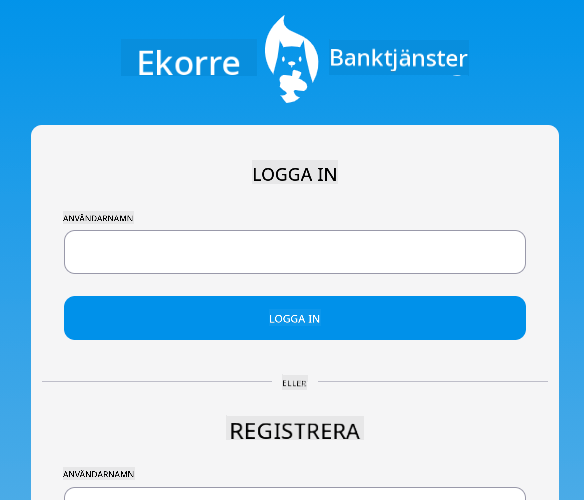

<!--
CO_OP_TRANSLATOR_METADATA:
{
  "original_hash": "830359535306594b448db6575ce5cdee",
  "translation_date": "2025-08-26T22:51:52+00:00",
  "source_file": "7-bank-project/README.md",
  "language_code": "sv"
}
-->
# :dollar: Bygg en Bank

I det här projektet kommer du att lära dig hur man bygger en fiktiv bank. Dessa lektioner innehåller instruktioner om hur man utformar en webbapp och skapar rutter, bygger formulär, hanterar tillstånd och hämtar data från ett API som tillhandahåller bankens data.

|  |  |
|--------------------------------|--------------------------------|

## Lektioner

1. [HTML-mallar och rutter i en webbapp](1-template-route/README.md)
2. [Bygg ett inloggnings- och registreringsformulär](2-forms/README.md)
3. [Metoder för att hämta och använda data](3-data/README.md)
4. [Koncept för tillståndshantering](4-state-management/README.md)

### Tack till

Dessa lektioner skrevs med :hearts: av [Yohan Lasorsa](https://twitter.com/sinedied).

Om du är intresserad av att lära dig hur man bygger [server-API:t](/7-bank-project/api/README.md) som används i dessa lektioner, kan du följa [denna videoserie](https://aka.ms/NodeBeginner) (särskilt videor 17 till 21).

Du kan också ta en titt på [denna interaktiva Learn-handledning](https://aka.ms/learn/express-api).

---

**Ansvarsfriskrivning**:  
Detta dokument har översatts med hjälp av AI-översättningstjänsten [Co-op Translator](https://github.com/Azure/co-op-translator). Även om vi strävar efter noggrannhet, bör du vara medveten om att automatiserade översättningar kan innehålla fel eller felaktigheter. Det ursprungliga dokumentet på dess originalspråk bör betraktas som den auktoritativa källan. För kritisk information rekommenderas professionell mänsklig översättning. Vi ansvarar inte för eventuella missförstånd eller feltolkningar som uppstår vid användning av denna översättning.