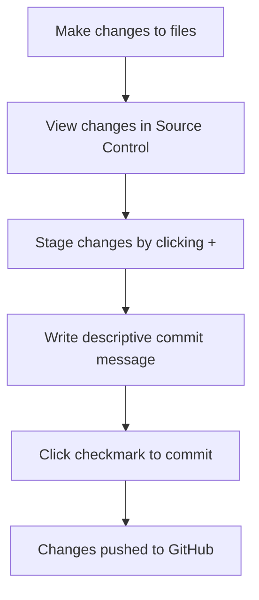

<!--
CO_OP_TRANSLATOR_METADATA:
{
  "original_hash": "cfd4a15974168ca426d50c67682ab9d4",
  "translation_date": "2025-10-23T21:28:37+00:00",
  "source_file": "8-code-editor/1-using-a-code-editor/README.md",
  "language_code": "sv"
}
-->
# Använda en kodredigerare: Mästra VSCode.dev

Minns du i *The Matrix* när Neo behövde koppla in sig till en massiv datorterminal för att komma åt den digitala världen? Dagens verktyg för webbutveckling är raka motsatsen – otroligt kraftfulla funktioner som är tillgängliga var som helst. VSCode.dev är en webbaserad kodredigerare som ger professionella utvecklingsverktyg till vilken enhet som helst med internetanslutning.

Precis som tryckpressen gjorde böcker tillgängliga för alla, inte bara munkar i kloster, demokratiserar VSCode.dev kodning. Du kan arbeta med projekt från en biblioteksdator, ett skolaboratorium eller var som helst där du har tillgång till en webbläsare. Ingen installation, inga begränsningar som "jag behöver min specifika uppsättning".

I slutet av denna lektion kommer du att förstå hur du navigerar i VSCode.dev, öppnar GitHub-repositorier direkt i din webbläsare och använder Git för versionskontroll – färdigheter som professionella utvecklare förlitar sig på dagligen.

## Vad du kommer att lära dig

Efter att vi gått igenom detta tillsammans kommer du att kunna:

- Navigera i VSCode.dev som om det vore ditt andra hem – hitta allt du behöver utan att gå vilse
- Öppna vilket GitHub-repository som helst i din webbläsare och börja redigera direkt (det här är ganska magiskt!)
- Använda Git för att spåra dina ändringar och spara dina framsteg som ett proffs
- Förbättra din redigerare med tillägg som gör kodning snabbare och roligare
- Skapa och organisera projektfiler med självförtroende

## Vad du behöver

Kravet är enkelt:

- Ett gratis [GitHub-konto](https://github.com) (vi guidar dig genom att skapa ett om det behövs)
- Grundläggande kunskaper om webbläsare
- Lektionen GitHub Basics ger användbar bakgrund, även om den inte är nödvändig

> 💡 **Ny på GitHub?** Att skapa ett konto är gratis och tar bara några minuter. Precis som ett bibliotekskort ger dig tillgång till böcker världen över, öppnar ett GitHub-konto dörrar till kodrepositorier över hela internet.

## Varför webbaserade kodredigerare är viktiga

Före internet kunde forskare vid olika universitet inte enkelt dela forskning. Sedan kom ARPANET på 1960-talet, som kopplade samman datorer över avstånd. Webbaserade kodredigerare följer samma princip – att göra kraftfulla verktyg tillgängliga oavsett din fysiska plats eller enhet.

En kodredigerare fungerar som din utvecklingsarbetsplats, där du skriver, redigerar och organiserar kodfiler. Till skillnad från enkla textredigerare erbjuder professionella kodredigerare syntaxmarkering, felupptäckt och projektledningsfunktioner.

VSCode.dev tar dessa funktioner till din webbläsare:

**Fördelar med webbaserad redigering:**

| Funktion | Beskrivning | Praktisk nytta |
|----------|-------------|----------------|
| **Plattformsoberoende** | Körs på vilken enhet som helst med en webbläsare | Arbeta sömlöst från olika datorer |
| **Ingen installation krävs** | Tillgång via en webbadress | Undvik begränsningar för programvaruinstallation |
| **Automatiska uppdateringar** | Kör alltid den senaste versionen | Få tillgång till nya funktioner utan manuella uppdateringar |
| **Repository-integration** | Direkt anslutning till GitHub | Redigera kod utan lokal filhantering |

**Praktiska konsekvenser:**
- Arbetskontinuitet över olika miljöer
- Konsistent gränssnitt oavsett operativsystem
- Omedelbara samarbetsmöjligheter
- Minskade krav på lokal lagring

## Utforska VSCode.dev

Precis som Marie Curies laboratorium innehöll sofistikerad utrustning i ett relativt enkelt utrymme, packar VSCode.dev professionella utvecklingsverktyg i ett webbläsargränssnitt. Denna webbapplikation erbjuder samma kärnfunktionalitet som stationära kodredigerare.

Börja med att navigera till [vscode.dev](https://vscode.dev) i din webbläsare. Gränssnittet laddas utan nedladdningar eller systeminstallationer – en direkt tillämpning av principerna för molnbaserad databehandling.

### Koppla ditt GitHub-konto

Precis som Alexander Graham Bells telefon kopplade samman avlägsna platser, skapar kopplingen till ditt GitHub-konto en bro mellan VSCode.dev och dina kodrepositorier. När du uppmanas att logga in med GitHub rekommenderas det att acceptera denna anslutning.

**GitHub-integrationen ger:**
- Direkt åtkomst till dina repositorier inom redigeraren
- Synkroniserade inställningar och tillägg över enheter
- Strömlinjeformad sparningsprocess till GitHub
- Personligt anpassad utvecklingsmiljö

### Lär känna din nya arbetsyta

När allt har laddats ser du en vackert ren arbetsyta som är designad för att hålla dig fokuserad på det som är viktigt – din kod!

**Här är din rundtur i grannskapet:**
- **Aktivitetsfältet** (den remsan till vänster): Din huvudsakliga navigering med Explorer 📁, Sök 🔍, Versionskontroll 🌿, Tillägg 🧩 och Inställningar ⚙️
- **Sidofältet** (panelen bredvid): Ändras för att visa relevant information baserat på vad du har valt
- **Redigeringsområdet** (det stora utrymmet i mitten): Här händer magin – din huvudsakliga kodningsyta

**Ta en stund att utforska:**
- Klicka runt på ikonerna i aktivitetsfältet och se vad var och en gör
- Lägg märke till hur sidofältet uppdateras för att visa olika information – ganska häftigt, eller hur?
- Utforskaren (📁) är förmodligen där du kommer att tillbringa mest tid, så bli bekväm med den

## Öppna GitHub-repositorier

Före internet var forskare tvungna att fysiskt resa till bibliotek för att få tillgång till dokument. GitHub-repositorier fungerar på liknande sätt – de är samlingar av kod som lagras på distans. VSCode.dev eliminerar det traditionella steget att ladda ner repositorier till din lokala dator innan du redigerar.

Denna funktion möjliggör omedelbar åtkomst till alla offentliga repositorier för visning, redigering eller bidrag. Här är två metoder för att öppna repositorier:

### Metod 1: Den enkla vägen

Detta är perfekt när du börjar från början i VSCode.dev och vill öppna ett specifikt repository. Det är enkelt och nybörjarvänligt:

**Så här gör du:**

1. Gå till [vscode.dev](https://vscode.dev) om du inte redan är där
2. Leta efter knappen "Open Remote Repository" på välkomstskärmen och klicka på den

   

3. Klistra in en GitHub-repository-URL (prova denna: `https://github.com/microsoft/Web-Dev-For-Beginners`)
4. Tryck på Enter och se magin hända!

**Proffstips - Snabbkommandot för kommandopaletten:**

Vill du känna dig som en kodningsmästare? Prova detta tangentbordsgenväg: Ctrl+Shift+P (eller Cmd+Shift+P på Mac) för att öppna kommandopaletten:

**Kommandopaletten är som en sökmotor för allt du kan göra:**
- Skriv "open remote" så hittar den repository-öppnaren åt dig
- Den kommer ihåg repositorier du har öppnat nyligen (superpraktiskt!)
- När du väl har vant dig vid den kommer du att känna dig som om du kodar i blixtens hastighet
- Det är i princip VSCode.devs version av "Hej Siri, men för kodning"

### Metod 2: URL-modifikationsteknik

Precis som HTTP och HTTPS använder olika protokoll medan de behåller samma domänstruktur, använder VSCode.dev ett URL-mönster som speglar GitHubs adresseringssystem. Alla GitHub-repository-URL:er kan modifieras för att öppnas direkt i VSCode.dev.

**URL-transformationsmönster:**

| Typ av repository | GitHub-URL | VSCode.dev-URL |
|-------------------|------------|----------------|
| **Offentligt repository** | `github.com/microsoft/Web-Dev-For-Beginners` | `vscode.dev/github/microsoft/Web-Dev-For-Beginners` |
| **Personligt projekt** | `github.com/ditt-användarnamn/mitt-projekt` | `vscode.dev/github/ditt-användarnamn/mitt-projekt` |
| **Vilket tillgängligt repo som helst** | `github.com/deras-användarnamn/fantastiskt-repo` | `vscode.dev/github/deras-användarnamn/fantastiskt-repo` |

**Implementering:**
- Ersätt `github.com` med `vscode.dev/github`
- Behåll alla andra URL-komponenter oförändrade
- Fungerar med alla offentligt tillgängliga repositorier
- Ger omedelbar åtkomst för redigering

> 💡 **Livsförändrande tips**: Bokmärk VSCode.dev-versionerna av dina favorit-repositorier. Jag har bokmärken som "Redigera min portfolio" och "Fix dokumentation" som tar mig direkt till redigeringsläget!

**Vilken metod ska du använda?**
- **Gränssnittsvägen**: Perfekt när du utforskar eller inte kan komma ihåg exakta repository-namn
- **URL-tricket**: Perfekt för blixtsnabb åtkomst när du vet exakt vart du ska

## Arbeta med filer och projekt

Nu när du har öppnat ett repository, låt oss börja bygga! VSCode.dev ger dig allt du behöver för att skapa, redigera och organisera dina kodfiler. Tänk på det som din digitala verkstad – varje verktyg finns precis där du behöver det.

Låt oss dyka in i de vardagliga uppgifterna som kommer att utgöra större delen av din kodningsarbetsflöde.

### Skapa nya filer

Precis som att organisera ritningar på en arkitekts kontor följer filskapande i VSCode.dev en strukturerad metod. Systemet stöder alla standardfiltyper för webbutveckling.

**Process för att skapa filer:**

1. Navigera till målmappen i utforskaren i sidofältet
2. Håll muspekaren över mappnamnet för att visa ikonen "Ny fil" (📄+)
3. Ange filnamnet inklusive lämplig filändelse (`style.css`, `script.js`, `index.html`)
4. Tryck på Enter för att skapa filen

**Namngivningskonventioner:**
- Använd beskrivande namn som indikerar filens syfte
- Inkludera filändelser för korrekt syntaxmarkering
- Följ konsekventa namngivningsmönster genom hela projektet
- Använd små bokstäver och bindestreck istället för mellanslag

### Redigera och spara filer

Här börjar det roliga! VSCode.devs redigerare är fullpackad med hjälpsamma funktioner som gör kodning smidig och intuitiv. Det är som att ha en riktigt smart skrivassistent, fast för kod.

**Ditt redigeringsarbetsflöde:**

1. Klicka på vilken fil som helst i utforskaren för att öppna den i huvudområdet
2. Börja skriva och se hur VSCode.dev hjälper dig med färger, förslag och felupptäckt
3. Spara ditt arbete med Ctrl+S (Windows/Linux) eller Cmd+S (Mac) – även om det också sparas automatiskt!

**Det coola som händer medan du kodar:**
- Din kod får vackert färgkodade markeringar så att den blir lätt att läsa
- VSCode.dev föreslår kompletteringar medan du skriver (som autokorrigering, men mycket smartare)
- Den fångar stavfel och fel innan du ens sparar
- Du kan ha flera filer öppna i flikar, precis som i en webbläsare
- Allt sparas automatiskt i bakgrunden

> ⚠️ **Snabbtips**: Även om autosparning är till hjälp, är det fortfarande en bra vana att trycka på Ctrl+S eller Cmd+S. Det sparar allt direkt och aktiverar några extra hjälpsamma funktioner som felkontroll.

### Versionskontroll med Git

Precis som arkeologer skapar detaljerade register över utgrävningslager, spårar Git ändringar i din kod över tid. Detta system bevarar projektets historia och gör det möjligt att återgå till tidigare versioner vid behov. VSCode.dev inkluderar integrerad Git-funktionalitet.

**Gränssnitt för versionskontroll:**

1. Gå till panelen för versionskontroll via 🌿-ikonen i aktivitetsfältet
2. Modifierade filer visas i avsnittet "Changes"
3. Färgkodning indikerar typ av ändringar: grönt för tillägg, rött för borttagningar

**Spara ditt arbete (commit-arbetsflöde):**

**Här är din steg-för-steg-process:**
- Klicka på "+"-ikonen bredvid filer du vill spara (detta "stager" dem)
- Dubbelkolla att du är nöjd med alla dina stagerade ändringar
- Skriv en kort anteckning som förklarar vad du gjorde (detta är ditt "commit-meddelande")
- Klicka på bockikonen för att spara allt till GitHub
- Om du ångrar dig om något kan du använda ångra-ikonen för att ta bort ändringar

**Skriva bra commit-meddelanden (det är lättare än du tror!):**
- Beskriv bara vad du gjorde, som "Lägg till kontaktformulär" eller "Fixa trasig navigering"
- Håll det kort och koncist – tänk tweetlängd, inte uppsats
- Börja med aktiva ord som "Lägg till", "Fixa", "Uppdatera" eller "Ta bort"
- **Bra exempel**: "Lägg till responsiv navigeringsmeny", "Fixa problem med mobil layout", "Uppdatera färger för bättre tillgänglighet"

> 💡 **Snabbnavigeringstips**: Använd hamburgermenyn (☰) längst upp till vänster för att hoppa tillbaka till ditt GitHub-repository och se dina commit-ändringar online. Det är som en portal mellan din redigeringsmiljö och ditt projekts hem på GitHub!

## Förbättra funktionaliteten med tillägg

Precis som en hantverkares verkstad innehåller specialverktyg för olika uppgifter, kan VSCode.dev anpassas med tillägg som lägger till specifika funktioner. Dessa community-utvecklade plugins löser vanliga utvecklingsbehov som kodformatering, liveförhandsgranskning och förbättrad Git-integration.

Marknadsplatsen för tillägg innehåller tusentals gratisverktyg skapade av utvecklare världen över. Varje tillägg löser specifika arbetsflödesutmaningar, vilket gör det möjligt för dig att bygga en personlig utvecklingsmiljö som passar dina specifika behov och preferenser.

### Hitta dina perfekta tillägg

Marknadsplatsen för tillägg är riktigt välorganiserad, så du kommer inte att gå vilse när du letar efter vad du behöver. Den är designad för att hjälpa dig att upptäcka både specifika verktyg och coola saker du inte ens visste att du behövde!

**Komma till marknadsplatsen:**

1. Klicka på ikonen för tillägg (🧩) i aktivitetsfältet
2. Bläddra runt eller sök efter något specifikt
3. Klicka på något som ser intressant ut för att lära dig mer om det

**Vad du kommer att se där:**

| Sektion | Vad som finns | Varför det är hjälpsamt |
|---------|---------------|-------------------------|
| **Installerade** | Tillägg du redan har lagt till | Din personliga kodningsverktygslåda |
| **Populära** | Favoriter bland användare | Vad de flesta utvecklare rekommenderar |
| **Rekommenderade** | Smarta förslag för ditt projekt | VSCode.devs hjälpsamma rekommendationer |

**Vad som gör det enkelt att bläddra:**
- Varje tillägg visar betyg, antal nedladdningar och recensioner från riktiga användare
- Du får skärmdumpar och tydliga beskrivningar av vad varje tillägg gör
- Allt är tydligt markerat med kompatibilitetsinformation
- Liknande tillägg föreslås så att du kan jämföra alternativ

### Installera tillägg (Det är superenkelt!)

Att lägga till nya funktioner i din editor är lika enkelt som att klicka på en knapp. Tillägg installeras på några sekunder och börjar fungera direkt – inga omstarter, ingen väntan.

**Så här gör du:**

1. Sök efter det du vill ha (prova att söka på "live server" eller "prettier")
2. Klicka på ett som ser bra ut för att se mer information
3. Läs igenom vad det gör och kolla betygen
4. Klicka på den blå "Installera"-knappen och du är klar!

**Vad händer bakom kulisserna:**
- Tillägget laddas ner och konfigureras automatiskt
- Nya funktioner dyker upp i ditt gränssnitt direkt
- Allt börjar fungera omedelbart (seriöst, det går så snabbt!)
- Om du är inloggad synkroniseras tillägget till alla dina enheter

**Några tillägg jag rekommenderar att börja med:**
- **Live Server**: Se din webbplats uppdateras i realtid medan du kodar (den här är magisk!)
- **Prettier**: Gör din kod snygg och professionell automatiskt
- **Auto Rename Tag**: Ändra en HTML-tagg och dess partner uppdateras också
- **Bracket Pair Colorizer**: Färglägger dina parenteser så att du aldrig tappar bort dig
- **GitLens**: Förbättrar dina Git-funktioner med massor av användbar information

### Anpassa dina tillägg

De flesta tillägg har inställningar som du kan justera för att få dem att fungera precis som du vill. Tänk på det som att justera sätet och speglarna i en bil – alla har sina egna preferenser!

**Justera tilläggsinställningar:**

1. Hitta ditt installerade tillägg i tilläggspanelen
2. Leta efter den lilla kugghjulsikonen (⚙️) bredvid dess namn och klicka på den
3. Välj "Tilläggsinställningar" från rullgardinsmenyn
4. Justera inställningarna tills de passar perfekt för ditt arbetsflöde

**Vanliga saker du kanske vill justera:**
- Hur din kod formateras (tabbar vs mellanslag, radlängd, etc.)
- Vilka kortkommandon som triggar olika åtgärder
- Vilka filtyper tillägget ska fungera med
- Slå på eller av specifika funktioner för att hålla det enkelt

### Håll dina tillägg organiserade

När du upptäcker fler coola tillägg vill du hålla din samling snygg och fungerande smidigt. VSCode.dev gör det väldigt enkelt att hantera detta.

**Dina alternativ för att hantera tillägg:**

| Vad du kan göra | När det är användbart | Tips |
|--------|---------|----------|
| **Inaktivera** | Testa om ett tillägg orsakar problem | Bättre än att avinstallera om du kanske vill ha tillbaka det |
| **Avinstallera** | Ta bort tillägg du inte behöver helt | Håller din miljö ren och snabb |
| **Uppdatera** | Få de senaste funktionerna och buggfixarna | Sker vanligtvis automatiskt, men värt att kolla |

**Hur jag gillar att hantera tillägg:**
- Varje kvartal går jag igenom vad jag har installerat och tar bort allt jag inte använder
- Jag håller tilläggen uppdaterade för att få de senaste förbättringarna och säkerhetsfixarna
- Om något verkar långsamt inaktiverar jag tillfälligt tillägg för att se om något av dem är orsaken
- Jag läser uppdateringsanteckningarna när tillägg får stora uppdateringar – ibland finns det coola nya funktioner!

> ⚠️ **Prestandatips**: Tillägg är fantastiska, men att ha för många kan göra saker långsammare. Fokusera på de som verkligen gör ditt liv enklare och var inte rädd för att avinstallera de du aldrig använder.

## GitHub Copilot Agent Challenge 🚀

Precis som den strukturerade metod som NASA använder för rymduppdrag, innebär denna utmaning systematisk tillämpning av VSCode.dev-färdigheter i ett komplett arbetsflöde.

**Mål:** Visa din skicklighet med VSCode.dev genom att etablera ett omfattande arbetsflöde för webbutveckling.

**Projektkrav:** Med hjälp av Agent-läget, slutför dessa uppgifter:
1. Forka ett befintligt repository eller skapa ett nytt
2. Skapa en fungerande projektstruktur med HTML-, CSS- och JavaScript-filer
3. Installera och konfigurera tre tillägg som förbättrar utvecklingen
4. Öva på versionskontroll med beskrivande commit-meddelanden
5. Experimentera med att skapa och ändra feature branches
6. Dokumentera processen och lärdomarna i en README.md-fil

Denna övning sammanfattar alla VSCode.dev-koncept i ett praktiskt arbetsflöde som kan tillämpas på framtida utvecklingsprojekt.

Läs mer om [agent mode](https://code.visualstudio.com/blogs/2025/02/24/introducing-copilot-agent-mode) här.

## Uppgift

Dags att testa dessa färdigheter på riktigt! Jag har ett praktiskt projekt som låter dig öva på allt vi har gått igenom: [Skapa en CV-webbplats med VSCode.dev](./assignment.md)

Denna uppgift guidar dig genom att bygga en professionell CV-webbplats helt i din webbläsare. Du kommer att använda alla VSCode.dev-funktioner vi har utforskat, och i slutet kommer du att ha både en snygg webbplats och solid självsäkerhet i ditt nya arbetsflöde.

## Fortsätt utforska och utveckla dina färdigheter

Du har nu en solid grund, men det finns så mycket mer coolt att upptäcka! Här är några resurser och idéer för att ta dina VSCode.dev-färdigheter till nästa nivå:

**Officiella dokument värda att bokmärka:**
- [VSCode Web Documentation](https://code.visualstudio.com/docs/editor/vscode-web?WT.mc_id=academic-0000-alfredodeza) – Den kompletta guiden till webbaserad redigering
- [GitHub Codespaces](https://docs.github.com/en/codespaces) – För när du vill ha ännu mer kraft i molnet

**Coola funktioner att experimentera med härnäst:**
- **Kortkommandon**: Lär dig tangentkombinationerna som får dig att känna dig som en kodningsninja
- **Arbetsmiljöinställningar**: Ställ in olika miljöer för olika typer av projekt
- **Multi-root Workspaces**: Arbeta med flera repositories samtidigt (superpraktiskt!)
- **Terminalintegration**: Få tillgång till kommandoradsverktyg direkt i din webbläsare

**Idéer för att öva:**
- Hoppa in i några open source-projekt och bidra med hjälp av VSCode.dev – det är ett bra sätt att ge tillbaka!
- Testa olika tillägg för att hitta din perfekta uppsättning
- Skapa projektmallar för de typer av webbplatser du bygger oftast
- Öva på Git-arbetsflöden som att skapa och slå ihop branches – dessa färdigheter är guld värda i teamprojekt

---

**Du har bemästrat webbaserad utveckling!** 🎉 Precis som uppfinningen av portabla instrument gjorde det möjligt för forskare att bedriva forskning på avlägsna platser, gör VSCode.dev det möjligt att koda professionellt från vilken internetansluten enhet som helst.

Dessa färdigheter speglar aktuella branschpraxis – många professionella utvecklare använder molnbaserade utvecklingsmiljöer för deras flexibilitet och tillgänglighet. Du har lärt dig ett arbetsflöde som skalar från individuella projekt till stora teamprojekt.

Använd dessa tekniker i ditt nästa utvecklingsprojekt! 🚀

---

**Ansvarsfriskrivning**:  
Detta dokument har översatts med hjälp av AI-översättningstjänsten [Co-op Translator](https://github.com/Azure/co-op-translator). Även om vi strävar efter noggrannhet, bör det noteras att automatiserade översättningar kan innehålla fel eller felaktigheter. Det ursprungliga dokumentet på dess ursprungliga språk bör betraktas som den auktoritativa källan. För kritisk information rekommenderas professionell mänsklig översättning. Vi ansvarar inte för eventuella missförstånd eller feltolkningar som uppstår vid användning av denna översättning.