<!--
CO_OP_TRANSLATOR_METADATA:
{
  "original_hash": "a9a3bcc037a447e2d8994d99e871cd9f",
  "translation_date": "2026-01-06T22:45:06+00:00",
  "source_file": "8-code-editor/1-using-a-code-editor/README.md",
  "language_code": "sv"
}
-->
# Använda en kodredigerare: Bemästra VSCode.dev

Kom ihåg i *The Matrix* när Neo var tvungen att koppla in sig i en massiv datorterminal för att komma åt den digitala världen? Dagens webbverktyg är motsatsen – otroligt kraftfulla möjligheter tillgängliga från var som helst. VSCode.dev är en webbläsarbaserad kodredigerare som tar professionella utvecklingsverktyg till vilken enhet som helst med en internetuppkoppling.

Precis som boktryckarkonsten gjorde böcker tillgängliga för alla, inte bara skrivare i kloster, demokratiserar VSCode.dev kodandet. Du kan arbeta på projekt från ett bibliotek, en skol-labb eller var som helst du har webbläsaråtkomst. Inga installationer, inga "Jag behöver min specifika setup"-begränsningar.

I slutet av denna lektion kommer du att förstå hur du navigerar i VSCode.dev, öppnar GitHub-repositorier direkt i din webbläsare och använder Git för versionshantering – alla färdigheter som professionella utvecklare förlitar sig på varje dag.

## ⚡ Vad du kan göra på de nästa 5 minuterna

**Snabbstartsväg för upptagna utvecklare**

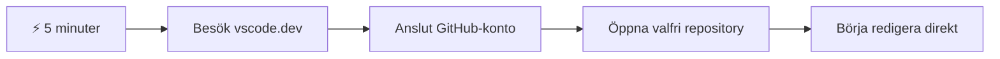
- **Minut 1**: Navigera till [vscode.dev](https://vscode.dev) - ingen installation behövs
- **Minut 2**: Logga in med GitHub för att koppla dina repositorier
- **Minut 3**: Prova URL-tricket: byt ut `github.com` till `vscode.dev/github` i vilken repo-URL som helst
- **Minut 4**: Skapa en ny fil och se hur syntaxmarkering fungerar automatiskt
- **Minut 5**: Gör en ändring och committa den via panelen Källkodshantering

**Snabb test-URL**:
```
# Transform this:
github.com/microsoft/Web-Dev-For-Beginners

# Into this:
vscode.dev/github/microsoft/Web-Dev-For-Beginners
```

**Varför det här är viktigt**: På 5 minuter kommer du att uppleva friheten att kunna koda var som helst med professionella verktyg. Detta representerar framtidens utveckling – tillgänglig, kraftfull och omedelbar.

## 🗺️ Din läranderesa genom molnbaserad utveckling

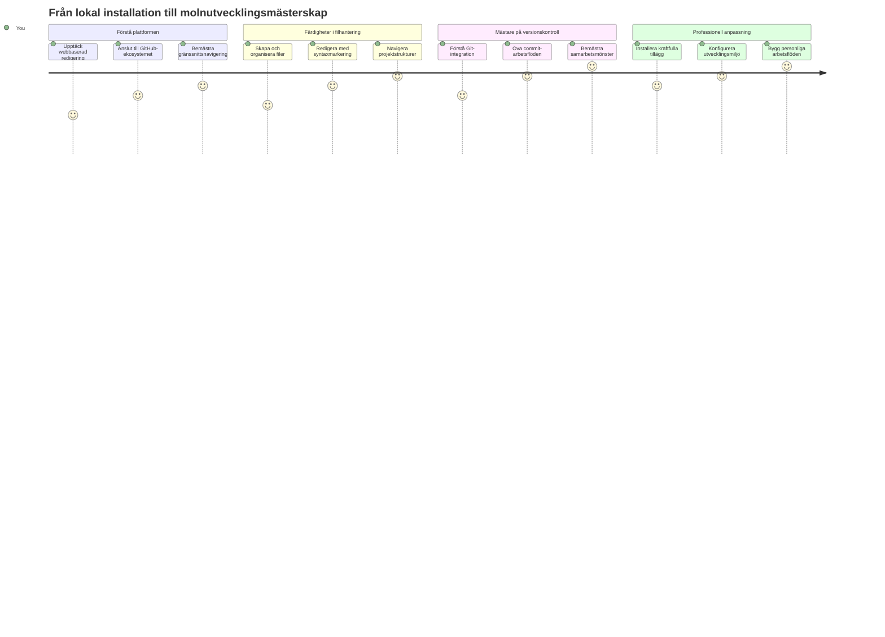
**Din resmål**: I slutet av denna lektion har du bemästrat en professionell molnutvecklingsmiljö som fungerar från vilken enhet som helst, vilket gör att du kan koda med samma verktyg som utvecklare på stora teknikföretag använder.

## Vad du kommer att lära dig

Efter att vi gått igenom detta tillsammans kommer du att kunna:

- Navigera VSCode.dev som om det vore ditt andra hem – hitta allt du behöver utan att gå vilse
- Öppna vilket GitHub-repositorium som helst i webbläsaren och börja redigera direkt (det här är ganska magiskt!)
- Använda Git för att spåra dina ändringar och spara ditt arbete som ett proffs
- Snabbladda din editor med tillägg som gör kodandet snabbare och roligare
- Skapa och organisera projektfiler med självförtroende

## Vad du behöver

Kravbilden är enkel:

- Ett gratis [GitHub-konto](https://github.com) (vi guidar dig genom skapandet om det behövs)
- Grundläggande bekantskap med webbläsare
- Lektionen GitHub Basics ger hjälpsamt bakgrundskunskap, men är inte obligatorisk

> 💡 **Ny på GitHub?** Att skapa ett konto är gratis och tar bara några minuter. Precis som ett bibliotekskort ger dig tillgång till böcker världen över, öppnar ett GitHub-konto dörrar till kodrepositorier över hela internet.

## 🧠 Översikt av molnutvecklings-ekosystemet

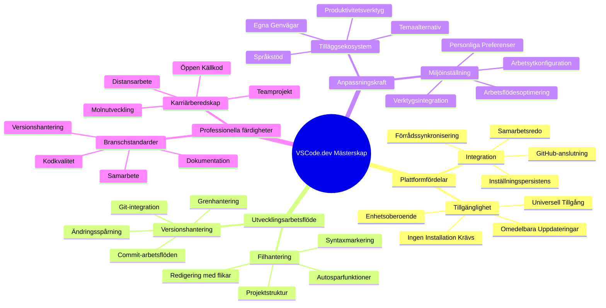
**Kärnprincip**: Molnbaserade utvecklingsmiljöer representerar framtiden för kodning – de erbjuder professionella verktyg som är tillgängliga, samarbetsvänliga och plattformsoberoende.

## Varför webbaserade kodredigerare är viktiga

Innan internet fanns kunde forskare på olika universitet inte enkelt dela forskning. Sedan kom ARPANET på 1960-talet som kopplade samman datorer över avstånd. Webbaserade kodredigerare följer samma princip – att göra kraftfulla verktyg tillgängliga oavsett var du befinner dig eller vilken enhet du använder.

En kodredigerare fungerar som din utvecklingsarbetsplats, där du skriver, redigerar och organiserar kodfiler. Till skillnad från enkla textredigerare erbjuder professionella kodredigerare syntaxmarkering, felupptäckt och projektledningsfunktioner.

VSCode.dev tar dessa funktioner till din webbläsare:

**Fördelar med webbaserad redigering:**

| Funktion | Beskrivning | Praktisk nytta |
|---------|-------------|----------|
| **Plattformsoberoende** | Körs på vilken enhet som helst med webbläsare | Arbeta från olika datorer sömlöst |
| **Ingen installation krävs** | Åtkomst via en webbadress | Hoppa över begränsningar för installation av mjukvara |
| **Automatiska uppdateringar** | Kör alltid senaste versionen | Få tillgång till nya funktioner utan manuella uppdateringar |
| **Repositoryintegration** | Direkt koppling till GitHub | Redigera kod utan lokal filhantering |

**Praktiska konsekvenser:**
- Arbetskontinuitet mellan olika miljöer
- Enhetligt gränssnitt oavsett operativsystem
- Omedelbar samarbetsförmåga
- Minskade krav på lokal lagring

## Utforska VSCode.dev

Precis som Marie Curies laboratorium hade avancerad utrustning i en relativt enkel miljö, packar VSCode.dev professionella utvecklingsverktyg i ett webbläsargränssnitt. Den här webbapplikationen erbjuder samma kärnfunktionalitet som stationära kodredigerare.

Börja med att gå till [vscode.dev](https://vscode.dev) i din webbläsare. Gränssnittet laddas utan nedladdningar eller systeminstallationer – en direkt tillämpning av molndatorprinciper.

### Koppla ditt GitHub-konto

Precis som Alexander Graham Bells telefon kopplade samman avlägsna platser, kopplar du ditt GitHub-konto VSCode.dev till dina kodrepositorier. När du uppmanas att logga in med GitHub rekommenderas det att acceptera denna koppling.

**GitHub-integration ger:**
- Direkt åtkomst till dina repositorier i editorn
- Synkroniserade inställningar och tillägg över enheter
- Smidigt sparflöde till GitHub
- Personlig utvecklingsmiljö

### Lär känna din nya arbetsyta

När allt har laddats ser du en vackert ren arbetsyta som är designad för att hålla dig fokuserad på det som är viktigt – din kod!

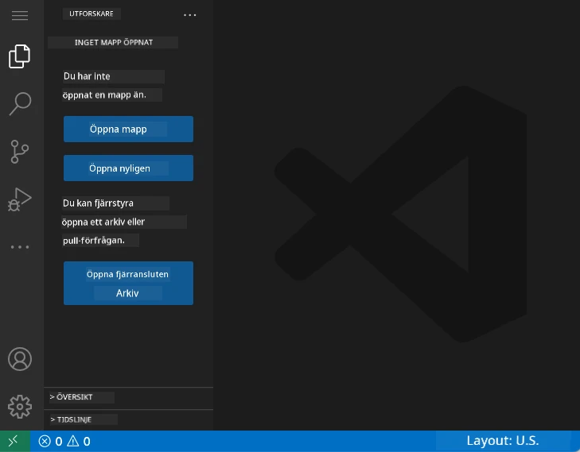

**Här är din rundtur i grannskapet:**
- **Aktivitetsfältet** (den remsan till vänster): Din huvudsakliga navigering med Utforskaren 📁, Sök 🔍, Källkodshantering 🌿, Tillägg 🧩 och Inställningar ⚙️
- **Sidopanelen** (panelen bredvid): Visar relevant information beroende på vad du har valt
- **Editorområdet** (det stora utrymmet i mitten): Här händer magin – ditt huvudområde för kodning

**Ta en stund att utforska:**
- Klicka runt på ikonerna i aktivitetsfältet och se vad varje gör
- Lägg märke till hur sidopanelen uppdateras för att visa olika information – rätt häftigt, eller hur?
- Utforskarvyn (📁) är förmodligen där du kommer spendera mest tid, så lär känna den väl

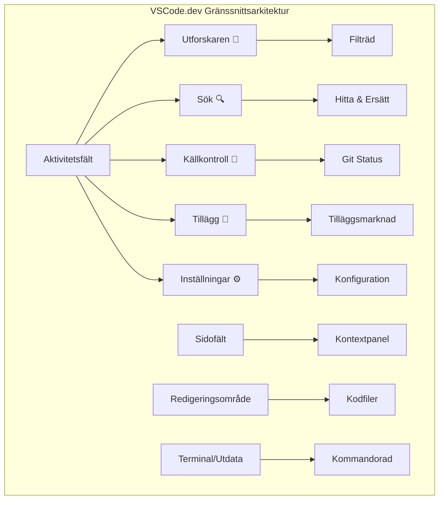
## Öppna GitHub-repositorier

Innan internet var forskare tvungna att fysiskt resa till bibliotek för att få tillgång till dokument. GitHub-repositorier fungerar på liknande sätt – de är samlingar av kod som lagras på distans. VSCode.dev eliminerar det traditionella steget att ladda ner repositorier till din lokala maskin innan du redigerar.

Denna funktion gör det möjligt att omedelbart få tillgång till vilket offentligt repositorium som helst för visning, redigering eller bidragande. Här är två sätt att öppna repositorier:

### Metod 1: Klicka-och-öppna-sättet

Detta är perfekt när du börjar från grunden i VSCode.dev och vill öppna ett specifikt repositorium. Det är enkelt och nybörjarvänligt:

**Så här gör du:**

1. Gå till [vscode.dev](https://vscode.dev) om du inte redan är där
2. Leta upp knappen "Open Remote Repository" på välkomstskärmen och klicka på den

   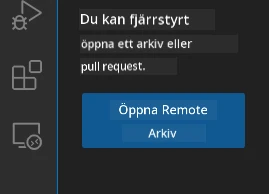

3. Klistra in vilken GitHub-repo-URL som helst (prova den här: `https://github.com/microsoft/Web-Dev-For-Beginners`)
4. Tryck Enter och se magin ske!

**Proffstips – Kommando-Palettens genväg:**

Vill du känna dig som en kodtrollkarl? Prova detta tangentbordskommando: Ctrl+Shift+P (eller Cmd+Shift+P på Mac) för att öppna Kommando-Paletten:

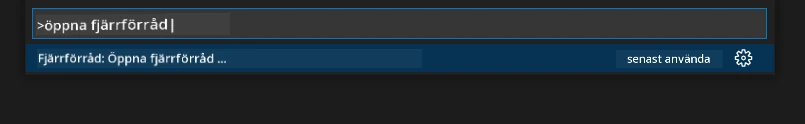

**Kommando-Paletten är som en sökmotor för allt du kan göra:**
- Skriv "open remote" så hittar den öppnaren för repositorier åt dig
- Den kommer ihåg repositorier du öppnat nyligen (superpraktiskt!)
- När du väl vant dig kommer du att känna att du kodar i blixtens hastighet
- Den är i princip VSCode.devs version av "Hey Siri, men för kodning"

### Metod 2: URL-omvandlingstekniken

Precis som HTTP och HTTPS använder olika protokoll men behåller samma domänstruktur, använder VSCode.dev ett URL-mönster som speglar GitHubs adressystem. Vilken GitHub-repo-URL som helst kan ändras för att öppnas direkt i VSCode.dev.

**URL-omvandlingsmönster:**

| Repositorietyp | GitHub-URL | VSCode.dev-URL |
|----------------|---------------------|----------------|
| **Offentligt Repo** | `github.com/microsoft/Web-Dev-For-Beginners` | `vscode.dev/github/microsoft/Web-Dev-For-Beginners` |
| **Personligt Projekt** | `github.com/ditt-användarnamn/min-projekt` | `vscode.dev/github/ditt-användarnamn/min-projekt` |
| **Vilket Tillgängligt Repo som helst** | `github.com/deras-användarnamn/awesome-repo` | `vscode.dev/github/deras-användarnamn/awesome-repo` |

**Genomförande:**
- Byt ut `github.com` mot `vscode.dev/github`
- Behåll alla andra delar av URL:en oförändrade
- Fungerar med alla offentligt åtkomliga repositorier
- Ger omedelbar redigeringstillgång

> 💡 **Livsförändrande tips**: Bokmärk VSCode.dev-versioner av dina favoritrepositories. Jag har bokmärken som "Redigera mitt Portfolio" och "Fix Dokumentation" som tar mig direkt till redigeringsläge!

**Vilken metod ska du använda?**
- **Gränssnittssättet**: Perfekt när du utforskar eller inte kommer ihåg exakta repnamn
- **URL-tricket**: Perfekt för blixtsnabb åtkomst när du vet exakt var du ska

### 🎯 Pedagogisk check-in: Molnutvecklingstillgång

**Pausa och reflektera**: Du har just lärt dig två metoder för att få åtkomst till kodrepositorier via webbläsare. Detta representerar en fundamental förändring i hur utveckling fungerar.

**Snabb självbedömning**:
- Kan du förklara varför webbaserad redigering eliminerar traditionell "utvecklingsmiljösetup"?
- Vilka fördelar ger URL-omvandlingstekniken jämfört med lokal git-kloning?
- Hur förändrar detta sättet du kan bidra till open source-projekt?

**Verklighetskoppling**: Stora företag som GitHub, GitLab och Replit har byggt sina utvecklingsplattformar kring dessa molnförst-principer. Du lär dig samma arbetsflöden som professionella utvecklarteam världen över.

**Utmaningsfråga**: Hur kan molnbaserad utveckling förändra hur kodning lärs ut i skolor? Tänk på krav på enheter, mjukvaruhantering och samarbetsmöjligheter.

## Arbeta med filer och projekt

Nu när du har ett repositorium öppet, låt oss börja bygga! VSCode.dev ger dig allt du behöver för att skapa, redigera och organisera dina kodfiler. Tänk på det som din digitala verkstad – varje verktyg finns precis där du behöver det.

Låt oss dyka ner i vardagliga uppgifter som kommer att utgöra större delen av ditt kodarbetsflöde.

### Skapa nya filer

Precis som att organisera ritningar i en arkitekts kontor följer filskapande i VSCode.dev en strukturerad metod. Systemet stödjer alla standard webbutvecklingsfiltyper.

**Filskapande process:**

1. Navigera till målmappen i Utforskaren i sidopanelen
2. Håll muspekaren över mappnamnet för att visa ikonen "Ny fil" (📄+)
3. Skriv in filnamnet inklusive lämplig filändelse (`style.css`, `script.js`, `index.html`)
4. Tryck Enter för att skapa filen

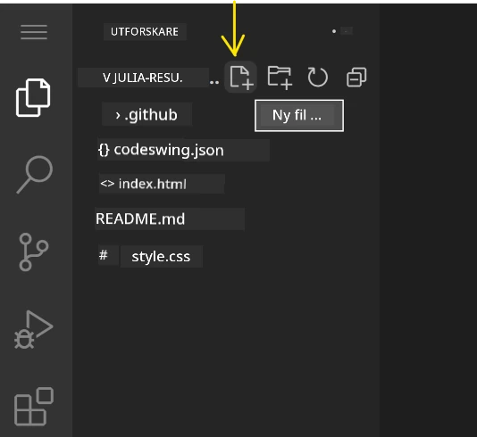

**Namngivningskonventioner:**
- Använd beskrivande namn som visar filens syfte
- Inkludera filändelser för korrekt syntaxmarkering
- Följ konsekventa namngivningsmönster i hela projektet
- Använd små bokstäver och bindestreck istället för mellanslag

### Redigera och spara filer

Här börjar det riktiga roliga! VSCode.devs editor är fullpackad med hjälpsamma funktioner som gör kodandet smidigt och intuitivt. Det är som att ha en riktigt smart skrivassistent, men för kod.

**Ditt redigeringsflöde:**

1. Klicka på en fil i Utforskaren för att öppna den i huvudområdet
2. Börja skriva och se hur VSCode.dev hjälper dig med färger, förslag och felupptäckt
3. Spara ditt arbete med Ctrl+S (Windows/Linux) eller Cmd+S (Mac) – även om den autosparar!

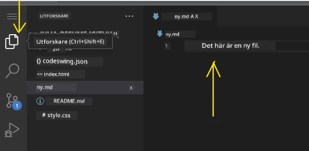

**Det häftiga som händer medan du kodar:**
- Din kod får vackra färgmarkeringar så att den är lätt att läsa
- VSCode.dev föreslår kompletteringar medan du skriver (som autokorrigering fast mycket smartare)
- Den fångar stavfel och fel innan du ens sparar
- Du kan ha flera filer öppna i flikar, precis som i en webbläsare
- Allt sparas automatiskt i bakgrunden

> ⚠️ **Snabbtips**: Fast auto-save finns där, är det ändå bra vana att trycka Ctrl+S eller Cmd+S. Det sparar allt omedelbart och triggar extra hjälpfunktioner som felkontroll.

### Versionshantering med Git

Precis som arkeologer skapar detaljerade journaler över utgrävningslager, spårar Git ändringar i din kod över tid. Detta system bevarar projektets historia och gör det möjligt att återgå till tidigare versioner vid behov. VSCode.dev inkluderar integrerad Git-funktionalitet.

**Källkodshanteringsgränssnittet:**

1. Öppna panelen Källkodshantering via 🌿-ikonen i aktivitetsfältet
2. Modifierade filer visas i avsnittet "Ändringar"
3. Färgkodning visar ändringstyper: grönt för tillägg, rött för borttagningar

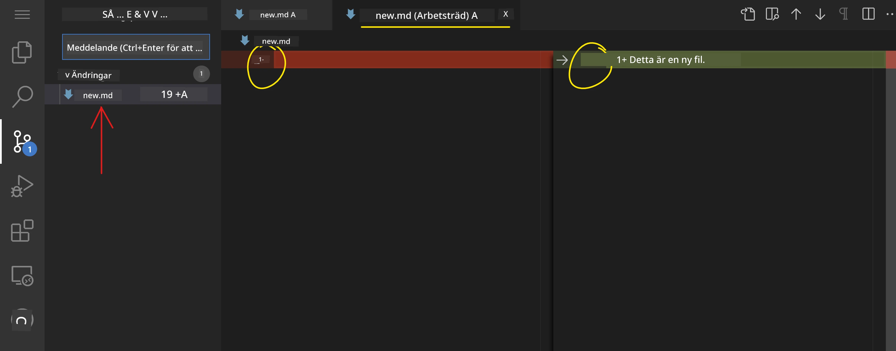

**Spara ditt arbete (commit-flödet):**

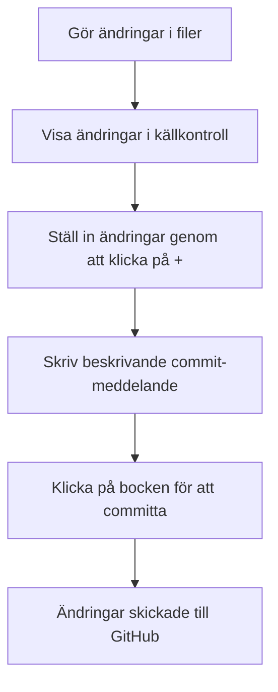
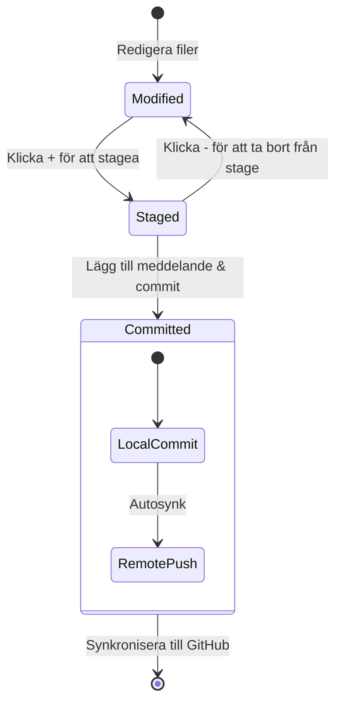
**Så här går du steg för steg tillväga:**
- Klicka på "+"-ikonen bredvid filer du vill spara (detta "stager" dem)
- Dubbelkolla att du är nöjd med alla dina förberedda ändringar
- Skriv en kort anteckning som förklarar vad du gjort (det här är ditt "commit-meddelande")
- Klicka på bock-knappen för att spara allt till GitHub
- Om du ändrar dig om något kan du använda ångra-ikonen för att förkasta ändringarna

**Att skriva bra commit-meddelanden (det är enklare än du tror!):**
- Beskriv bara vad du gjort, som "Lägg till kontaktformulär" eller "Åtgärda trasig navigering"
- Håll det kort och koncist – tänk tweet-längd, inte uppsats
- Börja med handlingsord som "Lägg till", "Åtgärda", "Uppdatera" eller "Ta bort"
- **Bra exempel**: "Lägg till responsiv navigationsmeny", "Åtgärda layoutproblem på mobil", "Uppdatera färger för bättre tillgänglighet"

> 💡 **Snabb navigeringstips**: Använd hamburgermenyn (☰) uppe till vänster för att snabbt hoppa tillbaka till ditt GitHub-repo och se dina committade ändringar online. Det är som en portal mellan din redigeringsmiljö och projektets hem på GitHub!

## Förbättra funktionalitet med tillägg

Precis som en hantverkares verkstad innehåller specialiserade verktyg för olika uppgifter, kan VSCode.dev anpassas med tillägg som lägger till specifika funktioner. Dessa plugins som utvecklats av gemenskapen löser vanliga utvecklingsbehov som kodformatering, liveförhandsvisning och förbättrad Git-integrering.

Tilläggsmarknaden har tusentals gratis verktyg skapade av utvecklare över hela världen. Varje tillägg löser särskilda arbetsflödesutmaningar, vilket låter dig bygga en personlig utvecklingsmiljö anpassad efter dina specifika behov och preferenser.

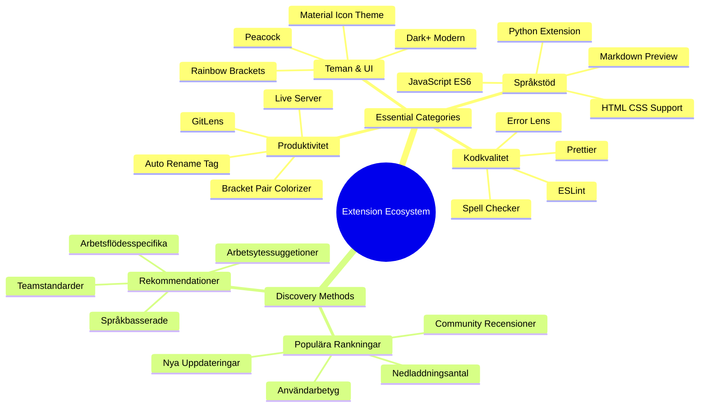
### Hitta dina perfekta tillägg

Tilläggsmarknaden är väldigt välorganiserad, så du går inte vilse när du letar efter det du behöver. Den är designad för att hjälpa dig upptäcka både specifika verktyg och häftiga saker du inte ens visste fanns!

**Så här tar du dig till marknaden:**

1. Klicka på tilläggsikonen (🧩) i aktivitetsfältet
2. Bläddra runt eller sök efter något specifikt
3. Klicka på något som ser intressant ut för att lära dig mer

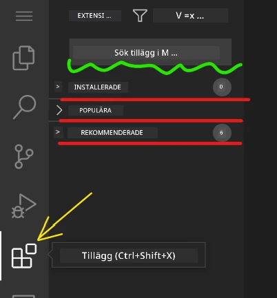

**Det du kommer att se där:**

| Sektion | Innehåll | Varför det är hjälpsamt |
|----------|---------|----------|
| **Installerade** | Tillägg du redan lagt till | Din personliga kodningsverktygslåda |
| **Populära** | Folkets favoriter | Vad de flesta utvecklare svär vid |
| **Rekommenderade** | Smarta förslag för ditt projekt | VSCode.dev:s hjälpsamma rekommendationer |

**Vad som gör surfningen enkel:**
- Varje tillägg visar betyg, antal nedladdningar och riktiga användarrecensioner
- Du får skärmbilder och tydliga beskrivningar av vad varje gör
- Allt är tydligt märkt med kompatibilitetsinformation
- Liknande tillägg föreslås så att du kan jämföra alternativ

### Installera tillägg (det är superenkelt!)

Att lägga till nya krafter till din editor är lika enkelt som att klicka på en knapp. Tillägg installeras på några sekunder och börjar fungera direkt – inga omstarter, inget väntande.

**Så här gör du:**

1. Sök efter det du vill ha (testa att söka på "live server" eller "prettier")
2. Klicka på ett som ser bra ut för att se fler detaljer
3. Läs igenom vad det gör och kolla betygen
4. Tryck på den blå "Installera"-knappen och klart!


**Vad som händer bakom kulisserna:**
- Tillägget laddas ner och ställer in sig automatiskt
- Nya funktioner dyker upp i ditt gränssnitt direkt
- Allt börjar fungera omedelbart (seriöst, det är så snabbt!)
- Om du är inloggad synkroniseras tillägget till alla dina enheter

**Några tillägg jag rekommenderar att börja med:**
- **Live Server**: Se din webbplats uppdateras i realtid medan du kodar (det här är magiskt!)
- **Prettier**: Gör din kod ren och professionell automatiskt
- **Auto Rename Tag**: Byt ut en HTML-tagg så ändras dess partner också
- **Bracket Pair Colorizer**: Färgkodar dina parenteser så att du aldrig tappar bort dig
- **GitLens**: Förstärker dina Git-funktioner med massor av hjälpsam info

### Anpassa dina tillägg

De flesta tillägg har inställningar du kan justera för att få dem att fungera precis som du vill. Tänk på det som att ställa in säte och backspeglar i en bil – alla har sina preferenser!

**Justera tilläggsinställningar:**

1. Hitta ditt installerade tillägg i panelen Extensions
2. Leta efter den lilla kugghjulsikonen (⚙️) bredvid namnet och klicka på den
3. Välj "Extension Settings" i rullgardinsmenyn
4. Justera tills det känns exakt rätt för ditt arbetsflöde

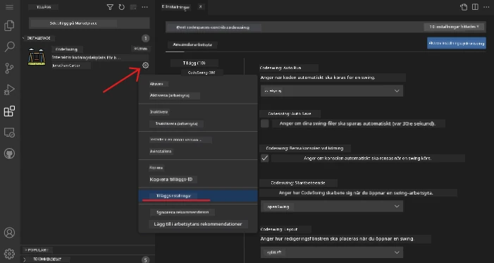

**Vanliga saker du kanske vill justera:**
- Hur din kod formateras (flikar vs mellanslag, radlängd, osv.)
- Vilka tangentbordsgenvägar som triggar olika åtgärder
- Vilka filtyper tillägget ska fungera med
- Att slå på eller av specifika funktioner för att hålla det rent

### Hålla dina tillägg organiserade

När du upptäcker fler häftiga tillägg vill du hålla din samling prydlig och fungerande smidigt. VSCode.dev gör det väldigt enkelt att hantera.

**Dina hanteringsalternativ för tillägg:**

| Vad du kan göra | När det är hjälpsamt | Proffstips |
|--------|---------|----------|
| **Inaktivera** | För att testa om ett tillägg orsakar problem | Bättre än att avinstallera om du kanske vill ha tillbaka det |
| **Avinstallera** | Ta bort tillägg du inte behöver | Håller din miljö ren och snabb |
| **Uppdatera** | Skaffa de senaste funktionerna och buggfixarna | Oftast automatiskt, men värt att kolla |

**Så här brukar jag hantera tillägg:**
- Varje par månader går jag igenom vad jag installerat och tar bort det jag inte använder
- Jag håller tilläggen uppdaterade så jag får de senaste förbättringarna och säkerhetsfixarna
- Om något känns segt så inaktiverar jag tillfälligt tillägg för att se om någon är boven
- Jag läser uppdateringsnotiser när tillägg får stora uppdateringar – ibland finns där häftiga nya funktioner!

> ⚠️ **Prestandatips**: Tillägg är fantastiska, men för många kan göra allt långsamt. Fokusera på de som verkligen gör ditt liv enklare och var inte rädd för att avinstallera sådana du aldrig använder.

### 🎯 Pedagogisk kontrolpunkt: Anpassning av utvecklingsmiljö

**Förståelse för arkitektur**: Du har lärt dig att anpassa en professionell utvecklingsmiljö med hjälp av tillägg skapade av gemenskapen. Detta speglar hur professionella utvecklingsteam bygger standardiserade verktygskedjor.

**Nyckelkoncept du behärskar**:
- **Upptäckt av tillägg**: Hitta verktyg som löser specifika utvecklingsutmaningar
- **Miljök配置**: Anpassa verktyg för att matcha personliga eller teamets preferenser
- **Prestandaoptimering**: Balansera funktionalitet med systemprestanda
- **Gemenskapsarbete**: Utnyttja verktyg skapade av den globala utvecklargemenskapen

**Branschkoppling**: Tilläggsekosystem driver stora utvecklingsplattformar som VS Code, Chrome DevTools och moderna IDE:er. Att förstå hur man utvärderar, installerar och konfigurerar tillägg är avgörande för professionella utvecklingsarbetsflöden.

**Reflektionsfråga**: Hur skulle du gå tillväga för att sätta upp en standardiserad utvecklingsmiljö för ett team med 10 utvecklare? Tänk på konsekvens, prestanda och individuella preferenser.

## 📈 Din tidslinje för molnutvecklingsmästerskap

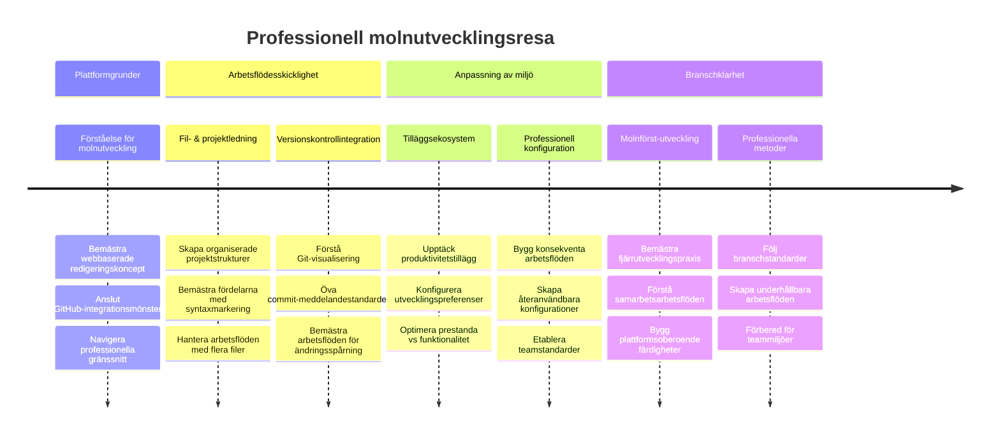
**🎓 Examensmilstolpe**: Du har framgångsrikt behärskat molnbaserad utveckling med samma verktyg och arbetsflöden som proffs hos stora teknikföretag. Dessa färdigheter representerar framtiden för mjukvaruutveckling.

**🔄 Nästa nivå kapabiliteter**:
- Redo att utforska avancerade molnutvecklingsplattformar (Codespaces, GitPod)
- Förberedd för att arbeta i distribuerade utvecklingsteam
- Utrustad för att bidra till open source-projekt globalt
- Grund lagd för moderna DevOps- och kontinuerlig integrationsrutiner

## GitHub Copilot Agent-utmaning 🚀

Precis som det strukturerade tillvägagångssätt NASA använder för rymduppdrag innebär denna utmaning systematisk tillämpning av VSCode.dev-färdigheter i ett komplett arbetsflödesscenario.

**Mål:** Visa skicklighet i VSCode.dev genom att etablera ett omfattande webbapputvecklingsarbetsflöde.

**Projektkrav:** Med hjälp av agent-läge slutför dessa uppgifter:
1. Forka ett befintligt repository eller skapa ett nytt
2. Skapa en fungerande projektstruktur med HTML-, CSS- och JavaScript-filer
3. Installera och konfigurera tre utvecklingsförbättrande tillägg
4. Öva versionskontroll med beskrivande commit-meddelanden
5. Experimentera med att skapa och modifiera feature branches
6. Dokumentera processen och lärdomarna i en README.md-fil

Denna övning konsoliderar alla VSCode.dev-koncept till ett praktiskt arbetsflöde som kan appliceras i framtida utvecklingsprojekt.

Läs mer om [agent mode](https://code.visualstudio.com/blogs/2025/02/24/introducing-copilot-agent-mode) här.

## Uppgift

Dags att ta dessa färdigheter på en riktig testkörning! Jag har ett praktiskt projekt som låter dig öva allt vi täckt: [Skapa en CV-webbplats med VSCode.dev](./assignment.md)

Denna uppgift guidar dig genom att bygga en professionell CV-webbplats helt och hållet i din webbläsare. Du kommer använda alla VSCode.dev-funktioner vi utforskat, och i slutet har du både en snygg webbplats och stor självförtroende i ditt nya arbetsflöde.

## Fortsätt utforska och utveckla dina färdigheter

Du har en stabil grund nu, men det finns så mycket mer coola saker att upptäcka! Här är några resurser och idéer för att ta dina VSCode.dev-kunskaper till nästa nivå:

**Officiell dokumentation värd att bokmärka:**
- [VSCode Web Documentation](https://code.visualstudio.com/docs/editor/vscode-web?WT.mc_id=academic-0000-alfredodeza) – Den kompletta guiden för redigering i webbläsare
- [GitHub Codespaces](https://docs.github.com/en/codespaces) – För när du vill ha ännu mer kraft i molnet

**Häftiga funktioner att experimentera med nästa gång:**
- **Tangentbordsgenvägar**: Lär dig genvägarna som får dig att känna dig som en kodningsninja
- **Workspace-inställningar**: Ställ in olika miljöer för olika typer av projekt
- **Multi-root Workspaces**: Arbeta med flera repositories samtidigt (superpraktiskt!)
- **Terminalintegrering**: Använd kommandoradsverktyg direkt i din webbläsare

**Idéer för övning:**
- Hoppa in i open source-projekt och bidra via VSCode.dev – det är ett utmärkt sätt att ge tillbaka!
- Testa olika tillägg för att hitta din perfekta setup
- Skapa projektmallar för de typer av sajter du bygger oftast
- Öva Git-arbetsflöden som branching och merging – dessa färdigheter är guld värda i teamprojekt

---

**Du har behärskat webbläsarbaserad utveckling!** 🎉 Precis som portabla instrument gjorde det möjligt för forskare att bedriva forskning på avlägsna platser, gör VSCode.dev det möjligt att koda professionellt från vilken internetansluten enhet som helst.

Dessa färdigheter speglar dagens branschpraxis – många professionella utvecklare använder molnbaserade utvecklingsmiljöer för deras flexibilitet och tillgänglighet. Du har lärt dig ett arbetsflöde som skalar från individuella projekt till stora teamsamarbeten.

Använd dessa tekniker i ditt nästa utvecklingsprojekt! 🚀

---

<!-- CO-OP TRANSLATOR DISCLAIMER START -->
**Ansvarsfriskrivning**:  
Detta dokument har översatts med hjälp av AI-översättningstjänsten [Co-op Translator](https://github.com/Azure/co-op-translator). Trots att vi strävar efter noggrannhet kan automatiska översättningar innehålla fel eller brister. Det ursprungliga dokumentet på dess modersmål bör betraktas som den auktoritativa källan. För kritisk information rekommenderas professionell mänsklig översättning. Vi ansvarar inte för eventuella missförstånd eller feltolkningar som uppstår vid användning av denna översättning.
<!-- CO-OP TRANSLATOR DISCLAIMER END -->