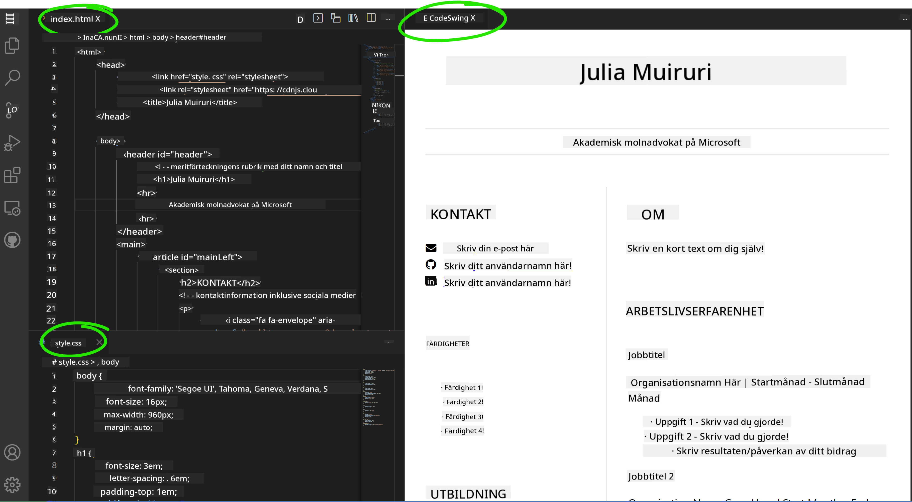

<!--
CO_OP_TRANSLATOR_METADATA:
{
  "original_hash": "bd3aa6d2b879c30ea496c43aec1c49ed",
  "translation_date": "2025-08-29T08:00:22+00:00",
  "source_file": "8-code-editor/1-using-a-code-editor/assignment.md",
  "language_code": "sv"
}
-->
# Skapa en CV-webbplats med hjälp av vscode.dev

_Hur coolt vore det inte om en rekryterare bad om ditt CV och du skickade dem en URL?_ 😎

<!----
TODO: lägg till en valfri bild

> Sketchnote av [Författarens namn](https://example.com)
---->

<!---
## Förkunskapstest
[Förkunskapstest](https://ff-quizzes.netlify.app/web/quiz/3)
---->

## Mål

Efter denna uppgift kommer du att lära dig att:

- Skapa en webbplats för att visa upp ditt CV

### Förkunskaper

1. Ett GitHub-konto. Gå till [GitHub](https://github.com/) och skapa ett konto om du inte redan har ett.

## Steg

**Steg 1:** Skapa ett nytt GitHub-repository och ge det namnet `my-resume`

**Steg 2** Skapa en `index.html`-fil i ditt repository. Vi kommer att lägga till minst en fil direkt på github.com eftersom du inte kan öppna ett tomt repository på vscode.dev.

Klicka på länken `creating a new file`, skriv in namnet `index.html` och välj knappen `Commit new file`.


**Steg 3:** Öppna [VSCode.dev](https://vscode.dev) och välj knappen `Open Remote Repository`.

Kopiera URL:en till det repository du just skapade för din CV-webbplats och klistra in den i inmatningsrutan:

_Ersätt `your-username` med ditt GitHub-användarnamn_

```
https://github.com/your-username/my-resume
```

✅ Om det lyckas kommer du att se ditt projekt och filen index.html öppnas i textredigeraren i webbläsaren.


**Steg 4:** Öppna filen `index.html`, klistra in koden nedan i kodområdet och spara.

<details>
    <summary><b>HTML-kod som ansvarar för innehållet på din CV-webbplats.</b></summary>
    
        <html>

            <head>
                <link href="style.css" rel="stylesheet">
                <link rel="stylesheet" href="https://cdnjs.cloudflare.com/ajax/libs/font-awesome/5.15.4/css/all.min.css">
                <title>Ditt namn här!</title>
            </head>
            <body>
                <header id="header">
                    <!-- CV-header med ditt namn och titel -->
                    <h1>Ditt namn här!</h1>
                    <hr>
                    Din roll!
                    <hr>
                </header>
                <main>
                    <article id="mainLeft">
                        <section>
                            <h2>KONTAKT</h2>
                            <!-- kontaktinformation inklusive sociala medier -->
                            <p>
                                <i class="fa fa-envelope" aria-hidden="true"></i>
                                <a href="mailto:username@domain.top-level domain">Skriv din e-post här</a>
                            </p>
                            <p>
                                <i class="fab fa-github" aria-hidden="true"></i>
                                <a href="github.com/yourGitHubUsername">Skriv ditt användarnamn här!</a>
                            </p>
                            <p>
                                <i class="fab fa-linkedin" aria-hidden="true"></i>
                                <a href="linkedin.com/yourLinkedInUsername">Skriv ditt användarnamn här!</a>
                            </p>
                        </section>
                        <section>
                            <h2>KOMPETENSER</h2>
                            <!-- dina färdigheter -->
                            <ul>
                                <li>Färdighet 1!</li>
                                <li>Färdighet 2!</li>
                                <li>Färdighet 3!</li>
                                <li>Färdighet 4!</li>
                            </ul>
                        </section>
                        <section>
                            <h2>UTBILDNING</h2>
                            <!-- din utbildning -->
                            <h3>Skriv din utbildning här!</h3>
                            <p>
                                Skriv din institution här!
                            </p>
                            <p>
                                Startdatum - Slutdatum
                            </p>
                        </section>            
                    </article>
                    <article id="mainRight">
                        <section>
                            <h2>OM MIG</h2>
                            <!-- om dig -->
                            <p>Skriv en kort text om dig själv!</p>
                        </section>
                        <section>
                            <h2>ARBETSLIVSERFARENHET</h2>
                            <!-- din arbetslivserfarenhet -->
                            <h3>Jobbtitel</h3>
                            <p>
                                Organisationsnamn här | Startmånad – Slutmånad
                            </p>
                            <ul>
                                    <li>Uppgift 1 - Skriv vad du gjorde!</li>
                                    <li>Uppgift 2 - Skriv vad du gjorde!</li>
                                    <li>Skriv resultaten/effekten av ditt bidrag</li>
                                    
                            </ul>
                            <h3>Jobbtitel 2</h3>
                            <p>
                                Organisationsnamn här | Startmånad – Slutmånad
                            </p>
                            <ul>
                                    <li>Uppgift 1 - Skriv vad du gjorde!</li>
                                    <li>Uppgift 2 - Skriv vad du gjorde!</li>
                                    <li>Skriv resultaten/effekten av ditt bidrag</li>
                                    
                            </ul>
                        </section>
                    </article>
                </main>
            </body>
        </html>
</details>

Lägg till dina CV-detaljer för att ersätta _platshållartexten_ i HTML-koden.

**Steg 5:** Hovra över mappen My-Resume, klicka på ikonen `New File ...` och skapa 2 nya filer i ditt projekt: `style.css` och `codeswing.json`.

**Steg 6:** Öppna filen `style.css`, klistra in koden nedan och spara.

<details>
        <summary><b>CSS-kod för att formatera layouten på webbplatsen.</b></summary>
            
            body {
                font-family: 'Segoe UI', Tahoma, Geneva, Verdana, sans-serif;
                font-size: 16px;
                max-width: 960px;
                margin: auto;
            }
            h1 {
                font-size: 3em;
                letter-spacing: .6em;
                padding-top: 1em;
                padding-bottom: 1em;
            }

            h2 {
                font-size: 1.5em;
                padding-bottom: 1em;
            }

            h3 {
                font-size: 1em;
                padding-bottom: 1em;
            }
            main { 
                display: grid;
                grid-template-columns: 40% 60%;
                margin-top: 3em;
            }
            header {
                text-align: center;
                margin: auto 2em;
            }

            section {
                margin: auto 1em 4em 2em;
            }

            i {
                margin-right: .5em;
            }

            p {
                margin: .2em auto
            }

            hr {
                border: none;
                background-color: lightgray;
                height: 1px;
            }

            h1, h2, h3 {
                font-weight: 100;
                margin-bottom: 0;
            }
            #mainLeft {
                border-right: 1px solid lightgray;
            }
            
</details>

**Steg 6:** Öppna filen `codeswing.json`, klistra in koden nedan och spara.

    {
    "scripts": [],
    "styles": []
    }

**Steg 7:** Installera tillägget `Codeswing` för att visualisera CV-webbplatsen i kodområdet.

Klicka på ikonen _`Extensions`_ i aktivitetsfältet och skriv in Codeswing. Klicka antingen på den _blå installationsknappen_ i det utökade aktivitetsfältet för att installera eller använd installationsknappen som visas i kodområdet när du väljer tillägget för att ladda ytterligare information. Direkt efter att du har installerat tillägget, observera kodområdet för att se ändringarna i ditt projekt 😃.


Detta är vad du kommer att se på din skärm efter att du har installerat tillägget.



Om du är nöjd med de ändringar du gjort, hovra över mappen `Changes` och klicka på `+`-knappen för att lägga till ändringarna.

Skriv ett commit-meddelande _(En beskrivning av de ändringar du gjort i projektet)_ och commit dina ändringar genom att klicka på `check`. När du är klar med ditt projekt, välj hamburgermenyn längst upp till vänster för att återgå till repositoryt på GitHub.

Grattis 🎉 Du har just skapat din CV-webbplats med hjälp av vscode.dev på några få steg.

## 🚀 Utmaning

Öppna ett fjärrrepository som du har behörighet att göra ändringar i och uppdatera några filer. Försök sedan skapa en ny gren med dina ändringar och gör en Pull Request.

<!----
## Efterföreläsningstest
[Efterföreläsningstest](https://ff-quizzes.netlify.app/web/quiz/4)
---->

## Granskning & Självstudier

Läs mer om [VSCode.dev](https://code.visualstudio.com/docs/editor/vscode-web?WT.mc_id=academic-0000-alfredodeza) och några av dess andra funktioner.

---

**Ansvarsfriskrivning**:  
Detta dokument har översatts med hjälp av AI-översättningstjänsten [Co-op Translator](https://github.com/Azure/co-op-translator). Även om vi strävar efter noggrannhet, vänligen notera att automatiska översättningar kan innehålla fel eller felaktigheter. Det ursprungliga dokumentet på dess originalspråk bör betraktas som den auktoritativa källan. För kritisk information rekommenderas professionell mänsklig översättning. Vi ansvarar inte för eventuella missförstånd eller feltolkningar som uppstår vid användning av denna översättning.