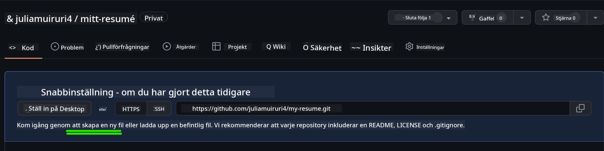
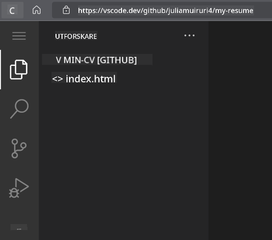

<!--
CO_OP_TRANSLATOR_METADATA:
{
  "original_hash": "effe56ba51c38d7bdfad1ea38288666b",
  "translation_date": "2025-10-23T21:29:19+00:00",
  "source_file": "8-code-editor/1-using-a-code-editor/assignment.md",
  "language_code": "sv"
}
-->
# Skapa en CV-webbplats med VSCode.dev

Förbättra dina karriärmöjligheter genom att bygga en professionell CV-webbplats som visar dina färdigheter och erfarenheter i ett interaktivt och modernt format. Istället för att skicka traditionella PDF-filer, tänk dig att ge rekryterare en snygg, responsiv webbplats som både demonstrerar dina kvalifikationer och dina webbutvecklingskunskaper.

Denna praktiska uppgift låter dig använda alla dina VSCode.dev-färdigheter samtidigt som du skapar något som verkligen kan vara användbart för din karriär. Du kommer att uppleva hela arbetsflödet för webbutveckling – från att skapa ett repository till att publicera – allt direkt i din webbläsare.

När du har slutfört projektet kommer du att ha en professionell onlineprofil som enkelt kan delas med potentiella arbetsgivare, uppdateras när dina färdigheter utvecklas och anpassas för att matcha ditt personliga varumärke. Detta är precis den typen av praktiskt projekt som visar verkliga färdigheter inom webbutveckling.

## Lärandemål

Efter att ha slutfört denna uppgift kommer du att kunna:

- **Skapa** och hantera ett komplett webbutvecklingsprojekt med VSCode.dev
- **Strukturera** en professionell webbplats med semantiska HTML-element
- **Styla** responsiva layouter med moderna CSS-tekniker
- **Implementera** interaktiva funktioner med grundläggande webteknologier
- **Publicera** en live-webbplats som är tillgänglig via en delbar URL
- **Demonstrera** bästa praxis för versionskontroll under hela utvecklingsprocessen

## Förkunskapskrav

Innan du börjar med denna uppgift, se till att du har:

- Ett GitHub-konto (skapa ett på [github.com](https://github.com/) om du inte redan har ett)
- Slutfört VSCode.dev-lektionen som täcker gränssnittsnavigering och grundläggande operationer
- Grundläggande förståelse för HTML-struktur och CSS-stylingkoncept

## Projektinställning och skapande av repository

Låt oss börja med att sätta upp grunden för ditt projekt. Denna process speglar arbetsflödena i verklig utveckling där projekt börjar med korrekt initialisering av repository och planering av struktur.

### Steg 1: Skapa ditt GitHub-repository

Att sätta upp ett dedikerat repository säkerställer att ditt projekt är korrekt organiserat och versionskontrollerat från början.

1. **Navigera** till [GitHub.com](https://github.com) och logga in på ditt konto
2. **Klicka** på den gröna "New"-knappen eller "+"-ikonen i det övre högra hörnet
3. **Namnge** ditt repository `my-resume` (eller välj ett personligt namn som `john-smith-resume`)
4. **Lägg till** en kort beskrivning: "Professionell CV-webbplats byggd med HTML och CSS"
5. **Välj** "Public" för att göra din CV tillgänglig för potentiella arbetsgivare
6. **Markera** "Add a README file" för att skapa en initial projektbeskrivning
7. **Klicka** på "Create repository" för att slutföra inställningen

> 💡 **Tips för att namnge repository**: Använd beskrivande, professionella namn som tydligt anger projektets syfte. Detta hjälper när du delar med arbetsgivare eller under portföljgranskningar.

### Steg 2: Initiera projektstruktur

Eftersom VSCode.dev kräver minst en fil för att öppna ett repository, kommer vi att skapa vår huvudsakliga HTML-fil direkt på GitHub innan vi byter till webbeditorn.

1. **Klicka** på länken "creating a new file" i ditt nya repository
2. **Skriv** `index.html` som filnamn
3. **Lägg till** denna initiala HTML-struktur:

```html
<!DOCTYPE html>
<html lang="en">
<head>
    <meta charset="UTF-8">
    <meta name="viewport" content="width=device-width, initial-scale=1.0">
    <title>Your Name - Professional Resume</title>
</head>
<body>
    <h1>Your Name</h1>
    <p>Professional Resume Website</p>
</body>
</html>
```

4. **Skriv** ett commit-meddelande: "Lägg till initial HTML-struktur"
5. **Klicka** på "Commit new file" för att spara dina ändringar



**Det här uppnår den initiala inställningen:**
- **Etablerar** korrekt HTML5-dokumentstruktur med semantiska element
- **Inkluderar** viewport meta-tag för kompatibilitet med responsiv design
- **Sätter** en beskrivande sidtitel som visas i webbläsarflikar
- **Skapar** grunden för professionell innehållsorganisation

## Arbeta i VSCode.dev

Nu när grunden för ditt repository är etablerad, låt oss gå över till VSCode.dev för det huvudsakliga utvecklingsarbetet. Denna webbaserade editor tillhandahåller alla verktyg som behövs för professionell webbutveckling.

### Steg 3: Öppna ditt projekt i VSCode.dev

1. **Navigera** till [vscode.dev](https://vscode.dev) i en ny webbläsarflik
2. **Klicka** på "Open Remote Repository" på välkomstskärmen
3. **Kopiera** din repository-URL från GitHub och klistra in den i inmatningsfältet

   Format: `https://github.com/your-username/my-resume`
   
   *Ersätt `your-username` med ditt faktiska GitHub-användarnamn*

4. **Tryck** på Enter för att ladda ditt projekt

✅ **Indikator för framgång**: Du bör se dina projektfiler i Explorer-sidofältet och `index.html` tillgänglig för redigering i huvudredigeringsområdet.



**Vad du kommer att se i gränssnittet:**
- **Explorer-sidofält**: **Visar** dina repository-filer och mappstruktur
- **Redigeringsområde**: **Visar** innehållet i valda filer för redigering
- **Aktivitetsfält**: **Ger** åtkomst till funktioner som Source Control och Extensions
- **Statusfält**: **Indikerar** anslutningsstatus och information om aktuell gren

### Steg 4: Bygg ditt CV-innehåll

Ersätt platshållarinnehållet i `index.html` med en omfattande CV-struktur. Denna HTML ger grunden för en professionell presentation av dina kvalifikationer.

<details>
<summary><b>Komplett HTML-struktur för CV</b></summary>

```html
<!DOCTYPE html>
<html lang="en">
<head>
    <meta charset="UTF-8">
    <meta name="viewport" content="width=device-width, initial-scale=1.0">
    <link href="style.css" rel="stylesheet">
    <link rel="stylesheet" href="https://cdnjs.cloudflare.com/ajax/libs/font-awesome/5.15.4/css/all.min.css">
    <title>Your Name - Professional Resume</title>
</head>
<body>
    <header id="header">
        <h1>Your Full Name</h1>
        <hr>
        <p class="role">Your Professional Title</p>
        <hr>
    </header>
    
    <main>
        <article id="mainLeft">
            <section>
                <h2>CONTACT</h2>
                <p>
                    <i class="fa fa-envelope" aria-hidden="true"></i>
                    <a href="mailto:your.email@domain.com">your.email@domain.com</a>
                </p>
                <p>
                    <i class="fab fa-github" aria-hidden="true"></i>
                    <a href="https://github.com/your-username">github.com/your-username</a>
                </p>
                <p>
                    <i class="fab fa-linkedin" aria-hidden="true"></i>
                    <a href="https://linkedin.com/in/your-profile">linkedin.com/in/your-profile</a>
                </p>
            </section>
            
            <section>
                <h2>SKILLS</h2>
                <ul>
                    <li>HTML5 & CSS3</li>
                    <li>JavaScript (ES6+)</li>
                    <li>Responsive Web Design</li>
                    <li>Version Control (Git)</li>
                    <li>Problem Solving</li>
                </ul>
            </section>
            
            <section>
                <h2>EDUCATION</h2>
                <h3>Your Degree or Certification</h3>
                <p>Institution Name</p>
                <p>Start Date - End Date</p>
            </section>
        </article>
        
        <article id="mainRight">
            <section>
                <h2>ABOUT</h2>
                <p>Write a compelling summary that highlights your passion for web development, key achievements, and career goals. This section should give employers insight into your personality and professional approach.</p>
            </section>
            
            <section>
                <h2>WORK EXPERIENCE</h2>
                <div class="job">
                    <h3>Job Title</h3>
                    <p class="company">Company Name | Start Date – End Date</p>
                    <ul>
                        <li>Describe a key accomplishment or responsibility</li>
                        <li>Highlight specific skills or technologies used</li>
                        <li>Quantify impact where possible (e.g., "Improved efficiency by 25%")</li>
                    </ul>
                </div>
                
                <div class="job">
                    <h3>Previous Job Title</h3>
                    <p class="company">Previous Company | Start Date – End Date</p>
                    <ul>
                        <li>Focus on transferable skills and achievements</li>
                        <li>Demonstrate growth and learning progression</li>
                        <li>Include any leadership or collaboration experiences</li>
                    </ul>
                </div>
            </section>
            
            <section>
                <h2>PROJECTS</h2>
                <div class="project">
                    <h3>Project Name</h3>
                    <p>Brief description of what the project accomplishes and technologies used.</p>
                    <a href="#" target="_blank">View Project</a>
                </div>
            </section>
        </article>
    </main>
</body>
</html>
```
</details>

**Anpassningsriktlinjer:**
- **Ersätt** all platshållartext med din faktiska information
- **Justera** sektioner baserat på din erfarenhetsnivå och karriärfokus
- **Lägg till** eller ta bort sektioner vid behov (t.ex. Certifieringar, Volontärarbete, Språk)
- **Inkludera** länkar till dina faktiska profiler och projekt

### Steg 5: Skapa stödjande filer

Professionella webbplatser kräver organiserade filstrukturer. Skapa CSS-stilmallen och konfigurationsfilerna som behövs för ett komplett projekt.

1. **Håll muspekaren** över namnet på din projektmapp i Explorer-sidofältet
2. **Klicka** på ikonen "New File" (📄+) som visas
3. **Skapa** dessa filer en i taget:
   - `style.css` (för styling och layout)
   - `codeswing.json` (för konfigurationsfilen till förhandsgranskningsverktyget)

**Skapa CSS-filen (`style.css`):**

<details>
<summary><b>Professionell CSS-styling</b></summary>

```css
/* Modern Resume Styling */
body {
    font-family: 'Segoe UI', Tahoma, Geneva, Verdana, sans-serif;
    font-size: 16px;
    line-height: 1.6;
    max-width: 960px;
    margin: 0 auto;
    padding: 20px;
    color: #333;
    background-color: #f9f9f9;
}

/* Header Styling */
header {
    text-align: center;
    margin-bottom: 3em;
    padding: 2em;
    background: linear-gradient(135deg, #667eea 0%, #764ba2 100%);
    color: white;
    border-radius: 10px;
    box-shadow: 0 4px 6px rgba(0, 0, 0, 0.1);
}

h1 {
    font-size: 3em;
    letter-spacing: 0.1em;
    margin-bottom: 0.2em;
    font-weight: 300;
}

.role {
    font-size: 1.3em;
    font-weight: 300;
    margin: 1em 0;
}

/* Main Content Layout */
main {
    display: grid;
    grid-template-columns: 35% 65%;
    gap: 3em;
    margin-top: 3em;
    background: white;
    padding: 2em;
    border-radius: 10px;
    box-shadow: 0 2px 10px rgba(0, 0, 0, 0.1);
}

/* Typography */
h2 {
    font-size: 1.4em;
    font-weight: 600;
    margin-bottom: 1em;
    color: #667eea;
    border-bottom: 2px solid #667eea;
    padding-bottom: 0.3em;
}

h3 {
    font-size: 1.1em;
    font-weight: 600;
    margin-bottom: 0.5em;
    color: #444;
}

/* Section Styling */
section {
    margin-bottom: 2.5em;
}

#mainLeft {
    border-right: 1px solid #e0e0e0;
    padding-right: 2em;
}

/* Contact Links */
section a {
    color: #667eea;
    text-decoration: none;
    transition: color 0.3s ease;
}

section a:hover {
    color: #764ba2;
    text-decoration: underline;
}

/* Icons */
i {
    margin-right: 0.8em;
    width: 20px;
    text-align: center;
    color: #667eea;
}

/* Lists */
ul {
    list-style: none;
    padding-left: 0;
}

li {
    margin: 0.5em 0;
    padding: 0.3em 0;
    position: relative;
}

li:before {
    content: "▸";
    color: #667eea;
    margin-right: 0.5em;
}

/* Work Experience */
.job, .project {
    margin-bottom: 2em;
    padding-bottom: 1.5em;
    border-bottom: 1px solid #f0f0f0;
}

.company {
    font-style: italic;
    color: #666;
    margin-bottom: 0.5em;
}

/* Responsive Design */
@media (max-width: 768px) {
    main {
        grid-template-columns: 1fr;
        gap: 2em;
    }
    
    #mainLeft {
        border-right: none;
        border-bottom: 1px solid #e0e0e0;
        padding-right: 0;
        padding-bottom: 2em;
    }
    
    h1 {
        font-size: 2.2em;
    }
    
    body {
        padding: 10px;
    }
}

/* Print Styles */
@media print {
    body {
        background: white;
        color: black;
        font-size: 12pt;
    }
    
    header {
        background: none;
        color: black;
        box-shadow: none;
    }
    
    main {
        box-shadow: none;
    }
}
```
</details>

**Skapa konfigurationsfilen (`codeswing.json`):**

```json
{
    "scripts": [],
    "styles": []
}
```

**Förstå CSS-funktionerna:**
- **Använder** CSS Grid för responsiv, professionell layoutstruktur
- **Implementerar** moderna färgscheman med gradienthuvuden
- **Inkluderar** hover-effekter och mjuka övergångar för interaktivitet
- **Tillhandahåller** responsiv design som fungerar på alla enhetsstorlekar
- **Lägger till** utskriftsvänliga stilar för PDF-generering

### Steg 6: Installera och konfigurera tillägg

Tillägg förbättrar din utvecklingsupplevelse genom att tillhandahålla live-förhandsgranskningsmöjligheter och förbättrade arbetsflödesverktyg. CodeSwing-tillägget är särskilt användbart för webbutvecklingsprojekt.

**Installera CodeSwing-tillägget:**

1. **Klicka** på Extensions-ikonen (🧩) i aktivitetsfältet
2. **Sök** efter "CodeSwing" i sökrutan för marknadsplatsen
3. **Välj** CodeSwing-tillägget från sökresultaten
4. **Klicka** på den blå "Install"-knappen


**Vad CodeSwing erbjuder:**
- **Möjliggör** live-förhandsgranskning av din webbplats medan du redigerar
- **Visar** ändringar i realtid utan manuell uppdatering
- **Stöder** flera filtyper inklusive HTML, CSS och JavaScript
- **Tillhandahåller** en integrerad utvecklingsmiljöupplevelse

**Omedelbara resultat efter installation:**
När CodeSwing är installerat kommer du att se en live-förhandsgranskning av din CV-webbplats visas i editorn. Detta låter dig se exakt hur din webbplats ser ut medan du gör ändringar.


**Förstå det förbättrade gränssnittet:**
- **Delad vy**: **Visar** din kod på ena sidan och live-förhandsgranskning på den andra
- **Uppdateringar i realtid**: **Återspeglar** ändringar omedelbart medan du skriver
- **Interaktiv förhandsgranskning**: **Tillåter** dig att testa länkar och interaktioner
- **Mobil simulering**: **Tillhandahåller** testmöjligheter för responsiv design

### Steg 7: Versionskontroll och publicering

Nu när din CV-webbplats är klar, använd Git för att spara ditt arbete och göra det tillgängligt online.

**Spara dina ändringar:**

1. **Klicka** på Source Control-ikonen (🌿) i aktivitetsfältet
2. **Granska** alla filer du har skapat och ändrat i sektionen "Changes"
3. **Stage** dina ändringar genom att klicka på "+"-ikonen bredvid varje fil
4. **Skriv** ett beskrivande commit-meddelande, som:
   - "Lägg till komplett CV-webbplats med responsiv design"
   - "Implementera professionell styling och innehållsstruktur"
5. **Klicka** på bockmarkeringen (✓) för att spara och ladda upp dina ändringar

**Exempel på effektiva commit-meddelanden:**
- "Lägg till professionellt CV-innehåll och styling"
- "Implementera responsiv design för mobilkompatibilitet"
- "Uppdatera kontaktinformation och projektlänkar"

> 💡 **Professionellt tips**: Bra commit-meddelanden hjälper till att spåra projektets utveckling och visar på noggrannhet – egenskaper som arbetsgivare värdesätter.

**Åtkomst till din publicerade webbplats:**
När du har sparat kan du återgå till ditt GitHub-repository via hamburgermenyn (☰) i det övre vänstra hörnet. Din CV-webbplats är nu versionskontrollerad och redo att publiceras eller delas.

## Resultat och nästa steg

**Grattis! 🎉** Du har framgångsrikt skapat en professionell CV-webbplats med VSCode.dev. Ditt projekt visar:
**Tekniska färdigheter som demonstreras:**
- **Hantera repository**: Skapade och organiserade en komplett projektstruktur
- **Webbutveckling**: Byggde en responsiv webbplats med modern HTML5 och CSS3
- **Versionskontroll**: Implementerade korrekt Git-arbetsflöde med meningsfulla commits
- **Verktygsfärdighet**: Använde effektivt VSCode.dev:s gränssnitt och tilläggssystem

**Professionella resultat uppnådda:**
- **Onlineprofil**: En delbar URL som visar dina kvalifikationer
- **Modernt format**: Ett interaktivt alternativ till traditionella PDF-CV
- **Demonstrerbara färdigheter**: Konkreta bevis på dina webbutvecklingskunskaper
- **Enkla uppdateringar**: En grund du kan fortsätta förbättra och anpassa

### Publiceringsalternativ

För att göra din CV tillgänglig för arbetsgivare, överväg dessa hosting-alternativ:

**GitHub Pages (Rekommenderas):**
1. Gå till inställningarna för ditt repository på GitHub
2. Scrolla till sektionen "Pages"
3. Välj "Deploy from a branch" och välj "main"
4. Din webbplats kommer att vara tillgänglig på `https://your-username.github.io/my-resume`

**Alternativa plattformar:**
- **Netlify**: Automatisk publicering med anpassade domäner
- **Vercel**: Snabb publicering med moderna hosting-funktioner
- **GitHub Codespaces**: Utvecklingsmiljö med inbyggd förhandsgranskning

### Förslag på förbättringar

Fortsätt utveckla dina färdigheter genom att lägga till dessa funktioner:

**Tekniska förbättringar:**
- **JavaScript-interaktivitet**: Lägg till mjuk scrollning eller interaktiva element
- **Mörkt läge**: Implementera temaväxling för användarens preferens
- **Kontaktformulär**: Möjliggör direkt kommunikation med potentiella arbetsgivare
- **SEO-optimering**: Lägg till meta-taggar och strukturerad data för bättre sökbarhet

**Innehållsförbättringar:**
- **Projektportfölj**: Länka till GitHub-repositories och live-demonstrationer
- **Visualisering av färdigheter**: Skapa progressionsstaplar eller färdighetsbedömningssystem
- **Rekommendationssektion**: Inkludera rekommendationer från kollegor eller instruktörer
- **Bloggintegration**: Lägg till en bloggsektion för att visa din läranderesa

## GitHub Copilot Agent-utmaning 🚀

Använd Agent-läget för att slutföra följande utmaning:

**Beskrivning:** Förbättra din CV-webbplats med avancerade funktioner som demonstrerar professionella webbutvecklingsfärdigheter och moderna designprinciper.

**Uppdrag:** Bygg vidare på din befintliga CV-webbplats och implementera dessa avancerade funktioner:
1. Lägg till en mörkt/ljust tema-växling med mjuka övergångar
2. Skapa en interaktiv färdighetssektion med animerade progressionsstaplar
3. Implementera ett kontaktformulär med formulärvalidering
4. Lägg till en projektportföljsektion med hover-effekter och modala popups
5. Inkludera en bloggsektion med minst 3 exempelinlägg om din läranderesa
6. Optimera för SEO med korrekta meta-taggar, strukturerad data och prestanda
7. Publicera den förbättrade webbplatsen med GitHub Pages eller Netlify
8. Dokumentera alla nya funktioner i din README.md med skärmdumpar

Din förbättrade webbplats bör demonstrera mästerskap i moderna webbutvecklingsmetoder inklusive responsiv design, JavaScript-interaktivitet och professionella publiceringsarbetsflöden.

## Utmaningsförlängning

Redo att ta dina färdigheter ännu längre? Testa dessa avancerade utmaningar:

**📱 Mobil-först omdesign:** Bygg om din webbplats helt med en mobil-först-strategi med CSS Grid och Flexbox

**🔍 SEO-optimering:** Implementera omfattande SEO inklusive meta-taggar, strukturerad data och prestandaoptimering

**🌐 Flerspråkigt stöd:** Lägg till funktioner för internationalisering för att stödja flera språk

**📊 Analysintegration:** Lägg till Google Analytics för att spåra besökarengagemang och optimera ditt innehåll

**🚀 Prestandaoptimering:** Uppnå perfekta Lighthouse-poäng i alla kategorier

## Granskning och självstudier

Utöka din kunskap med dessa resurser:

**Avancerade funktioner i VSCode.dev:**
- [VSCode.dev Dokumentation](https://code.visualstudio.com/docs/editor/vscode-web?WT.mc_id=academic-0000-alfredodeza) - Komplett guide till webbaserad redigering
- [GitHub Codespaces](https://docs.github.com/en/codespaces) - Molnbaserade utvecklingsmiljöer

**Bästa praxis för webbutveckling:**
- **Responsiv design**: Studera CSS Grid och Flexbox för moderna layouter
- **Tillgänglighet**: Lär dig WCAG-riktlinjer för inkluderande webbdesign  
- **Prestanda**: Utforska verktyg som Lighthouse för optimering  
- **SEO**: Förstå grunderna i sökmotoroptimering  

**Professionell utveckling:**  
- **Bygga portfölj**: Skapa fler projekt för att visa upp olika färdigheter  
- **Öppen källkod**: Bidra till befintliga projekt för att få erfarenhet av samarbete  
- **Nätverkande**: Dela din CV-webbplats i utvecklarkretsar för feedback  
- **Kontinuerligt lärande**: Håll dig uppdaterad med trender och teknologier inom webbutveckling  

---

**Dina nästa steg:** Dela din CV-webbplats med vänner, familj eller mentorer för feedback. Använd deras förslag för att iterera och förbättra din design. Kom ihåg, detta projekt är inte bara en CV – det är en demonstration av din utveckling som webbutvecklare!

---

**Ansvarsfriskrivning**:  
Detta dokument har översatts med hjälp av AI-översättningstjänsten [Co-op Translator](https://github.com/Azure/co-op-translator). Även om vi strävar efter noggrannhet, bör det noteras att automatiserade översättningar kan innehålla fel eller felaktigheter. Det ursprungliga dokumentet på dess ursprungliga språk bör betraktas som den auktoritativa källan. För kritisk information rekommenderas professionell mänsklig översättning. Vi ansvarar inte för eventuella missförstånd eller feltolkningar som uppstår vid användning av denna översättning.