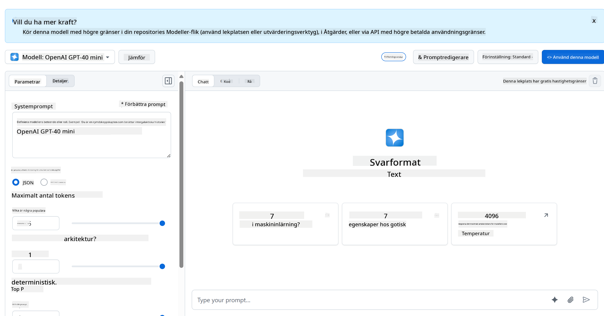
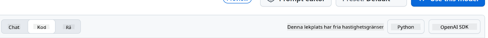
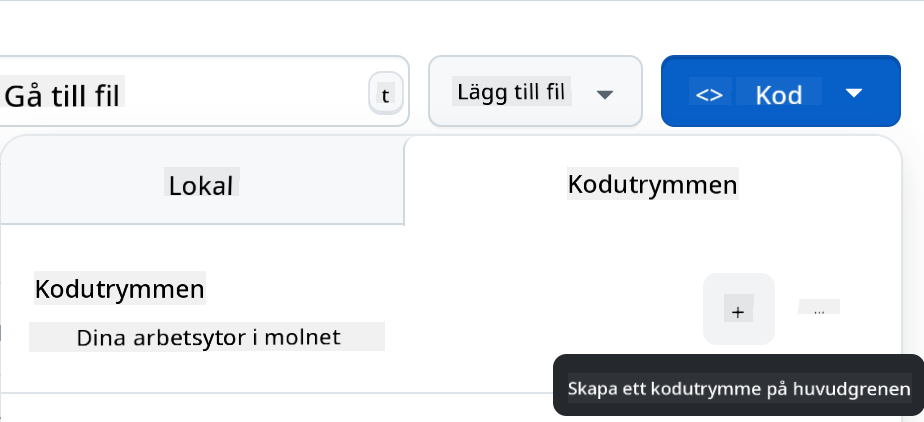

<!--
CO_OP_TRANSLATOR_METADATA:
{
  "original_hash": "11cf36165c243947b6cd85b88cf6faa6",
  "translation_date": "2025-09-01T16:56:06+00:00",
  "source_file": "9-chat-project/README.md",
  "language_code": "sv"
}
-->
# Chattprojekt

Detta chattprojekt visar hur man bygger en Chattassistent med hjälp av GitHub Models.

Så här ser det färdiga projektet ut:


Lite bakgrund, att bygga chattassistenter med generativ AI är ett utmärkt sätt att börja lära sig om AI. Det du kommer att lära dig är att integrera generativ AI i en webbapp under denna lektion, låt oss börja.

## Ansluta till generativ AI

För backend använder vi GitHub Models. Det är en fantastisk tjänst som låter dig använda AI gratis. Gå till dess playground och hämta koden som motsvarar ditt valda backend-språk. Så här ser det ut på [GitHub Models Playground](https://github.com/marketplace/models/azure-openai/gpt-4o-mini/playground)



Som vi nämnde, välj fliken "Code" och din valda runtime. 



### Använda Python

I detta fall väljer vi Python, vilket innebär att vi väljer denna kod:

```python
"""Run this model in Python

> pip install openai
"""
import os
from openai import OpenAI

# To authenticate with the model you will need to generate a personal access token (PAT) in your GitHub settings. 
# Create your PAT token by following instructions here: https://docs.github.com/en/authentication/keeping-your-account-and-data-secure/managing-your-personal-access-tokens
client = OpenAI(
    base_url="https://models.github.ai/inference",
    api_key=os.environ["GITHUB_TOKEN"],
)

response = client.chat.completions.create(
    messages=[
        {
            "role": "system",
            "content": "",
        },
        {
            "role": "user",
            "content": "What is the capital of France?",
        }
    ],
    model="openai/gpt-4o-mini",
    temperature=1,
    max_tokens=4096,
    top_p=1
)

print(response.choices[0].message.content)
```

Låt oss städa upp denna kod lite så att den blir återanvändbar:

```python
def call_llm(prompt: str, system_message: str):
    response = client.chat.completions.create(
        messages=[
            {
                "role": "system",
                "content": system_message,
            },
            {
                "role": "user",
                "content": prompt,
            }
        ],
        model="openai/gpt-4o-mini",
        temperature=1,
        max_tokens=4096,
        top_p=1
    )

    return response.choices[0].message.content
```

Med denna funktion `call_llm` kan vi nu ta en prompt och en systemprompt, och funktionen returnerar resultatet.

### Anpassa AI-assistenten

Om du vill anpassa AI-assistenten kan du specificera hur du vill att den ska bete sig genom att fylla i systemprompten så här:

```python
call_llm("Tell me about you", "You're Albert Einstein, you only know of things in the time you were alive")
```

## Exponera det via ett Web API

Bra, vi har gjort AI-delen, låt oss se hur vi kan integrera det i ett Web API. För Web API väljer vi att använda Flask, men vilket webbframework som helst borde fungera. Låt oss titta på koden för det:

### Använda Python

```python
# api.py
from flask import Flask, request, jsonify
from llm import call_llm
from flask_cors import CORS

app = Flask(__name__)
CORS(app)   # *   example.com

@app.route("/", methods=["GET"])
def index():
    return "Welcome to this API. Call POST /hello with 'message': 'my message' as JSON payload"


@app.route("/hello", methods=["POST"])
def hello():
    # get message from request body  { "message": "do this taks for me" }
    data = request.get_json()
    message = data.get("message", "")

    response = call_llm(message, "You are a helpful assistant.")
    return jsonify({
        "response": response
    })

if __name__ == "__main__":
    app.run(host="0.0.0.0", port=5000)
```

Här skapar vi ett Flask-API och definierar en standardrutt "/" och "/chat". Den senare är tänkt att användas av vår frontend för att skicka frågor till den. 

För att integrera *llm.py* behöver vi göra följande:

- Importera funktionen `call_llm`:

   ```python
   from llm import call_llm
   from flask import Flask, request
   ```

- Anropa den från "/chat"-rutten:

   ```python
   @app.route("/hello", methods=["POST"])
   def hello():
      # get message from request body  { "message": "do this taks for me" }
      data = request.get_json()
      message = data.get("message", "")

      response = call_llm(message, "You are a helpful assistant.")
      return jsonify({
         "response": response
      })
   ```

   Här analyserar vi den inkommande begäran för att hämta egenskapen `message` från JSON-kroppen. Därefter anropar vi LLM med detta anrop:

   ```python
   response = call_llm(message, "You are a helpful assistant")

   # return the response as JSON
   return jsonify({
      "response": response 
   })
   ```

Bra, nu har vi gjort det vi behöver.

## Konfigurera Cors

Vi bör nämna att vi ställer in något som CORS, cross-origin resource sharing. Detta innebär att eftersom vår backend och frontend kommer att köras på olika portar, måste vi tillåta frontenden att anropa backenden. 

### Använda Python

Det finns en kodsnutt i *api.py* som ställer in detta:

```python
from flask_cors import CORS

app = Flask(__name__)
CORS(app)   # *   example.com
```

Just nu är det inställt att tillåta "*" vilket är alla ursprung, och det är lite osäkert. Vi bör begränsa det när vi går till produktion.

## Kör ditt projekt

För att köra ditt projekt behöver du starta din backend först och sedan din frontend.

### Använda Python

Ok, så vi har *llm.py* och *api.py*, hur kan vi få detta att fungera med en backend? Det finns två saker vi behöver göra:

- Installera beroenden:

   ```sh
   cd backend
   python -m venv venv
   source ./venv/bin/activate

   pip install openai flask flask-cors openai
   ```

- Starta API:t

   ```sh
   python api.py
   ```

   Om du är i Codespaces behöver du gå till Ports längst ner i redigeraren, högerklicka på det och klicka på "Port Visibility" och välj "Public".

### Arbeta på en frontend

Nu när vi har ett API igång, låt oss skapa en frontend för detta. En minimal frontend som vi kommer att förbättra stegvis. I en *frontend*-mapp, skapa följande:

```text
backend/
frontend/
index.html
app.js
styles.css
```

Låt oss börja med **index.html**:

```html
<html>
    <head>
        <link rel="stylesheet" href="styles.css">
    </head>
    <body>
      <form>
        <textarea id="messages"></textarea>
        <input id="input" type="text" />
        <button type="submit" id="sendBtn">Send</button>  
      </form>  
      <script src="app.js" />
    </body>
</html>    
```

Ovanstående är det absolut minsta du behöver för att stödja ett chattfönster, eftersom det består av en textarea där meddelanden kommer att visas, ett inputfält för att skriva meddelanden och en knapp för att skicka ditt meddelande till backenden. Låt oss titta på JavaScript i *app.js*.

**app.js**

```js
// app.js

(function(){
  // 1. set up elements  
  const messages = document.getElementById("messages");
  const form = document.getElementById("form");
  const input = document.getElementById("input");

  const BASE_URL = "change this";
  const API_ENDPOINT = `${BASE_URL}/hello`;

  // 2. create a function that talks to our backend
  async function callApi(text) {
    const response = await fetch(API_ENDPOINT, {
      method: "POST",
      headers: { "Content-Type": "application/json" },
      body: JSON.stringify({ message: text })
    });
    let json = await response.json();
    return json.response;
  }

  // 3. add response to our textarea
  function appendMessage(text, role) {
    const el = document.createElement("div");
    el.className = `message ${role}`;
    el.innerHTML = text;
    messages.appendChild(el);
  }

  // 4. listen to submit events
  form.addEventListener("submit", async(e) => {
    e.preventDefault();
   // someone clicked the button in the form
   
   // get input
   const text = input.value.trim();

   appendMessage(text, "user")

   // reset it
   input.value = '';

   const reply = await callApi(text);

   // add to messages
   appendMessage(reply, "assistant");

  })
})();
```

Låt oss gå igenom koden sektion för sektion:

- 1) Här hämtar vi en referens till alla våra element som vi kommer att referera till senare i koden.
- 2) I denna sektion skapar vi en funktion som använder den inbyggda metoden `fetch` för att anropa vår backend.
- 3) `appendMessage` hjälper till att lägga till svar samt vad du som användare skriver.
- 4) Här lyssnar vi på submit-händelsen och läser inmatningsfältet, placerar användarens meddelande i textområdet, anropar API:t och renderar svaret i textområdet.

Låt oss titta på styling härnäst, här kan du verkligen gå loss och få det att se ut som du vill, men här är några förslag:

**styles.css**

```
.message {
    background: #222;
    box-shadow: 0 0 0 10px orange;
    padding: 10px:
    margin: 5px;
}

.message.user {
    background: blue;
}

.message.assistant {
    background: grey;
} 
```

Med dessa tre klasser kommer du att styla meddelanden olika beroende på om de kommer från assistenten eller dig som användare. Om du vill bli inspirerad, kolla in `solution/frontend/styles.css`-mappen.

### Ändra Bas-URL

Det var en sak vi inte satte här och det var `BASE_URL`, detta är inte känt förrän din backend är startad. För att ställa in det:

- Om du kör API:t lokalt bör det ställas in till något som `http://localhost:5000`.
- Om det körs i Codespaces bör det se ut som "[name]app.github.dev".

## Uppgift

Skapa din egen mapp *project* med innehåll som så här:

```text
project/
  frontend/
    index.html
    app.js
    styles.css
  backend/
    ...
```

Kopiera innehållet från det som instruerades ovan men känn dig fri att anpassa det efter din smak.

## Lösning

[Lösning](./solution/README.md)

## Bonus

Försök att ändra AI-assistentens personlighet. 

### För Python

När du anropar `call_llm` i *api.py* kan du ändra det andra argumentet till vad du vill, till exempel:

```python
call_llm(message, "You are Captain Picard")
```

### Frontend

Ändra också CSS och text efter din smak, så gör ändringar i *index.html* och *styles.css*.

## Sammanfattning

Bra, du har lärt dig från grunden hur man skapar en personlig assistent med hjälp av AI. Vi har gjort det med hjälp av GitHub Models, en backend i Python och en frontend i HTML, CSS och JavaScript.

## Ställ in med Codespaces

- Navigera till: [Web Dev For Beginners repo](https://github.com/microsoft/Web-Dev-For-Beginners)
- Skapa från en mall (se till att du är inloggad på GitHub) i det övre högra hörnet:

    

- När du är i ditt repo, skapa en Codespace:

    

    Detta bör starta en miljö som du nu kan arbeta med.

---

**Ansvarsfriskrivning**:  
Detta dokument har översatts med hjälp av AI-översättningstjänsten [Co-op Translator](https://github.com/Azure/co-op-translator). Även om vi strävar efter noggrannhet, bör du vara medveten om att automatiserade översättningar kan innehålla fel eller felaktigheter. Det ursprungliga dokumentet på dess originalspråk bör betraktas som den auktoritativa källan. För kritisk information rekommenderas professionell mänsklig översättning. Vi ansvarar inte för eventuella missförstånd eller feltolkningar som uppstår vid användning av denna översättning.