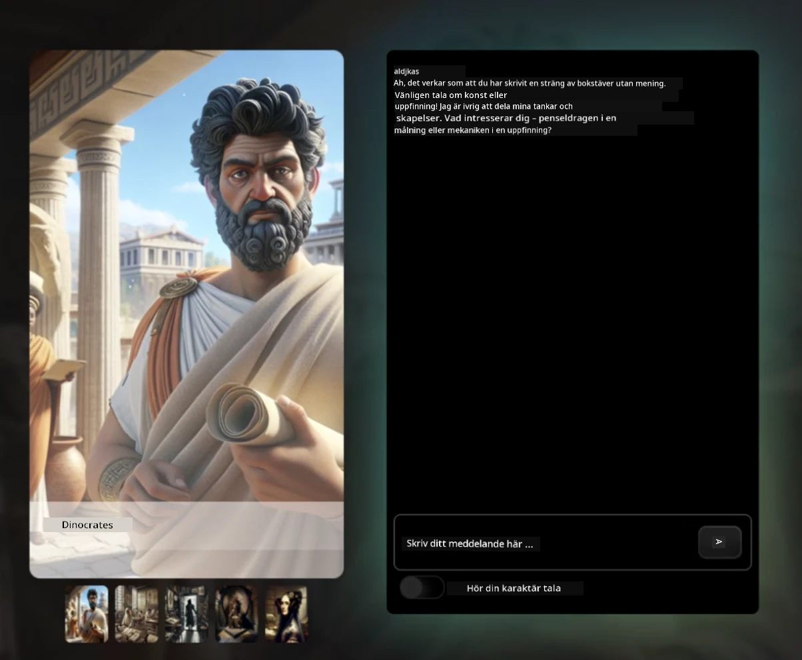
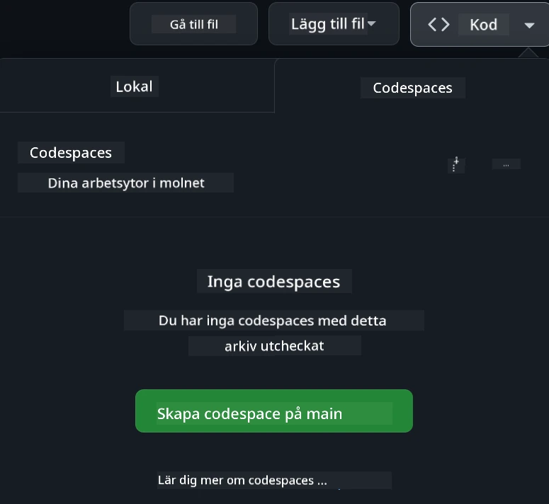

<!--
CO_OP_TRANSLATOR_METADATA:
{
  "original_hash": "fea3a0fceb8ad86fd640c09cf63a2aac",
  "translation_date": "2026-01-06T22:28:24+00:00",
  "source_file": "README.md",
  "language_code": "sv"
}
-->
# Webbutveckling för nybörjare - Ett läroplan

Lär dig grunderna i webbutveckling med vår omfattande 12-veckors kurs av Microsoft Cloud Advocates. Varje av de 24 lektionerna djupdyker i JavaScript, CSS och HTML genom praktiska projekt som terrarier, webbläsartillägg och rymdspel. Delta i quizzer, diskussioner och praktiska uppgifter. Förbättra dina färdigheter och optimera din kunskapsbehållning med vår effektiva projektbaserade pedagogik. Börja din kodningsresa idag!

Gå med i Azure AI Foundry Discord-communityn

Följ dessa steg för att komma igång med dessa resurser:
1. **Forka arkivet**: Klicka [](https://GitHub.com/microsoft/Web-Dev-For-Beginners/fork)
2. **Klona arkivet**:   `git clone https://github.com/microsoft/Web-Dev-For-Beginners.git`
3. [**Gå med i Azure AI Foundry Discord och träffa experter och andra utvecklare**](https://discord.com/invite/ByRwuEEgH4)

### 🌐 Flerspråkigt stöd

#### Stöds via GitHub Action (Automatiserad & Alltid aktuell)

<!-- CO-OP TRANSLATOR LANGUAGES TABLE START -->
[Arabiska](../ar/README.md) | [Bengali](../bn/README.md) | [Bulgariska](../bg/README.md) | [Burmese (Myanmar)](../my/README.md) | [Kinesiska (Förenklad)](../zh/README.md) | [Kinesiska (Traditionell, Hong Kong)](../hk/README.md) | [Kinesiska (Traditionell, Macau)](../mo/README.md) | [Kinesiska (Traditionell, Taiwan)](../tw/README.md) | [Kroatiska](../hr/README.md) | [Tjeckiska](../cs/README.md) | [Danska](../da/README.md) | [Nederländska](../nl/README.md) | [Estniska](../et/README.md) | [Finska](../fi/README.md) | [Franska](../fr/README.md) | [Tyska](../de/README.md) | [Grekiska](../el/README.md) | [Hebreiska](../he/README.md) | [Hindi](../hi/README.md) | [Ungerska](../hu/README.md) | [Indonesiska](../id/README.md) | [Italienska](../it/README.md) | [Japanska](../ja/README.md) | [Kannada](../kn/README.md) | [Koreanska](../ko/README.md) | [Litauiska](../lt/README.md) | [Malajiska](../ms/README.md) | [Malajalam](../ml/README.md) | [Marathi](../mr/README.md) | [Nepalesiska](../ne/README.md) | [Nigeriansk Pidgin](../pcm/README.md) | [Norska](../no/README.md) | [Persiska (Farsi)](../fa/README.md) | [Polska](../pl/README.md) | [Portugisiska (Brasilien)](../br/README.md) | [Portugisiska (Portugal)](../pt/README.md) | [Punjabi (Gurmukhi)](../pa/README.md) | [Rumänska](../ro/README.md) | [Ryska](../ru/README.md) | [Serbiska (Kyrilliska)](../sr/README.md) | [Slovakiska](../sk/README.md) | [Slovenska](../sl/README.md) | [Spanska](../es/README.md) | [Swahili](../sw/README.md) | [Svenska](./README.md) | [Tagalog (Filippinska)](../tl/README.md) | [Tamil](../ta/README.md) | [Telugu](../te/README.md) | [Thailändska](../th/README.md) | [Turkiska](../tr/README.md) | [Ukrainska](../uk/README.md) | [Urdu](../ur/README.md) | [Vietnamesiska](../vi/README.md)

> **Föredrar du att klona lokalt?**

> Detta arkiv inkluderar 50+ språköversättningar som kraftigt ökar nedladdningsstorleken. För att klona utan översättningar, använd sparse checkout:
> ```bash
> git clone --filter=blob:none --sparse https://github.com/microsoft/Web-Dev-For-Beginners.git
> cd Web-Dev-For-Beginners
> git sparse-checkout set --no-cone '/*' '!translations' '!translated_images'
> ```
> Detta ger dig allt du behöver för att slutföra kursen med en mycket snabbare nedladdning.
<!-- CO-OP TRANSLATOR LANGUAGES TABLE END -->

**Om du vill ha ytterligare översättningsspråk stöds de som listas [här](https://github.com/Azure/co-op-translator/blob/main/getting_started/supported-languages.md)**

#### 🧑‍🎓 _Är du student?_

Besök [**Studenthubbsidan**](https://docs.microsoft.com/learn/student-hub/?WT.mc_id=academic-77807-sagibbon) där du hittar resurser för nybörjare, studentpaket och till och med sätt att få ett gratis certifikatkupong. Detta är sidan du vill bokmärka och kolla från tid till annan eftersom vi byter ut innehåll varje månad.

### 📣 Meddelande - Nya utmaningar i GitHub Copilot Agent-läge att slutföra!

Ny utmaning tillagd, leta efter "GitHub Copilot Agent Challenge 🚀" i de flesta kapitel. Det är en ny utmaning för dig att slutföra med hjälp av GitHub Copilot och Agent-läge. Om du inte har använt Agent-läge tidigare kan det inte bara generera text utan också skapa och redigera filer, köra kommandon med mera.

### 📣 Meddelande - _Nytt projekt att bygga med generativ AI_ 

Nytt AI-assistentprojekt just tillagt, kika på det [projekt](./9-chat-project/README.md)

### 📣 Meddelande - _Ny läroplan_ om Generativ AI för JavaScript har precis släppts

Missa inte vår nya läroplan för Generativ AI!

Besök [https://aka.ms/genai-js-course](https://aka.ms/genai-js-course) för att komma igång!


- Lektioner som täcker allt från grunder till RAG.
- Interagera med historiska karaktärer med GenAI och vår följeslagsapp.
- Rolig och engagerande berättelse, du kommer att tidsresande!




Varje lektion inkluderar en uppgift att slutföra, en kunskapskontroll och en utmaning för att guida dig i att lära dig ämnen som:
- Promptning och promptteknik
- Text- och bildappsgenerering
- Sökappar

Besök [https://aka.ms/genai-js-course](../../[https:/aka.ms/genai-js-course) för att komma igång!


## 🌱 Komma igång

> **Lärare**, vi har [inkluderat några förslag](for-teachers.md) på hur man använder denna läroplan. Vi skulle uppskatta din feedback [i vårt diskussionsforum](https://github.com/microsoft/Web-Dev-For-Beginners/discussions/categories/teacher-corner)!

**[Studenter](https://aka.ms/student-page/?WT.mc_id=academic-77807-sagibbon)**, för varje lektion, börja med ett förföreläsningsquiz och fortsätt sedan med att läsa föreläsningsmaterialet, genomföra de olika aktiviteterna och kontrollera din förståelse med efterföreläsningsquizet.

För att förbättra din lärandeupplevelse, anslut med dina kamrater för att arbeta med projekten tillsammans! Diskussioner uppmuntras i vårt [diskussionsforum](https://github.com/microsoft/Web-Dev-For-Beginners/discussions) där vårt team av moderatorer finns tillgängliga för att svara på dina frågor.

För att fördjupa din utbildning rekommenderar vi starkt att utforska [Microsoft Learn](https://learn.microsoft.com/users/wirelesslife/collections/p1ddcy5jwy0jkm?WT.mc_id=academic-77807-sagibbon) för ytterligare studiematerial.

### 📋 Ställa in din miljö

Denna läroplan har en utvecklingsmiljö redo att användas! När du kommer igång kan du välja att köra läroplanen i en [Codespace](https://github.com/features/codespaces/) (_en webbläsarbaserad, inga installationer behövs-miljö_), eller lokalt på din dator med en textredigerare som [Visual Studio Code](https://code.visualstudio.com/?WT.mc_id=academic-77807-sagibbon).

#### Skapa ditt arkiv
För att enkelt kunna spara ditt arbete rekommenderas det att du skapar en egen kopia av detta arkiv. Det kan du göra genom att klicka på **Använd den här mallen**-knappen högst upp på sidan. Detta skapar ett nytt arkiv i ditt GitHub-konto med en kopia av läroplanen.

Följ dessa steg:
1. **Forka arkivet**: Klicka på "Fork"-knappen uppe till höger på den här sidan.
2. **Klona arkivet**:   `git clone https://github.com/microsoft/Web-Dev-For-Beginners.git`

#### Köra läroplanen i en Codespace

I din kopia av detta arkiv som du skapade, klicka på **Code**-knappen och välj **Open with Codespaces**. Detta skapar en ny Codespace för dig att arbeta i.



#### Köra läroplanen lokalt på din dator

För att köra denna läroplan lokalt på din dator behöver du en textredigerare, en webbläsare och ett kommandoradsverktyg. Vår första lektion, [Introduktion till programmeringsspråk och verktyg](../../1-getting-started-lessons/1-intro-to-programming-languages), leder dig genom olika alternativ för var och en av dessa verktyg så att du kan välja det som passar dig bäst.

Vår rekommendation är att använda [Visual Studio Code](https://code.visualstudio.com/?WT.mc_id=academic-77807-sagibbon) som din redigerare, som också har en inbyggd [Terminal](https://code.visualstudio.com/docs/terminal/basics/?WT.mc_id=academic-77807-sagibbon). Du kan ladda ner Visual Studio Code [här](https://code.visualstudio.com/?WT.mc_id=academic-77807-sagibbon).


1. Klona ditt arkiv till din dator. Det kan du göra genom att klicka på **Code**-knappen och kopiera URL:

    [CodeSpace](./images/createcodespace.png)
    Öppna sedan [Terminal](https://code.visualstudio.com/docs/terminal/basics/?WT.mc_id=academic-77807-sagibbon) inom [Visual Studio Code](https://code.visualstudio.com/?WT.mc_id=academic-77807-sagibbon) och kör följande kommando, byt ut `<your-repository-url>` med URL:en du nyss kopierade:

    ```bash 
    git clone <your-repository-url>
    ```

2. Öppna mappen i Visual Studio Code. Du kan göra detta genom att klicka på **File** > **Open Folder** och välja mappen du just klonade.


>  Rekommenderade Visual Studio Code-tillägg:
>
> * [Live Server](https://marketplace.visualstudio.com/items?itemName=ritwickdey.LiveServer&WT.mc_id=academic-77807-sagibbon) – för att förhandsgranska HTML-sidor inom Visual Studio Code
> * [Copilot](https://marketplace.visualstudio.com/items?itemName=GitHub.copilot&WT.mc_id=academic-77807-sagibbon) – för att hjälpa dig skriva kod snabbare

## 📂 Varje lektion innehåller:

- valfri skissanteckning
- valbar kompletterande video
- quiz som förberedelse inför lektionen
- skriftlig lektion
- för projektbaserade lektioner, steg-för-steg guider för hur man bygger projektet
- kunskapskontroller
- en utmaning
- kompletterande läsning
- uppgift
- [quiz efter lektion](https://ff-quizzes.netlify.app/web/)

> **En notis om quiz**: Alla quiz finns i Quiz-app-mappen, totalt 48 quiz med tre frågor i varje. De är tillgängliga [här](https://ff-quizzes.netlify.app/web/) quiz-appen kan köras lokalt eller distribueras till Azure; följ instruktionerna i `quiz-app`-mappen.

## 🗃️ Lektioner

|     |                       Projektets namn                       |                            Inlärda koncept                             | Lärandemål                                                                                                                 |                                                         Länkad lektion                                                          |         Författare          |
| :-: | :---------------------------------------------------------: | :--------------------------------------------------------------------: | -------------------------------------------------------------------------------------------------------------------------- | :----------------------------------------------------------------------------------------------------------------------------: | :-------------------------: |
| 01  |                     Komma igång                            |           Introduktion till programmering och verktyg                 | Lär dig de grundläggande principerna bakom de flesta programspråk och om mjukvara som hjälper professionella utvecklare   | [Intro till programmeringsspråk och verktyg](./1-getting-started-lessons/1-intro-to-programming-languages/README.md)          |         Jasmine             |
| 02  |                     Komma igång                            |             Grunderna i GitHub, inkluderar att arbeta i team          | Hur man använder GitHub i ditt projekt, hur man samarbetar med andra på en kodbas                                        |                            [Intro till GitHub](./1-getting-started-lessons/2-github-basics/README.md)                             |          Floor              |
| 03  |                     Komma igång                            |                             Tillgänglighet                            | Lär dig grunderna i webb-tillgänglighet                                                                                   |                       [Grundläggande tillgänglighet](./1-getting-started-lessons/3-accessibility/README.md)                      |       Christopher           |
| 04  |                        JS Grundläggande                   |                         JavaScript-datatyper                          | Grunderna i JavaScript-datatyper                                                                                          |                                       [Datatyper](./2-js-basics/1-data-types/README.md)                                        |         Jasmine             |
| 05  |                        JS Grundläggande                   |                         Funktioner och metoder                        | Lär dig om funktioner och metoder för att hantera en applikations logik                                                  |                              [Funktioner och metoder](./2-js-basics/2-functions-methods/README.md)                               | Jasmine och Christopher     |
| 06  |                        JS Grundläggande                   |                        Göra beslut med JS                             | Lär dig hur man skapar villkor i din kod med beslutsfattande metoder                                                     |                                 [Göra beslut](./2-js-basics/3-making-decisions/README.md)                                  |         Jasmine             |
| 07  |                        JS Grundläggande                   |                            Arrayer och loopar                         | Arbeta med data med arrayer och loopar i JavaScript                                                                      |                                   [Arrayer och loopar](./2-js-basics/4-arrays-loops/README.md)                                    |         Jasmine             |
| 08  |       [Terrarium](./3-terrarium/solution/README.md)       |                            HTML i praktiken                           | Bygg HTML för att skapa ett online-terrarium, med fokus på att bygga upp en layout                                        |                                 [Intro till HTML](./3-terrarium/1-intro-to-html/README.md)                                      |           Jen               |
| 09  |       [Terrarium](./3-terrarium/solution/README.md)       |                            CSS i praktiken                            | Bygg CSS för att styla det online-terrarium, med fokus på grunderna i CSS inklusive responsiv webbdesign                 |                                  [Intro till CSS](./3-terrarium/2-intro-to-css/README.md)                                      |           Jen               |
| 10  |            [Terrarium](./3-terrarium/solution/README.md)            |                 JavaScript-closures, DOM-manipulation                 | Bygg JavaScript för att göra terrariet till en drag och släpp-gränssnitt, med fokus på closures och DOM-manipulation   |                  [JavaScript-closures, DOM-manipulation](./3-terrarium/3-intro-to-DOM-and-closures/README.md)                   |           Jen               |
| 11  |          [Skrivspel](./4-typing-game/solution/README.md)          |                          Bygg ett skrivspel                           | Lär dig använda tangentbords-händelser för att styra logiken i din JavaScript-applikation                               |                                [Händelsestyrd programmering](./4-typing-game/typing-game/README.md)                              |       Christopher           |
| 12  | [Green Browser Extension](./5-browser-extension/solution/README.md) |                         Arbeta med webbläsare                          | Lär dig hur webbläsare fungerar, deras historia och hur man bygger upp de första elementen i en webbläsarförlängning  |                               [Om webbläsare](./5-browser-extension/1-about-browsers/README.md)                                  |           Jen               |
| 13  | [Green Browser Extension](./5-browser-extension/solution/README.md) | Bygga ett formulär, anropa API och lagra variabler i lokal lagring    | Bygg JavaScript-elementen i din webbläsarförlängning för att anropa ett API med variabler lagrade i lokal lagring       |                [API, formulär och lokal lagring](./5-browser-extension/2-forms-browsers-local-storage/README.md)                 |           Jen               |
| 14  | [Green Browser Extension](./5-browser-extension/solution/README.md) |          Bakgrundsprocesser i webbläsare, webbprestanda               | Använd webbläsarens bakgrundsprocesser för att hantera förlängningens ikon; lär dig om webbprestanda och optimeringar   |             [Bakgrundsuppgifter och prestanda](./5-browser-extension/3-background-tasks-and-performance/README.md)              |           Jen               |
| 15  |           [Rymdspel](./6-space-game/solution/README.md)           |             Mer avancerad spelutveckling med JavaScript               | Lär dig om arv med både klasser och komposition samt Pub/Sub-mönstret, som förberedelse för att bygga ett spel          |                      [Introduktion till avancerad spelutveckling](./6-space-game/1-introduction/README.md)                       |          Chris              |
| 16  |           [Rymdspel](./6-space-game/solution/README.md)           |                           Rita på canvas                              | Lär dig om Canvas API, som används för att rita element på en skärm                                                       |                                [Rita på Canvas](./6-space-game/2-drawing-to-canvas/README.md)                                  |          Chris              |
| 17  |           [Rymdspel](./6-space-game/solution/README.md)           |                   Flytta element runt på skärmen                      | Upptäck hur element kan få rörelse med hjälp av kartesiska koordinater och Canvas API                                     |                           [Flytta element runt](./6-space-game/3-moving-elements-around/README.md)                               |          Chris              |
| 18  |           [Rymdspel](./6-space-game/solution/README.md)           |                          Kollisionsdetektion                          | Få element att kollidera och reagera på varandra med knapptryckningar samt tillhandahåll en cooldown-funktion för spelets prestanda |                              [Kollisionsdetektion](./6-space-game/4-collision-detection/README.md)                              |          Chris              |
| 19  |           [Rymdspel](./6-space-game/solution/README.md)           |                             Poängräkning                              | Gör matematiska beräkningar baserade på spelets status och prestation                                                   |                                    [Poängräkning](./6-space-game/5-keeping-score/README.md)                                    |          Chris              |
| 20  |           [Rymdspel](./6-space-game/solution/README.md)           |                     Avsluta och starta om spelet                      | Lär dig om att avsluta och starta om spelet, inklusive att städa upp resurser och återställa variabelvärden               |                                [Avslutningsvillkor](./6-space-game/6-end-condition/README.md)                                     |          Chris              |
| 21  |         [Bankapp](./7-bank-project/solution/README.md)          |                 HTML-mallar och rutter i en webbapp                  | Lär dig skapa grunden för en webbplats arkitektur med routing och HTML-mallar                                             |                            [HTML-mallar och rutter](./7-bank-project/1-template-route/README.md)                               |          Yohan              |
| 22  |         [Bankapp](./7-bank-project/solution/README.md)          |                  Bygg ett inloggnings- och registreringsformulär     | Lär dig om att bygga formulär och hantera valideringsrutiner                                                            |                                           [Formulär](./7-bank-project/2-forms/README.md)                                       |          Yohan              |
| 23  |         [Bankapp](./7-bank-project/solution/README.md)          |                   Metoder för att hämta och använda data             | Hur data flödar in och ut ur din app, hur man hämtar, lagrar och rensar den                                             |                                            [Data](./7-bank-project/3-data/README.md)                                          |          Yohan              |
| 24  |         [Bankapp](./7-bank-project/solution/README.md)          |                      Begrepp inom tillståndshantering                | Lär dig hur din app behåller state och hur du hanterar det programmatiskt                                               |                                [Tillståndshantering](./7-bank-project/4-state-management/README.md)                            |          Yohan              |
| 25 | [Browser/VScode-kod](../../8-code-editor) | Arbeta med VScode | Lär dig använda en kodredigerare | [Använd VScode Code Editor](./8-code-editor/1-using-a-code-editor/README.md) | Chris |
| 26 | [AI Assistenter](./9-chat-project/README.md) | Arbeta med AI | Lär dig bygga din egen AI-assistent | [AI Assistant project](./9-chat-project/README.md) | Chris |

## 🏫 Pedagogik

Vår läroplan är utformad med två viktiga pedagogiska principer i åtanke:
* projektbaserat lärande
* frekventa quiz

Programmet lär ut grunderna i JavaScript, HTML och CSS, samt de senaste verktygen och teknikerna som dagens webbutvecklare använder. Studenter kommer att få möjlighet att utveckla praktisk erfarenhet genom att bygga ett skrivspel, ett virtuellt terrarium, en miljövänlig webbläsarförlängning, ett rymdinvasions-spel och en bankapp för företag. I slutet av serien kommer studenterna att ha fått en gedigen förståelse för webbprogrammering.

> 🎓 Du kan ta de första lektionerna i denna läroplan som en [Learn Path](https://docs.microsoft.com/learn/paths/web-development-101/?WT.mc_id=academic-77807-sagibbon) på Microsoft Learn!

Genom att säkerställa att innehållet stämmer överens med projekten blir processen mer engagerande för studenterna och möjligheten att behålla koncepten ökar. Vi skrev också flera inledande lektioner i JavaScript-grunder för att introducera koncept, tillsammans med en video från "[Beginners Series to: JavaScript](https://channel9.msdn.com/Series/Beginners-Series-to-JavaScript/?WT.mc_id=academic-77807-sagibbon)" samling av videotutorials, där några av författarna bidrog till denna läroplan.

Dessutom sätter ett lågrisk-quiz före en lektion studentens intention att lära sig ett ämne, medan ett andra quiz efter lektionen säkerställer ytterligare retention. Denna läroplan är designad för att vara flexibel och rolig och kan tas i sin helhet eller delvis. Projekten börjar smått och blir allt mer komplexa fram till slutet av en 12-veckors cykel.

Medan vi medvetet undvikit att introducera JavaScript-ramverk för att fokusera på de grundläggande färdigheter som behövs som webbutvecklare innan man tar till ett ramverk, är ett bra nästa steg efter att ha slutfört denna läroplan att lära sig om Node.js via en annan videosamling: "[Beginner Series to: Node.js](https://channel9.msdn.com/Series/Beginners-Series-to-Nodejs/?WT.mc_id=academic-77807-sagibbon)".

> Besök våra riktlinjer för [uppförandekod](CODE_OF_CONDUCT.md) och [bidragande](CONTRIBUTING.md). Vi välkomnar din konstruktiva feedback!


## 🧭 Obegränsad åtkomst offline

Du kan köra denna dokumentation offline genom att använda [Docsify](https://docsify.js.org/#/). Forka detta repo, [installera Docsify](https://docsify.js.org/#/quickstart) på din lokala maskin och skriv sedan i rotmappen för detta repo `docsify serve`. Webbplatsen kommer att serveras på port 3000 på din lokala dator: `localhost:3000`.

## 📘 PDF

En PDF med alla lektioner finns [här](https://microsoft.github.io/Web-Dev-For-Beginners/pdf/readme.pdf).


## 🎒 Andra kurser
Vårt team producerar andra kurser! Kolla in:

<!-- CO-OP TRANSLATOR OTHER COURSES START -->
### LangChain
[](https://aka.ms/langchain4j-for-beginners)
[](https://aka.ms/langchainjs-for-beginners?WT.mc_id=m365-94501-dwahlin)

---

### Azure / Edge / MCP / Agenter
[](https://github.com/microsoft/AZD-for-beginners?WT.mc_id=academic-105485-koreyst)
[](https://github.com/microsoft/edgeai-for-beginners?WT.mc_id=academic-105485-koreyst)
[](https://github.com/microsoft/mcp-for-beginners?WT.mc_id=academic-105485-koreyst)
[](https://github.com/microsoft/ai-agents-for-beginners?WT.mc_id=academic-105485-koreyst)

---
 
### Generativ AI-serie
[](https://github.com/microsoft/generative-ai-for-beginners?WT.mc_id=academic-105485-koreyst)
[-9333EA?style=for-the-badge&labelColor=E5E7EB&color=9333EA)](https://github.com/microsoft/Generative-AI-for-beginners-dotnet?WT.mc_id=academic-105485-koreyst)
[-C084FC?style=for-the-badge&labelColor=E5E7EB&color=C084FC)](https://github.com/microsoft/generative-ai-for-beginners-java?WT.mc_id=academic-105485-koreyst)
[-E879F9?style=for-the-badge&labelColor=E5E7EB&color=E879F9)](https://github.com/microsoft/generative-ai-with-javascript?WT.mc_id=academic-105485-koreyst)

---
 
### Kärninlärning
[](https://aka.ms/ml-beginners?WT.mc_id=academic-105485-koreyst)
[](https://aka.ms/datascience-beginners?WT.mc_id=academic-105485-koreyst)
[](https://aka.ms/ai-beginners?WT.mc_id=academic-105485-koreyst)
[](https://github.com/microsoft/Security-101?WT.mc_id=academic-96948-sayoung)
[](https://aka.ms/webdev-beginners?WT.mc_id=academic-105485-koreyst)
[](https://aka.ms/iot-beginners?WT.mc_id=academic-105485-koreyst)
[](https://github.com/microsoft/xr-development-for-beginners?WT.mc_id=academic-105485-koreyst)

---
 
### Copilot-serie
[](https://aka.ms/GitHubCopilotAI?WT.mc_id=academic-105485-koreyst)
[](https://github.com/microsoft/mastering-github-copilot-for-dotnet-csharp-developers?WT.mc_id=academic-105485-koreyst)
[](https://github.com/microsoft/CopilotAdventures?WT.mc_id=academic-105485-koreyst)
<!-- CO-OP TRANSLATOR OTHER COURSES END -->

## Få hjälp

Om du fastnar eller har frågor om att bygga AI-appar. Gå med i diskussioner om MCP med andra lärande och erfarna utvecklare. Det är en stödjande gemenskap där frågor är välkomna och kunskap delas fritt.

[](https://discord.gg/nTYy5BXMWG)

Om du har produktfeedback eller stöter på fel när du bygger, besök:

[](https://aka.ms/foundry/forum)

## Licens

Detta förråd är licensierat under MIT-licensen. Se filen [LICENSE](../../LICENSE) för mer information.

---

<!-- CO-OP TRANSLATOR DISCLAIMER START -->
**Ansvarsfriskrivning**:
Detta dokument har översatts med hjälp av AI-översättningstjänsten [Co-op Translator](https://github.com/Azure/co-op-translator). Vi strävar efter noggrannhet, men var medveten om att automatiska översättningar kan innehålla fel eller brister. Det ursprungliga dokumentet på dess modersmål bör betraktas som den auktoritativa källan. För viktig information rekommenderas professionell mänsklig översättning. Vi ansvarar inte för några missförstånd eller feltolkningar som uppstår till följd av användningen av denna översättning.
<!-- CO-OP TRANSLATOR DISCLAIMER END -->