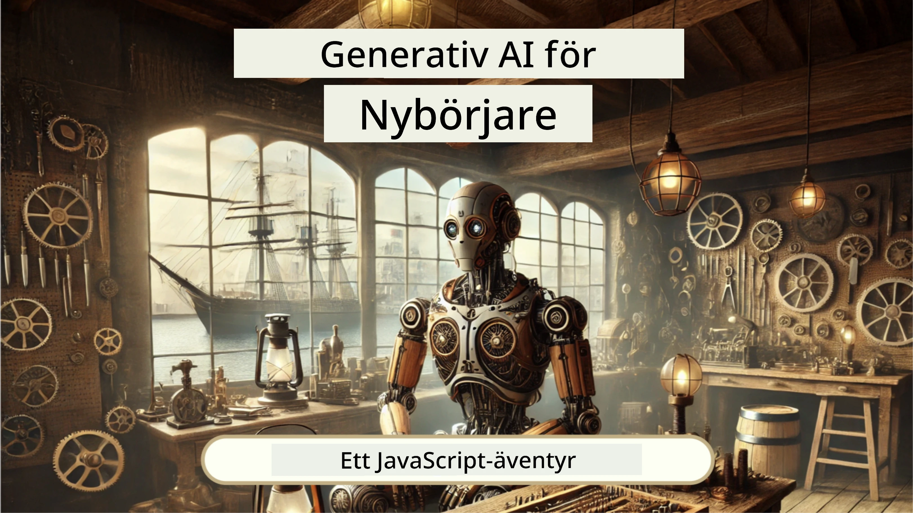
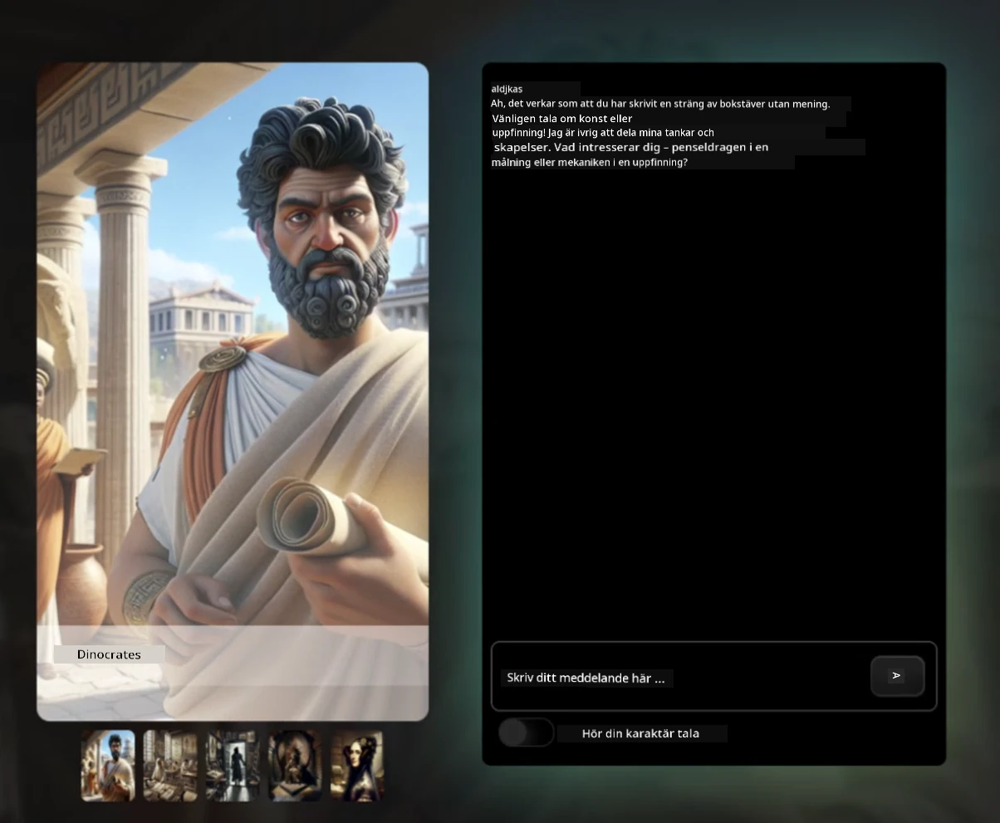
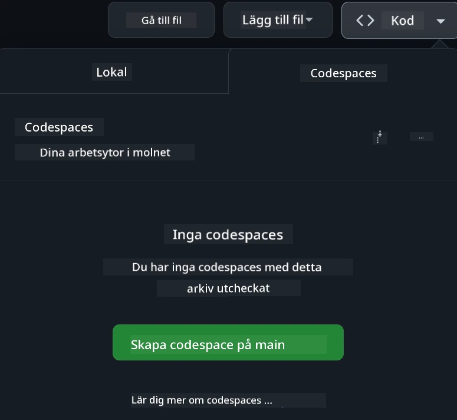

[](https://github.com/microsoft/Web-Dev-For-Beginners/blob/master/LICENSE)
[](https://GitHub.com/microsoft/Web-Dev-For-Beginners/graphs/contributors/)
[](https://GitHub.com/microsoft/Web-Dev-For-Beginners/issues/)
[](https://GitHub.com/microsoft/Web-Dev-For-Beginners/pulls/)
[](http://makeapullrequest.com) 

[](https://GitHub.com/microsoft/Web-Dev-For-Beginners/watchers/)
[](https://GitHub.com/microsoft/Web-Dev-For-Beginners/network/)
[](https://GitHub.com/microsoft/Web-Dev-For-Beginners/stargazers/)

[](https://discord.gg/nTYy5BXMWG)

# Webbplatsutveckling för nybörjare - En läroplan

Lär dig grunderna i webbplatsutveckling med vår 12-veckors omfattande kurs av Microsoft Cloud Advocates. Varje av de 24 lektionerna går på djupet i JavaScript, CSS och HTML genom praktiska projekt som terrarier, webbläsartillägg och rymdspel. Engagera dig i quiz, diskussioner och praktiska uppgifter. Förbättra dina färdigheter och optimera din kunskapsbehållning med vår effektiva projektbaserade pedagogik. Starta din kodningsresa idag!

Gå med i Azure AI Foundry Discord Community

[](https://discord.gg/nTYy5BXMWG)

Följ dessa steg för att komma igång med att använda dessa resurser:
1. **Fork:a repot**: Klicka [](https://GitHub.com/microsoft/Web-Dev-For-Beginners/fork)
2. **Klona repot**:   `git clone https://github.com/microsoft/Web-Dev-For-Beginners.git`
3. [**Gå med i Azure AI Foundry Discord och träffa experter och andra utvecklare**](https://discord.com/invite/ByRwuEEgH4)

### 🌐 Flerspråkigt stöd

#### Stöds via GitHub Action (Automatiserat & Alltid Uppdaterat)

<!-- CO-OP TRANSLATOR LANGUAGES TABLE START -->
[Arabic](../ar/README.md) | [Bengali](../bn/README.md) | [Bulgarian](../bg/README.md) | [Burmese (Myanmar)](../my/README.md) | [Chinese (Simplified)](../zh-CN/README.md) | [Chinese (Traditional, Hong Kong)](../zh-HK/README.md) | [Chinese (Traditional, Macau)](../zh-MO/README.md) | [Chinese (Traditional, Taiwan)](../zh-TW/README.md) | [Croatian](../hr/README.md) | [Czech](../cs/README.md) | [Danish](../da/README.md) | [Dutch](../nl/README.md) | [Estonian](../et/README.md) | [Finnish](../fi/README.md) | [French](../fr/README.md) | [German](../de/README.md) | [Greek](../el/README.md) | [Hebrew](../he/README.md) | [Hindi](../hi/README.md) | [Hungarian](../hu/README.md) | [Indonesian](../id/README.md) | [Italian](../it/README.md) | [Japanese](../ja/README.md) | [Kannada](../kn/README.md) | [Khmer](../km/README.md) | [Korean](../ko/README.md) | [Lithuanian](../lt/README.md) | [Malay](../ms/README.md) | [Malayalam](../ml/README.md) | [Marathi](../mr/README.md) | [Nepali](../ne/README.md) | [Nigerian Pidgin](../pcm/README.md) | [Norwegian](../no/README.md) | [Persian (Farsi)](../fa/README.md) | [Polish](../pl/README.md) | [Portuguese (Brazil)](../pt-BR/README.md) | [Portuguese (Portugal)](../pt-PT/README.md) | [Punjabi (Gurmukhi)](../pa/README.md) | [Romanian](../ro/README.md) | [Russian](../ru/README.md) | [Serbian (Cyrillic)](../sr/README.md) | [Slovak](../sk/README.md) | [Slovenian](../sl/README.md) | [Spanish](../es/README.md) | [Swahili](../sw/README.md) | [Swedish](./README.md) | [Tagalog (Filipino)](../tl/README.md) | [Tamil](../ta/README.md) | [Telugu](../te/README.md) | [Thai](../th/README.md) | [Turkish](../tr/README.md) | [Ukrainian](../uk/README.md) | [Urdu](../ur/README.md) | [Vietnamese](../vi/README.md)

> **Föredrar du att klona lokalt?**
>
> Detta repo inkluderar 50+ språköversättningar vilket avsevärt ökar storleken på nedladdningen. För att klona utan översättningar, använd sparsamt incheckning:
>
> **Bash / macOS / Linux:**
> ```bash
> git clone --filter=blob:none --sparse https://github.com/microsoft/Web-Dev-For-Beginners.git
> cd Web-Dev-For-Beginners
> git sparse-checkout set --no-cone '/*' '!translations' '!translated_images'
> ```
>
> **CMD (Windows):**
> ```cmd
> git clone --filter=blob:none --sparse https://github.com/microsoft/Web-Dev-For-Beginners.git
> cd Web-Dev-For-Beginners
> git sparse-checkout set --no-cone "/*" "!translations" "!translated_images"
> ```
>
> Detta ger dig allt du behöver för att slutföra kursen med en mycket snabbare nedladdning.
<!-- CO-OP TRANSLATOR LANGUAGES TABLE END -->

**Om du önskar stöd för flera översättningsspråk finns listade [här](https://github.com/Azure/co-op-translator/blob/main/getting_started/supported-languages.md)**

[](https://open.vscode.dev/microsoft/Web-Dev-For-Beginners)

#### 🧑‍🎓 _Är du student?_

Besök [**Student Hub-sidan**](https://docs.microsoft.com/learn/student-hub/?WT.mc_id=academic-77807-sagibbon) där du hittar nybörjarresurser, studentpaket och till och med sätt att få en gratis certifikatkupong. Detta är sidan du vill bokmärka och kolla av med jämna mellanrum eftersom vi byter ut innehåll varje månad.

### 📣 Tillkännagivande - Nya GitHub Copilot Agent-läges utmaningar att slutföra!

Ny utmaning tillagd, leta efter "GitHub Copilot Agent Challenge 🚀" i de flesta kapitel. Det är en ny utmaning för dig att klara av med GitHub Copilot och Agent-läge. Om du inte har använt Agent-läget tidigare kan det inte bara generera text utan också skapa och redigera filer, köra kommandon med mera.

### 📣 Tillkännagivande - _Nytt projekt att bygga med Generativ AI_

Nytt AI Assistant-projekt precis tillagt, kolla in det [projekt](./9-chat-project/README.md)

### 📣 Tillkännagivande - _Ny läroplan_ för Generativ AI för JavaScript har just släppts

Missa inte vår nya läroplan för Generativ AI!

Besök [https://aka.ms/genai-js-course](https://aka.ms/genai-js-course) för att komma igång!



- Lektioner som täcker allt från grunder till RAG.
- Interagera med historiska karaktärer med GenAI och vår följeslagar-app.
- Roligt och engagerande berättande, du kommer att tidsresa!




Varje lektion inkluderar en uppgift att slutföra, en kunskapskontroll och en utmaning för att guida dig i ämnen som:
- Prompting och prompt-engineering
- Text- och bildappsgenerering
- Sökningsappar

Besök [https://aka.ms/genai-js-course](https://aka.ms/genai-js-course) för att komma igång!


## 🌱 Komma igång

> **Lärare**, vi har [inkluderat några förslag](for-teachers.md) på hur man kan använda denna läroplan. Vi vill gärna ha din feedback [i vårt diskussionsforum](https://github.com/microsoft/Web-Dev-For-Beginners/discussions/categories/teacher-corner)!

**[Studenter](https://aka.ms/student-page/?WT.mc_id=academic-77807-sagibbon)**, för varje lektion, börja med ett för-quiz och fortsätt sedan med att läsa lektionsmaterialet, slutföra olika aktiviteter och kontrollera din förståelse med efter-quizet.

För att förbättra din lärandeupplevelse, koppla ihop dig med dina kamrater för att arbeta på projekten tillsammans! Diskussioner uppmuntras i vårt [diskussionsforum](https://github.com/microsoft/Web-Dev-For-Beginners/discussions) där vårt team av moderatorer kommer att finnas tillgängliga för att svara på dina frågor.

För att fördjupa din utbildning rekommenderar vi starkt att du utforskar [Microsoft Learn](https://learn.microsoft.com/users/wirelesslife/collections/p1ddcy5jwy0jkm?WT.mc_id=academic-77807-sagibbon) för ytterligare studiematerial.

### 📋 Sätta upp din miljö

Denna läroplan har en utvecklingsmiljö klar att använda! När du kommer igång kan du välja att köra läroplanen i en [Codespace](https://github.com/features/codespaces/) (_en webbläsarbaserad miljö utan krav på installation_), eller lokalt på din dator med en textredigerare som [Visual Studio Code](https://code.visualstudio.com/?WT.mc_id=academic-77807-sagibbon).

#### Skapa ditt arkiv
För att du enkelt ska kunna spara ditt arbete rekommenderas det att du skapar en egen kopia av detta arkiv. Det kan du göra genom att klicka på knappen **Use this template** högst upp på sidan. Detta skapar ett nytt arkiv på ditt GitHub-konto med en kopia av läroplanen.

Följ dessa steg:
1. **Fork:a arkivet**: Klicka på "Fork"-knappen i övre högra hörnet på denna sida.
2. **Klona arkivet**:   `git clone https://github.com/microsoft/Web-Dev-For-Beginners.git`

#### Köra läroplanen i en Codespace

I din kopia av detta arkiv som du skapade, klicka på **Code**-knappen och välj **Open with Codespaces**. Detta kommer att skapa en ny Codespace för dig att arbeta i.



#### Köra läroplanen lokalt på din dator

För att köra denna läroplan lokalt på din dator behöver du en textredigerare, en webbläsare och ett kommandoradsverktyg. Vår första lektion, [Introduktion till programmeringsspråk och verktyg](../../1-getting-started-lessons/1-intro-to-programming-languages), kommer att guida dig genom olika alternativ för varje verktyg så att du kan välja det som passar dig bäst.

Vår rekommendation är att använda [Visual Studio Code](https://code.visualstudio.com/?WT.mc_id=academic-77807-sagibbon) som din redigerare, som också har en inbyggd [Terminal](https://code.visualstudio.com/docs/terminal/basics/?WT.mc_id=academic-77807-sagibbon). Du kan ladda ner Visual Studio Code [här](https://code.visualstudio.com/?WT.mc_id=academic-77807-sagibbon).
1. Klona ditt repository till din dator. Du kan göra detta genom att klicka på **Code**-knappen och kopiera URL:en:

    [CodeSpace](./images/createcodespace.png)

    Öppna sedan [Terminal](https://code.visualstudio.com/docs/terminal/basics/?WT.mc_id=academic-77807-sagibbon) i [Visual Studio Code](https://code.visualstudio.com/?WT.mc_id=academic-77807-sagibbon) och kör följande kommando, ersätt `<your-repository-url>` med URL:en du precis kopierade:

    ```bash 
    git clone <your-repository-url>
    ```

2. Öppna mappen i Visual Studio Code. Du kan göra detta genom att klicka på **File** > **Open Folder** och välja den mapp du just klonade.


>  Rekommenderade Visual Studio Code-tillägg:
>
> * [Live Server](https://marketplace.visualstudio.com/items?itemName=ritwickdey.LiveServer&WT.mc_id=academic-77807-sagibbon) - för att förhandsgranska HTML-sidor inom Visual Studio Code
> * [Copilot](https://marketplace.visualstudio.com/items?itemName=GitHub.copilot&WT.mc_id=academic-77807-sagibbon) - för att hjälpa dig skriva kod snabbare

## 📂 Varje lektion innehåller:

- valfri sketchnote
- valfri kompletterande video
- uppvärmningsquiz före lektionen
- skriftlig lektion
- steg-för-steg guider för projektbaserade lektioner om hur man bygger projektet
- kunskapskontroller
- en utmaning
- kompletterande läsning
- uppgift
- [quiz efter lektionen](https://ff-quizzes.netlify.app/web/)

> **En notis om quiz**: Alla quiz finns i Quiz-app mappen, totalt 48 quiz med tre frågor vardera. De finns tillgängliga [här](https://ff-quizzes.netlify.app/web/). Quiz-appen kan köras lokalt eller distribueras till Azure; följ instruktionerna i `quiz-app` mappen.

## 🗃️ Lektioner

|     |                       Projektnamn                        |                            Undervisade Begrepp                           | Läromål                                                                                                                          |                                                          Länkad lektion                                                          |          Författare          |
| :-: | :------------------------------------------------------: | :----------------------------------------------------------------------: | -------------------------------------------------------------------------------------------------------------------------------- | :-----------------------------------------------------------------------------------------------------------------------------: | :-------------------------: |
| 01  |                     Komma igång                          |           Introduktion till programmering och verktyg                    | Lära sig grunderna bakom de flesta programmeringsspråk och om programvara som hjälper professionella utvecklare i deras arbete | [Intro till programmeringsspråk och verktyg](./1-getting-started-lessons/1-intro-to-programming-languages/README.md)           |           Jasmine           |
| 02  |                     Komma igång                          |             Grunderna i GitHub, inklusive samarbete i team               | Hur man använder GitHub i ditt projekt och samarbetar med andra på en kodbas                                                    |                             [Introduktion till GitHub](./1-getting-started-lessons/2-github-basics/README.md)                      |            Floor            |
| 03  |                     Komma igång                          |                             Tillgänglighet                               | Lära sig grunderna i webbtillgänglighet                                                                                          |                        [Grundläggande tillgänglighet](./1-getting-started-lessons/3-accessibility/README.md)                      |         Christopher         |
| 04  |                        JS Grunder                        |                         JavaScript-datatyper                            | Grunderna för JavaScript datatyper                                                                                                |                                     [Datatyper](./2-js-basics/1-data-types/README.md)                                             |           Jasmine           |
| 05  |                        JS Grunder                        |                         Funktioner och Metoder                           | Lära sig om funktioner och metoder för att hantera en applikations logik                                                        |                                  [Funktioner och Metoder](./2-js-basics/2-functions-methods/README.md)                            |     Jasmine och Christopher |
| 06  |                        JS Grunder                        |                        Beslutsfattande med JS                            | Lära sig skapa villkor i koden med beslutsfattandemetoder                                                                       |                                    [Beslutsfattande](./2-js-basics/3-making-decisions/README.md)                                 |           Jasmine           |
| 07  |                        JS Grunder                        |                           Arrayer och Loopar                            | Arbeta med data genom arrayer och loopar i JavaScript                                                                           |                                      [Arrayer och Loopar](./2-js-basics/4-arrays-loops/README.md)                                |           Jasmine           |
| 08  |       [Terrarium](./3-terrarium/solution/README.md)       |                           HTML i praktiken                              | Bygga HTML för att skapa ett online-terrarium, med fokus på layoutbygge                                                         |                                    [Introduktion till HTML](./3-terrarium/1-intro-to-html/README.md)                              |             Jen             |
| 09  |       [Terrarium](./3-terrarium/solution/README.md)       |                            CSS i praktiken                              | Bygga CSS för att styla online-terrarium, med fokus på grundläggande CSS och responsiv design                                   |                                     [Introduktion till CSS](./3-terrarium/2-intro-to-css/README.md)                               |             Jen             |
| 10  |            [Terrarium](./3-terrarium/solution/README.md)            |                JavaScript closures och DOM-manipulation                | Bygga JavaScript för att göra terrariet funktionellt med drag/drop, med fokus på closures och DOM-manipulation                  |                [JavaScript closures och DOM-manipulation](./3-terrarium/3-intro-to-DOM-and-closures/README.md)                  |             Jen             |
| 11  |          [Typing Game](./4-typing-game/solution/README.md)          |                         Bygga ett skrivspel                            | Lära sig använda tangentbords-händelser för att driva logiken i JavaScript-appen                                                |                               [Händelsestyrd programmering](./4-typing-game/typing-game/README.md)                              |         Christopher         |
| 12  | [Grönt webbläsartillägg](./5-browser-extension/solution/README.md) |                     Arbeta med webbläsare                              | Lära sig hur webbläsare fungerar, deras historia och bygga de första elementen i en tillägg                                      |                                [Om webbläsare](./5-browser-extension/1-about-browsers/README.md)                               |             Jen             |
| 13  | [Grönt webbläsartillägg](./5-browser-extension/solution/README.md) | Bygga ett formulär, anropa API och lagra variabler i lokal lagring     | Bygga JavaScript-elementen i ditt tillägg för att anropa ett API med variabler sparade i lokal lagring                           |                         [API:er, formulär och lokal lagring](./5-browser-extension/2-forms-browsers-local-storage/README.md)       |             Jen             |
| 14  | [Grönt webbläsartillägg](./5-browser-extension/solution/README.md) |     Bakgrundsprocesser i webbläsaren, webbprestanda                    | Använd webbläsarens bakgrundsprocesser för att hantera tilläggets ikon; lära sig om webbprestanda och optimeringar             |                    [Bakgrundsprocesser och prestanda](./5-browser-extension/3-background-tasks-and-performance/README.md)      |             Jen             |
| 15  |           [Rymdspel](./6-space-game/solution/README.md)           |             Mer avancerad spelutveckling med JavaScript                | Lära sig om arv med både klasser och komposition och Pub/Sub-mönstret inför spelbyggande                                         |                    [Introduktion till avancerad spelutveckling](./6-space-game/1-introduction/README.md)                        |            Chris            |
| 16  |           [Rymdspel](./6-space-game/solution/README.md)           |                           Rita på canvas                               | Lära sig om Canvas API, som används för att rita element på en skärm                                                             |                                [Rita på canvas](./6-space-game/2-drawing-to-canvas/README.md)                                   |            Chris            |
| 17  |           [Rymdspel](./6-space-game/solution/README.md)           |                  Flytta element runt på skärmen                       | Upptäck hur element kan få rörelse med hjälp av kartesiska koordinater och Canvas API                                           |                         [Flytta element runt](./6-space-game/3-moving-elements-around/README.md)                                 |            Chris            |
| 18  |           [Rymdspel](./6-space-game/solution/README.md)           |                         Kollisiondetektion                            | Få element att kollidera och reagera på varandra med knapptryckningar och ge en cooldown-funktion för att säkerställa prestanda  |                            [Kollisiondetektion](./6-space-game/4-collision-detection/README.md)                                 |            Chris            |
| 19  |           [Rymdspel](./6-space-game/solution/README.md)           |                           Hålla poäng                                   | Utför matematiska beräkningar baserat på spelets status och prestation                                                           |                                       [Hålla poäng](./6-space-game/5-keeping-score/README.md)                                  |            Chris            |
| 20  |           [Rymdspel](./6-space-game/solution/README.md)           |                  Avsluta och starta om spelet                          | Lära sig om att avsluta och starta om spelet, inklusive städning av resurser och återställning av variabler                      |                                [Avslutningsvillkor](./6-space-game/6-end-condition/README.md)                                  |            Chris            |
| 21  |         [Bankapp](./7-bank-project/solution/README.md)          |           HTML-mallar och rutthantering i en webbapp                  | Lära sig skapa stommen för en flersidig webbplats arkitektur med routing och HTML-mallar                                         |                            [HTML-mallar och routing](./7-bank-project/1-template-route/README.md)                               |            Yohan            |
| 22  |         [Bankapp](./7-bank-project/solution/README.md)          |                Bygga inloggning och registreringsformulär              | Lära sig bygga formulär och hantera valideringsrutiner                                                                            |                                           [Formulär](./7-bank-project/2-forms/README.md)                                  |            Yohan            |
| 23  |         [Bankapp](./7-bank-project/solution/README.md)          |               Metoder för att hämta och använda data                   | Hur data flödar in och ut ur appen, hur man hämtar, sparar och gör sig av med den                                                |                                           [Data](./7-bank-project/3-data/README.md)                                     |            Yohan            |
| 24  |         [Bankapp](./7-bank-project/solution/README.md)          |                        Begrepp för state-hantering                     | Lära sig hur appen behåller state och hur man hanterar detta programmässigt                                                     |                                [State-hantering](./7-bank-project/4-state-management/README.md)                                 |            Yohan            |
| 25  | [Browser/VScode Code](../../8-code-editor) | Arbeta med VScode | Lära dig använda en kodeditor | [Använd VScode Code Editor](./8-code-editor/1-using-a-code-editor/README.md) | Chris |
| 26  | [AI Assistants](./9-chat-project/README.md) | Arbeta med AI | Lära dig bygga din egen AI-assistent | [AI Assistant project](./9-chat-project/README.md) | Chris |

## 🏫 Pedagogik

Vår läroplan är utformad med två viktiga pedagogiska principer i åtanke:
* projektbaserat lärande
* frekventa quiz

Programmet lär ut grunderna i JavaScript, HTML och CSS samt de senaste verktygen och teknikerna som dagens webbutvecklare använder. Studenter får möjlighet att utveckla praktisk erfarenhet genom att bygga ett skrivspel, ett virtuellt terrarium, ett miljövänligt webbläsartillägg, ett rymdinvasionsspel och en bankapp för företag. I slutet av serien kommer studenterna ha fått en solid förståelse för webbutveckling.

> 🎓 Du kan ta de första lektionerna i denna läroplan som en [Lärandeväg](https://docs.microsoft.com/learn/paths/web-development-101/?WT.mc_id=academic-77807-sagibbon) på Microsoft Learn!

Genom att säkerställa att innehållet är kopplat till projekt görs processen mer engagerande för studenter och retentionen av koncept förstärks. Vi har också skapat flera startlektioner i JavaScript-grunder för att introducera koncept, kombinerade med en video från "[Beginners Series to: JavaScript](https://channel9.msdn.com/Series/Beginners-Series-to-JavaScript/?WT.mc_id=academic-77807-sagibbon)" samling av videotutorials, varav flera författare bidrog till denna läroplan.

Dessutom sätter ett låginsats-quiz före en lektion studentens fokus på att lära sig ett ämne, medan ett andra quiz efter lektionen säkerställer ytterligare retention. Denna läroplan är designad för att vara flexibel och rolig och kan genomföras helt eller delvis. Projekten börjar små och blir alltmer komplexa under den 12-veckorscykeln.

Medan vi medvetet har undvikit att introducera JavaScript-ramverk för att koncentrera oss på grundläggande färdigheter som krävs som webbutvecklare innan ett ramverk tas i bruk, är ett bra nästa steg efter denna läroplan att lära sig om Node.js via en annan videosamling: "[Beginner Series to: Node.js](https://channel9.msdn.com/Series/Beginners-Series-to-Nodejs/?WT.mc_id=academic-77807-sagibbon)".

> Besök våra riktlinjer för [Uppförandekod](CODE_OF_CONDUCT.md) och [Bidragande](CONTRIBUTING.md). Vi välkomnar din konstruktiva feedback!


## 🧭 Offlineåtkomst

Du kan köra denna dokumentation offline med hjälp av [Docsify](https://docsify.js.org/#/). Forka detta repo, [installera Docsify](https://docsify.js.org/#/quickstart) på din lokala maskin och skriv sedan `docsify serve` i roten av detta repo. Webbplatsen tjänstgörs på port 3000 på din localhost: `localhost:3000`.

## 📘 PDF
En PDF av alla lektioner finns [här](https://microsoft.github.io/Web-Dev-For-Beginners/pdf/readme.pdf).


## 🎒 Andra kurser

Vårt team producerar andra kurser! Kolla in:

<!-- CO-OP TRANSLATOR OTHER COURSES START -->
### LangChain
[](https://aka.ms/langchain4j-for-beginners)
[](https://aka.ms/langchainjs-for-beginners?WT.mc_id=m365-94501-dwahlin)
[](https://github.com/microsoft/langchain-for-beginners?WT.mc_id=m365-94501-dwahlin)
---

### Azure / Edge / MCP / Agents
[](https://github.com/microsoft/AZD-for-beginners?WT.mc_id=academic-105485-koreyst)
[](https://github.com/microsoft/edgeai-for-beginners?WT.mc_id=academic-105485-koreyst)
[](https://github.com/microsoft/mcp-for-beginners?WT.mc_id=academic-105485-koreyst)
[](https://github.com/microsoft/ai-agents-for-beginners?WT.mc_id=academic-105485-koreyst)

---
 
### Generativ AI-serie
[](https://github.com/microsoft/generative-ai-for-beginners?WT.mc_id=academic-105485-koreyst)
[-9333EA?style=for-the-badge&labelColor=E5E7EB&color=9333EA)](https://github.com/microsoft/Generative-AI-for-beginners-dotnet?WT.mc_id=academic-105485-koreyst)
[-C084FC?style=for-the-badge&labelColor=E5E7EB&color=C084FC)](https://github.com/microsoft/generative-ai-for-beginners-java?WT.mc_id=academic-105485-koreyst)
[-E879F9?style=for-the-badge&labelColor=E5E7EB&color=E879F9)](https://github.com/microsoft/generative-ai-with-javascript?WT.mc_id=academic-105485-koreyst)

---
 
### Kärnundervisning
[](https://aka.ms/ml-beginners?WT.mc_id=academic-105485-koreyst)
[](https://aka.ms/datascience-beginners?WT.mc_id=academic-105485-koreyst)
[](https://aka.ms/ai-beginners?WT.mc_id=academic-105485-koreyst)
[](https://github.com/microsoft/Security-101?WT.mc_id=academic-96948-sayoung)
[](https://aka.ms/webdev-beginners?WT.mc_id=academic-105485-koreyst)
[](https://aka.ms/iot-beginners?WT.mc_id=academic-105485-koreyst)
[](https://github.com/microsoft/xr-development-for-beginners?WT.mc_id=academic-105485-koreyst)

---
 
### Copilot-serie
[](https://aka.ms/GitHubCopilotAI?WT.mc_id=academic-105485-koreyst)
[](https://github.com/microsoft/mastering-github-copilot-for-dotnet-csharp-developers?WT.mc_id=academic-105485-koreyst)
[](https://github.com/microsoft/CopilotAdventures?WT.mc_id=academic-105485-koreyst)
<!-- CO-OP TRANSLATOR OTHER COURSES END -->

## Få hjälp

Om du kör fast eller har några frågor om att bygga AI-appar. Gå med i diskussioner med andra elever och erfarna utvecklare om MCP. Det är en stödjande gemenskap där frågor välkomnas och kunskap delas fritt.

[](https://discord.gg/nTYy5BXMWG)

Om du har produktfeedback eller fel vid byggande, besök:

[](https://aka.ms/foundry/forum)

## Licens

Det här arkivet är licensierat under MIT-licensen. Se filen [LICENSE](../../LICENSE) för mer information.

---

<!-- CO-OP TRANSLATOR DISCLAIMER START -->
**Ansvarsfriskrivning**:  
Detta dokument har översatts med hjälp av AI-översättningstjänsten [Co-op Translator](https://github.com/Azure/co-op-translator). Även om vi strävar efter noggrannhet, vänligen var medveten om att automatiska översättningar kan innehålla fel eller brister. Det ursprungliga dokumentet på dess modersmål bör betraktas som den auktoritativa källan. För kritisk information rekommenderas professionell mänsklig översättning. Vi ansvarar inte för några missförstånd eller feltolkningar som uppstår vid användning av denna översättning.
<!-- CO-OP TRANSLATOR DISCLAIMER END -->