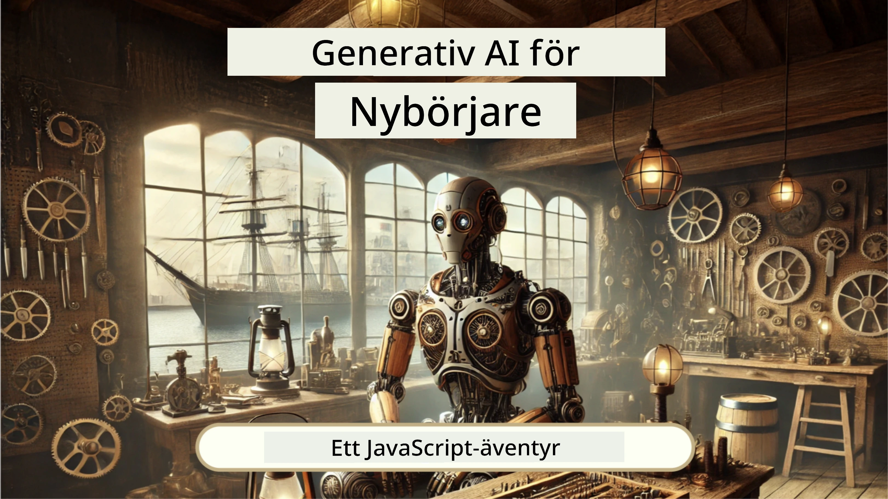
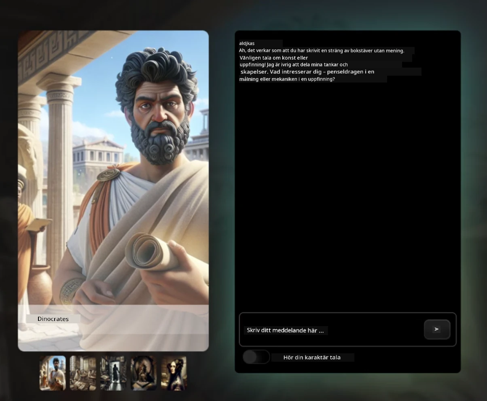
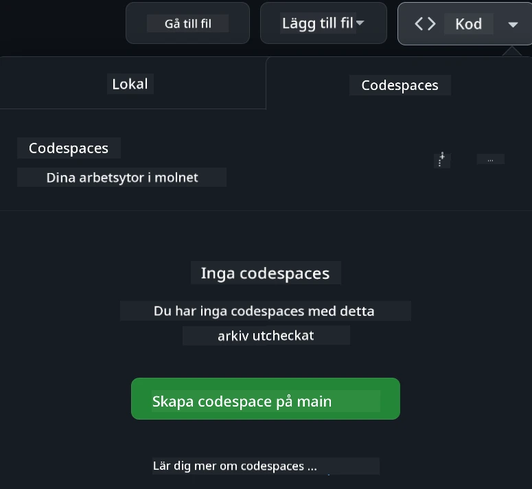

[](https://github.com/microsoft/Web-Dev-For-Beginners/blob/master/LICENSE)
[](https://GitHub.com/microsoft/Web-Dev-For-Beginners/graphs/contributors/)
[](https://GitHub.com/microsoft/Web-Dev-For-Beginners/issues/)
[](https://GitHub.com/microsoft/Web-Dev-For-Beginners/pulls/)
[](http://makeapullrequest.com) 

[](https://GitHub.com/microsoft/Web-Dev-For-Beginners/watchers/)
[](https://GitHub.com/microsoft/Web-Dev-For-Beginners/network/)
[](https://GitHub.com/microsoft/Web-Dev-For-Beginners/stargazers/)

[](https://discord.gg/nTYy5BXMWG)

# Webbuteckling för nybörjare - Ett läroplan

Lär dig grunderna i webbuteckling med vår 12-veckors omfattande kurs av Microsoft Cloud Advocates. Varje av de 24 lektionerna dyker ner i JavaScript, CSS och HTML genom praktiska projekt som terrarier, webbläsartillägg och rymdspel. Delta i quiz, diskussioner och praktiska uppgifter. Förbättra dina färdigheter och optimera din kunskapsbevaring med vår effektiva projektbaserade pedagogik. Börja din kodningsresa idag!

Gå med i Azure AI Foundry Discord och möt experter och andra utvecklare.

[](https://discord.gg/nTYy5BXMWG)

Följ dessa steg för att komma igång med att använda dessa resurser:
1. **Fork:a Repositoriet**: Klicka [](https://GitHub.com/microsoft/Web-Dev-For-Beginners/fork)
2. **Klona Repositoriet**:   `git clone https://github.com/microsoft/Web-Dev-For-Beginners.git`
3. [**Gå med i Azure AI Foundry Discord och möt experter och andra utvecklare**](https://discord.com/invite/ByRwuEEgH4)

### 🌐 Flerspråkigt stöd

#### Stöds via GitHub Action (Automatiserat och alltid uppdaterat)

<!-- CO-OP TRANSLATOR LANGUAGES TABLE START -->
[Arabic](../ar/README.md) | [Bengali](../bn/README.md) | [Bulgarian](../bg/README.md) | [Burmese (Myanmar)](../my/README.md) | [Chinese (Simplified)](../zh-CN/README.md) | [Chinese (Traditional, Hong Kong)](../zh-HK/README.md) | [Chinese (Traditional, Macau)](../zh-MO/README.md) | [Chinese (Traditional, Taiwan)](../zh-TW/README.md) | [Croatian](../hr/README.md) | [Czech](../cs/README.md) | [Danish](../da/README.md) | [Dutch](../nl/README.md) | [Estonian](../et/README.md) | [Finnish](../fi/README.md) | [French](../fr/README.md) | [German](../de/README.md) | [Greek](../el/README.md) | [Hebrew](../he/README.md) | [Hindi](../hi/README.md) | [Hungarian](../hu/README.md) | [Indonesian](../id/README.md) | [Italian](../it/README.md) | [Japanese](../ja/README.md) | [Kannada](../kn/README.md) | [Khmer](../km/README.md) | [Korean](../ko/README.md) | [Lithuanian](../lt/README.md) | [Malay](../ms/README.md) | [Malayalam](../ml/README.md) | [Marathi](../mr/README.md) | [Nepali](../ne/README.md) | [Nigerian Pidgin](../pcm/README.md) | [Norwegian](../no/README.md) | [Persian (Farsi)](../fa/README.md) | [Polish](../pl/README.md) | [Portuguese (Brazil)](../pt-BR/README.md) | [Portuguese (Portugal)](../pt-PT/README.md) | [Punjabi (Gurmukhi)](../pa/README.md) | [Romanian](../ro/README.md) | [Russian](../ru/README.md) | [Serbian (Cyrillic)](../sr/README.md) | [Slovak](../sk/README.md) | [Slovenian](../sl/README.md) | [Spanish](../es/README.md) | [Swahili](../sw/README.md) | [Swedish](./README.md) | [Tagalog (Filipino)](../tl/README.md) | [Tamil](../ta/README.md) | [Telugu](../te/README.md) | [Thai](../th/README.md) | [Turkish](../tr/README.md) | [Ukrainian](../uk/README.md) | [Urdu](../ur/README.md) | [Vietnamese](../vi/README.md)

> **Föredrar du att klona lokalt?**
>
> Detta repository inkluderar 50+ språköversättningar vilket avsevärt ökar nedladdningsstorleken. För att klona utan översättningar, använd sparsamt checkout:
>
> **Bash / macOS / Linux:**
> ```bash
> git clone --filter=blob:none --sparse https://github.com/microsoft/Web-Dev-For-Beginners.git
> cd Web-Dev-For-Beginners
> git sparse-checkout set --no-cone '/*' '!translations' '!translated_images'
> ```
>
> **CMD (Windows):**
> ```cmd
> git clone --filter=blob:none --sparse https://github.com/microsoft/Web-Dev-For-Beginners.git
> cd Web-Dev-For-Beginners
> git sparse-checkout set --no-cone "/*" "!translations" "!translated_images"
> ```
>
> Detta ger dig allt du behöver för att slutföra kursen med en mycket snabbare nedladdning.
<!-- CO-OP TRANSLATOR LANGUAGES TABLE END -->

**Om du önskar fler översättningar, finns de stödda språken listade [här](https://github.com/Azure/co-op-translator/blob/main/getting_started/supported-languages.md)**

[](https://open.vscode.dev/microsoft/Web-Dev-For-Beginners)

#### 🧑‍🎓 _Är du student?_

Besök [**Student Hub-sidan**](https://docs.microsoft.com/learn/student-hub/?WT.mc_id=academic-77807-sagibbon) där du hittar nybörjarresurser, studentpaket och till och med sätt att få ett gratis certifikat-voucher. Detta är sidan du vill bokmärka och kolla av då och då eftersom vi byter innehåll varje månad.

### 📣 Meddelande - Nya GitHub Copilot Agent-lägesutmaningar att slutföra!

Ny utmaning tillagd, leta efter "GitHub Copilot Agent Challenge 🚀" i de flesta kapitel. Det är en ny utmaning för dig att slutföra med GitHub Copilot och Agent-läget. Om du inte har använt Agent-läget tidigare kan det inte bara generera text utan kan även skapa och redigera filer, köra kommandon och mer.

### 📣 Meddelande - _Nytt projekt att bygga med Generativ AI_ 

Nytt AI-assistentprojekt precis tillagt, kolla in det [projektet](./9-chat-project/README.md)

### 📣 Meddelande - _Ny läroplan_ om Generativ AI för JavaScript släpptes just

Missa inte vår nya Generativ AI-läroplan!

Besök [https://aka.ms/genai-js-course](https://aka.ms/genai-js-course) för att komma igång!



- Lektioner som täcker allt från grunder till RAG.
- Interagera med historiska karaktärer med GenAI och vår följeslagarapp.
- Rolig och engagerande berättelse, du kommer tidsresa!




Varje lektion inkluderar en uppgift att slutföra, en kunskapskontroll och en utmaning för att guida dig i att lära dig ämnen som:
- Prompting och promptengineering
- Text- och bildappsgenerering
- Sökappar

Besök [https://aka.ms/genai-js-course](https://aka.ms/genai-js-course) för att komma igång!


## 🌱 Kom Igång

> **Lärare**, vi har [inkluderat några förslag](for-teachers.md) på hur ni kan använda denna läroplan. Vi tar gärna emot er feedback [i vårt diskussionsforum](https://github.com/microsoft/Web-Dev-For-Beginners/discussions/categories/teacher-corner)!

**[Studerande](https://aka.ms/student-page/?WT.mc_id=academic-77807-sagibbon)**, för varje lektion, börja med ett för-lektionsquiz och fortsätt sedan med att läsa föreläsningsmaterialet, slutföra de olika aktiviteterna och kontrollera din förståelse med ett efter-lektionsquiz.

För att förbättra din inlärningsupplevelse, koppla samman med dina kamrater för att samarbeta med projekten! Diskussioner uppmuntras i vårt [diskussionsforum](https://github.com/microsoft/Web-Dev-For-Beginners/discussions) där vårt team av moderatorer finns tillgängliga för att svara på dina frågor.

För att fördjupa din utbildning rekommenderar vi starkt att utforska [Microsoft Learn](https://learn.microsoft.com/users/wirelesslife/collections/p1ddcy5jwy0jkm?WT.mc_id=academic-77807-sagibbon) för ytterligare studiematerial.

### 📋 Sätta upp din miljö

Denna läroplan har en utvecklingsmiljö redo att användas! När du börjar kan du välja att köra läroplanen i en [Codespace](https://github.com/features/codespaces/) (_en webbläsarbaserad miljö utan installationer_), eller lokalt på din dator med en textredigerare som [Visual Studio Code](https://code.visualstudio.com/?WT.mc_id=academic-77807-sagibbon).

#### Skapa ditt repository
För att du enkelt ska kunna spara ditt arbete rekommenderas det att du skapar en egen kopia av detta repository. Du kan göra det genom att klicka på knappen **Use this template** högst upp på sidan. Detta skapar ett nytt repository i ditt GitHub-konto med en kopia av läroplanen.

Följ dessa steg:
1. **Fork:a Repositoriet**: Klicka på knappen "Fork" längst upp till höger på sidan.
2. **Klona Repositoriet**:   `git clone https://github.com/microsoft/Web-Dev-For-Beginners.git`

#### Köra läroplanen i en Codespace

I din kopia av detta repository som du skapade, klicka på **Code**-knappen och välj **Open with Codespaces**. Detta skapar en ny Codespace för dig att arbeta i.



#### Köra läroplanen lokalt på din dator

För att köra denna läroplan lokalt på din dator behöver du en textredigerare, en webbläsare och ett kommandoradsverktyg. Vår första lektion, [Introduktion till programmeringsspråk och verktyg för yrket](../../1-getting-started-lessons/1-intro-to-programming-languages), går igenom olika val för varje av dessa verktyg så att du kan välja vad som passar dig bäst.

Vår rekommendation är att använda [Visual Studio Code](https://code.visualstudio.com/?WT.mc_id=academic-77807-sagibbon) som din redigerare, som även har en inbyggd [Terminal](https://code.visualstudio.com/docs/terminal/basics/?WT.mc_id=academic-77807-sagibbon). Du kan ladda ner Visual Studio Code [här](https://code.visualstudio.com/?WT.mc_id=academic-77807-sagibbon).
1. Klona ditt repository till din dator. Du kan göra detta genom att klicka på **Code**-knappen och kopiera URL:en:

    [CodeSpace](./images/createcodespace.png)

    Öppna sedan [Terminal](https://code.visualstudio.com/docs/terminal/basics/?WT.mc_id=academic-77807-sagibbon) i [Visual Studio Code](https://code.visualstudio.com/?WT.mc_id=academic-77807-sagibbon) och kör följande kommando, ersätt `<your-repository-url>` med URL:en du just kopierade:

    ```bash 
    git clone <your-repository-url>
    ```

2. Öppna mappen i Visual Studio Code. Du kan göra detta genom att klicka på **File** > **Open Folder** och välja den mapp du just klonade.

>  Rekommenderade Visual Studio Code-tillägg:
>
> * [Live Server](https://marketplace.visualstudio.com/items?itemName=ritwickdey.LiveServer&WT.mc_id=academic-77807-sagibbon) - för att förhandsgranska HTML-sidor inom Visual Studio Code
> * [Copilot](https://marketplace.visualstudio.com/items?itemName=GitHub.copilot&WT.mc_id=academic-77807-sagibbon) - för att hjälpa dig skriva kod snabbare

## 📂 Varje lektion innehåller:

- valfri skissnote
- valfri kompletterande video
- för-lektions uppvärmningsquiz
- skriftlig lektion
- för projektbaserade lektioner, steg-för-steg guiden om hur man bygger projektet
- kunskapskontroller
- en utmaning
- kompletterande läsning
- uppgift
- [post-lektionsquiz](https://ff-quizzes.netlify.app/web/)

> **En notering om quiz:** Alla quiz finns i Quiz-app mappen, totalt 48 quiz med tre frågor vardera. De finns tillgängliga [här](https://ff-quizzes.netlify.app/web/), quiz-appen kan köras lokalt eller distribueras till Azure; följ instruktionerna i `quiz-app` mappen.

## 🗃️ Lektioner

|     |                       Projekt Namn                       |                            Begrepp som lärs ut                             | Lärandemål                                                                                                                 |                                                         Länkad Lektion                                                          |         Författare          |
| :-: | :------------------------------------------------------: | :----------------------------------------------------------------------: | --------------------------------------------------------------------------------------------------------------------------- | :------------------------------------------------------------------------------------------------------------------------------: | :-------------------------: |
| 01  |                     Komma igång                          |           Introduktion till programmering och verktyg                   | Lära sig de grundläggande principerna bakom de flesta programmeringsspråk och om mjukvara som hjälper professionella utvecklare i deras arbete | [Intro till programmeringsspråk och verktyg](./1-getting-started-lessons/1-intro-to-programming-languages/README.md) |         Jasmine             |
| 02  |                     Komma igång                          |             Grundläggande GitHub, inklusive samarbete i team            | Hur man använder GitHub i sitt projekt, hur man samarbetar med andra i en kodbas                                            |                                    [Intro till GitHub](./1-getting-started-lessons/2-github-basics/README.md)                              |          Floor              |
| 03  |                     Komma igång                          |                             Tillgänglighet                              | Lär dig grunderna i webbåtkomst                                                                                             |                            [Grundläggande tillgänglighet](./1-getting-started-lessons/3-accessibility/README.md)                       |       Christopher           |
| 04  |                        JS Grundläggande                  |                         JavaScript datatyper                           | Grunderna i JavaScript-datatyper                                                                                            |                                       [Datatyper](./2-js-basics/1-data-types/README.md)                                             |         Jasmine             |
| 05  |                        JS Grundläggande                  |                         Funktioner och metoder                          | Lär dig om funktioner och metoder för att hantera applikationens logik                                                     |                              [Funktioner och Metoder](./2-js-basics/2-functions-methods/README.md)                                   | Jasmine och Christopher     |
| 06  |                        JS Grundläggande                  |                        Beslutsfattande med JS                         | Lär dig att skapa villkor i din kod med hjälp av beslutsfattandemetoder                                                     |                                 [Beslutsfattande](./2-js-basics/3-making-decisions/README.md)                                    |         Jasmine             |
| 07  |                        JS Grundläggande                  |                            Arrayer och loopar                           | Arbeta med data med hjälp av arrayer och loopar i JavaScript                                                               |                                   [Arrayer och Loopar](./2-js-basics/4-arrays-loops/README.md)                                        |         Jasmine             |
| 08  |       [Terrarium](./3-terrarium/solution/README.md)     |                            HTML i praktiken                            | Bygg HTML för att skapa ett online-terrarium med fokus på layout                                                          |                                 [Introduktion till HTML](./3-terrarium/1-intro-to-html/README.md)                                    |           Jen               |
| 09  |       [Terrarium](./3-terrarium/solution/README.md)     |                            CSS i praktiken                             | Bygg CSS för att styla online-terrarium med fokus på grunderna i CSS inklusive responsiv sida                               |                                  [Introduktion till CSS](./3-terrarium/2-intro-to-css/README.md)                                   |           Jen               |
| 10  |            [Terrarium](./3-terrarium/solution/README.md) |                 JavaScript Closures, DOM-manipulation                  | Bygg JavaScript för att göra terrariet som ett drag/drop-gränssnitt, med fokus på closures och DOM-manipulation             |                  [JavaScript Closures, DOM-manipulation](./3-terrarium/3-intro-to-DOM-and-closures/README.md)                     |           Jen               |
| 11  |          [Skrivspel](./4-typing-game/solution/README.md)  |                          Bygg ett skrivspel                            | Lär dig använda tangentbordevenemang för att styra logiken i din JavaScript-app                                             |                                [Händelsestyrd programmering](./4-typing-game/typing-game/README.md)                                  |       Christopher           |
| 12  | [Grön webbläsartillägg](./5-browser-extension/solution/README.md) |                         Arbeta med webbläsare                         | Lär dig hur webbläsare fungerar, deras historia och hur man skapar de första elementen i ett webbläsartillägg               |                               [Om webbläsare](./5-browser-extension/1-about-browsers/README.md)                                      |           Jen               |
| 13  | [Grön webbläsartillägg](./5-browser-extension/solution/README.md) | Bygga ett formulär, anropa ett API och lagra variabler i lokal lagring | Bygg JavaScript-elementen i ditt webbläsartillägg för att anropa ett API med variabler lagrade i lokal lagring               |                [API:er, formulär och lokal lagring](./5-browser-extension/2-forms-browsers-local-storage/README.md)                 |           Jen               |
| 14  | [Grön webbläsartillägg](./5-browser-extension/solution/README.md) |          Bakgrundsprocesser i webbläsaren, webbprestanda               | Använd webbläsarens bakgrundsprocesser för att hantera tilläggets ikon; lär dig om webbprestanda och optimeringar            |           [Bakgrundsuppgifter och prestanda](./5-browser-extension/3-background-tasks-and-performance/README.md)                   |           Jen               |
| 15  |           [Rymdspel](./6-space-game/solution/README.md)    |             Mer avancerad spelutveckling med JavaScript               | Lär dig om arv med både klasser och komposition och Pub/Sub-mönstret, som förberedelse för att bygga ett spel              |                      [Introduktion till avancerad spelutveckling](./6-space-game/1-introduction/README.md)                     |          Chris              |
| 16  |           [Rymdspel](./6-space-game/solution/README.md)    |                           Rita på canvas                              | Lär dig om Canvas API, som används för att rita element på skärmen                                                         |                                [Rita på Canvas](./6-space-game/2-drawing-to-canvas/README.md)                                     |          Chris              |
| 17  |           [Rymdspel](./6-space-game/solution/README.md)    |                   Flytta element runt på skärmen                      | Upptäck hur element kan få rörelse med kartesiska koordinater och Canvas API                                                |                           [Flytta element](./6-space-game/3-moving-elements-around/README.md)                                      |          Chris              |
| 18  |           [Rymdspel](./6-space-game/solution/README.md)    |                          Kollisiondetektion                           | Få element att kollidera och reagera på varandra med tangenttryckningar och ge en cooldown-funktion för att säkra prestanda i spelet |                              [Kollisiondetektion](./6-space-game/4-collision-detection/README.md)                                |          Chris              |
| 19  |           [Rymdspel](./6-space-game/solution/README.md)    |                             Poängräkning                              | Utför matematiska beräkningar baserade på spelets status och prestation                                                     |                                    [Poängräkning](./6-space-game/5-keeping-score/README.md)                                       |          Chris              |
| 20  |           [Rymdspel](./6-space-game/solution/README.md)    |                     Avsluta och starta om spelet                     | Lär dig om att avsluta och starta om spelet, inklusive att städa upp resurser och återställa variabelvärden                  |                                [Avslutningsvillkor](./6-space-game/6-end-condition/README.md)                                    |          Chris              |
| 21  |         [Bankapp](./7-bank-project/solution/README.md)      |                 HTML-mallar och rutter i en webbapp                  | Lär dig hur man skapar stommen för en flersidig webbplats arkitektur med routing och HTML-mallar                            |                            [HTML-mallar och rutter](./7-bank-project/1-template-route/README.md)                                 |          Yohan              |
| 22  |         [Bankapp](./7-bank-project/solution/README.md)      |                  Bygg inloggnings- och registreringsformulär         | Lär dig om att bygga formulär och hantera valideringsrutiner                                                               |                                           [Formulär](./7-bank-project/2-forms/README.md)                                      |          Yohan              |
| 23  |         [Bankapp](./7-bank-project/solution/README.md)      |                   Metoder för att hämta och använda data             | Hur data flödar in och ut ur din app, hur man hämtar, lagrar och kassera det                                               |                                            [Data](./7-bank-project/3-data/README.md)                                            |          Yohan              |
| 24  |         [Bankapp](./7-bank-project/solution/README.md)      |                      Begrepp om tillståndshantering                  | Lär dig hur din app behåller tillstånd och hur du hanterar det programmässigt                                              |                                [Tillståndshantering](./7-bank-project/4-state-management/README.md)                              |          Yohan              |
| 25 | [Browser/VScode Code](../../8-code-editor) | Arbeta med VScode | Lär dig hur man använder en kodredigerare | [Använd VScode Code Editor](./8-code-editor/1-using-a-code-editor/README.md) | Chris |
| 26 | [AI Assistants](./9-chat-project/README.md) | Arbeta med AI | Lär dig bygga din egen AI-assistent | [AI Assistant projekt](./9-chat-project/README.md) | Chris |

## 🏫 Pedagogik

Vårt läroplan är utformat med två viktiga pedagogiska principer:
* projektbaserat lärande
* frekventa quiz

Programmet lär ut grunderna i JavaScript, HTML och CSS, samt de senaste verktyg och tekniker som webb utvecklare använder idag. Studenter kommer att få möjlighet att utveckla praktisk erfarenhet genom att skapa ett skrivspel, virtuellt terrarium, miljövänligt webbläsartillägg, rymdinspirerat spel och en bankapp för företag. I slutet av serien kommer studenterna att ha fått en gedigen förståelse för webbutveckling.

> 🎓 Du kan ta de första lektionerna i detta läroplan som en [Lärstig](https://docs.microsoft.com/learn/paths/web-development-101/?WT.mc_id=academic-77807-sagibbon) på Microsoft Learn!

Genom att säkerställa att innehållet är kopplat till projekt blir processen mer engagerande för elever och konceptbevarandet stärks. Vi har också skrivit flera introduktionslektioner i JavaScript-grunder för att introducera koncepten, ihop med en video från "[Beginners Series to: JavaScript](https://channel9.msdn.com/Series/Beginners-Series-to-JavaScript/?WT.mc_id=academic-77807-sagibbon)" samling av videotutorials, där några av författarna bidragit till detta läroplan.

Dessutom sätter ett lågintensivt quiz före en klassning elevens intention att lära sig ett ämne, medan ett andra quiz efter klassen säkerställer ytterligare beständighet. Detta läroplan är designat för att vara flexibelt och roligt och kan tas i sin helhet eller delvis. Projekten börjar små och blir alltmer komplexa mot slutet av en 12-veckors cykel.

Vi har medvetet undvikit att introducera JavaScript-ramverk för att koncentrera oss på de grundläggande färdigheter som behövs som webb utvecklare innan man tar till sig ett ramverk, ett bra nästa steg efter att ha slutfört detta läroplan är att lära sig om Node.js via en annan samling videor: "[Beginner Series to: Node.js](https://channel9.msdn.com/Series/Beginners-Series-to-Nodejs/?WT.mc_id=academic-77807-sagibbon)".

> Besök våra riktlinjer för [Uppförandekod](CODE_OF_CONDUCT.md) och [Bidrag](CONTRIBUTING.md). Vi välkomnar din konstruktiva feedback!

## 🧭 Offline tillgång

Du kan köra denna dokumentation offline genom att använda [Docsify](https://docsify.js.org/#/). Fork'a detta repo, [installera Docsify](https://docsify.js.org/#/quickstart) på din lokala maskin, och kör sedan `docsify serve` i rotmappen i detta repo. Webbplatsen kommer att serveras på port 3000 på din localhost: `localhost:3000`.

## 📘 PDF
En PDF med alla lektioner finns [här](https://microsoft.github.io/Web-Dev-For-Beginners/pdf/readme.pdf).


## 🎒 Andra kurser

Vårt team producerar andra kurser! Kolla in:

<!-- CO-OP TRANSLATOR OTHER COURSES START -->
### LangChain
[](https://aka.ms/langchain4j-for-beginners)
[](https://aka.ms/langchainjs-for-beginners?WT.mc_id=m365-94501-dwahlin)
[](https://github.com/microsoft/langchain-for-beginners?WT.mc_id=m365-94501-dwahlin)
---

### Azure / Edge / MCP / Agents
[](https://github.com/microsoft/AZD-for-beginners?WT.mc_id=academic-105485-koreyst)
[](https://github.com/microsoft/edgeai-for-beginners?WT.mc_id=academic-105485-koreyst)
[](https://github.com/microsoft/mcp-for-beginners?WT.mc_id=academic-105485-koreyst)
[](https://github.com/microsoft/ai-agents-for-beginners?WT.mc_id=academic-105485-koreyst)

---
 
### Generativ AI-serie
[](https://github.com/microsoft/generative-ai-for-beginners?WT.mc_id=academic-105485-koreyst)
[-9333EA?style=for-the-badge&labelColor=E5E7EB&color=9333EA)](https://github.com/microsoft/Generative-AI-for-beginners-dotnet?WT.mc_id=academic-105485-koreyst)
[-C084FC?style=for-the-badge&labelColor=E5E7EB&color=C084FC)](https://github.com/microsoft/generative-ai-for-beginners-java?WT.mc_id=academic-105485-koreyst)
[-E879F9?style=for-the-badge&labelColor=E5E7EB&color=E879F9)](https://github.com/microsoft/generative-ai-with-javascript?WT.mc_id=academic-105485-koreyst)

---
 
### Kärninlärning
[](https://aka.ms/ml-beginners?WT.mc_id=academic-105485-koreyst)
[](https://aka.ms/datascience-beginners?WT.mc_id=academic-105485-koreyst)
[](https://aka.ms/ai-beginners?WT.mc_id=academic-105485-koreyst)
[](https://github.com/microsoft/Security-101?WT.mc_id=academic-96948-sayoung)
[](https://aka.ms/webdev-beginners?WT.mc_id=academic-105485-koreyst)
[](https://aka.ms/iot-beginners?WT.mc_id=academic-105485-koreyst)
[](https://github.com/microsoft/xr-development-for-beginners?WT.mc_id=academic-105485-koreyst)

---
 
### Copilot-serie
[](https://aka.ms/GitHubCopilotAI?WT.mc_id=academic-105485-koreyst)
[](https://github.com/microsoft/mastering-github-copilot-for-dotnet-csharp-developers?WT.mc_id=academic-105485-koreyst)
[](https://github.com/microsoft/CopilotAdventures?WT.mc_id=academic-105485-koreyst)
<!-- CO-OP TRANSLATOR OTHER COURSES END -->

## Få hjälp

Om du kör fast eller har några frågor om att bygga AI-appar. Gå med andra elever och erfarna utvecklare i diskussioner om MCP. Det är en stöttande gemenskap där frågor är välkomna och kunskap delas fritt.

[](https://discord.gg/nTYy5BXMWG)

Om du har produktfeedback eller hittar fel under utvecklingen besök:

[](https://aka.ms/foundry/forum)

## Licens

Detta arkiv är licensierat under MIT-licensen. Se [LICENSE](../../LICENSE)-filen för mer information.

---

<!-- CO-OP TRANSLATOR DISCLAIMER START -->
**Ansvarsfriskrivning**:
Detta dokument har översatts med hjälp av AI-översättningstjänsten [Co-op Translator](https://github.com/Azure/co-op-translator). Även om vi strävar efter noggrannhet, var vänlig notera att automatiska översättningar kan innehålla fel eller brister. Det ursprungliga dokumentet på dess modersmål bör betraktas som den auktoritativa källan. För kritisk information rekommenderas professionell mänsklig översättning. Vi ansvarar inte för några missförstånd eller feltolkningar som kan uppstå vid användning av denna översättning.
<!-- CO-OP TRANSLATOR DISCLAIMER END -->