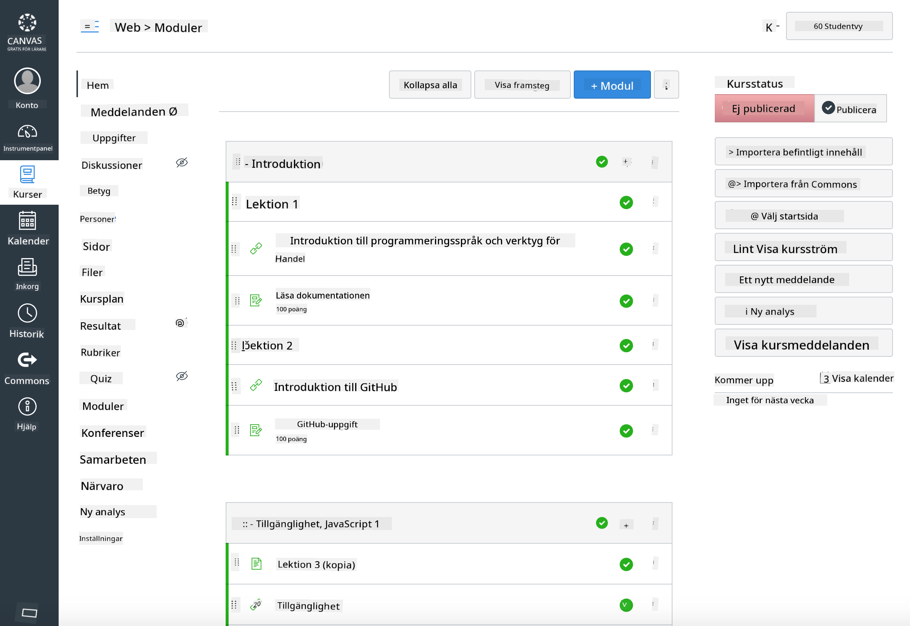

<!--
CO_OP_TRANSLATOR_METADATA:
{
  "original_hash": "75cb51f7ca9ea0b097ef4a1287e9290c",
  "translation_date": "2025-08-26T21:24:41+00:00",
  "source_file": "for-teachers.md",
  "language_code": "sv"
}
-->
## För lärare

Vill du använda denna läroplan i ditt klassrum? Varsågod!

Faktum är att du kan använda den direkt på GitHub genom att använda GitHub Classroom.

För att göra det, gör en fork av detta repo. Du kommer att behöva skapa ett repo för varje lektion, så du måste extrahera varje mapp till ett separat repo. På så sätt kan [GitHub Classroom](https://classroom.github.com/classrooms) hantera varje lektion separat.

Dessa [fullständiga instruktioner](https://github.blog/2020-03-18-set-up-your-digital-classroom-with-github-classroom/) ger dig en idé om hur du kan sätta upp ditt klassrum.

## Använda det i Moodle, Canvas eller Blackboard

Denna läroplan fungerar bra i dessa lärplattformar! Använd [Moodle-uppladdningsfilen](../../../../../../../teaching-files/webdev-moodle.mbz) för allt innehåll, eller prova [Common Cartridge-filen](../../../../../../../teaching-files/webdev-common-cartridge.imscc) som innehåller en del av innehållet. Moodle Cloud stöder inte fullständiga Common Cartridge-exporter, så det är bättre att använda Moodle-nedladdningsfilen som kan laddas upp till Canvas. Hör gärna av dig om hur vi kan förbättra denna upplevelse.

> Läroplanen i ett Moodle-klassrum

> Läroplanen i Canvas

## Använda repot som det är

Om du vill använda detta repo som det är, utan att använda GitHub Classroom, går det också bra. Du behöver kommunicera med dina studenter om vilken lektion ni ska arbeta med tillsammans.

I ett onlineformat (Zoom, Teams eller annat) kan du skapa grupprum för frågesporter och handleda studenter för att hjälpa dem att förbereda sig för att lära. Sedan kan du bjuda in studenter till frågesporterna och låta dem skicka in sina svar som 'issues' vid en viss tidpunkt. Du kan göra samma sak med uppgifter om du vill att studenter ska arbeta tillsammans öppet.

Om du föredrar ett mer privat format, be dina studenter att göra en fork av läroplanen, lektion för lektion, till sina egna privata GitHub-repos och ge dig åtkomst. Då kan de slutföra frågesporter och uppgifter privat och skicka in dem till dig via issues på ditt klassrumsrepo.

Det finns många sätt att få detta att fungera i ett onlineklassrum. Hör gärna av dig och berätta vad som fungerar bäst för dig!

## Ge oss dina tankar!

Vi vill göra denna läroplan så bra som möjligt för dig och dina studenter. Kontakta oss på [Lärarhörnan](https://github.com/microsoft/Web-Dev-For-Beginners/discussions/categories/teacher-corner) och öppna ett [**nytt ärende**](https://github.com/microsoft/Web-Dev-For-Beginners/issues/new/choose) för önskemål, buggar och feedback.

---

**Ansvarsfriskrivning**:  
Detta dokument har översatts med hjälp av AI-översättningstjänsten [Co-op Translator](https://github.com/Azure/co-op-translator). Även om vi strävar efter noggrannhet, bör du vara medveten om att automatiserade översättningar kan innehålla fel eller inexaktheter. Det ursprungliga dokumentet på dess originalspråk bör betraktas som den auktoritativa källan. För kritisk information rekommenderas professionell mänsklig översättning. Vi ansvarar inte för eventuella missförstånd eller feltolkningar som uppstår vid användning av denna översättning.