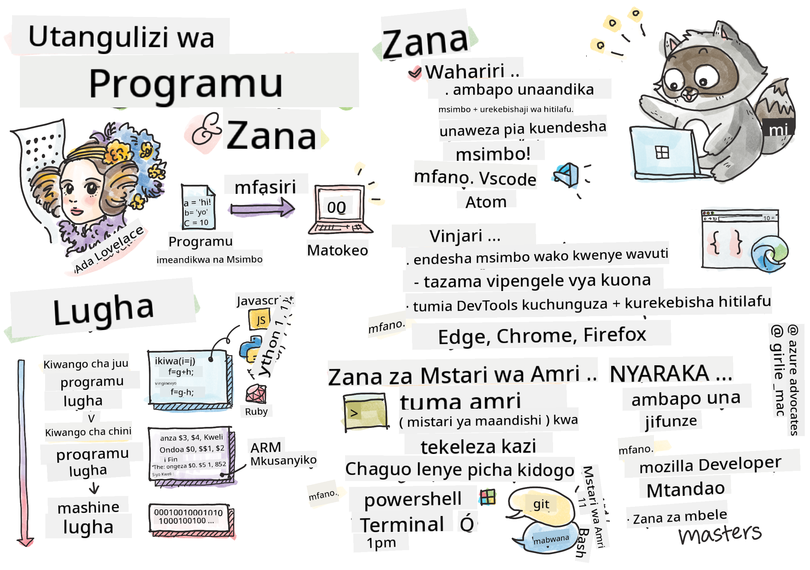

<!--
CO_OP_TRANSLATOR_METADATA:
{
  "original_hash": "3e0da5eb9b275fe3cb431033c1413ec2",
  "translation_date": "2025-10-24T19:14:19+00:00",
  "source_file": "1-getting-started-lessons/1-intro-to-programming-languages/README.md",
  "language_code": "sw"
}
-->
# Utangulizi wa Lugha za Programu na Zana za Kisasa za Waendelezaji

Habari, mendelezaji wa siku zijazo! 👋 Naweza kukuambia kitu ambacho bado kinanipa msisimko kila siku? Uko karibu kugundua kuwa programu si tu kuhusu kompyuta – ni kuhusu kuwa na nguvu za ajabu za kuleta mawazo yako ya ajabu kuwa hai!

Unajua ule wakati unapotumia programu yako unayoipenda na kila kitu kinaenda sawa kabisa? Unapobonyeza kitufe na kitu cha kichawi kinatokea ambacho kinakufanya useme "wow, walifanyaje HILO?" Naam, mtu kama wewe – labda akiwa amekaa kwenye kahawa yake anayoipenda saa 2 asubuhi akiwa na espresso yake ya tatu – aliandika msimbo uliounda uchawi huo. Na hapa ndipo akili yako itakaposhangaa: kufikia mwisho wa somo hili, hutajua tu jinsi walivyofanya, lakini utakuwa na hamu ya kujaribu mwenyewe!

Tazama, ninaelewa kabisa ikiwa programu inakutisha kwa sasa. Nilipoanza, nilidhani unahitaji kuwa na akili ya hesabu au kuwa umekuwa ukifanya programu tangu ulipokuwa na miaka mitano. Lakini hapa ndipo mtazamo wangu ulipobadilika kabisa: programu ni kama kujifunza kuzungumza katika lugha mpya. Unaanza na "habari" na "asante," kisha unajifunza kuagiza kahawa, na kabla hujajua, unakuwa na mijadala ya kina ya kifalsafa! Isipokuwa katika hali hii, unazungumza na kompyuta, na kwa kweli? Ni washirika wa mazungumzo wenye subira zaidi utakaowahi kuwa nao – hawahukumu makosa yako na daima wako tayari kujaribu tena!

Leo, tutachunguza zana za ajabu zinazofanya maendeleo ya wavuti ya kisasa kuwa si tu yanayowezekana, bali yanayovutia sana. Ninazungumzia wahariri, vivinjari, na mtiririko wa kazi sawa kabisa ambao waendelezaji wa Netflix, Spotify, na studio yako ya programu ya indie wanatumia kila siku. Na hapa ndipo sehemu itakayokufanya ucheze kwa furaha: nyingi ya zana hizi za kiwango cha kitaalamu, za viwango vya sekta, ni bure kabisa!


> Sketchnote na [Tomomi Imura](https://twitter.com/girlie_mac)

## Hebu Tuone Unachojua Tayari!

Kabla hatujaanza na mambo ya kufurahisha, nina hamu – unajua nini tayari kuhusu ulimwengu huu wa programu? Na sikiliza, ikiwa unatazama maswali haya ukifikiria "Sina hata kidogo kuhusu haya," hiyo si tu sawa, ni kamilifu! Hii inamaanisha uko mahali sahihi kabisa. Fikiria jaribio hili kama kunyoosha kabla ya mazoezi – tunachochea tu misuli ya ubongo!

[Chukua jaribio la kabla ya somo](https://forms.office.com/r/dru4TE0U9n?origin=lprLink)

## Safari Tunayoenda Pamoja

Sawa, nina furaha sana kuhusu kile tutakachochunguza leo! Kwa kweli, natamani ningekuona uso wako wakati baadhi ya dhana hizi zinakubalika. Hii ndiyo safari ya ajabu tunayoenda pamoja:

- **Programu ni nini hasa (na kwa nini ni kitu cha kupendeza sana!)** – Tutagundua jinsi msimbo ni uchawi usioonekana unaoendesha kila kitu karibu nawe, kutoka kwa kengele inayojua kuwa ni Jumatatu asubuhi hadi algorithm inayokamilisha mapendekezo yako ya Netflix
- **Lugha za programu na tabia zao za kushangaza** – Fikiria kuingia kwenye sherehe ambapo kila mtu ana nguvu za kipekee na njia za kutatua matatizo. Hivyo ndivyo ulimwengu wa lugha za programu ulivyo, na utapenda kukutana nao!
- **Msingi wa ujenzi unaofanya uchawi wa kidijitali kutokea** – Fikiria haya kama seti ya LEGO ya ubunifu wa hali ya juu. Mara tu unapojua jinsi vipande hivi vinavyofanya kazi pamoja, utagundua kuwa unaweza kujenga chochote unachokiwaza
- **Zana za kitaalamu zitakazokufanya uhisi kama umekabidhiwa fimbo ya mchawi** – Sizungumzii kwa kuzidisha – zana hizi zitakufanya uhisi kama una nguvu za ajabu, na sehemu bora zaidi? Ni zile zile zinazotumiwa na wataalamu!

> 💡 **Hili ndilo jambo**: Usifikirie hata kujaribu kukumbuka kila kitu leo! Kwa sasa, nataka tu uhisi msisimko wa kile kinachowezekana. Maelezo yatakaa kwa kawaida tunapojifunza pamoja – ndivyo kujifunza halisi kunavyotokea!

> Unaweza kuchukua somo hili kwenye [Microsoft Learn](https://docs.microsoft.com/learn/modules/web-development-101/introduction-programming/?WT.mc_id=academic-77807-sagibbon)!

## Kwa Hiyo Programu ni Nini Haswa?

Sawa, hebu tushughulikie swali la mamilioni ya dola: programu ni nini, kweli?

Nitakupa hadithi iliyobadilisha kabisa jinsi ninavyofikiria kuhusu hili. Wiki iliyopita, nilikuwa nikijaribu kumwelezea mama yangu jinsi ya kutumia rimoti mpya ya runinga yetu ya kisasa. Nilijikuta nikisema vitu kama "Bonyeza kitufe chekundu, lakini si kile kikubwa chekundu, kile kidogo chekundu upande wa kushoto... hapana, kushoto kwako... sawa, sasa shikilia kwa sekunde mbili, si moja, si tatu..." Inajulikana? 😅

Hiyo ni programu! Ni sanaa ya kutoa maelekezo ya kina, hatua kwa hatua kwa kitu chenye nguvu sana lakini kinahitaji kila kitu kuelezwa kwa ukamilifu. Isipokuwa badala ya kumwelezea mama yako (ambaye anaweza kuuliza "ni kitufe kipi chekundu?!"), unamwelezea kompyuta (ambayo hufanya tu kile unachosema, hata kama kile ulichosema si kile ulichomaanisha).

Hapa ndipo akili yangu iliposhangaa nilipojifunza hili: kompyuta kwa kweli ni rahisi sana kwa msingi wake. Zinajua tu mambo mawili – 1 na 0, ambayo kimsingi ni "ndiyo" na "hapana" au "washa" na "zima." Hiyo tu! Lakini hapa ndipo uchawi unapoingia – hatuhitaji kuzungumza kwa 1 na 0 kama tuko kwenye The Matrix. Hapo ndipo **lugha za programu** zinakuja kuokoa. Ni kama kuwa na mtafsiri bora zaidi duniani ambaye huchukua mawazo yako ya kawaida ya kibinadamu na kuyabadilisha kuwa lugha ya kompyuta.

Na hapa ndipo bado ninapata msisimko halisi kila asubuhi ninapoamka: kila kitu cha kidijitali maishani mwako kilianza na mtu kama wewe, labda akiwa amevaa pajama zake na kikombe cha kahawa, akiandika msimbo kwenye kompyuta yake ndogo. Kichujio cha Instagram kinachokufanya uonekane mzuri? Mtu alikiandika. Pendekezo lililokupeleka kwenye wimbo wako mpya unaoupenda? Mendelezaji alijenga algorithm hiyo. Programu inayokusaidia kugawanya bili za chakula cha jioni na marafiki? Ndio, mtu alifikiria "hili linakera, naweza kulitatua" kisha... wakafanya!

Unapojifunza programu, huchukui tu ujuzi mpya – unakuwa sehemu ya jamii hii ya ajabu ya watatuzi wa matatizo ambao hutumia siku zao kufikiria, "Je, ningeweza kujenga kitu ambacho kinaboresha siku ya mtu kidogo tu?" Kwa kweli, kuna kitu chochote cha kupendeza zaidi ya hicho?

✅ **Ukweli wa Kufurahisha**: Hapa kuna kitu cha kupendeza sana cha kutafuta wakati una nafasi – unadhani ni nani alikuwa mendelezaji wa kwanza wa kompyuta duniani? Nitakupa kidokezo: huenda si yule unayemtarajia! Hadithi ya mtu huyu ni ya kuvutia sana na inaonyesha kuwa programu daima imekuwa kuhusu kutatua matatizo kwa ubunifu na kufikiria nje ya boksi.

## Lugha za Programu ni Kama Ladha Tofauti za Uchawi

Sawa, hili litaonekana la ajabu, lakini endelea nami – lugha za programu ni kama aina tofauti za muziki. Fikiria: una jazz, ambayo ni laini na ya ubunifu, rock ambayo ni yenye nguvu na rahisi, classical ambayo ni maridadi na yenye muundo, na hip-hop ambayo ni ya ubunifu na ya kujieleza. Kila mtindo una vibe yake, jamii yake ya mashabiki wenye shauku, na kila moja ni kamilifu kwa hali na hafla tofauti.

Lugha za programu zinafanya kazi kwa njia sawa kabisa! Husingetumia lugha sawa kujenga mchezo wa simu wa kufurahisha kama unavyotumia kuchambua data kubwa ya hali ya hewa, kama vile usingecheza death metal kwenye darasa la yoga (naam, darasa nyingi za yoga angalau! 😄).

Lakini hapa ndipo akili yangu inashangaa kila wakati ninapofikiria kuhusu hili: lugha hizi ni kama kuwa na mtafsiri mwenye subira, mwenye akili sana anayekaa karibu nawe. Unaweza kueleza mawazo yako kwa njia inayohisi kuwa ya kawaida kwa ubongo wa kibinadamu, na wao hushughulikia kazi ngumu ya kutafsiri hiyo kuwa 1s na 0s ambazo kompyuta huzungumza. Ni kama kuwa na rafiki ambaye ni mtaalamu wa "ubunifu wa kibinadamu" na "mantiki ya kompyuta" – na hawachoki, hawahitaji mapumziko ya kahawa, na hawakuhukumu kwa kuuliza swali lile lile mara mbili!

### Lugha Maarufu za Programu na Matumizi Yake

| Lugha | Bora Kwa | Kwa Nini Ni Maarufu |
|-------|----------|---------------------|
| **JavaScript** | Maendeleo ya wavuti, interfaces za mtumiaji | Inaendesha kwenye vivinjari na inawezesha tovuti za maingiliano |
| **Python** | Sayansi ya data, otomatiki, AI | Rahisi kusoma na kujifunza, maktaba zenye nguvu |
| **Java** | Programu za biashara, programu za Android | Huru kwa jukwaa, imara kwa mifumo mikubwa |
| **C#** | Programu za Windows, maendeleo ya michezo | Msaada mkubwa wa mfumo wa Microsoft |
| **Go** | Huduma za wingu, mifumo ya nyuma | Haraka, rahisi, iliyoundwa kwa kompyuta ya kisasa |

### Lugha za Kiwango cha Juu vs. Kiwango cha Chini

Sawa, hili lilikuwa dhana iliyovunja akili yangu nilipoanza kujifunza, kwa hivyo nitashiriki mfano uliofanya hatimaye nielewe – na ninatumaini sana itakusaidia pia!

Fikiria unatembelea nchi ambapo hujui lugha, na unahitaji sana kupata choo cha karibu (sote tumewahi kuwa hapo, sivyo? 😅):

- **Programu ya kiwango cha chini** ni kama kujifunza lahaja ya eneo hilo vizuri sana kiasi kwamba unaweza kuzungumza na bibi anayeuza matunda pembezoni kwa kutumia marejeleo ya kitamaduni, misemo ya eneo hilo, na utani wa ndani ambao mtu aliyekulia hapo tu angeelewa. Inavutia sana na yenye ufanisi... ikiwa unajua lugha hiyo! Lakini inachosha sana wakati unajaribu tu kupata choo.

- **Programu ya kiwango cha juu** ni kama kuwa na rafiki wa eneo hilo ambaye anakuelewa. Unaweza kusema "Nahitaji sana kupata choo" kwa Kiingereza rahisi, na wao hushughulikia tafsiri zote za kitamaduni na kukupa maelekezo kwa njia inayofanya akili kwa ubongo wako usio wa eneo hilo.

Katika maneno ya programu:
- **Lugha za kiwango cha chini** (kama Assembly au C) hukuruhusu kuwa na mazungumzo ya kina sana na vifaa halisi vya kompyuta, lakini unahitaji kufikiria kama mashine, ambayo ni... vizuri, wacha tuseme ni mabadiliko makubwa ya akili!
- **Lugha za kiwango cha juu** (kama JavaScript, Python, au C#) hukuruhusu kufikiria kama binadamu huku wakishughulikia mazungumzo yote ya mashine nyuma ya pazia. Zaidi ya hayo, zina jamii za kukaribisha sana zilizojaa watu wanaokumbuka jinsi ilivyokuwa kuwa mpya na wanataka kweli kusaidia!

Unadhani ni zipi nitakazopendekeza uanze nazo? 😉 Lugha za kiwango cha juu ni kama kuwa na magurudumu ya mafunzo ambayo hutaki kamwe kuyaondoa kwa sababu yanayafanya uzoefu mzima kuwa wa kufurahisha zaidi!

### Hebu Nikuonyeshe Kwa Nini Lugha za Kiwango cha Juu Ni Rafiki Zaidi

Sawa, nitakuonyesha kitu kinachoonyesha kikamilifu kwa nini nilipenda lugha za kiwango cha juu, lakini kwanza – nahitaji uniahidi kitu. Unapoona mfano wa kwanza wa msimbo, usishtuke! Inatakiwa ionekane ya kutisha. Hiyo ndiyo hoja ninayotoa!

Tutatazama kazi ile ile iliyoandikwa kwa mitindo miwili tofauti kabisa. Zote zinaunda kinachoitwa mlolongo wa Fibonacci – ni muundo huu mzuri wa kihesabu ambapo kila namba ni jumla ya mbili zilizopita: 0, 1, 1, 2, 3, 5, 8, 13... (Ukweli wa kufurahisha: utapata muundo huu kila mahali katika asili – mizunguko ya mbegu za alizeti, mifumo ya maganda ya pinecone, hata jinsi galaksi zinavyoundwa!)

Uko tayari kuona tofauti? Twende!

**Lugha ya kiwango cha juu (JavaScript) – Rafiki kwa binadamu:**

```javascript
// Step 1: Basic Fibonacci setup
const fibonacciCount = 10;
let current = 0;
let next = 1;

console.log('Fibonacci sequence:');
```

**Hii ndiyo msimbo unavyofanya:**
- **Tangaza** constant ili kubainisha idadi ya namba za Fibonacci tunazotaka kuzalisha
- **Anzisha** vigezo viwili kufuatilia namba za sasa na zinazofuata katika mlolongo
- **Weka** thamani za kuanzia (0 na 1) zinazofafanua muundo wa Fibonacci
- **Onyesha** ujumbe wa kichwa kutambua matokeo yetu

```javascript
// Step 2: Generate the sequence with a loop
for (let i = 0; i < fibonacciCount; i++) {
  console.log(`Position ${i + 1}: ${current}`);
  
  // Calculate next number in sequence
  const sum = current + next;
  current = next;
  next = sum;
}
```

**Kufafanua kinachotokea hapa:**
- **Rudia** kila nafasi katika mlolongo wetu kwa kutumia `for` loop
- **Onyesha** kila namba na nafasi yake kwa kutumia muundo wa template literal
- **Hesabu** namba inayofuata ya Fibonacci kwa kuongeza thamani za sasa na zinazofuata
- **Sasisha** vigezo vyetu vya kufuatilia ili kuendelea na mzunguko unaofuata

```javascript
// Step 3: Modern functional approach
const generateFibonacci = (count) => {
  const sequence = [0, 1];
  
  for (let i = 2; i < count; i++) {
    sequence[i] = sequence[i - 1] + sequence[i - 2];
  }
  
  return sequence;
};

// Usage example
const fibSequence = generateFibonacci(10);
console.log(fibSequence);
```

**Katika hapo juu, tumefanya:**
- **Tengeneza** kazi inayoweza kutumika tena kwa kutumia sintaksia ya kisasa ya kazi ya mshale
- **Jenga** safu ya kuhifadhi mlolongo kamili badala ya kuonyesha moja moja
- **Tumia** faharasa ya safu ili kuhesabu kila namba mpya kutoka kwa thamani za awali
- **Rudisha** mlolongo kamili kwa matumizi rahisi katika sehemu nyingine za programu yetu

**Lugha ya kiwango cha chini (ARM Assembly) – Rafiki kwa kompyuta:**

```assembly
 area ascen,code,readonly
 entry
 code32
 adr r0,thumb+1
 bx r0
 code16
thumb
 mov r0,#00
 sub r0,r0,#01
 mov r1,#01
 mov r4,#10
 ldr r2,=0x40000000
back add r0,r1
 str r0,[r2]
 add r2,#04
 mov r3,r0
 mov r0,r1
 mov r1,r3
 sub r4,#01
 cmp r4,#00
 bne back
 end
```

Angalia jinsi toleo la JavaScript linavyosomwa karibu kama maelekezo ya Kiingereza, wakati toleo la Assembly linatumia amri za fumbo zinazodhibiti moja kwa moja processor ya kompyuta. Zote zinatimiza kazi ile ile, lakini lugha ya kiwango cha juu ni rahisi zaidi kwa binadamu kuelewa, kuandika, na kudumisha.

**Tofauti kuu utakazoziona:**
- **Usomaji**: JavaScript hutumia majina ya kuelezea kama `fibonacciCount` wakati Assembly hutumia lebo za fumbo kama `r0`, `r1`
- **Maoni**: Lugha za kiwango cha juu zinahimiza maoni ya kuelezea yanayofanya msimbo kuwa wa kujieleza
- **Muundo**: Mtiririko wa kimantiki wa JavaScript unafanana na jinsi binadamu wanavyofikiria kuhusu matatizo hatua kwa hatua
- **Matengenezo**: Kusasisha toleo la JavaScript kwa mahitaji tofauti ni rahisi na wazi
✅ **Kuhusu mfululizo wa Fibonacci**: Mpangilio huu wa namba wa kuvutia sana (ambapo kila namba ni jumla ya mbili zilizopita: 0, 1, 1, 2, 3, 5, 8...) unapatikana kila mahali katika asili! Utauona kwenye mizunguko ya alizeti, muundo wa maganda ya mvinje, jinsi magamba ya nautilus yanavyopinda, na hata jinsi matawi ya miti yanavyokua. Ni ajabu jinsi hesabu na programu zinavyoweza kutusaidia kuelewa na kuunda upya mifumo ambayo asili hutumia kuunda uzuri!

## Msingi Unaofanya Uchawi Utokee

Sawa, sasa kwa kuwa umeona jinsi lugha za programu zinavyoonekana kazini, hebu tuangalie vipande vya msingi vinavyounda kila programu iliyowahi kuandikwa. Fikiria hivi kama viungo muhimu katika mapishi unayopenda – ukielewa kila moja inafanya nini, utaweza kusoma na kuandika programu karibu katika lugha yoyote!

Hii ni kama kujifunza sarufi ya programu. Kumbuka ulipokuwa shuleni ulipojifunza kuhusu nomino, vitenzi, na jinsi ya kuunda sentensi? Programu ina toleo lake la sarufi, na kwa kweli, ni la kimantiki zaidi na lenye msamaha kuliko sarufi ya Kiingereza ilivyokuwa! 😄

### Kauli: Maelekezo Hatua kwa Hatua

Tuanzie na **kauli** – hizi ni kama sentensi za kibinafsi katika mazungumzo na kompyuta yako. Kila kauli inaambia kompyuta kufanya jambo moja maalum, kama kutoa maelekezo: "Geuka kushoto hapa," "Simama kwenye taa nyekundu," "Paki kwenye nafasi ile."

Kinachonivutia kuhusu kauli ni jinsi zinavyosomeka kwa urahisi. Angalia hii:

```javascript
// Basic statements that perform single actions
const userName = "Alex";                    
console.log("Hello, world!");              
const sum = 5 + 3;                         
```

**Hii ndiyo kazi ya msimbo huu:**
- **Tangaza** kigezo cha kudumu kuhifadhi jina la mtumiaji
- **Onyesha** ujumbe wa salamu kwenye matokeo ya console
- **Hesabu** na hifadhi matokeo ya operesheni ya kihesabu

```javascript
// Statements that interact with web pages
document.title = "My Awesome Website";      
document.body.style.backgroundColor = "lightblue";
```

**Hatua kwa hatua, kinachotokea ni:**
- **Badilisha** kichwa cha ukurasa kinachoonekana kwenye tab ya kivinjari
- **Badilisha** rangi ya mandharinyuma ya mwili wa ukurasa mzima

### Vigezo: Mfumo wa Kumbukumbu wa Programu Yako

Sawa, **vigezo** ni moja ya dhana ninazopenda sana kufundisha kwa sababu ni kama vitu unavyotumia kila siku!

Fikiria orodha ya mawasiliano kwenye simu yako kwa sekunde. Huhifadhi namba za simu za kila mtu kichwani – badala yake, unaandika "Mama," "Rafiki wa Karibu," au "Mahali pa Pizza Inayofika Mpaka Saa 8 Usiku" na unaruhusu simu yako ikumbuke namba halisi. Vigezo vinafanya kazi kwa njia sawa kabisa! Ni kama vyombo vilivyowekwa alama ambapo programu yako inaweza kuhifadhi taarifa na kuipata baadaye kwa kutumia jina linaloeleweka.

Kinachovutia: vigezo vinaweza kubadilika kadri programu yako inavyoendelea (ndiyo maana vinaitwa "vigezo" – unaona walichofanya hapo?). Kama vile unavyoweza kusasisha mawasiliano ya mahali pa pizza unapogundua mahali bora zaidi, vigezo vinaweza kusasishwa kadri programu yako inavyopata taarifa mpya au hali zinavyobadilika!

Hebu nikuonyeshe jinsi hii inavyoweza kuwa rahisi na nzuri:

```javascript
// Step 1: Creating basic variables
const siteName = "Weather Dashboard";        
let currentWeather = "sunny";               
let temperature = 75;                       
let isRaining = false;                      
```

**Kuelewa dhana hizi:**
- **Hifadhi** thamani zisizobadilika kwenye vigezo vya `const` (kama jina la tovuti)
- **Tumia** `let` kwa thamani zinazoweza kubadilika katika programu yako
- **Weka** aina tofauti za data: mistari (maandishi), namba, na booleans (kweli/siyo kweli)
- **Chagua** majina yanayoelezea kinachohifadhiwa na kila kigezo

```javascript
// Step 2: Working with objects to group related data
const weatherData = {                       
  location: "San Francisco",
  humidity: 65,
  windSpeed: 12
};
```

**Katika hili, tumefanya:**
- **Unda** kitu cha kuunganisha taarifa zinazohusiana za hali ya hewa pamoja
- **Panga** vipande vingi vya data chini ya jina moja la kigezo
- **Tumia** jozi za funguo-thamani kuonyesha kila kipande cha taarifa kwa uwazi

```javascript
// Step 3: Using and updating variables
console.log(`${siteName}: Today is ${currentWeather} and ${temperature}°F`);
console.log(`Wind speed: ${weatherData.windSpeed} mph`);

// Updating changeable variables
currentWeather = "cloudy";                  
temperature = 68;                          
```

**Hebu tuelewe kila sehemu:**
- **Onyesha** taarifa kwa kutumia maandishi ya kiolezo na sintaksia ya `${}`
- **Fikia** mali za kitu kwa kutumia noti ya nukta (`weatherData.windSpeed`)
- **Sasisha** vigezo vilivyotangazwa na `let` kuonyesha hali zinazobadilika
- **Unganisha** vigezo vingi kuunda ujumbe wenye maana

```javascript
// Step 4: Modern destructuring for cleaner code
const { location, humidity } = weatherData; 
console.log(`${location} humidity: ${humidity}%`);
```

**Unachohitaji kujua:**
- **Chukua** mali maalum kutoka kwa vitu kwa kutumia mgawanyo wa kigezo
- **Unda** vigezo vipya moja kwa moja kwa majina sawa na funguo za vitu
- **Rahisisha** msimbo kwa kuepuka noti ya nukta inayojirudia

### Mtiririko wa Udhibiti: Kufundisha Programu Yako Kufikiria

Sawa, hapa ndipo programu inakuwa ya kushangaza kabisa! **Mtiririko wa udhibiti** ni kimsingi kufundisha programu yako jinsi ya kufanya maamuzi ya busara, kama unavyofanya kila siku bila hata kufikiria.

Fikiria hili: asubuhi hii labda ulipitia kitu kama "Ikiwa mvua inanyesha, nitachukua mwavuli. Ikiwa kuna baridi, nitavaa koti. Ikiwa nimechelewa, nitakosa kifungua kinywa na kuchukua kahawa njiani." Ubongo wako hufuata mantiki hii ya ikiwa-basi mara kadhaa kila siku!

Hii ndiyo inafanya programu zionekane na akili na hai badala ya kufuata tu mpangilio wa kuchosha na wa kutabirika. Zinaweza kuangalia hali, kutathmini kinachotokea, na kujibu ipasavyo. Ni kama kutoa programu yako ubongo unaoweza kubadilika na kufanya chaguo!

Unataka kuona jinsi hii inavyofanya kazi kwa uzuri? Hebu nikuonyeshe:

```javascript
// Step 1: Basic conditional logic
const userAge = 17;

if (userAge >= 18) {
  console.log("You can vote!");
} else {
  const yearsToWait = 18 - userAge;
  console.log(`You'll be able to vote in ${yearsToWait} year(s).`);
}
```

**Hii ndiyo kazi ya msimbo huu:**
- **Angalia** ikiwa umri wa mtumiaji unakidhi hitaji la kupiga kura
- **Tekeleza** vizuizi tofauti vya msimbo kulingana na matokeo ya hali
- **Hesabu** na onyesha muda uliosalia hadi kufikia umri wa kupiga kura ikiwa chini ya miaka 18
- **Toa** maoni maalum na ya msaada kwa kila hali

```javascript
// Step 2: Multiple conditions with logical operators
const userAge = 17;
const hasPermission = true;

if (userAge >= 18 && hasPermission) {
  console.log("Access granted: You can enter the venue.");
} else if (userAge >= 16) {
  console.log("You need parent permission to enter.");
} else {
  console.log("Sorry, you must be at least 16 years old.");
}
```

**Kuchambua kinachotokea hapa:**
- **Unganisha** hali nyingi kwa kutumia operator ya `&&` (na)
- **Unda** mpangilio wa hali kwa kutumia `else if` kwa hali nyingi
- **Shughulikia** hali zote zinazowezekana kwa kauli ya mwisho ya `else`
- **Toa** maoni wazi na yanayoweza kutekelezwa kwa kila hali tofauti

```javascript
// Step 3: Concise conditional with ternary operator
const votingStatus = userAge >= 18 ? "Can vote" : "Cannot vote yet";
console.log(`Status: ${votingStatus}`);
```

**Unachohitaji kukumbuka:**
- **Tumia** operator ya ternary (`? :`) kwa hali rahisi za chaguo mbili
- **Andika** hali kwanza, ikifuatiwa na `?`, kisha matokeo ya kweli, kisha `:`, kisha matokeo ya siyo kweli
- **Tumia** muundo huu unapohitaji kuweka thamani kulingana na hali

```javascript
// Step 4: Handling multiple specific cases
const dayOfWeek = "Tuesday";

switch (dayOfWeek) {
  case "Monday":
  case "Tuesday":
  case "Wednesday":
  case "Thursday":
  case "Friday":
    console.log("It's a weekday - time to work!");
    break;
  case "Saturday":
  case "Sunday":
    console.log("It's the weekend - time to relax!");
    break;
  default:
    console.log("Invalid day of the week");
}
```

**Msimbo huu unatimiza yafuatayo:**
- **Linganisha** thamani ya kigezo dhidi ya hali maalum nyingi
- **Unganisha** hali zinazofanana pamoja (siku za kazi dhidi ya wikendi)
- **Tekeleza** kizuizi sahihi cha msimbo wakati hali inapatikana
- **Jumuisha** hali ya `default` kushughulikia thamani zisizotarajiwa
- **Tumia** kauli za `break` kuzuia msimbo kuendelea kwenye hali inayofuata

> 💡 **Mfano wa maisha halisi**: Fikiria mtiririko wa udhibiti kama kuwa na GPS yenye subira zaidi duniani inayokupa maelekezo. Inaweza kusema "Ikiwa kuna msongamano wa magari kwenye Barabara Kuu, chukua barabara ya mchepuko. Ikiwa ujenzi unazuia barabara ya mchepuko, jaribu njia ya mandhari." Programu hutumia mantiki ya hali ya ikiwa-basi kutoa majibu ya busara kwa hali tofauti na daima kuwapa watumiaji uzoefu bora zaidi.

✅ **Kinachokuja mbele**: Tutakuwa na furaha kubwa kuchunguza zaidi dhana hizi tunapoendelea na safari hii ya ajabu pamoja! Kwa sasa, zingatia tu kuhisi msisimko kuhusu uwezekano wote wa kushangaza ulio mbele yako. Ujuzi na mbinu maalum zitakaa kwa urahisi tunapojifunza pamoja – naahidi hii itakuwa ya kufurahisha zaidi kuliko unavyotarajia!

## Zana za Kazi

Sawa, hapa ndipo ninapopata msisimko kiasi kwamba siwezi kujizuia! 🚀 Tunakaribia kuzungumzia zana za ajabu ambazo zitakufanya uhisi kama umekabidhiwa funguo za chombo cha anga cha kidijitali.

Unajua jinsi mpishi anavyokuwa na visu vilivyokamilika kabisa vinavyohisi kama sehemu ya mikono yao? Au jinsi mwanamuziki anavyokuwa na gitaa moja linaloonekana kuimba mara tu wanapoligusa? Naam, watengenezaji wa programu wana toleo letu la zana hizi za kichawi, na hapa ndipo utakaposhangazwa kabisa – nyingi ya zana hizi ni bure kabisa!

Nakaribia kuruka kwenye kiti changu nikifikiria kushiriki haya nawe kwa sababu zana hizi zimebadilisha kabisa jinsi tunavyotengeneza programu. Tunazungumzia wasaidizi wa programu wanaotumia AI ambao wanaweza kusaidia kuandika msimbo wako (sizungumzii utani!), mazingira ya wingu ambapo unaweza kujenga programu nzima kutoka mahali popote penye Wi-Fi, na zana za kutatua matatizo zilizo na teknolojia ya hali ya juu kiasi kwamba ni kama kuwa na uwezo wa kuona ndani ya programu zako.

Na hapa ndipo sehemu inayonipa msisimko: hizi si "zana za wanaoanza" ambazo utazipita. Hizi ni zana za kiwango cha kitaalamu ambazo watengenezaji wa Google, Netflix, na studio ya programu unayoipenda wanatumia hivi sasa. Utajihisi kama mtaalamu unapotumia zana hizi!

### Wahariri wa Msimbo na IDEs: Rafiki Zako wa Kidijitali

Hebu tuzungumzie wahariri wa msimbo – hizi zitakuwa mahali unayopenda zaidi kukaa! Fikiria kama patakatifu pako binafsi la programu ambapo utatumia muda mwingi ukitengeneza na kuboresha ubunifu wako wa kidijitali.

Lakini hapa ndipo uchawi wa wahariri wa kisasa unapoonekana: si wahariri wa maandishi tu. Ni kama kuwa na mshauri wa programu mwenye akili zaidi na mwenye msaada anayekaa karibu nawe masaa 24/7. Wanakutahadharisha kuhusu makosa ya herufi kabla hujayaona, wanapendekeza maboresho yanayokufanya uonekane kama mtaalamu, wanakusaidia kuelewa kila kipande cha msimbo, na baadhi yao hata wanatabiri unachotaka kuandika na kutoa mapendekezo ya kumalizia mawazo yako!

Nakumbuka nilipogundua mara ya kwanza kukamilisha kiotomatiki – nilihisi kama ninaishi katika siku za usoni. Unaandika kitu, na mhariri wako anasema, "Hey, ulikuwa unafikiria kuhusu kazi hii inayofanya kile unachohitaji?" Ni kama kuwa na msomaji wa mawazo kama rafiki wa programu!

**Ni nini kinachofanya wahariri hawa kuwa wa ajabu?**

Wahariri wa kisasa wa msimbo hutoa vipengele vya kuvutia vilivyoundwa kuongeza tija yako:

| Kipengele | Kazi Yake | Kwa Nini Inasaidia |
|-----------|-----------|--------------------|
| **Uwekaji Rangi wa Sintaksia** | Rangi sehemu tofauti za msimbo wako | Hufanya msimbo usomeke kwa urahisi na kugundua makosa |
| **Kukamilisha Kiotomatiki** | Mapendekezo ya msimbo unapoandika | Huongeza kasi ya kuandika msimbo na kupunguza makosa ya herufi |
| **Zana za Kutatua Matatizo** | Hukusaidia kugundua na kurekebisha makosa | Huokoa masaa ya kutatua matatizo |
| **Viongezeo** | Ongeza vipengele maalum | Badilisha mhariri wako kwa teknolojia yoyote |
| **Wasaidizi wa AI** | Pendekeza msimbo na maelezo | Huongeza kasi ya kujifunza na tija |

> 🎥 **Rasilimali ya Video**: Unataka kuona zana hizi kazini? Tazama [video ya Zana za Kazi](https://youtube.com/watch?v=69WJeXGBdxg) kwa muhtasari wa kina.

#### Wahariri Wanaopendekezwa kwa Maendeleo ya Wavuti

**[Visual Studio Code](https://code.visualstudio.com/?WT.mc_id=academic-77807-sagibbon)** (Bure)
- Maarufu zaidi miongoni mwa watengenezaji wa wavuti
- Mfumo bora wa viongezeo
- Terminal iliyojengwa ndani na ushirikiano wa Git
- **Viongezeo vya lazima**:
  - [GitHub Copilot](https://marketplace.visualstudio.com/items?itemName=GitHub.copilot) - Mapendekezo ya msimbo yanayotumia AI
  - [Live Share](https://marketplace.visualstudio.com/items?itemName=MS-vsliveshare.vsliveshare) - Ushirikiano wa wakati halisi
  - [Prettier](https://marketplace.visualstudio.com/items?itemName=esbenp.prettier-vscode) - Uundaji wa msimbo kiotomatiki
  - [Code Spell Checker](https://marketplace.visualstudio.com/items?itemName=streetsidesoftware.code-spell-checker) - Kugundua makosa ya herufi kwenye msimbo wako

**[JetBrains WebStorm](https://www.jetbrains.com/webstorm/)** (Malipo, bure kwa wanafunzi)
- Zana za hali ya juu za kutatua matatizo na kupima
- Kukamilisha msimbo kwa akili
- Udhibiti wa toleo uliojengwa ndani

**IDEs Zinazotegemea Wingu** (Bei mbalimbali)
- [GitHub Codespaces](https://github.com/features/codespaces) - VS Code kamili kwenye kivinjari chako
- [Replit](https://replit.com/) - Nzuri kwa kujifunza na kushiriki msimbo
- [StackBlitz](https://stackblitz.com/) - Maendeleo ya wavuti ya haraka, kamili

> 💡 **Kidokezo cha Kuanza**: Anza na Visual Studio Code – ni bure, inatumika sana katika sekta, na ina jamii kubwa inayounda mafunzo na viongezeo vya msaada.

### Vivinjari vya Wavuti: Maabara Yako ya Siri ya Maendeleo

Sawa, jiandae kushangazwa kabisa! Unajua jinsi ulivyokuwa ukitumia vivinjari kuvinjari mitandao ya kijamii na kutazama video? Naam, inaonekana vimekuwa vikificha maabara ya siri ya watengenezaji yenye nguvu sana muda wote huu, ikisubiri tu ugundue!

Kila wakati unapobofya kulia kwenye ukurasa wa wavuti na kuchagua "Inspect Element," unafungua ulimwengu wa siri wa zana za watengenezaji ambazo kwa kweli zina nguvu zaidi kuliko baadhi ya programu za gharama kubwa ambazo nilikuwa nikilipa mamia ya dola kwa ajili yake. Ni kama kugundua kuwa jikoni yako ya kawaida imeficha maabara ya mpishi wa kitaalamu nyuma ya paneli ya siri!

Mara ya kwanza mtu aliponionyesha DevTools za kivinjari, nilitumia kama masaa matatu nikibonyeza huku na kule nikisema "SUBIRI, INAWEZA KUFANYA HILO PIA?!" Unaweza kuhariri tovuti yoyote papo hapo, kuona jinsi kila kitu kinavyopakia haraka, kupima jinsi tovuti yako inavyoonekana kwenye vifaa tofauti, na hata kutatua matatizo ya JavaScript kama mtaalamu kamili. Ni ajabu kabisa!

**Hii ndiyo sababu vivinjari ni silaha yako ya siri:**

Unapounda tovuti au programu ya wavuti, unahitaji kuona jinsi inavyoonekana na kujiendesha katika ulimwengu halisi. Vivinjari si tu vinaonyesha kazi yako bali pia vinatoa maoni ya kina kuhusu utendaji, upatikanaji, na masuala yanayoweza kutokea.

#### Zana za Watengenezaji wa Kivinjari (DevTools)

Vivinjari vya kisasa vinajumuisha suites za maendeleo za kina:

| Kategoria ya Zana | Kazi Yake | Mfano wa Matumizi |
|-------------------|-----------|-------------------|
| **Kichunguzi cha Kipengele** | Tazama na hariri HTML/CSS papo hapo | Rekebisha muundo ili kuona matokeo ya haraka |
| **Console** | Tazama ujumbe wa makosa na jaribu JavaScript | Tatua matatizo na jaribu msimbo |
| **Network Monitor** | Fuatilia jinsi rasilimali zinavyopakiwa | Boresha utendaji na muda wa kupakia |
| **Accessibility Checker** | Jaribu muundo jumuishi | Hakikisha tovuti yako inafanya kazi kwa watumiaji wote |
| **Device Simulator** | Onyesha kwenye ukubwa tofauti wa skrini | Jaribu muundo unaojibika bila vifaa vingi |

#### Vivinjari Vinavyopendekezwa kwa Maendeleo

- **[Chrome](https://developers.google.com/web/tools/chrome-devtools/)** - DevTools ya kiwango cha sekta na nyaraka za kina
- **[Firefox](https://developer.mozilla.org/docs/Tools)** - Zana bora za CSS Grid na upatikanaji
- **[Edge](https://docs.microsoft.com/microsoft-edge/devtools-guide-chromium/?WT.mc_id=academic-77807-sagibbon)** - Imejengwa kwenye Chromium na rasilimali za Microsoft kwa watengenezaji

> ⚠️ **Kidokezo Muhimu cha Kupima**: Daima jaribu tovuti zako kwenye vivinjari vingi! Kinachofanya kazi kikamilifu kwenye Chrome kinaweza kuonekana tofauti kwenye Safari au Firefox. Watengenezaji wa kitaalamu hupima kwenye vivinjari vyote vikuu ili kuhakikisha uzoefu wa mtumiaji unaolingana.

### Zana za Laini ya Amri: Njia Yako ya Uwezo wa Watengenezaji

Sawa, hebu tuwe wakweli kabisa kuhusu laini ya amri, kwa sababu nataka usikie hili kutoka kwa mtu anayeelewa kweli. Nilipoiona kwa mara ya kwanza – skrini nyeusi ya kutisha yenye maandishi yanayowaka – nilifikiria, "Hapana, kabisa siwezi! Hii inaonekana kama kitu kutoka kwenye filamu ya udukuzi ya miaka ya 1980, na hakika mimi si mwerevu wa kutosha kwa hili!" 😅

Lakini hapa kuna kitu ambacho ningetamani mtu angeniambia wakati huo, na ambacho nakwambia sasa hivi: laini ya amri si ya kutisha – kwa kweli ni kama kuwa na mazungumzo ya moja kwa moja na kompyuta yako. Fikiria kama tofauti kati ya kuagiza chakula kupitia programu ya kifahari yenye picha na menyu (ambayo ni rahisi na nzuri) dhidi ya kuingia kwenye mgahawa wa eneo lako ambapo mpishi anajua unachopenda na anaweza kutengeneza kitu bora kwa kusema tu "nishangaze na kitu cha ajabu."

Laini ya amri ni mahali ambapo watengenezaji huenda kuhisi kama wachawi halisi. Unaandika maneno machache yanayoonekana ya kichawi (sawa, ni amri tu, lakini yanahisi kama uchawi!), bonyeza enter, na BOOM – umeunda miundo ya miradi nzima, umeweka zana zenye nguvu kutoka kote ulimwenguni, au umeweka programu yako mtandaoni kwa mamilioni ya watu kuona. Mara tu unapopata ladha ya nguvu hiyo, ni kweli inavutia!

**Kwa nini laini ya amri itakuwa zana yako unayoipenda:**

Wakati interfaces za picha ni nzuri kwa kazi nyingi, laini ya amri inang'aa katika otomatiki, usahihi, na kasi. Zana nyingi za maendeleo hufanya kazi hasa kupitia interfaces za laini ya amri, na kujifunza kuzitumia kwa ufanisi kunaweza kuboresha uzalishaji wako kwa kiasi kikubwa.

```bash
# Step 1: Create and navigate to project directory
mkdir my-awesome-website
cd my-awesome-website
```

**Hii inafanya nini:**
- **Inaunda** saraka mpya inayoitwa "my-awesome-website" kwa mradi wako
- **Inasogea** ndani ya saraka mpya iliyoundwa ili kuanza kufanya kazi

```bash
# Step 2: Initialize project with package.json
npm init -y

# Install modern development tools
npm install --save-dev vite prettier eslint
npm install --save-dev @eslint/js
```

**Hatua kwa hatua, kinachotokea:**
- **Inaanzisha** mradi mpya wa Node.js na mipangilio ya msingi kwa kutumia `npm init -y`
- **Inasakinisha** Vite kama zana ya kisasa ya ujenzi kwa maendeleo ya haraka na ujenzi wa uzalishaji
- **Inaongeza** Prettier kwa muundo wa msimbo wa kiotomatiki na ESLint kwa ukaguzi wa ubora wa msimbo
- **Inatumia** bendera ya `--save-dev` kuashiria haya kama utegemezi wa maendeleo tu

```bash
# Step 3: Create project structure and files
mkdir src assets
echo '<!DOCTYPE html><html><head><title>My Site</title></head><body><h1>Hello World</h1></body></html>' > index.html

# Start development server
npx vite
```

**Katika hapo juu, tumefanya:**
- **Tumeandaa** mradi wetu kwa kuunda folda tofauti kwa msimbo wa chanzo na mali
- **Tumetengeneza** faili ya msingi ya HTML yenye muundo sahihi wa hati
- **Tumeanza** seva ya maendeleo ya Vite kwa upakiaji wa moja kwa moja na uingizwaji wa moduli ya haraka

#### Zana Muhimu za Laini ya Amri kwa Maendeleo ya Wavuti

| Zana | Kusudi | Kwa Nini Unaihitaji |
|------|---------|-----------------|
| **[Git](https://git-scm.com/)** | Udhibiti wa toleo | Fuatilia mabadiliko, shirikiana na wengine, hifadhi kazi yako |
| **[Node.js & npm](https://nodejs.org/)** | Mazingira ya JavaScript & usimamizi wa kifurushi | Endesha JavaScript nje ya vivinjari, weka zana za kisasa za maendeleo |
| **[Vite](https://vitejs.dev/)** | Zana ya ujenzi & seva ya maendeleo | Maendeleo ya haraka sana na uingizwaji wa moduli ya haraka |
| **[ESLint](https://eslint.org/)** | Ubora wa msimbo | Pata na rekebisha matatizo katika JavaScript yako kiotomatiki |
| **[Prettier](https://prettier.io/)** | Muundo wa msimbo | Weka msimbo wako ukiwa na muundo thabiti na rahisi kusoma |

#### Chaguo Maalum kwa Jukwaa

**Windows:**
- **[Windows Terminal](https://docs.microsoft.com/windows/terminal/?WT.mc_id=academic-77807-sagibbon)** - Terminal ya kisasa yenye vipengele vingi
- **[PowerShell](https://docs.microsoft.com/powershell/?WT.mc_id=academic-77807-sagibbon)** 💻 - Mazingira yenye nguvu ya maandishi
- **[Command Prompt](https://docs.microsoft.com/windows-server/administration/windows-commands/?WT.mc_id=academic-77807-sagibbon)** 💻 - Laini ya amri ya jadi ya Windows

**macOS:**
- **[Terminal](https://support.apple.com/guide/terminal/)** 💻 - Programu ya terminal iliyojengwa ndani
- **[iTerm2](https://iterm2.com/)** - Terminal iliyoboreshwa yenye vipengele vya hali ya juu

**Linux:**
- **[Bash](https://www.gnu.org/software/bash/)** 💻 - Shell ya kawaida ya Linux
- **[KDE Konsole](https://docs.kde.org/trunk5/en/konsole/konsole/index.html)** - Emulator ya terminal ya hali ya juu

> 💻 = Imewekwa awali kwenye mfumo wa uendeshaji

> 🎯 **Njia ya Kujifunza**: Anza na amri za msingi kama `cd` (badilisha saraka), `ls` au `dir` (orodhesha faili), na `mkdir` (unda folda). Fanya mazoezi na amri za mtiririko wa kazi wa kisasa kama `npm install`, `git status`, na `code .` (inafungua saraka ya sasa kwenye VS Code). Unapokuwa na ujasiri zaidi, utajifunza amri za hali ya juu na mbinu za otomatiki kwa kawaida.

### Nyaraka: Mwalimu Wako wa Kujifunza Anayepatikana Kila Wakati

Sawa, hebu nikupe siri ndogo ambayo itakufanya uhisi vizuri zaidi kuhusu kuwa mwanzilishi: hata watengenezaji wenye uzoefu hutumia muda mwingi kusoma nyaraka. Na hiyo si kwa sababu hawajui wanachofanya – kwa kweli ni ishara ya hekima!

Fikiria nyaraka kama kuwa na walimu wenye uvumilivu zaidi, wenye maarifa, wanaopatikana 24/7. Umekwama kwenye tatizo saa 2 asubuhi? Nyaraka zipo na jibu sahihi unalohitaji. Unataka kujifunza kuhusu kipengele kipya cha kuvutia ambacho kila mtu anazungumzia? Nyaraka zina msaada wako na mifano ya hatua kwa hatua. Unajaribu kuelewa kwa nini kitu kinafanya kazi jinsi kinavyofanya? Umefikiria – nyaraka ziko tayari kuelezea kwa njia ambayo hatimaye inakufanya uelewe!

Hapa kuna kitu ambacho kilibadilisha kabisa mtazamo wangu: ulimwengu wa maendeleo ya wavuti unabadilika haraka sana, na hakuna mtu (namaanisha kabisa hakuna mtu!) anayekumbuka kila kitu. Nimewaona watengenezaji wakuu wenye uzoefu wa zaidi ya miaka 15 wakitafuta sintaksia ya msingi, na unajua nini? Hiyo si aibu – ni busara! Sio kuhusu kuwa na kumbukumbu kamilifu; ni kuhusu kujua wapi pa kupata majibu ya kuaminika haraka na kuelewa jinsi ya kuyatumia.

**Hapa ndipo uchawi halisi unapotokea:**

Watengenezaji wa kitaalamu hutumia sehemu kubwa ya muda wao kusoma nyaraka – si kwa sababu hawajui wanachofanya, lakini kwa sababu mazingira ya maendeleo ya wavuti yanabadilika haraka sana kiasi kwamba kubaki na ujuzi kunahitaji kujifunza endelevu. Nyaraka nzuri hukusaidia kuelewa si tu *jinsi* ya kutumia kitu, lakini *kwa nini* na *lini* utumie.

#### Rasilimali Muhimu za Nyaraka

**[Mozilla Developer Network (MDN)](https://developer.mozilla.org/docs/Web)**
- Kiwango cha dhahabu cha nyaraka za teknolojia ya wavuti
- Mwongozo wa kina wa HTML, CSS, na JavaScript
- Inajumuisha taarifa za utangamano wa vivinjari
- Ina mifano ya vitendo na maonyesho ya maingiliano

**[Web.dev](https://web.dev)** (na Google)
- Mazoea bora ya maendeleo ya wavuti ya kisasa
- Mwongozo wa uboreshaji wa utendaji
- Kanuni za upatikanaji na muundo jumuishi
- Masomo ya kesi kutoka miradi halisi

**[Microsoft Developer Documentation](https://docs.microsoft.com/microsoft-edge/#microsoft-edge-for-developers)**
- Rasilimali za maendeleo ya kivinjari cha Edge
- Miongozo ya Programu za Wavuti Zinazoendelea
- Maarifa ya maendeleo ya majukwaa mbalimbali

**[Frontend Masters Learning Paths](https://frontendmasters.com/learn/)**
- Mitaala ya kujifunza iliyopangwa
- Kozi za video kutoka kwa wataalamu wa sekta
- Mazoezi ya vitendo ya kuandika msimbo

> 📚 **Mkakati wa Kujifunza**: Usijaribu kukariri nyaraka – badala yake, jifunze jinsi ya kuvinjari kwa ufanisi. Weka alama za kumbukumbu za marejeleo yanayotumika mara kwa mara na fanya mazoezi ya kutumia kazi za utafutaji kupata taarifa maalum haraka.

✅ **Chakula cha kufikiria**: Hapa kuna jambo la kufikiria – unafikiri zana za kujenga tovuti (maendeleo) zinaweza kuwa tofauti vipi na zana za kubuni jinsi zinavyoonekana (muundo)? Ni kama tofauti kati ya kuwa mbunifu wa majengo anayebuni nyumba nzuri na mkandarasi anayejenga kweli. Zote ni muhimu, lakini zinahitaji masanduku tofauti ya zana! Fikra za aina hii zitakusaidia kuona picha kubwa ya jinsi tovuti zinavyokuja kuwa.

## Changamoto ya Wakala wa GitHub Copilot 🚀

Tumia hali ya Wakala kukamilisha changamoto ifuatayo:

**Maelezo:** Chunguza vipengele vya mhariri wa msimbo wa kisasa au IDE na onyesha jinsi inaweza kuboresha mtiririko wako wa kazi kama mtengenezaji wa wavuti.

**Kichocheo:** Chagua mhariri wa msimbo au IDE (kama Visual Studio Code, WebStorm, au IDE inayotegemea wingu). Orodhesha vipengele au viendelezi vitatu vinavyokusaidia kuandika, kutatua matatizo, au kudumisha msimbo kwa ufanisi zaidi. Kwa kila moja, toa maelezo mafupi ya jinsi inavyonufaisha mtiririko wako wa kazi.

---

## 🚀 Changamoto

**Sawa, mpelelezi, uko tayari kwa kesi yako ya kwanza?**

Sasa kwa kuwa una msingi huu mzuri, nina adventure ambayo itakusaidia kuona jinsi ulimwengu wa programu ulivyo tofauti na wa kuvutia. Na sikiliza – hii si kuhusu kuandika msimbo bado, kwa hivyo hakuna shinikizo hapo! Fikiria kama wewe ni mpelelezi wa lugha ya programu kwenye kesi yako ya kwanza ya kusisimua!

**Ujumbe wako, ikiwa utachagua kuukubali:**
1. **Kuwa mpelelezi wa lugha**: Chagua lugha tatu za programu kutoka ulimwengu tofauti kabisa – labda moja inayojenga tovuti, moja inayounda programu za simu, na moja inayochakata data kwa wanasayansi. Tafuta mifano ya kazi rahisi sawa iliyoandikwa katika kila lugha. Nakuhakikishia utashangazwa kabisa na jinsi zinavyoweza kuonekana tofauti huku zikifanya jambo lile lile!

2. **Gundua hadithi zao za asili**: Ni nini kinachofanya kila lugha kuwa maalum? Hapa kuna ukweli wa kuvutia – kila lugha ya programu iliundwa kwa sababu mtu alifikiria, "Unajua nini? Lazima kuwe na njia bora ya kutatua tatizo hili maalum." Je, unaweza kugundua matatizo hayo yalikuwa nini? Baadhi ya hadithi hizi ni za kuvutia kweli!

3. **Kutana na jamii zao**: Angalia jinsi kila jamii ya lugha ilivyo ya kukaribisha na yenye shauku. Baadhi zina mamilioni ya watengenezaji wanaoshirikiana maarifa na kusaidiana, zingine ni ndogo lakini zenye mshikamano mkubwa na msaada. Utapenda kuona tabia tofauti ambazo jamii hizi zina!

4. **Fuata hisia zako**: Ni lugha gani inahisi kuwa rahisi kwako sasa hivi? Usijali kuhusu kufanya chaguo "kamili" – sikiliza tu hisia zako! Hakuna jibu lisilo sahihi hapa, na unaweza kuchunguza nyingine baadaye.

**Kazi ya ziada ya upelelezi**: Angalia kama unaweza kugundua ni tovuti au programu gani kuu zinajengwa kwa kila lugha. Nakuhakikishia utashangazwa kujua kinachowezesha Instagram, Netflix, au ile programu ya simu ambayo huwezi kuacha kucheza!

> 💡 **Kumbuka**: Hujaribu kuwa mtaalamu wa lugha yoyote leo. Unajifunza tu kuhusu mazingira kabla ya kuamua wapi unataka kuanzisha. Chukua muda wako, furahia, na acha udadisi wako uongoze!

## Hebu Tusherehekee Ulichogundua!

Mungu wangu, umepata maarifa mengi ya ajabu leo! Nimefurahi sana kuona ni kiasi gani cha safari hii ya kushangaza kimekufikia. Na kumbuka – hii si mtihani ambapo unahitaji kupata kila kitu kwa usahihi. Hii ni zaidi kama sherehe ya mambo yote mazuri ambayo umejifunza kuhusu ulimwengu huu wa kuvutia unaotaka kuingia!

[Chukua jaribio la baada ya somo](https://ff-quizzes.netlify.app/web/)

## Mapitio & Kujifunza Binafsi

**Chukua muda wako kuchunguza na kufurahia!**

Umefunika mambo mengi leo, na hilo ni jambo la kujivunia! Sasa inakuja sehemu ya kufurahisha – kuchunguza mada ambazo zimekuchochea udadisi wako. Kumbuka, hii si kazi ya nyumbani – ni adventure!

**Chunguza zaidi kile kinachokuvutia:**

**Fanya mazoezi na lugha za programu:**
- Tembelea tovuti rasmi za lugha 2-3 ambazo zimevutia umakini wako. Kila moja ina tabia yake na hadithi!
- Jaribu baadhi ya uwanja wa kucheza wa msimbo mtandaoni kama [CodePen](https://codepen.io/), [JSFiddle](https://jsfiddle.net/), au [Replit](https://replit.com/). Usihofu kujaribu – huwezi kuvunja chochote!
- Soma kuhusu jinsi lugha yako unayoipenda ilivyokuja kuwa. Kwa kweli, baadhi ya hadithi hizi za asili ni za kuvutia na zitakusaidia kuelewa kwa nini lugha zinafanya kazi jinsi zinavyofanya.

**Jifunze kutumia zana zako mpya:**
- Pakua Visual Studio Code ikiwa bado hujafanya – ni bure na utaipenda!
- Tumia dakika chache kuvinjari soko la Viendelezi. Ni kama duka la programu kwa mhariri wako wa msimbo!
- Fungua Zana za Watengenezaji za kivinjari chako na bonyeza tu. Usijali kuhusu kuelewa kila kitu – zoea tu kilichopo.

**Jiunge na jamii:**
- Fuata baadhi ya jamii za watengenezaji kwenye [Dev.to](https://dev.to/), [Stack Overflow](https://stackoverflow.com/), au [GitHub](https://github.com/). Jamii ya programu ni ya kukaribisha sana kwa wanaoanza!
- Tazama video za coding za wanaoanza kwenye YouTube. Kuna waandishi wengi wazuri ambao wanakumbuka jinsi ilivyokuwa kuanza safari yao.
- Fikiria kujiunga na mikutano ya ndani au jumuiya za mtandaoni. Niamini, watengenezaji wanapenda kusaidia wanaoanza!

> 🎯 **Sikiliza, hapa kuna jambo nataka ukumbuke**: Haupaswi kutarajiwa kuwa mtaalamu wa coding mara moja! Kwa sasa, unajifunza tu kuhusu ulimwengu huu wa ajabu ambao unakaribia kuwa sehemu yake. Chukua muda wako, furahia safari, na kumbuka – kila mtengenezaji unayemvutia alikuwa mara moja amekaa mahali ulipo sasa, akihisi msisimko na labda kidogo kuzidiwa. Hilo ni jambo la kawaida kabisa, na linamaanisha unafanya vizuri!


## Kazi

[Usomaji wa Nyaraka](assignment.md)

> 💡 **Kidokezo kidogo kwa kazi yako**: Ningependa sana kukuona ukichunguza baadhi ya zana ambazo hatujazungumzia bado! Epuka wahariri, vivinjari, na zana za mstari wa amri ambazo tayari tumeshazungumzia – kuna ulimwengu mzima wa zana za maendeleo za ajabu huko nje zinazongoja kugunduliwa. Tafuta zile ambazo zinadumishwa kikamilifu na zina jumuiya zenye nguvu na msaada (hizi huwa na mafunzo bora na watu wenye msaada zaidi wakati bila shaka utakwama na kuhitaji msaada wa kirafiki).

---

**Kanusho**:  
Hati hii imetafsiriwa kwa kutumia huduma ya tafsiri ya AI [Co-op Translator](https://github.com/Azure/co-op-translator). Ingawa tunajitahidi kwa usahihi, tafadhali fahamu kuwa tafsiri za kiotomatiki zinaweza kuwa na makosa au kutokuwa sahihi. Hati asilia katika lugha yake ya asili inapaswa kuzingatiwa kama chanzo cha mamlaka. Kwa taarifa muhimu, tafsiri ya kitaalamu ya binadamu inapendekezwa. Hatutawajibika kwa kutoelewana au tafsiri zisizo sahihi zinazotokana na matumizi ya tafsiri hii.