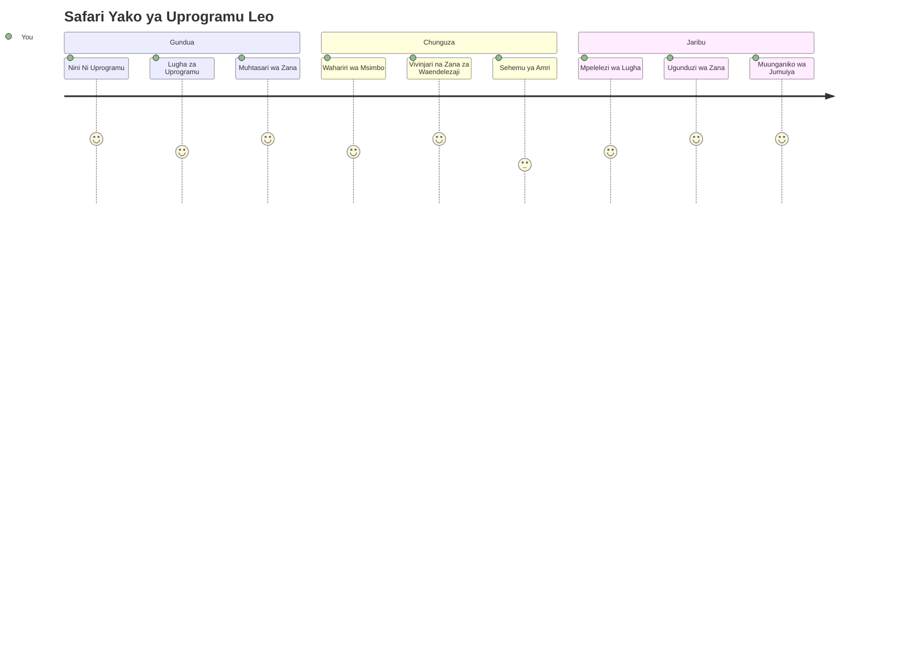
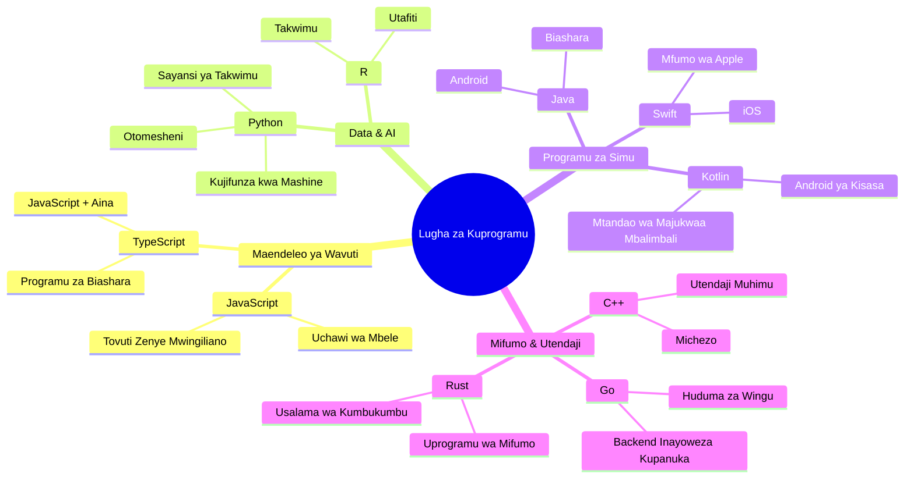
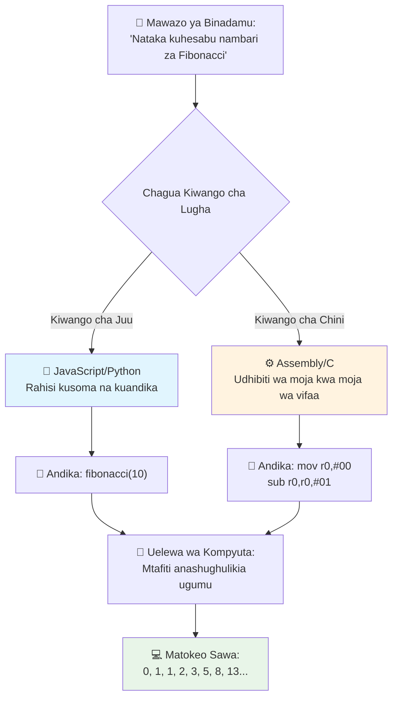
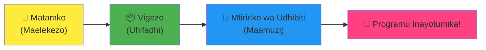
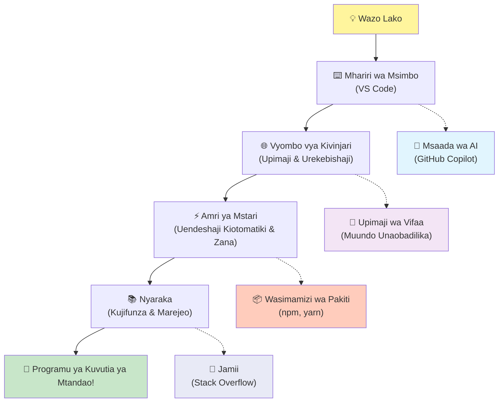
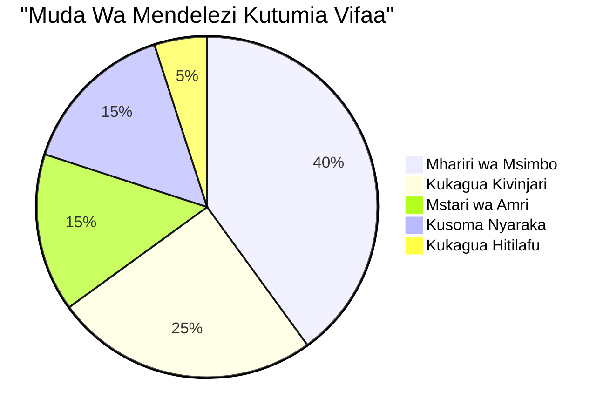
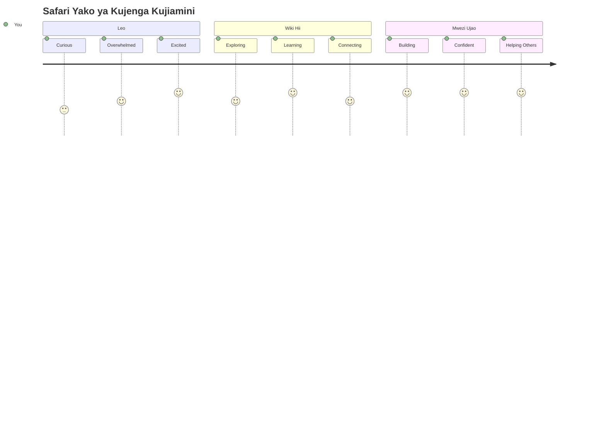

# Utangulizi kwa Lugha za Kuprogramu na Zana za Kisasa za Waundaji wa Programu

Hujambo, muundaji wa baadaye! 👋 Naweza kukuambia kitu ambacho bado kinakupa baridi kila siku? Uko karibu kugundua kuwa programu siyo tu kuhusu kompyuta – ni kuhusu kuwa na nguvu halisi za kipekee za kuleta mawazo yako mabaya katika maisha!

Unajua wakati ule unapokuwa unatumia programu yako uipendayo na kila kitu kinatokea kwa usahihi kabisa? Unapobofya kitufe na kitu cha kichawi kabisa kinatokea ambacho kinakufanya useme "wow, walifanya-je hiyo?" Naam, mtu anaekufanana nawe – labda ameketi kwenye kahawa anayopenda saa 2 usiku akiwa na espresso yake ya tatu – ndiye aliyeandika msimbo uliounda uchawi huo. Na hili ndilo litakalokufanya kushangaa: kufikia mwisho wa somo hili, hutakuwa tu unaelewa jinsi walivyofanya, bali utakuwa unataka kujaribu wewe mwenyewe!

Tazama, ninaelewa kabisa ikiwa programu inakukera sasa hivi. Nilipoanza, nilifikiri kweli unahitaji kuwa genius wa hisabati au umekuwa ukipiga msimbo tangu umekuwa na umri wa miaka mitano. Lakini hili ndilo lililonibadilisha mtazamo: programu ni kama kujifunza kuzungumza lugha mpya. Unaanzia na "hello" na "asante," kisha unajiweka tayari kuagiza kahawa, na kabla haujajua, unazungumza masuala ya falsafa! Ila katika hili, unaendesha mazungumzo na kompyuta, na ukweli? Wao ni wapenzi wa mazungumzo wasio na kulaumu – hawahukumu makosa yako na kila wakati wanataka jaribu tena!

Leo, tutachunguza zana za kushangaza zinazofanya maendeleo ya wavuti wa kisasa kuwa si tu inawezekana, bali kuvutia sana. Ninazungumzia wahariri wa msimbo, vivinjari, na mitiririko ya kazi ambayo waundaji wa Netflix, Spotify, na studio yako ya programu wa indie hutumia kila siku. Na hapa ni sehemu inayokufanya ufanye densi ya furaha: zana nyingi za kiwango cha kitaalamu, zenye viwango vya sekta ni bure kabisa!


> Sketchnote by [Tomomi Imura](https://twitter.com/girlie_mac)


```mermaid
journey
    title Safari Yako ya Uprogramu Leo
    section Gundua
      Nini Ni Uprogramu: 5: You
      Lugha za Uprogramu: 4: You
      Muhtasari wa Zana: 5: You
    section Chunguza
      Wahariri wa Msimbo: 4: You
      Vivinjari na Zana za Waendelezaji: 5: You
      Sehemu ya Amri: 3: You
    section Jaribu
      Mpelelezi wa Lugha: 4: You
      Ugunduzi wa Zana: 5: You
      Muunganiko wa Jumuiya: 5: You
```
## Tuwone Unajua Nini Hadi Sasa!

Kabla hatujaingia kwenye mambo ya kufurahisha, nina hamu – unajua nini kuhusu ulimwengu huu wa programu? Na sikiliza, ikiwa unatazama maswali haya ukifikiri "sijui hata kidogo chochote kuhusu hili," hiyo si tu sawa, ni bora kabisa! Hii ina maana uko mahali sahihi kabisa. Fikiria hii kama mswada wa kufungua misuli kabla ya mazoezi – tunajipa moto misuli ya ubongo!

[Chukua mtihani wa kabla ya somo](https://ff-quizzes.netlify.app/web/)


## Safari Tunayotaka Kuichukua Pamoja

Sawa, nina furaha kabisa kuhusu kile tunachotaka kuchunguza leo! Kweli, natamani kuona uso wako wakati baadhi ya dhana hizi zinaeleweka. Hapa ni safari ya kushangaza tunayoyachukua pamoja:

- **Kilicho programu kweli (na kwa nini ni kitu cha baridi zaidi!)** – Tutagundua jinsi msimbo ni hali ya kichawi isiyoonekana inayoiendesha kila kitu kinachokuzunguka, kutoka ile kengele inayojua ni Jumatatu asubuhi hadi ile algoriti inayochagua mapendekezo yako ya Netflix kwa usahihi
- **Lugha za programu na tabia zao za kushangaza** – Fikiria kuingia kwenye sherehe ambapo kila mtu ana nguvu za kipekee na njia tofauti za kutatua matatizo. Hapo ndio ulimwengu wa lugha za programu uko, na utapenda kukutana nazo!
- **Vijengo vya msingi vinavyofanya uchawi wa kidijitali kutokea** – Fikiria haya kama seti bora kabisa ya LEGO ya ubunifu. Ukielewa jinsi vipande hivi vinaungana, utagundua unaweza kujenga chochote unachotaka kwa mawazo yako
- **Zana za kitaalamu zitakazokufanya uhisi kama umepokea fimbo ya mchawi** – Si mingi hapa – zana hizi zitakufanya uhisi una nguvu za kipekee, na hatua bora? Ndizo zile ambazo wataalamu hutumia!

> 💡 **Haya ni mambo:** Usifikirie hata kidogo kuhusu kukumbuka kila kitu leo! Kwa sasa, nataka uonyeshe msisimko kidogo kuhusu kile kinachowezekana. Maelezo yatakuwa rahisi kueleweka tunapofanya kwa pamoja – ndivyo kujifunza halisi kunavyotokea!

> Unaweza kuchukua somo hili kwenye [Microsoft Learn](https://learn.microsoft.com/en-us/learn/modules/web-development-101/introduction-programming/?WT.mc_id=academic-77807-sagibbon)!

## Hivyo *Basi* Programu ni Nini Halisi?

Sawa, tuchukue swali la thamani kubwa: programu ni nini, kweli?

Nitakuambia hadithi iliyobadilisha kabisa mtazamo wangu kuhusu hili. Wiki iliyopita, nilijaribu kufafanulia mama yangu jinsi ya kutumia dremote ya TV smart mpya tuliyonayo. Nilijikuta nikisema vitu kama "Bofya kitufe chekundu, si kitufe kikubwa chekundu, kitufe kidogo chekundu upande wa kushoto... hapana, upande wako mwingine wa kushoto... sawa, sasa shikilia kwa sekunde mbili, si moja, si tatu..." Je, inakufahamika? 😅

Hiyo ndio programu! Ni sanaa ya kutoa maagizo ya kina, hatua kwa hatua kwa kitu chenye nguvu lakini kinahitaji kila kitu kieleweke kabisa. Ila badala ya kufafanulia mama yako (ambaye anaweza kuuliza "Ni kitufe kapekundu gani?!"), unafafanulia kompyuta (ambayo hufanya tu kile unachosema, hata kama kile ulichoambia si kile ulichomaanisha kabisa).

Hili lilinishangaza nilipojifunza mara ya kwanza: kompyuta ni rahisi kabisa kwa kiini chao. Kwa kweli huelewa mambo mawili tu – 1 na 0, ambayo ni sawa na "ndio" na "hapana" au "zima" na "waka." Hilo ndilo! Lakini hapa ndipo uchawi unaingia – hatuhitaji kuzungumza kwa 1 na 0 kama tunavyofanya kwenye The Matrix. Hapo ndipo **lugha za programu** zinakuja kusaidia. Ziko kama mtafsiri bora wa dunia anayechukua mawazo yako ya kawaida ya kibinadamu na kuyageuza kuwa lugha ya kompyuta.

Na hii bado inanipa baridi kila asubuhi ninapoamka: kila kitu cha kidijitali katika maisha yako alianza na mtu kama wewe, labda ameketi akiwa na pyjama na kikombe cha kahawa, akiandika msimbo kwenye kompyuta yake mpakato. Sefa ya Instagram inayokufanya uonekane mkamilifu? Mtu aliandika msimbo huo. Mapendekezo yaliyokupeleka kwenye wimbo wako mpya unaoupenda? Muundaji wa programu aliunda algoriti hiyo. Programu inayokusaidia kugawanya bili za chakula usiku na marafiki? Ndio, mtu alifikiri "hii ni kuchosha, nadhani ningeweza kutatua hii" na kisha... walifanya!

Unapojifunza kuprogramu, hutangazwi tu ujuzi mpya – unajiunga na jamii hii ya kushangaza ya watu wanaotatua matatizo ambao hutumia siku zao kufikiri, "Je, ningejenga kitu kitakachomfanya mtu aone siku yake kuwa bora kidogo?" Kweli, kuna jambo lolote baridi zaidi ya hilo?

✅ **Jifunze Zaidi Kuhusu Ficto:** Hapa kuna jambo la kupendeza kuangalia unapokuwa na muda huru – unadhani ni nani alikuwa muundaji wa programu wa kwanza duniani? Nitakupa kidokezo: huenda si mtu uliyetarajia! Hadithi ya mtu huyu ni ya kuvutia sana na inaonyesha kuwa programu daima imekuwa kuhusu ubunifu wa kutatua matatizo na kufikiria nje ya gridi.

### 🧠 **Wakati wa Kukagua: Una Jinsi gani?**

**Chukua muda wa kutafakari:**
- Je, wazo la "kutoa maagizo kwa kompyuta" linaeleweka kwako sasa?
- Je, unaweza kufikiria kazi ya kila siku unayopenda kuendesha kwa programu?
- Ni maswali gani yanayojitokeza kichwani mwako kuhusu jambo hili la programu?

> **Kumbuka:** Ni kawaida kabisa ikiwa baadhi ya dhana zinahisi kuchanganyikiwa sasa. Kujifunza programu ni kama kujifunza lugha mpya – inachukua muda kwa ubongo wako kujenga njia za neva. Unaendelea vizuri!

## Lugha za Programu ni Kama Ladha Mbali Mbali za Uchawi

Sawa, hili linaweza kusikika la ajabu, lakini komboa nami – lugha za programu ni kama aina tofauti za muziki. Fikiria hii: una jazz, ambayo ni laini na ya ubunifu, rock yenye nguvu na rahisi, classical ndiyo nzuri na yenye mpangilio, na hip-hop ambayo ni ya ubunifu na ya hisia. Kila mtindo una mtetemo wake, jamii yake ya mashabiki wa moyo wote, na kila moja ni bora kwa hali tofauti na hafla tofauti.

Lugha za programu hufanya sawa kabisa! Huta tumia lugha moja kujenga mchezo wa simu wa furaha na ile unayotumia kushughulikia data kubwa za hali ya hewa, kama hutacheza death metal kwenye darasa la yoga (vyote tunakubaliana! 😄).

Lakini hili ndilo linalonisababisha mshangao kila mara ninapofikiria: lugha hizi ni kama kuwa na mkalimani mwaminifu kabisa, mwenye akili mno ulimwenguni amekaa karibu nawe. Unaweza kueleza mawazo yako kwa njia inayojisikia ya asili kwa ubongo wako wa binadamu, na wao hufanya kazi ngumu sana ya kuyatafsiri kuwa 1 na 0 ambazo kompyuta zinazungumza. Ni kama kuwa na rafiki ambaye ana ufasaha kabisa katika "ubunifu wa kibinadamu" na "mantiki ya kompyuta" – na hawachoki, hawahitaji mapumziko ya kahawa, na hawakukoseni kwa kuuliza swali hilo mara mbili!

### Lugha maarufu za Programu na Matumizi Yake


```mermaid
mindmap
  root((Lugha za Kuprogramu))
    Maendeleo ya Wavuti
      JavaScript
        Uchawi wa Mbele
        Tovuti Zenye Mwingiliano
      TypeScript
        JavaScript + Aina
        Programu za Biashara
    Data & AI
      Python
        Sayansi ya Takwimu
        Kujifunza kwa Mashine
        Otomesheni
      R
        Takwimu
        Utafiti
    Programu za Simu
      Java
        Android
        Biashara
      Swift
        iOS
        Mfumo wa Apple
      Kotlin
        Android ya Kisasa
        Mtandao wa Majukwaa Mbalimbali
    Mifumo & Utendaji
      C++
        Michezo
        Utendaji Muhimu
      Rust
        Usalama wa Kumbukumbu
        Uprogramu wa Mifumo
      Go
        Huduma za Wingu
        Backend Inayoweza Kupanuka
```
| Lugha | Bora Kwa | Kwa Nini Inapendwa |
|----------|----------|------------------|
| **JavaScript** | Maendeleo ya wavuti, interfaces za mtumiaji | Inaendesha kwenye vivinjari na inaendesha tovuti za ushirikiano |
| **Python** | Sayansi ya data, automatisering, AI | Rahisi kusoma na kujifunza, maktaba zenye nguvu |
| **Java** | Programu za mashirika, programu za Android | Haina utegemezi wa jukwaa, imara kwa mifumo mikubwa |
| **C#** | Programu za Windows, maendeleo ya michezo | Msaada mkubwa kutoka ekosistimu ya Microsoft |
| **Go** | Huduma za wingu, mifumo ya nyuma | Haraka, rahisi, iliyoundwa kwa kompyuta za kisasa |

### Lugha za Kiwango cha Juu vs. Kiwango cha Chini

Sawa, hili lilikuwa dhana iliyonivunja akili nilipokuwa nianze kujifunza, kwa hiyo nitashiriki mufano uliomfanya kueleweka kwangu – na natumai itakusaidia pia!

Fikiria unatembelea nchi ambayo husemi lugha yake, na unahitaji haraka kupata choo kilicho karibu (sote tumewahi kupitia hapo, sivyo? 😅):

- **Programu ya kiwango cha chini** ni kama kujifunza lahaja ya eneo hilo vizuri hadi uweze kuzungumza na bibi anayeuza matunda pembezoni kwa kutumia marejeleo ya kitamaduni, lahaja za mtaa, na vichekesho vya ndani vinavyoeleweka tu na mtu aliyekulia huko. Inaonekana hali ya ajabu na ni yenye ufanisi sana... kama unazungumza vizuri! Lakini ni changamoto kubwa unapojaribu tu kutafuta choo.

- **Programu ya kiwango cha juu** ni kama kuwa na rafiki mzuri wa eneo hilo anayekuelewa. Unaweza kusema "Nahitaji kwa haraka kupata choo" kwa Kiingereza rahisi, na yeye hufanya tafsiri yote ya kitamaduni na kukupa mwelekeo unaoeleweka kirahisi kwa ubongo wako usio wa eneo hilo.

Katika istilahi za programu:
- **Lugha za kiwango cha chini** (kama Assembly au C) zinakuwezesha kuwa na mazungumzo ya kina sana na vifaa halisi vya kompyuta, lakini inahitaji kufikiri kama mashine, ambayo ni... basi, ni mabadiliko makubwa ya akili!
- **Lugha za kiwango cha juu** (kama JavaScript, Python, au C#) zinakuwezesha kufikiri kama binadamu wakati zinashughulikia lugha ya mashine za nyuma. Zaidi ya hayo, zina jumuiya za kupokea wageni zilizojaa watu wanaokumbuka ulivyokuwa mpya na wanapenda kusaidia!

Gundua ni zipi nitakopendekeza uanze nazo? 😉 Lugha za kiwango cha juu ni kama magurudumu ya mafunzo ambayo hutaki kuwatoza kwa sababu yanafanya uzoefu mzima kufurahisha zaidi!


```mermaid
flowchart TB
    A["👤 Mawazo ya Binadamu:<br/>'Nataka kuhesabu nambari za Fibonacci'"] --> B{Chagua Kiwango cha Lugha}
    
    B -->|Kiwango cha Juu| C["🌟 JavaScript/Python<br/>Rahisi kusoma na kuandika"]
    B -->|Kiwango cha Chini| D["⚙️ Assembly/C<br/>Udhibiti wa moja kwa moja wa vifaa"]
    
    C --> E["📝 Andika: fibonacci(10)"]
    D --> F["📝 Andika: mov r0,#00<br/>sub r0,r0,#01"]
    
    E --> G["🤖 Uelewa wa Kompyuta:<br/>Mtafiti anashughulikia ugumu"]
    F --> G
    
    G --> H["💻 Matokeo Sawa:<br/>0, 1, 1, 2, 3, 5, 8, 13..."]
    
    style C fill:#e1f5fe
    style D fill:#fff3e0
    style H fill:#e8f5e8
```
### Niruhusu Nikuonyeshe Kwa Nini Lugha za Kiwango cha Juu ni Rafiki Zaidi

Sawa, nitakuonyesha kitu kinachoonyesha kwa ukamilifu kwa nini nilipenda lugha za kiwango cha juu, lakini kabla – nahitaji uahidi kitu. Unapoona mfano wa msimbo wa kwanza, usitetemeke! Inapaswa kuonekana kama ni gumzo la kuogopesha. Hilo ndilo jambo ninaloeleza!

Tutaangalia kazi ile ile iliyowandikwa kwa mitindo miwili tofauti kabisa. Zote zimeunda kinachoitwa mfuatano wa Fibonacci – ni mtindo wa kipekee wa hisabati ambapo kila nambari ni jumla ya mbili zilizopita: 0, 1, 1, 2, 3, 5, 8, 13... (Habari ya kufurahisha: utapata mfano huu kila mahali katika asili – mizunguko ya mbegu za jua, mifumo ya koni za pine, hata njia galaksi zinavyoundwa!)

Uko tayari kuona tofauti? Twende!

**Lugha ya kiwango cha juu (JavaScript) – Rafiki kwa binadamu:**

```javascript
// Hatua 1: Mpangilio wa msingi wa Fibonacci
const fibonacciCount = 10;
let current = 0;
let next = 1;

console.log('Fibonacci sequence:');
```

**Hapa msimbo huu unafanya nini:**
- **Tangaza** thamani ya kudumu ya kuelezea ni nambari ngapi za Fibonacci tunazotaka kuzalisha
- **Anzisha** vigezo viwili kufuatilia nambari ya sasa na inayofuata kwenye mfuatano
- **Weka** thamani za kuanzia (0 na 1) zinazotambulisha mfano wa Fibonacci
- **Onesha** ujumbe wa kichwa wa habari kutambua matokeo yetu

```javascript
// Hatua ya 2: Tengeneza mlolongo kwa kutumia mzunguko
for (let i = 0; i < fibonacciCount; i++) {
  console.log(`Position ${i + 1}: ${current}`);
  
  // Hesabu nambari inayofuata katika mlolongo
  const sum = current + next;
  current = next;
  next = sum;
}
```

**Kuvunja kinachotokea hapa:**
- **Rudia** kupitia kila nafasi kwenye mfuatano kutumia `for` loop
- **Onesha** kila nambari na nafasi yake kwa kutumia muundo wa template literal
- **Hesabu** nambari inayofuata ya Fibonacci kwa kuongeza thamani ya sasa na inayofuata
- **Sasisha** vigezo vyetu kuhamia kwenye kurudia inayofuata

```javascript
// Hatua ya 3: Mbinu ya kisasa ya kazi
const generateFibonacci = (count) => {
  const sequence = [0, 1];
  
  for (let i = 2; i < count; i++) {
    sequence[i] = sequence[i - 1] + sequence[i - 2];
  }
  
  return sequence;
};

// Mfano wa matumizi
const fibSequence = generateFibonacci(10);
console.log(fibSequence);
```

**Juu tulifanya:**
- **Tengeneza** kipengele kinachoweza kutumika tena kwa kutumia muundo wa arrow function wa kisasa
- **Jenga** orodha kuhifadhi mfuatano mzima badala ya kuonyesha moja moja
- **Tumia** indexing ya orodha kuhesabu kila nambari mpya kutoka kwa thamani zilizopita
- **Rudisha** mfuatano mzima kwa matumizi ya kubadilika sehemu nyingine za programu yetu

**Lugha ya kiwango cha chini (ARM Assembly) – Rafiki kwa kompyuta:**

```assembly
 area ascen,code,readonly
 entry
 code32
 adr r0,thumb+1
 bx r0
 code16
thumb
 mov r0,#00
 sub r0,r0,#01
 mov r1,#01
 mov r4,#10
 ldr r2,=0x40000000
back add r0,r1
 str r0,[r2]
 add r2,#04
 mov r3,r0
 mov r0,r1
 mov r1,r3
 sub r4,#01
 cmp r4,#00
 bne back
 end
```

Angalia jinsi toleo la JavaScript linavyosoma karibu kama maagizo ya Kiingereza, wakati toleo la Assembly linatumia amri za siri zinazosimamia moja kwa moja processor ya kompyuta. Zote mbili zinatimiza kazi ile ile, lakini lugha ya kiwango cha juu ni rahisi kwa binadamu kuelewa, kuandika, na kudumisha.

**Tofauti kuu utakazoziona:**
- **Ufasaha wa kusoma**: JavaScript hutumia majina yaliyoeleweka kama `fibonacciCount` wakati Assembly inatumia lebo za fumbo kama `r0`, `r1`
- **Maelezo**: Lugha za kiwango cha juu hutia moyo maelezo ya kielezo yanayofanya msimbo kuwa unaeleweka peke yake
- **Muundo**: Mtiririko wa mantiki wa JavaScript unaendana na jinsi watu wanavyofikiria matatizo hatua kwa hatua
- **Matunzo**: Kusasisha toleo la JavaScript kwa mahitaji tofauti ni rahisi na wazi

✅ **Kuhusu mfuatano wa Fibonacci**: Mchoro huu wa nambari unaopendeza sana (ambapo kila nambari ni jumla ya mbili zilizo nyuma yake: 0, 1, 1, 2, 3, 5, 8...) huonekana kila mahali kabisa katika asili! Utauona katika minyororo ya maua ya jua, mifumo ya koni za miti, namna makalio ya maji ya nautilus yanavyokunja, hata namna matawi ya miti yanavyokua. Ni kitu cha kushangaza jinsi hisabati na msimbo vinaweza kutusaidia kuelewa na kuunda tena mifumo ambayo asili hutumia kuunda uzuri!

## Vifungo Vinavyofanya Uchawi Kutokea

Sawa, sasa umeona jinsi lugha za programu zinavyoonekana zinapofanya kazi, hebu tuvunje vipengele msingi vinavyounda kila programu iliyoandikwa. Fikiria hivi kama viungo muhimu katika mapishi yako unayoupenda – mara tu unapojua kila kimoja kinafanya nini, utaweza kusoma na kuandika msimbo katika karibu lugha yoyote!

Hii ni kama kujifunza sarufi ya programu. Kumbuka shuleni ulipojifunza kuhusu nomino, vitenzi, na jinsi ya kutengeneza sentensi? Programu ina toleo lake la sarufi, na ukweli ni kwamba, lina mantiki zaidi na ni mpole zaidi kuliko sarufi ya Kiingereza ilivyokuwa! 😄

### Tamko: Maelekezo Hatua kwa Hatua

Tuanze na **tamko** – haya ni kama sentensi binafsi katika mazungumzo na kompyuta yako. Kila tamko linaeleza kompyuta kufanya kitu kimoja maalum, kama kutoa maelekezo: "Geuka kushoto hapa," "Simama wakati taa nyekundu," "Paka gari mahali hapo."

Ninachopenda kuhusu tamko ni jinsi yanavyoweza kusomwa kwa urahisi. Angalia hii:

```javascript
// Sentensi za msingi zinazofanya vitendo vya moja kwa moja
const userName = "Alex";                    
console.log("Hello, world!");              
const sum = 5 + 3;                         
```

**Hivi ndivyo msimbo huu unavyofanya kazi:**
- **Tangaza** kigezo cha daima kuhifadhi jina la mtumiaji
- **Onyesha** ujumbe wa salamu kwenye matokeo ya consola
- **Hesabu** na hifadhi matokeo ya operesheni ya hisabati

```javascript
// Matamshi yanayoshirikiana na kurasa za wavuti
document.title = "My Awesome Website";      
document.body.style.backgroundColor = "lightblue";
```

**Hatua kwa hatua, hivi ndivyo vinavyotokea:**
- **Badilisha** kichwa cha ukurasa kinachoonekana kwenye kichupo cha kivinjari
- **Badilisha** rangi ya nyuma ya mwili mzima wa ukurasa

### Vigezo: Mfumo wa Kumbukumbu wa Programu Yako

Sawa, **vigezo** ni kweli moja ya dhana zangu za kupenda kufundisha kwa sababu ni sawa sana na vitu unavyotumia kila siku!

Fikiria orodha ya mawasiliano ya simu yako kwa sekunde. Hautahifadhi namba za simu za kila mtu kichwani – badala yake, unahifadhi "Mama," "Rafiki wa Kote," au "Kona ya Piza Inayowaletea Mpaka Saa 8 Usiku" na kuacha simu yako ikumbuke namba halisi. Vigezo hufanya kazi kwa njia hiyo hiyo! Ni kama vyombo vilivyo na lebo ambavyo programu yako inaweza kuhifadhi taarifa ndani na kuvichukua baadaye kwa kutumia jina linaloeleweka.

Hivi huwa ni vya ajabu: vigezo vinaweza kubadilika wakati programu yako inapotekelezwa (hivyo jina "variable" – umeona walivyo?). Kama vile unaweza kusasisha mawasiliano hayo ya piza unapogundua mahali pazuri zaidi, vigezo vinaweza kusasishwa wakati programu yako inajifunza taarifa mpya au hali inabadilika!

Nikuonyeshe jinsi hii inaweza kuwa rahisi na nzuri:

```javascript
// Hatua ya 1: Kuunda vigezo vya msingi
const siteName = "Weather Dashboard";        
let currentWeather = "sunny";               
let temperature = 75;                       
let isRaining = false;                      
```

**Kuelewa dhana hizi:**
- **Hifadhi** thamani zisizobadilika katika vigezo vya `const` (kama jina la tovuti)
- **Tumia** `let` kwa thamani zinazoweza kubadilika katika programu yako
- **Weka** aina mbalimbali za data: mistringi (maandishi), nambari, na boolean (kweli/siyokuwa)
- **Chagua** majina yanayoelezea yaliyomo kwenye kila kigezo

```javascript
// Hatua ya 2: Kufanya kazi na vitu kuunganishwa data zinazohusiana
const weatherData = {                       
  location: "San Francisco",
  humidity: 65,
  windSpeed: 12
};
```

**Juu yake, tumefanya:**
- **Tengeneza** kitu cha kuunganisha taarifa za hali ya hewa zilizo karibu
- **Panga** vipande vingi vya data chini ya jina moja la kigezo
- **Tumia** jozi za ufunguo-thamani kuonyesha kila kipande cha taarifa kwa uwazi

```javascript
// Hatua ya 3: Kutumia na kusasisha vigezo
console.log(`${siteName}: Today is ${currentWeather} and ${temperature}°F`);
console.log(`Wind speed: ${weatherData.windSpeed} mph`);

// Kusasisha vigezo vinavyobadilika
currentWeather = "cloudy";                  
temperature = 68;                          
```

**Hebu tuelewe kila sehemu:**
- **Onyesha** taarifa kwa kutumia template literals zenye sintaksia ya `${}`
- **Fikia** mali za kitu kwa kutumia alama ya doa (`weatherData.windSpeed`)
- **Sasisha** vigezo vilivyotangazwa kwa `let` kuonesha mabadiliko ya hali
- **Changanya** vigezo vingi kuunda ujumbe wenye maana

```javascript
// Hatua ya 4: Uvunjaji wa kisasa wa muundo kwa msimbo safi zaidi
const { location, humidity } = weatherData; 
console.log(`${location} humidity: ${humidity}%`);
```

**Unachohitaji kujua:**
- **Toa** mali maalum kutoka kwa vitu kwa kutumia ugawaji wa vifunguo
- **Tengeneza** vigezo vipya kiotomatiki kwa majina yale yale ya funguo za vitu
- **Rahisisha** msimbo kwa kuepuka kutumia mara nyingi alama za doa

### Mtiririko wa Udhibiti: Kufundisha Programu Yako Kufikiria

Sasa, hapa ndipo programu inavyopata kuwa ya kushangaza kweli! **Mtiririko wa udhibiti** ni kufundisha programu yako jinsi ya kufanya maamuzi ya busara, sawa na wewe unavyofanya kila siku bila hata kufikiria.

Fikiria hivi: leo asubuhi labda ulipitia kitu kama "Ikiwa kunyevunyevu, nitaenda na mwavuli. Ikiwa ni baridi, nitavaa koti. Ikiwa ninachelewa, nitaacha chakula cha asubuhi na kunywa kahawa njiani." Ubongo wako unafuata mantiki hii ya ikiwa-basi mara nyingi kila siku!

Hili ndilo linalofanya programu kuonekana kuwa na akili na kuishi badala ya tu kufuata maandishi machache ya kuchosha na yanayotarajiwa. Zinapitia hali fulani, kutathmini kinachotokea, na kutoa majibu yanayostahili. Ni kama kumpa programu yako ubongo unaoweza kubadilika na kufanya chaguzi!

Unataka kuona hii inavyofanya kazi kwa urembo? Nikuonyeshe:

```javascript
// Hatua 1: Mantiki ya masharti ya msingi
const userAge = 17;

if (userAge >= 18) {
  console.log("You can vote!");
} else {
  const yearsToWait = 18 - userAge;
  console.log(`You'll be able to vote in ${yearsToWait} year(s).`);
}
```

**Hivi ndivyo msimbo huu unavyofanya:**
- **Kagua** kama umri wa mtumiaji unakidhi mahitaji ya kupiga kura
- **Tekeleza** vikundi vya msimbo tofauti kulingana na matokeo ya hali
- **Hesabu** na onyesha muda hadi mtu aweze kupiga kura ikiwa ameshapungua miaka 18
- **Toa** mrejesho maalum, wenye msaada kwa kila hali

```javascript
// Hatua ya 2: Masharti mengi na waendeshaji wa mantiki
const userAge = 17;
const hasPermission = true;

if (userAge >= 18 && hasPermission) {
  console.log("Access granted: You can enter the venue.");
} else if (userAge >= 16) {
  console.log("You need parent permission to enter.");
} else {
  console.log("Sorry, you must be at least 16 years old.");
}
```

**Kuvunja kile kinachotokea hapa:**
- **Changanya** masharti mengi kwa kutumia kiendeshaji `&&` (na)
- **Tengeneza** mtawanyiko wa masharti kwa kutumia `else if` kwa hali mbalimbali
- **Shughulikia** matukio yote yanayowezekana kwa tamko la mwisho la `else`
- **Toa** mrejesho wazi, wa utekelezaji kwa kila hali tofauti

```javascript
// Hatua ya 3: Hali fupi kwa kutumia mtaalamu wa ternary
const votingStatus = userAge >= 18 ? "Can vote" : "Cannot vote yet";
console.log(`Status: ${votingStatus}`);
```

**Kumbuka yafuatayo:**
- **Tumia** kiendeshaji cha ternary (`? :`) kwa hali rahisi zenye chaguzi mbili
- **Andika** sharti kwanza, ifuatiwe na `?`, kisha matokeo ya kweli, `:`, na hitimisho la uongo
- **Tumia** mtindo huu unapohitaji kuweka thamani kulingana na hali

```javascript
// Hatua ya 4: Kushughulikia kesi nyingi maalum
const dayOfWeek = "Tuesday";

switch (dayOfWeek) {
  case "Monday":
  case "Tuesday":
  case "Wednesday":
  case "Thursday":
  case "Friday":
    console.log("It's a weekday - time to work!");
    break;
  case "Saturday":
  case "Sunday":
    console.log("It's the weekend - time to relax!");
    break;
  default:
    console.log("Invalid day of the week");
}
```

**Msimbo huu unatekeleza yafuatayo:**
- **Lingana** thamani ya kigezo kwa matukio mengi maalum
- **Shirikisha** matukio yanayofanana pamoja (siku za wiki dhidi ya wikendi)
- **Tekeleza** msimbo unaofaa wakati patikana mechi
- **Jumlisha** kesi ya `default` kushughulikia thamani zisizotarajiwa
- **Tumia** tamko la `break` kuzuia msimbo kuendelea hadi kesi inayofuata

> 💡 **Mfano halisi**: Fikiria mtiririko wa udhibiti kama GPS yenye subira zaidi duniani ikikupa maelekezo. Inaweza kusema "Ikiwa kuna msongamano Main Street, chukua barabara kuu badala yake. Ikiwa ujenzi unazuia barabara kuu, jaribu njia ya mandhari." Programu hutumia mantiki hii ya masharti jinsi hiyo kuonyesha ujasiri na kuwapa watumiaji uzoefu bora kila wakati.

### 🎯 **Kutegemeza Dhana: Ustadi wa Vifungo vya Msingi**

**Tuweze kuona unaendeleaje na msingi:**
- Unaweza kuelezea tofauti kati ya kigezo na tamko kwa maneno yako mwenyewe?
- Fikiria hali halisi ambapo utatumia uamuzi wa ikiwa-basi (kama mfano wetu wa kupiga kura)
- Ni jambo gani moja kuhusu mantiki ya programu lililokushangaza?

**Kukuongeza hamu ya kuendelea:**

```mermaid
flowchart LR
    A["📝 Matamko<br/>(Maelekezo)"] --> B["📦 Vigezo<br/>(Uhifadhi)"] --> C["🔀 Mtiririko wa Udhibiti<br/>(Maamuzi)"] --> D["🎉 Programu Inayotumika!"]
    
    style A fill:#ffeb3b
    style B fill:#4caf50
    style C fill:#2196f3
    style D fill:#ff4081
```
✅ **Kinachokuja baadaye**: Tutakuwa na wakati mzuri mno kuchunguza zaidi dhana hizi tunapoendelea katika safari hii ya kushangaza pamoja! Kwa sasa, zingatia hisia ya msisimko kuhusu fursa zote kubwa zinazokuja mbele yako. Ujuzi maalum na mbinu zitakuwepo kwa asili tunapofanya mazoezi pamoja – ninaahidi huu utakuwa wakati mzuri kuliko ulivyotarajia!

## Vifaa vya Kazi

Sawa, hapa ndio ninaposhindwa kuweka hamu yangu chini! 🚀 Tunaenda kuzungumza kuhusu vifaa vya kushangaza ambavyo vitafanya uhisi kama umepatiwa funguo za roketi ya kidijitali.

Unajua jinsi mpishi anavyokuwa na visu vya usawa vinavyohisi kama sehemu ya mikono yao? Au jinsi mwanamuziki anavyo kuwa na gitaa moja inayopiga nyimbo mara tu wanapigusa? Sawa, waendelezaji wana toleo lao la vifaa vya kichawi, na hapa ndilo litakachokuvutia kabisa – wengi wao ni bure kabisa!

Nipo kama niko juu ya kiti nakifikiria kuwasilisha haya kwako maana yameleta mapinduzi katika jinsi tunavyojenga programu. Tunazungumza kuhusu washirika wa kuandika msimbo wenye AI wanaosaidia kuandika msimbo (sijacheki!), mazingira ya wingu yanayowezesha kutengeneza programu zote kutoka mahali popote penye Wi-Fi, na zana za kubaini makosa ngumu mno hadi zinakaribia kuwa kama kuona ndani ya programu zako.

Na hii bado inanipa mshtuko: hizi si "vifaa vya waanzilishi" utakavyokua nayo. Hizi ndiyo vifaa halisi vya kiwango cha kitaalamu vinavyotumiwa na waendelezaji wa Google, Netflix, na studio hiyo ya programu ndogo unayopenda wakati huu kabisa. Utahisi kama mtaalamu mtukufu unapotumia hizi!


```mermaid
graph TD
    A["💡 Wazo Lako"] --> B["⌨️ Mhariri wa Msimbo<br/>(VS Code)"] 
    B --> C["🌐 Vyombo vya Kivinjari<br/>(Upimaji & Urekebishaji)"]
    C --> D["⚡ Amri ya Mstari<br/>(Uendeshaji Kiotomatiki & Zana)"]
    D --> E["📚 Nyaraka<br/>(Kujifunza & Marejeo)"]
    E --> F["🚀 Programu ya Kuvutia ya Mtandao!"]
    
    B -.-> G["🤖 Msaada wa AI<br/>(GitHub Copilot)"]
    C -.-> H["📱 Upimaji wa Vifaa<br/>(Muundo Unaobadilika)"]
    D -.-> I["📦 Wasimamizi wa Pakiti<br/>(npm, yarn)"]
    E -.-> J["👥 Jamii<br/>(Stack Overflow)"]
    
    style A fill:#fff59d
    style F fill:#c8e6c9
    style G fill:#e1f5fe
    style H fill:#f3e5f5
    style I fill:#ffccbc
    style J fill:#e8eaf6
```
### Wahariri wa Msimbo na IDE: Marafiki Wako Mpya wa Kidijitali

Tuzungumze kuhusu wahariri wa msimbo – hivi sasa watakuwa sehemu zako unazopenda zaidi! Fikiria kama makao yako mwenyewe ya maandalizi ya msimbo ambapo utatumia muda mwingi sana kutengeneza na kuboresha kazi zako za kidijitali.

Lakini hali hii ya kufurahisha kuhusu wahariri wa kisasa ni hii: si wahariri wa kawaida wa maandishi. Ni kama kuwa na mshauri bora wa kuandika msimbo karibu nawe saa 24/7. Wanakamata makosa yako kabla hujayagundua, wanasisitiza maboresho yanayokufanya uonekane mwerevu, wanakusaidia kuelewa kila sehemu ya msimbo, na wengine wao hata wanaweza kutabiri unachotaka kuandika na kukamilisha mawazo yako!

Nakumbuka nilipogundua auto-completion mara ya kwanza – hisia ilikuwa kama niishi katika siku za usoni. Unaanza kuandika kitu, na mhariri anasema, "Je, ulikuwa unafikiria kuhusu kipengele hiki kinachofanya hasa kile unachotaka?" Ni kama kuwa na msomaji wa akili kama rafiki wa kuandika msimbo!

**Ni nini kinachofanya wahariri hawa kuwa wa ajabu sana?**

Wahariri wa msimbo wa kisasa huleta vipengele vingi vya kuvutia vilivyotengenezwa kusaidia kuongeza tija yako:

| Kipengele | Kinachofanya | Kwa Nini Kinafaa |
|---------|--------------|--------------|
| **Uangazaji wa Sarufi** | Hurangi sehemu tofauti za msimbo wako | Hufanya msimbo usuafiki kusoma na kugundua makosa |
| **Auto-completion** | Inapendekeza msimbo unapoandika | Huarifu kuandika msimbo na kupunguza makosa ya tahajia |
| **Zana za Kubaini Makosa** | Husaidia kutiangazia na kurekebisha makosa | Hutoa saa nyingi za kutatua matatizo |
| **Mikengeuko** | Ongeza vipengele maalum | Binafsisha mhariri wako kwa teknolojia yoyote |
| **Msaidizi wa AI** | Pendekeza msimbo na maelezo | Harakisha kujifunza na kuzalisha kazi kwa ufanisi |

> 🎥 **Rasilimali ya Video**: Unataka kuona vifaa hivi vinavyofanya kazi? Angalia [video ya Vifaa vya Kazi](https://youtube.com/watch?v=69WJeXGBdxg) kwa muhtasari kamili.

#### Wahariri Waliopendekezwa kwa Maendeleo ya Wavuti

**[Visual Studio Code](https://code.visualstudio.com/?WT.mc_id=academic-77807-sagibbon)** (Bure)
- Pengine maarufu zaidi kwa waendelezaji wavuti
- Mfumo bora wa mikengeuko
- Terminal iliyojengwa ndani na muunganisho wa Git
- **Mikengeuko ya lazima:**
  - [GitHub Copilot](https://marketplace.visualstudio.com/items?itemName=GitHub.copilot) - Mapendekezo ya msimbo yenye nguvu ya AI
  - [Live Share](https://marketplace.visualstudio.com/items?itemName=MS-vsliveshare.vsliveshare) - Ushirikiano wa wakati halisi
  - [Prettier](https://marketplace.visualstudio.com/items?itemName=esbenp.prettier-vscode) - Urekebishaji wa kiotomatiki wa msimbo
  - [Code Spell Checker](https://marketplace.visualstudio.com/items?itemName=streetsidesoftware.code-spell-checker) - Kugundua makosa ya tahajia kwenye msimbo wako

**[JetBrains WebStorm](https://www.jetbrains.com/webstorm/)** (Zilizolipwa, bure kwa wanafunzi)
- Zana za hali ya juu za kubaini makosa na majaribio
- Ukomavu wa kukamilisha msimbo
- Udhibiti wa toleo uliojengwa ndani

**IDE za Wingu** (Bei mbalimbali)
- [GitHub Codespaces](https://github.com/features/codespaces) - VS Code kamili katika kivinjari chako
- [Replit](https://replit.com/) - Nzuri kwa kujifunza na kushiriki msimbo
- [StackBlitz](https://stackblitz.com/) - Maendeleo ya wavuti ya haraka, mfano kamili

> 💡 **Mwongozo wa Kuanzisha**: Anza na Visual Studio Code – ni bure, inatumiwa sana kwenye sekta, na ina jumuiya kubwa inayotengeneza mafunzo na mikengeuko yenye msaada.


### Vivinjari vya Wavuti: Maabara Yako ya Siri ya Maendeleo

Sawa, jiandae kufurahia akili yako kabisa! Unajua umekuwa ukitumia vivinjari kusogeza kupitia mitandao ya kijamii na kutazama video? Sawa, inaonekana wamekuwa wakificha maabara hii ya ajabu ya watengenezaji kwa muda wote, wakisubiri tu uigundue!

Kila unapobofya kulia kwenye ukurasa na kuchagua "Inspect Element," unafungua dunia iliyofichwa ya zana za watengenezaji ambazo ni zenye nguvu zaidi kuliko programu ghali ambazo nilizikuwa nikipa maelfu ya dola zamani. Ni kama kugundua jikoni yako ya kawaida imekuwa ikifunua maabara ya mpishi mtaalamu nyuma ya paneli ya siri!
Mara ya kwanza mtu aliniona DevTools za kivinjari, nilitumia kama saa tatu nikibonyeza hapa na pale nikiwaza "SUBIRI, INAVYOFANYA HIVYO PIA?!" Kwa kweli unaweza kuhariri tovuti yoyote kwa wakati halisi, kuona haraka kila kitu kinapakia, kujaribu jinsi tovuti yako inavyoonekana kwenye vifaa tofauti, na hata kutatua matatizo ya JavaScript kama mtaalamu halisi. Ni ya kushangaza kabisa!

**Hapa ndio sababu vivinjari ni silaha yako ya siri:**

Unapounda tovuti au programu ya wavuti, unahitaji kuona jinsi inavyoonekana na kutenda katika ulimwengu halisi. Vivinjari havionyeshi tu kazi yako bali pia hutoa maoni ya kina kuhusu utendaji, upatikanaji, na matatizo yanayoweza kutokea.

#### Zana za Mwendelezi wa Kivinjari (DevTools)

Vivinjari vya kisasa vinajumuisha zana kamili za maendeleo:

| Kategori ya Zana | Inafanya Nini | Mfano wa Matumizi |
|------------------|--------------|-------------------|
| **Mtazamo wa Vipengele** | Tazama na hariri HTML/CSS kwa wakati halisi | Rekebisha mtindo kuona matokeo mara moja |
| **Konsoli** | Tazama ujumbe wa makosa na jaribu JavaScript | Tatua matatizo na jaribu msimbo |
| **Kisimamizi Mtandao** | Fuata jinsi rasilimali zinapakiwa | Boresha utendaji na nyakati za upakiaji |
| **Kikagua Upatikanaji** | Jaribu muundo unaojumuisha watu wote | Hakikisha tovuti yako inafanya kazi kwa watumiaji wote |
| **Sanifu Vifaa** | Tazama awali kwenye saizi tofauti za skrini | Jaribu muundo unaojibadilisha bila vifaa vingi |

#### Vivinjari Vilivyopendekezwa kwa Maendeleo

- **[Chrome](https://developers.google.com/web/tools/chrome-devtools/)** - DevTools za viwango vya viwandani na nyaraka za kina
- **[Firefox](https://developer.mozilla.org/docs/Tools)** - Zana bora za CSS Grid na upatikanaji
- **[Edge](https://docs.microsoft.com/microsoft-edge/devtools-guide-chromium/?WT.mc_id=academic-77807-sagibbon)** - Imejengwa juu ya Chromium na rasilimali za Microsoft kwa waendelezaji

> ⚠️ **Mshauri Muhimu wa Upimaji**: Hakikisha kujaribu tovuti zako kwenye vivinjari vingi! Kinachofanya kazi vizuri kwenye Chrome kinaweza kuonekana tofauti kwenye Safari au Firefox. Waendelezaji wa kitaalamu hujaribu kwenye vivinjari vyote vikuu ili kuhakikisha uzoefu wa mtumiaji ni thabiti.


### Zana za Mstari wa Amri: Mlango Wako wa Nguvu za Kuendeleza

Sawa, hebu tuwe waaminifu kabisa kuhusu mstari wa amri, kwa sababu nataka usiseme tu na mtu, bali mtu anaelewa sana. Nilipouona mara ya kwanza – ni kati ya skrini nyeusi yenye maandishi yanayong'aa – nilifikiri, "Hapana kabisa! Hii inaonekana kama filamu ya mdukuzi ya miaka ya 1980, na mimi si mwerevu kiasi hicho kwa hili!" 😅

Lakini hapa ni kile ningetaka mtu angenieleza wakati huo, na ninakueleza sasa hivi: mstari wa amri hauogopi – ni kama kuwa na mazungumzo ya moja kwa moja na kompyuta yako. Fikiria kama tofauti kati ya kuagiza chakula kupitia app ya kisasa yenye picha na menyu (ambayo ni rahisi na nzuri) dhidi ya kuingia kwa mgeni kwenye mgahawa unaoupenda ambapo mpishi anajua kabisa unachopenda na anaweza kuandaa kitu bora tu kwa kusema "nishangaze na kitu kizuri."

Mstari wa amri ni mahali ambapo waendelezaji hujisikia kama wachawi halisi. Unaandika maneno machache yanayoonekana kuwa ya kichawi (sawa, ni amri tu, lakini yanahisi ya kichawi!), bonyeza enter, NA HAPA NDIYO – umeundwa miundo yote ya mradi, kusanidi zana zenye nguvu kutoka duniani kote, au kupeleka app yako mtandaoni kwa watu milioni kuona. Mara unapochukua ladha ya kwanza ya nguvu hiyo, ni kabisa inakuvutia!

**Kwa nini mstari wa amri utakuwa zana yako uipendayo:**

Wakati interfaces za picha ni nzuri kwa kazi nyingi, mstari wa amri unajivunia otomatiki, usahihi, na kasi. Zana nyingi za maendeleo hufanya kazi hasa kupitia interface ya mstari wa amri, na kujifunza kuzitumia kwa ufanisi kunaweza kuboresha sana uzalishaji wako.

```bash
# Hatua 1: Unda na uelekee kwenye saraka ya mradi
mkdir my-awesome-website
cd my-awesome-website
```

**Hivi ndivyo msimbo huu unavyofanya:**
- **Unda** saraka mpya inayoitwa "my-awesome-website" kwa mradi wako
- **Ingia** kwenye saraka mpya kuanza kufanya kazi

```bash
# Hatua ya 2: Anzisha mradi na package.json
npm init -y

# Sakinisha zana za kisasa za maendeleo
npm install --save-dev vite prettier eslint
npm install --save-dev @eslint/js
```

**Hatua kwa hatua, hapa kinatokea nini:**
- **anzisha** mradi mpya wa Node.js kwa mipangilio ya msingi ukitumia `npm init -y`
- **sanidi** Vite kama zana ya kisasa ya ujenzi kwa maendeleo ya haraka na ujenzi wa uzalishaji
- **ongeza** Prettier kwa upangaji wa msimbo kiotomatiki na ESLint kwa ukaguzi wa ubora wa msimbo
- **tumia** bendera ya `--save-dev` kuonyesha hivi ni viinua only vya maendeleo

```bash
# Hatua ya 3: Unda muundo wa mradi na faili
mkdir src assets
echo '<!DOCTYPE html><html><head><title>My Site</title></head><body><h1>Hello World</h1></body></html>' > index.html

# Anzisha seva ya maendeleo
npx vite
```

**Juu, tume:**
- **Panga** mradi wetu kwa kuunda folda tofauti za msimbo wa chanzo na mali
- **Tengeneza** faili la msingi la HTML lenye muundo sahihi wa hati
- **Anza** seva ya maendeleo ya Vite kwa upyaaji wa moja kwa moja na kubadilisha vipengele moto

#### Zana Muhimu za Mstari wa Amri kwa Uendelezaji wa Wavuti

| Zana | Kusudi | Kwa Nini Unahitaji |
|------|---------|-------------------|
| **[Git](https://git-scm.com/)** | Udhibiti toleo | Fuata mabadiliko, shirikiana na wengine, hifadhi kazi yako |
| **[Node.js & npm](https://nodejs.org/)** | Muda wa utekelezaji wa JavaScript & usimamizi wa pakiti | Endesha JavaScript nje ya vivinjari, sanidi zana za kisasa za maendeleo |
| **[Vite](https://vitejs.dev/)** | Zana ya kujenga & seva ya maendeleo | Maendeleo ya kasi sana yenye kubadilisha vipengele moto |
| **[ESLint](https://eslint.org/)** | Ubora wa msimbo | Tambua na rekebisha matatizo katika JavaScript yako kiotomatiki |
| **[Prettier](https://prettier.io/)** | Upangaji wa msimbo | Dumisha msimbo wako ukifanikiwa na kuwa rahisi kusoma |

#### Chaguzi za Mfumo Mahususi

**Windows:**
- **[Windows Terminal](https://docs.microsoft.com/windows/terminal/?WT.mc_id=academic-77807-sagibbon)** - Terminal ya kisasa yenye vipengele vingi
- **[PowerShell](https://docs.microsoft.com/powershell/?WT.mc_id=academic-77807-sagibbon)** 💻 - Mazingira yenye nguvu ya uandishi wa skripti
- **[Command Prompt](https://docs.microsoft.com/windows-server/administration/windows-commands/?WT.mc_id=academic-77807-sagibbon)** 💻 - Mstari wa amri wa Windows wa jadi

**macOS:**
- **[Terminal](https://support.apple.com/guide/terminal/)** 💻 - Programu ya terminal iliyojengwa ndani
- **[iTerm2](https://iterm2.com/)** - Terminal iliyoimarishwa yenye vipengele vya hali ya juu

**Linux:**
- **[Bash](https://www.gnu.org/software/bash/)** 💻 - Shell ya kawaida ya Linux
- **[KDE Konsole](https://docs.kde.org/trunk5/en/konsole/konsole/index.html)** - Emulator wa terminal yenye vipengele vya hali ya juu

> 💻 = Imewekwa awali kwenye mfumo wa uendeshaji

> 🎯 **Njia ya Kujifunza**: Anza na amri za msingi kama `cd` (badilisha saraka), `ls` au `dir` (orodhesha faili), na `mkdir` (tengeneza folda). Fanya mazoezi kwa amri za kazi za kisasa kama `npm install`, `git status`, na `code .` (fungua saraka ya sasa VS Code). Unapokuwa mtaalamu zaidi, utajifunza amri na mbinu za otomatiki za hali ya juu kwa asili.


### Nyaraka: Mwalimu Wako Anayepatikana Daima Kujaribu

Sawa, niruhusu nishiriki siri kidogo itakayokufanya uhisi afadhali sana kuwa mwanzoni: hata waendelezaji wenye uzoefu mkubwa hutumia sehemu kubwa ya wakati wao kusoma nyaraka. Na sio kwa sababu hawajui wanachofanya – ni ishara ya hekima!

Fikiria nyaraka kama kuwa na walimu wenye subira kubwa, maarifa na wanaopatikana masaa 24/7. Umekwama na tatizo saa 2 za usiku? Nyaraka zipo na kumbatio la joto la kidijitali na jibu sahihi unalotaka. Unataka kujifunza kuhusu kipengele kipya kinachozungumzwa na kila mtu? Nyaraka zinajali na mifano hatua kwa hatua. Unajaribu kuelewa kwa nini kitu kinafanya kazi kama kilivyo? Kumbuka – nyaraka ziko tayari kukueleza kwa njia itakayokuachia kuelewa kabisa!

Hapa kuna kitu kilinibadilishia mtazamo kabisa: dunia ya maendeleo ya wavuti inaenda haraka sana, na hakuna mtu (naam, kabisa hakuna!) anayehifadhi kila kitu akilini. Nimewatazama waendelezaji wakuu wenye uzoefu wa miaka 15+ wakitafuta muundo wa msingi, na unajua? Hiyo si aibu – ni busara! Sio kuhusu kuwa na kumbukumbu kamili; ni kuhusu kujua wapi kupata majibu ya kuaminika haraka na kuelewa jinsi ya kuyatumia.

**Hapa ndipo uchawi halisi unapotokea:**

Waendelezaji wa kitaalamu hutumia sehemu kubwa ya wakati wao kusoma nyaraka – si kwa sababu hawajui wanachofanya, bali kwa sababu mandhari ya maendeleo ya wavuti hubadilika kwa kasi hivyo kuweka hatua kunahitaji kujifunza endelevu. Nyaraka bora zinakusaidia kuelewa sio tu *jinsi* ya kutumia kitu, bali *kwa nini* na *lini* kuvitumia.

#### Rasilimali Muhimu za Nyaraka

**[Mozilla Developer Network (MDN)](https://developer.mozilla.org/docs/Web)**
- Kiwango cha dhahabu kwa nyaraka za teknolojia ya wavuti
- Miongozo kamili kwa HTML, CSS, na JavaScript
- Inajumuisha taarifa za ulinganifu wa vivinjari
- Ina mifano ya vitendo na maonyesho ya mwingiliano

**[Web.dev](https://web.dev)** (kutoka Google)
- Mbinu bora za kisasa za maendeleo ya wavuti
- Miongozo ya uboreshaji wa utendaji
- Kanuni za upatikanaji na muundo jumuishi
- Masomo ya kesi kutoka miradi ya ulimwengu wa kweli

**[Microsoft Developer Documentation](https://docs.microsoft.com/microsoft-edge/#microsoft-edge-for-developers)**
- Rasilimali za maendeleo ya kivinjari cha Edge
- Miongozo ya Progressive Web App
- Maarifa ya maendeleo kwa mitandao mingi

**[Frontend Masters Learning Paths](https://frontendmasters.com/learn/)**
- Mtaala wa kujifunza uliopangwa
- Kozi za video kutoka kwa wataalamu wa sekta
- Mazoezi ya msimbo ya vitendo

> 📚 **Mkakati wa Kusoma**: Usijaribu kukumbuka nyaraka yote – badala yake, jifunze kuvinjari kwa ufanisi. Weka alama rasilimali unazotumia mara kwa mara na fanya mazoezi kutumia kazi za utafutaji kupata taarifa maalum haraka.

### 🔧 **Kukagua Uwezo wa Zana: Nini Kinachokuvutia?**

**Chukua muda ufikirie:**
- Ni zana gani una hamu zaidi kujaribu kwanza? (Hakuna jibu baya!)
- Je, mstari wa amri bado unakuogopesha, au una hamu ya kuijua?
- Unaweza kufikiria kutumia DevTools za kivinjari kuangalia siri za nyuma ya tovuti unazopenda?


```mermaid
pie title "Muda Wa Mendelezi Kutumia Vifaa"
    "Mhariri wa Msimbo" : 40
    "Kukagua Kivinjari" : 25
    "Mstari wa Amri" : 15
    "Kusoma Nyaraka" : 15
    "Kukagua Hitilafu" : 5
```
> **Maarifa ya kufurahisha**: Waendelezaji wengi hutumia takriban asilimia 40 ya wakati wao katika mhariri wa msimbo, lakini zingatia jinsi muda mwingi unatumika kwa upimaji, kujifunza, na kutatua matatizo. Programu siyo tu kuandika msimbo – ni kutengeneza uzoefu!

✅ **Chunguzi la Kupendelea**: Hapa kuna jambo la kufikiria – je, unaonaje zana za kujenga tovuti (maendeleo) zinavyotofautiana na zana za kubuni jinsi zinavyoonekana (muundo)? Ni kama tofauti kati ya kuwa mbunifu binafsi anayeunda nyumba nzuri na mkandarasi anayejenga nyumba hiyo. Zote ni muhimu, lakini zina masanduku tofauti ya zana! Mtazamo huu utakusaidia kuona taswira kubwa jinsi tovuti zinavyoanzishwa.

## Changamoto ya Wakala wa GitHub Copilot 🚀

Tumia hali ya Wakala kukamilisha changamoto ifuatayo:

**Maelezo:** Chunguza vipengele vya mhariri wa msimbo wa kisasa au IDE na uonyeshe jinsi inavyoweza kuboresha mtiririko wako wa kazi kama mtaalamu wa wavuti.

**Maelekezo:** Chagua mhariri wa msimbo au IDE (kama Visual Studio Code, WebStorm, au IDE ya wingu). Orodhesha vipengele tatu au nyongeza zinazokusaidia kuandika, kutatua matatizo, au kudumisha msimbo kwa ufanisi zaidi. Kila moja toa maelezo mafupi jinsi inavyoboresha mtiririko wako wa kazi.

---

## 🚀 Changamoto

**Sawa, mpelelezi, tayari kwa kesi yako ya kwanza?**

Sasa kwa kuwa umepata msingi huu mzuri, ninaendeleza adventure itakayokusaidia kuona jinsi ulimwengu wa programu unavyotofautiana na kuvutia. Sikiliza – hii sio kuhusu kuandika msimbo bado, huna shinikizo lolote! Fikiria kama mpelelezi wa lugha za programu kwenye kesi yako ya kwanza yenye msisimko!

**Misheni yako, kama utachagua kuitikia:**
1. **Kuwa mchunguzi wa lugha:** Chagua lugha tatu za programu kutoka ulimwengu tofauti kabisa – labda moja linalojenga tovuti, moja linalotengeneza programu za simu, na moja linalochambua data kwa wanasayansi. Tafuta mifano ya kazi rahisi ile ile imeandikwa katika kila lugha. Ninaahidi utafurahi jinsi zinavyoweza kuonekana tofauti kabisa huku zikifanya kitu kimoja halisi!

2. **Gundua hadithi zao za asili:** Nini kinachofanya kila lugha kuwa ya kipekee? Hapa kuna ukweli mzuri – kila lugha ya programu imetengenezwa kwa sababu mtu alifikiri, "Unajua nini? Lazima kuwe na njia bora ya kutatua tatizo hili maalum." Je, unaweza kubaini tatizo hilo lilikuwa lipi? Baadhi ya hadithi hizi ni za kuvutia kabisa!

3. **Kutana na jamii:** Angalia jinsi jamii ya kila lugha inavyokukaribisha na kuwa na shauku. Baadhi ina maelfu ya waendelezaji wakishirikiana na kusaidiana, wengine ni wadogo lakini wana mshikamano mkubwa sana na msaada. Utapenda kuona tabia tofauti za jamii hizi!

4. **Fuata hisia zako:** Ni lugha gani unayohisi ni rahisi kwako kwa sasa? Usijali kuchukua uamuzi "mkamilifu" – sikiliza tu hisia zako! Hakuna jibu baya hapa, na unaweza kila wakati kuchunguza nyingine baadaye.

**Kazi ya ziada kwa mpelelezi**: Angalia kama unaweza kugundua ni tovuti au programu gani kubwa zimejengwa kwa kila lugha. Nihakikishie utashangazwa kujua kinachoiendesha Instagram, Netflix, au mchezo wa simu usioachwa kucheza!

> 💡 **Kumbuka**: Haujai kuwa mtaalamu wa lugha hizi leo. Unajifunza tu mazingira kabla ya kuamua wapi unataka kuanzisha makazi. Chukua muda, furahia, na ufuate hamu yako ya kujua!

## Tuadhimishe Ulimwengu Uliougundua!

Mzazi wa raha, umepokea maarifa mengi ya kushangaza leo! Ninashukuru kabisa kuona jinsi sehemu kubwa ya safari hii ya ajabu imekushika. Na kumbuka – hii si mtihani wa kupata kila kitu kamili. Hii ni sherehe ya mambo mazuri uliyoyajifunza kuhusu ulimwengu huu wa kuvutia unaojiandaa kuingia ndani yake!

[Chukua mtihani wa baada ya somo](https://ff-quizzes.netlify.app/web/)

## Tathmini & Kujisomea Mwenyewe

**Chukua muda kuchunguza na kufurahia!**
Umekamilisha mambo mengi leo, na hiyo ni kitu cha kujivunia! Sasa inakuja sehemu ya kufurahisha – kuchunguza mada zilizoamua udadisi wako. Kumbuka, huu sie kazi ya nyumbani – ni safari ya kusisimua!

**Zamisha zaidi katika kile kinachokuvutia:**

**Jitosee katika lugha za programu:**
- Tembelea tovuti rasmi za lugha 2-3 za programu zilizokuvutia. Kila moja ina utu na hadithi yake ya kipekee!
- Jaribu baadhi ya maeneo ya kuchezea msimbo mtandaoni kama [CodePen](https://codepen.io/), [JSFiddle](https://jsfiddle.net/), au [Replit](https://replit.com/). Usijizuaye kujaribu – hutaweza kuvunja chochote!
- Soma kuhusu jinsi lugha unayopenda ilivyotokea. Kweli kabisa, baadhi ya hadithi hizi za asili ni za kuvutia na zitakusaidia kuelewa kwa nini lugha zinafanya kazi kama zinavyofanya.

**Jifunze kutumia zana zako mpya kwa urahisi:**
- Pakua Visual Studio Code ikiwa bado hujafanya hivyo – ni bure na utapenda sana!
- Tumia dakika chache kuvinjari soko la Extensions. Ni kama duka la programu la mhariri wako wa msimbo!
- Fungua Zana za Mwanaendelezi (Developer Tools) kwenye kivinjari chako na bonyeza sehemu mbalimbali. Usijali kuelewa kila kitu – jifunze tu kuhusu kilichopo.

**Jiunge na jamii:**
- Fuata baadhi ya jumuiya za waendelezaji kwenye [Dev.to](https://dev.to/), [Stack Overflow](https://stackoverflow.com/), au [GitHub](https://github.com/). Jamii ya waprogramu ni ya kupokea wageni vibaya kabisa!
- Tazama video za kuanzia kuandika msimbo kwenye YouTube. Kuna waumba wengi wazuri sana ambao wanakumbuka jinsi ilivyokuwa kuanza.
- Fikiria kujiunga na mikutano ya karibu au jumuiya mtandaoni. Niamini, waendelezaji wanapenda kuwasaidia wanaoanza!

> 🎯 **Sikiliza, hapa ndipo nataka ukumbuke**: Haurajiwi kuwa mchawi wa kuandika programu usiku mmoja! Hivi sasa, unajifunza tu kuhusu dunia hii mpya ya kushangaza ambayo unakaribia kuingia. Chukua muda wako, furahia safari, na kumbuka – kila mtaalamu unayemheshimu alikuwa anakaa mahali ulipo sasa, akihisi msisimko na labda kidogo kuchanganyikiwa. Hiyo ni kawaida kabisa, na inamaanisha unaenda sawa!


## Kazi Ya Nyumbani

[Reading the Docs](assignment.md)

> 💡 **Msukumo mdogo kwa kazi yako ya nyumbani**: Ningependa sana kukuona ukichunguza zana zingine ambazo hatujazifunua bado! Ruka wahariri, vivinjari, na zana za mistari ya amri tulizozungumza tayari – kuna ulimwengu mzima wa zana za maendeleo zinazostahiki kugunduliwa. Tafuta zile zinazoendeshwa mara kwa mara na zina jamii zenye nguvu, zenye msaada (hizi ndizo huwa na mafunzo bora na watu wenye msaada wakati ukiwa umekwama na unahitaji msaada mzuri).

---

## 🚀 Ratiba Yako ya Safari ya Programu

### ⚡ **Ni Nini Unaweza Kufanya Katika Dakika 5 Zilizofuata**
- [ ] Weka alama tovuti za lugha 2-3 za programu zilizokuvutia
- [ ] Pakua Visual Studio Code ikiwa bado hujafanya hivyo
- [ ] Fungua DevTools za kivinjari chako (F12) na bonyeza sehemu yoyote ya tovuti
- [ ] Jiunge na jamii moja ya waendelezaji (Dev.to, Reddit r/webdev, au Stack Overflow)

### ⏰ **Ni Nini Unaweza Kufanikisha Saa Hii**
- [ ] Maliza mtihani wa baada ya somo na tafakari majibu yako
- [ ] Sanidi VS Code na kifungu cha GitHub Copilot
- [ ] Jaribu mfano wa "Hello World" katika lugha 2 za programu mtandaoni
- [ ] Tazama video ya "Siku Maishani mwa Mtaalamu wa Programu" kwenye YouTube
- [ ] Anza kazi yako ya kuwa mpelelezi wa lugha za programu (kutoka changamoto)

### 📅 **Mchezo Wako wa Wiki Nzima**
- [ ] Maliza kazi ya nyumbani na chunguza zana 3 mpya za maendeleo
- [ ] Fuata waendelezaji au akaunti za programu 5 kwenye mitandao ya kijamii
- [ ] Jaribu kujenga kitu kidogo ndani ya CodePen au Replit (hata "Hello, [Jina Lako]!" tu)
- [ ] Soma chapisho moja la blogu la mtaalamu kuhusu safari yao ya kuandika programu
- [ ] Jiunge na mkutano wa mtandaoni au tazama hotuba ya programu
- [ ] Anza kujifunza lugha uliyochagua kwa mafunzo ya mtandaoni

### 🗓️ **Mabadiliko Yako kwa Mwezi Mzima**
- [ ] Tengeneza mradi wako mdogo wa kwanza (hata ukurasa wa wavuti rahisi unahesabiwa!)
- [ ] Changia kwenye mradi wa chanzo wazi (anza na marekebisho ya nyaraka)
- [ ] Mwelekeze mtu anayeanza safari yake ya programu
- [ ] Tengeneza tovuti yako ya wasifu wa mtaalamu wa programu
- [ ] Ungana na jumuiya za waendelezaji wa mtaa au vikundi vya kusoma
- [ ] Anza kupanga hatua zako zinazofuata za kujifunza

### 🎯 **Ukaguzi wa Mwisho wa Tafakari**

**Kabla hujaendelea, chukua muda kusherehekea:**
- Ni jambo gani moja kuhusu programu lililokusisimua leo?
- Ni zana au dhana gani ungependa kuchunguza kwanza?
- Unajisikiaje kuanza safari hii ya programu?
- Ni swali gani ungependa kumuuliza mtaalamu wa programu sasa hivi?


```mermaid
journey
    title Safari Yako ya Kujenga Kujiamini
    section Leo
      Curious: 3: You
      Overwhelmed: 4: You
      Excited: 5: You
    section Wiki Hii
      Exploring: 4: You
      Learning: 5: You
      Connecting: 4: You
    section Mwezi Ujao
      Building: 5: You
      Confident: 5: You
      Helping Others: 5: You
```
> 🌟 **Kumbuka**: Kila mtaalamu alikuwa mwanzoni mwanzo. Kila mtaalamu mzee alikuwa akihisi kama wewe sasa – msisimko, labda kidogo kuchanganyikiwa, na waziwazi na hamu ya kujua kile kinachowezekana. Upo katika kampuni bora, na safari hii itakuwa ya kushangaza. Karibu katika ulimwengu mzuri wa programu! 🎉

---

<!-- CO-OP TRANSLATOR DISCLAIMER START -->
**Onyo**:
Hati hii imetafsiriwa kwa kutumia huduma ya tafsiri ya AI [Co-op Translator](https://github.com/Azure/co-op-translator). Ingawa tunajitahidi kwa usahihi, tafadhali fahamu kwamba tafsiri za kiotomatiki zinaweza kuwa na makosa au kasoro. Hati ya asili katika lugha yake ya asili inapaswa kuzingatiwa kama chanzo cha mamlaka. Kwa taarifa muhimu, tafsiri ya kitaalamu ya binadamu inapendekezwa. Hatubebei jukumu lolote kwa kutoelewana au tafsiri potofu zinazotokana na matumizi ya tafsiri hii.
<!-- CO-OP TRANSLATOR DISCLAIMER END -->