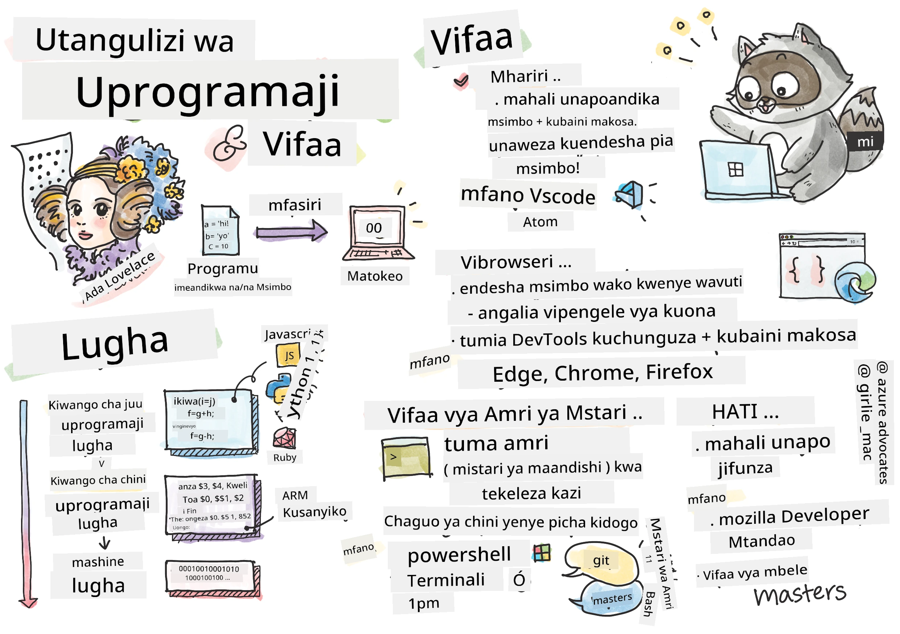
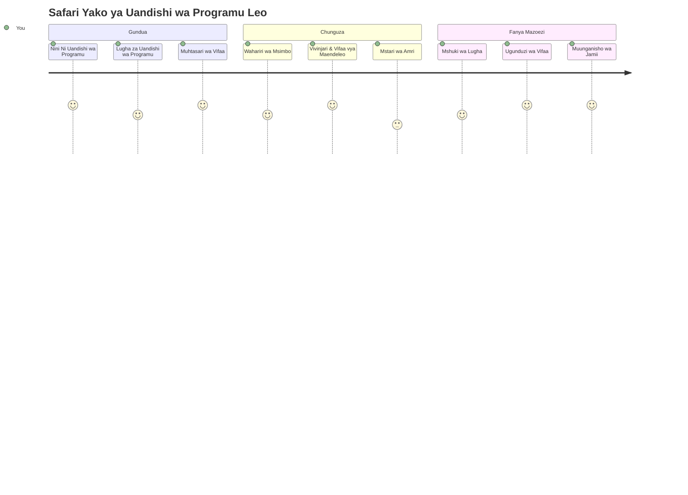
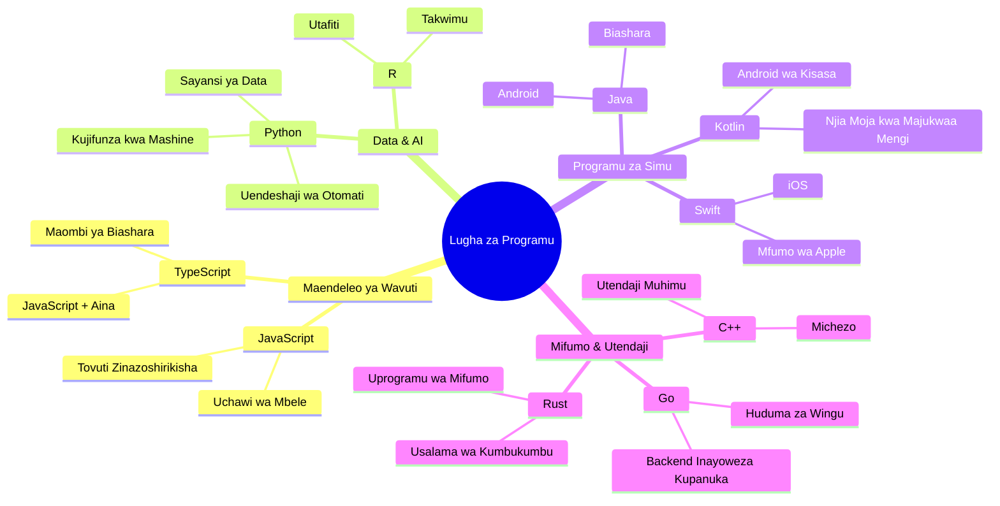
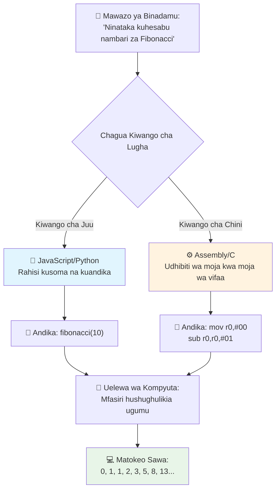
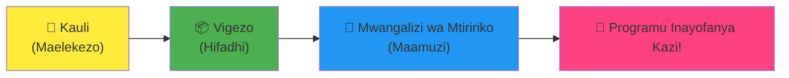
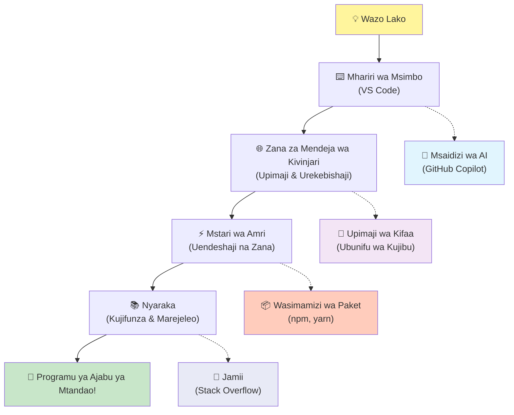
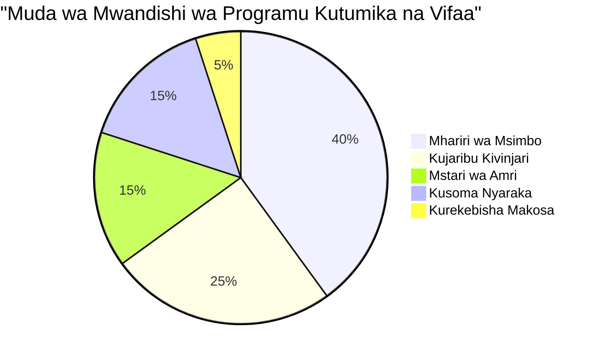
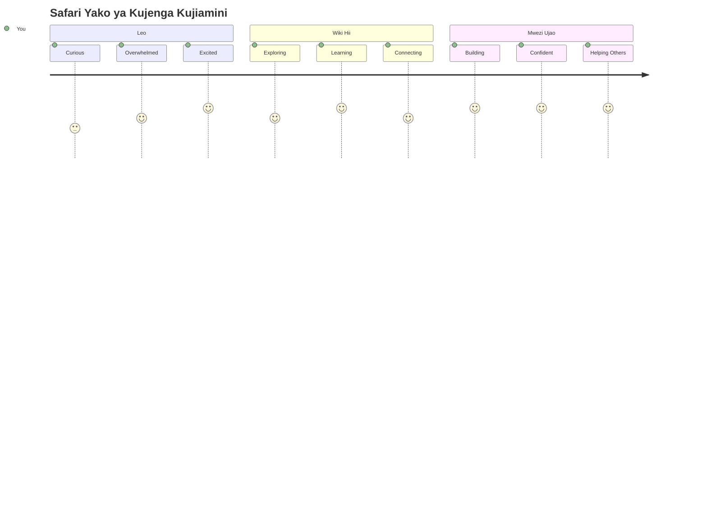

# Utangulizi wa Lugha za Kuprogramu na Zana za Kisasa za Waendelezaji

Hujambo, muendelezaji wa baadaye! 👋 Naweza kukuambia kitu kinachonifanya nipige baridi kila siku? Utagundua kuwa programu siyo tu kuhusu kompyuta – ni kuwa na nguvu za kweli za kuleta mawazo yako mabaya kuwa halisi!

Unajua wakati huo unapotumia programu yako unayopenda na kila kitu kinafanya kazi kwa kila njia? Unapogusa kitufe na kitu cha ajabu kinatokea na unasema "wow, walifanyaje hivyo?" Naam, mtu kama wewe – labda ameketi kwenye kahawa yake ya kawaida saa 2 kamili usiku akiwa na espresso ya tatu – ndiye aliyeandika msimbo huo ulioleta uchawi huo. Na hapa ndipo utakavyoshangaa: mwishoni mwa somo hili, hautaelewa tu jinsi walivyofanya, bali utajisikia kujaribu mwenyewe!

Tazama, ninaelewa kabisa ikiwa programu inakugomea sasa hivi. Nilipoanza, nilidhani unahitaji kuwa mzuri sana kwenye hisabati au umekuwa ukiprograma tangu utakuwa na umri wa miaka mitano. Lakini hapa ndivyo kilinibadilisha kabisa mtazamo wangu: programu ni sawa na kujifunza kuzungumza lugha mpya. Unaanzia na "hello" na "asante," kisha unajifunza kuagiza kahawa, na ghafla unasimulia mijadala ya kina ya kifalsafa! Ila katika kesi hii, unaongea na kompyuta, na ukweli? wao ni washirika wa mazungumzo wenye subira sana – hawatochukia makosa yako na daima wako tayari kujaribu tena!

Leo, tutaangalia zana za ajabu zinazofanya maendeleo ya wavuti ya kisasa si tu uwezekano, bali kuwa uraibu mkubwa. Ninazungumzia wahariri, vivinjari, na mitiririko kazi sawa na wale wanaotumia Netflix, Spotify, na studio ya programu unayopenda kila siku. Na hapa ndipo utakapofurahia: zana nyingi za kitaalamu, za kiwango cha viwanda ni bure kabisa!


> Sketchnote na [Tomomi Imura](https://twitter.com/girlie_mac)


```mermaid
journey
    title Safari Yako ya Uandishi wa Programu Leo
    section Gundua
      Nini Ni Uandishi wa Programu: 5: You
      Lugha za Uandishi wa Programu: 4: You
      Muhtasari wa Vifaa: 5: You
    section Chunguza
      Wahariri wa Msimbo: 4: You
      Vivinjari & Vifaa vya Maendeleo: 5: You
      Mstari wa Amri: 3: You
    section Fanya Mazoezi
      Mshuki wa Lugha: 4: You
      Ugunduzi wa Vifaa: 5: You
      Muunganisho wa Jamii: 5: You
```
## Tuweze Kuona Unachojua Tayari!

Kabla hatujaingia kwenye mambo ya kufurahisha, nina shauku – unajua nini tayari kuhusu dunia hii ya programu? Na sikiliza, ikiwa unatazama maswali haya ukiwa unadhani "sijui kabisa chochote kuhusu hili," hiyo si tu sawa, ni kamilifu! Hii ina maana uko mahali sahihi kabisa. Fikiria mtihani wa awali kama unavyofanya mazoezi kabla ya mazoezi makali – tunapowasha misuli ya ubongo tu!

[Chukua jaribio la kabla ya somo](https://ff-quizzes.netlify.app/web/)


## Safari Tunayojiandaa Kuingia Pamoja

Sawa, nina furaha sana kuhusu tunachotaka kugundua leo! Kweli, natamani ningekuona uso wako unaposikia baadhi ya dhana hizi zikitokea. Hapa ni safari ya ajabu tunayochukua pamoja:

- **Programu ni nini hasa (na kwa nini ni jambo la kupendeza sana!)** – Tutagundua jinsi msimbo ni uchawi usioonekana unaounga mkono kila kitu kinachokuzunguka, kuanzia kengele inayojua ni Jumatatu asubuhi hadi algorithm inayochagua mapendekezo yako ya Netflix kwa usahihi
- **Lugha za programu na tabia zao za ajabu** – Fikiria umeenda kwenye sherehe ambapo kila mtu ana nguvu za kipekee na njia mbalimbali za kutatua matatizo. Hivyo ndivyo ulimwengu wa lugha za programu ulivyo, na utapenda kuwakuta!
- **Viwango vya msingi vinavyofanya uchawi wa kidijitali kutokea** – Fikiria hivi kama seti ya mwisho ya LEGO za ubunifu. Ukijua jinsi vipande hivi vinavyoungana, utatambua unaweza kujenga chochote ambacho mawazo yako yanaufikiria
- **Zana za kitaalamu zitakazokufanya uhisi umepokea fimbo ya mchawi** – Sioni ni kufuata hadithi hapa – zana hizi zitakufanya uhisi kama una nguvu za ajabu kabisa, na sehemu nzuri? Ndio zile zile zinazotumiwa na wataalamu!

> 💡 **Hili ni jambo:** Usifikirie hata kidogo kujaribu kukumbuka kila kitu leo! Sasa hivi, ninataka tu uhisi msisimko kuhusu kile kinachowezekana. Maelezo yatakaa kiurahisi tunapozoeza pamoja – ndivyo kujifunza kweli kunavyotokea!

> Unaweza kuchukua somo hili kwenye [Microsoft Learn](https://learn.microsoft.com/en-us/learn/modules/web-development-101/introduction-programming/?WT.mc_id=academic-77807-sagibbon)!

## Basi Programu Ni Nini *Kwa Hakika*?

Sawa, twendea swali la mamilioni: programu ni nini, kweli?

Nitakupa hadithi iliyobadilisha kabisa mtazamo wangu. Wiki iliyopita, nilijaribu kuelezea mama yangu jinsi ya kutumia udhibiti mpya wa televisheni smart yetu. Nilijikuta nikisema vitu kama "Bonyeza kitufe chekundu, lakini sio kitufe kikubwa chekundu, ni kitufe kidogo chekundu kilicho upande wa kushoto... hapana, upande wako mwingine wa kushoto... sawa, sasa shikilia kwa sekunde mbili, sio moja, sio tatu..." Hili linajulikana? 😅

Hiyo ndio programu! Ni sanaa ya kutoa maelekezo ya kina, hatua kwa hatua kwa kitu chenye nguvu lakini kinahitaji kila kitu kielezwe kwa usahihi kabisa. Badala ya kuelezea kwa mama yako (ambaye anaweza kuuliza "kitufe gani chekundu?!"), unamweleza kompyuta (ambayo hufanya kile unachosema, hata kama kile ulichosema si kile ulicho maana).

Hili lilinivunja akili nilipolijifunza kwanza: kompyuta hizo ni rahisi sana msingi wake. Hufaulu kuelewa vitu viwili tu – 1 na 0, ambavyo kwa kawaida ni "ndio" na "hapana" au "zim" na "zim" kuzimwa. Hivyo ndivyo! Lakini hapa ndipo uchawi unapoanza – hatuhitaji kuzungumza kwa 1 na 0 kama tunavyoona kwenye The Matrix. Hapo ndipo **lugha za programu** zinapokuja kuokoa. Ni kama kuwa na mtafsiri bora duniani anayechukua mawazo yako ya kawaida ya kibinadamu na kuyatafsiri kwa lugha ya kompyuta.

Na hapa ni hali inayonifanya nipige baridi kila asubuhi nikiamka: kila kitu kidijitali katika maisha yako kilianzia mtu kama wewe, labda akiwa na pyjamas na kikombe cha kahawa, akiandika msimbo kwenye kompyuta yao mpakato. Chuja la Instagram linalokufanya uonekane mzuri? Mtu aliandika msimbo huo. Mapendekezo yaliyokupeleka kwenye wimbo wako mpya ulioupenda? Mtaalamu alimjenga algorithm hiyo. Programu inayokusaidia kugawanya miongozo ya chakula na marafiki? Naam, mtu alifikiri "hii ni ya kuchosha, ninaweza kuirekebisha" kisha… alifanya hivyo!

Ukiprograma, haujapokea tu ujuzi mpya – unakuwa sehemu ya jamii hii ya ajabu ya watatuaji matatizo wanaotumia siku zao kufikiria, "Je, naweza kujenga kitu kinachomfanya mtu afurahie kidogo?" Kweli, kuna jambo lolote zuri zaidi?

✅ **Mbio ya Takwimu:** Hili ni jambo la kupendeza kuangalia wakati una nafasi – una dhana nani aliyekuwa mprogramu wa kompyuta wa kwanza duniani? Nitakupa kidokezo: huenda si mtu unayemsubiria! Hadithi nyuma ya mtu huyu ni ya kuvutia sana na inaonyesha kuwa programu imekuwa juu ya kutatua matatizo kwa ubunifu tangu zamani.

### 🧠 **Wakati wa Kuangalia: Unajisikia Vipi?**

**Chukua sehemu kidogo kujiuliza:**
- Je, wazo la "kutoa maelekezo kwa kompyuta" linaeleweka kwako sasa?
- Unaweza kufikiria kazi ya kila siku ungependa kuizindua kwa programu?
- Maswali gani yanayozuka moyoni mwako kuhusu programu hii yote?

> **Kumbuka:** Ni kawaida kabisa kama baadhi ya dhana zinaonekana kuchanganya sasa hivi. Kujifunza programu ni kama kujifunza lugha mpya – huchukua muda kwa ubongo wako kuunda njia mpya za akili. Unaendelea vizuri!

## Lugha za Programu Ni Kama Ladha Mbalimbali za Uchawi

Sawa, hili linaweza kusikika ajabu, lakini endelea na mimi – lugha za programu ni kama mitindo tofauti ya muziki. Fikiria: una jazz, ambayo ni laini na ya kusisimua, rock yenye nguvu na rahisi, classical isiyolazimika na ya kimuundo, na hip-hop yenye ubunifu na maelezo. Kila mtindo una mtazamo wake, jamii yake ya mashabiki mashabiki wa dhati, na kila mmoja ni mzuri kwa hisia na matukio tofauti.

Lugha za programu hufanya kazi kwa njia ile ile! Husingetumia lugha ile ile kujenga mchezo wa simu unayofurahia na ile unayotumia kuchakata data kubwa ya hali ya hewa, sawa kama huwezi kucheza death metal kwenye darasa la yoga (labda kwa darasa chache la yoga! 😄).

Lakini hapa ni hali inayonivunja akili kila nikifikiria: lugha hizi ni kama kuwa na mfasiri mwenye subira, mzuri kabisa ulimwenguni ameketi karibu nawe. Unaweza kuelezea mawazo yako kwa njia inayohisi kwa ubongo wako wa kibinadamu, na wao hufanya kazi zote ngumu za kutafsiri hayo kuwa 1 na 0 ambazo kompyuta husema. Ni kama marafiki ambaye anaweza vizuri kabisa kuzungumza "ubunifu wa kibinadamu" na "mantiki ya kompyuta" – na hawachoki, hawahitaji mapumziko ya kahawa, na hawakuchukii kwa kuuliza swali mara mbili!

### Lugha Maarufu za Programu na Matumizi Yao


```mermaid
mindmap
  root((Lugha za Programu))
    Maendeleo ya Wavuti
      JavaScript
        Uchawi wa Mbele
        Tovuti Zinazoshirikisha
      TypeScript
        JavaScript + Aina
        Maombi ya Biashara
    Data & AI
      Python
        Sayansi ya Data
        Kujifunza kwa Mashine
        Uendeshaji wa Otomati
      R
        Takwimu
        Utafiti
    Programu za Simu
      Java
        Android
        Biashara
      Swift
        iOS
        Mfumo wa Apple
      Kotlin
        Android wa Kisasa
        Njia Moja kwa Majukwaa Mengi
    Mifumo & Utendaji
      C++
        Michezo
        Utendaji Muhimu
      Rust
        Usalama wa Kumbukumbu
        Uprogramu wa Mifumo
      Go
        Huduma za Wingu
        Backend Inayoweza Kupanuka
```
| Lugha | Bora Kwa | Kwa Nini Inapendwa |
|----------|----------|------------------|
| **JavaScript** | Maendeleo ya wavuti, kiolesura cha mtumiaji | Inaendesha kwenye vivinjari na inawezesha tovuti za mwingiliano |
| **Python** | Sayansi ya data, otomatiki, AI | Rahisi kusoma na kujifunza, maktaba yenye nguvu |
| **Java** | Programu za mashirika, programu za Android | Haina tegemezi ya jukwaa, imara kwa mifumo mikubwa |
| **C#** | Programu za Windows, maendeleo ya michezo | Msaada imara wa mfumo wa Microsoft |
| **Go** | Huduma za wingu, mifumo ya nyuma | Haraka, rahisi, iliyoundwa kwa kompyuta za kisasa |

### Lugha za Kidokezo cha Juu dhidi ya Kidokezo cha Chini

Sawa, hili lilikuwa dhana iliyonivunja akili nilipoanza kujifunza, kwa hivyo nitashiriki mfano ulioupelekea kueleweka – na natumai itakusaidia pia!

Fikiria unatembelea nchi ambako huwezi kusema lugha yao, na unahitaji sana kupata choo kilicho karibu (sote tumekuwa hapo, sivyo? 😅):

- **Programu za kidokezo cha chini** ni kama kujifunza lahaja ya eneo hadi uweze kuzungumza na bibi anayefuza matunda kwenye kona ukiwa unatumia marejeleo ya kitamaduni, lugha ya mtaa, na vichekesho vya ndani ambavyo mtu aliyelelewa hapo tu anavyoweza kuelewa. Mzuri sana na wa ufanisi mkubwa... ikiwa unazungumza lugha hiyo! Lakini ni changamoto kubwa unapojaribu tu kupata choo.

- **Programu za kidokezo cha juu** ni kama kuwa na rafiki mzuri wa eneo anayekuelewa kabisa. Unaweza kusema "Nahitaji kabisa kupata choo" kwa Kiingereza rahisi, naye atatafsiri kitamaduni na kukuongoza kwa njia inayofaa ubongo wako usio wa eneo hilo.

Kwa maneno ya programu:
- **Lugha za kidokezo cha chini** (kama Assembly au C) zinakuruhusu kuzungumza kwa kina na vifaa halisi vya kompyuta, lakini unahitaji kufikiria kama mashine, ambayo ni... sawa, ni mabadiliko makubwa ya akili!
- **Lugha za kidokezo cha juu** (kama JavaScript, Python, au C#) zinakuruhusu kufikiria kama binadamu wakati zinashughulikia lugha ya mashine nyuma ya pazia. Zaidi ya hayo, zina jamii za kupokea watu wazowote zilizojaa watu wanaokumbuka jinsi ilivyokuwa kuanza na wana hamu ya kusaidia kweli kabisa!

Unadhani nitapendekeza kuanzia zipi? 😉 Lugha za kidokezo cha juu ni kama magurudumu ya mazoezi ambayo hutaki kuwazima kamwe kwa sababu hufanya kila kitu kufurahisha zaidi!


```mermaid
flowchart TB
    A["👤 Mawazo ya Binadamu:<br/>'Ninataka kuhesabu nambari za Fibonacci'"] --> B{Chagua Kiwango cha Lugha}
    
    B -->|Kiwango cha Juu| C["🌟 JavaScript/Python<br/>Rahisi kusoma na kuandika"]
    B -->|Kiwango cha Chini| D["⚙️ Assembly/C<br/>Udhibiti wa moja kwa moja wa vifaa"]
    
    C --> E["📝 Andika: fibonacci(10)"]
    D --> F["📝 Andika: mov r0,#00<br/>sub r0,r0,#01"]
    
    E --> G["🤖 Uelewa wa Kompyuta:<br/>Mfasiri hushughulikia ugumu"]
    F --> G
    
    G --> H["💻 Matokeo Sawa:<br/>0, 1, 1, 2, 3, 5, 8, 13..."]
    
    style C fill:#e1f5fe
    style D fill:#fff3e0
    style H fill:#e8f5e8
```
### Niruhusu Nikuonyeshe Kwa Nini Lugha za Kidokezo cha Juu Ni Rafiki Zaidi

Sawa, nitakuonyesha kitu kinachoonyesha kwa ubora kwa nini nilivutiwa na lugha za kidokezo cha juu, lakini kwanza – nahitaji uahidi jambo moja. Ukiona mfano wa kwanza wa msimbo, usitishiwe! Ni kusudi kuonekana ngumu. Hilo ndilo jambo ninanolieleza!

Tutaangalia kazi ile ile kwa mtindo mbili tofauti kabisa. Zote mbili zinaunda mfululizo uitwao Fibonacci – ni mfululizo mzuri wa hisabati ambapo kila namba ni jumla ya mbili zilizo nyuma yake: 0, 1, 1, 2, 3, 5, 8, 13... (Taarifa za kufurahisha: utapata muundo huu kila mahali asili – spiral za mbegu za sunflower, mifumo ya mapipa ya pinecone, hata jinsi galaksi zinavyojengwa!)

Una tayari kuona tofauti? Twende!

**Lugha ya kidokezo cha juu (JavaScript) – Rafiki kwa binadamu:**

```javascript
// Hatua 1: Muundo wa msingi wa Fibonacci
const fibonacciCount = 10;
let current = 0;
let next = 1;

console.log('Fibonacci sequence:');
```

**Hili ndilo msimbo huu unafanya:**
- **Tangaza** thibitisho la kuonyesha ni nambari ngapi za Fibonacci tunazitaka kuzalisha
- **Anza** variables mbili kufuatilia nambari ya sasa na inayofuata katika mfululizo
- **Weka** nilipoanzia (0 na 1) zinazobainisha muundo wa Fibonacci
- **Onyesha** jumbe ya kichwa kufafanua matokeo yetu

```javascript
// Hatua ya 2: Tengeneza mlolongo kwa kutumia mzunguko
for (let i = 0; i < fibonacciCount; i++) {
  console.log(`Position ${i + 1}: ${current}`);
  
  // Hesabu nambari inayofuata katika mlolongo
  const sum = current + next;
  current = next;
  next = sum;
}
```

**Kuvunja kinachotokea hapa:**
- **Rudia** kila nafasi kwenye mfululizo kwa kutumia `for` loop
- **Onyesha** kila namba na nafasi yake kwa kutumia mtindo wa template literal
- **Hesabu** nambari inayofuata ya Fibonacci kwa kuongeza thamani ya sasa na inayofuata
- **Sasisha** variables zetu kufuatilia mzunguko unaofuata

```javascript
// Hatua 3: Njia ya kisasa ya utendaji
const generateFibonacci = (count) => {
  const sequence = [0, 1];
  
  for (let i = 2; i < count; i++) {
    sequence[i] = sequence[i - 1] + sequence[i - 2];
  }
  
  return sequence;
};

// Mfano wa matumizi
const fibSequence = generateFibonacci(10);
console.log(fibSequence);
```

**Hapa juu tumefanya:**
- **Tengeneza** kazi inayoweza kutumika tena kwa kutumia muundo wa arrow function wa kisasa
- **Jenga** safu kuhifadhi mfululizo kamili badala ya kuonyesha mmoja mmoja
- **Tumia** index ya safu kuhesabu kila namba mpya kutoka thamani za awali
- **Rudisha** mfululizo kamili kwa matumizi rahisi sehemu nyingine za programu yetu

**Lugha ya kidokezo cha chini (ARM Assembly) – Rafiki kwa kompyuta:**

```assembly
 area ascen,code,readonly
 entry
 code32
 adr r0,thumb+1
 bx r0
 code16
thumb
 mov r0,#00
 sub r0,r0,#01
 mov r1,#01
 mov r4,#10
 ldr r2,=0x40000000
back add r0,r1
 str r0,[r2]
 add r2,#04
 mov r3,r0
 mov r0,r1
 mov r1,r3
 sub r4,#01
 cmp r4,#00
 bne back
 end
```

Tazama jinsi toleo la JavaScript linasomeka karibu na maagizo ya Kiingereza, wakati toleo la Assembly linatumia amri za fumbo zinazodhibiti kiatomati processor ya kompyuta. Zote mbili zinatimiza kazi ile ile, lakini lugha ya kidokezo cha juu ni rahisi kwa binadamu kuelewa, kuandika, na kudumisha.

**Tofauti kuu utakazoziona:**
- **Kusomeka kwa urahisi**: JavaScript hutumia majina yanayoeleweka kama `fibonacciCount` wakati Assembly inatumia lebo za fumbo kama `r0`, `r1`
- **Maoni**: Lugha za ngazi ya juu huchochea maelezo ya maoni ambayo hufanya msimbo uwe na nyaraka za kujieleza
- **Muundo**: Mtiririko wa mantiki wa JavaScript unaendana na jinsi binadamu wanavyofikiri kuhusu matatizo hatua kwa hatua
- **Matengenezo**: Kusasisha toleo la JavaScript kwa mahitaji tofauti ni rahisi na wazi

✅ **Kuhusu mfululizo wa Fibonacci**: Muundo huu wa nambari wa kuvutia sana (ambapo kila nambari ni jumla ya mbili zilizotangulia: 0, 1, 1, 2, 3, 5, 8...) unaonekana hasa *kila mahali* katika asili! Utauona katika mviringo wa maua ya jua, mifumo ya mjusi wa mkanju, jinsi magamba ya nyangumi yanavyozunguka, na hata jinsi matawi ya miti yanavyokua. Inashangaza jinsi hisabati na msimbo vinavyoweza kutusaidia kuelewa na kuunda tena mifano ambayo asili inatumia kuleta uzuri!

## Msingi wa Kujenga Unayefanya Uchawi Kutokee

Sawa, sasa umeona jinsi lugha za programu zinavyoonekana zinapotekelezwa, basi tukatambue vipengele vya msingi vinavyounda programu zote za hali zote. Fikiria hivi kama viungo muhimu katika mapishi yako unayoyapenda – mara utakapojua kila kimo kinafanya nini, utaweza kusoma na kuandika msimbo kwa karibu kila lugha!

Hii ni kama kujifunza sarufi ya programu. Kumbuka shuleni ulipojifunza kuhusu nomino, vitenzi, na jinsi ya kuunganisha sentensi? Programu zina toleo lao la sarufi, na ukweli ni kwamba ni mantiki zaidi na huruhusu makosa zaidi kuliko sarufi ya Kiingereza! 😄

### Kauli: Maelekezo Hatua kwa Hatua

Tuanze na **kauli** – hizi ni kama sentensi tofauti katika mazungumzo na kompyuta yako. Kila kauli inamwambia kompyuta kufanya jambo moja mahususi, kama vile kutoa maelekezo: "Geuka kushoto hapa," "Simama kwenye taa nyekundu," "Paka kwenye sehemu ile."

Ninachopenda kuhusu kauli ni jinsi zinavyokuwa rahisi kusomeka. Angalia hii:

```javascript
// Matamshi ya msingi yanayofanya vitendo vya moja kwa moja
const userName = "Alex";                    
console.log("Hello, world!");              
const sum = 5 + 3;                         
```

**Hiki ndicho msimbo huu unafanya:**
- **Tangaza** kigezo thabiti kuhifadhi jina la mtumiaji
- **Onyesha** ujumbe wa salamu kwenye sehemu ya matokeo ya console
- **Hesabu** na uhifadhi matokeo ya operesheni ya hisabati

```javascript
// Matamshi yanayoshirikiana na kurasa za wavuti
document.title = "My Awesome Website";      
document.body.style.backgroundColor = "lightblue";
```

**Hatua kwa hatua, hii ndicho kinachoendelea:**
- **Badilisha** kichwa cha ukurasa kinachoonekana kwenye sehemu ya kichupo cha kivinjari
- **Badilisha** rangi ya nyuma ya mwili mzima wa ukurasa

### Vigezo: Mfumo wa Kumbukumbu wa Programu Yako

Sawa, **vigezo** ni moja ya dhana nadhifu kabisa za kufundisha kwa sababu ni kama vitu unavyotumia kila siku!

Fikiria orodha ya anwani za simu yako kwa sekunde. Huhifadhi nambari za kila mtu akilini – badala yake unahifadhi "Mama," "Rafiki wa karibu," au "Katikati ya pizza inayofikia hadi saa 8 usiku" na simu yako inahifadhi nambari hizo kwa ajili yako. Vigezo hufanya kazi kwa njia hii hiyo! Ni kama vyombo vyenye lebo ambavyo programu yako inaweza kuhifadhi taarifa na kutoa baadaye kutumia jina linaloeleweka.

Hili ni jambo zuri sana: vigezo vinaweza kubadilika wakati programu yako inapoendesha (ndiyo maana jina "variable" – unaona walivyotumia?). Kama vile unaweza kubadilisha anwani ya pizza ukiwa umegundua mahali bora zaidi, vigezo vinaweza kusasishwa unapoendelea kupata taarifa mpya au hali zinapobadilika!

Nikuonyeshe jinsi hii ni rahisi sana:

```javascript
// Hatua 1: Kuweka vigezo vya msingi
const siteName = "Weather Dashboard";        
let currentWeather = "sunny";               
let temperature = 75;                       
let isRaining = false;                      
```

**Kuelewa dhana hizi:**
- **Hifadhi** thamani zisizobadilika katika vigezo vya `const` (kama jina la tovuti)
- **Tumia** `let` kwa thamani zinazobadilika katika programu yako
- **Weka** aina tofauti za data: mistari (maneno), nambari, na boolean (kweli/sikhoji)
- **Chagua** majina yanayoelezea kile kila kigezo kinachohifadhi

```javascript
// Hatua ya 2: Kufanya kazi na vitu kuunganisha data zinazohusiana
const weatherData = {                       
  location: "San Francisco",
  humidity: 65,
  windSpeed: 12
};
```

**Katika mfano huu tume:**
- **Tengeneza** kipengee cha kuunganisha taarifa za hali ya hewa
- **Panga** vipande vingi vya data chini ya jina moja la kigezo
- **Tumia** jozi za funguo na thamani kuweka kila sehemu ya taarifa wazi

```javascript
// Hatua ya 3: Kutumia na kusasisha vigezo
console.log(`${siteName}: Today is ${currentWeather} and ${temperature}°F`);
console.log(`Wind speed: ${weatherData.windSpeed} mph`);

// Kusasisha vigezo vinavyobadilika
currentWeather = "cloudy";                  
temperature = 68;                          
```

**Tuelewe kila sehemu:**
- **Onyesha** taarifa kwa kutumia template literals na muundo wa `${}`
- **Pata** mali za kipengee kwa kutumia alama ya doa (`weatherData.windSpeed`)
- **Sasisha** vigezo vilivyotangazwa kwa `let` kuonyesha mabadiliko
- **Changanya** vigezo vingi kuunda ujumbe wenye maana

```javascript
// Hatua ya 4: Uharibifu wa kisasa kwa msimbo safi zaidi
const { location, humidity } = weatherData; 
console.log(`${location} humidity: ${humidity}%`);
```

**Unachohitaji kujua:**
- **Toa** mali maalum kutoka kwa vitu kwa kutumia destructuring assignment
- **Tengeneza** vigezo vipya kiotomatiki kwa majina sawa na funguo za vitu
- **Rahisisha** msimbo kwa kuepuka kutumia mara kwa mara alama ya doa

### Mtiririko wa Udhibiti: Kufundisha Programu Yako Kufikiri

Sawa, hili ndilo sehemu ambapo programu zinakuwa za kushangaza sana! **Mtiririko wa udhibiti** ni kufundisha programu yako jinsi ya kufanya maamuzi mahiri, kama unavyofanya kila siku bila hata kufikiria.

Fikiria hivi: leo mchana huenda ulikuwa unafuata mtiririko wa "Kama mvua inanyesha, nitanua mwavuli. Kama ni baridi, nitavaa koti. Kama nimeshindwa kufika, nitaacha chakula cha asubuhi na kunywa kahawa njiani." Ubongo wako huenda kufuata mantiki hii ya if-then mara kadhaa kila siku!

Hili ndilo linavyofanya programu kuonekana kuwa na akili na kuishi badala ya kufuata tu skripti za kawaida zisizo za kuburudisha. Zinapitia hali, zinafikiria kinachotokea, na zimetuma majibu yanayotakiwa. Ni kama kumpa programu ubongo unaobadilika na kufanya maamuzi!

Unataka kuona jinsi hii inavyofanya kazi kwa ufanisi? Nikuonyeshe:

```javascript
// Hatua 1: Mantiki ya masharti ya msingi
const userAge = 17;

if (userAge >= 18) {
  console.log("You can vote!");
} else {
  const yearsToWait = 18 - userAge;
  console.log(`You'll be able to vote in ${yearsToWait} year(s).`);
}
```

**Hili ndilo msimbo huu unafanya:**
- **Angalia** kama umri wa mtumiaji unakidhi mahitaji ya kupiga kura
- **Tekeleza** sehemu tofauti za msimbo kulingana na matokeo ya hali
- **Hesabu** na onyesha muda uliobaki kabla ya kufikia umri wa kupiga kura ikiwa chini ya miaka 18
- **Toa** maoni mahususi na ya msaada kwa kila hali

```javascript
// Hatua ya 2: Masharti mengi kwa kutumia waendeshaji mantiki
const userAge = 17;
const hasPermission = true;

if (userAge >= 18 && hasPermission) {
  console.log("Access granted: You can enter the venue.");
} else if (userAge >= 16) {
  console.log("You need parent permission to enter.");
} else {
  console.log("Sorry, you must be at least 16 years old.");
}
```

**Kuvunja kile kinachotokea hapa:**
- **Changanya** masharti mengi kwa kutumia operator wa `&&` (na)
- **Tengeneza** ngazi ya masharti kwa kutumia `else if` kwa matukio mengi
- **Shughulikia** kesi zote zinazowezekana kwa kauli ya `else` ya mwisho
- **Toa** maoni wazi, yanayoweza kuchukuliwa hatua kwa kila hali tofauti

```javascript
// Hatua ya 3: Hali fupi kwa kutumia operator ya ternary
const votingStatus = userAge >= 18 ? "Can vote" : "Cannot vote yet";
console.log(`Status: ${votingStatus}`);
```

**Unachohitaji kukumbuka:**
- **Tumia** operator ya ternary (`? :`) kwa masharti rahisi ya chaguzi mbili
- **Andika** sharti kwanza, ikifuatiwa na `?`, kisha matokeo ya kweli, kisha `:`, halafu matokeo ya uongo
- **Tumia** muundo huu wakati unahitaji kuweka thamani kulingana na masharti

```javascript
// Hatua ya 4: Kushughulikia kesi nyingi maalum
const dayOfWeek = "Tuesday";

switch (dayOfWeek) {
  case "Monday":
  case "Tuesday":
  case "Wednesday":
  case "Thursday":
  case "Friday":
    console.log("It's a weekday - time to work!");
    break;
  case "Saturday":
  case "Sunday":
    console.log("It's the weekend - time to relax!");
    break;
  default:
    console.log("Invalid day of the week");
}
```

**Msimbo huu unafanikisha yafuatayo:**
- **Linganisho** thamani ya kigezo kwa kesi nyingi maalum
- **Kusanya** kesi zinazofanana pamoja (siku za kazi dhidi ya wikendi)
- **Tekeleza** msimbo unaofaa wakati kuna mlingano
- **Jumuisha** kesi ya `default` kushughulikia thamani zisizotarajiwa
- **Tumia** kauli za `break` kuzuia msimbo kuendelea hadi kesi inayofuata

> 💡 **Mfano wa maisha halisi**: Fikiria mtiririko wa udhibiti kama GPS yenye uvumilivu mkubwa sana ikikupa maelekezo. Inaweza kusema "Kama kuna foleni Main Street, chukua barabara kuu badala yake. Kama ujenzi unazuia barabara kuu, jaribu njia ya mandhari nzuri." Programu hutumia mantiki hii ya masharti kwa makini kujibu hali tofauti na kila wakati kuwapa watumiaji uzoefu bora zaidi.

### 🎯 **Kukagua Dhana: Ustadi wa Msingi wa Kujenga**

**Tuweze kuona utendaji wako na misingi:**
- Je, unaweza kueleza tofauti kati ya kigezo na kauli kwa maneno yako?
- Fikiria mfano halisi wa maisha ambapo utatumia maamuzi ya if-then (kama mfano wetu wa kupiga kura)
- Nini kitu kimoja kuhusu mantiki ya programu kilichokushangaza?

**Kukuinua kwa haraka:**

```mermaid
flowchart LR
    A["📝 Kauli<br/>(Maelekezo)"] --> B["📦 Vigezo<br/>(Hifadhi)"] --> C["🔀 Mwangalizi wa Mtiririko<br/>(Maamuzi)"] --> D["🎉 Programu Inayofanya Kazi!"]
    
    style A fill:#ffeb3b
    style B fill:#4caf50
    style C fill:#2196f3
    style D fill:#ff4081
```
✅ **Kinacho kuja hivi karibuni**: Tutafurahia sana kuingia kwa undani zaidi katika dhana hizi tunapoendelea katika safari hii ya kushangaza pamoja! Kwa sasa, zingatia hisia ya msisimko kuhusu fursa zote za kushangaza zilizo mbele yako. Ujuzi maalum na mbinu zitakaa akili zako bila shaka tunapozoea pamoja – naahidi hili litakuwa burudani zaidi ya unavyotarajia!

## Vifaa vya Kazi

Sawa, hii ni sehemu ambayo ninapojisikia msisimko mno kwamba siwezi kujiweka kimya! 🚀 Tutaongea kuhusu zana za kushangaza zitakazokuvutia kama vile umepata funguo za meli ya angani ya kidigitali.

Unajua jinsi mpishi anavyo na visu vilivyo sawa kabisa vinavyoonekana kama viungo vya mikono yake? Au jinsi mwanamuziki anavyo na gita moja inayopiga wimbo mara anapogusa? Kweli, waendelezaji wana toleo lao la zana za kichawi hizi, na hapa ndilo jipya litakalokuvutia – wengi wao ni bure kabisa!

Nipo hapa nikiwaza kutoa hizi kwako kwa msisimko mkubwa kwa sababu zimebadilisha kabisa jinsi tunavyotengeneza programu. Tunazungumzia wasaidizi wa kuandika msimbo wenye uwezo wa AI (siyo mcheshi!), mazingira ya wingu ya kujenga programu kutoka mahali popote ukiwa na Wi-Fi, na zana za utatuzi wa hitilafu ambazo ni za hali ya juu kiasi kwamba ni kama kuwa na macho ya X-ray kwa programu zako.

Na hapa ni sehemu inayonipa vichwa pepesa: hizi si “zana za wanaoanza” ambazo utakazokua nazo. Hizi ni zana za kiwango cha kitaalamu zinazotumika na waendelezaji katika Google, Netflix, na studio hiyo ya app unayopenda sasa hivi. Utaona kama mtaalamu mwenye uzoefu ukizitumia!


```mermaid
graph TD
    A["💡 Wazo Lako"] --> B["⌨️ Mhariri wa Msimbo<br/>(VS Code)"] 
    B --> C["🌐 Zana za Mendeja wa Kivinjari<br/>(Upimaji & Urekebishaji)"]
    C --> D["⚡ Mstari wa Amri<br/>(Uendeshaji na Zana)"]
    D --> E["📚 Nyaraka<br/>(Kujifunza & Marejeleo)"]
    E --> F["🚀 Programu ya Ajabu ya Mtandao!"]
    
    B -.-> G["🤖 Msaidizi wa AI<br/>(GitHub Copilot)"]
    C -.-> H["📱 Upimaji wa Kifaa<br/>(Ubunifu wa Kujibu)"]
    D -.-> I["📦 Wasimamizi wa Paket<br/>(npm, yarn)"]
    E -.-> J["👥 Jamii<br/>(Stack Overflow)"]
    
    style A fill:#fff59d
    style F fill:#c8e6c9
    style G fill:#e1f5fe
    style H fill:#f3e5f5
    style I fill:#ffccbc
    style J fill:#e8eaf6
```
### Wahariri wa Msimbo na IDEs: Marafiki Wako wa Kidigitali Wapya

Tuzungumze kuhusu wahariri wa msimbo – hawa ni kiasi kwamba watakuwa mahali pako unayopenda zaidi! Fikiria kama ni mahali pako pa faragha pa kuandika msimbo ambapo utatumia muda mwingi kutengeneza na kuboresha kazi zako za kidigitali.

Lakini jambo la kichawi kuhusu wahariri wa kisasa: si wahariri wa maandishi tu. Ni kama kuwa na mwalimu mwerevu na mwenye msaada karibu nawe saa 24 kwa siku. Wanakushika makosa kabla hujayagundua, hupendekeza maboresho ambayo hufanya uonekane mwerevu, husaidia kuelewa kila sehemu ya msimbo, na baadhi yao hata hutabiri unachotaka kuandika na kukamilisha mawazo yako!

Nakumbuka nilipoanza kugundua auto-completion – nilihisi kama maisha yangu yalikuwa ya baadaye. Unaandika kitu, na mhariri wako husema, "Hey, ulikuwa unafikiria kuhusu kipengee hiki kinachofanya hasa unachohitaji?" Ni kama kuwa na rafiki anayekusoma mawazo wakati unajiandaa kuandika!

**Nini kinachofanya wahariri hawa kuwa wa ajabu?**

Wahariri wa msimbo wa kisasa hutoa vipengele vya kuvutia vilivyotengenezwa kuongeza tija yako:

| Kipengele | Kinachofanya | Kwa Nini Inasaidia |
|---------|--------------|--------------|
| **Uakisi wa Muundo wa Msimbo** | Rangi tofauti kwa sehemu tofauti za msimbo wako | Hufanya msimbo kusomeka rahisi na kugundua makosa |
| **Auto-completion** | Hupendekeza msimbo unapoandika | Huongeza kasi ya kuandika msimbo na kupunguza makosa ya tahajia |
| **Zana za Utatuzi Hitilafu** | Husaidia kupata na kurekebisha makosa | Huokoa saa nyingi za kutatua matatizo |
| **Miongezo** | Ongeza vipengele maalum | Badilisha mhariri kulingana na teknolojia yoyote |
| **Msaidizi wa AI** | Pendekeza msimbo na maelezo | Huongeza kasi ya kujifunza na tija |

> 🎥 **Rasilimali ya Video**: Unataka kuona zana hizi zikifanyakazi? Angalia video hii ya [Tools of the Trade](https://youtube.com/watch?v=69WJeXGBdxg) kwa muhtasari kamili.

#### Wahariri waliopendekezwa kwa Maendeleo ya Wavuti

**[Visual Studio Code](https://code.visualstudio.com/?WT.mc_id=academic-77807-sagibbon)** (Bure)
- Maarufu sana miongoni mwa waendelezaji wa wavuti
- Mfumo bora wa miongezo
- Terminal na ushirikiano wa Git umejumuishwa
- **Miongezo muhimu:**
  - [GitHub Copilot](https://marketplace.visualstudio.com/items?itemName=GitHub.copilot) - Mapendekezo ya msimbo yanayotokana na AI
  - [Live Share](https://marketplace.visualstudio.com/items?itemName=MS-vsliveshare.vsliveshare) - Ushirikiano wa wakati halisi
  - [Prettier](https://marketplace.visualstudio.com/items?itemName=esbenp.prettier-vscode) - Uombaji wa msimbo wa moja kwa moja
  - [Code Spell Checker](https://marketplace.visualstudio.com/items?itemName=streetsidesoftware.code-spell-checker) - Kugundua makosa ya tahajia

**[JetBrains WebStorm](https://www.jetbrains.com/webstorm/)** (Malipo, bure kwa wanafunzi)
- Zana za juu za utatuzi na upimaji
- Kukamilisha msimbo kwa akili
- Udhibiti wa toleo umejumuishwa

**IDEs za Kwenye Wingu** (Bei mbalimbali)
- [GitHub Codespaces](https://github.com/features/codespaces) - VS Code kamili kwenye kivinjari chako
- [Replit](https://replit.com/) - Bora kwa kujifunza na kushiriki msimbo
- [StackBlitz](https://stackblitz.com/) - Maendeleo ya wavuti muendelezo wa haraka

> 💡 **Kidokezo cha Kuanza**: Anza na Visual Studio Code – ni bure, hutumika sana katika sekta, na ina jumuiya kubwa inayotengeneza mafunzo na miongezo yenye msaada.

### Vivinjari vya Wavuti: Maabara Yako ya Siri ya Maendeleo

Sawa, jiandae kufurahia sana! Unajua jinsi ulivyokuwa ukitumia vivinjari kuvinjari mitandao ya kijamii na kuangalia video? Kweli, imebainika wamekuwa wakiweka siri hii ya maabara ya kitaalamu ya maendeleo kwa muda mrefu, wakikusubiri uigundue!

Kila mara unapotumia kitufe cha kulia na kuchagua "Inspect Element" kwenye ukurasa wa wavuti, unafungua dunia ya zana za waendelezaji ambazo ni zenye nguvu kuliko baadhi ya programu ghali nilizotumia kununua kwa mamilioni ya pesa. Ni kama kugundua jikoni yako ya kawaida imekuwa ikificha maabara ya mpishi mtaalamu nyuma ya paneli ya siri!
Mara ya kwanza mtu alinionesha DevTools za kivinjari, nilitumia kama saa tatu nikibonyeza sehemu mbalimbali na kusema "SUBIRI, INAWEZA KUFANYA HIVYO PIA?!" Unaweza kuhariri tovuti yoyote kwa wakati halisi, ukaona haraka kabisa vitu vyote vinavyopakia, kujaribu jinsi tovuti yako inavyoonekana kwenye vifaa tofauti, na hata kutatua matatizo ya JavaScript kama mtaalamu kabisa. Ni jambo linaloshangaza akili kabisa!

**Hapa ndiyo sababu kivinjari ni silaha yako ya siri:**

Unapotengeneza tovuti au programu ya wavuti, unahitaji kuona jinsi inavyoonekana na inavyojieleza duniani halisi. Vivinjari haviwezi tu kuonyesha kazi yako bali pia hutoa maoni ya kina kuhusu utendaji, upatikanaji, na matatizo yanayoweza kutokea.

#### Zana za Mendelezaji wa Kivinjari (DevTools)

Vivinjari vya kisasa vina zana kamili za maendeleo:

| Kategoria ya Zana | Inayofanya | Mfano wa Matumizi |
|-------------------|-------------|-------------------|
| **Kikagua Kipengele** | Tazama na hariri HTML/CSS kwa wakati halisi | Rekebisha mtindo kuona matokeo mara moja |
| **Konsoli** | Tazama ujumbe wa makosa na jaribu JavaScript | Tatua matatizo na jaribu msimbo |
| **Mfuatiliaji Mtandao** | Fuata jinsi rasilimali zinavyopakuliwa | Boresha utendaji na nyakati za upakiaji |
| **Kikagua Upatikanaji** | Jaribu muundo wenye usawa kwa wote | Hakikisha tovuti yako inafanya kazi kwa watumiaji wote |
| **Mfano wa Kifaa** | Angalia kwenye ukubwa mbalimbali wa skrini | Jaribu muundo unaobadilika bila vifaa vingi |

#### Vivinjari Vilivyopendekezwa kwa Maendeleo

- **[Chrome](https://developers.google.com/web/tools/chrome-devtools/)** - DevTools za kiwango cha tasnia na nyaraka nyingi
- **[Firefox](https://developer.mozilla.org/docs/Tools)** - Zana bora za CSS Grid na upatikanaji
- **[Edge](https://docs.microsoft.com/microsoft-edge/devtools-guide-chromium/?WT.mc_id=academic-77807-sagibbon)** - Imejengwa juu ya Chromium pamoja na rasilimali za maendeleo za Microsoft

> ⚠️ **Kidokezo Muhimu cha Kupima**: Kila wakati jaribu tovuti zako katika vivinjari vingi! Kile kinachofanya kazi vizuri kwenye Chrome kinaweza kuonekana tofauti kwenye Safari au Firefox. Waendelezaji wataalamu hujaribu katika vivinjari vyote vikuu kuhakikisha uzoefu wa mtumiaji unafanana.

### Zana za Mstari wa Amri: Njia Yako ya Kujua Uwezo wa Mendelezaji

Sawa, hebu tuketi tukazungumze kwa uwazi kuhusu mstari wa amri, kwa sababu nataka usikie hili kutoka kwa mtu anayeelewa kweli. Nilipoona mara ya kwanza – tu skrini ya giza na maandishi yanayometa – nilifikiri kwa kweli, "Hapana, kabisa hapana! Hii inaonekana kama kitu kutoka kwenye filamu za mdukuzi wa miaka ya 1980, na mimi si werevu vya kutosha kwa hili!" 😅

Lakini hapa ni kile ningetaka mtu kunisema wakati huo, na kile ninachoambiana nawe sasa hivi: mstari wa amri si wa kuogopesha – ni kama kuzungumza moja kwa moja na kompyuta yako. Fikiria kama tofauti kati ya kuagiza chakula kupitia programu nzuri yenye picha na menyu (ambayo ni rahisi na vizuri) dhidi ya kuingia kwenye mgahawa wako pendwa ambapo mpishi anajua hasa unachopenda na anaweza kuandaa kitu bora tu kwa kusema "nitishekee kitu cha kushangaza."

Mstari wa amri ndio mahali ambapo waendelezaji huhisi kama wachawi halisi. Unaandika maneno machache yanayoonekana kama uchawi (sawa, ni amri tu, lakini yanahisi kama uchawi!), bonyeza enter, na BOOM – umeunda muundo mzima wa mradi, kusakinisha zana zenye nguvu kutoka duniani kote, au kuweka programu yako mtandaoni kwa mamilioni ya watu kuiona. Ukipoa ladha ya nguvu hiyo, kwa kweli ni kuleta uraibu!

**Kwa nini mstari wa amri utakuwa zana yako unayopenda:**

Ingawa maingiliano ya picha ni mazuri kwa kazi nyingi, mstari wa amri una ustadi katika un automatisi, usahihi, na kasi. Zana nyingi za maendeleo hufanya kazi hasa kupitia maingiliano ya mstari wa amri, na kujifunza kuzitumia kwa ufanisi kunaweza kuboresha ufanisi wako kwa kiasi kikubwa.

```bash
# Hatua ya 1: Unda na uelekee kwenye saraka ya mradi
mkdir my-awesome-website
cd my-awesome-website
```

**Hili ni jambo linachofanya msimbo huu:**
- **Tengeneza** saraka mpya inayoitwa "my-awesome-website" kwa ajili ya mradi wako
- **Elekea** kwenye saraka mpya kuanza kazi

```bash
# Hatua ya 2: Anzisha mradi na package.json
npm init -y

# Sakinisha zana za kisasa za maendeleo
npm install --save-dev vite prettier eslint
npm install --save-dev @eslint/js
```

**Hatua kwa hatua, hapa kinatokea:**
- **anzisha** mradi mpya wa Node.js kwa mipangilio ya msingi ukitumia `npm init -y`
- **sakinisha** Vite kama zana ya kisasa ya kujenga kwa maendeleo na ujenzi wa uzalishaji
- **ongeza** Prettier kwa uundaji wa msimbo otomatiki na ESLint kwa ukaguzi wa ubora wa msimbo
- **tumia** bendera `--save-dev` kuonyesha hizi ni tegemezi za maendeleo tu

```bash
# Hatua ya 3: Tengeneza muundo wa mradi na faili
mkdir src assets
echo '<!DOCTYPE html><html><head><title>My Site</title></head><body><h1>Hello World</h1></body></html>' > index.html

# Anzisha seva ya maendeleo
npx vite
```

**Juu, tumefanya:**
- **Panga** mradi wetu kwa kuunda folda tofauti kwa msimbo chanzo na mali
- **Tengeneza** faili ya msingi ya HTML yenye muundo sahihi wa hati
- **Anza** server ya maendeleo ya Vite kwa upyaaji wa moja kwa moja na kubadilisha moduli halisi

#### Zana Muhimu za Mstari wa Amri kwa Maendeleo ya Wavuti

| Zana | Kusudi | Kwa Nini Unaihitaji |
|-------|---------|---------------------|
| **[Git](https://git-scm.com/)** | Udhibiti wa toleo | Fuata mabadiliko, shirikiana na wengine, hifadhi kazi zako |
| **[Node.js & npm](https://nodejs.org/)** | Muda wa kuendesha JavaScript & usimamizi wa pakiti | Endesha JavaScript nje ya vivinjari, sakinisha zana za maendeleo za kisasa |
| **[Vite](https://vitejs.dev/)** | Zana ya kujenga & server ya maendeleo | Maendeleo yenye kasi sana na kubadilisha moduli halisi |
| **[ESLint](https://eslint.org/)** | Ubora wa msimbo | Gundua na rekebisha matatizo ya JavaScript yako moja kwa moja |
| **[Prettier](https://prettier.io/)** | Uundaji wa msimbo | Hifadhi msimbo wako umepangwa vizuri na usomeke |

#### Chaguo Maalum kwa Mfumo

**Windows:**
- **[Windows Terminal](https://docs.microsoft.com/windows/terminal/?WT.mc_id=academic-77807-sagibbon)** - Terminal ya kisasa yenye vipengele vingi
- **[PowerShell](https://docs.microsoft.com/powershell/?WT.mc_id=academic-77807-sagibbon)** 💻 - Mazingira yenye nguvu ya uandishi wa script
- **[Command Prompt](https://learn.microsoft.com/windows-server/administration/windows-commands/windows-commands)** 💻 - Mstari wa amri wa Windows wa jadi

**macOS:**
- **[Terminal](https://support.apple.com/guide/terminal/)** 💻 - Programu ya mtandaoni ya terminal iliyo jengwa ndani
- **[iTerm2](https://iterm2.com/)** - Terminal iliyoboreshwa yenye vipengele vya hali ya juu

**Linux:**
- **[Bash](https://www.gnu.org/software/bash/)** 💻 - Shell ya kawaida ya Linux
- **[KDE Konsole](https://docs.kde.org/trunk5/en/konsole/konsole/index.html)** - Emulator ya terminal ya hali ya juu

> 💻 = Imejumuishwa kwenye mfumo wa uendeshaji

> 🎯 **Njia ya Kujifunza**: Anza na amri za msingi kama `cd` (badilisha saraka), `ls` au `dir` (orodhesha mafaili), na `mkdir` (tengeneza folda). Fanya mazoezi na amri za mtiririko wa kazi wa kisasa kama `npm install`, `git status`, na `code .` (fungua saraka ya sasa katika VS Code). Kadiri unavyonyooka, utajifunza amri za hali ya juu na mbinu za automatisi kwa asili.

### Nyaraka: Mwalimu Wako Aliye Tayari Siku Zote Kujifunza

Sawa, niruhusu kushiriki siri kidogo itakayokufanya uhisi vizuri kuhusu kuwa mgeni: hata waendelezaji wenye uzoefu mkubwa hutumia sehemu kubwa ya wakati wao kusoma nyaraka. Na si kwa sababu hawaelewi wanachofanya – ni ishara ya hekima!

Fikiria nyaraka kama kupata walimu wenye subira, wenye maarifa waliopo 24/7. Unaposhindwa na tatizo saa 2 usiku? Nyaraka ziko pale zikiwa na kumbatio la joto na jibu hasa unalotaka. Unataka kujifunza kuhusu kipengele kipya kinachozungumziwa na kila mtu? Nyaraka zitakuunga mkono na mifano hatua kwa hatua. Jaribu kuelewa kwanini kitu kinafanya kazi kama kinavyo? Ulivyokisia – nyaraka ziko tayari kufafanua kwa njia itakayokufanya uelewe kabisa!

Hili nililobadilika kabisa mtazamo wangu: ulimwengu wa maendeleo ya wavuti husogea kwa kasi sana, na hakuna mtu (nakusudia hamna mtu kabisa!) anayehifadhi kila kitu akilini. Nimewahi kuona waendelezaji wakubwa wenye uzoefu wa miaka 15+ wakitafuta sintaksia za msingi, na unajua nini? Hilo si aibu – ni akili! Si kuhusu kumbukumbu kamilifu; ni kuhusu kujua wapi kupata majibu ya kuaminika kwa haraka na kuelewa jinsi ya kuyatumia.

**Hapa ndipo uchawi halisi unapotokea:**

Waendelezaji wataalamu hutumia sehemu kubwa ya wakati wao kusoma nyaraka – sio kwa sababu hawaelewi wanachofanya, bali kwa sababu uwanja wa maendeleo ya wavuti hubadilika haraka sana na kuendelea kujifunza ni lazima. Nyaraka bora hukusaidia kuelewa sio tu *jinsi* ya kutumia kitu, bali *kwa nini* na *lini* cha kuitumia.

#### Rasilimali Muhimu za Nyaraka

**[Mozilla Developer Network (MDN)](https://developer.mozilla.org/docs/Web)**
- Kiwango cha dhahabu cha nyaraka za teknolojia ya wavuti
- Miongozo kamili ya HTML, CSS, na JavaScript
- Inajumuisha taarifa za urafiki wa kivinjari
- Inatoa mifano ya vitendo na maonyesho ya mwingiliano

**[Web.dev](https://web.dev)** (ya Google)
- Mbinu bora za maendeleo ya wavuti za kisasa
- Miongozo ya kuboresha utendaji
- Kanuni za upatikanaji na muundo jumuishi
- Masomo kutoka miradi halisi

**[Microsoft Developer Documentation](https://docs.microsoft.com/microsoft-edge/#microsoft-edge-for-developers)**
- Rasilimali za maendeleo ya kivinjari Edge
- Miongozo ya Progressive Web App
- Maarifa ya maendeleo ya majukwaa mbalimbali

**[Frontend Masters Learning Paths](https://frontendmasters.com/learn/)**
- Mitaala ya kujifunza iliyopangwa
- Kozi za video kutoka kwa wataalamu wa sekta
- Mazoezi ya kuandika msimbo ya vitendo

> 📚 **Mbinu ya Kusoma**: Usijaribu kukumbuka nyaraka zote – badala yake, jifunze jinsi ya kuzitumia kwa ufanisi. Weka alama za marejeleo yanayotumika mara kwa mara na fanya mazoezi ya kutumia vitufe vya kutafuta kupata taarifa maalum haraka.

### 🔧 **Kikaguzi cha Uwezo wa Zana: Nini Kinaakisi Kwako?**

**Chukua muda kuzingatia:**
- Zana gani umehamasika zaidi kujaribu kwanza? (Hakuna jibu baya!)
- Mstari wa amri bado unakufanya uogope, au unavutiwa nayo?
- Unaweza kufikiria kutumia DevTools za kivinjari kuangalia nyuma ya pazia za tovuti zako unazopenda?


```mermaid
pie title "Muda wa Mwandishi wa Programu Kutumika na Vifaa"
    "Mhariri wa Msimbo" : 40
    "Kujaribu Kivinjari" : 25
    "Mstari wa Amri" : 15
    "Kusoma Nyaraka" : 15
    "Kurekebisha Makosa" : 5
```
> **Maarifa ya kufurahisha**: Watengenezaji wengi hutumia takriban asilimia 40 ya wakati wao katika mhariri wa msimbo wao, lakini angalia sana muda unaotumika kupima, kujifunza, na kutatua matatizo. Kuprogramu siyo tu kuandika msimbo – ni kuunda uzoefu!

✅ **Chakula cha mawazo**: Hapa kuna jambo la kufikiria – unaonaje tofauti kati ya zana za kujenga tovuti (maendeleo) na zana za kubuni muonekano wake (muundo)? Ni kama tofauti kati ya mbunifu wa majengo anayeunda nyumba nzuri na mkandarasi anayeijenga kwa kweli. Zote ni muhimu, lakini zinahitaji sanduku tofauti la zana! Fikiria hivi itakusaidia sana kuona picha kubwa ya jinsi tovuti zinavyotengenezwa.

## Changamoto ya Wakala wa GitHub Copilot 🚀

Tumia hali ya Wakala kukamilisha changamoto ifuatayo:

**Maelezo:** Chunguza vipengele vya mhariri wa msimbo wa kisasa au IDE na onyesha jinsi vinavyoweza kuboresha mtiririko wako wa kazi kama mtaalamu wa wavuti.

**Agizo:** Chagua mhariri wa msimbo au IDE (kama Visual Studio Code, WebStorm, au IDE ya wingu). Orodhesha vipengele tatu au nyongeza zinazokusaidia kuandika, kutatua matatizo, au kudumisha msimbo kwa ufanisi zaidi. Kwa kila moja, toa maelezo mafupi ya jinsi inavyoboresha mtiririko wako wa kazi.

---

## 🚀 Changamoto

**Sawa, mpelelezi, uko tayari kwa kesi yako ya kwanza?**

Sasa umejenga msingi huu mzuri, nina shughuli itakayokusaidia kuona dunia ya programu kwa namna tofauti kabisa na ya kuvutia. Na sikiliza – huu sio kuhusu kuandika msimbo bado, hivyo usijisukume! Jichukulie kama mpelelezi wa lugha za programu kwenye kesi yako ya kwanza ya kusisimua!

**Kazi yako, ikiwa ukubali:**
1. **Kuwa mchunguzi wa lugha**: Chagua lugha tatu za programu kutoka kwa ulimwengu tofauti kabisa – labda moja inayotengeneza tovuti, moja inayotengeneza programu za simu, na moja inayochakata data kwa wanasayansi. Tafuta mifano ya kazi rahisi hiyo hiyo imeandikwa kwa kila lugha. Naahidi utashangazwa kabisa na tofauti zao lakini zinapotekeleza kazi ile ile!

2. **Gundua hadithi zao za asili**: Nini kinachofanya kila lugha kuwa maalum? Hapa kuna ukweli mzuri – kila lugha ya programu iliumbwa kwa sababu mtu alifikiri, "Unajua nini? Lazima kuwe na njia bora ya kutatua tatizo hili maalum." Je, unaweza kugundua matatizo hayo yalikuwa yapi? Baadhi ya hadithi hizi ni za kuvutia sana!

3. **Kutana na jumuiya**: Angalia jinsi jamii za kila lugha zinavyokaribisha na kuwa na shauku. Baadhi zina mamilioni ya waendelezaji wanaoshiriki maarifa na kusaidiana, wengine ni wadogo lakini wana mshikamano mkubwa na msaada wa ukaribu. Utafurahia kuona tabia tofauti za jumuiya hizi!

4. **Fuata hisia zako**: Ni lugha gani unahisi ni rahisi kwako kwa sasa? Usijisukume kuchagua "kamilifu" – sikiliza tu hisia zako! Hakuna jibu baya kabisa hapa, na unaweza daima kuchunguza zingine baadaye.

**Kazi ya ziada ya mpelelezi:** Angalia unaweza kugundua ni tovuti au programu kuu zipi zimetengenezwa kwa kila lugha. Nina hakika utafurahia kuvumbua maelezo kuhusu Instagram, Netflix, au mchezo huo wa simu usioweza kuacha kucheza!

> 💡 **Kumbuka**: Haufanyi kazi za kitaalamu katika lugha hizi leo. Unajifunza tu kabla ya kuchagua wapi unataka kujiwekea makazi. Chukua muda, furahia, na lete udadisi wako mbele!

## Hebu Tusherehekee Niliyogundua!

Mwisho kabisa, umejifunza mengi ya kushangaza leo! Nina hamu ya kuona ni kiasi gani ya safari hii ya kushangaza imebakia kwako. Na kumbuka – hii si mtihani wa kupata kila kitu sawa. Hii ni sherehe ya mambo mazuri uliyoyajifunza kuhusu dunia hii nzuri unayoanza kuingilia!

[Fanya mtihani wa baada ya somo](https://ff-quizzes.netlify.app/web/)

## Mapitio & Kujisomea

**Chukua muda kuchunguza na kufurahia!**
Umefunika mengi leo, na hiyo ni jambo la kujivunia! Sasa inakuja sehemu ya kufurahisha – kuchunguza mada zilizoamsha udadisi wako. Kumbuka, hii si kazi ya nyumbani – ni adventure!

**Zamia zaidi katika kile kinachokuvutia:**

**Jifunze kutumia lugha za programu:**
- Tembelea tovuti rasmi za lugha 2-3 zilizovutia macho yako. Kila moja ina haiba na hadithi yake!
- Jaribu baadhi ya maeneo ya majaribio ya kuandika misimbo mtandaoni kama [CodePen](https://codepen.io/), [JSFiddle](https://jsfiddle.net/), au [Replit](https://replit.com/). Usiogope kujaribu – hauwezi kuvunja kitu chochote!
- Soma jinsi lugha yako unayopenda ilivyotokea. Kwa kweli, baadhi ya hadithi hizi za asili ni za kuvutia sana na zitakusaidia kuelewa kwa nini lugha hufanya kazi kwa njia fulani.

**Jifunze kutumia vifaa vipya ulivyopata:**
- Pakua Visual Studio Code kama hujafanya hivyo tayari – ni bure na utapenda kabisa!
- Tumia dakika chache kuvinjari soko la Extensions. Ni kama duka la programu kwa mhariri wako wa msimbo!
- Fungua zana za Developer kwenye kivinjari chako na bonyeza kila sehemu. Usijali kuelewa kila kitu – jifunze tu kile kilicho hapo.

**Ungana na jamii:**
- Fuata baadhi ya jumuiya za watengenezaji kwenye [Dev.to](https://dev.to/), [Stack Overflow](https://stackoverflow.com/), au [GitHub](https://github.com/). Jamii ya programu inawakaribisha sana wanaoanza!
- Angalia video za kuanzia kwa urafiki wa waandishi wa msimbo kwenye YouTube. Kuna watengenezaji wengi wazuri wa maudhui wanaokumbuka siku walipoanza.
- Fikiria kujiunga na mikutano ya wenyeji au jumuiya mtandaoni. Ni kweli, watengenezaji wanapenda kusaidia wanaoanza!

> 🎯 **Sikiliza, hii ni jambo nataka ukumbuke**: Haufikiriwi kuwa mchawi wa kuandika msimbo usiku mmoja! Hivi sasa, unaanza kujifunza dunia hii mpya ya kushangaza ambayo utakuwa sehemu yake. Chukua muda wako, furahia safari, na kumbuka – kila mtaalamu unayemheshimu alikuwa amekaa mahali ulipo sasa, akiwa na hamu na labda kidogo amechanganyikiwa. Hiyo ni kawaida sana, na ina maana unafanya vizuri!


## Assignment

[Reading the Docs](assignment.md)

> 💡 **Kikumbusho kidogo kwa kazi yako**: Ningependa sana kukuona ukichunguza baadhi ya vifaa ambavyo bado hatujazungumzia! Ruka wahariri, vivinjari, na zana za kituo cha amri tulizozungumza tayari – kuna ulimwengu mzima wa ajabu wa zana za maendeleo zinazotarajia kugunduliwa. Tafuta zile zinazodumishwa kikamilifu na zina jamii zenye nguvu na msaada (hawa huwa na mafunzo bora na watu wa msaada pale unapoingia shida na unahitaji msaada mzuri).

---

## 🚀 Ratiba Yako ya Safari ya Programu

### ⚡ **Unachoweza Kufanya Katika Dakika 5 Zijazo**
- [ ] Weka alama (bookmark) tovuti za lugha 2-3 za programu zilizokuvutia
- [ ] Pakua Visual Studio Code kama hujafanya hivyo tayari
- [ ] Fungua DevTools za kivinjari chako (F12) na bonyeza tovuti yoyote
- [ ] Jiunge na jamii moja ya wataalamu wa programu (Dev.to, Reddit r/webdev, au Stack Overflow)

### ⏰ **Unachoweza Kufanikisha Saa Hii**
- [ ] Kamilisha mtihani baada ya somo na tafakari juu ya majibu yako
- [ ] Weka VS Code na kifunguzo cha GitHub Copilot
- [ ] Jaribu mfano wa "Hello World" katika lugha 2 tofauti za programu mtandaoni
- [ ] Tazama video ya "Siku Maisha ya Mtaalamu wa Programu" kwenye YouTube
- [ ] Anza upelelezi wa lugha yako ya programu (kutoka kwenye changamoto)

### 📅 **Adventure Yako ya Wiki Mmoja**
- [ ] Kamilisha kazi na chunguza zana 3 mpya za maendeleo
- [ ] Fuata watengenezaji 5 au akaunti za programu kwenye mitandao ya kijamii
- [ ] Jaribu kuunda kitu kidogo katika CodePen au Replit (hata ni "Hello, [Jina Lako]!")
- [ ] Soma chapisho moja la blogu la mtaalamu kuhusu safari yao ya kuandika msimbo
- [ ] Jiunge na mkutano wa mtandaoni au angalia hotuba ya programu
- [ ] Anza kujifunza lugha uliyochagua na mafunzo mtandaoni

### 🗓️ **Mabadiliko Yako ya Mwezi Mmoja**
- [ ] Tengeneza mradi wako wa kwanza mdogo (hata ukurasa rahisi wa wavuti unahesabiwa!)
- [ ] Changia kwenye mradi wa chanzo huria (anza na marekebisho ya nyaraka)
- [ ] Mwange mtu anayeanza safari yao ya kuandika msimbo
- [ ] Tengeneza tovuti yako ya wasifu wa mtaalamu wa programu
- [ ] Ungana na jumuiya za mtaalamu wa karibu au makundi ya masomo
- [ ] Anza kupanga hatua yako inayofuata ya kujifunza

### 🎯 **Ukaguzi wa Mwisho wa Tafakari**

**Kabla hujaendelea, chukua muda kusherehekea:**
- Ni jambo gani moja kuhusu programu lililokufurahisha leo?
- Ni chombo gani au dhana unayotaka kuchunguza kwanza?
- Unajisikia vipi kuanza safari hii ya programu?
- Ni swali gani ungependa kumuuliza mtaalamu sasa hivi?


```mermaid
journey
    title Safari Yako ya Kujenga Kujiamini
    section Leo
      Curious: 3: You
      Overwhelmed: 4: You
      Excited: 5: You
    section Wiki Hii
      Exploring: 4: You
      Learning: 5: You
      Connecting: 4: You
    section Mwezi Ujao
      Building: 5: You
      Confident: 5: You
      Helping Others: 5: You
```
> 🌟 **Kumbuka**: Kila mtaalamu alikuwa mgeni. Kila mtaalamu mzee alikuwa anahisi kama ulivyo sasa hivi – na furaha, labda kidogo amechanganyikiwa, na kwa hakika mwenye udadisi kuhusu kile kinachowezekana. Uko katika kampuni nzuri sana, na safari hii itakuwa ya kushangaza. Karibu katika dunia ya kushangaza ya programu! 🎉

---

<!-- CO-OP TRANSLATOR DISCLAIMER START -->
**Angalizo**:  
Hati hii imetafsiriwa kwa kutumia huduma ya tafsiri ya AI [Co-op Translator](https://github.com/Azure/co-op-translator). Ingawa tunajitahidi kwa usahihi, tafadhali fahamu kuwa tafsiri za otomatiki zinaweza kuwa na makosa au upungufu wa usahihi. Hati ya asili katika lugha yake ya asili inapaswa kuchukuliwa kama chanzo cha mamlaka. Kwa taarifa muhimu, tafsiri ya kitaalamu ya binadamu inapendekezwa. Hatuhusiki kwa kutokuelewana au tafsiri ambazo zitajitokeza kutokana na matumizi ya tafsiri hii.
<!-- CO-OP TRANSLATOR DISCLAIMER END -->