<!--
CO_OP_TRANSLATOR_METADATA:
{
  "original_hash": "d45ddcc54eb9232a76d08328b09d792e",
  "translation_date": "2026-01-07T02:08:41+00:00",
  "source_file": "1-getting-started-lessons/1-intro-to-programming-languages/README.md",
  "language_code": "sw"
}
-->
# Utangulizi wa Lugha za Programu na Vifaa vya Kisasa vya Mwaendelezaji

Hujambo, mtaalamu wa kesho! 👋 Naweza kukuambia kitu kinachoniletea baridi kila siku? Unakaribia kugundua kuwa programu siyo tu kuhusu kompyuta – ni kuhusu kuwa na nguvu za kichawi kuleta mawazo yako shupavu katika maisha!

Unajua wakati unapotumia programu unayopenda na kila kitu kinakwenda vizuri? Unapobofya kitufe na kitu cha kichawi kinatokea kinachokufanya useme "wow, walifanyaje hivyo?" Naam, mtu kama wewe – labda amekaa kwenye kahawa anayopenda saa 2 asubuhi akiwa na espresso ya tatu – aliandika msimbo uliosababisha kichawi hicho. Na hapa ndipo utakapoanguka kustaajabishwa: mwishoni mwa somo hili, hutagundua tu jinsi walivyofanya, bali utataka pia kujaribu wewe mwenyewe!

Tazama, naelewa kabisa kama programu inakuletea hofu sasa hivi. Nilipoanza, nilifikiri unatakiwa uwe genius wa hisabati au umekuwa ukifanya programu tangu umekuwa na miaka mitano. Lakini hii ilibadilisha kabisa mtazamo wangu: programu ni sawa na kujifunza kuzungumza katika lugha mpya. Unaanzia na "hello" na "thank you," kisha unaendelea kuagiza kahawa, na ghafla unazungumza mijadala ya mwanafalsafa! Ila katika hili, unazungumza na kompyuta, na kweli? Kompyuta ni washirika wa mazungumzo wenye subira sana – hawakufungii makosa yako laana na daima wanataka kujaribu tena!

Leo, tutaangalia zana za ajabu zinazofanya maendeleo ya wavuti wa kisasa siyo tu kuwawezekana, bali kuwa kitu cha kuvutia sana. Ninazungumzia wahariri, vivinjari na njia za kazi sawa na zile zinazotumika na waendelezaji wa Netflix, Spotify, na studio yako ya programu unayopenda kila siku. Na hapa ni sehemu itakayokupeleka kucheza kwa furaha: wengi wa zana hizi za kitaalamu za kiwango cha viwanda ni bure kabisa!


> Sketchnote by [Tomomi Imura](https://twitter.com/girlie_mac)


## Tuchunguze Unachojua Tayari!

Kabla hatujaingia kwenye mambo ya kufurahisha, nina hamu ya kujua – tayari unajua nini kuhusu ulimwengu huu wa programu? Na sikiliza, kama unapoangalia maswali haya ukijiambia "hatuna wazo hata kidogo kuhusu haya," hiyo siyo tu sawa, ni nzuri kabisa! Hiyo ina maana uko mahali pale pa kuanzia. Fikiria hii kama kufanya mazoezi kabla ya mazoezi halisi – tunaandaa misuli ya ubongo!

[Chukua mtihani wa kabla ya somo](https://forms.office.com/r/dru4TE0U9n?origin=lprLink)


## Safari Tunayoanza Pamoja

Sawa, nina furaha sana kuhusu kile tutakachokigundua leo! Kwa kweli, ningependa kuona uso wako unavyotabasamu wakati baadhi ya dhana hizi zitakapoeleweka. Haya ni mambo makuu tunayoyachunguza pamoja:

- **Programu ni nini hasa (na kwa nini ni jambo la kuvutia zaidi!)** – Tutagundua jinsi msimbo ni nguvu ya kichawi isiyoonekana inayotawaliya kila kitu kinachokuzunguka, kutoka saa yako ya kengele inayojua ni Jumatatu asubuhi hadi algorithm inayoakili mapendekezo yako ya Netflix
- **Lugha za programu na utu wao wa ajabu** – Fikiria unaingia kwenye sherehe ambapo kila mtu ana nguvu tofauti na njia za kutatua matatizo. Dunia ya lugha za programu ni kama hivyo, na utapenda kuwakutana nao!
- **Misingi ya msingi inayosababisha uchawi wa kidijitali kutokea** – Fikiria hivi kama seti ya LEGO bora kabisa ya ubunifu. Ukijua jinsi vipande hivi vinavyolingana, utaona unaweza kujenga chochote kinachotokana na mawazo yako
- **Zana za kitaalamu zitakazokufanya uhisi kama umepata fimbo ya mchawi** – Sio kujaa mbwembwe hapa – zana hizi zitakufanya uhisi kama una nguvu za kichawi, na sehemu nzuri? Ni zile zile zinazotumika na wataalamu!

> 💡 **Hili ni jambo:** Usijaribu kumbuka yote leo! Sasa hivi, nataka ujisikie msisimko wa kile kinachowezekana. Maelezo yatajifunza kwa asili tukiwa tunazoezana – ndiyo jinsi mafunzo halisi yanavyotokea!

> Unaweza kuchukua somo hili kwenye [Microsoft Learn](https://docs.microsoft.com/learn/modules/web-development-101/introduction-programming/?WT.mc_id=academic-77807-sagibbon)!

## Hivyo Basi, Programu Ni Nini Kweli?

Sawa, tujiandae kukabiliana na swali la pesa milioni: programu ni nini, kweli?

Nitakuambia hadithi iliyobadilisha kabisa mtazamo wangu kuhusu hili. Wiki iliyopita, nilijaribu kumweleza mama yangu jinsi ya kutumia kidhibiti TV yetu mpya smart. Nilijikuta nikisema vitu kama "Bonyeza kitufe cheupe, lakini si kitufe kikubwa cheupe, ni kidogo upande wa kushoto... hapana, upande mwingine wa kushoto... sawa, sasa shikilia kwa sekunde mbili, si moja, si tatu..." Inajulikana? 😅

Hiyo ndiyo programu! Ni sanaa ya kutoa maagizo ya kina, hatua kwa hatua kwa kitu chenye nguvu lakini kinahitaji kila kitu kieleweke vizuri. Badala ya kumweleza mama yako (anaweza kuuliza "kitufe cheupe kipi?!"), unamweleza kompyuta (inafanya tu kile unachosema, hata kama hicho siyo ile ulichomaanisha).

Hili lilenishangaza nilipolijifunza kwanza: kompyuta ni rahisi hasa ndani yake. Zinachambua vitu viwili tu – 1 na 0, ambayo ni sawa na "ndiyo" na "hapana" au "zima" na "zimewashwa". Hiyo tu! Lakini hapa ndipo kina kichawi kinapoanza – hatuhitaji kuzungumza kwa 1 na 0 kama tunavyofanya katika The Matrix. Hapo ndipo **lugha za programu** zinapokuja kuokoa hali. Ni kama kuwa na mkalimani bora duniani anayechukua mawazo yako ya kawaida ya binadamu na kuyatafsiri kwa lugha ya kompyuta.

Na hili linanilia baridi kila asubuhi ninapoamka: kila kitu kidijitali katika maisha yako kilianzishwa na mtu kama wewe, labda amekaa mavazi ya kulala na kikombe cha kahawa, akiandika msimbo kwenye kompyuta yake ndogo. Filteri ya Instagram inayokufanya uonekane mzuri? Mtu aliandika msimbo huo. Mapendekezo yaliyokupeleka kwenye wimbo wako mpya mpendwa? Mtaalamu alijenga algorithm hiyo. Programu inayokusaidia kugawanya bili za chakula na marafiki? Vilevile, mtu aliyedhani "hili linanichosha, nitaweza kulitatua" na kisha... wakafanya!

Unapojifunza programu, hauchagui tu ujuzi mpya – unajiunga na jamii hii ya ajabu ya watu wanaotafuta kutatua matatizo walioko siku nzima wakijiuliza, "Je, naweza kujenga kitu kitakachofanya mtu afurahie kidogo zaidi?" Kwa kweli, kuna jambo lolote la kuvutia zaidi kuliko hilo?

✅ **Tamasha la Habari za Kufurahisha:** Hapa kuna kitu kizuri cha kutafiti unachopata muda – unafikiri ni nani alianza kuandika programu ya kompyuta duniani? Nitakupa dalili: labda si mtu unayemsubiria! Hadithi ya mtu huyu ni ya kusisimua sana na inaonyesha kuwa programu daima imekuwa kuhusu ubunifu wa kutatua matatizo na kufikiria nje ya kawaida.

### 🧠 **Wakati wa Kukagua: Unaonaje?**

**Chukua muda kutafakari:**
- Je, wazo la "kutoa maagizo kwa kompyuta" linaeleweka kwako sasa?
- Unaweza kufikiria kazi ya kila siku unayotaka kuiboresha kwa programu?
- Maswali yapi yanakutokea kuhusu jambo hili zima la programu?

> **Kumbuka:** Ni kawaida kabisa kama baadhi ya dhana zinakuletea msukosuko sasa. Kujifunza programu ni sawa na kujifunza lugha mpya – inahitaji muda kwa ubongo wako kujenga njia za neva. Unaendelea vizuri sana!

## Lugha za Programu Zimefananishwa na Ladha Tofauti za Uchawi

Sawa, hili litawasikika la ajabu, lakini uko pamoja nami – lugha za programu ni kama aina tofauti za muziki. Fikiria: una jazz, ambayo ni laini na ya kubembeleza, rock yenye nguvu na ya moja kwa moja, classical nzuri na yenye muundo, na hip-hop ya ubunifu na ya kueleza hisia. Kila mtindo una vibe yake, jamii yake ya mashabiki, na kila mmoja ni mzuri kwa hali tofauti na hafla.

Lugha za programu zinafanya kazi sawa! Hutaweka lugha moja kujenga mchezo wa simu wa kufurahisha unavyotumia kusindika data kubwa za hali ya hewa, kama vile hautakacheza death metal katika darasa la yoga (labda si katika darasa zote za yoga! 😄).

Lakini hii kila mara inanishangaza: lugha hizi ni kama kuwa na mfasiri mwerevu na mwenye subira zaidi duniani anakakaa kando yako. Unaweza kueleza mawazo yako kwa njia inayofaa ubongo wako wa binadamu, nao wanashughulikia kazi ngumu sana ya kutafsiri maneno hayo kuwa 1 na 0 ambao kompyuta husema. Ni kama kukaa na rafiki anayezungumza vizuri sana "ubunifu wa binadamu" na "mantiki ya kompyuta" – na hawachoki, hawahitaji mapumziko ya kahawa, wala hawakufungii maswali mara mbili!

### Lugha Maarufu za Programu na Matumizi Yao


| Lugha | Bora Kwa | Kwa Nini Inapendwa |
|----------|----------|------------------|
| **JavaScript** | Maendeleo ya mtandao, matumizi ya mtumiaji | Inaendesha kwenye vivinjari na inaua websites zinazojibu |
| **Python** | Sayansi ya data, otomatiki, AI | Rahisi kusoma na kujifunza, maktaba zenye nguvu |
| **Java** | Programu za biashara, apps za Android | Haina utegemezi kwa jukwaa, imara kwa mifumo mikubwa |
| **C#** | Programu za Windows, maendeleo ya michezo | Msaada mkubwa kutoka ekosistimu ya Microsoft |
| **Go** | Huduma za wingu, mifumo ya nyuma | Haraka, rahisi, imetengenezwa kwa kompyuta za kisasa |

### Lugha za Ngazi ya Juu vs. Ngazi ya Chini

Sawa, hili lilikuwa dhana iliyonifanya nifikirie sana nikiwa namjifunza, kwa hiyo nitakushirikisha mfano uliomsababisha nifahamu – na natumai pia utakupatia mwanga!

Fikiria unasafiri nchi ambako husemi lugha yao, na unahitaji kwa dharura kupata choo kilicho karibu (sote tumesonga hivyo, sivyo? 😅):

- **Programu za ngazi ya chini** ni sawa na kujifunza lahaja za eneo hadi uweze kuzungumza na bibi anayeuza matunda kona akitumia mafumbo ya kitamaduni, mžio wa mtaa, na vichekesho vya ndani ambavyo mtu aliyekulia hapo ndie atakayafahamu. Ni ya kushangaza na yenye ufanisi sana... ikiwa uko mzuri katika hiyo! Lakini ni mzito unapojaribu tu kupata choo.

- **Programu za ngazi ya juu** ni kama kuwa na rafiki mzuri wa huko anayekuelewa. Unaweza kusema "Nahitaji kabisa kupata choo" kwa Kingereza rahisi, nao wanashughulikia tafsiri zote za kitamaduni na kukupa maelekezo yanayofaa ubongo wako usiojua lugha.

Katika lugha ya programu:
- **Lugha za ngazi ya chini** (kama Assembly au C) zinakuwezesha kuzungumza kwa maelezo kwa vifaa halisi vya kompyuta, lakini unatakiwa ufikirie kama mashine, ambacho... ni mabadiliko makubwa ya mawazo!
- **Lugha za ngazi ya juu** (kama JavaScript, Python, au C#) zinakuwezesha kufikiria kama binadamu wakati zinashughulikia lugha ya mashine nyuma. Zaidi ya hayo, zina jamii za watu wanaokukaribisha kwa ukarimu waliokumbuka jinsi ilivyokuwa kuwa mpya na wana hamu kweli ya kusaidia!

Vipi unadhani nitakushauri uanze na zipi? 😉 Lugha za ngazi ya juu ni kama magurudumu ya mafunzo ambayo hutaki kuondoa kamwe kwa sababu zinafanya uzoefu kuwa mzuri zaidi!

```mermaid
flowchart TB
    A["👤 Mawazo ya Binadamu:<br/>'Nataka kuhesabu nambari za Fibonacci'"] --> B{Chagua Kiwango cha Lugha}
    
    B -->|High-Level| C["🌟 JavaScript/Python<br/>Rahisi kusoma na kuandika"]
    B -->|Low-Level| D["⚙️ Assembly/C<br/>Udhibiti wa moja kwa moja wa vifaa"]
    
    C --> E["📝 Andika: fibonacci(10)"]
    D --> F["📝 Andika: mov r0,#00<br/>sub r0,r0,#01"]
    
    E --> G["🤖 Uelewa wa Kompyuta:<br/>Mfasiri hushughulikia ugumu"]
    F --> G
    
    G --> H["💻 Matokeo Sawa:<br/>0, 1, 1, 2, 3, 5, 8, 13..."]
    
    style C fill:#e1f5fe
    style D fill:#fff3e0
    style H fill:#e8f5e8
```


### Niruhusu Nikuonyeshe Kwa Nini Lugha za Ngazi ya Juu ni Marafiki Zaidi

Sawa, nitakuonyesha kitu kinachoelezea vizuri kwa nini nilipenda lugha za ngazi ya juu, lakini kwanza – nataka uahidi kitu. Unapoona mfano wa kwanza wa msimbo, usitoke hofu! Inapaswa kuonekana kama inavunja moyo kidogo. Hilo ndilo ninalolielezea!

Tutatazama kazi sawa ikifanywa kwa mitindo miwili tofauti kabisa. Zote mbili zinaunda kile kinachoitwa mfuatano wa Fibonacci – ni mfano mzuri wa hisabati ambapo kila namba ni jumla ya zilizo mbili kabla yake: 0, 1, 1, 2, 3, 5, 8, 13... (Habari ya kufurahisha: utaona mfano huu katika asili kila mahali – mizunguko ya mbegu za sunflower, michoro ya magovu, hata namna magalaxi zinavyojengwa!)

Tayari kuona tofauti? Twende!

**Lugha ya ngazi ya juu (JavaScript) – Rafiki wa binadamu:**

```javascript
// Hatua ya 1: Mpangilio wa msingi wa Fibonacci
const fibonacciCount = 10;
let current = 0;
let next = 1;

console.log('Fibonacci sequence:');
```

**Hiki nifanyacho msimbo huu:**
- **Tangaza** thabiti kuainisha ni namba ngapi za Fibonacci tunazotaka kuunda
- **Anzisha** vigezo viwili kufuatilia namba ya sasa na inayofuata katika mfuatano
- **Weka** thamani za mwanzo (0 na 1) zinazofafanua muundo wa Fibonacci
- **Onyesha** ujumbe wa kichwa ili kutambua matokeo yetu

```javascript
// Hatua ya 2: Tengeneza mlolongo kwa kutumia mduara
for (let i = 0; i < fibonacciCount; i++) {
  console.log(`Position ${i + 1}: ${current}`);
  
  // Hesabu nambari inayofuata katika mlolongo
  const sum = current + next;
  current = next;
  next = sum;
}
```

**Kuvunja kile kinachotokea hapa:**
- **Rudi** kwa kila nafasi katika mfuatano kwa kutumia `for` loop
- **Onyesha** kila namba na nafasi yake kwa kutumia muundo wa template literal
- **Hesabu** namba inayofuata ya Fibonacci kwa kuongeza namba ya sasa na inayofuata
- **Sasa** bora vigezo vyetu kufuata mchakato mwingine

```javascript
// Hatua ya 3: Mbinu ya kisasa ya kazi
const generateFibonacci = (count) => {
  const sequence = [0, 1];
  
  for (let i = 2; i < count; i++) {
    sequence[i] = sequence[i - 1] + sequence[i - 2];
  }
  
  return sequence;
};

// Mfano wa matumizi
const fibSequence = generateFibonacci(10);
console.log(fibSequence);
```

**Hapo juu, tume:**
- **Tengeneza** kazi inayoweza kutumika tena kwa kutumia sintaksia ya mishale ya kisasa
- **Jenga** orodha kuhifadhi mfuatano wote badala ya kuonyesha namba moja baada ya nyingine
- **Tumia** kuorodheshwa kwa orodha kufanikisha hesabu za namba mpya kutoka kwa thamani zilizopita
- **Rudisha** mfuatano kamili kwa matumizi tofauti sehemu nyingine kwenye programu yetu

**Lugha ya ngazi ya chini (ARM Assembly) – Rafiki wa kompyuta:**

```assembly
 area ascen,code,readonly
 entry
 code32
 adr r0,thumb+1
 bx r0
 code16
thumb
 mov r0,#00
 sub r0,r0,#01
 mov r1,#01
 mov r4,#10
 ldr r2,=0x40000000
back add r0,r1
 str r0,[r2]
 add r2,#04
 mov r3,r0
 mov r0,r1
 mov r1,r3
 sub r4,#01
 cmp r4,#00
 bne back
 end
```

Angalia jinsi toleo la JavaScript linavyosoma karibuni kama maagizo ya Kiingereza, huku toleo la Assembly likitumika amri za fumbo zinazosimamia processor ya kompyuta moja kwa moja. Zote zimefanya kazi ile ile, lakini lugha ya ngazi ya juu ni rahisi kwa wanadamu kuelewa, kuandika, na kudumisha.

**Tofauti kuu utakazogundua:**
- **Soma kwa urahisi**: JavaScript inatumia majina ya kuelezea kama `fibonacciCount` wakati Assembly inatumia lebo za fumbo kama `r0`, `r1`
- **Maoni**: Lugha za ngazi ya juu zinahimiza maoni ya ufafanuzi yanayofanya msimbo uwe na maandishi ya kujieleza peke yake
- **Muundo**: Mtiririko wa mantiki wa JavaScript unalingana na jinsi binadamu wanavyofikiria matatizo hatua kwa hatua
- **Matunzo**: Kusasisha toleo la JavaScript kwa mahitaji tofauti ni rahisi na wazi

✅ **Kuhusu mfuatano wa Fibonacci**: Muundo huu mzuri kabisa wa nambari (ambapo kila nambari ni jumla ya mbili zilizo mbele yake: 0, 1, 1, 2, 3, 5, 8...) unapatikana kabisa *kila mahali* katika asili! Utauona katika mizunguko ya maua ya jua, mifumo ya mkungu wa maganda ya mfirka, jinsi maganda ya samaki wa baharini yanavyokunja, hata jinsi matawi ya miti yanavyokua. Ni kitu cha kushangaza sana jinsi hisabati na msimbo vinavyotusaidia kuelewa na kuunda tena mifumo ambayo asili hutumia kuonyesha uzuri!


## Vitu Vinavyounda Uchawi Hufanyika

Sawa, sasa umeona jinsi lugha za programu zinavyoonekana zinapotekelezwa, hebu tushambaze vipengele vya msingi vinavyounda kila programu iliyowahi kuandikwa. Fikiria hili kama viungo muhimu katika mapishi yako unayopenda – mara utakapojua kila kimo kinachofanya kazi gani, utaweza kusoma na kuandika msimbo katika karibu lugha yoyote!

Hii ni kama kujifunza sarufi ya programu. Kumbuka shuleni ulipojifunza kuhusu nomino, vitenzi, na jinsi ya kutengeneza sentensi? Programu zina toleo la sarufi yao wenyewe, na ukweli ni kwamba ni mantiki zaidi na yenye msamaha kuliko sarufi ya Kiingereza ilivyowahi kuwa! 😄

### Matamko: Maelekezo Hatua kwa Hatua

Tuanze na **matamko** – haya ni kama sentensi katika mazungumzo na kompyuta yako. Kila tamko linaeleza kompyuta kufanya jambo moja maalum, kama kutoa maelekezo: "Geuka kushoto hapa," "Simama kwa taa nyekundu," "Paki kwenye sehemu hiyo."

Ninachopenda kuhusu matamko ni jinsi yanavyosomeka kwa urahisi. Angalia hii:

```javascript
// Taarifa za msingi zinazofanya vitendo vya moja kwa moja
const userName = "Alex";                    
console.log("Hello, world!");              
const sum = 5 + 3;                         
```

**Hivi ndivyo msimbo huu unavyofanya kazi:**
- **Tangaza** kigezo kisichobadilika kuhifadhi jina la mtumiaji
- **Onyesha** ujumbe wa salamu kwenye kielekezi cha console
- **Hesabu** na uhifadhi matokeo ya operesheni ya hisabati

```javascript
// Tamko ambalo linaingiliana na kurasa za wavuti
document.title = "My Awesome Website";      
document.body.style.backgroundColor = "lightblue";
```

**Hatua kwa hatua, hivi ndivyo vinavyoendelea:**
- **Badilisha** kichwa cha ukurasa kinachoonekana kwenye kichupo cha kivinjari
- **Badilisha** rangi ya nyuma ya mwili mzima wa ukurasa

### Vigezo: Mfumo wa Kumbukumbu wa Programu Yako

Sawa, **vigezo** kwa kweli ni mojawapo ya dhana ninazopenda kufundisha kwa sababu ni kama vitu unavyotumia kila siku!

Fikiria orodha ya majina kwenye simu yako kwa sekunde. Huwezi kumbuka nambari za kila mtu – badala yake, unahifadhi "Mama," "Rafiki wa karibu," au "Kiwango cha Pizza Kinachowasili Hadi Saa 8 Usiku" na simu yako huhifadhi nambari halisi. Vigezo hufanya kazi kwa njia ile ile! Ni kama vyombo vilivyo na lebo ambavyo programu yako inaweza kuhifadhi taarifa ndani na kuvichukua baadaye kwa kutumia jina linaloeleweka.

Hapa ndiyo jambo la kuvutia: vigezo vinaweza kubadilika programu inapotekelezwa (ndio maana ya jina "variable" – unaona walivyofanya?). Kama unavyoweza kusasisha mawasiliano ya pizzeria ukigundua mahali bora zaidi, vigezo vinaweza kubadilishwa programu inapojifunza au hali zikibadilika!

Hebu nikuonyeshe jinsi hii ni rahisi sana:

```javascript
// Hatua 1: Kuunda vigezo vya msingi
const siteName = "Weather Dashboard";        
let currentWeather = "sunny";               
let temperature = 75;                       
let isRaining = false;                      
```

**Kuelewa dhana hizi:**
- **Hifadhi** thamani zisizobadilika katika vigezo vya `const` (kama jina la tovuti)
- **Tumia** `let` kwa thamani zinazobadilika katika programu yako
- **Toa** aina tofauti za data: nyuzi (maneno), nambari, na boolean (kweli/sikuwa kweli)
- **Chagua** majina ya kueleza yaliyotaja kile kila kigezo kinachohifadhi

```javascript
// Hatua ya 2: Kufanya kazi na vitu kuandaa data zinazohusiana
const weatherData = {                       
  location: "San Francisco",
  humidity: 65,
  windSpeed: 12
};
```

**Juu ya hapo, tume:**
- **Tengeneza** kitu ili kuunganisha taarifa za hali ya hewa zinazohusiana
- **Panga** vipande vingi vya data chini ya jina moja la kigezo
- **Tumia** jozi za funguo na thamani kuweka lebo wazi kwa kila kipande cha taarifa

```javascript
// Hatua ya 3: Kutumia na kusasisha vigezo
console.log(`${siteName}: Today is ${currentWeather} and ${temperature}°F`);
console.log(`Wind speed: ${weatherData.windSpeed} mph`);

// Kusasisha vigezo vinavyobadilika
currentWeather = "cloudy";                  
temperature = 68;                          
```

**Hebu tuelewe kila sehemu:**
- **Onyesha** taarifa kwa kutumia mistari ya kiolezo na sintaksia ya `${}`
- **Pata** mali za kitu kwa kutumia alama ya doa (`weatherData.windSpeed`)
- **Sasisha** vigezo vilivyotangazwa kwa `let` kuonyesha hali zinazobadilika
- **Changanya** vigezo vingi kutengeneza ujumbe wenye maana

```javascript
// Hatua ya 4: Uvunjaji wa kisasa kwa msimbo safi zaidi
const { location, humidity } = weatherData; 
console.log(`${location} humidity: ${humidity}%`);
```

**Unachohitaji kujua:**
- **Chukua** mali maalum kutoka kwa vitu kwa kutumia mgawanyiko wa ugawaji
- **Tengeneza** vigezo vipya moja kwa moja kwa majina sawa na funguo za kitu
- **Rahisisha** msimbo kwa kuepuka kutumia alama ya doa mara kwa mara

### Mtiririko wa Udhibiti: Kufundisha Programu Yako Kufikiria

Sawa, hapa ndipo programu inapoanza kuwa ya kushangaza kabisa! **Mtiririko wa udhibiti** ni kama kufundisha programu yako jinsi ya kufanya maamuzi bora, kama unavyoyafanya kila siku bila hata kufikiria.

Fikiria hili: asubuhi hii labda ulipitia kitu kama "Ikiwa mvua inanyesha, nitachukua mwavuli. Ikiwa ni baridi, nitavaa koti. Ikiwa ninachelewa, nitaruka chakula cha asubuhi na kuchukua kahawa njiani." Ubongo wako hufuata mfumo huu wa ikiwa-basi mara nyingi kila siku!

Hii ndio inafanya programu kuwa na akili na hai badala ya kufuata tu maandishi ya kawaida na yasiyobadilika. Zinatoa uwezo wa kutathmini hali, kuamua kinachotokea, na kuonyesha majibu yanayofaa. Ni kama kumnyima programu yako ubongo unaoweza kuendana na kufanya uchaguzi!

Unataka kuona jinsi hii inavyofanya kazi kwa urembo? Hebu nikuonyeshe:

```javascript
// Hatua 1: Mantiki ya msingi ya masharti
const userAge = 17;

if (userAge >= 18) {
  console.log("You can vote!");
} else {
  const yearsToWait = 18 - userAge;
  console.log(`You'll be able to vote in ${yearsToWait} year(s).`);
}
```

**Hivi ndivyo msimbo huu unavyofanya kazi:**
- **Angalia** kama umri wa mtumiaji unakidhi sharti la kupiga kura
- **Tekeleza** sehemu tofauti za msimbo kulingana na matokeo ya hali
- **Hesabu** na onyesha muda hadi mtu aweze kupiga kura akihitaji zaidi ya 18
- **Toa** maoni maalum na ya msaada kwa kila hali

```javascript
// Hatua ya 2: Masharti mengi na vibonye vya kiakili
const userAge = 17;
const hasPermission = true;

if (userAge >= 18 && hasPermission) {
  console.log("Access granted: You can enter the venue.");
} else if (userAge >= 16) {
  console.log("You need parent permission to enter.");
} else {
  console.log("Sorry, you must be at least 16 years old.");
}
```

**Kueleza kinachotokea hapa:**
- **Changanua** masharti mengi kwa kutumia kiendeshaji `&&` (na)
- **Tengeneza** ngazi ya masharti kwa kutumia `else if` kwa matukio mengi
- **Shughulikia** kesi zote zinazowezekana kwa matamko ya mwisho `else`
- **Toa** maoni wazi na yanayotekelezeka kwa kila hali tofauti

```javascript
// Hatua ya 3: Masharti mafupi kwa kutumia mtendaji wa ternary
const votingStatus = userAge >= 18 ? "Can vote" : "Cannot vote yet";
console.log(`Status: ${votingStatus}`);
```

**Unachohitaji kukumbuka:**
- **Tumia** kiendeshaji cha ternary (`? :`) kwa masharti rahisi yenye chaguo mbili
- **Andika** hali kwanza, ikifuatiwa na `?`, kisha matokeo ya kweli, kisha `:`, kisha matokeo ya uongo
- **Tumia** muundo huu wakati unahitaji kugawa thamani kulingana na masharti

```javascript
// Hatua ya 4: Kushughulikia kesi nyingi maalum
const dayOfWeek = "Tuesday";

switch (dayOfWeek) {
  case "Monday":
  case "Tuesday":
  case "Wednesday":
  case "Thursday":
  case "Friday":
    console.log("It's a weekday - time to work!");
    break;
  case "Saturday":
  case "Sunday":
    console.log("It's the weekend - time to relax!");
    break;
  default:
    console.log("Invalid day of the week");
}
```

**Msimbo huu unatekeleza yafuatayo:**
- **Linganya** thamani ya kigezo dhidi ya kesi maalum nyingi
- **Kusanya** kesi zinazofanana pamoja (siku za wiki dhidi ya wikendi)
- **Tekeleza** sehemu sahihi ya msimbo pale tukio linapopatikana
- **Jumlisha** kesi ya `default` kushughulikia thamani zisizotarajiwa
- **Tumia** matamko ya `break` kuzuia msimbo kuendelea kwenye kesi inayofuata

> 💡 **Mfano wa ulimwengu halisi**: Fikiria mtiririko wa udhibiti kama GPS mwenye subira zaidi duniani akikuongoza. Inaweza kusema "Ikiwa kuna msongamano barabarani Main Street, chukua njia kuu badala yake. Ikiwa ujenzi unazui njia kuu, jaribu njia ya mandhari." Programu hutumia mantiki kama hii ya masharti kujibu kwa busara hali tofauti na kuwapatia watumiaji uzoefu bora zaidi kila mara.

### 🎯 **Kukagua Dhana: Ustadi wa Vitu Vinavyojengwa**

**Tuwone jinsi unavyoendelea na msingi:**
- Unaweza kuelezea tofauti kati ya kigezo na tamko kwa maneno yako mwenyewe?
- Fikiria tukio halisi ambalo ungeweza kutumia uamuzi wa ikiwa-basi (kama mfano wetu wa kupiga kura)
- Ni jambo gani moja kuhusu mantiki ya programu lililokushtua?

**Kudhibiti kujiamini kwa haraka:**

```mermaid
flowchart LR
    A["📝 Taarifa<br/>(Maelekezo)"] --> B["📦 Vigezo<br/>(Hifadhi)"] --> C["🔀 Mtiririko wa Udhibiti<br/>(Maamuzi)"] --> D["🎉 Programu Inayofanya Kazi!"]
    
    style A fill:#ffeb3b
    style B fill:#4caf50
    style C fill:#2196f3
    style D fill:#ff4081
```

✅ **Kinachokuja baadaye**: Tutaendelea na furaha kubwa kujifunza dhana hizi kwa kina katika safari hii ya ajabu pamoja! Kwa sasa, zingatia tu kuhisi msisimko kuhusu fursa zote za ajabu zilizo mbele yako. Ujuzi na mbinu maalum zitakwenda kushika asili unapoendelea kutekeleza pamoja nami – naahidi hii itakuwa ya kufurahisha zaidi kuliko unavyoweza kufikiria!

## Vifaa vya Kazi

Sawa, hapa ndio ninapojawa msisimko usioweza kujificha! 🚀 Tutazungumzia zana za ajabu zitakazokufanya ujisikie kama umepewa funguo za chombo cha anga la kidijitali.

Unajua vile mpishi anavyo kuwa na visu vilivyopimwa vyema vinavyofanya kama kweli ni sehemu ya mikono yao? Au mpiga gitaa kuwa na gitaa moja inayopiga nyimbo mara anapoigusa? Sawa, waendelezaji wana toleo lao la zana hizi za kichawi, na hapa ndipo utakaposhtushwa kabisa – nyingi wao ni bure kabisa!

Mimi hivi sasa ninainuka kiti kwa kufikiria kushiriki hizi kwa sababu zimebadilisha kabisa jinsi tunavyojenga programu. Tunazungumzia msaada wa kuandika msimbo unaotumia AI (sihutaji usemi!), mazingira ya wingu ambapo unaweza kujenga programu nzima mahali popote ulipo na Wi-Fi, na zana za kuondoa hitilafu zenye kufikia kiwango cha kuona kwa sarafu kwa programu zako.

Na hapa ndio sehemu inayonipa baridi ya msisimko: hizi si zana za "wanzo" utakazokua nazo. Hizi ni zana sawa za kitaalamu zinazotumiwa sasa hivi na waendelezaji Google, Netflix, na studio ya programu za indie unazopenda. Utajisikia kama mtaalamu sana kuzitumia!

```mermaid
graph TD
    A["💡 Wazo Lako"] --> B["⌨️ Mhariri wa Msimbo<br/>(VS Code)"] 
    B --> C["🌐 Zana za Mvumbuzi wa Kivinjari<br/>(Upimaji & Usahihishaji)"]
    C --> D["⚡ Amri ya Mstari<br/>(Uendeshaji wa Mifumo & Zana)"]
    D --> E["📚 Nyaraka<br/>(Kujifunza & Marejeleo)"]
    E --> F["🚀 Tovuti Bora!"]
    
    B -.-> G["🤖 Msaidizi wa AI<br/>(GitHub Copilot)"]
    C -.-> H["📱 Upimaji wa Vifaa<br/>(Ubunifu unaolingana)"]
    D -.-> I["📦 Wasimamizi wa Pakiti<br/>(npm, yarn)"]
    E -.-> J["👥 Jamii<br/>(Stack Overflow)"]
    
    style A fill:#fff59d
    style F fill:#c8e6c9
    style G fill:#e1f5fe
    style H fill:#f3e5f5
    style I fill:#ffccbc
    style J fill:#e8eaf6
```


### Wahariri wa Msimbo na IDEs: Marafiki Wako Wapya Kidijitali

Tuzungumze kuhusu wahariri wa msimbo – hawa kweli wanakaribia kuwa sehemu unayopenda kupita popote! Fikiria ni makazi yako binafsi ya kuandika msimbo ambapo utatumia muda mwingi kutengeneza na kuboresha kazi zako za kidijitali.

Lakini hapa ni pepo la kisasa juu ya wahariri: siyo wahariri wa maandishi tu wa kawaida. Ni kama kuwa na mshauri wa programu mwenye akili sana na msaada karibu nawe saa 24/7. Wanakukuta makosa kabla hujayaona, kupendekeza maboresho yanayokufanya uonekane mwerevu, kusaidia kuelewa kila kipande cha msimbo, na baadhi yao hata hupredict ni nini ungeandika kisha hutoa kumalizia mawazo yako!

Nakumbuka nilipogundua auto-completion mara ya kwanza – nilihisi nafanya kazi huko siku zijazo. Unaanza kuandika kitu, na mhariri wako husema, "Hey, ungekuwa unafikiria kuhusu hii function ambayo inafanya hasa unachohitaji?" Ni kama kuwa na mtu asomao mawazo yako kuwa rafiki yako wa kuandika msimbo!

**Nini hufanya wahariri hawa kuwa wa ajabu hivi?**

Wahariri wa msimbo wa kisasa hutoa vipengele vya kuvutia vilivyobuniwa kuongeza utendaji wako:

| Kipengele | Kazi Yake | Kwanini Inasaidia |
|---------|--------------|--------------|
| **Uangazaji wa Sintaksia** | Rangi sehemu tofauti za msimbo wako | Hufanya msimbo kusomeka kwa urahisi na kugundua makosa |
| **Auto-completion** | Hupendekeza msimbo unapoandika | Huongeza kasi ya kuandika na hupunguza makosa ya tahajia |
| **Zana za Kuondoa Hitilafu** | Husaidia kupata na kurekebisha makosa | Huokoa muda mwingi wa kutatua matatizo |
| **Nyongeza (Extensions)** | Ongeza vipengele maalum | Badilisha mhariri wako kwa teknolojia yoyote |
| **Msaidizi wa AI** | Hupendekeza msimbo na maelezo | Huongeza kasi ya kujifunza na utendakazi |

> 🎥 **Rasilimali ya Video**: Unataka kuona zana hizi zikifanya kazi? Angalia [Video ya Tools of the Trade](https://youtube.com/watch?v=69WJeXGBdxg) kwa muhtasari kamili.

#### Wahariri Waliopendekezwa kwa Maendeleo ya Mtandao

**[Visual Studio Code](https://code.visualstudio.com/?WT.mc_id=academic-77807-sagibbon)** (Bure)
- Maarufu zaidi miongoni mwa waendelezaji wavuti
- Mfumo bora wa nyongeza
- Terminal iliyojengwa ndani na ushirikiano wa Git
- **Nyongeza muhimu:**
  - [GitHub Copilot](https://marketplace.visualstudio.com/items?itemName=GitHub.copilot) - mapendekezo ya msimbo yanayotolewa na AI
  - [Live Share](https://marketplace.visualstudio.com/items?itemName=MS-vsliveshare.vsliveshare) - ushirikiano wa wakati halisi
  - [Prettier](https://marketplace.visualstudio.com/items?itemName=esbenp.prettier-vscode) - upangaji wa msimbo kiotomatiki
  - [Code Spell Checker](https://marketplace.visualstudio.com/items?itemName=streetsidesoftware.code-spell-checker) - kugundua makosa ya tahajia katika msimbo wako

**[JetBrains WebStorm](https://www.jetbrains.com/webstorm/)** (Inalipiwa, bure kwa wanafunzi)
- Zana za hali ya juu za kuondoa hitilafu na upimaji
- Ukomo wa msimbo wenye akili
- Udhibiti wa toleo uliojengwa ndani

**IDEs za Kwenye Wingu** (Bei mbalimbali)
- [GitHub Codespaces](https://github.com/features/codespaces) - VS Code kamili kupitia kivinjari chako
- [Replit](https://replit.com/) - Bora kwa kujifunza na kushiriki msimbo
- [StackBlitz](https://stackblitz.com/) - Maendeleo ya wavuti ya haraka na kamili

> 💡 **Ushauri wa Kuanzisha**: Anza na Visual Studio Code – ni bure, inatumiwa sana katika sekta, na ina jamii kubwa inayounda mafunzo na nyongeza zinazosaidia.


### Vivinjari vya Mtandao: Maabara Yako ya Siri ya Maendeleo

Sawa, jiandae kushtuka kabisa! Unajua vile umekuwa ukitumia vivinjari kugonga mitandao ya kijamii na kutazama video? Sasa, zimekuwa zikificha maabara hii ya siri ya waendelezaji wakati wote, zikikusubiri ugundue!

Kila mara unabonyeza kitufe cha kulia kwenye ukurasa wa wavuti na kuchagua "Inspekta Kipengele," unafungua dunia iliyofichwa ya zana za waendelezaji ambazo kwa kweli zina nguvu zaidi kuliko programu ghali nilizolipia mamia ya dola zamani. Ni kama kugundua jikoni lako la kawaida lina maabara ya mpishi mtaalamu nyuma ya paneli ya siri!
Mara ya kwanza mtu alinionyesha browser DevTools, nilitumia kama saa tatu nikibofya hapa na pale na kusema "SAA, INAWEZA KUFANYA HIVYO PIA?!" Unaweza kuhariri tovuti yoyote kwa wakati halisi, kuona haraka kabisa mambo yote yanapotapakaa, kujaribu jinsi tovuti yako inavyoonekana kwenye vifaa tofauti, na hata kutambua makosa ya JavaScript kama mtaalamu kweli. Ni ajabu kabisa!

**Hii ndiyo sababu vivinjari ni silaha yako ya siri:**

Unapoanzisha tovuti au programu ya wavuti, unahitaji kuona jinsi inavyoonekana na tabia zake katika ulimwengu halisi. Vivinjari havionyeshi tu kazi yako bali pia hutoa maoni ya kina kuhusu utendaji, upatikanaji, na matatizo yanayoweza kutokea.

#### Zana za Mwandishi za Vivinjari (DevTools)

Vivinjari vya kisasa vina seti kamili za maendeleo:

| Kategoria ya Zana | Inafanya Nini | Mfano wa Matumizi |
|-------------------|--------------|--------------------|
| **Kikagua Kipengele** | Tazama na hariri HTML/CSS kwa wakati halisi | Rekebisha mtindo kuona matokeo mara moja |
| **Konsoli** | Tazama ujumbe wa makosa na jaribu JavaScript | Tambua matatizo na jaribu msimbo |
| **Kisimamia Mtandao** | Fuatilia jinsi rasilimali zinavyopakuliwa | Boresha utendaji na muda wa kupakia |
| **Kikagua Upatikanaji** | Jaribu muundo wa ujumuishaji | Hakikisha tovuti yako inafanyakazi kwa watumiaji wote |
| **Mfananishi wa Vifaa** | Angalia kwenye saizi tofauti za skrini | Jaribu muundo unaojibu bila vifaa vingi |

#### Vivinjari Vinavyopendekezwa kwa Maendeleo

- **[Chrome](https://developers.google.com/web/tools/chrome-devtools/)** - DevTools za kiwango cha viwandani zenye nyaraka za kina
- **[Firefox](https://developer.mozilla.org/docs/Tools)** - Zana bora za CSS Grid na upatikanaji
- **[Edge](https://docs.microsoft.com/microsoft-edge/devtools-guide-chromium/?WT.mc_id=academic-77807-sagibbon)** - Jengwa juu ya Chromium na rasilimali za waendelezaji wa Microsoft

> ⚠️ **Kumbuka Muhimu kwa Upimaji**: Daima jaribu tovuti zako kwenye vivinjari vingi! Kile kinachofanya kazi vizuri Chrome kinaweza kuonekana tofauti Safari au Firefox. Waendelezaji wataalamu hujaribu kwenye vivinjari vyote vikubwa kuhakikisha uzoefu wa mtumiaji uko sawa.

### Zana za Amri: Mlango Wako wa Nguvu za Mwandishi

Sawa, tufanye kipindi cha uwazi kabisa hapa kuhusu mstari wa amri, kwa maana nataka usikilize kutoka kwa mtu anayeuelewa kweli. Nilipouona mara ya kwanza – ni skrini nyeusi yenye maandishi yanayang'aa – nilifikiri, "Hapana, kabisa hapana! Hii inaonekana kama kitu kutoka filamu ya wadukuzi ya miaka ya 1980, na mimi si mwerevu vya kutosha kwa hili!" 😅

Lakini hapa ni kile ningependa mtu kunisema wakati huo, na ninachokuambia sasa hivi: mstari wa amri si wa kutisha – ni kama kuwa na mazungumzo ya moja kwa moja na kompyuta yako. Fikiria kama tofauti kati ya kuagiza chakula kupitia app ya kisasa yenye picha na menyu (ambayo ni nzuri na rahisi) dhidi ya kuingia kwenye mgahawa wako maarufu ambapo mpishi anajua hasa unachopenda na anaweza kuandaa kitu kamili kwa sema tu "nishangaze na kitu kizuri."

Mstari wa amri ndio mahali pa watengenezaji kujisikia kama wachawi kabisa. Unaandika maneno machache yanayoonekana ya kichawi (sipigani, ni amri tu, lakini yanahisi ya kichawi!), bonyeza enter, na BOOM – umeunda muundo mzima wa mradi, kusanidi zana zenye nguvu kutoka sehemu mbalimbali duniani, au kupeleka programu yako mtandaoni kwa mamilioni ya watu kuiona. Ukipata ladha ya kwanza ya nguvu hiyo, ni tabia ya kuvuta sana!

**Kwa nini mstari wa amri utakuwa zana yako ya kipenzi:**

Wakati interfaces za picha ni nzuri kwa kazi nyingi, mstari wa amri ufanisi katika uendeshaji kiotomatiki, usahihi, na kasi. Zana nyingi za maendeleo hufanya kazi hasa kupitia interface za mstari wa amri, na kujifunza kuzitumia kwa ufanisi kunaweza kuboresha uzalishaji wako sana.

```bash
# Hatua ya 1: Tengeneza na elekea kwenye saraka ya mradi
mkdir my-awesome-website
cd my-awesome-website
```

**Hivi ndivyo msimbo huu unavyofanya:**
- **Tengeneza** saraka mpya iitwayo "my-awesome-website" kwa mradi wako
- **Ingia** ndani ya saraka mpya kuanza kazi

```bash
# Hatua 2: Anzisha mradi na package.json
npm init -y

# Sakinisha zana za kisasa za maendeleo
npm install --save-dev vite prettier eslint
npm install --save-dev @eslint/js
```

**Hatua kwa hatua, hili ndilo linalotokea:**
- **anzisha** mradi mpya wa Node.js kwa mipangilio ya default kwa kutumia `npm init -y`
- **sanidi** Vite kama zana ya kisasa ya kujenga kwa maendeleo ya haraka na kujenga uzalishaji
- **ongeza** Prettier kwa urembo wa msimbo kiotomatiki na ESLint kwa ukaguzi wa ubora wa msimbo
- **tumia** bendera `--save-dev` kuonyesha hizi ni tegemezi kwa maendeleo pekee

```bash
# Hatua ya 3: Unda muundo wa mradi na faili
mkdir src assets
echo '<!DOCTYPE html><html><head><title>My Site</title></head><body><h1>Hello World</h1></body></html>' > index.html

# Anzisha seva ya maendeleo
npx vite
```

**Juu tume:**
- **Panga** mradi wetu kwa kuunda folda tofauti kwa msimbo chanzo na mali
- **Tengeneza** faili la HTML la msingi lenye muundo sahihi wa nyaraka
- **anzisha** seva ya maendeleo ya Vite kwa uhuishaji wa moja kwa moja na kubadilisha moduli joto

#### Zana Muhimu za Mstari wa Amri kwa Maendeleo ya Wavuti

| Zana | Kusudi | Kwa Nini Unaihitaji |
|-------|---------|--------------------|
| **[Git](https://git-scm.com/)** | Udhibiti wa toleo | Fuatilia mabadiliko, shirikiana na wengine, tengeneza nakala za kazi yako |
| **[Node.js & npm](https://nodejs.org/)** | JavaScript runtime & usimamizi wa kifurushi | Endesha JavaScript nje ya vivinjari, sanidi zana za maendeleo za kisasa |
| **[Vite](https://vitejs.dev/)** | Zana ya kujenga & seva ya maendeleo | Maendeleo ya kasi sana na uhuishaji wa moduli joto |
| **[ESLint](https://eslint.org/)** | Ubora wa msimbo | Pata na rekebisha matatizo ya JavaScript kiotomatiki |
| **[Prettier](https://prettier.io/)** | Urembo wa msimbo | Hifadhi msimbo wako ukiwa na muundo thabiti na wa kusomeka |

#### Chaguo Maalum kwa Mifumo

**Windows:**
- **[Windows Terminal](https://docs.microsoft.com/windows/terminal/?WT.mc_id=academic-77807-sagibbon)** - Terminal ya kisasa yenye vipengele vingi
- **[PowerShell](https://docs.microsoft.com/powershell/?WT.mc_id=academic-77807-sagibbon)** 💻 - Mazingira ya uandishi wa script yenye nguvu
- **[Command Prompt](https://docs.microsoft.com/windows-server/administration/windows-commands/?WT.mc_id=academic-77807-sagibbon)** 💻 - Mstari wa amri wa kawaida wa Windows

**macOS:**
- **[Terminal](https://support.apple.com/guide/terminal/)** 💻 - Programu ya terminal iliyo ndani ya mfumo
- **[iTerm2](https://iterm2.com/)** - Terminal iliyoboreshwa yenye vipengele vya hali ya juu

**Linux:**
- **[Bash](https://www.gnu.org/software/bash/)** 💻 - Shell ya kawaida ya Linux
- **[KDE Konsole](https://docs.kde.org/trunk5/en/konsole/konsole/index.html)** - Emuleta terminal ya hali ya juu

> 💻 = Imejumuishwa tayari kwenye mfumo wa uendeshaji

> 🎯 **Njia ya Kujifunza**: Anza na amri za msingi kama `cd` (badilisha saraka), `ls` au `dir` (orodhesha faili), na `mkdir` (tengeneza folda). Fanya mazoezi na amri za mtiririko wa kazi wa kisasa kama `npm install`, `git status`, na `code .` (fungua saraka ya sasa katika VS Code). Unapozoea, utaweza kujifunza amri za hali ya juu na mbinu za uendeshaji kiotomatiki kwa urahisi.

### Nyaraka: Mshauri Wako wa Kujifunza Ukiwa Hapo Siku zote

Sawa, ngojea niambie siri kidogo itakayokufanya ujisikie vizuri kuwa mmwanzo: hata waendelezaji wenye uzoefu zaidi hutumia sehemu kubwa ya muda wao kusoma nyaraka. Na si kwa sababu hawajui wanachofanya – ni ishara ya hekima!

Fikiria nyaraka kama kuwa na ufikiaji wa walimu mwenye subira, wenye maarifa, waliopo kila wakati 24/7. Unakumbwa na shida saa 2 usiku? Nyaraka zipo na pambazuko la virtual lenye joto na jibu halisi unalohitaji. Unataka kujifunza kuhusu kipengele kipya kinachozungumziwa na kila mtu? Nyaraka zinakuunga mkono kwa mifano ya hatua kwa hatua. Unajaribu kuelewa kwa nini kitu kinafanya kazi jinsi kinavyo? Umekisia – nyaraka ziko tayari kueleza kwa njia inayokuleta mwangaza!

Hapa kuna kitu kilichobadilisha kabisa mtazamo wangu: ulimwengu wa maendeleo ya wavuti unasogea kwa kasi sana, na hakuna mtu (yaani hakuna mtu!) anayekumbuka kila kitu. Nimeona waendelezaji wa ngazi ya juu wenye miaka 15+ ya uzoefu wakitafuta sintaksia za msingi, na unajua nini? Hiyo si aibu – ni busara! Siyo kuhusu kumbukumbu kamili; ni kujua wapi kupata majibu ya kuaminika haraka na kuelewa jinsi ya kuyatumia.

**Hapa ndipo uchawi wa kweli unapotokea:**

Waendelezaji wataalamu hutumia sehemu kubwa ya muda wao kusoma nyaraka – si kwa sababu hawajui wanachofanya, lakini kwa sababu mandhari ya maendeleo ya wavuti hubadilika haraka kiasi kwamba kuendelea kuwa wa kisasa kunahitaji kujifunza endelevu. Nyaraka bora zinakusaidia kuelewa si tu *jinsi* ya kutumia kitu, bali *kwa nini* na *lini* utakitumia.

#### Rasilimali Muhimu za Nyaraka

**[Mozilla Developer Network (MDN)](https://developer.mozilla.org/docs/Web)**
- Kiwango cha dhahabu cha nyaraka za teknolojia ya wavuti
- Miongozo kamili ya HTML, CSS, na JavaScript
- Inajumuisha taarifa za ulinganifu wa vivinjari
- Ina mifano ya vitendo na maonyesho ya kuingiliana

**[Web.dev](https://web.dev)** (kwa Google)
- Vigezo bora vya maendeleo ya wavuti ya kisasa
- Miongozo ya kuboresha utendaji
- Kanuni za upatikanaji na muundo ujumuishi
- Masomo ya kesi kutoka miradi halisi

**[Microsoft Developer Documentation](https://docs.microsoft.com/microsoft-edge/#microsoft-edge-for-developers)**
- Rasilimali za maendeleo ya kivinjari cha Edge
- Miongozo ya Programu za Wavuti Inayopiga Mbele
- Maarifa juu ya maendeleo ya mseto wa majukwaa

**[Frontend Masters Learning Paths](https://frontendmasters.com/learn/)**
- Mitaala ya kujifunza yenye muundo
- Kozi za video kutoka kwa wataalamu wa sekta
- Mazoezi ya msimbo wa vitendo

> 📚 **Mbinu ya Kujifunza**: Usijaribu kukumbuka nyaraka – badala yake, jifunze jinsi ya kuzitafuta kwa ufanisi. Weka alama rasilimali zinazotumika mara kwa mara na fanya mazoezi ya kutumia kazi za utafutaji kupata taarifa maalum kwa haraka.

### 🔧 **Kazia Zana: Ni Nini Kinaendana na Wewe?**

**Chukua muda kufikiria:**
- Ni zana gani unayo hamu ya kutumia kwanza? (Hakuna jibu baya!)
- Je, mstari wa amri bado unahisi kutisha, au unavutiwa na hivyo?
- Unaweza kufikiria kutumia browser DevTools kuangalia siri za nyuma za tovuti zako za kupenda?


> **Maarifa ya kufurahisha**: Waendelezaji wengi hutumia takriban 40% ya wakati wao ndani ya mhariri wao wa msimbo, lakini angalia muda mwingi unaotumika kwa upimaji, kujifunza, na kutatua matatizo. Programu si tu kuandika msimbo – ni kutengeneza uzoefu!

✅ **Kukuza mawazo**: Hapa kuna jambo la kufikiria – unaonaje zana za kujenga tovuti (maendeleo) zinavyotofautiana na zana za kubuni muonekano wake (buni)? Ni kama tofauti kati ya kuwa mbunifu wa majengo anayetengeneza nyumba nzuri na mkandarasi anayejenga kweli. Zote ni muhimu, lakini zinahitaji boksi tofauti za zana! Fikra hii itakusaidia kuona picha kubwa ya jinsi tovuti zinavyooanwa.

## Changamoto ya GitHub Copilot Agent 🚀

Tumia hali ya Agent kukamilisha changamoto ifuatayo:

**Maelezo:** Chunguza vipengele vya mhariri wa msimbo wa kisasa au IDE na onyesha jinsi vinaweza kuboresha mtiririko wako wa kazi kama mwendelezaji wa wavuti.

**Ombi:** Chagua mhariri wa msimbo au IDE (kama Visual Studio Code, WebStorm, au IDE ya wingu). Orodhesha vipengele au nyongeza tatu zinazokusaidia kuandika, kutambua makosa, au kudumisha msimbo kwa ufanisi zaidi. Kwa kila moja, toa maelezo mafupi kuhusu jinsi inavyoboresha mtiririko wako wa kazi.

---

## 🚀 Changamoto

**Sawa, mpelelezi, uko tayari kwa kesi yako ya kwanza?**

Sasa umejenga msingi mzuri, nina adventure itakayokusaidia kuona jinsi ulimwengu wa programu ulivyo tofauti na kupendeza kweli. Na sikiliza – hii siyo kuhusu kuandika msimbo bado, hivyo usijisikie shinikizo! Fikiria kama mpelelezi wa lugha za programu kwenye kesi yako ya kwanza ya kusisimua!

**Kazi yako, ukikubali:**
1. **Kuwa mchunguzi wa lugha**: Chagua lugha tatu za programu kutoka kwa dunia tofauti kabisa – labda moja inayojenga tovuti, moja inayounda apps za simu, na moja inayochambua data kwa wanasayansi. Tafuta mifano ya kazi rahisi sawa imeandikwa katika kila lugha. Naahidi utashangaa sana jinsi zinavyotofautiana huku zikifanya kitu kimoja kabisa!

2. **Gundua hadithi zao za asili**: Nini kinachofanya kila lugha kuwa ya kipekee? Hapa kuna jambo la baridi – kila lugha ya programu iliumbwa kwa sababu mtu alifikiri, "Unajua? Lazima kuna njia bora ya kutatua tatizo hili maalum." Je, unaweza kubaini matatizo hayo? Hadithi hizi ni za kusisimua kweli!

3. **Kutana na jumuiya**: Angalia jinsi jumuiya ya kila lugha inavyokaribisha na yenye shauku. Baadhi zina mamilioni ya waendelezaji wanaoshirikiana na kusaidiana, wengine ni wadogo lakini wa karibu na wenye msaada mkubwa. Utapenda kuona tabia tofauti za jumuiya hizi!

4. **Fuata hisia zako**: Ni lugha gani inayoonekana inakukaribisha zaidi kwa sasa? Usijali juu ya kuchagua sahihi kabisa – sikiliza tu hisia zako! Hakuna jibu baya hapa, na unaweza kamwe kuchunguza nyingine baadaye.

**Kazi ya ziada ya mpelelezi**: Angalia kama unaweza kugundua ni tovuti au apps gani kubwa zimejengwa kwa kila lugha. Nahakikishia utashangaa kujua ni nini kinaendesha Instagram, Netflix, au mchezo wa simu ambao huwezi kuacha kucheza!

> 💡 **Kumbuka**: Huhuji kugeuka mtaalamu wa lugha hizi leo. Unajifunza tu mtaa kabla ya kuamua wapi unataka kuanzisha duka. Chukua muda wako, furahia, na ruhusu udadisi wako uongoze!

## Tusherehekee Uliyegundua!

Mungu wangu, umejifunza mambo mengi ya kushangaza leo! Nimefurahi kweli kuona kiasi gani cha safari hii kubwa umekumbatia. Na kumbuka – hii si mtihani unaotakiwa kufanikisha kila kitu kwa ukamilifu. Hii ni sherehe ya mambo yote mazuri uliyofahamu kuhusu dunia hii ya kusisimua unayoanza kuingia ndani!

[Chukua jaribio baada ya somo](https://ff-quizzes.netlify.app/web/)
## Mapitio & Kujifunza Binafsi

**Chukua muda wako kuchunguza na kufurahia!**

Umeshughulikia mengi leo, na hilo ni jambo la kujivunia! Sasa kuna sehemu ya kufurahisha – kuchunguza mada zilizoanzisha hamu yako. Kumbuka, hii si kazi za nyumbani – ni adventure!

**Chunguza kwa undani zaidi kile kinachokufurahisha:**

**Jaribu lugha za programu:**
- Tembelea tovuti rasmi za lugha 2-3 zilizokuvutia. Kila moja ina tabia na hadithi yake!
- Jaribu mizinga ya kuandika nambari mtandaoni kama [CodePen](https://codepen.io/), [JSFiddle](https://jsfiddle.net/), au [Replit](https://replit.com/). Usisite kujaribu – huwezi kuvunjika kitu chochote!
- Soma jinsi lugha yako unayopenda ilivyotokea. Kwa kweli, baadhi ya hadithi hizi za asili ni za kuvutia na zitakusaidia kuelewa kwa nini lugha zinafanya kazi kama zinavyofanya.

**Jifunze kutumia zana zako mpya:**
- Pakua Visual Studio Code kama bado hujapakia – ni bure na utapenda!
- Tumia dakika chache vinjari Soko la Extensions. Ni kama duka la programu kwa mhariri wako wa nambari!
- Fungua Zana za Mjenzi wa kivinjari chako na bonyeza sehemu mbali mbali. Usijali kuelewa kila kitu – jifunze tu na mambo yaliyopo.

**Jiunge na jamii:**
- Fuata jamii za waendelezaji kwenye [Dev.to](https://dev.to/), [Stack Overflow](https://stackoverflow.com/), au [GitHub](https://github.com/). Jamii ya uandishi wa programu ni marafiki sana kwa wapya!
- Tazama video za kuanzia kuandika nambari kwenye YouTube. Kuna waumbaji wengi wazuri wanaokumbuka jinsi ilivyokuwa kuanza.
- Waza kujiunga na mikutano ya karibu au jamii mtandaoni. Ni kweli, waendelezaji wanapenda kusaidia wapya!

> 🎯 **Sikiliza, hapa ni kile nataka ukumbuke**: Huiruhusiwi kuwa mchawi wa kuandika nambari usiku moja! Sasa hivi, unajifunza tu kuhusu dunia hii mpya ya kushangaza unayoanza kujiingiza. Chukua muda wako, furahia safari, na kumbuka – kila mendelezaji unayemheshimu alikuwa hapo ulipo sasa hivi, akisikia msisimko na labda kidogo kukosa uwezo. Hilo ni la kawaida kabisa, na ina maana unafanya vizuri!


## Kazi ya Nyumbani

[Reading the Docs](assignment.md)

> 💡 **Kichocheo kidogo kwa kazi yako ya nyumbani**: Ningependa sana kukuona ukichunguza zana ambazo hatujazifunza bado! Ruka wahariri, vivinjari, na zana za mstari wa amri tulizozizungumza – kuna ulimwengu mzima wa zana za maendeleo nzuri kabisa zinasubiri kugunduliwa. Tafuta zile zinazotunzwa kwa ufanisi na zina jamii za kuishi na msaada (hizi huwa na mafunzo bora na watu wenye msaada wa hali ya juu ukiwa umefungwa na unahitaji msaada mzuri).

---

## 🚀 Ratiba Yako ya Safari ya Kujifunza Programu

### ⚡ **Unachoweza Kufanya Katika Dakika 5 Zijazo**
- [ ] Hifadhi tovuti 2-3 za lugha za programu zilizokuvutia
- [ ] Pakua Visual Studio Code kama bado hujafanya hivyo
- [ ] Fungua DevTools za kivinjari chako (F12) na bonyeza sehemu yoyote ya tovuti
- [ ] Jiunge na jumuiya moja ya waendelezaji (Dev.to, Reddit r/webdev, au Stack Overflow)

### ⏰ **Unachoweza Kufanikisha Saa Hii**
- [ ] Kamili mtihani baada ya somo na tafakari majibu yako
- [ ] Sanidi VS Code na nyongeza ya GitHub Copilot
- [ ] Jaribu mfano wa "Hello World" katika lugha 2 tofauti mtandaoni
- [ ] Tazama video ya "Siku Maisha ya Mendelezaji" kwenye YouTube
- [ ] Anza kufanya upelelezi wa lugha yako ya programu (kutoka changamoto)

### 📅 **Adventure Yako ya Wiki Nzima**
- [ ] Kamili kazi ya nyumbani na chunguza zana 3 mpya za maendeleo
- [ ] Fuata waendelezaji 5 au akaunti za programu kwenye mitandao ya kijamii
- [ ] Jaribu kujenga kitu kidogo kwenye CodePen au Replit (hata tu "Hello, [Jina Lako]!")
- [ ] Soma blogu moja ya mendelezaji kuhusu safari ya mtu binafsi ya kuandika nambari
- [ ] Jiunge na mkutano mtandaoni au angalia hotuba ya programu
- [ ] Anza kujifunza lugha uliyoteua kwa mafunzo mtandaoni

### 🗓️ **Mabadiliko Yako ya Mwezi Mzima**
- [ ] Jenga mradi wako wa kwanza mdogo (hata tovuti rahisi ni nzuri!)
- [ ] Changia mradi wa open-source (anza na marekebisho ya nyaraka)
- [ ] Fundisha mtu anayeanza safari ya kuandika nambari
- [ ] Tengeneza tovuti yako ya portfolio ya mendelezaji
- [ ] Unganisha na jamii za mendelezaji wa karibu au vikundi vya masomo
- [ ] Anza kupanga lengo lako lijalo la kujifunza

### 🎯 **Chunguza Mafanikio ya Mwisho**

**Kabla hujaendelea, chukua muda kusherehekea:**
- Ni jambo gani moja kuhusu kuandika nambari lililokufurahisha leo?
- Ni zana au dhana gani unataka kuchunguza kwanza?
- Unajisikia vipi kuanza safari hii ya programu?
- Ni swali gani moja ungependa kumuuliza mendelezaji sasa hivi?


> 🌟 **Kumbuka**: Kila mtaalamu alikuwa mwanzoni. Kila mendelezaji mkuu alikuwa akijihisi kama unavyohisi sasa – msisimko, labda kidogo kupotea, na kila wakati na hamu kujua ni nini kinachowezekana. Uko katika kampuni nzuri sana, na safari hii itakuwa ya kushangaza. Karibu katika dunia ya ajabu ya programu! 🎉

---

<!-- CO-OP TRANSLATOR DISCLAIMER START -->
**Taarifa ya Kukataa**:
Nyaraka hii imetafsiriwa kwa kutumia huduma ya tafsiri ya AI [Co-op Translator](https://github.com/Azure/co-op-translator). Ingawa tunajitahidi kuhakikisha usahihi, tafadhali fahamuni kwamba tafsiri za kiotomatiki zinaweza kuwa na makosa au kasoro za usahihi. Nyaraka asilia katika lugha yake ya asili inapaswa kuzingatiwa kama chanzo cha uthibitisho. Kwa taarifa muhimu, tafsiri ya mtaalamu wa lugha inashauriwa. Sisi hatuwajibiki kwa maelewano mabaya au tafsiri zisizofaa zinazotokana na matumizi ya tafsiri hii.
<!-- CO-OP TRANSLATOR DISCLAIMER END -->