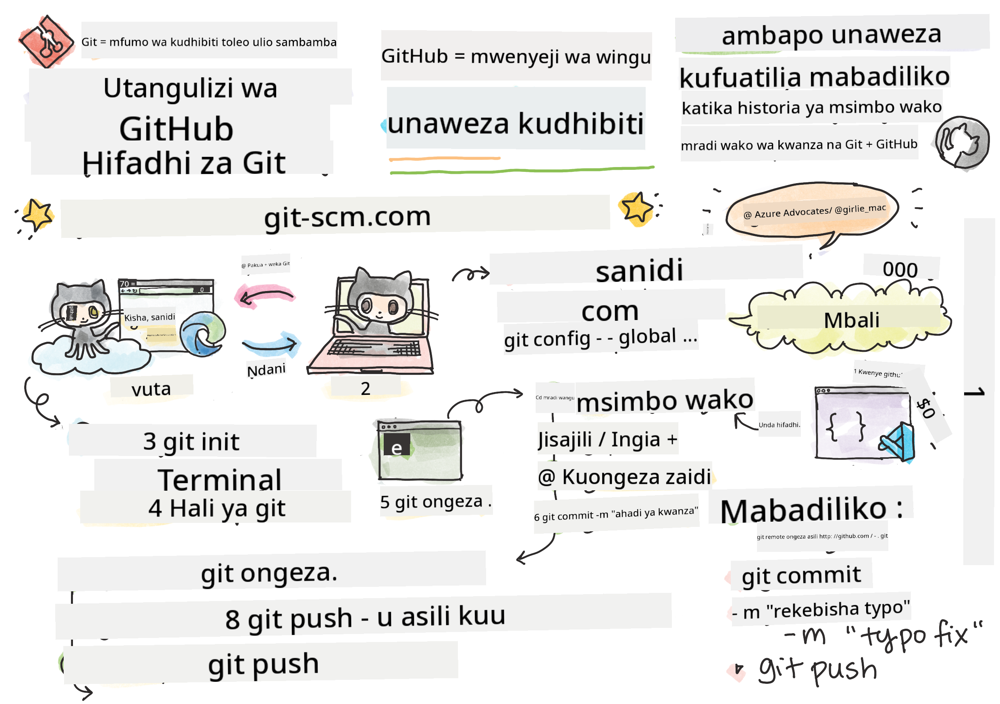
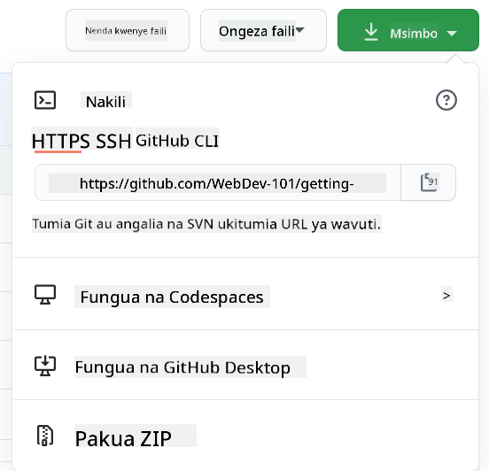

<!--
CO_OP_TRANSLATOR_METADATA:
{
  "original_hash": "05666cecb8983a72cf0ce1d18932b5b7",
  "translation_date": "2025-08-28T04:36:52+00:00",
  "source_file": "1-getting-started-lessons/2-github-basics/README.md",
  "language_code": "sw"
}
-->
# Utangulizi wa GitHub

Somo hili linashughulikia misingi ya GitHub, jukwaa la kuhifadhi na kusimamia mabadiliko ya msimbo wako.


> Sketchnote na [Tomomi Imura](https://twitter.com/girlie_mac)

## Jaribio Kabla ya Somo
[Jaribio kabla ya somo](https://ashy-river-0debb7803.1.azurestaticapps.net/quiz/3)

## Utangulizi

Katika somo hili, tutashughulikia:

- kufuatilia kazi unayofanya kwenye mashine yako
- kufanya kazi kwenye miradi na wengine
- jinsi ya kuchangia programu huria

### Mahitaji ya Awali

Kabla ya kuanza, hakikisha Git imewekwa. Katika terminal andika:  
`git --version`

Ikiwa Git haijawekwa, [pakua Git](https://git-scm.com/downloads). Kisha, weka wasifu wako wa Git wa ndani kwenye terminal:  
* `git config --global user.name "jina-lako"`
* `git config --global user.email "barua-pepe-yako"`

Ili kuthibitisha kama Git tayari imewekwa, unaweza kuandika:  
`git config --list`

Utahitaji pia akaunti ya GitHub, mhariri wa msimbo (kama Visual Studio Code), na ufungue terminal yako (au: command prompt).

Tembelea [github.com](https://github.com/) na unda akaunti ikiwa bado huna, au ingia na ujaze wasifu wako.

✅ GitHub si jukwaa pekee la kuhifadhi msimbo duniani; yapo mengine, lakini GitHub ndilo linalojulikana zaidi.

### Maandalizi

Utahitaji folda yenye mradi wa msimbo kwenye mashine yako ya ndani (laptop au PC), na hifadhi ya umma kwenye GitHub, ambayo itatumika kama mfano wa jinsi ya kuchangia kwenye miradi ya wengine.

---

## Usimamizi wa Msimbo

Tuseme una folda ya ndani yenye mradi wa msimbo na unataka kuanza kufuatilia maendeleo yako ukitumia git - mfumo wa kudhibiti matoleo. Watu wengine hulinganisha kutumia git na kuandika barua ya mapenzi kwa nafsi yako ya baadaye. Ukisoma ujumbe wako wa "commit" baada ya siku, wiki, au miezi, utaweza kukumbuka kwa nini ulifanya uamuzi fulani, au "kurudisha nyuma" mabadiliko - yaani, unapokuwa umeandika ujumbe mzuri wa "commit".

### Kazi: Unda Hifadhi na Uweke Msimbo  

> Tazama video  
>  
> [](https://www.youtube.com/watch?v=9R31OUPpxU4)

1. **Unda hifadhi kwenye GitHub**. Kwenye GitHub.com, katika kichupo cha hifadhi, au kutoka kwenye upau wa urambazaji juu-kulia, tafuta kitufe cha **new repo**.

   1. Pea hifadhi yako (folda) jina.
   1. Chagua **create repository**.

1. **Nenda kwenye folda yako ya kazi**. Katika terminal yako, badilisha hadi folda (inayojulikana pia kama saraka) unayotaka kuanza kufuatilia. Andika:

   ```bash
   cd [name of your folder]
   ```

1. **Anzisha hifadhi ya git**. Katika mradi wako andika:

   ```bash
   git init
   ```

1. **Angalia hali**. Ili kuangalia hali ya hifadhi yako andika:

   ```bash
   git status
   ```

   Matokeo yanaweza kuonekana kama haya:

   ```output
   Changes not staged for commit:
   (use "git add <file>..." to update what will be committed)
   (use "git checkout -- <file>..." to discard changes in working directory)

        modified:   file.txt
        modified:   file2.txt
   ```

   Kwa kawaida, amri ya `git status` inakuambia vitu kama faili gani ziko tayari _kuhifadhiwa_ kwenye hifadhi au zina mabadiliko unayoweza kutaka kuhifadhi.

1. **Ongeza faili zote kwa kufuatilia**  
   Hii pia inaitwa kuweka faili kwenye eneo la kusubiri.

   ```bash
   git add .
   ```

   Amri ya `git add` pamoja na hoja ya `.` inaonyesha kuwa faili zako zote na mabadiliko yako yameongezwa kwa kufuatilia.

1. **Ongeza faili zilizochaguliwa kwa kufuatilia**

   ```bash
   git add [file or folder name]
   ```

   Hii inatusaidia kuongeza faili zilizochaguliwa tu kwenye eneo la kusubiri wakati hatutaki kuhifadhi faili zote mara moja.

1. **Ondoa faili zote kutoka eneo la kusubiri**

   ```bash
   git reset
   ```

   Amri hii inatusaidia kuondoa faili zote kutoka eneo la kusubiri mara moja.

1. **Ondoa faili maalum kutoka eneo la kusubiri**

   ```bash
   git reset [file or folder name]
   ```

   Amri hii inatusaidia kuondoa faili maalum tu kutoka eneo la kusubiri mara moja ikiwa hatutaki kuijumuisha kwenye "commit" inayofuata.

1. **Hifadhi kazi yako**. Kwa sasa umeongeza faili kwenye eneo linaloitwa _staging area_. Mahali ambapo Git inafuatilia faili zako. Ili kufanya mabadiliko yawe ya kudumu unahitaji _kuhifadhi_ faili. Ili kufanya hivyo, unda _commit_ kwa kutumia amri ya `git commit`. _Commit_ inawakilisha hatua ya kuhifadhi katika historia ya hifadhi yako. Andika yafuatayo kuunda _commit_:

   ```bash
   git commit -m "first commit"
   ```

   Hii inahifadhi faili zako zote, ikiongeza ujumbe "first commit". Kwa ujumbe wa baadaye wa "commit" utataka kuwa na maelezo zaidi ili kueleza aina ya mabadiliko uliyofanya.

1. **Unganisha hifadhi yako ya Git ya ndani na GitHub**. Hifadhi ya Git ni nzuri kwenye mashine yako lakini wakati fulani utataka kuwa na nakala rudufu ya faili zako mahali pengine na pia kuwaalika watu wengine kufanya kazi na wewe kwenye hifadhi yako. Mahali pazuri pa kufanya hivyo ni GitHub. Kumbuka tayari tumeunda hifadhi kwenye GitHub kwa hivyo tunachohitaji kufanya ni kuunganisha hifadhi yetu ya Git ya ndani na GitHub. Amri ya `git remote add` itafanya hivyo. Andika amri ifuatayo:

   > Kumbuka, kabla ya kuandika amri, nenda kwenye ukurasa wa hifadhi yako ya GitHub ili kupata URL ya hifadhi. Utaitumia kwenye amri hapa chini. Badilisha ```https://github.com/username/repository_name.git``` na URL yako ya GitHub.

   ```bash
   git remote add origin https://github.com/username/repository_name.git
   ```

   Hii inaunda _remote_, au muunganisho, unaoitwa "origin" unaoelekeza kwenye hifadhi ya GitHub uliyounda awali.

1. **Tuma faili za ndani kwenda GitHub**. Hadi sasa umeunda _muunganisho_ kati ya hifadhi ya ndani na hifadhi ya GitHub. Hebu tutume faili hizi kwenda GitHub kwa kutumia amri ifuatayo `git push`, kama ifuatavyo:  
   
   > Kumbuka, jina la tawi lako linaweza kuwa tofauti kwa chaguo-msingi kutoka ```main```.

   ```bash
   git push -u origin main
   ```

   Hii inatuma "commit" zako kwenye tawi lako la "main" kwenda GitHub.

2. **Kuongeza mabadiliko zaidi**. Ikiwa unataka kuendelea kufanya mabadiliko na kuyasukuma kwenda GitHub utahitaji tu kutumia amri hizi tatu:

   ```bash
   git add .
   git commit -m "type your commit message here"
   git push
   ```

   > Kidokezo, unaweza pia kutaka kutumia faili ya `.gitignore` ili kuzuia faili ambazo hutaki kufuatilia zisionekane kwenye GitHub - kama faili ya maelezo unayohifadhi kwenye folda hiyo hiyo lakini haina nafasi kwenye hifadhi ya umma. Unaweza kupata violezo vya faili za `.gitignore` kwenye [.gitignore templates](https://github.com/github/gitignore).

#### Ujumbe wa Commit

Ujumbe mzuri wa Git commit unakamilisha sentensi ifuatayo:  
Ikiwa utatumika, commit hii itafanya <weka ujumbe wako hapa>

Kwa kichwa cha ujumbe tumia hali ya amri, wakati wa sasa: "badilisha" si "ilibadilishwa" wala "inabadilisha".  
Kama ilivyo kwenye kichwa, kwenye mwili (hiari) pia tumia hali ya amri, wakati wa sasa. Mwili unapaswa kujumuisha motisha ya mabadiliko na kulinganisha haya na tabia ya awali. Unaelezea `kwa nini`, si `jinsi`.

✅ Chukua dakika chache kuvinjari GitHub. Je, unaweza kupata ujumbe wa commit mzuri sana? Je, unaweza kupata ujumbe wa commit wa kawaida sana? Unafikiri ni taarifa gani muhimu zaidi na yenye manufaa kuwasilisha kwenye ujumbe wa commit?

### Kazi: Kushirikiana

Sababu kuu ya kuweka vitu kwenye GitHub ilikuwa kufanya iwezekane kushirikiana na waendelezaji wengine.

## Kufanya kazi kwenye miradi na wengine

> Tazama video  
>  
> [](https://www.youtube.com/watch?v=bFCM-PC3cu8)

Katika hifadhi yako, nenda kwenye `Insights > Community` ili kuona jinsi mradi wako unavyolinganishwa na viwango vya jamii vinavyopendekezwa.

   Hapa kuna mambo ambayo yanaweza kuboresha hifadhi yako ya GitHub:  
   - **Maelezo**. Je, umeongeza maelezo kwa mradi wako?  
   - **README**. Je, umeongeza README? GitHub hutoa mwongozo wa kuandika [README](https://docs.github.com/articles/about-readmes/?WT.mc_id=academic-77807-sagibbon).  
   - **Mwongozo wa kuchangia**. Je, mradi wako una [mwongozo wa kuchangia](https://docs.github.com/articles/setting-guidelines-for-repository-contributors/?WT.mc_id=academic-77807-sagibbon)?  
   - **Kanuni za Maadili**. [Kanuni za Maadili](https://docs.github.com/articles/adding-a-code-of-conduct-to-your-project/).  
   - **Leseni**. Labda muhimu zaidi, [leseni](https://docs.github.com/articles/adding-a-license-to-a-repository/).  

Rasilimali hizi zote zitafaidi wanachama wapya wa timu. Na haya ndiyo mambo ambayo kawaida wachangiaji wapya huangalia kabla hata ya kuangalia msimbo wako, ili kugundua kama mradi wako ni mahali sahihi pa kutumia muda wao.

✅ Faili za README, ingawa zinachukua muda kuandaa, mara nyingi hupuuzwa na waangalizi wenye shughuli nyingi. Je, unaweza kupata mfano wa README iliyoelezea vizuri sana? Kumbuka: kuna baadhi ya [zana za kusaidia kuunda README nzuri](https://www.makeareadme.com/) ambazo unaweza kupenda kujaribu.

### Kazi: Unganisha msimbo fulani

Nyaraka za kuchangia husaidia watu kuchangia mradi. Inaelezea aina gani za michango unayotafuta na jinsi mchakato unavyofanya kazi. Wachangiaji watahitaji kupitia hatua kadhaa ili waweze kuchangia kwenye hifadhi yako kwenye GitHub:

1. **Kufork hifadhi yako**. Labda utataka watu _wafork_ mradi wako. Kufork kunamaanisha kuunda nakala ya hifadhi yako kwenye wasifu wao wa GitHub.  
1. **Clone**. Kutoka hapo wata-clone mradi kwenye mashine yao ya ndani.  
1. **Unda tawi**. Utataka kuwaomba waunde _tawi_ kwa kazi yao.  
1. **Lenga mabadiliko yao kwenye eneo moja**. Waombe wachangiaji kulenga michango yao kwenye jambo moja kwa wakati mmoja - kwa njia hiyo nafasi ya kuweza _kuunganisha_ kazi yao ni kubwa zaidi. Fikiria wanaandika marekebisho ya hitilafu, kuongeza kipengele kipya, na kusasisha majaribio kadhaa - je, ikiwa unataka, au unaweza kutekeleza 2 kati ya 3, au 1 kati ya 3 mabadiliko?

✅ Fikiria hali ambapo matawi ni muhimu sana kwa kuandika na kusafirisha msimbo mzuri. Unaweza kufikiria matumizi gani?

> Kumbuka, kuwa mabadiliko unayotaka kuona duniani, na uunde matawi kwa kazi yako mwenyewe pia. Mabadiliko yoyote unayofanya yatafanywa kwenye tawi ambalo umechagua kwa sasa. Tumia `git status` kuona ni tawi gani hilo.

Hebu tupitie mtiririko wa mchango. Fikiria mchangiaji tayari ame-_fork_ na _clone_ hifadhi kwa hivyo wana hifadhi ya Git tayari kwa kazi, kwenye mashine yao ya ndani:

1. **Unda tawi**. Tumia amri `git branch` kuunda tawi ambalo litakuwa na mabadiliko wanayokusudia kuchangia:

   ```bash
   git branch [branch-name]
   ```

1. **Badilisha hadi tawi la kazi**. Badilisha hadi tawi maalum na usasishe saraka ya kazi kwa `git switch`:

   ```bash
   git switch [branch-name]
   ```

1. **Fanya kazi**. Kwa wakati huu unataka kuongeza mabadiliko yako. Usisahau kumwambia Git kuhusu hilo kwa kutumia amri zifuatazo:

   ```bash
   git add .
   git commit -m "my changes"
   ```

   Hakikisha unatoa jina zuri kwa commit yako, kwa manufaa yako na pia kwa mwangalizi wa hifadhi unayesaidia.

1. **Unganisha kazi yako na tawi la `main`**. Wakati fulani unamaliza kazi na unataka kuunganisha kazi yako na ile ya tawi la `main`. Tawi la `main` linaweza kuwa limebadilika wakati huo kwa hivyo hakikisha kwanza unasasisha hadi la hivi karibuni kwa kutumia amri zifuatazo:

   ```bash
   git switch main
   git pull
   ```

   Kwa wakati huu unataka kuhakikisha kuwa mizozo yoyote, hali ambapo Git haiwezi _kuunganisha_ mabadiliko kwa urahisi, inatokea kwenye tawi lako la kazi. Kwa hivyo endesha amri zifuatazo:

   ```bash
   git switch [branch_name]
   git merge main
   ```

   Hii italeta mabadiliko yote kutoka `main` kwenye tawi lako na kwa matumaini utaweza kuendelea. Ikiwa sivyo, VS Code itakuonyesha mahali ambapo Git _imechanganyikiwa_ na unarekebisha faili zilizoathiriwa ili kusema ni maudhui gani yaliyo sahihi zaidi.

1. **Tuma kazi yako kwenda GitHub**. Kutuma kazi yako kwenda GitHub kunamaanisha mambo mawili. Kusukuma tawi lako kwenye hifadhi yako na kisha kufungua PR, Pull Request.

   ```bash
   git push --set-upstream origin [branch-name]
   ```

   Amri hapo juu inaunda tawi kwenye hifadhi yako ya forked.

1. **Fungua PR**. Hatua inayofuata ni kufungua PR. Unaifanya kwa kwenda kwenye hifadhi yako ya forked kwenye GitHub. Utaona kiashiria kwenye GitHub kinachokuuliza ikiwa unataka kuunda PR mpya, bonyeza hiyo na utaelekezwa kwenye kiolesura ambapo unaweza kubadilisha kichwa cha ujumbe wa commit, kutoa maelezo yanayofaa zaidi. Sasa mwangalizi wa hifadhi uliyofork ataona PR hii na _vidole vimevukwa_ wataithamini na _kuunganisha_ PR yako. Sasa wewe ni mchangiaji, hongera :)

1. **Safisha**. Inachukuliwa kuwa ni mazoea mazuri _kusafisha_ baada ya kufanikiwa kuunganisha PR. Unataka kusafisha tawi lako la ndani na tawi ulilosukuma kwenda GitHub. Kwanza, futa tawi hilo kwa ndani kwa kutumia amri ifuatayo:

   ```bash
   git branch -d [branch-name]
   ```
Hakikisha unaenda kwenye ukurasa wa GitHub wa repo uliyo-fork na uondoe tawi la remote ambalo umesukuma kwake.

`Pull request` inaonekana kama neno la ajabu kwa sababu kwa kweli unataka kusukuma mabadiliko yako kwenye mradi. Lakini msimamizi (mmiliki wa mradi) au timu ya msingi inahitaji kuzingatia mabadiliko yako kabla ya kuyachanganya na tawi la "main" la mradi, kwa hivyo kwa kweli unatoa ombi la uamuzi wa mabadiliko kutoka kwa msimamizi.

Pull request ni mahali pa kulinganisha na kujadili tofauti zilizotolewa kwenye tawi kwa kutumia ukaguzi, maoni, majaribio yaliyojumuishwa, na zaidi. Pull request nzuri inafuata takriban sheria sawa na ujumbe wa commit. Unaweza kuongeza rejea kwa tatizo kwenye tracker ya masuala, pale ambapo kazi yako kwa mfano inatatua tatizo. Hii inafanyika kwa kutumia `#` ikifuatiwa na namba ya tatizo lako. Kwa mfano `#97`.

🤞Kidole kimoja juu kwamba ukaguzi wote unapita na mmiliki wa mradi wanachanganya mabadiliko yako kwenye mradi🤞

Sasisha tawi lako la kazi la ndani na commits zote mpya kutoka kwenye tawi la remote linalolingana kwenye GitHub:

`git pull`

## Jinsi ya kuchangia kwenye open source

Kwanza, tafuta repo kwenye GitHub inayokuvutia na ambayo ungependa kuchangia mabadiliko. Utataka kunakili maudhui yake kwenye mashine yako.

✅ Njia nzuri ya kupata repo za 'rafiki kwa wanaoanza' ni [kutafuta kwa tag 'good-first-issue'](https://github.blog/2020-01-22-browse-good-first-issues-to-start-contributing-to-open-source/).



Kuna njia kadhaa za kunakili code. Njia moja ni "kufanya clone" ya maudhui ya repo, kwa kutumia HTTPS, SSH, au GitHub CLI (Command Line Interface).

Fungua terminal yako na fanya clone ya repo kama hivi:
`git clone https://github.com/ProjectURL`

Ili kufanya kazi kwenye mradi, nenda kwenye folda sahihi:
`cd ProjectURL`

Unaweza pia kufungua mradi mzima kwa kutumia [Codespaces](https://github.com/features/codespaces), mhariri wa code wa GitHub / mazingira ya maendeleo ya wingu, au [GitHub Desktop](https://desktop.github.com/).

Mwisho, unaweza kupakua code kwenye folda iliyobanwa (zipped).

### Mambo machache ya kuvutia kuhusu GitHub

Unaweza ku-star, ku-watch, na/au "fork" repo yoyote ya umma kwenye GitHub. Unaweza kupata repo zako ulizo-star kwenye menyu ya kushuka juu kulia. Ni kama kuweka alama ya kurasa, lakini kwa code.

Miradi ina tracker ya masuala, mara nyingi kwenye GitHub katika tab ya "Issues" isipokuwa imeonyeshwa vinginevyo, ambapo watu wanajadili masuala yanayohusiana na mradi. Na tab ya Pull Requests ni mahali ambapo watu wanajadili na kukagua mabadiliko yanayoendelea.

Miradi inaweza pia kuwa na majadiliano kwenye majukwaa, orodha za barua pepe, au njia za mazungumzo kama Slack, Discord au IRC.

✅ Angalia repo yako mpya ya GitHub na jaribu mambo kadhaa, kama kuhariri mipangilio, kuongeza maelezo kwenye repo yako, na kuunda mradi (kama bodi ya Kanban). Kuna mengi unaweza kufanya!

---

## 🚀 Changamoto

Shirikiana na rafiki kufanya kazi kwenye code ya kila mmoja. Unda mradi kwa pamoja, fanya fork ya code, unda matawi, na changanya mabadiliko.

## Jaribio la Baada ya Somo
[Jaribio la baada ya somo](https://ashy-river-0debb7803.1.azurestaticapps.net/quiz/4)

## Mapitio na Kujisomea

Soma zaidi kuhusu [kuchangia kwenye programu za open source](https://opensource.guide/how-to-contribute/#how-to-submit-a-contribution).

[Git cheatsheet](https://training.github.com/downloads/github-git-cheat-sheet/).

Fanya mazoezi, mazoezi, mazoezi. GitHub ina njia nzuri za kujifunza zinazopatikana kupitia [skills.github.com](https://skills.github.com):

- [Wiki ya Kwanza kwenye GitHub](https://skills.github.com/#first-week-on-github)

Pia utapata kozi za hali ya juu zaidi.

## Kazi

Kamilisha [kozi ya Wiki ya Kwanza kwenye GitHub](https://skills.github.com/#first-week-on-github)

---

**Kanusho**:  
Hati hii imetafsiriwa kwa kutumia huduma ya tafsiri ya AI [Co-op Translator](https://github.com/Azure/co-op-translator). Ingawa tunajitahidi kuhakikisha usahihi, tafsiri za kiotomatiki zinaweza kuwa na makosa au kutokuwa sahihi. Hati ya asili katika lugha yake ya awali inapaswa kuchukuliwa kama chanzo cha mamlaka. Kwa taarifa muhimu, tafsiri ya kitaalamu ya binadamu inapendekezwa. Hatutawajibika kwa kutoelewana au tafsiri zisizo sahihi zinazotokana na matumizi ya tafsiri hii.